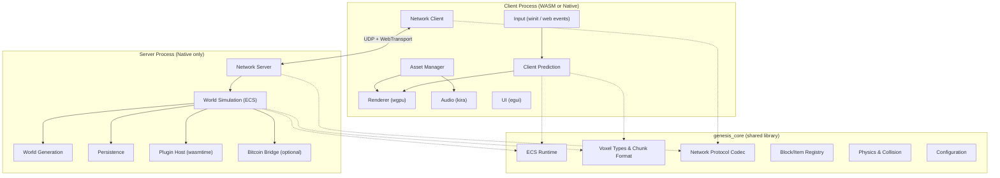
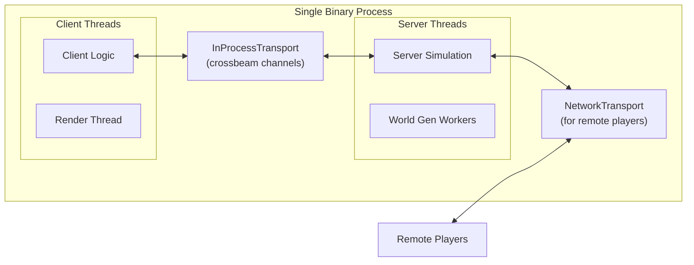
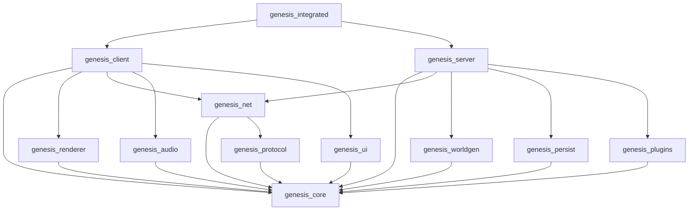
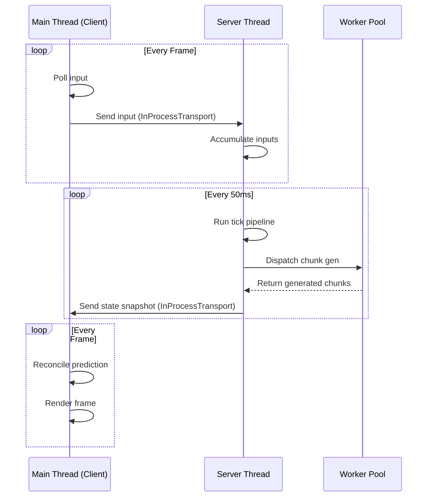
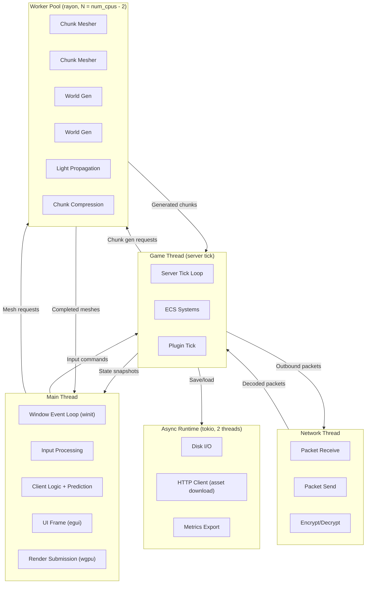
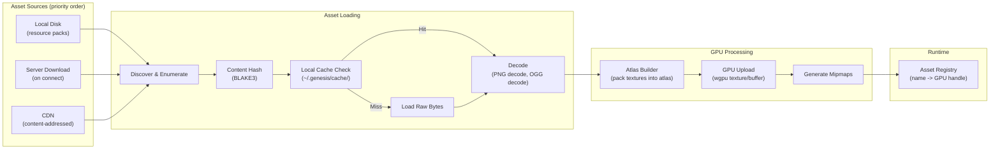

# Spec 01: Engine Architecture

**Status**: Draft
**Date**: 2026-03-03
**Addendum**: `_audit-2026-04-18.md` — §4.1 tick order and input-processing
phase boundaries diverge from current `GameServer::tick`; server-driven
physics for remote players landed in Task 1d. Fold into this doc on the next
spec-editing pass.
**Depends on**: ADR-001 (Full Custom Engine), ADR-002 (Tech Stack)

> **AS-BUILT (audit 2026-10-04).** This document describes the *as-designed* destination. The shipped engine is **one crate**, `game/engine` (library `axenstax_engine` plus a thin binary shim), not the 12-crate workspace sketched below. Dependency versions are those in `game/engine/Cargo.toml` (wgpu 29, glam 0.33, winit 0.30, egui 0.34, quinn 0.11, rodio 0.20), not the versions named in the later sections. **There is no `wasmtime` plugin host in the build** (no WASM plugin runtime is a dependency); §8 is design only. The §2 "Current Implementation" module table is a historical snapshot (earliest prototype); the real module list is `game/engine/src/`.

---

## 1. System Overview

Axe'n'Stax is a full-custom voxel sandbox engine written in Rust. A single codebase compiles to four distinct artifacts: a WASM+WebGPU web client, a native desktop client (Vulkan/Metal/DX12), a headless dedicated server, and an integrated single-binary (client+server in one process). The engine is server-authoritative. Worlds are independent shard instances, not a single mega-world. Bitcoin/Lightning integration is a feature flag, not an architectural dependency.

### 1.1 High-Level Architecture



### 1.2 Integrated (Single-Binary) Mode

In single-binary mode, the client and server run in the same OS process but in separate thread groups. They communicate over an in-process channel that implements the same `Transport` trait as the network layer, avoiding serialization overhead for the local connection while maintaining identical code paths for simulation and prediction. A remote player connecting to this instance uses real networking; only the local player gets the in-process fast path.



---

## 2. Module Boundaries

#### Current Implementation (Prototype — Single Crate)

The prototype is a single crate (`axenstax-engine`) with these modules. Since
2026-10-03 it is a **library plus a thin binary shim** (see §3.2 "Entry points"):

| Module | Purpose |
|--------|---------|
| `lib.rs` | Crate root: game loop, state machine (Menu/Playing/Paused), chunk streaming; `pub fn run()` (desktop) and `android_main` (Android) |
| `main.rs` | Desktop shim — calls `axenstax_engine::run()`; nothing else |
| `renderer.rs` | wgpu pipelines (chunk, water, entity, wire, crosshair), HUD, menu render |
| `shader.wgsl` | Vertex/fragment shaders (textured + lit + fog) |
| `overlay.wgsl` | Crosshair/wireframe/HUD shaders (2D + 3D colored) |
| `mesh.rs` | Greedy chunk meshing, Vertex format |
| `world.rs` | Chunk HashMap, terrain generation, tree placement |
| `chunk.rs` | 16³ block storage, serialize/deserialize |
| `block.rs` | Block registry (14 types), per-face textures |
| `texture_gen.rs` | Procedural 16×16 textures (15 block + 18 mob = 34 layers) |
| `biome.rs` | 5 biomes, noise-based terrain height + cave carving |
| `physics.rs` | Player physics (Minecraft-style momentum, AABB collision) |
| `camera.rs` | FPS camera (yaw/pitch, view/projection matrices) |
| `input.rs` | Keyboard/mouse state, double-tap flight, hotbar selection |
| `raycast.rs` | DDA ray casting for block targeting |
| `inventory.rs` | 36-slot inventory (9 hotbar + 27 main) |
| `audio.rs` | Procedural sound (footsteps, break, place) via rodio |
| `water.rs` | BFS water spread/retract, source tracking |
| `leaf_decay.rs` | BFS leaf support check, staggered decay |
| `entity.rs` | hecs ECS components, entity physics, spawn helpers, player-entity collision |
| `entity_model.rs` | Multi-cuboid mob models, per-face textures, walk animation |
| `mob.rs` | MobType enum, MobDef (size, colour, health, speed) |
| `mob_ai.rs` | AI state machine (Idle/Wander/Chase), direct-line movement |
| `combat.rs` | Health, melee damage, knockback, death/respawn, hostile-mob contact damage |
| `save.rs` | World save/load (bincode metadata + raw chunk bytes) |
| `menu.rs` | Main menu (world list) + pause menu (resume/save/quit/delete) |
| `font.rs` | 5×7 bitmap font, text-to-quad rendering |
| `chat_ui.rs` | In-game chat overlay (egui) — output log + input field, focus + history |
| `commands/` | Slash-command system (parser, registry, dispatcher, built-ins). Plugin-shaped — registry/parser/UI are game-agnostic. Spec: `docs/foundations/2026-05-07-engine-commands.md` |

Dependencies (as of 2026-10-04, `game/engine/Cargo.toml`): wgpu 29, winit 0.30, glam 0.33, hecs 0.10, serde 1, bincode 1, ahash 0.8, noise 0.9, rodio 0.20, image 0.25, bytemuck 1, quinn 0.11, egui 0.34.

The production architecture below describes the multi-crate workspace this will evolve into.

The engine is organized as a Cargo workspace. Each module is a separate crate with explicit dependency direction. No circular dependencies. Dependency flows downward; higher-level crates depend on lower-level ones, never the reverse.

### 2.1 Crate Dependency Graph



### 2.2 Crate Definitions

#### `genesis_core`
The foundational crate. No platform-specific code. No I/O. Pure logic and types.

**Owns:**
- ECS runtime (entity storage, component storage, system scheduler)
- Block and item registry (type IDs, properties, state machine definitions)
- Chunk data structures (`Chunk`, `ChunkSection`, `PalettedContainer`)
- Coordinate types (`BlockPos`, `ChunkPos`, `WorldPos`) and conversions
- Physics primitives (AABB, ray casting, collision detection against voxel geometry)
- Game tick types (`Tick`, `TickDelta`, `TickSchedule`)
- Shared constants (chunk size = 16x16x16 sections, world height, etc.)
- `Registry<T>` — typed registry for blocks, items, biomes, recipes
- `VoxelWorld` trait — abstract read/write interface to block data

**Public API surface:**
```rust
// Illustrative, not exhaustive
pub struct World { /* ECS world */ }
pub struct Chunk { sections: [ChunkSection; WORLD_HEIGHT_SECTIONS] }
pub struct PalettedContainer<T> { /* ... */ }
pub struct BlockPos { x: i32, y: i32, z: i32 }
pub struct ChunkPos { x: i32, z: i32 }
pub trait VoxelAccess {
    fn get_block(&self, pos: BlockPos) -> BlockId;
    fn set_block(&mut self, pos: BlockPos, block: BlockId) -> BlockId;
}
pub struct Registry<T: RegistryEntry> { /* ... */ }
pub type BlockId = u16; // 65535 block types, 0 = air
pub type ItemId = u16;
```

#### `genesis_protocol`
Wire protocol definitions. Codec only, no I/O.

**Owns:**
- Packet definitions (all client-to-server and server-to-client messages)
- Serialization/deserialization using `rkyv` (zero-copy deserialization for hot paths) with `serde` fallback for debug tooling
- Protocol versioning (version byte in handshake, backward-compatible field additions)
- Delta compression types for chunk data and entity state
- Bandwidth budget constants

**Public API surface:**
```rust
pub enum ClientPacket {
    Handshake { protocol_version: u32, player_name: String },
    PlayerMove { pos: Vec3, yaw: f32, pitch: f32, tick: Tick },
    BlockAction { pos: BlockPos, action: BlockActionKind },
    ChatMessage { content: String },
    // ...
}
pub enum ServerPacket {
    HandshakeResponse { status: HandshakeStatus, server_tick: Tick },
    ChunkData { pos: ChunkPos, data: CompressedChunkData },
    EntitySpawn { entity_id: EntityId, kind: EntityKind, pos: Vec3 },
    EntityUpdate { updates: Vec<EntityDelta> },
    BlockChange { pos: BlockPos, new_block: BlockId },
    // ...
}
pub trait PacketCodec {
    fn encode(&self, buf: &mut BytesMut);
    fn decode(buf: &mut BytesMut) -> Result<Self, DecodeError>;
}
```

#### `genesis_net`
Transport layer. Handles connection lifecycle, reliability, ordering, encryption.

**Owns:**
- UDP transport (native) using raw sockets with custom reliability layer
- WebTransport (WASM) for browser clients
- `Transport` trait — abstraction over UDP, WebTransport, and in-process channels
- Connection state machine (connecting, authenticating, connected, disconnecting)
- Packet fragmentation and reassembly (MTU-aware)
- Reliability layer: unreliable (position updates), reliable-ordered (block changes, chat), reliable-unordered (chunk data)
- Encryption: Noise protocol (snow crate) for native, TLS via WebTransport for web
- Bandwidth throttling and congestion control
- Packet batching (coalesce small packets into frames, flush per tick)

**Does NOT own:** Packet content definitions (that is `genesis_protocol`), game logic.

**Public API surface:**
```rust
pub trait Transport: Send + Sync {
    fn send(&self, peer: PeerId, packet: &[u8], channel: Channel) -> Result<()>;
    fn recv(&self) -> Option<(PeerId, Vec<u8>, Channel)>;
    fn connected_peers(&self) -> &[PeerId];
    fn disconnect(&self, peer: PeerId, reason: DisconnectReason);
}
pub enum Channel {
    Unreliable,
    ReliableOrdered,
    ReliableUnordered,
}
pub struct UdpTransport { /* ... */ }
pub struct WebTransport { /* ... */ }
pub struct InProcessTransport { /* ... */ }
```

#### `genesis_renderer`
All GPU work. Native and WASM, both through `wgpu`.

**Owns:**
- GPU device initialization and surface management
- Chunk mesh generation (greedy meshing algorithm, runs on worker threads, produces vertex buffers)
- Texture atlas construction (runtime-built from individual textures, resolution-agnostic)
- Block face culling (only emit faces adjacent to transparent/air blocks)
- Sky rendering (procedural sky dome, sun/moon, day-night cycle)
- Entity rendering (billboard sprites or simple voxel models)
- Particle system
- Post-processing (fog, ambient occlusion — screen-space)
- Debug overlays (wireframe chunks, physics AABBs, F3-style debug info)
- Camera management (projection, view matrix, frustum)
- Render graph (orders passes, manages transient resources)

**Does NOT own:** Game state, input handling, window creation (that is `genesis_client` via `winit`).

**Public API surface:**
```rust
pub struct Renderer { /* ... */ }
impl Renderer {
    pub fn new(device: &wgpu::Device, queue: &wgpu::Queue, config: &RenderConfig) -> Self;
    pub fn resize(&mut self, width: u32, height: u32);
    pub fn update_chunk_mesh(&mut self, pos: ChunkPos, mesh: ChunkMesh);
    pub fn remove_chunk_mesh(&mut self, pos: ChunkPos);
    pub fn set_camera(&mut self, camera: &Camera);
    pub fn set_time_of_day(&mut self, time: f32);
    pub fn render(&mut self, frame: &wgpu::SurfaceTexture, world_state: &RenderSnapshot);
}
pub struct ChunkMesh {
    pub opaque_vertices: Vec<PackedVertex>,
    pub transparent_vertices: Vec<PackedVertex>,
}
/// 8 bytes per vertex: position (3x u8 local), normal (u8 packed), uv (2x u16), light (u8), ao (u8)
pub struct PackedVertex { data: [u8; 8] }
```

#### `genesis_audio`
Sound playback. Uses `kira` for native, Web Audio API via `wasm-bindgen` for WASM.

**Owns:**
- Spatial audio (3D positioned sounds attenuated by distance)
- Ambient soundscapes (biome-based)
- Block interaction sounds (place, break, step)
- Music playback (background tracks, crossfading)
- Sound registry (maps sound event IDs to audio assets)

**Public API surface:**
```rust
pub struct AudioEngine { /* ... */ }
impl AudioEngine {
    pub fn play_spatial(&mut self, sound: SoundId, pos: Vec3, volume: f32);
    pub fn play_ambient(&mut self, sound: SoundId, volume: f32);
    pub fn set_listener(&mut self, pos: Vec3, forward: Vec3, up: Vec3);
    pub fn update(&mut self, dt: f32);
}
```

#### `genesis_ui`
User interface. Uses `egui` for immediate-mode GUI, rendered through `egui-wgpu`.

**Owns:**
- HUD (hotbar, health, hunger, crosshair)
- Inventory screens
- Chat window
- Settings menus
- Server browser / world selector
- Debug overlay (F3 screen)
- Main menu, pause menu

**Does NOT own:** Rendering pipeline (passes egui draw lists to the renderer).

#### `genesis_worldgen`
Procedural world generation. CPU-intensive, runs on worker threads.

**Owns:**
- Terrain generation (noise-based heightmap, 3D density for caves/overhangs)
- Biome placement and blending
- Structure generation (trees, villages, ores, caves, dungeons)
- Decoration passes (flowers, grass, underwater plants)
- Light propagation (initial sunlight + block light for newly generated chunks)
- World seed management
- Generator registry (pluggable generators, plugins can register custom generators)

**Key crate dependencies:** `noise` (for coherent noise), `fastrand` (deterministic RNG from seed).

**Public API surface:**
```rust
pub trait WorldGenerator: Send + Sync {
    fn generate_chunk(&self, pos: ChunkPos, seed: u64) -> Chunk;
    fn get_biome(&self, pos: BlockPos) -> BiomeId;
}
pub struct DefaultGenerator { /* ... */ }
```

#### `genesis_persist`
World persistence and snapshots. Server-side only.

**Owns:**
- Chunk serialization (region file format, inspired by Minecraft's Anvil but custom)
- Region files: each file covers 32x32 chunks, header + compressed chunk data
- Player data persistence (inventory, position, stats)
- World metadata (seed, spawn point, tick count, game rules)
- Snapshot/backup lifecycle (periodic full snapshots to object storage)
- Pluggable storage backends: local filesystem (default), S3-compatible object storage (production)

**Public API surface:**
```rust
pub trait WorldStorage: Send + Sync {
    fn load_chunk(&self, pos: ChunkPos) -> Result<Option<Chunk>>;
    fn save_chunk(&self, pos: ChunkPos, chunk: &Chunk) -> Result<()>;
    fn save_player(&self, id: PlayerId, data: &PlayerData) -> Result<()>;
    fn load_player(&self, id: PlayerId) -> Result<Option<PlayerData>>;
    fn flush(&self) -> Result<()>;
}
pub struct RegionFileStorage { /* local disk */ }
pub struct S3Storage { /* S3-compatible */ }
```

#### `genesis_plugins`
WASM-based plugin runtime. Server-side only (initially).

**Owns:**
- WASM module loading and instantiation (`wasmtime`)
- Plugin API (host functions exposed to WASM guests)
- Capability-based permission system
- Plugin lifecycle (load, init, tick, shutdown)
- Event dispatch to plugins
- Resource limits (memory, CPU time per tick, fuel metering)

**Detailed in Section 8.**

#### `genesis_client`
The client application. Glues input, networking, prediction, rendering, audio, and UI.

**Owns:**
- Window creation and event loop (`winit` for native, `web-sys` for WASM)
- Input mapping (keyboard, mouse, gamepad -> game actions)
- Client-side prediction (local player movement predicted, reconciled on server correction)
- Entity interpolation (remote entities smoothly interpolated between server snapshots)
- Chunk request scheduling (which chunks to request based on player position and view distance)
- Client state machine (main menu, connecting, loading, playing, disconnected)

#### `genesis_server`
The dedicated server binary. No rendering, no audio, no window.

**Owns:**
- Server tick loop (fixed timestep)
- Player connection management (accept, authenticate, session lifecycle)
- World simulation orchestration (tick all systems)
- Chunk streaming to clients (priority queue based on distance, frustum)
- Anti-cheat validation (server-authoritative position checks, action rate limits)
- Server commands (console, RCON-style)
- Graceful shutdown (save all chunks, notify players, flush persistence)

> **Spec 48 (Electricity) — added tick subsystems (2026-06-17):** "tick all systems" now
> includes the **block-update scheduler** (`block_update.rs` — a deduped neighbour-notify
> queue + absolute-tick scheduled updates, bounded per tick, the redstone-style update
> primitive) and the **power tick** (`power.rs::power_tick`, ordered *after* entity physics
> and *before* carts so powered-rail state is current when a cart rolls). Both run identically
> on the single-player `GameState::tick` path. Design: `docs/foundations/2026-06-17-electricity-power-logic.md`.

#### `genesis_integrated`
Single binary that embeds both client and server.

**Owns:**
- Process bootstrap (start server threads, then client threads)
- In-process transport wiring
- Shared resource management (both client and server access world data, server is authoritative)
- "Open to LAN" functionality (bind network transport for remote players)

---

## 3. Build Targets

### 3.1 Target Matrix

| Artifact | Cargo Target | Platform | Graphics | Networking | Use Case |
|---|---|---|---|---|---|
| `genesis-client` | `--bin genesis-client` | Native (x86_64, aarch64) | wgpu -> Vulkan/Metal/DX12 | UDP (raw sockets) | Desktop player |
| `genesis-client-web` | `--bin genesis-client --target wasm32-unknown-unknown` | WASM | wgpu -> WebGPU | WebTransport | Browser player |
| `genesis-server` | `--bin genesis-server` | Native (x86_64, aarch64) | None | UDP (raw sockets) | Dedicated headless server |
| `genesis` | `--bin genesis` | Native (x86_64, aarch64) | wgpu -> Vulkan/Metal/DX12 | UDP + in-process | Personal single-binary |

### 3.2 Conditional Compilation Strategy

Feature flags and target-conditional code are used to produce all artifacts from one codebase. The guiding principle: **shared logic lives in `genesis_core`** with no platform-specific code. Platform differences are isolated behind traits.

#### Cargo Feature Flags

```toml
# genesis_core/Cargo.toml — no platform features, always builds clean
[features]
default = []

# genesis_net/Cargo.toml
[features]
default = ["native"]
native = ["socket2"]           # Raw UDP sockets
web = ["web-sys", "js-sys"]    # WebTransport via browser APIs
in-process = ["crossbeam-channel"]  # For integrated binary

# genesis_renderer/Cargo.toml
[features]
default = ["native"]
native = ["wgpu/vulkan-portability", "wgpu/metal", "wgpu/dx12"]
web = ["wgpu/webgpu"]

# genesis_audio/Cargo.toml
[features]
default = ["native"]
native = ["kira"]
web = ["web-sys/AudioContext"]

# genesis_client/Cargo.toml
[features]
default = ["native"]
native = ["genesis_renderer/native", "genesis_net/native", "genesis_audio/native", "winit"]
web = ["genesis_renderer/web", "genesis_net/web", "genesis_audio/web", "web-sys"]

# genesis_server/Cargo.toml
[features]
default = []
bitcoin = ["genesis_bitcoin"]  # Optional Bitcoin bridge
```

#### Platform Abstraction via Traits

```rust
// genesis_net/src/transport.rs
pub trait Transport: Send + Sync {
    fn send(&self, peer: PeerId, data: &[u8], channel: Channel) -> Result<()>;
    fn recv(&self) -> Option<(PeerId, Vec<u8>, Channel)>;
    // ...
}

// Compile-time selection:
#[cfg(feature = "native")]
mod udp_transport;   // implements Transport over raw UDP

#[cfg(feature = "web")]
mod web_transport;   // implements Transport over WebTransport API

#[cfg(feature = "in-process")]
mod local_transport; // implements Transport over crossbeam channels
```

#### WASM-Specific Considerations

- **No threads in WASM** (until widespread `SharedArrayBuffer` support): chunk meshing and world gen requests are sent to the server; the client does not generate chunks.
- **No filesystem in WASM**: all asset loading goes through HTTP fetch.
- **Async runtime**: `wasm-bindgen-futures` replaces `tokio` for the web client. Server never targets WASM.
- **Entry point**: `#[wasm_bindgen(start)]` replaces `fn main()` for the web build. A thin `web_main.rs` calls into the same `genesis_client::run()` function.

#### Entry points (current implementation, 2026-10-03)

The engine crate is `[lib] name = "axenstax_engine"`, `crate-type = ["rlib", "cdylib"]`,
with all code under `src/lib.rs`. One source tree, three entry points:

| Target | Entry | Built by |
|---|---|---|
| Desktop (Linux/Windows/macOS) | `src/main.rs` shim → `axenstax_engine::run()` | `cargo build` / cargo-packager |
| Web (wasm32) | `#[wasm_bindgen(start)]` in `web_main.rs` (the cdylib) | Trunk, `index.html` uses `data-target-name="axenstax_engine"` — **never `data-bin`**, which builds the shim and yields an engine-less ~1.5 MB wasm |
| Android (aarch64-linux-android) | `#[unsafe(no_mangle)] android_main(AndroidApp)` in `lib.rs`; `NativeActivity` dlopen()s `libaxenstax_engine.so` | `tools/packaging/android/build-apk.sh` (cargo-ndk → aapt2 → zipalign → apksigner, no Gradle) |

`run()` and `android_main` share `native_boot_services()` and `drive_event_loop()`
so desktop and Android cannot drift. Tests are library tests: `cargo test --lib`
(`--bin` runs zero tests and still passes — `check.sh` guards against that).

#### Android-Specific Considerations

- **Data root.** There is no `$HOME`; `android_main` calls `data_dir::init_at(app.internal_data_path())` and also sets the CWD there (a backstop for older CWD-relative paths — an Android process starts at `/`, which is not writable).
- **No updater.** `android_main` never starts the update check or the in-place updater; there is no APK self-update path. Updates come from the distribution channel (sideload / store).
- **No file dialogs.** `rfd` has no Android backend and is excluded from the Android dependency graph; `native_file_dialog` is a BRIDGE stub returning a kid-readable error until a SAF/JNI bridge exists.
- **No gamepads.** gilrs has no Android backend; `GamepadSystem` holds `Option<Gilrs>` and a missing backend degrades to "no gamepads" (this also removed a latent desktop panic).
- **Link flag.** oboe (via cpal) compiles C++ and cargo-ndk omits libc++abi, so every Android build needs `RUSTFLAGS=-Clink-arg=-lc++abi` (set by `build-apk.sh`; `.cargo/config.toml` is gitignored).
- **Touch, Back, surface loss** — see Spec 05 "Touch platforms + Android" and Spec 03 §1.7.

### 3.3 Build Commands

```bash
# Native desktop client
cargo build --release --bin genesis-client

# WASM web client (requires wasm-pack or cargo build + wasm-bindgen CLI)
wasm-pack build game/client --target web --features web --no-default-features

# Headless dedicated server
cargo build --release --bin genesis-server

# Headless server with Bitcoin support
cargo build --release --bin genesis-server --features bitcoin

# Single integrated binary
cargo build --release --bin genesis

# Docker image for production server
docker build -f infra/docker/Dockerfile.server -t genesis-server:latest .
```

---

## 4. Tick Architecture

### 4.1 Server Tick (Fixed Timestep)

The server simulation runs at a fixed tick rate of **20 ticks per second** (50ms per tick). This matches industry convention for voxel games and provides a good balance between responsiveness and bandwidth.

Every tick, the server executes the following pipeline in order:

```
┌─────────────────────────────────────────────────────────────────┐
│ Server Tick Pipeline (50ms budget)                              │
│                                                                 │
│ 1. Network Recv     — drain inbound packets from all clients    │
│ 2. Input Processing — validate and apply player actions         │
│ 3. World Simulation — run ECS systems:                          │
│    a. Physics (gravity, movement, collision)                    │
│    b. Block updates (redstone-like, fluids, growth)             │
│    c. Entity AI (mob behavior trees)                            │
│    d. Scheduled ticks (block tick queue)                        │
│    e. Plugin tick callbacks                                     │
│ 4. World Gen Check  — dispatch pending chunk gen to workers     │
│ 5. State Snapshot   — capture delta for this tick               │
│ 6. Network Send     — broadcast entity updates, block changes   │
│ 7. Persistence      — async flush dirty chunks (non-blocking)   │
│ 8. Metrics          — record tick duration, entity count, etc.  │
└─────────────────────────────────────────────────────────────────┘
```

**Tick timing**: The server uses a fixed-timestep accumulator. If a tick completes early, it sleeps for the remainder. If a tick overruns, the next tick runs immediately. If the server falls behind by more than 5 ticks (250ms), it drops ticks and logs a warning — it never "catches up" by running physics at accelerated speed, as that would cause desyncs and exploits.

```rust
const TICK_RATE: u32 = 20;
const TICK_DURATION: Duration = Duration::from_millis(1000 / TICK_RATE as u64); // 50ms

pub fn server_loop(server: &mut Server) {
    let mut last_tick = Instant::now();
    let mut accumulator = Duration::ZERO;

    loop {
        let now = Instant::now();
        accumulator += now - last_tick;
        last_tick = now;

        // Cap accumulator to prevent death spiral
        if accumulator > TICK_DURATION * 5 {
            tracing::warn!(
                behind_ms = accumulator.as_millis(),
                "Server falling behind, dropping ticks"
            );
            accumulator = TICK_DURATION;
        }

        while accumulator >= TICK_DURATION {
            server.tick();
            accumulator -= TICK_DURATION;
        }

        // Sleep for remaining time (if any)
        let remaining = TICK_DURATION.saturating_sub(accumulator);
        if remaining > Duration::from_millis(1) {
            std::thread::sleep(remaining - Duration::from_millis(1));
            // Spin-wait for the last millisecond for precision
            while Instant::now() - last_tick < TICK_DURATION - accumulator {}
        }
    }
}
```

### 4.1.1 As-built: who ticks the block machines (T1-3, 2026-10-05)

`GameServer::tick` (`server.rs`) runs world time, weather, mob spawning, falling
blocks, water / lava / fire, **leaf decay**, player physics, mob AI, entity
physics, item pickup, power, carts and combat on every hosted and dedicated
world. Leaf decay's result is *applied*: each decayed cell is queued as a
`BlockChange` and its sapling drops spawn (it used to be computed and thrown
away, so joiners kept floating leaves).

The **block machines** — hives (honey), crops + saplings, dispensers / droppers,
pistons, furnaces, composters, Blasting Keg fuses (+ detonation) and hoppers —
are ticked by exactly ONE side per world, decided by
`GameServer::simulates_block_machines`:

| World | Who ticks the machines | `simulates_block_machines` |
|---|---|---|
| Single-player (client sim) | the client loop (`game_loop.rs`) | n/a (no `GameServer`) |
| LAN / online **host** (≥ 1 local player) | the host's client loop; results reach joiners via the host's `pending_block_changes`. The host lends the server its one world every tick (§4.1.3), so the machines' block-entities the server reads are the host's own | `false` |
| **Dedicated server** (`HostedServer::start` with 0 local players — `server_main`, the WebSocket dedicated path) | `GameServer::tick` → `block_machines.rs` | `true` |

Rules:

- **Never double-tick.** `HostedServer::start_inner` sets the flag iff
  `num_local_players == 0` (0 local players ⇔ no host client). A host's lent
  world has its machines ticked by the host client, so the flag is never set on
  a lending server (server projectiles follow the same flag). `TestHost` leaves
  the flag off (its `tick_furnaces` / `tick_pistons` stand in for the host
  client). (A lending host's server reads the host's own block-entities; only
  a `--no-lend` host still mirrors them into its server's second copy each
  tick, `mirror_host_world_state` — a BRIDGE that goes with that flag.)
- **One implementation, two callers.** Each machine's logic is a pure free
  function both sides call: `bee_hive::accumulate_honey`, `growth::tick_growth`,
  `dispenser::tick_dispensers` + `dispenser::realise_order` (via
  `block_machines::MachineCtx`), `piston::tick_pistons`, `furnace::tick_all`,
  `composter::tick_all`, `power::tick_keg_fuses` + `explosion::detonate_keg_core`,
  `hopper::tick_hoppers`. The client adds only presentation (remesh, particles,
  audio) and per-`PlayerSlot` work (player blast damage, the furnace
  Proof-of-Play trickle).
- **Cadence matches the client.** Everything except hoppers runs inside the
  4-tick (5 Hz) falling-block block, in the client's order (hives → growth →
  dispensers → pistons → furnaces → composters → kegs); hoppers gate on
  `tick_counter % HOPPER_INTERVAL_TICKS` every tick, outside that block.
- **Broadcast.** Server machine changes go into `GameServer::pending_block_changes`
  (built with `game_loop::broadcast_change`, so the meta byte rides), which
  `HostedServer` drains into every `StateUpdatePacket` — the same road falling
  blocks, fluids and power take.
- **Leaf-decay feed (T1-3 review B).** A **remote** player's edit that removes
  a log calls `leaf_decay.on_log_broken` in `hosted_server.rs`'s block-edit
  apply, on **every** host kind (LAN host and dedicated). It is gated on the
  editing slot being `server_simulated`, **not** on `simulates_block_machines`.
  The server decays the canopy, broadcasts each leaf as a `BlockChange` and
  rolls the saplings once. Joiners see those saplings as ghost items and get
  them through `InventoryGrant` on pickup. On a lending host (§4.1.3) the
  decay queue IS the host's: the host client's own breaks feed it through its
  break arms' `on_log_broken`, joiners' breaks through the server's edit
  apply, and the server ticks it once on the one world — so a tree the HOST
  fells now drops its leaves for joiners too, and the saplings land in the
  host's own ECS, where the host sees and picks them up. (On a `--no-lend`
  host the pre-D1 split stands: the host client decays its own breaks
  locally, and server decay reaches it through `apply_remote_block_change`,
  which feeds no decay and rolls no drops.)
- **Joiner clients run no growth or leaf decay (T1-3 review A + B).** With
  `remote_client` set, the client tick skips `growth::tick_growth` and both
  break arms' `on_log_broken`. The world it joined already grows crops and
  saplings, and decays leaves, then broadcasts the results. A joiner's own
  growth pushes were accepted as edits on top of that (`validate_block_edit`
  only checks reach, plot and owner), so crops near a joiner advanced two stages
  per cycle. Its own leaf decay rolled a second, independent set of saplings.
  Gating only the pushes would still grow phantom local trees on the joiner's
  own sapling rolls, so the whole call is skipped. Source lint:
  `test_integration/block_machines.rs::a_joiner_client_never_grows_crops_or_decays_leaves_itself`.
- **Persistence.** No save-format change: furnaces, composters, hives,
  dispensers, chests and power devices (keg fuses) are already in `WorldSave`.
- **Still host-client only:** campfires, drying racks, animated construction
  anchors, villager workstation claims. Server-side keg blasts damage mobs but
  not players (the server applies no player damage yet). Server-shot dispenser
  arrows do nothing: the server runs no projectile sim (`entity::tick_projectiles`)
  and `diff_entities` doesn't broadcast projectiles, so the arrow is consumed
  unseen. (The old gap — a LAN host's own leaf decay never reaching joiners —
  is closed on a lending host, see above; it remains on a `--no-lend` host.)
  (Joiners still run their other machine sweeps locally. Those pushes converge
  because they carry absolute state.)

### 4.1.2 As-built: the dedicated server streams columns (Phase B1, 2026-10-06)

**Bug this fixes.** `GameServer::initial_load` filled `loaded_columns` once, in
a square around the world spawn (radius `render_distance`, default 10), and
nothing ever grew it. On a dedicated server nobody else holds the world, so a
joiner who walked out of that square fell through server-side air (their
position is server-simulated), and every edit out there was refused as
`EditRefusal::Unloaded` and bounced back. The old `STREAM_BUDGET` const in
`server.rs` was dead code.

**Mechanism.** `GameServer::stream_columns` (`server_stream.rs`) runs at the top
of every `GameServer::tick`, after the tick counter and before mob spawning,
physics and anything else that reads the world, so a column a player just
entered is loaded and lit before it is used.

- **Who streams.** Only the dedicated server: `HostedServer::start_inner` sets
  `GameServer::column_streamer = Some(..)` iff it has 0 local players, the
  same invariant as `simulates_block_machines` but a separate field (a host
  that lends its world to the server will tick machines without streaming).
  LAN / online hosts keep `None`: an owning (`--no-lend`) host instead
  generates the 3×3 round each joiner, ≤ 2 a tick (`column_refill_per_tick`,
  Spec 04 §5.3.1), which is `0` on the dedicated server; a lending host does
  neither, its host client's streamer anchoring on every joiner (§4.1.3). One
  column-loading story per mode, never two
  (`hosted_server::assign_column_loading`;
  `server_streaming::only_the_dedicated_server_gets_a_column_streamer`). All
  load a column through the same terrain step,
  `chunk_stream::ColumnSims::load_terrain` (restore-else-generate, light,
  fluid/fire registration; `GameServer::ensure_column_loaded` on an owning
  host, which scatters no wildlife). `TestHost` keeps `None` and a fixed
  region.
- **Anchors.** Every *connected* player's column (ghost slots kept for index
  stability don't count) plus the world spawn's column
  (`GameServer::spawn_column`, recorded by `GameServer::world_spawn` — the
  computed surface spawn — each time it runs, and computed at boot by
  `HostedServer::start_inner`), so the spawn area stays warm for the next
  joiner.
- **Radius.** `--sim-distance <columns>` / `AXENSTAX_SIM_DISTANCE`, default 8,
  clamped 2..=16 (`server_stream::{DEFAULT,MIN,MAX}_SIM_DISTANCE`). Boot still
  warms the default render distance (10) around spawn; the streamer trims or
  extends to the sim distance from the first tick.
- **Budget.** `SERVER_STREAM_BUDGET = 2` columns streamed in per tick (the
  client streams 4 per frame). Unloads are not budgeted: they are hash-map
  moves, no I/O.
- **One policy, two callers.** The decision is the pure
  `chunk_stream::plan_stream_step(anchors, nearest_to, radius, budget, loaded,
  needs_reload)` (a one-radius wrapper over `plan_stream_step_for`, whose
  anchors each carry their own radius — the lending host's client passes its
  players at the render distance and its joiners at the sim distance,
  §4.1.3): needed = every column within `radius` (Chebyshev) of an
  anchor; wanted = needed and not loaded, plus loaded void columns
  (`is_void_column`, the floor-grid-holes self-heal); ordered by squared
  distance to the nearest `nearest_to` column, ties by `(cx, cz)`; the first
  `budget` load. Unload = loaded columns beyond `radius + UNLOAD_HYSTERESIS`
  (2) of every anchor. The client passes its local players as anchors and
  player 0 alone as `nearest_to` (plus, lending, its joiners — §4.1.3); the server passes
  its anchors as both, so each player's own column (distance 0) always loads
  first.
- **One per-column implementation.** `chunk_stream::ColumnSims` (the
  `MachineCtx` pattern) borrows world, loaded set, registry, generator,
  water / lava / fire and ECS from either side. `stream_in` = restore from the
  evicted store, else `generate_column` (Spec 02 §7.5.1), then the column light
  pass (mob spawning reads block light and crop growth reads light, so a
  streamed column must be lit like a loaded one), water / lava / fire
  registration, wildlife scatter, mark loaded. `stream_out` = unmark, despawn
  the column's `Scattered` wildlife and `NightSpawn` hostiles, forget its water
  and lava sources, `evict_column`. The client adds meshing and mesh drops
  around these.
- **The edge of the region (review fixes, 2026-10-06).** Every sim treats a
  column that is not present (`World::is_column_present_at`: dropped, evicted
  or never loaded) as a barrier. Water, lava and fire never spread into one and
  a sapling's canopy never grows into one. Entities there are frozen, with no
  physics or AI, and do not count toward the hostile cap (Spec 02 §7.5.1,
  Spec 05 §9.4). Before this, cave lava at the edge flowed into the
  never-loaded neighbour and its stray chunk cost that column its bedrock when
  it streamed in.
- **Settled skip.** When a pass leaves nothing waiting, the streamer records
  the anchor set and skips later passes until an anchor changes column (or the
  sim distance changes). A void column is therefore re-checked only when an
  anchor moves.
- **Persistence.** Unload never writes and never deletes a file: an edited or
  saved column moves to the in-memory evicted store and every server save
  (`GameServer::try_save` → `World::persistable_chunks`) writes it. The
  streamer never reads disk (the whole save is in memory from `load_world`), so
  it can never write back a column that failed to load.

**Measured** (dev profile, opt-level 1, laptop): a settled pass ≈ 50 ns; a pass
streaming 2 fresh columns ≈ 14 ms mean, 16 ms max (≈ 7 ms per generated
column). The release profile was not measured.

**Known limits.** Server RAM holds the whole saved world (all chunks load at
boot; evicted columns stay in memory) — paging evicted columns to disk is the
follow-up. More than `SERVER_STREAM_BUDGET` players entering distinct unloaded
columns in the same tick (a mass teleport) leaves the extra ones at the edge
of the loaded columns for a tick or more: `tick_player_physics` stops a body
sideways at that edge (Spec 04 §5.3.1), so it waits there rather than walking
into air, but a body already *in* an unloaded column can still fall. The first
tick after booting a large save evicts every saved column beyond
`sim + UNLOAD_HYSTERESIS` at once (`despawn_mobs_in_column` scans the scattered
and night-spawned mobs per column), a one-off spike with no I/O. Saves follow
the client's rules (Spec 02 §7.5, §8.4): an evicted, edited column is written;
a mined-out chunk's file is deleted only when this session read or wrote it and
the chunk is `persist`, so a pristine column dropped on stream-out never costs
its file (`server::tests::server_save_writes_evicted_columns_and_never_deletes_a_dropped_columns_file`).
Tests:
`test_integration/server_streaming.rs`, `server_stream.rs`, `chunk_stream.rs`.

### 4.1.3 As-built: a host lends its world to its server (D1, 2026-10-06)

A LAN / online **host** runs ONE `World` + ECS and ONE simulation. Its
embedded `GameServer` loads no world of its own (`HostedServer::start_host` /
`start_online` with `HostWorld::Lent` → `GameServer::initial_load_lent`: the
meta rules and saved players only). Each logical tick the game loop runs the
host client's `GameState::tick`, sends its input, then opens the **lend
window** (`GameState::tick_hosted_server`):

```rust
LentSim::lend(hs, SimParts { world, ecs, water, lava, fire, leaf_decay, loaded_columns },
              HostClock { world_time, tick_counter, weather }).tick();
```

`sim_lend::LentSim` is an RAII guard: it `mem::swap`s those seven fields into
`hs.server`, sets `GameServer::lent`, and swaps them back on `Drop` — a panic
unwinding out of the tick still returns the host's world. Everything the
hosted server does that tick — joiners' edits, device flips, the
`GameServer::tick` systems below, the entity diff every joiner's
`StateUpdate` is built from — acts on the host's real world. Outside the window
the server holds an empty world and ECS; nothing reads them.

**One owner per shared system.** Every world-sim system both
`GameState::tick` and `GameServer::tick` carry asks one table,
`sim_lend::SimSystem::lent_owner`, through `sim_runs` (client) / `runs`
(server):

| Side when lent | Systems |
|---|---|
| **Server** (`GameServer::tick`, inside the window) | the active-tick total (`tick_world_clock`, `SimSystem::ActiveTicks` — not the day/night clock), mob spawning, falling blocks, fluids (water + lava + fire), leaf decay + saplings, hideout replenisher, snowfall, rubber cooldowns, salt lick, bounty rotation, item lifetimes, power, carts, entity `Health` timers |
| **Host client** (`GameState::tick`) | `world_time` + `tick_counter` (it owns `/time`, sleeping), weather (and a trial's weather lock), the mob-locomotion block — brigand pre-pass → `mob_ai` → entity physics — and the death sweep (`despawn_dead`, the single kill-attribution site: kill counters, the Vow, raids, challenges) |

Why the client keeps mob locomotion: the client's species AI, wolf follow,
tethers, builder NPCs and Satoshi overwrite `mob_ai`'s velocities **between**
`mob_ai` and `tick_entities`; splitting that block across the two ticks would
erase every override. Its targets include the joiners' server-held bodies
(`lent_joiner_positions`). It moves server-side, with the death sweep (behind
a `SimEvents` outbox for attribution), as the client-only systems around it
do (D4). A lent server never advances `world_time` (it reads the host's clock
from `HostClock`) and never runs `despawn_dead`.

**Tripwire.** Each run is tallied on the world it ran on
(`World::sim_tally`, never persisted). The game loop snapshots the tally
before the client tick and, after the lent server tick, calls
`SimTally::one_tick_faults`: every system at most once, every every-tick
system exactly once. A fault is a missed gate — `debug_assert!`ed, logged once
in release. It is the only check that sees a double-tick without a GPU.

**Edits.** The host's own (local-slot) edits are already in the world and
meshed: the server broadcasts them and nothing else — no budget, reach,
Unloaded gate, validation or send-back. A joiner's edit is validated as
before (Spec 04, "Host authority over joiner block edits") and applied to the host's world; its cell, the
server's own sim changes (copied from `server.pending_block_changes` before
`broadcast_state` drains them) and device flips come back through
`HostedServer::take_lent_changes`, and the host remeshes each touched chunk
once, immediately, with its seam neighbours queued (`lent_remesh_chunks`).
The host's loopback `StateUpdate` no longer re-applies block changes
(`apply_remote_block_change` would find nothing to change and race a
same-frame host edit). Power changes made by the server replay their scenario
events on the host (`fire_power_challenges`); carts advanced inside the window
re-pin their riders (`apply_riding_follow`). Lighting is not recomputed for a
joiner's edit on the host (it never was on the old loopback path either).

**Entities.** The entity diff (`entity_broadcast`) numbers the host's own ECS (`ProtocolId`
components land on host entities; save queries ignore them). The first lend of
a server strips any `ProtocolId` an earlier server left, since ids are
numbered per `HostedServer`. Joiners therefore see the host's real
population — villagers, fish, items, projectiles — not a second, drifting
simulation; the per-client `StateUpdate` outbox (T1-5) bounds the load.

**What stays split, by design.** Local slots stay position- and
health-trusted (`hosted_server.rs` ClientInput): the host's player on the
host's machine, simulated by the client that owns the world. `ServerPlayer`
and `PlayerSlot` stay dual for local slots. Pickups stay complementary (local
players in the client tick, server-simulated joiners in the server tick).
Mob-on-player contact damage still applies to local players only (joiners
take none until D2a).

**Columns (review fix 1, B1b).** The lent world is the only one the server
simulates a joiner on, so the host client's streamer keeps the joiners'
ground loaded, not just its own: `stream_chunks` plans with
`chunk_stream::plan_stream_step_for` over per-anchor radii
(`client_stream_anchors`): each local player at the render distance, and each
connected joiner's server body (`HostedServer::lent_joiner_columns`) at
`LENT_JOINER_SIM_DISTANCE` (= the dedicated default sim distance, 8). A column
unloads only beyond every anchor's own radius + `UNLOAD_HYSTERESIS`, so a host
walking away no longer drops a joiner's column (the body fell through server
air; edits there were refused Unloaded). Loads are ordered by player 0 and the
joiners, so a joiner's own column is never stuck behind the host's far ring;
the shared `STREAM_BUDGET` bounds them. Joiner-only columns are meshed too (a
column already marked loaded is never meshed later, so skipping would leave
holes once the host walks over) — the far-joiner meshing cost is a known
follow-up. One column-loading story per mode
(`hosted_server::assign_column_loading`): dedicated = the B1 streamer (§4.1.2);
owning `--no-lend` host = the server's refill round its joiners (Spec 04
§5.3.1); lending host = neither on the server — the host client's streamer
loads for both, and `join_spawn` no longer generates on a lent server.
`GameServer::tick` debug-asserts a lent world is never streamed or refilled.

**Split-screen seats (review fix 3).** Hosting starts the server with one
local slot and only seat 0 sends input, yet a split-screen save loaded for
hosting gives the host client more seats. `tick_hosted_server` hands every
seat's position, look and health to `HostedServer::sync_local_slots` before
each server tick: on the first (before any joiner can be seated, so slot
indices — the wire's `player_index` — stay put) it grows a position-trusted
local slot per extra seat, behind a `NullServerTransport`; afterwards it
follows them, and a seat that leaves takes its slot out of the world. So the
server's power (pressure plates), falling blocks and spawn anchors see every
local player on a lent world, and joiners see them.

**Ownership check without a GPU (review fix 4).** `sim_lend`'s predicate
table test asserts every shared system has exactly one owner per world in
every mode: lent host (one world, client + server), owning host (two worlds,
the documented dual sim), dedicated (server), single-player (client).

**Escape hatch.** `--no-lend` (one release) starts the host's server with
`HostWorld::Owned`: it loads and simulates its own copy, fed the host's clock
and weather, as before D1, with the host→server block-entity mirror
(`HostedServer::mirror_host_world_state`, called each tick on that path only)
keeping its chests, plots and vendors live — so a joiner's chest break there
spills the live contents once instead of load-time ones (review fix 2). BRIDGE:
the mirror goes with `--no-lend`. Single-player runs no server at all (D3 will
lend there too); the dedicated server always owns its world. Native only: the
web build never hosts.


### 4.2 Client Frame Loop

The client render loop is **decoupled from the tick rate** and runs as fast as the display allows (vsync or uncapped). The client maintains its own simulation state that is a prediction ahead of the last confirmed server state.

```
┌─────────────────────────────────────────────────────────────┐
│ Client Frame Loop (variable rate, e.g., 60-240 FPS)        │
│                                                             │
│ 1. Poll Input       — keyboard, mouse, gamepad              │
│ 2. Network Recv     — process server packets                │
│    a. Apply authoritative state corrections                 │
│    b. Reconcile predicted state (replay unacked inputs)     │
│ 3. Prediction       — advance local player by dt            │
│ 4. Interpolation    — lerp remote entities between snapshots│
│ 5. Chunk Meshing    — check mesh queue, upload to GPU       │
│ 6. Render           — submit draw calls via wgpu            │
│ 7. Audio Update     — update listener, play queued sounds   │
│ 8. UI               — run egui frame, overlay HUD           │
│ 9. Present          — swap buffers                          │
│ 10. Network Send    — flush outbound input packets          │
└─────────────────────────────────────────────────────────────┘
```

**Interpolation**: Remote entities are rendered at a position interpolated between the two most recent server snapshots. This introduces one tick (50ms) of visual latency for remote entities but ensures smooth motion regardless of network jitter.

**Prediction**: The local player's movement is predicted immediately on the client. Each input is stamped with a sequence number. When the server acknowledges inputs, the client replays any unacknowledged inputs on top of the server's authoritative state. If the predicted position diverges from the server's corrected position by less than a threshold (0.1 blocks), the client smoothly corrects; if greater, it snaps.

### 4.3 Integrated Mode Tick Architecture

In single-binary mode, the server tick loop runs on a dedicated thread. The client frame loop runs on the main thread (required by windowing APIs). They communicate through the `InProcessTransport`, which uses bounded `crossbeam` channels.



The in-process transport avoids serialization. Packets are passed as `Arc<[u8]>` (already encoded) or, for the local player, as typed structs through a separate typed channel that bypasses encoding entirely. This is an optimization; the semantics are identical to the network path.

---

## 5. ECS (Entity Component System)

### 5.1 Why ECS

A voxel game has extreme entity diversity: millions of blocks (though blocks are not ECS entities — they are voxel data), thousands of dropped items, hundreds of mobs, dozens of players, plus projectiles, particles, vehicles, and redstone-like contraptions. ECS provides:

- **Cache-friendly iteration**: components stored contiguously in memory by type, not by entity. Iterating all positions+velocities for physics hits L1 cache.
- **Composition over inheritance**: a chicken and a Brigand share `Position`, `Velocity`, `Health` components but differ in `AiBehavior`. No class hierarchy.
- **Parallelism**: systems that access disjoint component sets can run concurrently. Physics and AI can overlap if they don't write to the same components.
- **Data-driven design**: plugins add new components and systems without modifying engine code.

### 5.2 ECS Implementation Choice

**Decision: Use `hecs` as the ECS foundation, with a custom system scheduler built on top.**

Rationale:
- `hecs` is a minimal, zero-dependency archetype ECS. It provides entity/component storage and query iteration — nothing more. No runtime, no scheduler, no opinions.
- `bevy_ecs` is more feature-rich but pulls in Bevy's type registration, change detection, and scheduling systems. These are powerful but create coupling to Bevy's design decisions and add compile-time cost.
- A custom ECS from scratch is unnecessary; the hard problems (archetype storage, query iteration, entity allocation) are solved well by `hecs`. We add our own system scheduler, resource management, and parallelism on top.
- `hecs` compiles to WASM without issue.

The custom scheduler on top of `hecs` provides:
- Explicit system ordering (topological sort by declared dependencies)
- Parallel execution of independent systems (`rayon`-based on native, sequential on WASM)
- Resource injection (singleton data like `WorldTime`, `BlockRegistry` that systems can access)

### 5.3 What Is and Is Not an ECS Entity

**Blocks are NOT ECS entities.** At 16x16x16 sections stacked 24 sections high, a single chunk contains 98,304 blocks. A 32-chunk render distance means ~3.3 million blocks visible. ECS cannot handle this; blocks are stored in the chunk voxel array (Section 6).

**Block entities ARE ECS entities.** A chest, furnace, sign, or command block has state beyond its block ID (inventory contents, smelting progress, text). These are sparse — maybe 1 in 1000 blocks — so ECS is appropriate.

| Concept | ECS Entity? | Storage | Why |
|---|---|---|---|
| Block (dirt, stone, air) | No | `PalettedContainer` in `ChunkSection` | Billions of them; must be dense array |
| Block entity (chest, furnace) | Yes | ECS with `BlockEntityPos` component | Sparse, stateful, needs systems |
| Player | Yes | ECS | Has inventory, position, health, input |
| Mob (Brigand, chicken) | Yes | ECS | AI, physics, health, drops |
| Dropped item | Yes | ECS | Position, velocity, despawn timer |
| Projectile (arrow) | Yes | ECS | Position, velocity, damage, lifetime |
| Particle | No | Particle system (renderer-owned) | Visual only, no game state |
| Vehicle / minecart | Yes | ECS | Physics, passengers, rail pathfinding |

### 5.4 Core Components

```rust
// Spatial
pub struct Position(pub DVec3);       // double precision for large worlds
pub struct Velocity(pub Vec3);
pub struct Orientation { pub yaw: f32, pub pitch: f32 }
pub struct BoundingBox(pub Aabb);

// Identity
pub struct EntityKind(pub u16);       // brigand, chicken, arrow, etc.
pub struct PlayerId(pub u64);
pub struct DisplayName(pub String);

// Gameplay
pub struct Health { pub current: f32, pub max: f32 }
pub struct Inventory { pub slots: Vec<ItemStack> }
pub struct AiBehavior { pub tree: BehaviorTreeId }

// Block entity
pub struct BlockEntityPos(pub BlockPos);
pub struct ChestContents { pub items: [Option<ItemStack>; 27] }
pub struct FurnaceState { pub fuel: f32, pub progress: f32 }

// Lifetime
pub struct DespawnTimer { pub ticks_remaining: u32 }
pub struct JustSpawned; // marker component, removed after first tick
```

### 5.5 Core Systems (execution order)

```
1. InputSystem          — apply player inputs to velocity/actions
2. AiSystem             — mob decision making (reads world state, writes intents)
3. PhysicsSystem        — integrate velocity, resolve collisions with voxel geometry
4. BlockUpdateSystem    — process block tick queue (fluid flow, plant growth)
5. RedstoneSystem       — signal propagation (if applicable)
6. CombatSystem         — damage resolution, knockback
7. ItemPickupSystem     — check player-item overlap, transfer to inventory
8. DespawnSystem        — remove expired entities
9. ChunkLoadSystem      — load/unload chunks based on player positions
10. PluginTickSystem    — invoke plugin tick callbacks
11. SnapshotSystem      — capture delta state for network broadcast
```

---

## 6. Memory Model

### 6.1 Chunk Data Structure

A chunk covers a 16x16 column of the world, divided into 16x16x16 sections vertically. The world height is 384 blocks (-64 to +319), yielding 24 sections per chunk.

Each section uses a **paletted container** — the same approach Minecraft uses, proven efficient for voxel data:

```rust
pub struct ChunkSection {
    /// Block state storage. Never None for loaded sections (air sections store a single-entry palette).
    pub blocks: PalettedContainer<BlockId>,
    /// Biome storage. 4x4x4 resolution (64 entries per section).
    pub biomes: PalettedContainer<BiomeId>,
    /// Block light levels. Nibble array (4 bits per block = 2048 bytes).
    pub block_light: NibbleArray,
    /// Sky light levels. Nibble array.
    pub sky_light: NibbleArray,
    /// Number of non-air blocks. Used for fast empty-section checks.
    pub non_air_count: u16,
}

pub struct PalettedContainer<T: Copy + Eq> {
    /// Maps indices (0..N) to actual values.
    palette: SmallVec<[T; 4]>,
    /// Bit-packed array of palette indices. Bits-per-entry scales with palette size.
    /// 1 entry for single-value sections (0 bits, no storage needed).
    /// 4 bits per entry for palettes up to 16.
    /// 8 bits per entry for palettes up to 256.
    /// Direct mapping (no palette) above 256 unique values — use ceil(log2(TOTAL_BLOCK_TYPES)) bits.
    data: BitPackedArray,
}
```

**Memory per section:**
- Single-value (all air, all stone): 0 bytes data + ~8 bytes palette = ~8 bytes
- Typical surface section (5-10 unique blocks): 4 bits * 4096 = 2048 bytes + palette
- Complex section (many block states): 8 bits * 4096 = 4096 bytes + palette
- Light data: 2 * 2048 = 4096 bytes

**Memory per chunk (24 sections):** Roughly 50-150 KB for a typical overworld chunk including light data. Subterranean all-stone sections compress to near zero.

### 6.2 Chunk Pooling and Arena Allocation

Chunks are frequently allocated (entering render distance) and deallocated (leaving render distance). Naive `Box<Chunk>` allocation would thrash the global allocator.

**Strategy: chunk pool with arena-allocated sections.**

```rust
pub struct ChunkPool {
    /// Pre-allocated chunk shells, recycled on unload.
    free_chunks: Mutex<Vec<Box<Chunk>>>,
    /// Section data arena. Allocates contiguous 4KB blocks for section data.
    section_arena: Arena,
    /// High-water mark. Pool grows but never shrinks during runtime.
    capacity: AtomicUsize,
}

impl ChunkPool {
    pub fn acquire(&self) -> Box<Chunk> {
        self.free_chunks.lock().pop().unwrap_or_else(|| {
            self.capacity.fetch_add(1, Ordering::Relaxed);
            Box::new(Chunk::new_empty(&self.section_arena))
        })
    }

    pub fn release(&self, mut chunk: Box<Chunk>) {
        chunk.clear(); // Reset to empty, return section memory to arena
        self.free_chunks.lock().push(chunk);
    }
}
```

The `Arena` is a bump allocator (`bumpalo` crate) that allocates section data in large contiguous regions. When a chunk is released, its section data is returned to the arena's free list. This avoids per-section heap allocation.

### 6.3 World-Level Data Layout

```rust
pub struct WorldMap {
    /// Loaded chunks indexed by ChunkPos.
    /// Using a concurrent hashmap for lock-free reads from multiple threads.
    chunks: DashMap<ChunkPos, Arc<RwLock<Chunk>>>,
    /// Chunk pool for allocation recycling.
    pool: ChunkPool,
    /// Currently loading chunks (dispatched to worldgen or disk, not yet ready).
    loading: DashSet<ChunkPos>,
}
```

**Why `DashMap`**: The world map is read from the render thread (meshing), the network thread (chunk serialization), and the game thread (simulation). `DashMap` (from the `dashmap` crate) provides sharded concurrent reads without a global lock. Writes (chunk insert/remove) are infrequent relative to reads.

**Why `Arc<RwLock<Chunk>>`**: A chunk may be read by the mesher while the game thread writes a block change. `RwLock` allows concurrent readers. `Arc` allows the render thread to hold a reference to a chunk across frames without blocking the game thread from unloading it.

### 6.4 Zero-Copy Considerations

- **Network receive**: `rkyv` zero-copy deserialization allows reading packet fields directly from the receive buffer without copying into intermediate structs. Used for high-frequency packets (entity updates, player position).
- **Chunk serialization for network**: chunks are compressed with `lz4_flex` (fast compression, good ratio for voxel data). The compressed bytes are sent directly; no intermediate representation.
- **Chunk serialization for disk**: same `lz4_flex` compression, written directly to the region file. `rkyv` for the chunk header; raw compressed bytes for section data.
- **Mesh upload**: vertex data is written into a staging buffer mapped by `wgpu`, then copied to GPU-local memory. No intermediate `Vec` — the mesher writes directly into the mapped buffer when possible.

### 6.5 Memory Budget (Target)

| Component | Budget | Notes |
|---|---|---|
| Chunk data (16 view distance) | ~200 MB | ~1,089 chunks * ~150 KB avg |
| Chunk data (32 view distance) | ~700 MB | ~4,225 chunks * ~150 KB avg |
| Chunk meshes (GPU) | ~300 MB | Vertex buffers, index buffers |
| Entity data (ECS) | ~50 MB | 10,000 entities with components |
| Texture atlas (GPU) | ~16 MB | 256 textures at 16x16 RGBA = 1 MB; mipmaps ~1.3x |
| Audio buffers | ~50 MB | Loaded sound effects + streaming music |
| Network buffers | ~32 MB | Ring buffers per connection |
| **Total (16 VD)** | **~650 MB** | Comfortable on 2GB+ systems |
| **Total (32 VD)** | **~1.15 GB** | Needs 4GB+ systems |

---

## 7. Threading Model

### 7.1 Thread Layout



### 7.2 Thread Responsibilities

| Thread | Affinity | Responsibility | Communication |
|---|---|---|---|
| **Main** | Pinned to OS main thread (required by windowing APIs on macOS) | Window events, input, client logic, render submission, UI | Channels to/from game thread |
| **Game** | Dedicated thread | Server tick loop, ECS system execution, plugin dispatch | Channels to/from main, net, workers |
| **Network** | Dedicated thread | Socket polling (`mio` for epoll/kqueue), packet encode/decode, encryption | Lock-free SPSC queues to/from game thread |
| **Worker pool** | `rayon` thread pool, N = `num_cpus() - 2` (min 2) | Chunk meshing, world generation, light propagation, compression | Job queues (crossbeam unbounded channels) |
| **Async I/O** | `tokio` runtime, 2 threads | Disk reads/writes, HTTP requests, metrics export | `tokio::sync::mpsc` channels |

### 7.3 Communication Patterns

**Game thread <-> Main thread**: Bounded `crossbeam` channels. The game thread sends `ServerToClientEvent` (entity updates, block changes, chat). The main thread sends `ClientToServerEvent` (player input, chunk mesh requests).

**Game thread <-> Network thread**: Lock-free SPSC ring buffers (`rtrb` crate). One ring for inbound packets, one for outbound. The network thread is the producer for inbound and consumer for outbound. This avoids any mutex contention on the hot path.

**Game thread -> Worker pool**: Unbounded `crossbeam` channel of `WorkerJob` enums. Workers pull jobs, execute, and push results to a results channel that the game thread drains each tick.

```rust
pub enum WorkerJob {
    GenerateChunk { pos: ChunkPos, seed: u64 },
    MeshChunk { pos: ChunkPos, chunk: Arc<Chunk>, neighbors: ChunkNeighbors },
    PropagateLighting { pos: ChunkPos, chunk: Arc<RwLock<Chunk>> },
    CompressChunk { pos: ChunkPos, data: Vec<u8> },
}

pub enum WorkerResult {
    ChunkGenerated { pos: ChunkPos, chunk: Box<Chunk> },
    ChunkMeshed { pos: ChunkPos, mesh: ChunkMesh },
    LightingComplete { pos: ChunkPos },
    ChunkCompressed { pos: ChunkPos, compressed: Vec<u8> },
}
```

### 7.4 Headless Server Threading

The headless dedicated server has no main thread rendering constraints. The game thread IS the main thread. The thread layout simplifies:

```
Main/Game Thread — tick loop, ECS, plugins
Network Thread   — socket I/O
Worker Pool      — world gen, compression, lighting (no meshing)
Async I/O        — persistence, metrics
```

No render thread. No mesh workers. The worker pool is smaller and focused on generation and persistence.

### 7.5 WASM Threading

WASM currently runs single-threaded. The entire client frame loop runs on the browser's main thread via `requestAnimationFrame`. Chunk meshing, world gen, and other heavy work are NOT done on the WASM client — the server handles generation and streams chunk data; meshing is done incrementally (a few sections per frame) with a time budget per frame (2ms cap) to avoid jank.

When browser support for `SharedArrayBuffer` + WASM threads matures, the meshing work can move to Web Workers. The architecture is ready for this: the `WorkerJob`/`WorkerResult` pattern maps directly to Web Worker message passing.

---

## 8. Plugin Architecture

### 8.1 Runtime: WASM (wasmtime)

Plugins are compiled to WASM and executed in a sandboxed `wasmtime` runtime on the server. This provides:

- **Memory safety**: a plugin cannot corrupt engine memory.
- **CPU safety**: `wasmtime` fuel metering limits CPU per tick per plugin.
- **Determinism**: WASM execution is deterministic; same inputs = same outputs.
- **Language agnostic**: plugins can be written in Rust, C, AssemblyScript, or anything that compiles to WASM.
- **Hot-reloading**: swap a plugin WASM module without restarting the server.

### 8.2 Capability-Based Security

Plugins do not get blanket access to the engine. They declare capabilities in a manifest, and the server operator grants or denies them.

```toml
# plugin.toml — plugin manifest
[plugin]
name = "bitcoin-rewards"
version = "1.0.0"
authors = ["Genesis Team"]

[capabilities]
block_registry = true       # Can register new block types
item_registry = true        # Can register new item types
recipe_registry = true      # Can register crafting recipes
entity_spawn = false        # Cannot spawn entities directly
player_inventory = true     # Can read/modify player inventories
network_http = true         # Can make outbound HTTP requests (to LNbits)
world_read = true           # Can read block data
world_write = false         # Cannot modify blocks directly
filesystem = false          # No filesystem access
```

The engine enforces capabilities by only linking the corresponding host functions into the WASM instance. If `entity_spawn = false`, the `spawn_entity` host function is simply not present in the WASM import table — calling it is a link-time error, not a runtime check.

### 8.3 Host API (Engine -> Plugin)

The plugin API is defined using the WASM Component Model (`wit-bindgen`). This generates type-safe bindings for both the host (Rust) and guest (any language).

```wit
// genesis-plugin.wit — the interface plugins consume

interface genesis-api {
    // Block registry
    register-block: func(id: string, properties: block-properties) -> result<block-id, error>
    register-item: func(id: string, properties: item-properties) -> result<item-id, error>
    register-recipe: func(recipe: recipe-definition) -> result<recipe-id, error>

    // World access (if capability granted)
    get-block: func(x: s32, y: s32, z: s32) -> block-id
    set-block: func(x: s32, y: s32, z: s32, block: block-id) -> result<_, error>

    // Player access (if capability granted)
    get-player-inventory: func(player: player-id) -> list<item-stack>
    set-player-inventory-slot: func(player: player-id, slot: u32, item: item-stack) -> result<_, error>
    send-player-message: func(player: player-id, message: string)

    // HTTP (if capability granted, subject to allowlist)
    http-request: func(request: http-request) -> result<http-response, error>

    // Logging (always available)
    log: func(level: log-level, message: string)
}
```

### 8.4 Event Hooks (Plugin -> Engine)

Plugins export functions that the engine calls at specific points:

```wit
// genesis-plugin-exports.wit — what plugins export

interface genesis-plugin {
    // Lifecycle
    on-init: func()
    on-shutdown: func()
    on-tick: func(tick: u64)

    // Block events
    on-block-place: func(player: player-id, pos: block-pos, block: block-id) -> block-event-result
    on-block-break: func(player: player-id, pos: block-pos, block: block-id) -> block-event-result

    // Player events
    on-player-join: func(player: player-id)
    on-player-leave: func(player: player-id)
    on-player-chat: func(player: player-id, message: string) -> chat-event-result

    // Item events
    on-item-use: func(player: player-id, item: item-id, target: use-target) -> item-event-result
}

enum block-event-result { allow, deny, modify(block-id) }
enum chat-event-result { allow, deny, modify(string) }
enum item-event-result { allow, deny }
```

### 8.5 Resource Limits

| Resource | Default Limit | Configurable |
|---|---|---|
| Memory per plugin | 64 MB | Yes |
| Fuel per tick (CPU) | 100,000 units (~1ms on modern hardware) | Yes |
| HTTP requests per tick | 1 | Yes |
| HTTP request timeout | 5 seconds | Yes |
| HTTP domain allowlist | empty (none allowed) | Yes |
| Maximum plugins per server | 64 | Yes |
| Total plugin tick budget | 10ms (20% of tick) | Yes |

If a plugin exhausts its fuel, the tick callback is interrupted and a warning is logged. If it exceeds fuel 10 times in 60 seconds, it is disabled and the operator is notified.

---

## 9. Configuration System

### 9.1 Configuration Layers

Configuration is layered, with later layers overriding earlier ones:

```
1. Compiled defaults (in code)
2. Config file (TOML)
3. Environment variables (GENESIS_ prefix)
4. Command-line arguments
```

All configuration is parsed at startup into strongly-typed Rust structs using `serde` + `toml`. Environment variables use `GENESIS_` prefix with double-underscore for nesting (e.g., `GENESIS_SERVER__TICK_RATE=20`).

### 9.2 Server Configuration

```toml
# server.toml

[server]
name = "My Genesis Server"
bind_address = "0.0.0.0:25400"
max_players = 100
tick_rate = 20                    # startup-only
view_distance = 16                # runtime-changeable
simulation_distance = 12          # runtime-changeable
motd = "Welcome to Axe'n'Stax"

[server.rcon]
enabled = false
password = ""                     # required if enabled
bind_address = "127.0.0.1:25401"

[world]
name = "overworld"
seed = 0                          # 0 = random, startup-only
generator = "default"             # startup-only
save_interval_seconds = 300       # runtime-changeable
world_border_radius = 10000       # runtime-changeable

[world.rules]
pvp = true                        # runtime-changeable
mob_spawning = true               # runtime-changeable
daylight_cycle = true             # runtime-changeable
tick_speed = 3                    # runtime-changeable (random block tick speed)

[network]
compression_threshold = 256       # bytes; packets larger than this are compressed
max_packet_size = 2097152         # 2 MB
timeout_seconds = 30
rate_limit_packets_per_second = 500

[persistence]
backend = "region_file"           # "region_file" or "s3"
path = "./worlds"                 # local path for region_file backend
snapshot_interval_minutes = 60
snapshot_keep_count = 24

[persistence.s3]                  # only used if backend = "s3"
endpoint = ""
bucket = ""
region = ""
access_key_env = "AWS_ACCESS_KEY_ID"
secret_key_env = "AWS_SECRET_ACCESS_KEY"

[plugins]
directory = "./plugins"
enabled = ["core-gameplay"]       # startup-only (plugins load at boot)

[bitcoin]
enabled = false                   # startup-only
lnbits_url = ""
lnbits_api_key_env = "LNBITS_API_KEY"

[logging]
level = "info"                    # runtime-changeable
format = "json"                   # "json" or "pretty"
file = ""                         # empty = stdout only
```

### 9.3 Client Configuration

```toml
# client.toml

[video]
vsync = true
render_distance = 16              # runtime-changeable
fov = 70                          # runtime-changeable
fullscreen = false                # runtime-changeable
resolution = [1920, 1080]
gui_scale = 2                     # runtime-changeable
max_fps = 0                       # 0 = unlimited

[audio]
master_volume = 1.0               # runtime-changeable
music_volume = 0.5                # runtime-changeable
sfx_volume = 1.0                  # runtime-changeable

[controls]
mouse_sensitivity = 0.5           # runtime-changeable
invert_y = false                  # runtime-changeable

[controls.keybinds]
forward = "W"
backward = "S"
left = "A"
right = "D"
jump = "Space"
sneak = "LShift"
sprint = "LControl"
inventory = "E"
chat = "T"
command = "/"
debug = "F3"

[network]
server_address = ""
player_name = "Steve"
```

### 9.4 Runtime vs Startup-Only

The distinction matters for operations:

- **Startup-only**: changing requires server restart. These are values that fundamentally alter initialization (seed, tick rate, storage backend, plugin list, Bitcoin toggle).
- **Runtime-changeable**: can be changed via RCON command, admin UI, or config reload signal (`SIGHUP`). The server watches for changes and hot-applies them. Examples: view distance, game rules, log level.

Runtime-changeable settings use `Arc<ArcSwap<Config>>` (from the `arc-swap` crate) for lock-free reads on the game thread with occasional writes from the config reload path.

---

## 10. Error Handling and Logging

### 10.1 Error Philosophy

- **Server must not crash on player input.** All packet parsing, block interactions, and plugin calls are wrapped in error handling. A malformed packet disconnects one player, not the server.
- **Server may crash on data corruption.** If chunk data fails integrity checks on load, the server logs the error and refuses to load that chunk (returning bedrock/void) rather than propagating corrupt data. Operator is alerted.
- **Client prefers graceful degradation.** Missing texture? Use magenta checkerboard. Audio device lost? Continue without sound. GPU error? Log and attempt recovery; if unrecoverable, exit cleanly.

### 10.2 Error Types

```rust
/// Top-level engine error. Uses `thiserror` for derive.
#[derive(Debug, thiserror::Error)]
pub enum GenesisError {
    #[error("network error: {0}")]
    Network(#[from] NetworkError),

    #[error("world error: {0}")]
    World(#[from] WorldError),

    #[error("persistence error: {0}")]
    Persistence(#[from] PersistenceError),

    #[error("plugin error in '{plugin}': {message}")]
    Plugin { plugin: String, message: String },

    #[error("configuration error: {0}")]
    Config(#[from] ConfigError),
}

#[derive(Debug, thiserror::Error)]
pub enum NetworkError {
    #[error("connection timeout for peer {peer_id}")]
    Timeout { peer_id: PeerId },

    #[error("malformed packet from {peer_id}: {reason}")]
    MalformedPacket { peer_id: PeerId, reason: String },

    #[error("authentication failed for {peer_id}")]
    AuthFailed { peer_id: PeerId },

    #[error("transport error: {0}")]
    Transport(#[source] std::io::Error),
}
```

### 10.3 Structured Logging

Uses `tracing` crate (not `log`) for structured, span-based logging. Every log line carries structured fields that are machine-parseable.

```rust
use tracing::{info, warn, error, instrument, span, Level};

#[instrument(skip(world), fields(chunk = %pos))]
fn load_chunk(world: &mut WorldMap, pos: ChunkPos) -> Result<(), WorldError> {
    let _span = span!(Level::DEBUG, "chunk_load", %pos).entered();

    match world.storage.load_chunk(pos) {
        Ok(Some(chunk)) => {
            info!(non_air = chunk.non_air_count(), "chunk loaded from disk");
            world.insert_chunk(pos, chunk);
            Ok(())
        }
        Ok(None) => {
            info!("chunk not on disk, dispatching worldgen");
            world.request_generation(pos);
            Ok(())
        }
        Err(e) => {
            error!(error = %e, "failed to load chunk, serving void");
            Err(WorldError::LoadFailed { pos, source: e })
        }
    }
}
```

### 10.4 Log Output

| Environment | Output Format | Destination |
|---|---|---|
| Development | Pretty-printed, colored, with span context | stderr |
| Production (Docker/K8s) | JSON (one object per line) | stdout (collected by fluentd/vector) |
| Single-binary personal | Pretty-printed | stderr + optional file |

Configuration:
```rust
// Uses tracing-subscriber with EnvFilter
fn init_logging(config: &LogConfig) {
    let filter = EnvFilter::try_from_default_env()
        .unwrap_or_else(|_| EnvFilter::new(&config.level));

    match config.format.as_str() {
        "json" => {
            tracing_subscriber::fmt()
                .json()
                .with_env_filter(filter)
                .with_target(true)
                .with_span_events(FmtSpan::CLOSE)
                .init();
        }
        _ => {
            tracing_subscriber::fmt()
                .pretty()
                .with_env_filter(filter)
                .init();
        }
    }
}
```

### 10.5 Metrics

The server exports Prometheus-compatible metrics via an HTTP endpoint (`/metrics`). Key metrics:

| Metric | Type | Description |
|---|---|---|
| `genesis_tick_duration_seconds` | Histogram | Time taken per server tick |
| `genesis_tick_overrun_total` | Counter | Number of ticks that exceeded budget |
| `genesis_players_connected` | Gauge | Current connected player count |
| `genesis_chunks_loaded` | Gauge | Currently loaded chunks |
| `genesis_entities_count` | Gauge | Total ECS entities |
| `genesis_network_bytes_sent_total` | Counter | Total bytes sent |
| `genesis_network_bytes_recv_total` | Counter | Total bytes received |
| `genesis_worldgen_queue_depth` | Gauge | Pending worldgen jobs |
| `genesis_plugin_fuel_consumed` | Counter per plugin | WASM fuel consumed |
| `genesis_memory_chunks_bytes` | Gauge | Memory used by chunk data |

Uses the `metrics` crate with `metrics-exporter-prometheus` as the backend.

### 10.6 Crash Reporting

On panic, the server:
1. Catches the panic via a custom panic hook (`std::panic::set_hook`).
2. Logs the panic with full backtrace at `error` level.
3. Attempts a graceful save of all loaded chunks (best-effort, 5-second timeout).
4. Flushes log buffers.
5. Exits with a non-zero status code.

In Kubernetes, the pod restarts automatically. The crash log is captured by the cluster logging pipeline.

---

## 11. Asset Pipeline

### 11.1 Asset Types

| Asset Type | Format | Source | Hot-Reload (Dev) |
|---|---|---|---|
| Block textures | PNG, 16x16 (or any power-of-two) | Disk or network | Yes |
| Entity textures | PNG | Disk or network | Yes |
| Sound effects | OGG Vorbis | Disk or network | Yes |
| Music | OGG Vorbis (streamed) | Disk or network | No (restart) |
| Block models | Custom JSON format | Disk or network | Yes |
| UI textures | PNG | Disk or network | Yes |
| Shaders | WGSL (wgpu native shader language) | Embedded in binary | Dev: file watch |
| Plugin WASM | .wasm | Disk | Server restart |
| Locale strings | TOML | Disk | Yes |

### 11.2 Asset Loading Pipeline



### 11.3 Content-Addressed Caching

Every asset is identified by its BLAKE3 hash (32 bytes, fast to compute). The cache directory stores assets as `~/.genesis/cache/{hash_hex[0..2]}/{hash_hex}.blob`. This provides:

- **Deduplication**: identical textures across resource packs are stored once.
- **Integrity**: corrupted cache entries are detected by hash mismatch and re-downloaded.
- **CDN-friendly**: the server sends a manifest of `(asset_name, blake3_hash, size)` on connect. The client checks its local cache, then downloads missing assets from the server or a CDN, addressed by hash.

```rust
pub struct AssetManifest {
    pub entries: Vec<AssetEntry>,
}

pub struct AssetEntry {
    pub path: String,           // e.g., "textures/blocks/stone.png"
    pub hash: [u8; 32],         // BLAKE3 hash
    pub size: u64,              // bytes
}

pub struct AssetCache {
    root: PathBuf,              // ~/.genesis/cache/
}

impl AssetCache {
    pub fn get(&self, hash: &[u8; 32]) -> Option<Vec<u8>> { /* ... */ }
    pub fn put(&self, hash: &[u8; 32], data: &[u8]) -> Result<()> { /* ... */ }
    pub fn has(&self, hash: &[u8; 32]) -> bool { /* ... */ }
}
```

### 11.4 Texture Atlas Construction

The renderer builds a texture atlas at runtime from individual texture files. This is required because:
- Resource packs can change texture resolution (16x16, 32x32, 64x64).
- Plugins can add new block textures.
- The atlas must be rebuilt when resource packs change.

**Atlas algorithm:**
1. Collect all block face textures. Pad each to the atlas tile size (max texture resolution in the pack).
2. Pack into a square power-of-two texture using a simple shelf-packing algorithm.
3. Generate mipmaps (important: use per-tile mipmap generation to avoid bleeding between tiles at lower mip levels, or use texture array instead of atlas).
4. Upload to GPU as a 2D texture array (one layer per texture) rather than a traditional atlas. This avoids UV bleeding entirely and simplifies shader logic.

**Decision: Use a 2D texture array, not a packed atlas.** Each block texture is one layer in a `wgpu::TextureViewDimension::D2Array`. The vertex data stores a texture layer index (u16) instead of UV coordinates within an atlas. This eliminates mipmap bleeding, simplifies the shader, and makes adding new textures trivial (append a layer).

```rust
pub struct TextureArray {
    pub texture: wgpu::Texture,
    pub view: wgpu::TextureView,
    pub tile_size: u32,          // e.g., 16
    pub layer_count: u32,        // number of unique textures
    /// Maps texture name (e.g., "stone") to layer index
    pub name_to_layer: HashMap<String, u32>,
}
```

### 11.5 Hot-Reloading (Development)

In development builds (`#[cfg(debug_assertions)]` or a `--dev` flag), the asset pipeline watches the resource pack directory using `notify` (file system watcher crate). When a file changes:

1. The file is re-hashed and re-loaded.
2. If it is a texture, the corresponding layer in the texture array is re-uploaded.
3. If it is a block model, affected chunk meshes are invalidated and re-meshed.
4. If it is a sound, the audio engine reloads the sound buffer.

Changes take effect within one frame (textures) or a few frames (meshes). No restart required.

### 11.6 Server-to-Client Asset Transfer

When a client connects to a server, asset synchronization follows this protocol:

1. Server sends `AssetManifest` containing all required assets with their BLAKE3 hashes.
2. Client diffs against local cache.
3. Client requests missing assets by hash.
4. Server streams requested assets (or redirects to CDN URL if configured).
5. Client verifies hashes on receipt.
6. Once all assets are cached, client builds texture array and signals ready.

This ensures clients always have the correct assets for the server's resource pack and plugin content, without trusting the client's local files for multiplayer.

---

## Appendix A: Key Crate Dependencies

| Crate | Version Strategy | Purpose |
|---|---|---|
| `wgpu` | Latest stable | GPU abstraction (Vulkan/Metal/DX12/WebGPU) |
| `winit` | Latest stable | Window creation, input events (native) |
| `web-sys` | Latest stable | Browser API bindings (WASM) |
| `tokio` | 1.x | Async runtime for I/O (server, native client) |
| `hecs` | Latest stable | ECS entity/component storage |
| `rayon` | 1.x | Parallel computation (worker pool) |
| `crossbeam` | Latest stable | Lock-free channels, concurrent data structures |
| `dashmap` | Latest stable | Concurrent hashmap for world chunk storage |
| `rkyv` | 0.8.x | Zero-copy serialization for network protocol |
| `lz4_flex` | Latest stable | Fast compression for chunks |
| `wasmtime` | Latest stable | WASM plugin runtime |
| `wit-bindgen` | Latest stable | WASM Component Model bindings |
| `tracing` | 0.1.x | Structured logging |
| `tracing-subscriber` | 0.3.x | Log output formatting |
| `metrics` | Latest stable | Metrics collection |
| `metrics-exporter-prometheus` | Latest stable | Prometheus metrics endpoint |
| `egui` | Latest stable | Immediate-mode UI |
| `egui-wgpu` | Latest stable | egui rendering via wgpu |
| `kira` | Latest stable | Audio engine (native) |
| `noise` | Latest stable | Coherent noise for worldgen |
| `glam` | Latest stable | Math library (Vec3, Mat4, etc.) |
| `thiserror` | Latest stable | Error type derivation |
| `serde` | 1.x | Serialization framework |
| `toml` | Latest stable | Config file parsing |
| `blake3` | Latest stable | Content-addressed asset hashing |
| `snow` | Latest stable | Noise protocol encryption |
| `arc-swap` | Latest stable | Lock-free config swapping |
| `bumpalo` | Latest stable | Arena allocator |
| `rtrb` | Latest stable | Real-time ring buffer (network thread) |
| `notify` | Latest stable | Filesystem watcher (dev hot-reload) |
| `fastrand` | Latest stable | Fast deterministic RNG |

## Appendix B: File and Directory Layout

```
game/
  engine/
    Cargo.toml                    # Workspace root
    genesis_core/
      src/
        lib.rs
        ecs/                      # ECS runtime
        voxel/                    # Chunk, PalettedContainer, BlockPos
        registry/                 # Block, item, biome registries
        physics/                  # AABB, raycasting, collision
    genesis_protocol/
      src/
        lib.rs
        packets/                  # Client and server packet definitions
        codec.rs                  # Encode/decode implementations
    genesis_net/
      src/
        lib.rs
        transport.rs              # Transport trait
        udp.rs                    # Native UDP implementation
        webtransport.rs           # WASM WebTransport implementation
        local.rs                  # In-process transport
        reliability.rs            # Reliability layer
        encryption.rs             # Noise protocol
    genesis_renderer/
      src/
        lib.rs
        mesh.rs                   # Greedy meshing
        atlas.rs                  # Texture array construction
        pipeline.rs               # Render passes
        camera.rs
        sky.rs
        particles.rs
    genesis_audio/
      src/
        lib.rs
    genesis_ui/
      src/
        lib.rs
        hud.rs
        inventory.rs
        chat.rs
        menus.rs
    genesis_worldgen/
      src/
        lib.rs
        terrain.rs
        biomes.rs
        structures.rs
        lighting.rs
    genesis_persist/
      src/
        lib.rs
        region_file.rs
        s3.rs
        player_data.rs
    genesis_plugins/
      src/
        lib.rs
        runtime.rs                # wasmtime setup
        api.rs                    # Host functions
        capabilities.rs           # Permission system
        fuel.rs                   # Resource metering
    genesis_client/
      src/
        main.rs                   # Native entry point
        web_main.rs               # WASM entry point
        app.rs                    # Client state machine
        prediction.rs             # Client-side prediction
        interpolation.rs          # Entity interpolation
        input.rs                  # Input mapping
    genesis_server/
      src/
        main.rs                   # Headless server entry point
        tick.rs                   # Tick loop
        session.rs                # Player session management
        anticheat.rs              # Server-side validation
        commands.rs               # Console commands
    genesis_integrated/
      src/
        main.rs                   # Single-binary entry point
```

## Appendix C: Architectural Invariants

These are rules that must never be violated. If a change would violate one of these, the architecture must be revisited.

1. **`genesis_core` has zero platform-specific code.** It must compile on every target without conditional compilation. No `#[cfg(target_arch)]`, no `#[cfg(feature)]`.

2. **The server is authoritative.** The client never unilaterally modifies world state. Client prediction is speculative and always reconciled against the server.

3. **Blocks are not ECS entities.** Voxel data lives in `PalettedContainer` arrays inside `ChunkSection`. The ECS is for sparse, stateful objects only.

4. **Plugins cannot break the server.** A plugin crash, timeout, or fuel exhaustion disables that plugin. The server continues running.

5. **No OpenGL fallback.** The renderer targets `wgpu` only. Systems without Vulkan 1.2, Metal 3, DX12, or WebGPU are not supported.

6. **Network protocol is versioned.** The handshake includes a protocol version. Incompatible clients are rejected with a clear error, not silently desynced.

7. **Configuration is typed.** No `HashMap<String, String>` config bags. Every config value has a Rust type, a default, and validation.

8. **The integrated binary uses the same code paths as client+server.** The only difference is the transport layer (in-process vs network). No special-case logic for "am I the host?"

9. **Chunk data is always compressed on the wire and on disk.** Uncompressed chunks exist only in memory during active simulation.

10. **All crate dependencies must compile to WASM** (for crates used by the client). Server-only crates (persistence, plugins, Bitcoin) are exempt.
