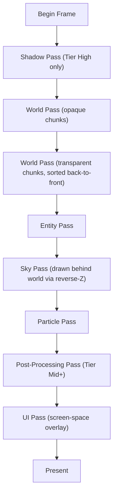
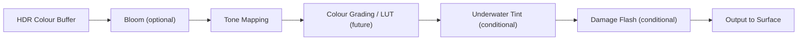
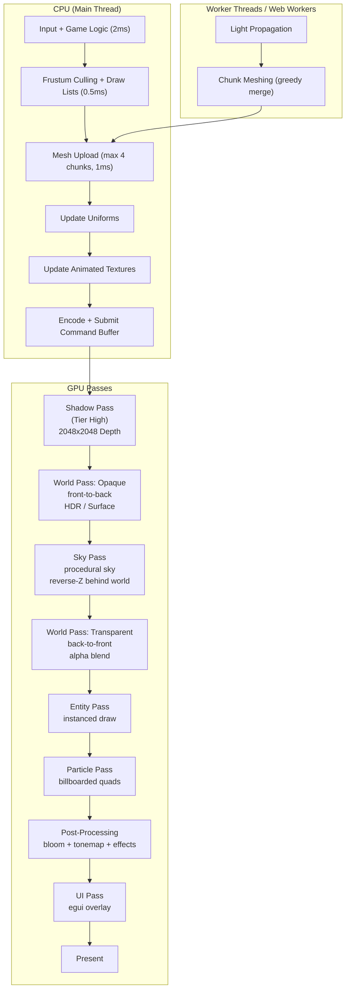

# 03 -- Rendering System

**Status**: Draft
**Date**: 2026-03-03
**Depends on**: ADR-002 (Tech Stack), Platform Overview (Visual Strategy)

---

## 0. Design Principles

1. **One codebase, two targets.** The renderer compiles to native (Vulkan/Metal/DX12 via wgpu) and to WASM+WebGPU for browsers. No `#[cfg]` forks in rendering logic except for capability queries and surface configuration.
2. **Resolution-agnostic.** Block textures are referenced by name, never by pixel coordinate. UV mapping is always normalised (0.0--1.0 within a texture slot). The atlas is rebuilt whenever a resource pack is loaded; no hardcoded tile sizes.
3. **Modest-hardware floor, high-end ceiling.** The renderer must sustain 60 fps on integrated GPUs (Intel UHD 630-class) at 8-chunk render distance. On discrete GPUs it should target 144+ fps at 16+ chunk render distance with post-processing enabled.
4. **Deterministic frame structure.** Every frame follows the same pass sequence. Optional passes are skipped, never reordered.

---

## 1. wgpu Pipeline Overview

### 1.1 Why wgpu

`wgpu` exposes a single API that maps to Vulkan, Metal, DX12, and WebGPU. This lets us write shaders in WGSL and pipeline configuration in Rust once. There is no OpenGL fallback -- the minimum requirement is a WebGPU-capable browser or a Vulkan/Metal/DX12-capable desktop GPU.

### 1.2 Device and Surface Initialisation

```text
Startup sequence:

1. Create wgpu::Instance (backends: all on native, WebGPU on WASM)
2. Request wgpu::Adapter (power_preference: LowPower | HighPerformance based on settings)
3. Query adapter.features() and adapter.limits()
4. Request wgpu::Device with required features + limits
5. Create wgpu::Surface from window handle (winit on native, canvas on web -- see 1.6 for canvas backing-store sizing on web)
6. Configure surface: format = surface.get_capabilities(&adapter).formats[0]
                       present_mode = Fifo (vsync) or Mailbox (uncapped)
                       alpha_mode = Auto
```

Feature detection drives capability tiers:

| Tier | Required Features | Effect |
|------|-------------------|--------|
| Base | (none beyond core) | No post-processing, no shadow maps, 2D texture atlas |
| Mid | `TEXTURE_BINDING_ARRAY` | Texture arrays for atlas, smooth AO |
| High | `TEXTURE_BINDING_ARRAY`, `MULTI_DRAW_INDIRECT` | Indirect draws, bloom, shadows |

The renderer queries features at startup and selects the highest available tier. All tiers share the same shader entry points; tier-dependent code paths are controlled via pipeline constants (WGSL `override` declarations) and bind group layouts.

### 1.3 Frame Structure

Every frame executes the following render passes in order:



Each pass is a separate `wgpu::RenderPass` or `wgpu::ComputePass` recorded into a single `wgpu::CommandEncoder` per frame. The encoder is submitted once at the end. Multiple command encoders are not used within a single frame to avoid implicit synchronisation costs.

### 1.4 Render Targets

| Target | Format | Size | Usage |
|--------|--------|------|-------|
| Surface texture | `Bgra8UnormSrgb` (preferred) | Window size | Final presentation |
| Depth buffer | `Depth32Float` | Window size | Depth testing, reverse-Z |
| HDR colour buffer | `Rgba16Float` | Window size | World + entity rendering (Tier Mid+) |
| Shadow map | `Depth32Float` | 2048x2048 (configurable) | Directional sun shadow (Tier High) |

On Base tier, the world pass renders directly to the surface texture (no HDR intermediate), and no shadow map is allocated.

### 1.5 Bind Group Layout Convention

All shaders share a common bind group structure:

| Group | Slot | Contents | Update Frequency |
|-------|------|----------|-----------------|
| 0 | 0 | Camera uniform buffer (view, projection, view_proj, camera_pos, time) | Per frame |
| 0 | 1 | Lighting uniform buffer (sun_dir, sun_colour, ambient, sky_light_level, fog_start, fog_end, fog_colour) | Per frame |
| 1 | 0 | Block texture atlas (texture_2d_array or texture_2d) | Per resource pack load |
| 1 | 1 | Atlas sampler (linear + mip, clamp-to-edge per layer) | Per resource pack load |
| 2 | * | Per-pass bindings (shadow map, entity transforms, etc.) | Per pass |
| 3 | * | Per-draw bindings (chunk model matrix, etc.) | Per draw call |

This layout means groups 0 and 1 are bound once per frame and survive across passes.

### 1.5.1 Camera modes and the render-eye split

The `Camera` (`camera.rs`) carries a `CameraMode` (`FirstPerson` `|` `OverShoulder` `|`
`OrbitBehind`). The view matrix is built from a **render eye** that differs from the player's
true eye only in third-person: `render_eye = eye + (desired_pullback − eye) × collision_frac`,
where `desired_pullback` runs along the orbit direction (look ± free-look offset) scaled by the
active feel profile and the pitch→distance curve. `CameraUniform.camera_pos` and the fog/
frustum all track this render eye, so the frame is shaded from where it is actually viewed.
**Aim is never sourced from the render eye** — gameplay rays use the true eye + look direction
(Spec 05 §2.5). First-person → `render_eye == eye` and every camera path is byte-identical to a
classic FPS camera.

Render-only third-person refinements (none touch aim, none bump `PROTOCOL_VERSION`):
- **No-snap collision** — a `cast_ray_camera` from the eye toward the desired render eye clamps
  the pull-back before solid geometry, retracting fast and easing back out slowly (the
  "punch-in-never-returns" failure mode is the slow ease-out; a hard snap is avoided by
  rate-limiting both directions).
- **Per-block `camera_occlusion`** — derived from `solid`+`transparent` (`Squeeze` for opaque
  solids, `PassThrough` for see-through/non-solid), so the camera collides by *registry intent*,
  not the visual box (the Minecraft Glass-vs-Barrier fix). The raycast reads the
  client-obfuscated world; since buried ore and its stone replacement are both opaque solids,
  this leaks nothing about hidden ore.
- **Avatar fade-on-occlusion** — when collision pulls the camera in close, the self-avatar fades
  via a **screen-door dither** in `fs_avatar` (the per-vertex `light` channel carries the fade
  alpha; remote avatars + the viewmodel always pass 1.0). Dither keeps the opaque `REPLACE`
  pipeline — no alpha blending or depth sorting, WebGPU-safe. Toggleable (`GraphicsSettings.avatar_fade`).
- **Feel profiles + free-look + auto-recenter** — `CameraProfile` (Build/Combat/Neutral) scales
  distance + FOV + pitch curves; free-look moves a decoupled render-orbit offset (aim untouched)
  that velocity-gated auto-recenter eases back behind the player. All default to the Neutral
  no-op; values + enablement are tuned in the Axolittle playtest.

Full design + phase ladder: `docs/foundations/2026-06-09-third-person-camera.md`.

### 1.6 WASM-Specific Considerations

- **No threads in base WebGPU.** Chunk meshing runs on the main thread or via Web Workers posting `ArrayBuffer` back to the main thread. The mesh upload path is identical (`queue.write_buffer`) but the data arrives from a worker via `postMessage` with transferable buffers.
- **Memory pressure.** WASM heaps are typically limited to 2--4 GB. The renderer tracks total GPU buffer allocations and enforces a configurable ceiling (default 512 MB for WASM, 2 GB for native).
- **requestAnimationFrame.** On web the render loop is driven by `requestAnimationFrame` (capped at display refresh), not a spin loop.
- **Canvas backing store must be in physical pixels (CSS px × `devicePixelRatio`).** On web, the wgpu surface is configured from `window.inner_size()`, winit's `scale_factor()` *is* the browser `devicePixelRatio`, and egui's `pixels_per_point` is that same DPR -- all three operate in *physical* pixels. The canvas backing store (`canvas.width`/`canvas.height` DOM attributes, set explicitly because CSS `width:100%` alone leaves them at winit's 1×1 default) must therefore be sized `CSS_px × devicePixelRatio`, **not** the raw CSS px from `window.innerWidth/innerHeight`. If the DPR multiply is skipped, the surface/viewport end up at `1/DPR` scale and the scene renders into the top-left `1/DPR²` corner of the canvas (a quarter at DPR=2). This is invisible on desktop (DPR=1, where logical == physical) and only manifests on high-DPR displays -- typically mobile. The multiply must be applied in *every* path that sizes the canvas: initial sizing, the JS `resize` listener, and any post-async-init resync. winit's own `WindowEvent::Resized(size)` already carries a `PhysicalSize`, so paths driven by it need no further scaling. (Regression found on mobile Chrome and fixed 2026-06-06; see the WASM arms of `main.rs` `resumed`/`window_event`.)

---

## 2. Chunk Meshing

### 2.1 Mesh Scope

A chunk is 16x16x16 blocks. Chunk columns are 16x256x16 (sixteen vertically stacked sub-chunks). Each sub-chunk has its own mesh. The term "chunk" in this section means a single 16x16x16 sub-chunk.

### 2.2 Face Emission Rules

For each block that has a visible model (air and invisible blocks are skipped), check each of the 6 cardinal faces:

1. **Interior face culling.** If the adjacent block in that direction is a fully opaque solid block, do not emit the face.
2. **Chunk boundary faces.** If the adjacent block is in a different sub-chunk, load the neighbouring sub-chunk's block data to perform the same test. If the neighbour sub-chunk is not loaded, emit the face (assume visible).
3. **Transparent block handling.** A solid + `transparent` block emits faces in the **transparent-solid mesh pass** (`mesh.rs::greedy_transparent_face`, #131), culling a face only where the neighbour is (1) a fully-opaque solid [hidden behind it] or (3) the **same** block type [glass-next-to-glass merge]. So glass shows against air / water / a different transparent type, but not against stone or more of its own kind. That geometry rides the `ChunkMeshes.transparent` bucket and draws in the alpha-blended, depth-read-only transparent pass (alongside water, §3) via the `transparent_pipeline` + `fs_transparent` shader (texture's own alpha, no water tint). The opaque greedy pass still `continue`s past `is_transparent` cells, and the non-solid small-cube pass still skips solids — the transparent pass is what catches them.

> **History (#130 → #131, 2026-06-22).** Before #131 there was **no pass for solid + transparent blocks at all** — the opaque greedy pass skipped `is_transparent` and the small-cube pass skipped solids, so such blocks emitted no geometry and rendered **invisible while still colliding**. This bit the five non-oak leaf species (`transparent: true` → invisible "leaves you bash through"); #130's stopgap made all leaves `transparent: false` (opaque) so they render via the greedy pass. **#131** built the transparent-solid pass above, which fixes the latent **glass** invisibility (glass = solid + transparent, alpha texture → renders see-through). **#131 fancy-leaf flip (shipped):** all six leaf species are back to `transparent: true` (solid, so still walkable-on) and their textures carry ~`LEAF_CUTOUT_PCT`% (20%) **cutout-alpha holes** (`texture_gen::gen_species_leaves`), so canopies render see-through via `fs_transparent`'s `alpha < 0.04` discard. The third-person camera passes through them automatically — `camera_occlusion::default_for(solid, transparent)` returns `PassThrough` for a transparent solid, no per-block exception needed. The pass culls leaf faces against same-type neighbours (rule 3), so a dense canopy shows its holed outer shell rather than every internal leaf face; a layered (no-same-type-cull) leaf look + cutout-density tuning are open feel-tweaks for an Axo playtest.

### 2.3 Greedy Meshing

After determining which faces to emit, greedy meshing reduces quad count:

```text
For each face direction (e.g., +Y top faces):
  1. Build a 16x16 grid of "face descriptors" for this slice.
     Each cell is either empty or contains: (block_texture_id, ao_values, light_value).
  2. Greedily merge adjacent cells with identical descriptors into rectangular quads.
     Scan left-to-right, then extend downward.
  3. Emit one quad per merged rectangle.
```

Greedy merging typically reduces quad count by 60--80% compared to naive per-block-face emission for natural terrain.

Greedy merging is only performed when all attributes match: texture ID, AO corner values, and light level. If any differ, the cells are not merged. This preserves smooth lighting gradients without introducing visual artefacts.

### 2.3.1 Quad Winding Order (CRITICAL)

The render pipeline uses **CCW front-face** with **back-face culling**. All emitted quads MUST have their 4 vertices wound so that the cross product of edge01 × edge02 points in the face's outward normal direction.

**Correct winding for each face direction** (vertices 0-1-2-3, triangles 0-1-2 and 0-2-3):

```text
Face    Normal  Vertex order (relative to quad origin at u,v with size w×h)
------  ------  -----------------------------------------------------------
+Y Top    +Y    (u, Y, v) → (u, Y, v+h) → (u+w, Y, v+h) → (u+w, Y, v)
-Y Bot    -Y    (u, Y, v) → (u+w, Y, v) → (u+w, Y, v+h) → (u, Y, v+h)
-Z North  -Z    (u+w, v, Z) → (u, v, Z) → (u, v+h, Z) → (u+w, v+h, Z)
+Z South  +Z    (u, v, Z) → (u+w, v, Z) → (u+w, v+h, Z) → (u, v+h, Z)
+X East   +X    (X, v, u+w) → (X, v, u) → (X, v+h, u) → (X, v+h, u+w)
-X West   -X    (X, v, u) → (X, v, u+w) → (X, v+h, u+w) → (X, v+h, u)
```

**Validation**: cross(vertex1 - vertex0, vertex2 - vertex0) must equal the face normal direction. If it points the wrong way, the face is back-face culled and invisible.

**Bug history**: The original prototype had Top/Bottom and East/West winding swapped, causing those faces to be culled. This was invisible on a flat world (top faces hidden = grey stone visible through grass) and only caught when terrain hills were added and side faces were missing.

### 2.4 Vertex Format

Each vertex is 24 bytes:

```text
Offset  Size  Type        Field           Description
------  ----  ----------  -----------     ----------------------------------
 0       12   [f32; 3]    position        World-space position (chunk_origin + local)
12        4   u32         packed_normal   Normal as 3x snorm8 + 1 byte padding
                                          (bits [7:0]=nx, [15:8]=ny, [23:16]=nz, [31:24]=0)
16        4   [f16; 2]    uv              Texture coordinates within atlas layer (0.0--1.0)
20        1   u8          texture_layer   Index into texture array (or atlas tile index)
21        1   u8          ao              Ambient occlusion (0--3 per vertex, packed)
22        2   [u8; 2]     light           [sky_light, block_light] each 0--15
------  ----
Total:  24 bytes per vertex
```

The vertex buffer layout as a `wgpu::VertexBufferLayout`:

```rust
wgpu::VertexBufferLayout {
    array_stride: 24,
    step_mode: wgpu::VertexStepMode::Vertex,
    attributes: &[
        // position: float32x3
        wgpu::VertexAttribute { format: Float32x3, offset: 0,  shader_location: 0 },
        // packed_normal: uint32
        wgpu::VertexAttribute { format: Uint32,    offset: 12, shader_location: 1 },
        // uv: float16x2
        wgpu::VertexAttribute { format: Float16x2, offset: 16, shader_location: 2 },
        // texture_layer: uint8 (passed as uint32, shader reads low byte)
        wgpu::VertexAttribute { format: Uint32,    offset: 20, shader_location: 3 },
        // Note: ao (offset 21) and light (offset 22) are packed into the same u32
        // read at shader_location 3; the shader unpacks via bit shifts.
    ],
}
```

**Alternative packing (compact vertex, 16 bytes):**

For memory-constrained targets (WASM), a compact vertex format encodes position as 3x u8 relative to chunk origin (0--15 per axis for block, plus 0 or 1 for the far edge, so 5 bits each, packed into a u16), with normal encoded as face index (3 bits), AO in 2 bits, UV derived from position. This format is a future optimisation and is not the initial implementation.

### 2.5 Index Buffer

Chunk meshes use 16-bit index buffers (`u16`). A 16x16x16 chunk can produce at most 16x16x16x6x4 = 98,304 vertices (before greedy merging), which exceeds u16 range. In practice, greedy meshing keeps vertex count well under 65,536. If a chunk exceeds 65,535 vertices (pathological worst case), it is split into two draw calls with separate vertex buffers. The index buffer uses the standard quad pattern: `[0, 1, 2, 2, 3, 0]` repeated, stored in a shared global index buffer (not per-chunk).

### 2.6 Dirty Flags and Rebuild Triggers

Each sub-chunk maintains a `mesh_dirty: bool` flag. The flag is set when:

- A block within the sub-chunk is placed or broken.
- A block in an adjacent sub-chunk on the boundary is placed or broken (affects face culling).
- Light values within the sub-chunk change.
- The resource pack changes (all chunks marked dirty).

Dirty chunks are added to a rebuild queue, prioritised by distance to the camera (nearest first).

### 2.7 Background Meshing

Chunk meshing is CPU-intensive and must not block the render thread.

**PARTIAL — bounded per-frame budget (Spec 39 Phase 7, A4, 2026-06-03).** Full
worker-pool/Web-Worker meshing (below) is not yet built. As an interim that
removes the *felt* stutter cheaply, mesh rebuilds are now drained at a per-frame
budget instead of all-at-once on the render thread. `GameState.dirty_mesh_chunks`
is a queue; `mark_chunk_dirty` enqueues; `process_dirty_meshes(budget)` (called
once per frame from `update_and_render`, `MESH_REBUILD_BUDGET = 8`) rebuilds up to
`budget` chunks nearest the player first. The two former synchronous storms now
queue instead: a torch place used to rebuild **27 chunks** in one frame
(`rebuild_chunks_for_lighting`) — it now spreads over ~3–4 frames; boundary
neighbours in `rebuild_chunk_at` also defer. **The edited block's own chunk still
rebuilds immediately** so the edit is visually instant; only neighbour/lighting
chunks lag a frame or two (light values are already correct, just the baked-in
mesh trails), which is imperceptible next to the old hard stall. Unloaded chunks
are dropped from the queue without a wasted upload. Full off-thread meshing
remains the larger, later win:

**Native (multi-threaded):**

```text
Main thread                     Worker pool (N threads, default = physical_cores - 2)
-----------                     -------------------------------------------------------
1. Drain dirty queue
2. For each dirty chunk:
   - Snapshot block data +
     neighbour boundary slices
   - Send snapshot to worker    --> 3. Worker builds vertex/index data in a Vec<u8>
                                    4. Worker sends completed mesh buffer back
5. Receive completed buffers    <--
6. Upload to GPU via
   queue.write_buffer()
```

The block data snapshot (step 2) is a copy of the 16x16x16 block array plus 6 boundary slices (each 16x16) from neighbours. This copy ensures workers never read shared mutable world state.

**WASM (Web Workers):**

Same architecture but workers are Web Workers. The snapshot is sent via `postMessage` with `Transferable` (the `ArrayBuffer` is moved, not copied). The completed mesh `ArrayBuffer` is transferred back the same way.

### 2.8 Mesh Upload

Completed mesh data is uploaded via `wgpu::Queue::write_buffer()`. Each sub-chunk owns a `wgpu::Buffer` for its vertex data. When a mesh is rebuilt:

- If the new mesh fits in the existing buffer, overwrite in place.
- If the new mesh is larger, drop the old buffer and allocate a new one.
- If the new mesh is significantly smaller (< 50% of allocated), reallocate to reclaim memory.

Buffer creation uses `wgpu::BufferUsages::VERTEX | wgpu::BufferUsages::COPY_DST`.

**Dynamic per-frame buffers (Spec 39 Phase 2, 2026-06-03).** The same grow-only
reuse now applies to all per-frame CPU-generated geometry — entity models, remote
avatars, the first-person viewmodel + arm, the block-highlight + ghost wireframes,
and the block-break crack overlay. These previously called
`device.create_buffer_init` **every frame**, churning the GPU allocator (worst on
WASM/WebGPU). They now go through `renderer.rs::write_dynamic_vbuf`, which reuses
the existing buffer via `queue.write_buffer` when it is large enough and only
reallocates (with ~25% headroom + `COPY_DST`) when the data outgrows capacity.
The live vertex count is tracked separately, so leftover capacity is never drawn.
The **crosshair** buffer (a constant 12-vertex quad, but pixel-sized so it depends
on viewport dimensions) is cached per `(width, height)` in `Renderer.crosshair_cache`
and rebuilt only on resize — no more per-viewport per-frame allocation.

### 2.9 Draw Call Strategy

Chunks within the view frustum are sorted:

1. **Opaque chunks**: sorted front-to-back (for early-Z rejection).
2. **Transparent chunks**: sorted back-to-front (for correct alpha blending).

Each chunk is one draw call: `render_pass.draw_indexed(0..index_count, 0, 0..1)`. With a 16-chunk render distance, the maximum number of opaque chunk draw calls is approximately `(16*2+1)^2 * 16 = ~17,424` sub-chunks visible in theory, but frustum culling and emptiness checks reduce this to typically 2,000--4,000. The target is under 5,000 draw calls per frame.

On Tier High, `MULTI_DRAW_INDIRECT` batches all opaque chunk draws into a single indirect draw call using a GPU-side buffer of `DrawIndexedIndirect` structs, reducing driver overhead to near zero.

### 2.10 Face-attachment decal pass

After the transparent chunk pass, a dedicated **face-attachment decal pass** renders
per-face overlays stored in `World.face_attachments`. Each attachment is a flat quad
inflated `e = 0.003` outward along the face normal (same technique as the block-break
crack overlay), alpha-blended, depth-tested without depth write — so the decal always
sits on the *room* side of the surface and is occluded by nearer terrain without
z-fighting. All six block faces are supported; a floor-top decal hangs flush on top of
the block, a ceiling decal hangs below, a wall decal sits on the face interior.

**Per-attachment-kind dispatch** (`mesh.rs::emit_face_decals`):

| `FaceAttachment` kind | Texture | Notes |
|-----------------------|---------|-------|
| `Wallpaper(block_id)` | The block's own texture layer | Décor / murals on any face |
| `BlueprintBlank` | `TEX_BLUEPRINT_PAPER_TOP` (cream) | Blank draughting paper laid on a floor |
| `Blueprint(plan)` — `Latent` | `TEX_BLUEPRINT_PAPER_TOP` (pale tint) | Captured plan awaiting sun-development |
| `Blueprint(plan)` — `Developed` | `TEX_CYANOTYPE_PRINT` (blue) | Finished blueprint; white-on-blue |

The develop-state colour transition (pale → blue) is driven by `plan::DevelopState`
carried inside the `FaceAttachment::Blueprint` payload. No geometry or vertex-format
change is needed between states — only the sampled texture layer changes.

**No collision, no physics.** Nothing in `physics.rs`, `player.rs`, or `raycast.rs`
reads `face_attachments`; it is render-only. Build height above a decal is the same as
build height above bare ground — this is the core guarantee of the paper-thin blueprint
system (Spec 05 §2.9).

**Persistence.** Attachment data is saved independently of chunk blocks; see
`save.rs::SavedFaceBlankPaper` / `SavedFaceBlueprint` / `SavedFaceOverlay`.

---

## 3. Texture Atlas System

### 3.1 Atlas Strategy: Texture Arrays (Preferred) vs Atlas Sheets

**Texture arrays** (`wgpu::TextureDimension::D2`, with `size.depth_or_array_layers > 1`) are the primary atlas strategy:

- Each block texture occupies one layer of a 2D texture array.
- All layers share the same resolution (e.g., 16x16, or 32x32, or 64x64 -- determined by the resource pack).
- UV coordinates are always (0.0--1.0) within a layer. No sub-rect UV calculations. No bleeding.
- The `texture_layer` vertex attribute selects the layer.

**Fallback: atlas sheet.** If `TEXTURE_BINDING_ARRAY` is not available (some older WebGPU implementations), a traditional 2D atlas sheet is used:

- Textures are packed into a single large texture (e.g., 256x256 for 16x16 tiles = 16x16 grid = 256 texture slots).
- UV coordinates are computed as `(tile_col * tile_size + local_u * tile_size) / atlas_width` etc.
- A half-texel inset is applied to UVs to prevent bleeding at tile boundaries.
- Mip-mapping is limited (lower mip levels cause cross-tile bleeding unless padding is added).

The renderer selects the strategy at startup based on feature detection.

### 3.2 Atlas Rebuild on Resource Pack Change

When a resource pack is loaded:

1. Scan the pack directory for all `textures/blocks/*.png` files.
2. Validate that all textures are square and share the same resolution. If mixed, scale to the pack's declared resolution.
3. Build a mapping: `block_name -> layer_index`.
4. Create a new `wgpu::Texture` (array or sheet) and upload all texture data.
5. Generate mipmaps (see 3.5).
6. Update the atlas bind group.
7. Mark all chunks as mesh-dirty (because `texture_layer` indices may have changed).

This is a relatively expensive operation (tens of milliseconds) and happens only on pack load, not per frame.

> **First concrete consumer — the Workshop override layer (Spec 40, Phase A, shipped 2026-06-04).**
> The per-asset appearance-override path (`override_registry.rs`) is the first real
> implementation of this §3.2 mechanism. Authored 16×16 reskins of existing
> blocks/mobs are **appended as extra layers** to the block texture array
> (`Renderer::rebuild_block_textures`, which regenerates the stock layers then
> uploads the override buffers at `texture_count() + i`), and an
> `(asset, face) → layer` map (built by `OverrideRegistry::rebuild_layers`,
> content-addressed so identical faces share a layer) is consulted at the two
> render seams **before** the asset's default texture: the block mesher
> (`mesh.rs::greedy_face`) and the entity vertex builder
> (`entity_model.rs::build_part_vertices`). Empty registry ⇒ no appended layers ⇒
> byte-identical render. On override change the caller re-meshes loaded chunks
> (step 7 above); entity faces resolve per-build so need no re-mesh.

### 3.3 Texture Slots for Plugin-Added Blocks

Plugins register block types with a texture name. During atlas rebuild, the atlas builder collects texture names from:

1. The base game's built-in block definitions.
2. All loaded plugins' block definitions.
3. The active resource pack's texture directory (which may override any of the above).

Layer indices are assigned in sorted-name order for determinism. The mapping is stored in a `HashMap<String, u8>` (or `u16` if more than 256 textures are needed). Plugins do not need to know their layer index; they reference textures by name, and the engine resolves the index at atlas build time.

### 3.4 Animated Textures

Some blocks (water, lava, fire, portal) have animated textures. These are handled as follows:

- An animated texture is a vertical strip PNG: width = `tile_size`, height = `tile_size * frame_count`.
- A metadata file (`textures/blocks/water.png.mcmeta` or similar JSON sidecar) declares frame duration and optional per-frame durations.
- The atlas allocates one layer per animated texture (using the first frame).
- Each frame, the renderer updates the animated layers by copying the appropriate frame's pixel data into the texture layer via `queue.write_texture()`.
- With texture arrays, this is a single-layer update, not a full atlas rebuild.
- Animation tick is driven by game time, not wall clock, so animations pause when the game pauses.

Maximum animated textures: 32 (to bound per-frame upload cost). Each update at 16x16 is 1 KB; at 64x64 it is 16 KB. 32 animated textures at 64x64 = 512 KB/frame, well within budget.

> **Implemented 2026-06-18 (texture-pack P5).** A pack ships an animated texture
> as a vertical strip `<key>.png` (height = `frame_width · frame_count`) plus a
> `<key>.png.anim` JSON sidecar (`frame_time` ticks/frame, optional explicit
> `frames: [{index, time}]`, `interpolate` parsed but nearest-frame for v1). The
> pure core is `texture_anim.rs` (`AnimMeta::parse`, `frame_count`,
> `slice_vertical_strip`, `build_schedule`, `AnimatedTexture::frame_index_at`);
> the native pack loader is `texture_registry::collect_pack_animations(dir,
> atlas_res)` (slices + scales frames to the atlas resolution, frame 0 also
> seeds the static base layer via `decode_pack_dir`). The renderer retains the
> `block_texture` handle and runs `advance_animated_textures()` at the top of
> `render()`, uploading only the layers whose frame changed — one
> `write_texture` each, capped at `MAX_ANIMATED_TEXTURES = 32`. The animation
> clock is the world `tick_counter` (set per frame via `set_anim_clock`), so
> animation advances with simulation and **freezes when the game is paused**, as
> required above. WASM packs feed the same `AnimatedTexture`s via the P4 fetch
> path. A pack with no `.anim` sidecars yields zero animated textures — the
> default game pays nothing.

### 3.5 Mip-Mapping Strategy

Mipmaps are generated at atlas build time:

- **Texture arrays**: standard `generate_mipmaps` via a compute shader or CPU-side downscale, per layer. Each layer has independent mipmaps, so no cross-texture bleeding.
- **Atlas sheet**: mipmaps are generated with `tile_size / 2` padding around each tile to prevent bleeding at lower mip levels. Alternatively, mip levels below the individual tile size are clamped (e.g., for 16x16 tiles, only mip level 0 is generated for the atlas sheet; the sampler uses `mip_lod_clamp` to prevent sampling below level 0).

Mip level count = `floor(log2(tile_size)) + 1`. For 16x16: 5 levels (16, 8, 4, 2, 1). For 64x64: 7 levels.

The sampler uses `FilterMode::Linear` for both min and mag, and `FilterMode::Linear` for mipmap interpolation (trilinear filtering).

> **As shipped (2026-09-06, Spec 39 A6 — `game/engine/src/mipmap.rs`).** The array
> path above is what exists; the sheet path does not. Two deliberate departures
> from this section: (1) **`mag_filter` stays `Nearest`** — trilinear
> magnification blurs the pixel art on the block you are standing next to, so
> only `min_filter` + `mipmap_filter` go Linear, and anisotropy is therefore not
> requested (wgpu needs all three filters Linear for `anisotropy_clamp > 1`).
> (2) The downscale is a **CPU** box filter, alpha-weighted and in linear space,
> so cut-out textures (leaves, glass, rails) don't bleed the colour of transparent
> texels — no compute shader, and the same code runs on WebGPU. The whole thing is
> behind the opt-in `mipmaps` Graphics dial; with it off the array is
> `mip_level_count: 1` and the sampler is Nearest throughout. See §9.4b.

---

## 4. Lighting & Shadows

### 4.1 Light Value Model

Each block position stores two light values, each 0--15 (4 bits):

- **Sky light**: propagated downward from the sky. Full value (15) for blocks with unobstructed vertical path to the sky; attenuates by 1 per block of horizontal spread, and is reduced by opaque blocks.
- **Block light**: emitted by light-emitting blocks (torches, lava, glowstone). Propagates omnidirectionally, attenuating by 1 per block.

Light propagation is computed by the world simulation (not the renderer). The renderer receives final light values per block and interpolates them per vertex for smooth lighting.

### 4.2 Light Value Packing in Vertices

Each vertex carries `[sky_light, block_light]` as two `u8` values (each 0--15, stored in the low nibble). In the vertex shader:

```wgsl
// Unpack light from the packed u32 at shader_location 3
let sky_light  = f32((packed >> 16u) & 0xFu) / 15.0;
let block_light = f32((packed >> 20u) & 0xFu) / 15.0;
```

**Non-terrain light consumers (2026-07-05, deferred-lists wave):** the sky/block split is
consumed by every visible surface, not just chunk meshes —
- **Entities** (mobs, dropped items, projectiles, carts, rigs) sample
  `World::light_channels_at` once per entity at build time (mid-body cell) and bake the
  two channels into their verts; the GlowSquid and Satoshi's amulet stay emissive.
- **Player avatars** carry a CPU-resolved `max(block, sky·sun.w)` scalar in the (otherwise
  unused) `sky_light` attribute — their `light` channel remains the fade-dither alpha —
  and `fs_avatar` multiplies by `max(sky_light, 0.08)`. `push_skin_quad` defaults the
  attribute to 1.0, so preview/workshop feeders stay bright unless a call site dims them.
- **First-person viewmodel** (arm + held item) samples at the eye cell.
- **Plant + micro instances** carry split channels (`PlantInstance.sky` attr 6,
  `MicroInstance.sky` attr 10) instead of the old combined bake-time snapshot; the
  small-cube and face-decal emitters bake both channels; emission always rides BLOCK.
- The `--shot-3p` harness includes a night-dim smoke (midnight frame must darken and the
  test avatar must stop reading bright).

### 4.3 Smooth Lighting (Per-Vertex Light Interpolation)

Instead of flat-shading each face with a single light value, light is interpolated per vertex:

1. For each vertex of a face, sample the light values of the 4 blocks that share that corner.
2. Average the light values (excluding fully opaque blocks from the average -- they contribute 0 to the average but do not reduce the divisor, to avoid darkening near walls).
3. Store the averaged value in the vertex.

The fragment shader then interpolates between the 4 vertex light values across the face, producing smooth gradients.

### 4.4 Ambient Occlusion (AO)

AO is computed per vertex during meshing, using the standard voxel AO algorithm:

```text
For a vertex at the corner of a face, examine the 3 adjacent blocks
that share that corner (two edge neighbours and one corner neighbour):

  side1 = is_opaque(edge_block_1)  // 0 or 1
  side2 = is_opaque(edge_block_2)  // 0 or 1
  corner = is_opaque(corner_block) // 0 or 1

  if side1 AND side2:
      ao = 0   (fully occluded -- both edges block the corner)
  else:
      ao = 3 - (side1 + side2 + corner)

  // ao is 0 (dark), 1, 2, or 3 (bright)
```

The AO value (0--3) is stored in the vertex as 2 bits. In the shader, it is converted to a multiplier:

```wgsl
let ao_table = array<f32, 4>(0.4, 0.6, 0.8, 1.0);
let ao_factor = ao_table[ao_value];
```

**AO and quad orientation.** When the two diagonal vertices of a quad have different AO values, the quad must be split along the correct diagonal to avoid visible interpolation artefacts (the "anisotropy fix"). During meshing, if `ao[0] + ao[2] < ao[1] + ao[3]`, the quad's index order is rotated to flip the triangle split diagonal.

### 4.5 Day/Night Cycle

The sky light contribution is modulated by a global `sky_brightness` uniform (0.0--1.0) driven by the in-game time of day:

```wgsl
let effective_sky = sky_light * u_sky_brightness;
let effective_block = block_light;
let total_light = max(effective_sky, effective_block);

// Apply light curve (gamma-like)
let light_factor = pow(total_light, 1.4);

frag_colour = texture_colour * light_factor * ao_factor;
```

At midnight, `sky_brightness` drops to approximately 0.15 (moonlight), making torch-lit areas (block light) visually dominant.

### 4.6 Dynamic Shadows (Tier High, Optional)

On Tier High, a single cascaded shadow map is rendered from the sun's direction:

- **Shadow pass**: render opaque chunk geometry into a `Depth32Float` texture from the sun's orthographic projection.
- **World pass**: sample the shadow map to determine whether a fragment is in shadow. Apply a `shadow_factor` (0.3 in shadow, 1.0 in light) to the sky light contribution only.
- **Cascade count**: 2 cascades (near: 0--32 blocks, far: 32--128 blocks). Each cascade is a 1024x1024 region of the 2048x2048 shadow map.
- **PCF softening**: 4-sample Percentage Closer Filtering for soft shadow edges.

Shadow mapping is off by default and enabled via a settings toggle. It is never available on Base tier or WASM targets (due to GPU memory and fill-rate constraints).

### 4.7 Light Blending in the Fragment Shader

The full fragment lighting calculation:

```wgsl
@fragment
fn fs_main(in: VertexOutput) -> @location(0) vec4<f32> {
    let tex_colour = textureSample(t_atlas, s_atlas, in.uv, in.texture_layer);

    // Discard fully transparent fragments (cutout alpha for leaves, etc.)
    if tex_colour.a < 0.5 {
        discard;
    }

    // Light calculation
    let sky = f32(in.sky_light) / 15.0 * u_lighting.sky_brightness;
    let block = f32(in.block_light) / 15.0;
    let base_light = max(sky, block);

    // AO
    let ao = ao_curve(in.ao);

    // Shadow (Tier High only; otherwise shadow_factor = 1.0)
    let shadow = sample_shadow_map(in.world_pos);

    // Combine
    let light = max(base_light * shadow * ao, u_lighting.ambient_minimum);

    // Apply light colour tint (warm for block light, cool for sky light)
    let light_colour = mix(
        vec3<f32>(1.0, 0.9, 0.7),   // warm (block light dominant)
        u_lighting.sun_colour,       // sky colour (varies with time of day)
        step(block, sky)              // choose based on which is dominant
    );

    var final_colour = tex_colour.rgb * light * light_colour;

    // Fog
    let fog_factor = fog(in.view_distance, u_lighting.fog_start, u_lighting.fog_end);
    final_colour = mix(final_colour, u_lighting.fog_colour, fog_factor);

    return vec4<f32>(final_colour, tex_colour.a);
}
```

---

## 5. View Distance & LOD

### 5.1 Render Distance

Render distance is measured in chunks (16 blocks). The setting controls a radius around the camera.

**IMPLEMENTED (Spec 39, 2026-06-03).** Render distance is now a runtime dial on
the `GraphicsSettings` struct (`graphics_settings.rs`) — see §9. It was previously
a hardcoded `const RENDER_DISTANCE: i32 = 10` **duplicated** in `main.rs` and
`server.rs`; both consts were removed and unified into the single struct field
(client side reads `GameState.graphics.render_distance`; server side reads
`GameServer.render_distance`). The implemented preset distances are:

| Quality Preset | Render Distance (chunks) | Approx. Block Radius | Target Hardware |
|----------------|--------------------------|----------------------|-----------------|
| Potato | 4 | 64 | Weakest integrated GPU / WASM on low-end |
| Low | 5 | 80 | Integrated GPU / WASM |
| Medium | 7 | 112 | Mid-range |
| High | 10 | 160 | **Default — today's look.** Discrete GPU |
| Ultra | 14 | 224 | High-end discrete GPU |

Allowed dial range is 4–16 chunks (clamped on load). A frame-time-driven "auto"
mode (see 10.3) remains future work.

### 5.2 Frustum Culling

**IMPLEMENTED (Spec 39 Phase 2, 2026-06-03).** Before submitting a chunk for
drawing, its AABB (axis-aligned bounding box) is tested against the 6 planes of
the view frustum. Chunks entirely outside the frustum are skipped. This is a
CPU-side test performed per frame.

The frustum is computed from the view-projection matrix using the Gribb-Hartmann
plane extraction method, in `camera.rs`:

- `Frustum::from_view_proj(Mat4)` extracts the 6 inward-pointing planes via
  `Mat4::row(i)`. **wgpu/D3D clip convention** (`0 ≤ z ≤ w`, since the engine
  renders with `Mat4::perspective_rh`): the near plane is `row2`, not
  `row3 + row2` (the OpenGL form). Other planes are `row3 ± row{0,1}` and the
  far plane is `row3 − row2`.
- `frustum_contains_aabb(&planes, min, max)` is the pure test, using the
  "p-vertex" optimisation (tests only the AABB corner furthest along each plane
  normal). Conservative: never culls a partially-visible box. Unit-tested
  (front/behind/side/far/straddle + rotation).

Applied in `renderer.rs::render_world_viewport` to the **opaque chunk, instanced
plant, and water** draw loops (each chunk's AABB is its 16-block cube derived
from the `(cx,cy,cz)` map key). The per-player view-proj is cached CPU-side in
`PlayerGpuResources.last_view_proj` by `update_camera`. Per-frame draw/cull
counts (`DrawStats`) are surfaced in the **F3 overlay** ("Draws: N (culled M / T)")
— they drop sharply when the camera faces a wall, making the win visible.

### 5.3 Occlusion Culling (Optional, Future)

For dense underground scenes, many chunks are occluded by terrain even though they are inside the frustum. Two strategies are considered for future implementation:

1. **Software rasterisation pre-pass.** Rasterise chunk bounding boxes on the CPU into a low-res (64x64) depth buffer. Skip chunks whose bounding boxes are fully behind existing depth. This is simple to implement and effective for caves.
2. **GPU occlusion queries.** Use `wgpu::Features::PIPELINE_STATISTICS_QUERY` (if available) to issue conditional rendering. Higher implementation complexity; deferred to a later milestone.

Neither occlusion culling strategy is required for the initial implementation. Frustum culling alone is sufficient for outdoor scenes.

### 5.4 Level of Detail (LOD)

LOD reduces mesh density for distant chunks:

| LOD Level | Distance (chunks) | Strategy |
|-----------|--------------------|----------|
| LOD 0 | 0--8 | Full greedy mesh (all details) |
| LOD 1 | 9--16 | Greedy mesh with 2x2x2 block merging (each LOD block = 2x2x2 real blocks, majority-vote block type) |
| LOD 2 | 17--24 | 4x4x4 block merging, no AO, flat lighting |
| LOD 3 | 25+ (future) | Impostor billboards or colour-only cubes (not in initial build) |

LOD meshes are generated by the same meshing pipeline but operate on a downsampled block grid. The LOD level is determined when the chunk enters the rebuild queue. If the camera moves significantly, chunks may be re-queued at a different LOD level.

#### 5.4.0 Shaped blocks — per-block sub-cuboid geometry (F1, 2026-06-19)

Slabs, stairs and the rest of the building-detail family render **authored sub-cuboids**
rather than a full cube. `block_shape::render_cuboids(shape, meta)` returns the `[0,1]³`
boxes for a block's shape + orientation (the *same* source as its collision boxes, Spec 05
§1.4 — geometry and physics never drift). The mesher excludes shaped blocks from the greedy
pass (`block_shape::is_shaped`, exactly as it excludes micro-models) and emits each box in
`emit_non_solid_blocks` via `emit_small_cube_textured` (independent top / side / bottom
texture layers per box). Orientation is read from the meta byte (Spec 02), so two adjacent
slabs of different facing stay distinct. First shapes: `STONE_SLAB`, `STONE_STAIRS`. Design:
`docs/foundations/2026-06-16-building-detail-blocks.md`.

**Wave 2c (2026-06-19).** Shapes added: `Wall`, `Button`, `Lever`, `PressurePlate`, `Sign`,
`ItemFrame` (full family). Two render wrinkles beyond the meta-driven base:
- **Connecting shapes (`Wall`, `Pane`).** The byte passed to `render_cuboids` is NOT stored
  meta but a live `CONN_*` neighbour mask the mesh path computes via
  `World::connection_mask` (`block_shape::is_connecting` gates this). A wall draws a central
  post + a 13/16 arm per connected neighbour; a pane a thin post + arms. Because the mask is
  recomputed each rebuild and `rebuild_chunk_at` already marks seam-neighbour chunks dirty,
  connection visuals refresh when an adjacent block changes — no stored state.
- **Item frames.** After the plate cuboids, a *filled* frame emits one extra small cube
  (`block_shape::item_frame_item_cube`) textured with the framed **block's** faces; non-block
  items show only on the read-on-look HUD. The framed item is read from
  `World::item_frame_at` in the mesh pass. Sign text is likewise HUD-on-look for now (baked
  in-world glyph text is later polish).

#### 5.4.1 Micro-models — the first concrete LOD consumer (IMPLEMENTED, owner-inbox #18, 2026-06-03)

The chunk-mesh LOD table above is still future work, but **micro-models** ship the
engine's first real LOD. A micro-model is a baked sub-voxel **shell**: a block (e.g.
a flower) can register a `MicroModelData` (occupied `8³` or `16³` micro-voxels), which
is baked **once per type** into a greedy-merged, interior-culled `ChunkMesh` (the same
two-phase merge as §2.3, run over the micro-grid — `micro_model::bake_micro_model`,
mirrored from `mesh::greedy_face`). Pipeline (full design:
`docs/foundations/2026-06-03-build-big-micro-models.md`):

- **Bake** (`micro_model.rs`): `MicroModelData → ChunkMesh` shell. A solid interior
  contributes zero triangles; a flower bakes to a few hundred tris, paid once per type.
  Colour is "paint-with-blocks" — each micro-voxel's face takes its source block's
  `tex_side` (so flowers are built from near-solid `WALLPAPER_*` colours).
- **Override table** (`micro_model_registry.rs`, a `World` field `micro_registry`):
  `block_id → BakedMicroModel`. A registered block renders its shell instead of its
  default cube/cross — render-only, block id unchanged, so saves/inventory/crafting are
  untouched. The mesher routes registered blocks in `emit_non_solid_blocks` into
  `ChunkMeshes.micro_instances` (tagged by block id) instead of the billboard `plants`.
- **Instanced draw**: one shared baked geometry per type (`Renderer::micro_geo`,
  uploaded via `sync_micro_models`) + per-chunk-per-type instance buffers
  (`micro_meshes`); **one `draw_indexed` per (chunk, type)** — same cost class as the
  plant billboards, frustum-culled per chunk. `MicroInstance` is byte-identical to
  `PlantInstance` (instance attrs at vertex **locations 5-8**, since the shell `Vertex`
  occupies 0-4). Shader `vs_micro` keeps the shell's real per-vertex normal (3D
  directional shading) where `vs_plant` forces a flat up-normal; fragment reuses `fs_main`.
- **Distance LOD** (Phase D): `camera::micro_chunk_is_near(view_proj, cx,cy,cz, dist)`
  selects per chunk by view-space forward distance (clip-`w` of the chunk centre). Within
  `Renderer::micro_lod_dist` (live = `render_distance × CHUNK_SIZE × 0.55`) the 3D shell
  draws; beyond it the chunk falls back to the cheap cross-billboard by reusing the plant
  pipeline + shared cross geometry + the same instance buffer. A pop-free cross-fade is
  deferred polish (the bloom is a touch larger as a billboard, only seen at distance).

First consumer: the three wild dye flowers (CORNFLOWER/FIELD_POPPY/BUTTERCUP) upgraded
from flat cross-billboards ("spaces in the centre") to 3D shells. The same primitive is
engine-generic for any décor block or community/Stash asset.

#### 5.4.2 Standard-skeleton rigs — authored animated assets (#19 foundation, 2026-06-19)

The animation transform already ships: `entity_model::build_part_vertices` rotates a
cuboid part about its `pivot` from a `PartPose`, and one walk sine drives the player
avatar + ~17 mob skeletons. **#19 makes the skeleton authored data and lets a rig inherit
a built-in animation set** (so casual authors never hand-keyframe). The Wave-4 foundation:
- **`skeleton.rs`** — `SkeletonPart` (a named, parentable superset of `ModelPart`),
  `Skeleton`, and the serialisable `RiggedModel`/`RiggedPart` an author builds (a standard
  skeleton + a baked #18 micro-model attached per named part). Five standard skeletons ship
  as data: **biped** (a verified transcription of `PLAYER_MODEL`), **quadruped**, **bird**,
  **fish**, **swaying-plant** (a parented segment chain). `SkeletonPart::to_model_part`
  bridges to the shipping renderer.
- **`anim_set.rs`** — `eval_anim_set(clip, t, part, is_swing) -> PartPose`, the generic,
  data-driven port of the inline walk/idle/attack/sway/jump arithmetic. A re-skinned biped
  walks with `PLAYER_MODEL`'s exact gait. `SkeletonKind::{swing_part, idle_clip}` map each
  skeleton's attack part + rest clip.

**Authoring + render BUILT 2026-06-19; shell attach + scale channel + clip picker BUILT 2026-09-06.**
`entity_model::build_rigged_vertices(rig, block_registry, micro_registry, pos, yaw, clip, t, light)`
poses each rigged part and plays the clip the author picked; rigs are world data (`World.rigs`),
persisted append-only via `WorldSave.rigs` (+ the index-aligned `WorldSave.rig_clips` side table).
The **Rig Studio** (`rig_studio_ui`, **Y** key) is the authoring UX: pick a skeleton, pick a motion
(**Walk / Idle / Bounce**), assign your held block to each named part, Spawn → a standing animated
rig in front of the player.

Each part renders one of two ways:

- **Shell (preferred).** If the part's assigned block has a **registered micro-model** (§ #18
  `MicroModelRegistry`), the part draws that block's **baked, interior-culled shell**. The shell is
  fitted **uniformly** into the skeleton part's `size` box — the tightest axis ratio wins, so the
  author's proportions survive and the shell never overflows the box — with its bounding box centred
  on the part's `origin`. The bake is **never** repeated per frame: `MicroModelRegistry::register`
  bakes once per `BlockId` and this path only reads the cached `ChunkMesh`, expanding its indices
  into the entity pipeline's plain triangle list (emitted vertex count == `mesh.indices.len()`).
  Normals are rotated with the pose so a swinging shell shades correctly.
- **Cuboid (fallback).** Any other block draws the original flat-textured box, so rigs authored
  before shell attach are unchanged.

Both paths pose through **one shared transform**, `entity_model::pose_points_about_pivot`:
squash/stretch the offsets-from-pivot (`PartPose.scale`, skipped when `[1,1,1]`) → rotate about the
pivot on X (`pose_x_rot`: the swing-arm override beats the walk cycle; a look-tracking part adds
`head_pitch`) → yaw about Y → translate. `build_part_vertices` uses the same helper, so a shell part
and a cuboid part move identically, and the identity-scale skip keeps every pre-Phase-C avatar/mob
emit byte-identical.

**Still open:** parent-chain composition for the segmented plant bend (parts pose independently
today), Phase D (animation-frame flipbook), an orbit preview, per-part pivot nudging. Design:
`docs/foundations/2026-06-03-dynamic-asset-authoring.md`.

### 5.5 Fog

Fog hides the render distance boundary and provides atmospheric depth:

```wgsl
fn fog(view_distance: f32, fog_start: f32, fog_end: f32) -> f32 {
    return clamp((view_distance - fog_start) / (fog_end - fog_start), 0.0, 1.0);
}
```

**IMPLEMENTED (Spec 39 Phase 6, 2026-06-03).** Fog distances are now a **uniform
derived from the live render distance**, fixing the disconnect bug: they were
hardcoded shader literals (`fog_start = 128`, `fog_end = 160`) that only
*coincidentally* matched render distance 10 — so the moment render distance became
a dial they would no longer track, producing hard chunk pop-in. The distances now
ride in `CameraUniform.fog` (a `vec4`): `xy` = terrain fog, `zw` = water fog. They
are computed each frame by `camera::fog_vec(render_distance)`:

- terrain `fog_end` = `render_distance * 16`, `fog_start` = `(render_distance − 2) * 16`
  (= `graphics_settings::fog_distances`).
- water fog is proportionally nearer (`×0.75` / `×0.875`), preserving the legacy
  96/140 pair at render distance 10.
- At render distance 10 this reproduces the old 128/160 (terrain) + 96/140 (water)
  exactly, so the default look is unchanged; at any other distance fog tracks the
  load edge (no pop-in).
- When the **fog dial is off**, all four distances are pushed to ~1e9 so nothing
  fades (clip at the far plane).

Applied in `fs_main`, `fs_plant`, `fs_avatar` (terrain `.xy`) and `fs_water`
(water `.zw`). The underwater murk pair (16/48) stays a literal — it's a water
visibility effect, not render-distance fog. Fog colour still matches the sky
brightness for seamless horizon blending.

### 5.5a Frame pacing & FPS cap (Spec 39 Phase 6, A3)

The render loop is decoupled from the 20 TPS sim and previously called
`request_redraw` unconditionally under `ControlFlow::Poll`, busy-spinning the CPU
on native. A software frame cap now sits at the top of `update_and_render`:
`FrameLimit::software_cap_interval` returns the per-frame budget for an explicit
cap (`Cap(30/60/120)`), and the native loop sleeps off any unused budget — which
yields the CPU and stops the spin. **VSync** is paced by the swapchain `present`
(`Renderer::set_present_mode` → `AutoVsync`); **Uncapped** maps to `AutoNoVsync`
with no software cap (deliberately unlimited); **Cap(n)** uses `AutoNoVsync` +
the software sleep. WASM is paced by `requestAnimationFrame` (the cap block is
native-only); a sub-rAF software cap on web is a later refinement.

---

## 6. Sky & Atmosphere

### 6.1 Procedural Sky

The sky is rendered as a full-screen quad behind all world geometry (using reverse-Z depth, the sky quad is placed at z = 0.0 in clip space). No skybox texture is used; the sky is fully procedural.

The sky shader computes colour based on the fragment's direction vector:

```wgsl
fn sky_colour(direction: vec3<f32>, sun_dir: vec3<f32>, time_of_day: f32) -> vec3<f32> {
    let elevation = asin(direction.y);  // -PI/2 to PI/2

    // Base sky gradient (zenith to horizon)
    let zenith_colour = mix(NIGHT_ZENITH, DAY_ZENITH, sun_intensity(time_of_day));
    let horizon_colour = mix(NIGHT_HORIZON, DAY_HORIZON, sun_intensity(time_of_day));
    let base = mix(horizon_colour, zenith_colour, smoothstep(0.0, 1.0, elevation / (PI / 2.0)));

    // Sunrise/sunset tint near horizon
    let sunset_factor = sunset_glow(direction, sun_dir, time_of_day);
    let sky = mix(base, SUNSET_COLOUR, sunset_factor);

    return sky;
}
```

Colour constants:

```text
DAY_ZENITH   = (0.15, 0.50, 0.95)   Deep blue
DAY_HORIZON  = (0.60, 0.80, 1.00)   Pale blue
NIGHT_ZENITH = (0.01, 0.01, 0.05)   Near black
NIGHT_HORIZON= (0.05, 0.05, 0.15)   Dark blue
SUNSET_COLOUR= (1.00, 0.45, 0.15)   Orange
```

### 6.2 Sun and Moon

The sun and moon are rendered as bright discs in the sky pass:

- **Sun**: a circular gradient with a bright white core fading to yellow. Angular radius: 2 degrees. Intensity is clamped to avoid oversaturation (or drives bloom on Tier Mid+).
- **Moon**: a circular disc with a subtle texture (a 64x64 texture loaded from the resource pack). Rendered only at night.

Sun position is derived from in-game time: `sun_elevation = sin(time_of_day * 2 * PI)`, `sun_azimuth = cos(time_of_day * 2 * PI)`. The moon is opposite the sun.

### 6.3 Cloud Layer

Clouds are rendered as a single horizontal plane at y = 192 (configurable):

- A 2D noise texture (256x256, seamlessly tiling) is sampled at the fragment's xz world position, offset by `time * wind_speed`.
- Cloud density is thresholded: density > 0.5 = cloud, else transparent.
- Cloud colour is white, shaded by the sun's vertical angle (darker on the underside at low sun angles).
- Cloud opacity: 0.7 (semi-transparent).
- Clouds are rendered in the transparent pass, after opaque world geometry.

Cloud detail is intentionally simple. Volumetric clouds are a future enhancement.

### 6.4 Weather Effects

Weather is rendered as a particle system overlaid on the world:

- **Rain**: vertical line particles, spawned in a cylinder around the camera (radius = 16 blocks). Each particle is a 2-pixel-wide, 8-pixel-tall quad, falling at 20 blocks/second. Colour: semi-transparent blue-white. Particle count: ~2,000.
- **Snow**: similar to rain but slower (5 blocks/second), with slight horizontal drift (sinusoidal x/z offset). Particle quads are 4x4 pixels. Colour: white. Particle count: ~1,500.

Weather particles are rendered in the Particle Pass, after entities, before post-processing. They use additive or alpha blending depending on type. Weather particles do not interact with physics; they are purely visual.

---

## 7. Entity Rendering

#### Current Implementation (Step 9 — Prototype)

Entity rendering uses the chunk shader pipeline (same lighting, fog, textures) with a
separate `entity_pipeline` that has `cull_mode: None` (no back-face culling — needed
because yaw rotation flips winding on some faces).

Each mob is a list of `ModelPart` cuboids defined in `entity_model.rs`. Each part has:
origin, size, pivot, per-face texture layers (into the block texture array), animation
flag + phase. Models built as CPU-generated `Vertex` arrays each frame (same format as
chunk vertices: position, normal, tex_layer, uv).

18 procedural mob textures occupy layers 16-33 of the block texture array (generated
in `texture_gen.rs`). Walk animation rotates leg parts around pivots (X-axis, 2.5 Hz,
±0.4 rad). Yaw rotation from velocity direction.

Entities within 0.5 blocks of camera are culled. Damage flash overrides normals to
[0,1,0] for maximum brightness.

Render pass order: chunks → water → **entities** → block highlight → ghost
wireframe → crack overlay → first-person viewmodel → HUD (hotbar, hearts,
crosshair, menu overlay).

The production model format below will replace this when we need JSON-defined models,
texture sheets, and skeletal animation with bone transforms.

### 7.1 Entity Model Format

Entities (players, mobs, items) use a **block-based model format** inspired by Minecraft's entity model system:

- Models are defined as a hierarchy of **cuboid parts** (head, body, arm_left, arm_right, leg_left, leg_right for humanoids).
- Each part has: `origin`, `size` (in 1/16th-block units), `pivot` (rotation centre), `uv_offset` (into the entity texture sheet).
- Model definitions are JSON files in the resource pack: `models/entity/<entity_type>.json`.

```json
{
  "texture": "textures/entity/player.png",
  "texture_size": [64, 64],
  "bones": [
    {
      "name": "head",
      "pivot": [0, 24, 0],
      "cubes": [
        { "origin": [-4, 24, -4], "size": [8, 8, 8], "uv": [0, 0] }
      ]
    },
    {
      "name": "body",
      "pivot": [0, 24, 0],
      "cubes": [
        { "origin": [-4, 12, -2], "size": [8, 12, 4], "uv": [16, 16] }
      ]
    }
  ]
}
```

### 7.2 Entity Vertex Format

Entity vertices use the same 24-byte layout as chunk vertices but with UVs mapped to the entity's texture sheet rather than the block atlas. Entities use a separate bind group (group 2) that binds the entity texture array and a per-entity transform uniform.

### 7.3 Skeletal Animation

Each bone in the model hierarchy has a transform (translation + rotation). Animations are defined as keyframe tracks:

```json
{
  "walk": {
    "loop": true,
    "length": 1.0,
    "bones": {
      "leg_left":  { "rotation": [[0.0, [-30, 0, 0]], [0.5, [30, 0, 0]], [1.0, [-30, 0, 0]]] },
      "leg_right": { "rotation": [[0.0, [30, 0, 0]], [0.5, [-30, 0, 0]], [1.0, [30, 0, 0]]] },
      "arm_left":  { "rotation": [[0.0, [30, 0, 0]], [0.5, [-30, 0, 0]], [1.0, [30, 0, 0]]] },
      "arm_right": { "rotation": [[0.0, [-30, 0, 0]], [0.5, [30, 0, 0]], [1.0, [-30, 0, 0]]] }
    }
  }
}
```

Bone transforms are computed on the CPU each frame (per visible entity), composed into a flat array of `mat4x4<f32>`, and uploaded as a storage buffer. The vertex shader applies the bone transform:

```wgsl
@vertex
fn vs_entity(in: EntityVertex) -> EntityOutput {
    let bone_transform = u_bone_transforms[in.bone_index];
    let world_pos = u_entity_transform * bone_transform * vec4<f32>(in.position, 1.0);
    // ... project and output
}
```

### 7.4 Entity Draw Batching

Entities of the same type (same model + texture) are batched into a single draw call using instancing. The per-instance data (entity world transform, animation state) is stored in an instance buffer. Typical entity counts (< 200 visible) result in fewer than 30 draw calls for entities.

### 7.4a Player Avatars (Remote Players)

Remote players render as an **animated humanoid avatar** built from the same
block-based part model as mobs (`entity_model::player_model()` — head, body,
left arm, right arm, left leg, right leg). This replaced the earlier
placeholder stone "ghost box". The avatar mesh is assembled CPU-side each frame
by `entity_model::build_player_avatar_vertices`, driven entirely by the
authoritative `PlayerState` on the wire (see Spec 04 §4.2a):

- **Head pitch tracking** — the head part rotates to match the player's
  look-pitch (`PlayerState.pitch`), so you can see where a remote player is
  looking up/down.
- **Locomotion animation states** (`PlayerState.anim_state`): `0` idle, `1`
  walk, `2` jump. Walk drives the leg/arm swing cycle on the `animated` parts;
  idle holds neutral; jump holds a jump pose. (Crouch is **not** an anim_state —
  see flags below.)
- **Crouch** — a transient flag (`player_flags::CROUCHING`) that applies a
  vertical dip to the whole avatar; it can combine with any locomotion state.
- **Right-arm swing on mine/place** — `player_flags::SWINGING` triggers an
  arm-swing arc via `entity_model::swing_angle` (`(1−t)·sin(πt)` profile,
  peaking at ~`0.58·SWING_PEAK`), overriding the walk cycle on the right arm.
- **Held item attached to the hand** — the avatar's equipped item (block, tool,
  or material from `PlayerState.held_kind`/`held_id`) is meshed by the shared
  `held_item_model::held_item_mesh` and anchored at the right hand, so other
  players see the correct item in hand.

`held_item_model::held_item_mesh` is the **single source of truth** for the
in-hand item mesh: it is reused by both the avatar hand here and the
first-person viewmodel (§7.5), and it reuses the authoritative
`tool_texture` / `material_texture` mappings rather than re-deriving UVs.

**Deferred / known gaps:**
- **Name tags above avatars are not yet implemented.** A `SHOW_PLAYER_NAMETAGS`
  kill-switch + guarded TODO exist, but there is no in-world text/billboard
  facility (only the egui HUD), and the remote player's handle is not on the
  wire (`PlayerState` carries only `player_index`; the handle lives on
  `JoinRequestPacket`, never echoed in the state stream — see Spec 04 §4.2a).
  Deferred to a follow-up (likely alongside the spectator system, which also
  needs player identification). When built, the tag MUST show handle/npub,
  **never hex**.
- **No per-player skin tint** — all avatars use a single default skin; players
  are distinguished by position (and, later, name tags).

### 7.5 Item and Dropped Item Rendering

- **Held items / first-person viewmodel** (the LOCAL player's own hand): the
  local player sees their **right arm + the equipped 3D item model**, anchored
  lower-right of the screen (`viewmodel.rs`). This is *not* a flat textured
  quad — it is the same `player_model()` right-arm part plus the shared
  `held_item_model::held_item_mesh` (§7.4a), assembled in the arm's local space
  and transformed straight into VIEW space by `viewmodel::viewmodel_transform`
  (a fixed lower-right slot ~0.9 units in front of the camera, with a small
  inward tilt). It is rendered in a **depth-cleared pass drawn after the wire
  passes** (so the world's depth survives for the block-highlight outline) using
  an identity view matrix and a narrow-FOV projection (`VIEWMODEL_FOV_Y`, 55°)
  so the world camera's yaw/pitch never move the viewmodel.
  - **Walk bob** — a sinusoidal sway (`viewmodel::BOB_AMP`) applied while
    walking, baked into the transform's y (and a quarter to x).
  - **Swing on use** — mine/place rotates the whole viewmodel about its local X
    via `entity_model::swing_angle`, so the tool arcs down-and-forward.
  - **Empty hand** — just the bare arm/fist (no item mesh).
  - A `viewmodel::SHOW_VIEWMODEL` kill-switch disables the whole pass.
  - Feel knobs (size/position/tilt in `viewmodel_transform`, `BOB_AMP`,
    `SWING_PEAK`) are unverified pending playtest tuning.
- **Dropped items** (on the ground): rendered as a small 3D block or a flat
  sprite depending on item type. They slowly rotate (y-axis spin) and bob
  vertically.

### 7.6 Particle System

Particles (block break fragments, torch sparks, bubble columns, critical hit stars) use a dedicated particle pass:

- Particles are **camera-facing quads** (billboards).
- Vertex data: position (f32x3), size (f32), colour (u8x4), life (f32) -- 24 bytes per particle.
- Particle simulation runs on the CPU. Particles are sorted back-to-front and rendered with alpha blending.
- Maximum particle count: 10,000. Particles beyond this limit are not spawned (oldest are culled).
- Particle textures are stored in the block atlas (they use block texture fragments for break particles) or in a small dedicated particle texture (8x8, 4 frames for generic particles).

---

## 8. UI Rendering

### 8.0 UI Design Philosophy

**The 2D UI is modern, clean, and thematic — independent of the 16×16 block textures.**

The blocky aesthetic belongs to the 3D voxel world. The 2D interface (menus, HUD, inventory, chat) uses anti-aliased fonts, smooth panels, resolution-independent layouts, and proper DPI scaling. Industry precedent is clear: Hytale, Deep Rock Galactic, Veloren, and Vintage Story all use clean modern UI on top of blocky 3D worlds. Only 2D pixel-art games (Terraria, Stardew) use pixel-art UI, because their entire visual style is pixel art.

See Platform Overview Section 7.2 for the full design rationale and principles.

#### UI Styling Guidelines

The UI should feel like it belongs in the Axe'n'Stax world without being pixelated:

- **Colour palette**: Earthy tones — deep slate backgrounds (`#1a1d23`), warm highlights (`#d4a044`), muted stone borders (`#3a3a4a`). Gold accent for titles and important actions.
- **Typography**: Anti-aliased, variable-width fonts. Default: egui's built-in proportional font (or a custom font loaded from resource pack). No bitmap fonts for UI text.
- **Panels**: Rounded corners (2-4px radius), subtle shadows, semi-transparent backgrounds (`rgba(0,0,0,0.85)` for overlays).
- **Buttons**: Clear hover/active states with colour shifts, not just border changes. Accessible contrast ratios.
- **Block textures in UI**: Item icons in inventory slots display block textures using egui managed textures (uploaded from the atlas). The pixel-art texture is displayed at its natural resolution within a clean, modern slot frame.
- **Moddability**: All UI colours, fonts, and layout spacing are defined as theme constants that resource packs can override. This is a first-class requirement, not a future enhancement.

### 8.1 Framework Choice: Immediate Mode (egui)

The UI is rendered using `egui` (via `egui-wgpu` and `egui-winit` integrations):

- **Rationale**: `egui` works on both native and WASM with the same API. It produces draw lists of textured triangles that are rendered via wgpu. It handles text layout, input, and widget logic. It is well-maintained and widely used in the Rust gamedev ecosystem.
- **Alternative considered**: fully custom retained-mode UI. Rejected for initial implementation due to development cost. Can be revisited if `egui` proves insufficient for complex UI (e.g., advanced inventory management).

**Integration crates:**

| Crate | Purpose |
|-------|---------|
| `egui` | Core: context, widgets, layout, fonts, input |
| `egui-wgpu` | Renders egui draw lists via wgpu render passes |
| `egui-winit` | Converts winit events into egui input events |

### 8.2 UI Render Pass

The UI pass is the last render pass before present. It renders on top of the 3D world and post-processing output:

```rust
// 1. Gather input from winit events (accumulated since last frame)
let raw_input = egui_state.take_egui_input(&window);

// 2. Run egui to build UI
let full_output = egui_ctx.run(raw_input, |ctx| {
    draw_hud(ctx, &game_state);
    draw_chat(ctx, &chat_state);
    if game_state.inventory_open {
        draw_inventory(ctx, &inventory);
    }
    if game_state.paused {
        draw_pause_menu(ctx);
    }
});

// 3. Handle platform output (cursor changes, clipboard, etc.)
egui_state.handle_platform_output(&window, full_output.platform_output);

// 4. Tessellate and render
let paint_jobs = egui_ctx.tessellate(full_output.shapes, full_output.pixels_per_point);
let screen_descriptor = egui_wgpu::ScreenDescriptor {
    size_in_pixels: [width, height],
    pixels_per_point: egui_ctx.pixels_per_point(),
};

// Upload texture deltas (font atlas changes, managed textures)
for (id, delta) in &full_output.textures_delta.set {
    egui_renderer.update_texture(&device, &queue, *id, delta);
}

// Render into the existing HUD render pass
egui_renderer.render(&mut render_pass, &paint_jobs, &screen_descriptor);

// Free textures no longer needed
for id in &full_output.textures_delta.free {
    egui_renderer.free_texture(id);
}
```

The `egui-wgpu` renderer handles font atlas management internally. Block textures for inventory icons are uploaded as managed textures.

**Crosshair exception:** The crosshair overlay continues to use the dedicated GPU crosshair pipeline (2px lines at screen centre). It is rendered before the egui pass. This avoids pulling a simple 12-vertex draw into egui's tessellation/texture pipeline.

### 8.3 UI Elements

| Element | Description | Always Visible | Renderer |
|---------|-------------|---------------|----------|
| Crosshair | Centre of screen, 2px lines | Yes (in-game) | GPU overlay (crosshair pipeline) |
| Hotbar | 9 inventory slots at bottom centre, with item icons | Yes (in-game) | egui |
| Health/hunger bars | Above hotbar, red hearts | Yes (survival mode) | egui |
| Vital counts | Free-slot + arrow counts, bottom-right above hotbar (#44) | Yes (survival mode) | egui |
| Block name label | Name of held item, above hotbar | Yes (in-game) | egui |
| Chat | Bottom-left, scrollable, fades after 10s | When active | egui |
| Debug overlay (F3) | FPS, position, **facing (compass + bearing), biome, light-at-target** (#44), chunk info, GPU stats | Toggle (F3 or Settings checkbox) | egui |
| Inventory | Grid of slots, drag-and-drop | Toggle (E key) | egui |
| Crafting UI | 2x2 or 3x3 grid with result slot | Toggle | egui |
| Pause menu | Centred overlay with buttons | Toggle (Esc) | egui |
| Main menu | World select, create/delete world | On launch | egui |
| Settings menu | Tabbed settings panels | Future | egui |
| Death screen | "You died!" with respawn button | On death | egui |

### 8.3.1 HUD & zoom QoL pass (#44)

The 2026-06-16 QoL pass (`docs/foundations/2026-06-15-hud-and-zoom-qol.md`) extended
the HUD through its existing seams — no parallel HUD, no bridge code:

- **Debug overlay (`hud_ui::draw_debug_overlay`)** now also shows **Facing** (8-point
  compass + standard bearing, `hud_ui::yaw_to_compass` / `yaw_to_bearing` — pure,
  unit-tested), **Biome** (`Biome::name()`), **Light** at the targeted block
  (`World::effective_light_at`), and a real **FPS** (`hud_ui::fps_from_frame_ms`
  from `PerfSamples.frame_ms_mean`). The biome/light lookups are computed at the
  call site only when the overlay is on (no per-frame cost when off). The new
  read-outs travel in a `hud_ui::DebugReadout` struct so `draw_hud` gained one
  parameter, not four.
- **Frame/tick timing is now cross-platform.** The `frame_samples` / `tick_samples`
  rings (and `last_frame_instant`) were WASM-only; they now record on native too
  (`web_time::Instant` works on both), so native shows a real FPS. WASM still feeds
  the voice-feedback perf snapshot from the same rings.
- **Vital counts (`hud_ui::draw_vital_counts`)** — free inventory-slot count
  (`Inventory::free_slot_count`) and total arrows (`Inventory::arrow_count`, plain +
  Nostrich), bottom-right above the hotbar, survival-only (mirrors the hearts/hunger
  Creative suppression). The free-slot colour warms green→amber→red as it fills.
  **Saturation outline deferred** — the food model (`PlayerCombat`) tracks no
  saturation value, so AppleSkin-style depletion has nothing to read; revisit when a
  saturation/effect system lands. The per-tool durability bar already shipped
  (hotbar slot overlay).
- **Hold-to-zoom (#44 P3)** — see §1.5.x camera notes: `Camera.zooming` swaps the
  base FOV to `Camera.zoom_fov` transiently in `effective_fov_y()`, render-only,
  bypassing the personal-FOV clamp and never mutating `fov_y`. Key **C** (keyboard,
  player 0) or the touch **Z** button; `zoom_fov` is a `GraphicsSettings` dial
  (`ZOOM_FOV_MIN..=ZOOM_FOV_MAX` = 15–45°, default `DEFAULT_ZOOM_FOV` = 20°), clamped
  separately from the 60–100° personal FOV.

### 8.4 Resolution Independence

UI scaling is handled by `egui`'s `pixels_per_point` setting:

- On native: derived from the OS's DPI scaling factor (via `winit`).
- On WASM: derived from `window.devicePixelRatio`.
- User-adjustable "UI Scale" slider (0.75x to 2.0x) multiplies the base scaling factor.

All UI layout uses `egui` logical units, not pixels. The UI looks consistent regardless of display resolution. Anti-aliased text renders cleanly at all DPI levels.

### 8.5 Block Textures in UI

Inventory slots and crafting grids display block textures. These are extracted from the texture atlas at atlas build time and uploaded as `egui` managed textures via `egui_renderer.update_texture()`. Each block type gets one `egui::TextureId`. When the resource pack changes, these UI textures are rebuilt.

**Texture display in slots:** Block textures are displayed at their natural pixel resolution (16×16 for the default pack) within egui `Image` widgets. The nearest-neighbour filter preserves the pixel-art crispness of the block icon while the surrounding slot frame, text, and layout use smooth, modern rendering. This contrast is intentional — it visually connects the UI items to the in-world blocks.

For 3D block previews in the inventory (optional enhancement), a small offscreen render target (64×64 per block type) renders the block model at an isometric angle. These previews are cached and regenerated only on resource pack change.

### 8.6 GPU Overlay Pipelines (Non-egui)

Three elements bypass egui and render directly via dedicated GPU pipelines for simplicity and performance:

1. **Crosshair**: 12 vertices (two perpendicular bars), drawn via the crosshair pipeline. No texture, no layout logic — just two coloured rectangles at screen centre.
2. **Block highlight wireframe**: World-space wireframe cube around the targeted block, drawn via the wire pipeline with depth testing.
3. **Block-break crack overlay** (Spec 05 §2.2, delivered 2026-05-24): World-space textured cube hugging the block the player is mining, showing the 10-stage crack progression. Drawn via a dedicated **crack pipeline** that reuses the chunk shader's `vs_main` + a `fs_crack` fragment (sampling the crack-stage layers `block::TEX_CRACK_BASE`..+10 from the shared block texture array) with **alpha blending**, `cull_mode: None`, and depth `{ write: false, compare: LessEqual, bias: constant -2 / slope -1 }` — identical depth handling to the wireframe so the overlay sits on the block surface without z-fighting and is occluded by nearer terrain. The cube is inflated ~0.003 outward. Stage selection is the pure `crafting::crack_stage`. The crack pass runs **after** the block-highlight + ghost wireframe passes and **before** the first-person viewmodel pass (which clears depth), so it depth-tests against valid world depth. Per-player buffer (`crack_buffer`), so split-screen renders each player's own cracks. The crack texture carries its own alpha and is rendered unlit, so cracks read identically in caves and daylight. *Deferred*: remote players' mining stages are not broadcast.

These elements have no text, no interaction, and no layout — egui adds overhead with no benefit for them.

---

## 9. Post-Processing

Post-processing is performed on Tier Mid and above. The world and entity passes render into the HDR colour buffer (`Rgba16Float`). The post-processing pass reads this buffer and writes to the surface texture.

### 9.1 Post-Processing Pipeline



The entire post-processing pipeline is a single full-screen triangle draw call with a fragment shader that reads the HDR buffer and applies effects sequentially.

### 9.2 Bloom

Bloom is a multi-pass effect:

1. **Threshold pass**: extract bright regions (luminance > 1.0) from the HDR buffer into a half-resolution texture.
2. **Blur pass**: apply a two-pass Gaussian blur (horizontal then vertical) at half resolution. Repeat at quarter and eighth resolution for a wide glow (3 blur levels total).
3. **Composite**: additively blend the blurred bright regions back onto the HDR buffer during tone mapping.

Bloom is controlled by a user setting (Off / Low / High). The bloom intensity multiplier is 0.0 (off), 0.15 (low), or 0.3 (high).

On WASM/Base tier, bloom is disabled (no HDR buffer, no compute passes for blur).

### 9.3 Tone Mapping

The HDR buffer is tone-mapped to SDR (0.0--1.0) using the ACES filmic curve:

```wgsl
fn aces_tonemap(colour: vec3<f32>) -> vec3<f32> {
    let a = 2.51;
    let b = 0.03;
    let c = 2.43;
    let d = 0.59;
    let e = 0.14;
    return clamp((colour * (a * colour + b)) / (colour * (c * colour + d) + e), vec3(0.0), vec3(1.0));
}
```

An exposure uniform (`u_exposure`, default 1.0) multiplies the HDR colour before tone mapping. Auto-exposure (averaging scene luminance to adjust exposure) is a future enhancement.

### 9.4 Conditional Effects

**Underwater tint**: when the camera is submerged in water, the post-processing shader applies:
- A blue-green colour multiply: `colour *= vec3(0.2, 0.5, 0.7)`
- A subtle waviness distortion: UV offset by `sin(uv.y * 20.0 + time * 3.0) * 0.003`
- Reduced view distance (fog pulled in to 3 chunks)

**Damage flash**: when the player takes damage, a red vignette is overlaid for 0.3 seconds:
- `colour = mix(colour, vec3(0.8, 0.0, 0.0), vignette * damage_flash_intensity)`
- `damage_flash_intensity` decays from 0.3 to 0.0 linearly over 0.3 seconds.

### 9.5 Configuration

Post-processing effects are individually toggleable in the settings menu:

```text
[Graphics Settings]
  Post-Processing:    On / Off          (Off disables HDR buffer entirely)
  Bloom:              Off / Low / High
  Tone Mapping:       ACES / Reinhard / None
  Underwater Effects: On / Off
  Damage Flash:       On / Off
```

When post-processing is off, the world pass renders directly to the surface texture in `Bgra8UnormSrgb` format (no HDR intermediate).

---

## 10. Performance Budgets

### 10.1 Frame Rate Targets

| Scenario | Target | Hard Floor |
|----------|--------|------------|
| Native, discrete GPU, 16-chunk view | 144 fps | 60 fps |
| Native, integrated GPU, 8-chunk view | 60 fps | 30 fps |
| WASM, mid-range laptop, 8-chunk view | 60 fps | 30 fps |
| WASM, low-end device, 4-chunk view | 30 fps | 20 fps |

If the frame time exceeds the hard floor for 5 consecutive seconds, the engine logs a performance warning and (in "auto" quality mode) reduces render distance or disables post-processing.

### 10.2 Per-Frame Time Budget (16.6 ms target for 60 fps)

| Phase | Budget | Notes |
|-------|--------|-------|
| Game logic + input | 2 ms | Runs before rendering |
| Frustum culling + draw list | 0.5 ms | CPU |
| Mesh uploads (dirty chunks) | 1 ms | Max 4 chunk mesh uploads per frame |
| Shadow pass | 1.5 ms | Tier High only; skipped otherwise |
| World pass | 5 ms | GPU; depends on draw calls + fill rate |
| Entity pass | 1 ms | GPU |
| Sky + particles | 0.5 ms | GPU |
| Post-processing | 1.5 ms | Tier Mid+ only |
| UI pass | 1 ms | GPU + CPU (egui layout) |
| Present + buffer swap | 0.5 ms | Driver overhead |
| **Headroom** | **1.6 ms** | Safety margin |

### 10.3 Dynamic Quality Scaling

The renderer maintains a rolling average of the last 60 frame times. If the average exceeds the target frame time:

1. Reduce render distance by 2 chunks (minimum: 4).
2. Disable bloom.
3. Disable shadows.
4. Reduce LOD distances (LOD 1 starts at 4 chunks instead of 8).

If the average is significantly below the target (< 50% of budget), quality is restored in reverse order. Changes are made at most once per second to avoid oscillation.

### 10.4 GPU Memory Budget

| Resource | Estimated Size | Notes |
|----------|---------------|-------|
| Texture atlas (16x16, 256 textures) | 256 KB | 256 layers x 16x16 x 4 bytes |
| Texture atlas (64x64, 256 textures) | 4 MB | With mipmaps: ~5.3 MB |
| Chunk vertex buffers (2,000 chunks) | ~40 MB | ~20 KB average per sub-chunk mesh |
| Chunk index buffers (shared) | 768 KB | 128K quads x 6 indices x 2 bytes |
| HDR colour buffer (1080p) | 16 MB | 1920x1080 x 8 bytes |
| Depth buffer (1080p) | 8 MB | 1920x1080 x 4 bytes |
| Shadow map (2048x2048) | 16 MB | Depth32Float |
| Entity buffers | ~2 MB | 200 entities x ~10 KB each |
| UI textures (egui) | ~4 MB | Font atlas + UI images |
| Bloom buffers (3 levels) | ~12 MB | Half/quarter/eighth res, Rgba16Float |
| **Total (Tier High, 1080p, 64x64 textures)** | **~104 MB** | |
| **Total (Base, 1080p, 16x16 textures)** | **~50 MB** | |
| **WASM ceiling** | **512 MB** | Hard limit; includes CPU-side allocations |

### 10.5 Draw Call Targets

| Category | Target Max | Typical |
|----------|-----------|---------|
| Opaque chunks | 5,000 | 2,000--3,000 |
| Transparent chunks | 500 | 100--200 |
| Entities | 50 | 10--30 |
| Particles | 1 | 1 (instanced) |
| Sky | 1 | 1 |
| UI | 1--5 | 1--3 (egui batches well) |
| Post-processing | 1--4 | 1--4 (bloom passes) |
| **Total** | **~5,560** | **~2,200** |

On Tier High with indirect draws, opaque chunk draw calls collapse to 1.

### 10.6 Profiling Infrastructure

The renderer exposes frame timing data via:

1. **GPU timestamps** (if `wgpu::Features::TIMESTAMP_QUERY` is available): per-pass GPU duration. Written to a query buffer, read back 2 frames later to avoid stalls.
2. **CPU timers**: `std::time::Instant` around each phase (meshing, culling, draw list build, present).
3. **Debug overlay (F3)**: displays FPS, frame time breakdown, draw call count, GPU memory usage, chunk mesh queue length, visible chunk count.
4. **Tracy integration (native debug builds)**: spans emitted for all major phases. Tracy is disabled in release builds and WASM.

### 10.7 WASM-Specific Performance Considerations

- **No multi-threading by default.** Chunk meshing happens on Web Workers, but the main thread must still upload meshes and run the render loop. Limit mesh uploads to 2 per frame on WASM (vs 4 on native).
- **Garbage collection interaction.** Large `ArrayBuffer` allocations may trigger GC. Use a pool of reusable `ArrayBuffer`s for mesh data transfer.
- **wgpu-on-web overhead.** `wgpu` on WASM calls through to the browser's WebGPU API via JS bindings. Each API call has a small overhead (~1 us). Minimise the number of API calls per frame by batching bind group changes and preferring fewer, larger draw calls.
- **Shader compilation.** On first load, WGSL shaders must be compiled by the browser's WebGPU implementation. Cache compiled pipelines via the browser's GPU pipeline cache (where supported). Display a loading indicator during initial shader compilation.

---

## 11. Resource Pack System

### 11.1 Pack Format

A resource pack is a directory (or `.zip` archive) with the following structure:

```text
my_resource_pack/
  pack.json                      -- Pack metadata
  textures/
    blocks/
      stone.png                  -- Block textures (square, power-of-two)
      dirt.png
      grass_top.png
      grass_side.png
      water.png                  -- Animated texture (vertical strip)
      water.png.anim             -- Animation metadata
    entity/
      player.png                 -- Entity texture sheets
      brigand.png
    particle/
      generic.png
    ui/
      widgets.png
      icons.png
  models/
    entity/
      player.json                -- Entity model definitions
      brigand.json
    block/
      torch.json                 -- Non-cube block models (future)
  sounds/                        -- Sound effects (future)
    blocks/
      stone_break.ogg
  shaders/                       -- Custom shader overrides (future, sandboxed)
    sky.wgsl
```

### 11.2 Pack Metadata (`pack.json`)

```json
{
  "name": "My Resource Pack",
  "description": "A high-resolution texture pack",
  "version": "1.0.0",
  "engine_version_min": "0.1.0",
  "texture_resolution": 32,
  "authors": ["Author Name"],
  "license": "CC-BY-4.0"
}
```

`texture_resolution` declares the expected base resolution of block textures. The engine uses this to validate textures on load and to configure the texture array dimensions.

### 11.3 Texture Resolution Rules

- All block textures in a pack must be the same resolution (square, power-of-two: 16, 32, 64, 128).
- If a texture does not match the declared resolution, it is scaled at load time (nearest-neighbour for upscaling from lower resolution to preserve pixel art; bilinear for downscaling).
- Animated textures must be `resolution` wide and `resolution * frame_count` tall.

### 11.4 Pack Layering and Override Rules

Multiple packs can be active simultaneously, layered in priority order:

```text
Priority (highest first):
  1. User-selected pack(s) (ordered by user preference)
  2. Server-suggested pack (if connected to a server)
  3. Built-in default pack (always present, cannot be removed)
```

For each texture name (e.g., `textures/blocks/stone.png`):
- The engine searches packs in priority order.
- The first pack containing that file wins.
- If no pack contains it, the built-in default is used.

This means a resource pack only needs to include the textures it wants to override. It does not need to be complete.

> **Implemented 2026-06-18 (texture-pack P1–P4d).** Native discovers packs in a
> `texturepacks/` folder (`pack.json` + `<key>.png`s) and a Graphics-settings
> picker hot-swaps them live. The **web/PWA** build fetches packs from the game
> site: `/static/packs/index.json` aggregates the available packs
> (`[{name, resolution, files}]`) and `/static/packs/<name>/<key>.png` serves
> each override; the WASM client (`texture_packs_web.rs` + `texturepacks.js`)
> fetches the declared files, decodes them in-WASM (`image` crate), and applies
> them through the same `apply_pack_layers` core as native, then rebuilds the
> atlas. Resolution agility (16/32/64/128, scale-on-load) and the single-active-
> pack model are shipped; full multi-pack priority layering and `.zip` archives
> are deferred (`docs/foundations/2026-06-18-texture-pack-authoring.md` §5).

### 11.5 Hot-Swapping at Runtime

Resource packs can be changed while the game is running:

1. User selects a new pack (or reorders pack priority) in the settings menu.
2. The engine triggers a full atlas rebuild (Section 3.2).
3. All chunk meshes are marked dirty and re-queued for meshing.
4. Entity textures and UI textures are reloaded.
5. A brief loading screen is shown during the rebuild (typically 0.5--2 seconds depending on pack resolution and texture count).

Hot-swapping does not require restarting the game or reconnecting to a server.

### 11.6 Server-Suggested Packs

When connecting to a multiplayer server, the server may suggest a resource pack:

1. Server sends a `ResourcePackSuggest` packet containing: pack URL, SHA-256 hash, pack size in bytes, and whether the pack is required.
2. The client checks its local cache for a pack matching the hash.
3. If not cached, the client downloads the pack from the URL (HTTPS only).
4. The client prompts the user: "This server suggests resource pack 'X'. [Accept] [Decline]". If the pack is marked `required`, declining disconnects the player.
5. On acceptance, the pack is loaded as the highest-priority pack (above user packs).
6. When disconnecting from the server, the server-suggested pack is removed and the user's previous pack configuration is restored.

### 11.7 Download and Caching

- Downloaded packs are stored in `<user_data_dir>/resource_pack_cache/`.
- Cache entries are keyed by SHA-256 hash, not by name (so different versions of the same pack coexist).
- Cache size limit: 500 MB (configurable). When exceeded, least-recently-used packs are evicted.
- Downloads show progress in the UI (percentage + speed).
- Partial downloads resume if the server supports HTTP Range requests.
- Integrity is verified by checking the SHA-256 hash after download; mismatches trigger re-download.

### 11.8 Plugin Texture Integration

Plugins that define new block types must include their textures in a plugin-specific resource pack directory:

```text
plugins/
  my_plugin/
    textures/
      blocks/
        my_custom_block.png
```

At load time, plugin textures are merged into the atlas alongside the active resource pack textures. User resource packs can override plugin textures using the same name (e.g., a resource pack containing `textures/blocks/my_custom_block.png` overrides the plugin's default).

---

## 12. Split-Screen Rendering

Split-screen allows two players to share a single window, each with their own viewport, camera, and HUD. The system is designed to be a first-class feature, not a bolt-on: every per-frame resource is either owned per-player or explicitly shared.

### 12.1 Screen Abstraction

The screen layout is computed from a set of small, composable types:

```rust
/// A pixel rectangle within the window framebuffer.
#[derive(Clone, Copy)]
pub struct ViewportRect {
    pub x: u32,
    pub y: u32,
    pub width: u32,
    pub height: u32,
}

/// What a given screen slot is showing.
pub enum ScreenContent {
    Player(usize),   // player index (0-based)
    Blank,           // reserved / unassigned
}

/// One logical screen slot (viewport + what it shows).
pub struct Screen {
    pub rect: ViewportRect,
    pub content: ScreenContent,
}

/// Compute the screen layout given the window size and the number of active players.
pub fn compute_screen_layout(window_width: u32, window_height: u32, player_count: usize) -> Vec<Screen>
```

`compute_screen_layout` returns one `Screen` per active player. For a single player it returns a single full-window viewport. For two players it returns two side-by-side half-width viewports (see 12.4).

The `ViewportRect` type is the bridge between the layout computation and the GPU calls that enforce the pixel boundary.

### 12.2 Per-Viewport Rendering

Each player's viewport is rendered by a free function:

```rust
pub fn render_world_viewport(
    encoder: &mut wgpu::CommandEncoder,
    surface_view: &wgpu::TextureView,
    depth_view: &wgpu::TextureView,
    viewport: &ViewportRect,
    player_gpu: &PlayerGpuResources,
    shared: &SharedGpuResources,
    is_first_viewport: bool,
)
```

Inside the render pass, two GPU calls confine all drawing to the player's pixel region:

```rust
pass.set_viewport(
    viewport.x as f32,
    viewport.y as f32,
    viewport.width as f32,
    viewport.height as f32,
    0.0, 1.0,
);
pass.set_scissor_rect(viewport.x, viewport.y, viewport.width, viewport.height);
```

- `set_viewport` maps normalised device coordinates to the sub-region of the surface. Each player's camera produces NDC in [-1, 1] and these land in that player's half of the screen.
- `set_scissor_rect` prevents rasterised fragments from bleeding outside the viewport boundary. This is the hard pixel fence; `set_viewport` alone is not sufficient because geometry near the viewport edge can produce fragments slightly outside the NDC box.

The function renders the full pass sequence (opaque chunks, water, entities, block highlight, sky) for that player's camera. The depth buffer is shared across viewports (see 12.5).

### 12.3 Per-Player GPU Resources

Each active player owns a `PlayerGpuResources` struct:

```rust
pub struct PlayerGpuResources {
    /// Camera uniform buffer — view, projection, camera_pos, time.
    /// Updated every frame from that player's camera state.
    pub camera_buffer: wgpu::Buffer,

    /// Bind group binding the camera buffer (group 0 in the shader layout).
    pub camera_bind_group: wgpu::BindGroup,

    /// Entity vertex buffer for entities visible to this player's camera.
    /// Rebuilt each frame from the entity draw list after per-player frustum cull.
    pub entity_buffer: wgpu::Buffer,

    /// Wireframe vertex buffer for the targeted block highlight (this player's crosshair).
    pub wire_buffer: wgpu::Buffer,
}
```

The camera buffer is the critical isolation boundary. Each player has a different view matrix and projection matrix (their FOV is computed from half the window width), so their bind groups must differ.

**Shared resources** (owned once, referenced by all viewports):

```rust
pub struct SharedGpuResources {
    /// Chunk vertex/index buffers — one mesh per chunk, shared across all cameras.
    pub chunk_buffers: ChunkBufferMap,

    /// Water mesh buffers.
    pub water_buffers: WaterBufferMap,

    /// Render pipelines (chunk, water, entity, wire, sky, crosshair, egui).
    pub pipelines: Pipelines,

    /// Block texture array bind group (group 1).
    pub atlas_bind_group: wgpu::BindGroup,

    /// Depth texture and view — one depth buffer for the whole framebuffer.
    pub depth_texture: wgpu::Texture,
    pub depth_view: wgpu::TextureView,
}
```

Chunk meshes are geometry, not per-camera state. Both players see the same world, so sharing meshes is correct and cheap — chunk buffer memory does not scale with player count.

**GPU memory impact of split-screen**:

| Resource | Single player | Two players | Scaling factor |
|---|---|---|---|
| Camera buffer + bind group | 1x | 2x | linear with players |
| Entity buffer | 1x | 2x | linear with players |
| Wire buffer | 1x | 2x | linear with players |
| Chunk mesh buffers | 1x | 1x | shared |
| Water mesh buffers | 1x | 1x | shared |
| Texture atlas | 1x | 1x | shared |
| Depth buffer | 1x | 1x | shared (see 12.5) |
| **Approximate total** | 100% | ~101% | near-zero overhead |

### 12.4 Split-Screen Layout

**Two players: side-by-side (vertical divider)**

```
┌──────────────┬──────────────┐
│              │              │
│   Player 0   │   Player 1   │
│  (KB+Mouse)  │  (Gamepad)   │
│              │              │
└──────────────┴──────────────┘
```

Each viewport is `(window_width / 2) x window_height`. Player 0 occupies the left half, Player 1 the right half.

**Why not top/bottom (horizontal divider)?**

First-person 3D games are primarily interested in horizontal peripheral vision — the left and right edges of screen carry far more gameplay information than the top and bottom edges. A horizontal divider halves vertical FOV. In a first-person game this means the sky-to-ground sweep is dramatically compressed, terrain feels cramped, and long-range targets disappear above/below the split edge. The vertical divider preserves horizontal FOV at the cost of some lateral awareness, which is the far better trade-off for a voxel game.

Aspect ratio also matters: a 16:9 window split left-right produces two 8:9 viewports — almost square, which is workable. Split top-bottom produces two 16:4.5 viewports — extremely wide and short, which is terrible for first-person navigation.

### 12.5 Depth Buffer Sharing

One depth texture is allocated for the full framebuffer (window_width x window_height). The two viewport renders share it. A dedicated **fullscreen clear pass** runs before any viewport renders:

1. **Fullscreen clear pass** (no scissor rect): `LoadOp::Clear` on both colour (sky blue) and depth (0.0, reverse-Z far value). This clears the entire framebuffer once.
2. **All viewport render passes** (Player 0, Player 1, ...): depth attachment `load: Load` — reads existing values without clearing.

Because viewports are geometrically disjoint pixel regions (left half vs right half), Player 1's depth reads will only encounter depth written by Player 1's own draws (or the clear value from the fullscreen pass). Player 0's depth values land in the left half of the texture; Player 1's in the right half. There is no interference.

This approach avoids allocating a separate depth texture per player, keeping depth memory at 1x regardless of player count.

**Correctness guarantee**: The scissor rect (12.2) prevents any viewport's draw calls from writing depth outside its own pixel region. Even in pathological cases (geometry that would normally project far off-screen), the scissor test discards all fragments outside the rect before they reach the depth buffer.

### 12.5.1 Split-Screen Rendering Pitfalls

These bugs were discovered during development and are documented here to prevent recurrence on any engine rebuild.

**StoreOp::Discard must NEVER be used on shared depth buffers.** The block highlight wireframe pass originally used `StoreOp::Discard` on the depth attachment. In split-screen, this discarded the *entire* shared depth buffer (not just the current viewport's region), causing the next viewport's render passes to read garbage depth and render nothing. `StoreOp::Discard` tells the GPU it may throw away the entire attachment contents — there is no per-region discard. All render passes that share a depth buffer must use `StoreOp::Store`.

**LoadOp::Clear affects the entire attachment, regardless of scissor rect.** Per the wgpu/Vulkan/WebGPU spec, `LoadOp::Clear` clears the *entire* attachment — the scissor rect has no effect on clear operations (scissor only affects fragment output). If the first viewport's render pass uses `LoadOp::Clear`, it wipes the second viewport's region too. The correct pattern is a single fullscreen clear pass followed by all viewports using `LoadOp::Load`.

**The correct multi-viewport clear pattern**:
1. One fullscreen clear pass (no scissor, `LoadOp::Clear` on colour and depth).
2. Per-viewport render passes: `LoadOp::Load` on both colour and depth, scissor rect set to viewport bounds.
3. All sub-passes within a viewport (opaque, water, entities, wireframe): `StoreOp::Store` on depth.

### 12.6 Per-Viewport HUD

Each player's HUD (hotbar, hearts, debug overlay, crafting UI) is rendered via egui within that player's viewport rect. The key constraint is that egui normally operates in window coordinates (pixels from top-left of window). To position HUD elements within a sub-viewport, all positions are offset by the viewport origin:

**Fixed-position HUD elements**: Use `egui::Area` with `fixed_pos` set to a position computed relative to the viewport rect:

```rust
// Example: place hotbar at bottom-centre of this player's viewport
let hotbar_x = viewport.x as f32 + viewport.width as f32 / 2.0 - HOTBAR_WIDTH / 2.0;
let hotbar_y = viewport.y as f32 + viewport.height as f32 - HOTBAR_HEIGHT - 8.0;
egui::Area::new(egui::Id::new(("hotbar", player_index)))
    .fixed_pos(egui::pos2(hotbar_x, hotbar_y))
    .show(ctx, |ui| { draw_hotbar(ui, &player_state); });
```

**Unique IDs per player**: egui uses string-based IDs to track widget state (hover, focus, drag). Every per-player widget must include the player index in its ID to prevent state collisions:

```rust
egui::Id::new(("hotbar", player_index))   // Player 0 and Player 1 get distinct IDs
egui::Id::new(("hearts", player_index))
egui::Id::new(("craft_ui", player_index))
```

Without unique IDs, one player opening their crafting UI would also open the other player's, because egui would treat them as the same widget.

**Clip rect**: After setting `fixed_pos`, set the egui clip rect to the viewport bounds to prevent any widget from drawing outside its half of the screen:

```rust
let clip = egui::Rect::from_min_size(
    egui::pos2(viewport.x as f32, viewport.y as f32),
    egui::vec2(viewport.width as f32, viewport.height as f32),
);
ui.set_clip_rect(clip);
```

### 12.7 Performance Characteristics

| Metric | Single player | Two players | Notes |
|---|---|---|---|
| Draw calls | ~2,200 typical | ~4,400 typical | Each viewport has its own draw list; chunks are drawn twice |
| Fragment count | ~N (full screen area) | ~N (each viewport is half area) | Total pixel work is the same |
| GPU memory | 100% | ~101% | Only per-player buffers duplicate |
| CPU (frustum cull) | 1x | 2x | Two cameras, two culls |
| Mesh uploads | 1x | 1x | Chunks uploaded once, shared |

**Draw calls ~2x** is the main cost. On Tier High with `MULTI_DRAW_INDIRECT`, this collapses back toward 1 indirect call per viewport, keeping driver overhead near zero.

**Fragment count ~1x**: each player's viewport covers half the window pixels, so fragment shader invocations per viewport are halved. The total across both viewports is approximately the same as single-player. Fill rate is not a split-screen penalty.

**The performance model favours split-screen**: the dominant cost (world meshing, chunk streaming, world simulation) is shared. Only the render layer duplicates, and only partially.

### 12.8 Future: Dual-Screen (Multi-Window)

A future enhancement supports two separate OS windows — one per player — each on a different monitor. This allows true dual-screen co-op without the viewport-splitting compromise.

**Implementation path**:

- `wgpu` supports multiple surfaces from the same device. Each window gets its own `wgpu::Surface`, `SurfaceTexture`, and `wgpu::TextureView`.
- The render loop acquires both surface textures, runs `render_world_viewport` for each into separate command encoders, and presents both.
- Each window has its own depth texture (same size as that window), eliminating the shared-depth-buffer arrangement.
- Input routing is unchanged: Player 0 still owns keyboard+mouse, Player 1 still owns gamepad. The second window is purely a display concern.
- `winit` 0.29+ supports creating multiple windows from the same event loop. Each `WindowId` is mapped to its player index.

The `compute_screen_layout` function returns a single full-window `Screen` for each window in this mode (no sub-viewports required).

### 12.9 Future: Companion Screen (RG35XX Handheld)

A planned companion screen concept turns a handheld device (specifically the Anbernic RG35XX or similar) into a second display + controller for Player 1:

**Concept**: The handheld connects over WiFi and displays a touch-optimised companion UI while the main TV/monitor shows the shared split-screen world view. The handheld acts simultaneously as a gamepad (its physical buttons map to Player 1's game input) and as a secondary display (showing contextual information).

**Four companion tabs** (swipeable on the handheld's touchscreen):

| Tab | Contents |
|---|---|
| Inventory | Player 1's full inventory grid and hotbar. Drag-to-move items, craft preview. |
| Map | Overhead chunk map centred on Player 1's position. Explored chunks rendered as a minimap. |
| Crafting | Full 3×3 crafting grid. Tap ingredients, see recipe suggestions. |
| Scanner | Points camera at screen; AR overlay identifies targeted block, shows hardness, drop table, coordinates. |

**Protocol**: The companion screen connects to a lightweight HTTP/WebSocket server running alongside the game engine. The server streams Player 1's inventory state and map data; the companion sends touch events back as inventory actions or crafting requests.

**Input routing**: Physical buttons on the RG35XX (D-pad, ABXY, shoulder buttons) are reported via USB HID (gamepad mode) or BT gamepad. The engine treats this exactly like any other gamepad — no special casing. The WiFi companion UI is additive: it shows information and accepts touch input, but physical buttons still do what they always do.

This concept is speculative and not in the current build. It is documented here to ensure the rendering and input abstractions remain compatible with the eventual implementation.

---

## Appendix A: Shader Uniform Structures

### Camera Uniform (Group 0, Binding 0)

```rust
#[repr(C)]
#[derive(bytemuck::Pod, bytemuck::Zeroable, Clone, Copy)]
struct CameraUniform {
    view:       [f32; 16],   // mat4x4<f32>  (column-major)
    projection: [f32; 16],   // mat4x4<f32>
    view_proj:  [f32; 16],   // mat4x4<f32>
    camera_pos: [f32; 4],    // vec4<f32>  (w unused, padded for alignment)
    time:       f32,         // seconds since session start
    _pad:       [f32; 3],    // alignment padding to 16 bytes
}
// Total: 224 bytes
```

### Lighting Uniform (Group 0, Binding 1)

```rust
#[repr(C)]
#[derive(bytemuck::Pod, bytemuck::Zeroable, Clone, Copy)]
struct LightingUniform {
    sun_direction:   [f32; 4],   // vec4<f32>  (w unused)
    sun_colour:      [f32; 4],   // vec4<f32>  (w = intensity)
    ambient_colour:  [f32; 4],   // vec4<f32>  (w = minimum light level)
    fog_colour:      [f32; 4],   // vec4<f32>  (w unused)
    fog_start:       f32,        // distance in blocks
    fog_end:         f32,        // distance in blocks
    sky_brightness:  f32,        // 0.0 (midnight) to 1.0 (noon)
    time_of_day:     f32,        // 0.0 to 1.0 (fraction of day cycle)
}
// Total: 80 bytes
```

### Chunk Push Constants (Per Draw)

```rust
#[repr(C)]
#[derive(bytemuck::Pod, bytemuck::Zeroable, Clone, Copy)]
struct ChunkPushConstants {
    chunk_origin: [f32; 3],  // World-space origin of the chunk
    _pad:         f32,
}
// Total: 16 bytes (within guaranteed push constant limit of 128 bytes)
```

---

## Appendix B: Full Render Frame Sequence (Pseudocode)

```rust
fn render_frame(
    device: &wgpu::Device,
    queue: &wgpu::Queue,
    surface: &wgpu::Surface,
    state: &GameState,
    renderer: &mut Renderer,
) {
    // 1. Update uniforms
    let camera_uniform = build_camera_uniform(&state.camera);
    let lighting_uniform = build_lighting_uniform(&state.world, &state.time);
    queue.write_buffer(&renderer.camera_buf, 0, bytemuck::bytes_of(&camera_uniform));
    queue.write_buffer(&renderer.lighting_buf, 0, bytemuck::bytes_of(&lighting_uniform));

    // 2. Upload completed mesh rebuilds (max 4 per frame)
    for mesh in renderer.mesh_rx.try_iter().take(4) {
        upload_chunk_mesh(device, queue, &mut renderer.chunk_buffers, mesh);
    }

    // 3. Update animated textures
    update_animated_textures(queue, &renderer.atlas, state.time.game_time);

    // 4. Build draw lists
    let frustum = Frustum::from_view_proj(&camera_uniform.view_proj);
    let (opaque_chunks, transparent_chunks) = build_chunk_draw_lists(
        &renderer.chunk_buffers,
        &frustum,
        &state.camera.position,
        state.settings.render_distance,
    );
    let entity_draws = build_entity_draw_list(&state.entities, &frustum);

    // 5. Acquire surface texture
    let surface_texture = surface.get_current_texture().unwrap();
    let surface_view = surface_texture.texture.create_view(&Default::default());

    // 6. Create command encoder
    let mut encoder = device.create_command_encoder(&Default::default());

    // 7. Shadow pass (Tier High only)
    if renderer.tier >= RenderTier::High && state.settings.shadows_enabled {
        render_shadow_pass(&mut encoder, &renderer, &opaque_chunks, &lighting_uniform);
    }

    // 8. World pass (opaque)
    let colour_target = if renderer.tier >= RenderTier::Mid {
        &renderer.hdr_view  // render to HDR buffer
    } else {
        &surface_view       // render directly to surface
    };
    {
        let mut pass = encoder.begin_render_pass(&wgpu::RenderPassDescriptor {
            label: Some("world_opaque"),
            color_attachments: &[Some(wgpu::RenderPassColorAttachment {
                view: colour_target,
                resolve_target: None,
                ops: wgpu::Operations { load: wgpu::LoadOp::Clear(sky_clear_colour), store: wgpu::StoreOp::Store },
            })],
            depth_stencil_attachment: Some(wgpu::RenderPassDepthStencilAttachment {
                view: &renderer.depth_view,
                depth_ops: Some(wgpu::Operations { load: wgpu::LoadOp::Clear(0.0), store: wgpu::StoreOp::Store }), // reverse-Z: clear to 0
                stencil_ops: None,
            }),
            ..Default::default()
        });
        pass.set_pipeline(&renderer.chunk_pipeline);
        pass.set_bind_group(0, &renderer.frame_bind_group, &[]);
        pass.set_bind_group(1, &renderer.atlas_bind_group, &[]);
        for chunk in &opaque_chunks {
            pass.set_push_constants(wgpu::ShaderStages::VERTEX, 0, bytemuck::bytes_of(&chunk.push_constants));
            pass.set_vertex_buffer(0, chunk.vertex_buffer.slice(..));
            pass.set_index_buffer(renderer.shared_index_buffer.slice(..), wgpu::IndexFormat::Uint16);
            pass.draw_indexed(0..chunk.index_count, 0, 0..1);
        }
    }

    // 9. Sky pass (writes only where depth is 0.0, i.e., no geometry)
    render_sky_pass(&mut encoder, colour_target, &renderer.depth_view, &renderer);

    // 10. World pass (transparent, back-to-front)
    render_transparent_pass(&mut encoder, colour_target, &renderer.depth_view, &transparent_chunks, &renderer);

    // 11. Entity pass
    render_entity_pass(&mut encoder, colour_target, &renderer.depth_view, &entity_draws, &renderer);

    // 12. Particle pass
    render_particle_pass(&mut encoder, colour_target, &renderer.depth_view, &state.particles, &renderer);

    // 13. Post-processing (Tier Mid+)
    if renderer.tier >= RenderTier::Mid {
        render_post_processing(&mut encoder, &renderer.hdr_view, &surface_view, &renderer);
    }

    // 14. UI pass
    render_ui_pass(&mut encoder, &surface_view, &mut renderer.egui_renderer, &state.ui);

    // 15. Submit
    queue.submit(std::iter::once(encoder.finish()));
    surface_texture.present();
}
```

---

## Appendix C: Render Pipeline Diagram (Detailed)



---

## Appendix D: Reverse-Z Depth Buffer

The renderer uses a reverse-Z depth buffer for improved floating-point precision at distance:

- **Depth clear value**: 0.0 (far plane), not 1.0.
- **Depth compare function**: `wgpu::CompareFunction::Greater` (closer fragments have larger Z).
- **Projection matrix**: maps near plane to Z=1.0 and far plane to Z=0.0. With `f32` depth, this provides sub-centimetre precision at 500+ block distances, eliminating Z-fighting.

The projection matrix for reverse-Z infinite far plane:

```rust
fn reverse_z_perspective(fov_y: f32, aspect: f32, z_near: f32) -> glam::Mat4 {
    let f = 1.0 / (fov_y / 2.0).tan();
    glam::Mat4::from_cols(
        glam::Vec4::new(f / aspect, 0.0, 0.0,  0.0),
        glam::Vec4::new(0.0,        f,   0.0,  0.0),
        glam::Vec4::new(0.0,        0.0, 0.0, -1.0),
        glam::Vec4::new(0.0,        0.0, z_near, 0.0),
    )
}
```

This maps depth to `z_near / view_distance`, giving near-infinite precision close to the camera and graceful falloff at distance. The far plane is effectively at infinity.

---

## 9. Graphics Settings (Spec 39)

**IMPLEMENTED (Phase 1, 2026-06-03).** `graphics_settings.rs` defines
`GraphicsSettings` — the engine-generic, per-device single source of truth for
all quality dials. It replaces the previously-hardcoded `RENDER_DISTANCE` consts
(and, as later phases land, the FOV / sensitivity / present-mode / fog literals).
Nothing in the struct is AxeNStax-specific; it lifts to any Decented voxel game.

### 9.1 The struct

| Dial | Type / range | Wires to |
|------|--------------|----------|
| `render_distance` | `i32`, 4–16 | chunk streaming (`chunk_stream.rs`) + server gen (`GameServer.render_distance`) + fog |
| `render_scale` | `f32`, 0.5–1.0 | offscreen render target + blit (Phase 5) |
| `fov_y` | `f32`, 60–100° | `Camera.fov_y` (personal pref) |
| `mouse_sensitivity` | `f32` | mouse-look multiplier (personal pref) |
| `frame_limit` | `VSync` / `Uncapped` / `Cap(n)` | `PresentMode` + frame pacer (Phase 6) |
| `fog` | `bool` | fog uniform derived from render distance (Phase 6) |
| `mipmaps` | `bool` | block texture-array mip chain + mip filtering (§9.4b, A6). **Opt-in: off in every preset** |
| `particles` | `Off` / `Reduced` / `Full` | particle spawn rate |
| `smooth_lighting` | `bool` | AO shader hook (future) |

### 9.2 Presets

Five presets (`Potato`/`Low`/`Medium`/`High`/`Ultra`) bundle the **quality**
dials. **High = today's values**, so the default look is unchanged. The preset
label is *derived* from the quality dials (no stored field to drift): touching a
quality dial that no longer matches a named preset reports `Custom`. **FOV and
mouse sensitivity are personal preferences excluded from preset detection** —
changing them never knocks you off a preset, and `apply_preset` preserves them.

| Preset | dist | scale | frame_limit | fog | mipmaps | particles |
|--------|:----:|:-----:|-------------|:---:|:-------:|-----------|
| Potato | 4 | 0.5 | Cap(30) | off | off | Off |
| Low | 5 | 0.75 | Cap(60) | on | off | Reduced |
| Medium | 7 | 1.0 | Cap(60) | on | off | Full |
| **High** | **10** | **1.0** | **VSync** | **on** | **off** | **Full** |
| Ultra | 14 | 1.0 | Uncapped | on | off | Full |

`mipmaps` is **off in every preset, High and Ultra included** (A6, 2026-09-06).
It is a *look* change at distance, not a cost dial, so it stays opt-in until a
human has watched the game with it on; keeping it off everywhere also preserves
the "High == today's values → default look unchanged" invariant and keeps a
fresh profile detecting as High.

### 9.3 Persistence

Per-device, not per-world. WASM: `localStorage` key `axenstax_gfx` (JSON, via
`web_sys::Storage`). Native: `settings.json` in the working directory next to
`worlds/` (serde-JSON). `GraphicsSettings::load()` falls back to the High default
when the store is absent or unparseable and clamps every dial into range; an
old/partial JSON file loads cleanly (`#[serde(default)]` fills missing fields
from the High default). `save()` is best-effort — a write failure never breaks
the game.

### 9.4a Settings panel (IMPLEMENTED, Phase 4, 2026-06-03)

`menu.rs::draw_settings_panel` is the in-game Graphics panel, opened from the
pause menu via the `PAUSE_OPEN_SETTINGS` code (a "Graphics" button) and drawn in
place of the pause buttons while `GameState.settings_panel.open` (mirrors the
"Your look" skin panel). Preset buttons highlight the derived current preset;
sliders cover render distance / render scale / FOV / sensitivity; selectable rows
cover frame limit + particles; checkboxes cover fog + mipmaps. **Apply-on-change,
no reload:** a change calls `GameState::apply_graphics_settings` →
`sync_graphics_to_engine` (FOV → every player camera; render distance → hosted
server; present mode → `Renderer::set_present_mode`, VSync vs AutoNoVsync) then
persists. `sync_graphics_to_engine` also runs on world entry so a persisted file
applies without opening the panel; FOV is additionally re-applied every frame in
the camera build (covers dynamically-added split-screen players). The hardcoded
mouse-look `0.003` is replaced by `graphics.mouse_sensitivity`. Render scale
(offscreen target) is Phase 5; software FPS cap + fog uniform are Phase 6.

### 9.4c Render scale (Phase 5) — IMPLEMENTED 2026-06-03 (follow-up)

**The biggest weak-GPU lever, now live.** When `render_scale < 1.0`, the world is
rendered into an offscreen colour+depth target at `render_scale ×` the surface
size, then a fullscreen-triangle **blit** (`vs_blit`/`fs_blit` in `shader.wgsl`,
linear filter) upscales it to the surface; the **UI still draws at native res** on
top, so text stays crisp. At `1.0×` the offscreen is dropped and the world draws
straight to the surface — **byte-identical to before**, zero blit cost.

`Renderer::set_render_scale` (re)creates the offscreen via `create_offscreen_target`,
driven by the dial through `sync_graphics_to_engine`; `resize` rebuilds it. Offscreen
and surface are both sRGB so the sample/store round-trip is colour-neutral (no gamma
shift); per-screen viewports are scaled into the offscreen's pixel space (split-screen
safe). Confirmed needed by the 2026-06-03 playtest — a potato laptop was only "just
about usable" at full res. Visual confirmation of the scaled path itself is a playtest
check (it only activates below 1.0×, and a GPU window can't run headlessly here).

### 9.4b A6 delivered (opt-in); A7 + A8 still deferred

**A6 — mipmaps (DELIVERED 2026-09-06, opt-in).** The `mipmaps` dial is live: it
now builds a mip chain for the block texture array and swaps the sampler, with no
restart and no re-mesh.

- **Chain generation is CPU-side at upload time** (`game/engine/src/mipmap.rs`),
  identical on native and wasm32/WebGPU — no blit pipeline, no
  `RENDER_ATTACHMENT` usage, so nothing about the texture's usage flags changes.
  Each array layer is an independent res×res image, so each gets its own chain
  (no cross-texture bleeding). Level count = `floor(log2(N)) + 1`
  (`mip_level_count_for`: 16 → 5, 32 → 6, 128 → 8), and `atlas_mip_levels`
  returns 1 when the dial is off **or** the atlas side isn't a power of two.
- **The 2×2 box filter is alpha-weighted and runs in linear space.** Block
  textures are cut-outs (leaves, glass, rails); a plain RGBA average drags the
  (usually black) colour of fully transparent texels into their neighbours and
  distant leaves turn to soot. Colour is therefore weighted by alpha, alpha is a
  plain mean, and an all-transparent 2×2 stays `[0,0,0,0]`. The atlas is
  `Rgba8UnormSrgb`, so bytes are decoded to linear, averaged, and re-encoded.
- **Sampler when the dial is on:** `mag_filter: Nearest`, `min_filter: Linear`,
  `mipmap_filter: Linear`, **no anisotropy**. wgpu rejects `anisotropy_clamp > 1`
  unless *all three* filters are Linear (`wgpu-core`
  `InvalidFilterModeWithAnisotropy`), and a Linear `mag_filter` blurs every block
  face you are standing next to — the wrong trade for a voxel game, so crisp
  magnification wins and anisotropy is dropped. When the dial is off the sampler
  is Nearest/Nearest/Nearest and the array is `mip_level_count: 1` — byte-for-byte
  today's behaviour.
- **Live toggle:** `Renderer::set_mipmaps(on, appended)` recreates the sampler,
  rebuilds the array through the same `rebuild_block_textures` path the Workshop /
  texture-pack hot-swap uses (so a reskin survives the toggle) and rebinds the
  texture bind group. It is driven from `sync_graphics_to_engine`, so the Graphics
  panel applies it on change. All three atlas-build paths (windowed constructor,
  headless constructor, runtime rebuild) go through one
  `create_block_texture_array` helper so they can't drift. Animated pack textures
  (§3.4) re-upload their whole chain per frame change, not just level 0.
- Per-face tint layers and the emissive `light` sentinel are **per-vertex**, not
  per-texture, so they are unaffected by the mip chain.
- Cost: ~33% more atlas VRAM and one CPU chain build per atlas rebuild (rare).
  Not verified on a real GPU — the distant look is the Phase 9 playtest call this
  item was always waiting on, which is exactly why it ships off by default.

Two Spec 39 items remain **not** delivered:

- **u16 indices + packed 24-byte vertex** (A7). VRAM/bandwidth win, but invasive
  across every shader's vertex input + the index format in every draw call — high
  regression risk for a non-headline gain. Deferred.
- **Distance LOD** (A8, §5.4). Large standalone effort; explicitly time-boxable.

The headline web wins (frustum culling, buffer reuse, frame pacing, bounded
meshing) + the headroom valve (settings panel + presets + persistence + **render
scale**) + the fog fix + water greedy-merge + **A6 mipmaps** are all delivered, so
the playtest can measure whether the remaining items are even needed (the F3
draw-call + frame numbers will say).

### 9.4 Fog derivation

`fog_distances(render_distance)` returns `(start, end)` in blocks:
`end = render_distance × 16`, `start = (render_distance − 2) × 16`. At the
historical default (render distance 10) this is `(128, 160)` — exactly the old
hardcoded `shader.wgsl` literals, so the look is unchanged, but now fog always
tracks the live render distance (fixing the pop-in bug when the dial moves; see
§5.5, wired in Phase 6).

## 10. Minimap & Map (#6 — JourneyMap parity)

**Module:** `minimap.rs` (pure core + cache), `hud_ui::draw_minimap`, `map_ui.rs` (full-screen), `waypoint.rs`. Full design: `docs/foundations/2026-06-16-minimap-waypoints-map.md`.

**Map data — per-chunk-column tile cache (`MinimapCache`).** A tile is a 16×16 grid of `MapCell { block, height }` — the topmost non-air block of each world column (and its Y). Tiles are built lazily on first sight and **persist** (explored terrain is map memory); near-player columns are rebuilt on a throttle. Surface scan = `World::highest_block(x,z)` → `minimap::topmost_map_block`. **No save bloat** — the cache is rebuilt from the world on load, never serialised.

**Rendering — one egui texture, not per-frame rects.** A cache refresh bakes the visible region into an RGBA buffer (`composite_rgba`) → a single egui `TextureHandle`. Relief shading compares each column's height to the column one block **north** (−Z): higher = brighter, lower = darker (`relief_shade` × `cell_colour`). Colours come from `BlockDef.color`.

**Conventions.** Minimap is **north-up** (+x = east = right, +z = south = down — matches screen coords); the heading arrow points along `(−sin yaw, −cos yaw)`. `project_to_map` is the shared world→map-pixel projection (minimap, full map, waypoint dots). Refresh is throttled (`MINIMAP_REFRESH_TICKS`, ~0.5s) and on chunk-column crossing; new tiles per refresh are capped so first-sight can't hitch a frame.

**Settings.** `GraphicsSettings.minimap_enabled` (default on) + `minimap_zoom` (blocks/pixel); personal prefs (excluded from preset detection), clamped on load.

**Full-screen map (`M` outside the Workshop).** `MapScreen { open, centre, bpp, texture, dirty }` — recomposited only when `dirty` (open/pan/zoom). Scroll-zoom, drag-pan, recentre, pin-centre, waypoint list (teleport-in-creative, remove). Gameplay input is frozen while open (same gate as chat). Player 0 / local only in v1; split-screen + gamepad/touch map nav = deferred.

**Waypoints.** `Waypoint { id, name, pos, colour, kind: Manual|Death }` persisted in `WorldSave.waypoints` (append-only serde-default). Death markers auto-drop on death (rolling cap `MAX_DEATH_MARKERS`), regardless of keep-inventory. Surface: `/waypoint add|list|remove|tp` (`OpLevel::None`; tp creative-only) + the full-map UI. See Spec 05.

## 13. Creator Gallery — Exhibit Rendering (Phase 1 delivered 2026-06-19)

Exhibits use a dedicated **painting pipeline** distinct from the 16×16 block
texture array: each artwork is a flat textured quad with its **own
native-resolution image** (group 2, bindings 2/3), so "low-res voxel walls + crisp
art side by side IS the aesthetic." It renders artist-authored `World.exhibits`
(Spec 02 §1.5; Spec 05 `/exhibit`).

> **The built-in Gallery was removed 2026-09-29.** The engine used to generate a
> fixed art maze (`gallery.rs`, `world_type "gallery"`, `/scenario gallery`) with
> 24 embedded paintings. It is now an **optional external world pack** — an
> ordinary `.axeworld` whose paintings + plaques are Wall exhibits with their
> images inside the archive, loaded via normal world import (native "Import
> world…", web "Restore from file"). No third-party art ships in the public repo.
> A save still marked `world_type "gallery"` loads as a plain flat world
> (`save::normalise_world_type`, logged, never a panic).

- **Wall exhibits** draw as opaque quads through the existing `painting_pipeline`
  (`fs_painting`), facing the authored `yaw`. `yaw` maps to an outward normal via
  `exhibit::yaw_to_normal(yaw) = [sin yaw, 0, cos yaw]` (yaw 0 → +Z) — the
  renderer is the source of truth for the yaw convention; the curation logic's
  `yaw_from_face` is its inverse so a wall piece faces the room. The quad hangs
  **flush**: `exhibit::wall_quad_center` pushes it from the anchor cell's centre
  back toward the wall until it sits `WALL_INSET` (0.03) off the face, bottom edge
  on the anchor's floor. (Before 2026-09-29 it floated at the cell centre, half a
  block off the wall — a bug against §5's "flush on a wall".)
- **Standing exhibits** are **Y-axis billboards**: a `BillboardQuad` keeps its
  anchor + size; `reorient_billboards(eye)` rewrites its four corners toward the
  viewer **once per frame** (`queue.write_buffer`, no realloc) using
  `exhibit::billboard_yaw(anchor, eye)` — horizontal only, so the piece stays
  upright when viewed from above and never tilts; a degenerate overhead eye holds
  yaw 0 (no NaN).
- **Transparency = alpha-test, not alpha-blend.** Standing PNG cut-outs draw
  through a sibling `painting_alpha_pipeline` whose `fs_painting_alpha` fragment
  `discard`s texels with `alpha < 0.5` (same mechanism as `fs_plant`/`fs_avatar`),
  in a sub-pass right after the opaque painting pass. No depth-sorting needed.
- **Artist-set size** is honoured exactly: the quad is built `(height, aspect)`
  with `aspect = width/height`, reproducing `width`×`height`.
- **Image load:** native decodes from `worlds/<name>/exhibits/<ref>` on disk and
  uploads directly; web fetches `/exhibits/<ref>` same-origin, decodes (alpha
  preserved), and hands pixels to the main loop via `exhibit_art_slot`. A missing
  image is skipped (that exhibit doesn't draw; the room still renders). The web
  fetch is `bridge_present`-guarded so the dedicated `:8443` page (no `/static`
  JS) degrades cleanly instead of crashing. Tex ids use `EXHIBIT_TEX_BASE`
  (1,000,000).

The genuinely machine-checkable maths (`billboard_yaw`/`yaw_to_normal`,
build-list selection, `yaw_from_face` reconciliation) has unit tests; the visual
truths (billboard facing, cut-out edge, on-screen size) are a playtest
(`docs/test-sheets/2026-06-19-creator-gallery-test-session-1.md`).

## Sky/block light split + night dimming — SHIPPED 2026-07-04 (gap-fill wave P1)

The terrain vertex now carries TWO light channels (`mesh::Vertex.light` = block
light, `.sky_light` = sky light; attribute 5). The greedy meshers (opaque,
transparent/glass, water) write real split values; `fs_main` combines them as
`max(block, sky * sun_dir.w)` — so **nights actually darken sky-lit terrain
while torch-light holds**, fixing "sky light is baked at gen; doesn't dim at
night". `sun_dir.w` (compute_sun brightness, night floor 0.15) already reached
the shader per-frame; no new uniforms.

Non-terrain paths (entity models, plant/micro instancing, rails/cables/torch
crosses and the other `non_solid` emitters) still pass a single combined value
in `light` with `sky_light = 0` — their look is UNCHANGED (they don't dim);
splitting them is a follow-up. The micro-model instance attributes moved to
locations 6–9 (buffer 0 grew location 5). Emissive sentinel (light > 1.5)
unaffected.

## Particle framework — SHIPPED 2026-07-05

`particles.rs`: a budgeted CPU-simulated pool (per-frame real dt, clamped) →
ONE persistent GPU instance buffer (`write_buffer` prefix, draw `0..count`) →
camera-facing billboards expanded in `vs_particle` from the NEW
`CameraUniform.cam_right/cam_up` (per-player, so split-screen faces each eye).
Drawn in **Pass 1.6** (after water, before entities): alpha-blended, depth
READ-ONLY — terrain and water occlude particles, particles never occlude.
Strictly client-side visual (no protocol / save / server). Gated by
`GraphicsSettings.particles`: Off = inert (legacy 2D rain streaks return),
Reduced = 512 pool + halved ambient rates, Full = 2048. Textures 453–456
(soft blob / spark / rain streak / chip — white masks tinted per instance).
Deterministic: every burst is a seed hash, no RNG. A naga parse test guards
`shader.wgsl` + `overlay.wgsl` at `cargo test` time (WGSL errors used to
surface only at first frame).

Live consumers (2026-07-05): block-break chips (tinted by `BlockDef.color`),
explosion debris + smoke + embers (`detonate_keg`), fire-cell smoke/embers
(budgeted, near camera), player water-entry splash (edge detect on the physics
`in_water` flag), **3D rain** (spawned around each player, `surface_kill_y`
scan means roofs shelter — replaces the 2D overlay streaks; overcast tint
stays), ambient snowfall in SnowyTundra/Mountains, dispenser muzzle puffs,
sapling-growth green poofs. Follow-up pass (2026-07-05, same day): mob/item **splash** (ECS water-entry
edge map), **footstep dust** (block-coloured, while walking), block-break chips
now **sample the block's own texture** (mini block faces instead of flat tint),
and **lightning bolts + sky flash** (see Spec 05 thunderstorms). Tail pass (2026-07-05, third commit): **bee trails** (golden motes behind
bees near the camera), **campfire embers** (lit campfires sparkle; the smoke
pillar stays its own block system), **local-light tinting** (instances dim by
`effective_light_at` — cave particles no longer glow in the dark; sparks and
embers are exempt as visual light sources), and **wall collision** (particles
die entering solid cells — chips stop at walls, smoke dies at ceilings; the
`kill_y` floor plane remains for weather). The particle backlog is CLEAR.
