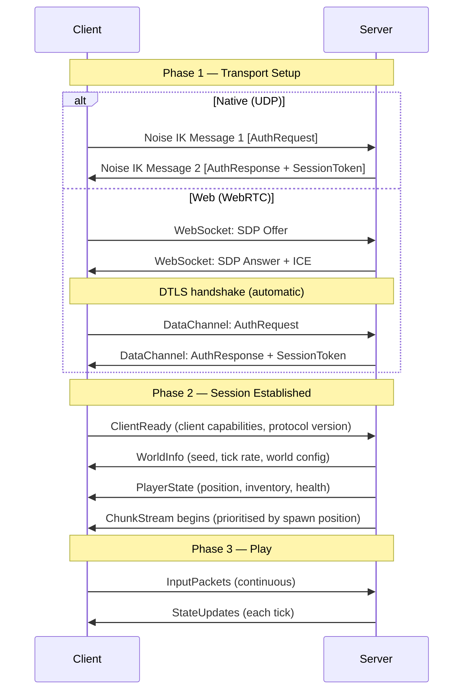
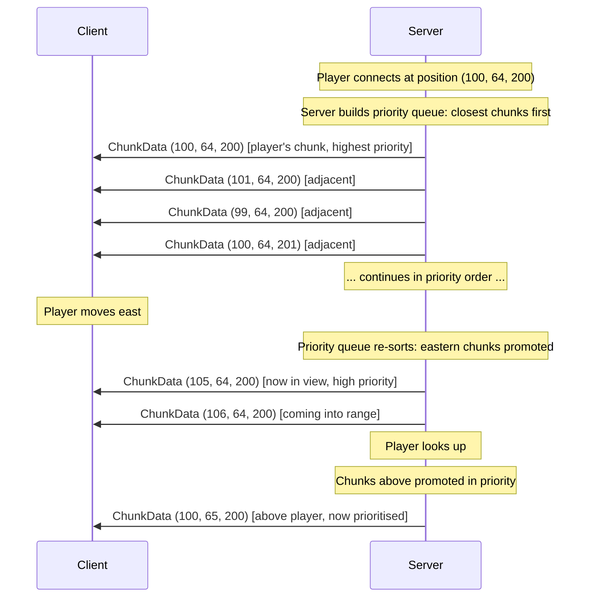
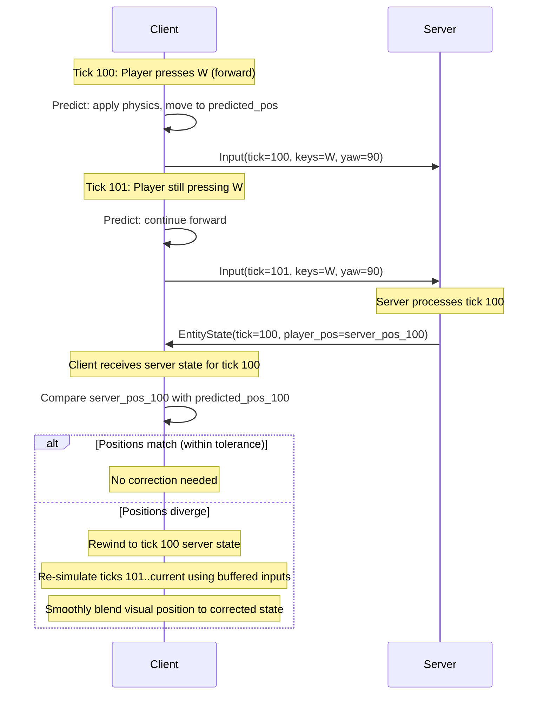
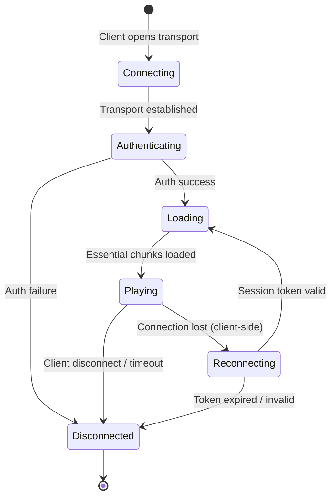

# Spec 04 — Networking Protocol

**Status**: Draft
**Date**: 2026-03-03
**Addendum**: `_audit-2026-04-18.md` first established that `PROTOCOL_VERSION` had drifted ahead of this spec. **The current wire version is `64`** (see the authoritative version-history comment in `game/engine/src/protocol.rs` for the per-version detail; this addendum logs the milestones, not every bump). The version bumps since v1:

- **v2** (2026-04-18): `StateUpdatePacket` gains `last_acked_input` for input-prediction reconciliation, plus `entity_spawns` / `entity_updates` / `entity_despawns` for server-authoritative entity sync. New structs `EntitySpawn`, `EntityUpdate`, `EntityKind`. `InputPacket` gains analog movement + discrete action flags. (Spec body below still describes v1 packet shapes — that's pending a fuller rewrite.)
- **v3** (2026-05-03): `JoinRequestPacket` gains `auth_event: Option<SignetAuthEventWire>` + `handle_credential: Option<SignetCredentialWire>`; new `ChallengePacket` (packet tag 50) lands on connect. Bincode is positional, so even `Option`-only adds force a version bump. Phase 3 of the engine-Signet-auth foundation. The verify path is gated behind `signet::USE_SIGNET_AUTH` (currently `false`), so the new fields ride alongside the old `player_name` BRIDGE — see §1.8.4. *(Superseded: `USE_SIGNET_AUTH` was retired at v49 on 2026-06-16; identity is policy-driven via `hosted_server::resolve_join_identity`. See §1.8.4 and Spec 08 §9.0.1.)*
- **v8** (2026-05-13): Wave 25 adds new `BlockId`s (`PURE_DEEPSLATE` + 3 deepslate ore variants + `SATORI_BLOCK` = ids 25..=29). Older clients without these registered would render unknown ids as `AIR` (registry fallback), producing voids in deepslate-bearing chunks; the bump forces clean rejection of stale clients. (The 3→8 jump is intentional — bumping past 4..7 was used as a "this is a content-bearing world-format change, not just protocol shape" signal.)
- **v9–v37** (2026-05-13…2026-05-23): a run of content/feature appends (block-registry waves, market hubs, auctions, server bazaar). All positional bincode appends. The authoritative per-version log is the `PROTOCOL_VERSION` history comment in `game/engine/src/protocol.rs`.
- **v38** (2026-05-24): Player avatars + first-person viewmodel. `PlayerState`'s block-only `held_item: u16` is replaced by a tool-capable `held_kind: u8` + `held_id: u16` pair (an `ItemRef` via `item_kind::{EMPTY,BLOCK,TOOL,MATERIAL}`), and gains `anim_state: u8` (locomotion: 0 idle / 1 walk / 2 jump) + `flags: u8` (`player_flags`: SWINGING=1, CROUCHING=2, ON_GROUND=4) so remote players render as animated humanoid avatars. `InputPacket` also gains `held_kind`/`held_id` so the client reports its own (client-authoritative) held item. See §4.2a.
- **v39** (2026-05-24): **Fantasy roster excised — breaking, pre-launch.** The hostile fantasy mob roster was removed from the engine entirely for open-source IP cleanliness. **7 `EntityKind` variants removed** (`Zombie`, `Skeleton`, `Spider`, `Creeper`, `Slime`, `WitherSkeleton`, `IronGolem`) — these are on the wire in `StateUpdatePacket.entity_spawns`, so dropping them shifts the serde/bincode ordinals of every later `EntityKind` variant → a breaking wire change, not an append. **5 `MaterialId` drop variants removed** (`RottenFlesh`, `SpiderEye`, `Slimeball`, `WitherSkull`, `Gunpowder`) — `MaterialId` is on the wire (and persisted in inventories), so this is also breaking and invalidates any old alpha save carrying those items. Kept on the roster: `Villager`, `Knight` (sole village defender), the `Brigand`/`Marauder`/`Berserker` bandit family, all animals, and `Arrow`/`Bone`/`Bonemeal`. Bones are re-sourced from livestock (Cow/Sheep/Pig). Entities are not persisted (alpha mob state is per-session), so the `EntityKind` removal causes no save loss. Accepted pre-launch (`project_alpha_launch_posture`). This **reverses** the HP-6 "keep retired variants forever for wire stability" decision (`docs/foundations/2026-05-23-historical-pivot-migration-cutover.md`). Design: `docs/foundations/2026-05-24-fantasy-roster-excision.md`.
- **v40–v51** (2026-05-24…2026-06-17): a further run of content/feature appends + the dedicated-server identity work — the authoritative per-version log is the `PROTOCOL_VERSION` history comment in `game/engine/src/protocol.rs`. Notable: **v51** (2026-06-17, Spec 48 Electricity) adds **`BlockChange.meta: u8`** — the per-block meta byte (facing / lit-state / powered-rail bit) now rides alongside `new_block` on the existing `StateUpdatePacket.block_changes` visual path, so power-state flips (lamp lit, cable energised, rail powered) reuse that channel. The `WorldSave` `block_meta`/`power_devices` shape change rides the same bump (Rail precedent). Design: `docs/foundations/2026-06-17-electricity-power-logic.md`.
- **Entity-sync semantics note (2026-07-12, NO wire change — still v58).** Two delivery guarantees were added on top of the v2 entity-sync channel. (1) **Late-joiner backfill**: `EntitySpawn` broadcasts once per entity (the server diff set is global), so at join-accept the server snapshots every already-broadcast entity (mobs, carts, items with stack payload) and prepends those spawns to *that client's* next `StateUpdatePacket` — merged, never a separate packet, preserving one-StateUpdate-per-tick-per-client. *(Superseded 2026-10-06, bounded StateUpdates below: the backfill now goes into that client's outbox ahead of the tick's diff, and a tick may span several StateUpdates — safe because of guarantee (2).)* (2) **Client-side delta accumulation**: `RemoteClient` accumulates `entity_spawns`/`entity_updates`/`entity_despawns` and `block_changes` across StateUpdates between frames instead of keeping only the newest packet — deltas are never last-write-wins (snapshot fields — player states, `world_time`, reserve — still are). Spec 05 §9.5 has the implementation note.
- **v59** (2026-09-03): **Weather sync (P9).** `StateUpdatePacket` gains a trailing `rain_ticks_left: u32` + `storm_ticks_left: u32` (the spec body below still describes pre-v2 packet shapes, per the note on v2 above — the authoritative field list is `StateUpdatePacket` in `game/engine/src/protocol.rs`). Fixes the pre-existing bug where a hosted/dedicated server rolled its own private weather formula (`weather::server_raining`, now deleted) that never matched what any client showed, and nothing about weather crossed the wire at all. `GameServer` now owns a `weather: Weather` field, advanced once per tick with the SAME `weather::advance` formula the client uses; the two new fields are `Weather::ticks_left(tick_counter)` — a *duration*, not the server's absolute `rain_until`/`storm_until`, so the sync is correct regardless of any tick-counter offset between server and client. Append-only, `#[serde(default)]`. **Wire-compat caveat (found while implementing this bump, applies retroactively to every prior append-only field in this file):** `#[serde(default)]` is well-known to work for a self-describing format (JSON — a missing key is just absent) but is **inert** against bincode 1's positional decode of a genuinely shorter stream: the derived `Deserialize`'s `SeqAccess` always attempts to read every field the CURRENT struct declares and propagates the inner decode's EOF the moment bytes run out, rather than reporting "no more elements" so the default can kick in (`game/engine/src/save.rs`'s `read_tail`/`deserialize_world_save_tolerant` documents and works around the identical gotcha for `WorldSave`). In practice this has never mattered for `StateUpdatePacket` (or any prior append) because `hosted_server.rs`'s `protocol_version` check rejects a version-mismatched `JoinRequest` before any `StateUpdatePacket` is ever exchanged — so a v58-shaped packet reaching a v59 decoder is unreachable in production. `#[serde(default)]` is kept for documentation/consistency and as a ready foundation for a real `read_tail`-style tolerant decode, should the version gate ever be relaxed to allow forward/backward-compatible peers.
- **v60** (2026-09-05): **World chat.** Two new `PacketType` variants, appended (never renumbered — discriminants are a wire-stable promise): `ChatSay = 54` (C→S, `{ text: String }`) and `ChatDeliver = 55` (S→C, `{ from_pubkey: Option<[u8; 32]>, from_name: String, text: String, kind: ChatWireKind }`, `ChatWireKind = Player | Room | System`). Two asymmetric packets rather than one symmetric one: `ChatSay` carries only what the client is entitled to assert — the text it typed — never who it is speaking as. `ChatDeliver` carries what the server has decided: attribution (`from_pubkey`/`from_name`, server-chosen, never client-asserted) and the line's kind. A single symmetric packet would invite a client to assert its own `from` field, which is exactly the hole this design closes. `ChatDeliver` is also never broadcast: the tier/level permission rule (`docs/foundations/2026-09-05-world-chat.md` §2.3) is evaluated **per recipient**, because the permission decision itself is per-recipient — a stranger and a kin standing next to each other can receive different deliveries of the same spoken line, or none. This is why chat does not join the existing "same bytes to everyone" broadcast queue (§4.2, `hosted_server.rs`'s `broadcasts` queue) — it is a loop over connected slots evaluating the rule and calling `send_to_client` only where it passes. Native only; `check.sh`'s forbidden-symbol gate fails the build if either symbol reaches the WASM bundle. Design: `docs/foundations/2026-09-05-world-chat.md`.
- **v61** (2026-09-06): **Full-fidelity item wire (death-drops phase 3, solo-queue wave).** A new `WireItem` enum rides as a trailing `full_item` field on `EntitySpawn` and on `InventoryGrantPacket`, carrying a tool's type/material/durability and an armour piece's slot/material/durability alongside the existing block/material id. Both packet shapes CHANGED (two structs widened), hence the bump rather than a pure append. Before it, a server-simulated player's tool and armour drops could not be described on the wire and sat on the floor until lifetime expiry; they are now granted to — and rendered for — that player like any other drop. Plans stay floor-bound by design. See `docs/foundations/2026-07-12-full-fidelity-item-wire.md`.
- **v62** (2026-09-07): **Device interactions on the wire (Wind/Copper/Electricity wave).** One new `PacketType` variant, appended: `DeviceInteract = 56` (C→S, `{ pos: (i32, i32, i32) }`). Until now nothing on the wire carried a *device interaction* at all: block placements and breaks travelled as `BlockChange`, and autonomous power sources (Windmill, Water Wheel, pressure plates, sensors, a generator burning fuel) reached the host through the server's own sim — but a **switch** had no carrier, so a joiner's lever/button/crank/mirror flipped only their own copy of the world while the host, which owns the authoritative power sim, never heard about it. See §2.3 for the packet row and the authority model. Append-only; no existing packet shape changed.
- **v63** (2026-09-27): **Join channel binding (audit fix B).** `ChallengePacket` **loses** its `origin` field (packet shape CHANGED, v48 had added it). The joiner signs an origin it builds from its OWN transport (`signet::join_origin`: `axenstax-join:tls-exporter:<hex>` over the QUIC TLS exporter, or `axenstax-join:unbound`), and the host recomputes it from its own transport and requires an exact match. Closes the join-relay and web-login-oracle attacks. See §1.8.1 and Spec 08 §9.0.1.
- **v64** (2026-09-28): **QUIC game-packet framing (audit wave 1).** Every game packet, both ways, now rides ONE reliable, ordered QUIC bidirectional stream per connection, framed as `u32 LE length + payload` (max 16 MiB — lowered to `MAX_WIRE_PACKET_LEN` on 2026-10-06, see the next entry); the client opens it with a zero-length hello frame and the server accepts it within 10 s. QUIC datagrams are no longer used (they were MTU-capped and never retransmitted, so busy `StateUpdate`s and large `JoinAccept`s were silently lost). The server closes a QUIC client with more than `MAX_OUTBOUND_QUEUE_BYTES = 8 MiB` queued ("connection too slow"). No packet shape changed; the framing did, so v63 and v64 peers are incompatible. See "Game-packet framing" in the Phase 1 implementation notes.
- **Bounded StateUpdates (2026-10-06, gap-audit T1-5 + T2-12, NO wire change — still v64).** A tick's block changes and entity events no longer have to fit in one `StateUpdatePacket`: each joined client has an outbox (`state_outbox.rs`) that splits them across as many StateUpdates as needed, each at most `STATE_UPDATE_MAX_BYTES = 56 KiB` (measured, 8 KiB under the decode cap), and holds a remote client to `CLIENT_TICK_BUDGET_BYTES = 48 KiB` a tick (~1 MB/s), the rest following on later ticks in order. Every StateUpdate repeats the tick's snapshot fields. A backlog coalesces repeated edits to one cell (latest wins; never across a block that carries a block entity or other apply side effect); past `CLIENT_QUEUE_MAX_BYTES = 2 MiB` the queued block changes are dropped and their chunks recorded for resync (`HostedServer::take_chunk_resync_requests`, the Phase B seam). The transport frame cap drops from 16 MiB to `protocol::MAX_WIRE_PACKET_LEN` (1-byte tag + `MAX_PACKET_SIZE` 64 KiB) on QUIC and on the WebSocket accept side. Why no bump: no packet shape changed; a v64 client already accumulates deltas across StateUpdates (2026-07-12 note above), so several per tick decode and apply correctly; and a frame between the two caps could never pass `safe_deserialize`, so refusing it at the header only changes *when* it fails. See "Bounded StateUpdates" in the Phase 1 implementation notes.
- **v65** (2026-10-06): **Join world flags + worldgen version (gap-audit T2-9).** `JoinAcceptPacket` gains trailing `world_rules: WorldRules` (`world_type`, `ground`, `water_depth`, `is_workshop`, `time_lock`, `mobs_enabled`, `explosives_enabled`, `fire_spread_enabled`, `keep_inventory` — exactly the `WorldMeta` fields that change terrain output or gameplay rules; `commands_enabled` is deliberately not carried, it would also gate a joiner's chat key) + `worldgen_version: u32` (the host's `world::worldgen_fingerprint()`: since Phase B0 `WORLDGEN_VERSION` folded with the bundled plan registry's content hash, Spec 02 §5.2). `JoinRequestPacket` gains trailing `worldgen_version: u32` (the joiner's), stored on `ServerPlayer.client_worldgen_version` and read through `ServerPlayer::worldgen_mismatch()` (Phase B will push real chunks to such a client). **Joiner behaviour fixed with it:** before v65 the joiner never applied the `JoinAccept` seed or spawn — it entered `GameMode::Loading` at once and generated from a blank `WorldMeta::new` with a *random* seed (`RemoteClient::poll` only ran in Playing). Now the loading screen polls the client and does not run `begin_load` until `JoinAccept` arrives (`remote_client::join_gate`; refusal / lost link → lobby with the reason; no answer within `JOIN_ACCEPT_TIMEOUT_SECS = 90` → "The host didn't let us in. Try joining again."). It then builds the joined world's meta from the accept (`JoinedWorld::to_meta`: seed + rules, never saved), applies it (`apply_world_seed` + `World::apply_meta_rules` + the explosives / fire caches) and places player 0 at the accept's spawn (non-finite spawns are dropped; a finite spawn outside ±30,000,000 blocks horizontally or outside Y −64 … 160 is **refused** — `remote_client::join_spawn_refusal`, "The host sent a starting position outside the world…" — because chunk coordinates derived from it would overflow) before any column is generated. A different `worldgen_version` shows the toast "This world was made with a different version of the game. Some terrain may look different until you update." and logs a warning. A server that cannot decode a JoinRequest now reads its leading `protocol_version` (`protocol::peek_protocol_version`) and refuses it with the mismatch reason, so an older client no longer waits in silence.
- **v66** (2026-10-06): **WebSocket join origin (T-JOIN-RELAY WebSocket residual).** `JoinRequestPacket` gains a trailing `ws_host: String`: the normalised `host[:port]` a WebSocket joiner actually dialled (`signet::ws_host::ws_url_host`; empty on QUIC and in-process joins). A WS join now signs `axenstax-join:ws-host:<ws_host>` instead of `axenstax-join:unbound`. The server re-normalises the declared host, refuses it unless it is one of its public hosts (`--public-host`, `AXENSTAX_PUBLIC_HOST`, `AXENSTAX_DOMAIN`; an unconfigured server accepts any host), requires the auth event's origin to match exactly, and signs its `JoinAccept` identity proof over the same origin. Bumped because a v65 WS client signs `unbound`, which a v66 server refuses; the version reason is clearer. See §1.8.1 and Spec 08 §9.0.1.
- **v67** (2026-10-06, MP-A3): **Server projectiles + server-held death.** Three appends, no existing shape changed: `EntityKind::Projectile = 39` (a projectile in flight rides the ordinary entity spawn/update/despawn diff; `yaw` = flight heading, `EntityUpdate.state` 0 arrow / 1 blunt), `PacketType::Respawn = 57` (C→S, empty payload) and two `PlayerEventType` variants, `Died` and `Respawned { x, y, z }` (S→C). Before it a dedicated server's dispenser arrow was consumed, never flew, never hit and was never seen, and a joiner's server copy revived itself 40 ticks after death (the BRIDGE) and vacuumed up its own death drops while the joiner was still on the death screen. Bumped because a v66 peer can't decode the new variants. See §4.2b.

**Depends on**: ADR-001 (Full Custom Engine), ADR-002 (Tech Stack)

> **AS-BUILT (audit 2026-10-04).** Sections 0-3, 4.1 and 10 below are the original design and read as if built; they are not. As shipped: the native transport is **QUIC (quinn)**, plus a **WebSocket** transport for the dedicated server; there is **no raw-UDP / Noise IK transport and no WebRTC** (the web build is an offline taster with no multiplayer). The wire version is a **`u32`** (`PROTOCOL_VERSION`, currently 65), not a `u16`. **There is no §4.1 chunk-streaming path**: `ChunkDataPacket` is defined and the client can decode it, but the server never sends it; a joiner receives the world **seed, rule flags and spawn** in `JoinAccept` (v65), builds its world from them before generating anything, regenerates terrain locally, then receives block deltas in `StateUpdate`. **NAT traversal (§1.7) is built** for online play by contact (`nat/`, `rendezvous/`, §1.9), but as player-run hole-punching over player-chosen Nostr relays, not the platform STUN/TURN relay described in §1.7. The matchmaker / platform-JWT auth path is retired (§9.2).

---

## 0. Design Principles

1. **Server-authoritative**: The server is the single source of truth for all game state. Clients predict locally for responsiveness but always yield to the server's canonical state.
2. **UDP-first**: All game-critical traffic uses unreliable datagrams as the base transport. Reliability is layered selectively where needed.
3. **Bandwidth-frugal**: The protocol is designed around egress cost being the dominant operational expense. Every byte must justify its existence.
4. **Transport-agnostic internals**: The server sees a unified `Transport` trait. Whether the underlying bytes arrive via raw UDP or WebRTC DataChannel is invisible to all game logic above the transport layer.
5. **Shard-scoped**: Each world instance is a standalone server process. There is no cross-shard game protocol — only platform-level coordination (matchmaking, identity) happens outside the shard.

---

## 1. Transport Layer

### 1.1 Dual Transport Architecture

Native clients communicate over raw UDP sockets. Web clients (WASM) cannot open raw UDP sockets, so they use WebRTC DataChannels configured for unordered, unreliable delivery — the closest browser-available primitive to raw UDP.

The server runs both listeners simultaneously:

```
                  +-----------------+
                  |   Game Server   |
                  |                 |
                  |  +-----------+  |
                  |  | Transport |  |
                  |  |   Trait   |  |
                  |  +-----+-----+  |
                  |        |        |
                  |  +-----+-----+  |
                  |  |           |   |
                  | UDP    WebRTC   |
                  | :7700  :7701   |
                  +-----------------+
```

#### Transport Trait (Rust)

```rust
/// A peer-agnostic transport handle. All game code operates on this.
pub trait Transport: Send + Sync {
    /// Send a packet to a connected peer.
    fn send(&self, peer: PeerId, data: &[u8]) -> Result<(), TransportError>;

    /// Receive the next inbound packet (non-blocking).
    fn recv(&self) -> Option<(PeerId, Vec<u8>)>;

    /// Disconnect a peer, sending a best-effort close notification.
    fn disconnect(&self, peer: PeerId, reason: DisconnectReason);

    /// Round-trip time estimate for a peer, in milliseconds.
    fn rtt_ms(&self, peer: PeerId) -> Option<u32>;

    /// Maximum payload size for a single packet to this peer.
    fn mtu(&self, peer: PeerId) -> u16;
}
```

`PeerId` is a server-local `u64` handle assigned on connection. It is not stable across reconnects.

### 1.2 UDP Transport (Native Clients)

- Server binds a single UDP socket on port `7700` (configurable).
- Clients send from an ephemeral port.
- The server maintains a `HashMap<SocketAddr, PeerId>` for demuxing inbound datagrams.
- MTU discovery uses PMTUD (Path MTU Discovery) with DF bit set. Fallback safe MTU: **1200 bytes** payload (fits in a 1280-byte IPv6 minimum MTU packet after headers).

### 1.3 WebRTC Transport (Web Clients)

- The server runs a lightweight WebRTC endpoint on port `7701` (configurable).
- Signalling uses a WebSocket on port `7702` (or shared with the game's HTTP health/info endpoint) to exchange SDP offers/answers and ICE candidates.
- A single DataChannel per connection is created with `ordered: false, maxRetransmits: 0` — this gives UDP-like semantics.
- SCTP-level reliability is disabled; the Axe'n'Stax reliability layer (Section 3) operates above this.
- DTLS encryption is mandatory and handled by the WebRTC stack.
- MTU for WebRTC DataChannels: **1200 bytes** payload (conservative; SCTP fragmentation exists but we avoid it to keep latency predictable).

#### Why not WebTransport?

WebTransport (HTTP/3 + QUIC datagrams) is an emerging alternative. The architecture supports adding a `WebTransportBackend` behind the `Transport` trait in the future. WebRTC is the implementation target because it has broad browser support today and provides the unordered/unreliable semantics we need.

### 1.3a WebSocket Transport (Alpha Dedicated Server)

The UDP + WebRTC design above is the destination. The **alpha self-hostable dedicated server** (`axenstax-engine --server`, shipped as a Docker image — see `tools/dedicated-server/`) uses a simpler **WebSocket** transport behind the same `Transport` trait, because one origin can serve *both* the browser PWA and the native client over TCP/WS with zero NAT/STUN/signalling machinery — which is what a person self-hosting on a home box or NAS actually wants. It coexists with (does not replace) the UDP/WebRTC path.

- **Native clients** connect directly to a plain WebSocket: **`ws://host:6767`**.
- **Browser clients** connect over a single HTTPS origin that Caddy fronts, which reverse-proxies `/ws` to the engine: **`wss://host:8443/ws`** on a no-domain/LAN box (self-signed cert), or **`wss://host/ws`** on 443 when a real domain is configured (`AXENSTAX_DOMAIN` → ACME). WebGPU *requires* a secure context off-localhost, so the web path is always TLS.
- The game socket port is **configurable** via `--port` / `AXENSTAX_WS_PORT`; the default lives in `ws_transport::DEFAULT_WS_PORT`.
- **Sign-in is required by default** (2026-10-06, owner decision O-7 #3; see Spec 08 §9.0.1). `server_main::load_access_policy`: the `<identity-dir>/require_signin` file wins (`true` = required, anything else = guests admitted); else `require_signin = !allow_guests` (`--allow-guests` bare or `--allow-guests 1`, or `AXENSTAX_ALLOW_GUESTS=1`; `--allow-guests 0` / `=false` keeps sign-in required, and a non-boolean value refuses to boot). A server set up with the old Operator Console wizard (default "Anyone") already has a `require_signin` file reading `false` and so stays guest-open until the operator changes it — see Spec 08 §9.0.1 for how to check and switch. `--require-signin` / `AXENSTAX_REQUIRE_SIGNIN` are accepted, logged and ignored. A signed-in **native** client joins `ws://` / `axenstax://` **authenticated** (`game_loop::connect_websocket_native` → `RemoteClient::connect_websocket_authed`, signed by the restored bunker over the `axenstax-join:ws-host:<dialled host>` origin (v66) — WS has no channel binding, so relay protection depends on the server knowing its public address, §1.8.1); a signed-out one joins as a guest and is refused unless the server admits guests. Browser clients have no signer, so they need a guest-open server.

#### Why port 6767

`6767` is in the IANA **registered/user range** (1024–49151), so it's unprivileged (no root to bind) and clear of the ephemeral range the OS hands to outbound sockets. It's clash-free with common services (it is deliberately **not** near Minecraft's `25565`), and it's memorable: on a phone keypad it loosely reads **STAX**, and `67`/`6-7` is a recognisable meme number — a small bit of identity, like Minecraft's 25565 became. The web origin stays on the conventional **8443** (self-signed LAN) / **443** (domain), because there a *unique* port is a liability — browsers, proxies, and firewalls expect standard HTTPS. The choice is intentionally low-stakes and may change; it is a default, not a protocol constant.

### 1.4 Encryption

| Transport | Encryption | Key Exchange |
|-----------|-----------|--------------|
| WebRTC DataChannel | DTLS 1.2+ (mandatory per WebRTC spec) | Built into WebRTC handshake |
| Raw UDP (Native) | Noise Protocol Framework (IK pattern) | Server static key published in server info; client ephemeral key per session |

#### Noise IK Handshake (Native UDP)

The Noise IK pattern allows the client to encrypt the first payload message (which contains the auth token), because the client already knows the server's static public key (obtained from the session directory or server info endpoint).

```
Client                              Server
  |                                    |
  |  -> e, es, s, ss [AuthRequest]     |   Noise IK message 1
  |                                    |
  |  <- e, ee, se [AuthResponse]       |   Noise IK message 2
  |                                    |
  |  [Noise transport phase begins]    |
  |  All subsequent packets encrypted  |
```

- Curve: `Curve25519`
- Cipher: `ChaChaPoly`
- Hash: `BLAKE2s`

The handshake completes in **1 RTT**. After the handshake, all packets are encrypted and authenticated with a 16-byte AEAD tag. The per-packet overhead is:

```
Noise transport message overhead:
  Nonce (implicit from counter): 0 bytes (counter-based)
  AEAD tag:                     16 bytes
  Total overhead per packet:    16 bytes
```

### 1.5 Connection Handshake



### 1.6 Session Tokens

Upon successful authentication, the server issues a **session token**: a 32-byte random value. The client includes this token in reconnection attempts (Section 9.3). Tokens expire after **5 minutes** of disconnection.

Session tokens are never sent in plaintext — they are always inside the encrypted transport.

### 1.7 NAT Traversal (Personal-Tier Servers)

Personal-tier servers run on home networks behind NAT. Two strategies, tried in order:

1. **UPnP / NAT-PMP / PCP**: The server binary attempts automatic port mapping on startup. This works on most consumer routers.
2. **STUN + Relay Fallback**: If direct mapping fails, the server registers with a platform-operated STUN server to discover its public address. If the NAT is symmetric (no stable mapping), traffic routes through a lightweight TURN-like relay operated by the platform. The relay is bandwidth-capped per free-tier policy.

For web clients connecting to personal-tier servers, the WebRTC ICE negotiation handles NAT traversal natively using the same STUN/TURN infrastructure.

### 1.8 Player Identity (Signet Persona)

A player's network identity is **two cryptographic artefacts** — both signed by the same key, both carried in the join handshake:

| Artefact | Source | Purpose |
|---|---|---|
| **Persona pubkey** (`32-byte x-only`) | From the Signet persona keypair (`nsec-tree` derivation) on the player's Signet-app install | Stable identity. Ban key. Never changes. |
| **Handle credential** (`kind 31000` Nostr event) | Published by Signet-app when the user sets/edits their persona display name | Source-of-truth for the player's in-game handle. Can be superseded. |

The handle is **never client-asserted**. The server extracts it from the `display-name` tag of the signed kind-31000 credential and uses that value — whatever the client might say elsewhere is ignored.

#### 1.8.1 Join Handshake with Identity

The existing `JoinRequestPacket` (see §2.3) grows two additional fields alongside the current `protocol_version` + `player_name`:

```rust
pub struct JoinRequestPacket {
    pub protocol_version: u32,
    pub player_name: String,           // BRIDGE — see §1.8.4
    pub auth_event: SignetAuthEvent,   // signed kind-21236, challenge = server nonce
    pub handle_credential: Option<SignetCredential>,  // signed kind-31000
}
```

Server verification on receipt:

1. **Auth-event check**: verify the kind-21236 Schnorr signature against `auth_event.pubkey`. Check `challenge` matches the server's most recent per-client nonce (replay defence). Check `origin` equals `signet::join_origin(<this connection's channel binding>)`, which the server computes from its OWN transport. Reject on any failure.
   - **Join origin (protocol v63, audit fix B).** The origin is never sent by the server: `ChallengePacket` carries only `nonce_hex`. Client and server each build it from their own transport: `axenstax-join:tls-exporter:<64 lowercase hex>` where the hex is 32 bytes of the QUIC connection's TLS keying-material exporter (`quinn::Connection::export_keying_material`, label `EXPORTER-axenstax-join-v1`, empty context, computed once after the handshake: `network::channel_binding_of`), `axenstax-join:ws-host:<host[:port]>` over WebSocket (v66, next bullet), or `axenstax-join:unbound` on an in-process channel (`signet::client_join_origin` on the joiner). Both ends of one QUIC connection derive the same exporter even though certificate verification is skipped; a relaying host holds two TLS sessions with different exporters, so a signature it relays fails this check. The `axenstax-join:` scheme can never equal an `https://` web origin, so a join signature can never be replayed as a website login. An exporter failure yields `unbound` on that side, which then mismatches and fails closed. Before v63 the server supplied `https://localhost:<port>` and the client signed whatever it received; that was a signing oracle (see Spec 08 §9.0.1).
   - **WebSocket join origin (v66).** WS TLS terminates at the reverse proxy (Caddy), so there is no end-to-end binding on that transport. Instead a WS joiner binds its signature to the address it actually dialled: `axenstax-join:ws-host:<host[:port]>`, from the URL connected after any `axenstax://` or relay resolution (`ws_transport::connect_ws` / `ws_transport_web::connect_ws` read it; the browser reads `WebSocket.url`). It declares the same host in `JoinRequestPacket.ws_host`. **Normalisation** (`signet::ws_host`, one function both ends run): ASCII lowercase; internationalised names to punycode (native, via the `idna` crate already in the tree; the browser has already punycoded `WebSocket.url`, and a non-ASCII host there is refused with a clear error); one trailing dot stripped; the scheme's default port dropped (80 for `ws`, 443 for `wss`; the other scheme's default is kept); IPv6 in brackets in canonical form; `user@`, a path in the host, or a port outside 1–65535 refused. **Server check** (`hosted_server`, before identity resolution, for every WS join — guests included, because the identity proof is signed over it): re-normalise the declared host (never trust the client to have done it); if the server has public hosts configured and the host is not one of them, refuse with the generic `auth event origin mismatch: this server expects to be reached at its public address. Reconnect using the address its operator gave you.` (the refusal goes to an unauthenticated peer, so it never names a configured host; the joiner's dialled host and the configured list go to the server's own log, `ws_host::WsJoinRefusal`); otherwise the expected origin is `axenstax-join:ws-host:<host>` and the auth event's origin must equal it exactly (the existing strict check). An empty declared host is refused ("didn't say which address it connected to"). **Public hosts** (`server_main`): every `--public-host <name[:port]>` (repeatable; each may be a comma list), else `AXENSTAX_PUBLIC_HOST` (comma list), plus `AXENSTAX_DOMAIN` when set. An entry without a port admits only the default ports (80/443, which the origin omits), the server's own `ws_port` and 8443 (the Caddy front), so one domain is reached as `wss://d/ws`, `wss://d:8443/ws` and `ws://d:6767` but not on any other port; an entry with a port admits only that port, and `:80`/`:443` also admit a join that dialled the default port. **The scheme is not part of the origin**, so a `:443` (or port-less) entry also admits a plaintext `ws://d` join on port 80 and a `:80` entry also admits `wss://d`. **Non-unique entries** (RFC 1918, 100.64/10 CGNAT, loopback, link-local, IPv6 ULA, `.local`/`.lan`/`.home.arpa`/`.localhost`/`.internal`/`.home`/`.corp`/`.intranet` names, single-label names; `ws_host::is_globally_unique`) are accepted, because the dedicated server is WS-only and LAN joins must work, but a relay on the joiner's own network can hold the same address, so they are not relay-protected: the boot log warns `not relay-protected: <entry> is not unique to this server` for each (`ws_host::boot_messages`). A bad entry refuses to boot. The first `--public-host` / `AXENSTAX_PUBLIC_HOST` entry stays the advertised one (connect-string, Server Card). **Residual:** a server with no public host accepts any `ws-host` origin, so a relay can still replay there; it logs once at boot `WebSocket joins are not relay-protected: set --public-host (or AXENSTAX_PUBLIC_HOST) to the address players use to reach this server`. A relay on the same host name as the server is caught only when it uses a port the entry does not admit (a port-less entry admits 80/443/`ws_port`/8443), and a relay holding a non-unique entry's address on the victim's own network is not caught at all. In-process channel transports stay `unbound`. The web-login oracle is closed on every transport. Owner decision and threat row: Spec 08 §9.0.1 (T-JOIN-RELAY).
   - **Challenge shape.** The client only signs a `nonce_hex` of exactly 64 lowercase hex characters; anything else fails the join before the bunker is asked (defence in depth: the oracle is narrowed to the one shape a real host sends).
   - **Server-identity proof is channel-bound too (v63).** The `JoinAcceptPacket.server_identity` proof (Track 3, the pinned-operator `#op=` check) is the runtime key's signature over `challenge_msg(client_nonce, origin)` with `origin = "axenstax:server-identity:v1|" + join_origin(<own transport's binding>)` (`server_identity::proof::server_identity_origin`). The host builds it from its transport, the client verifies it over its own. Before v63 the origin was the bare constant, so a relaying host could forward a pinned client's nonce to the real host and hand the real proof back: the client showed "verified operator" while talking to the relay. Now the forwarded proof carries the other leg's exporter and fails (`BadChallengeSig`). **WebSocket (v66):** the proof is signed over `"axenstax:server-identity:v1|axenstax-join:ws-host:<host>"`, with the host the server accepted (the checked, re-normalised declared host) and the client's own dialled host. A server with public hosts only signs for its own address, so a relay M that forwards a pinned client's nonce gets a proof for H's address, which the client (who dialled M) refuses — this is why the public-host check applies to guest joins too. On a server with no public host, a relay that declares its own address still obtains a proof that verifies (the residual).
2. **Handle-credential check** (when present): verify the kind-31000 Schnorr signature against `handle_credential.pubkey`. **Must equal `auth_event.pubkey`** — this binds the handle to the identity that just authenticated. Extract the `display-name` tag value → that's the handle.
3. **Naming ladder (gap-audit T2-8, 2026-10-06; supersedes the old `"Player <short_pubkey>"` fallback — no hex is ever shown).** `hosted_server::verified_display_label` picks the label a host sees for a *verified* joiner, first usable wins: (a) the **host's own contacts book** (`contacts::load_local_book`, read per verified join and only after verification and the access policy have passed; Signet contacts sync / Kenspeckle / mirror; the host's own name for that npub); (b) the `display-name` of the joiner's signed kind-31000 credential (§1.8.1 step 2, already parsed — not re-parsed); (c) the typed `JoinRequest.player_name`, a **display fallback only, never trusted** — the generic `Player` the native client sends by default counts as "no name"; (d) a short npub, `npub1abcd…wxyz` (first and last four bech32 characters; it is the identity itself, so untagged). **Anti-impersonation rule: only a contacts-book name (a) renders bare. Every self-asserted name — (b) or (c) — ALWAYS carries the short npub tag `-<npub suffix>` (4 bech32 characters), whether or not it collides with anyone, and every guest (no `auth_event`) ALWAYS carries ` (guest)`.** A claimed name can therefore never render identically to a contact's name — case, zero-width and lookalike tricks included — without any confusables table. The tag is a readable label, not a security boundary (four characters are grindable); the full npub is in the inspect view. Every candidate is sanitised (`sanitise_handle`: control, bidi and zero-width characters stripped, 32-character cap) *before* any comparison, and a name is refused (treated as absent) if it is empty, contains a run of 16+ hex digits, or starts like an npub (`npub1…`) — for guests too (a guest with such a name is plain `Player (guest)`). The only remaining comparison is for contact names (a): one equal, case-insensitively, to a present player's handle also gets the `-<npub suffix>`, and two guests with the same name are numbered (`Sam (guest)`, `Sam (guest) 2`). The inspect view still shows the full copyable npub. Clients can attach a credential on a subsequent packet if the user sets a name post-join.

#### 1.8.2 Handle Staleness and Supersession

Kind-31000 credentials carry an `expires` tag (Signet-app sets a one-year default) and may be superseded by a newer credential signed by the same persona (`supersedes` tag points at the old credential's event ID). The server:

- Accepts a credential whose `expires_ts > now`.
- Rejects one that has expired — treat the player as "unnamed" or prompt a re-fetch.
- Does NOT walk the supersession chain on join — it trusts the client to send the newest credential they hold.
- (Post-alpha) May periodically re-query `wss://relay.trotters.cc` to pick up supersessions a client hasn't sent, invalidating cached handles if the credential was revoked.

#### 1.8.3 Ban Enforcement

Bans are keyed on **persona pubkey**, never on handle. A misbehaving player who renames themselves is still banned; a legitimate player who happens to pick a taken handle is not. The `ServerPlayer` record stores `pubkey` as primary key; `handle` is a presentational field derived from the current credential.

#### 1.8.4 Current State — BRIDGE (Phase 4 to remove)

> **SUPERSEDED (audit 2026-10-04).** Everything in this subsection describes the Phase 3 state. Phase 4 landed at protocol v49 (2026-06-16): `USE_SIGNET_AUTH` is retired, `player_name` is a display fallback only, and the verify path is policy-driven (`hosted_server::resolve_join_identity`). Kept for history; Spec 08 §9.0.1 is current.

`JoinRequestPacket.player_name: String` is still **client-asserted** on the wire. Phase 3 of `docs/foundations/2026-04-20-engine-signet-auth.md` (delivered 2026-05-03) added the new fields *alongside* `player_name` and bumped `PROTOCOL_VERSION` 2 → 3, but the verify path is gated on a compile-time `signet::USE_SIGNET_AUTH` const that ships at `false`. Today the server still uses `player_name` (bounded 32 bytes and control-char-stripped per the Batch A protocol hardening); the new fields arrive as `None` from every existing client and are ignored.

Current shape (Phase 3 — what's on `main`):

```rust
pub struct JoinRequestPacket {
    pub protocol_version: u32,
    pub player_name: String,                                    // BRIDGE — Phase 4 removes
    pub auth_event: Option<crate::signet::SignetAuthEventWire>, // None today
    pub handle_credential: Option<crate::signet::SignetCredentialWire>, // None today
}
```

Plus a new `ChallengePacket { nonce_hex: String }` (packet tag 50) — emitted server-side on every remote-connection accept so the client has a nonce to sign once the flag flips. The server-side `ChallengeTable` (30 s TTL, cap 128, single-use consume) and `verify_join_signet_auth` helper exist on `main` and are unit-tested; they're just unreachable.

Phase 4 (the BRIDGE removal) is:

```rust
// Phase 4 — flip USE_SIGNET_AUTH=true, then:
// - delete `player_name: String` field.
// - delete the 32-byte/control-char checks (now unreachable: §1.8.1 owns naming).
// - server derives `ServerPlayer.name` from the verified handle_credential.
// - PROTOCOL_VERSION 3 → 4 (real on-wire change, second bump in this rollout).
// Trigger: remote players go through Signet auth on connect, not just at
// website login. See docs/spec/08-security-anti-cheat.md §9.0.1.
//
// Held back for Axolittle multi-client playtest before flipping the flag.
```

#### 1.8.5 Open Questions

- **Server-fetched vs client-submitted credential**: `JoinRequest` above has the client attach the credential (fast, no server relay dep). Alternative: client sends only the pubkey and the server fetches kind-31000 from `wss://relay.trotters.cc` (single source of truth, handles revocation naturally). Hybrid (client sends, server async-revalidates) is a third option. Decision when multiplayer auth lands.
- ~~**Per-server challenge nonce lifetime**~~ — **resolved 2026-05-03**: 30 s TTL + cap-128 single-use table (`signet::ChallengeTable`). Re-issue for an existing connection key is permitted (covers reconnect inside the TTL window); new keys above cap are refused with a 429-equivalent log line.

#### 1.8.6 NP-fallback policy

Players whose auth event arrived via Signet's NP-fallback (signalled by `fromNP=true` on the redirect-back from `mysignet.app`) are signing with their real-name key rather than a persona. The server's `JoinRequest` handling must reject these auth events with a friendly error:

> "This server uses persona identities for player privacy. Open Signet, switch to a persona, and rejoin."

Rationale: persona-as-identity is a privacy invariant across the AxeNStax stack (see `docs/spec/08-security-anti-cheat.md §9.0.1`). Accepting NP auth events would leak real-name keys into chat, leaderboards, and cross-server activity. The rejection is advisory on the alpha request-access page (admins can still approve NP signups if they understand the tradeoff); it is hard-enforced at `JoinRequest` time.

Today this signal is only carried on the website's `/auth/callback` redirect (not in the `signet-verify` relay response). Once multiplayer auth routes through Signet on join, the corresponding `SignetAuthEvent` must gain a `fromNP` flag, and §1.8.1 verification must reject events with that flag set.

### 1.9 Online Play by Contact (peer-to-peer NAT traversal)

**Implemented 2026-09-06.** Design:
`docs/superpowers/specs/2026-09-06-online-play-by-contact-design.md`. This
supersedes §1.7's "platform-operated STUN server" and "TURN-like relay operated
by the platform" for personal-tier hosts: **AxeNStax operates neither.** STUN is
two public servers; there is no forwarder in this version, and when one exists it
is operator-run software, never ours (CLAUDE.md red line 2).

**Identity.** A player's address is their Signet persona npub. Signalling is
signed by a per-install **runtime key** the persona attests once — a kind-30420
event (`server_identity::attestation`) carrying the tag `role=player`; `role`
absent still means a server delegation. The attestation travels inside the
encrypted payload and is never published, so a relay cannot correlate a runtime
key to a person.

**Signalling.** Two ephemeral kinds, both NIP-44 sealed runtime-key to
runtime-key and `p`-tagged to the recipient:

| Kind | Name | Direction | Content |
|---|---|---|---|
| 20900 | `join-offer` | joiner → host | `Offer { v, session, persona, attestation, bearer?, protocol, candidates, sent_at }` |
| 20901 | `join-answer` | host → joiner | `Answer { v, session, persona, attestation, accepted, reason?, protocol, candidates, world_name, sent_at }` |

Verification, in order: outer signature; kind + decrypt + parse + `v == 1`;
attestation valid, `role=player`, and naming **the outer signer**; the payload's
`persona` equal to the attestation's signer; `sent_at` within ±120 s; `session`
unseen. Any failure is a silent drop.

**Admission.** Contacts at Kin or Kith are admitted; a live 16-byte invite bearer
admits once and makes the caller a Kith contact. **Ken does not admit** — it is
hear-only in `comms.rs` and is not a key to the house. Only `ProtocolMismatch`
and `Full` are ever answered; every other refusal is silence. The runtime
attestation is minted by the act of pressing **Host online** (one bunker tap);
an unattested-but-signed-in player can still press it, and only a signed-out
player sees it greyed out. The host's allowlist is **the host's own persona**
union contacts at Kin/Kith union the personas this session has admitted by
bearer. The host's own persona is seeded in deliberately and is load-bearing:
`access_policy::decide_access` reads an *empty* whitelist as "this server runs
no allowlist", so a first-ever online host — no contacts, nobody admitted yet —
would otherwise hand `HostedServer` an empty list and admit any signed-in
stranger who found the port. Pressing **Host online** on a world already hosted
online does not restart anything: it mints a fresh invite (retiring the previous
bearer) and copies the new link.

**Reachability.** Candidates in priority order — `lan`, `v6`, `upnp`
(igd-next, 7200 s lease renewed hourly, released on stop), `stun` (RFC 5389
Binding Request; codec pinned to the RFC 5769 vectors) — all gathered on **one
already-bound UDP socket**, which is then handed to quinn
(`Endpoint::new(config, server_config, socket, runtime)`). Bind, UPnP mapping,
and STUN all run on a worker thread, never the frame thread; UPnP renewal and
removal likewise run off-thread against a pure schedule (retry 300 s, renew
3600 s, lease 7200 s). Both sides send 3 `AXNS-PUNCH` datagrams per candidate
100 ms apart, then the joiner races QUIC connects across all candidates
staggered 150 ms, first ALPN completion wins, 8 s deadline. **At most 8 of a
peer's candidate addresses are ever acted on** (`nat::candidates::parse_addrs`)
on both sides: the list arrives inside somebody else's ciphertext and both sides
send packets to every address in it, so an uncapped list would make either
machine a packet reflector. The STUN read loop carries an overall 1500 ms
deadline as well as a per-read timeout, so a continuous flood of junk cannot
stall preparation. A host runs at most 4 punch workers at once; an offer that
arrives while all four are busy stays queued for the next poll.

**LAN discovery is unaffected.** Hosting online does not switch the LAN
broadcaster off — a world hosted online is still announced on the local network,
so somebody in the same house joins it exactly as before, without an invite.
That announcement is LAN-local only, self-published, and reaches no directory
anybody operates, which is what keeps it inside CLAUDE.md red line 1.

**The QUIC join is unchanged.** `ChallengePacket` → `JoinRequest` carrying the
persona-signed kind-21236 `auth_event` → `access_policy`. `PROTOCOL_VERSION` is
untouched; the `protocol` field in the offer exists only so a mismatch is
explained before a connect is attempted. `HostedServer.require_signin` stays
`true`, and the online host's allowlist is the host's own persona plus contacts
at Kin/Kith plus this session's bearer admissions.

**Relays — one list, the player's (2026-10-02).** The native app keeps a single
relay list, "Your relays" (`GraphicsSettings.online_relays`). Default:
`server_resolve::PUBLIC_DEFAULT_RELAYS` (`wss://relay.damus.io`, `wss://nos.lol`,
`wss://relay.primal.net`). **No AxeNStax-operated relay is a default anywhere**;
`relay.trotters.cc` is ours, and a player may add it, but the build never ships
it. The list is sanitised (wss-only, de-duplicated, at most 8, never empty), and
an untouched pre-launch list (trotters first) migrates to the public default on
load. Everything the app connects to on the player's behalf reads this list,
threaded in from settings rather than re-read in workers:

| Use | Relays |
|---|---|
| Rendezvous (kinds 20900/20901) | the whole list |
| Server Card / `axenstax://<npub>` resolution | the whole list |
| QR sign-in (`nostrconnect://`) | the first **3**, as repeated `relay=` params (keeps the QR scannable). mySignet reads every `relay=` in order and answers on the first it can reach, so the desktop listens on all three. |
| Signet contacts pairing (v2) | the **first** relay. The pairing URI carries exactly one `relay=`; Signet publishes its ack there. Later fetches use the relay the ack names. |
| Signed release feed (kind 30063) | the whole list. `tools/release/` publishes to the public defaults (plus trotters as an extra target). A player with no public relay left still gets the HTTPS update check; there is no hidden fallback relay. |

**Feedback is the exception, by design:** it is the project's inbox, not a
player preference, so a player with custom relays still reaches the project.
`/bug` and `/idea` publish to, and the status board is read from, the fixed
`native_mailbox::FEEDBACK_INBOX_RELAYS` (`wss://nos.lol`,
`wss://relay.primal.net`, `wss://offchain.pub`) — public relays that served kind
1059 without NIP-42 auth in a read-only probe (2026-10-02); `relay.damus.io`
answered that probe with `auth-required`, so it is not an inbox relay.

The operator's NIP-46 pairing relay (`server_identity::DEFAULT_PAIR_RELAY`, also
the default admin-command relay) is the first public default, overridable with
`--pair-relay` / `AXENSTAX_PAIR_RELAY`.

The list is edited in `relays_ui` (native only): one row per relay with a remove
button (disabled on the last relay), an add field validated inline (wss://, no
duplicate, max 8), "Reset to defaults", and "Check" (a websocket connect per
relay, off the main thread, ~5 s timeout, ✓/✗ per row). It sits in its own
"Relays" section of the settings panel (opened from the pause menu, or from the
**Settings** button in the lobby header) and behind a "Relays" button on the
sign-in dialog, so relays can be chosen before signing in.
Changing the list while a sign-in QR is shown rebuilds the QR. The permanent
`test_integration::relay_defaults_lint` fails if any default or const relay list
names trotters; `world_room::FORBIDDEN_RELAY_HOST` (a prohibition) is the only
allow-listed entry.

**Not built here (deliberate):** relay/forwarder fallback, presence, web, voice,
NAT-PMP, Signet contacts import (waits upstream), multiple simultaneous hosted
worlds.

---

## 2. Packet Format

### 2.1 Packet Header

Every Axe'n'Stax packet (after transport-layer decryption) begins with a fixed 8-byte header:

```
 0                   1                   2                   3
 0 1 2 3 4 5 6 7 8 9 0 1 2 3 4 5 6 7 8 9 0 1 2 3 4 5 6 7 8 9 0 1
+-+-+-+-+-+-+-+-+-+-+-+-+-+-+-+-+-+-+-+-+-+-+-+-+-+-+-+-+-+-+-+-+
|         Sequence Number (16)          |    Ack Number (16)    |
+-+-+-+-+-+-+-+-+-+-+-+-+-+-+-+-+-+-+-+-+-+-+-+-+-+-+-+-+-+-+-+-+
|           Ack Bitfield (16)           | PktType(6) | Flags(2) |
+-+-+-+-+-+-+-+-+-+-+-+-+-+-+-+-+-+-+-+-+-+-+-+-+-+-+-+-+-+-+-+-+
```

**Total header: 8 bytes.**

| Field | Bits | Description |
|-------|------|-------------|
| `sequence` | 16 | Sender's packet sequence number. Wraps at 65535. |
| `ack` | 16 | Most recent sequence number received from the remote peer. |
| `ack_bitfield` | 16 | Bitmask of the 16 packets preceding `ack`. Bit 0 = `ack - 1`, bit 15 = `ack - 16`. A set bit means that packet was received. |
| `pkt_type` | 6 | Packet type (up to 64 types). See Section 2.3. |
| `flags` | 2 | `0b01` = compressed payload, `0b10` = fragmented packet. |

Sequence number wrapping is handled with standard half-space comparison: `a > b` iff `(a - b) as i16 > 0` (treating the subtraction as signed 16-bit).

### 2.2 Payload Serialization

Payloads use **bitpacking** for frequently sent, latency-critical packets (entity state, input) and **bincode** for less frequent, structure-heavy packets (chunk data, inventory, chat).

| Packet Category | Serialization | Rationale |
|----------------|---------------|-----------|
| Entity state updates | Custom bitpacking | Minimum byte count per entity. Delta-encoded fields use variable-width integers. |
| Player input | Custom bitpacking | Fixed-size, sent every tick. 12 bytes typical. |
| Chunk data | bincode + LZ4 compression | Large payloads where compression ratio matters more than encode speed. |
| Chat, inventory, commands | bincode | Irregular, human-speed frequency. Simplicity over byte savings. |
| Protocol control (acks, keepalive) | Header-only | No payload needed. |

#### Bitpacked Entity State Example

A single entity position + rotation update, delta-encoded:

```
Bit layout (worst case 12 bytes, typical 4-8 bytes):
  [2]  presence_flags: which fields changed (pos_x, pos_y, pos_z, yaw, pitch, flags)
       0b00 = no change (skip), 0b01 = small delta, 0b10 = medium delta, 0b11 = full value
  Per changed field:
    Small delta:   [8]  signed 8-bit delta (1/256 block units = ~0.004 blocks)
    Medium delta: [16]  signed 16-bit delta (1/256 block units = ~256 blocks range)
    Full value:   [32]  absolute 32-bit fixed-point (enough for +-8 million blocks)
  [8]  yaw   (0-255 maps to 0-360 degrees, ~1.4 degree resolution)
  [8]  pitch (0-255 maps to -90 to +90 degrees)
```

### 2.3 Packet Types

| Value | Name | Direction | Reliability | Description |
|-------|------|-----------|-------------|-------------|
| 0x00 | `Keepalive` | Both | Unreliable | Empty payload. Keeps NAT mapping alive. Sent every 1s if no other traffic. |
| 0x01 | `AuthRequest` | C->S | Reliable | Authentication token + client info. |
| 0x02 | `AuthResponse` | S->C | Reliable | Session token + server info. |
| 0x03 | `ClientReady` | C->S | Reliable | Client capabilities, protocol version. |
| 0x04 | `WorldInfo` | S->C | Reliable | World configuration, seed, tick rate. |
| 0x05 | `Disconnect` | Both | Best-effort | Reason code. |
| 0x10 | `Input` | C->S | Unreliable | Player input for a single tick. |
| 0x11 | `InputAck` | S->C | Unreliable | Server confirms processing of input up to sequence N. |
| 0x12 | `EntityState` | S->C | Unreliable | Batch of entity state updates. |
| 0x13 | `PlayerState` | S->C | Reliable | Full authoritative state for the player (position, health, inventory snapshot). |
| 0x14 | `BlockChange` | S->C | Reliable | Confirmed block mutations in the world. |
| 0x15 | `BlockAction` | C->S | Reliable | Client requests a block placement/break. |
| 0x16 | `ChunkData` | S->C | Reliable | Compressed chunk payload. |
| 0x17 | `ChunkRequest` | C->S | Reliable | Client requests specific chunks (rare; server mostly pushes proactively). |
| 0x18 | `Chat` | Both | Reliable | Chat message. |
| 0x19 | `Inventory` | S->C | Reliable | Inventory delta or full sync. |
| 0x1A | `EntitySpawn` | S->C | Reliable | New entity enters client's interest area. |
| 0x1B | `EntityDespawn` | S->C | Reliable | Entity leaves client's interest area. |
| 0x1C | `SpectatorSnapshot` | S->C | Unreliable | Compressed snapshot for spectators (Section 8). |
| 0x20 | `Fragment` | Both | Varies | Fragment of a larger logical packet. |
| 0x30 | `ProtocolControl` | Both | Reliable | Version negotiation, capability exchange. |
| 0x31 | `Ping` | Both | Unreliable | RTT measurement (timestamp echo). |
| 0x32 | `TimeSync` | S->C | Unreliable | Server tick number + timestamp for clock synchronisation. |
| 0x38 | `DeviceInteract` | C->S | Reliable | Client asks the server to apply one right-click to the power device in a named cell: `{ pos: (i32, i32, i32) }`, 12 bytes. **Implemented tag** (`PacketType::DeviceInteract = 56`, protocol v62). |
| 0x39 | `Respawn` | C->S | Reliable | The joiner chose Respawn on its death screen. Empty payload — it asserts the wish only; the server respawns the player only if it holds them dead, at the spawn point it holds, and answers `PlayerEvent { Respawned { x, y, z } }`. **Implemented tag** (`PacketType::Respawn = 57`, protocol v67). See §4.2b. |

> The tags above are the v1 design numbering; the implemented `PacketType`
> discriminants live in `game/engine/src/protocol.rs` and are the wire-stable
> ones. `DeviceInteract` and `Respawn` are listed at their **implemented**
> values because they were added after the engine existed.

**Authority model for `DeviceInteract`.** The packet asserts a cell and nothing
else. The host looks up the `PowerDevice` standing there, decides what a
right-click means for that kind (`power::interact_device` — the same function
the single-player client calls, so the two cannot drift), and the resulting
flips ride the ordinary `StateUpdatePacket.block_changes` broadcast back to
every client including the one that asked. Three gates, each dropping silently
as a block change does: the sender is a joined player; `pos` is inside the same
reach envelope block changes use (`hosted_server::block_change_within_reach`,
measured from the position the *server* holds for a server-simulated joiner);
and a **toggle-class** device is actually there (`power::is_toggle_class` —
Lever, Button, Plunger Detonator, Hand Crank, Mirror). A joined client applies
nothing locally, so the interaction is never double-applied; the host and
single-player take the local branch and never send the packet to themselves.
Fuelling a Steam Generator is deliberately **not** on this packet: taking the
unit would have to come out of the server's copy of that player's inventory,
and remote inventories are still client-authoritative (CLAUDE.md known debt).

**What the broadcast does carry.** `World::apply_remote_block_change` is the one
place a client applies a broadcast block change — the joiner's loop and the
host's own consumption of its server's loopback both come through it — and it
does two things beyond writing the block id and its metadata byte. It folds a
Lever's latch bit out of the metadata and back into the `PowerDevice` standing
there (`power::sync_device_from_meta`; `hosted_server.rs` does the same for a
lever flip arriving as a same-kind meta-only change). And, keyed on the device
**kind** changing, it rebuilds the block-entity behind the cell: a broadcast that
replaces a power block with a non-power one drops the orphaned `PowerDevice`, and
one that puts a power block where this client had none registers it with the
facing off the metadata byte. That mirrors `hosted_server.rs`'s joiner-placement
arm exactly, including the key — a lit/unlit twin swap (generator, lamp, wheel,
mill) is the same kind, so the device's fuel and charge survive it. Without the
removal a client kept a ghost source after the host broke a Lever, Windmill or
Battery: its own sim held the run lit off a switch nobody could see and pushed
`CABLE_LIT` back up to the host.

**What is still NOT closed.** Every machine that has a copy of the world also
runs its own power sim (the dual-sim on CLAUDE.md's known-debt list), so the
broadcast has to be enough to re-derive device state locally — and for the
*device's own state* it only is for the Lever. A Button's momentary pulse, a Hand
Crank's `charge` and a Mirror's retroreflect-versus-turn distinction are **not**
in the metadata byte, so a joined client's own sim can still disagree about those
until something re-lights the region from the host. Two smaller residues sit
alongside: the kind-keyed rebuild above fires only when the block id actually
changes, so a broadcast that deletes a **Cable** (no block-entity, and therefore
no kind change) wakes nothing on the client — neighbouring lit cable stays lit
locally until the host's own follow-up `CABLE_LIT → CABLE` broadcasts arrive,
which they do, one per cell. And a broadcast that replaces a *non-power*
block-entity (a furnace, a chest) with plain air leaves that block-entity behind
on the client, exactly as it does on the server; nothing reads it, but nothing
collects it either. The authority model above is complete for *who decides*; it
is not yet complete for *who simulates*. The real fix is the one already
scheduled — stop running a second sim on the client.

### 2.4 Maximum Packet Size

- **Target MTU payload**: 1200 bytes (after transport headers, after encryption overhead).
- After Axe'n'Stax header (8 bytes), usable payload: **1192 bytes**.
- Packets that exceed 1192 bytes (primarily `ChunkData`) are **fragmented** at the application layer using the `Fragment` packet type (see Section 2.5).
- The server never sends IP-layer-fragmented packets. All fragmentation is application-managed.

### 2.5 Application-Layer Fragmentation

Large payloads (chunk data, full inventory sync) are split into fragments:

```
Fragment header (4 bytes, follows the standard 8-byte packet header):
 0                   1                   2                   3
 0 1 2 3 4 5 6 7 8 9 0 1 2 3 4 5 6 7 8 9 0 1 2 3 4 5 6 7 8 9 0 1
+-+-+-+-+-+-+-+-+-+-+-+-+-+-+-+-+-+-+-+-+-+-+-+-+-+-+-+-+-+-+-+-+
|     Fragment Group ID (16)    | Fragment Idx(6)| Total Frags(6)|
|                               |                | OrigType(4)   |
+-+-+-+-+-+-+-+-+-+-+-+-+-+-+-+-+-+-+-+-+-+-+-+-+-+-+-+-+-+-+-+-+
```

| Field | Bits | Description |
|-------|------|-------------|
| `group_id` | 16 | Identifies which logical message these fragments belong to. |
| `fragment_idx` | 6 | This fragment's index (0-based). Max 63 fragments. |
| `total_fragments` | 6 | Total number of fragments in this group. |
| `original_type` | 4 | The packet type of the reassembled payload (allows dispatch before full reassembly is not attempted; reassembly completes first). |

Maximum reassembled payload: 63 fragments x 1180 bytes = **~72 KB**. This is sufficient for the largest chunk payloads.

Fragments of reliable messages inherit the reliability of the original packet type — each fragment is individually acked and retransmitted if lost.

### 2.6 Packet Compression

Payloads flagged with `compressed = 0b01` are compressed with **LZ4 (block mode)** before encryption.

Compression is applied selectively:

| Packet Type | Compressed | Rationale |
|-------------|-----------|-----------|
| `ChunkData` | Always | High compression ratio on voxel data (typical 4:1 to 10:1). |
| `EntityState` | Never | Already bitpacked to near-entropy. Compression overhead not justified for small packets. |
| `SpectatorSnapshot` | Always | Large aggregate payloads benefit. |
| `Inventory` | If > 64 bytes | Small deltas not worth the overhead. |
| Others | Never | Too small or too latency-sensitive. |

---

## 3. Reliability Layer

### 3.1 Reliability Classification

The protocol does **not** use TCP. Instead, it implements selective reliability on top of UDP/WebRTC unreliable datagrams using three delivery modes:

| Mode | Ordering | Retransmission | Use Cases |
|------|----------|----------------|-----------|
| **Unreliable** | None | None | Entity state, player input, keepalive, spectator snapshots |
| **Reliable Unordered** | None | Yes | Block changes, inventory updates, entity spawn/despawn, chat |
| **Reliable Ordered** | Per-channel | Yes | Authentication sequence, protocol control, chunk data stream |

### 3.2 Ack Mechanism

Every outbound packet includes the header fields `ack` and `ack_bitfield` (Section 2.1). These piggyback on all traffic — no dedicated ack packets are needed under normal conditions.

The ack bitfield covers 16 packets before `ack`. Combined with the `ack` field itself, each outbound packet acknowledges up to **17 recent packets** from the remote peer.

If no game data needs to be sent for more than **100ms**, a `Keepalive` packet is sent purely to carry ack information.

### 3.3 Retransmission

For reliable packets, the sender maintains an unacked buffer:

```rust
struct ReliableBuffer {
    /// Unacked packets, keyed by sequence number.
    pending: HashMap<u16, PendingPacket>,
}

struct PendingPacket {
    data: Vec<u8>,
    first_sent: Instant,
    last_sent: Instant,
    send_count: u8,
    channel: Option<u8>,  // For ordered channels
}
```

**Retransmission rules:**

1. A packet is considered lost if it has not been acked within `1.5 * SRTT` (smoothed round-trip time), **and** at least 3 subsequent packets to the same peer have been acked (fast retransmit).
2. If neither condition is met, retransmit after `2 * SRTT` (timeout retransmit).
3. Maximum retransmission attempts: **10**. After 10 failures, the connection is considered dead.
4. Retransmitted packets get a **new sequence number** (they are re-sent as new packets with the same payload). The old sequence entry is removed from the pending buffer.
5. SRTT is computed using Jacobson's algorithm: `SRTT = (1 - alpha) * SRTT + alpha * RTT_sample` with `alpha = 0.125`, `beta = 0.25` for RTT variance.

### 3.4 Ordered Channels

Reliable ordered delivery uses **logical channels** (0-255). Each channel maintains an independent sequence counter. Packets within a channel are delivered to the game logic in order; packets from different channels have no ordering relationship.

Predefined channels:

| Channel | Purpose |
|---------|---------|
| 0 | Connection lifecycle (auth, disconnect, protocol control) |
| 1 | Chunk data streaming |
| 2 | Block mutations |
| 3 | Inventory and player state |

The receiver buffers out-of-order packets per channel and delivers them once the gap is filled:

```rust
struct OrderedChannel {
    next_expected: u16,
    buffer: BTreeMap<u16, Vec<u8>>,  // Buffered future packets
}

impl OrderedChannel {
    fn receive(&mut self, seq: u16, data: Vec<u8>) -> Vec<Vec<u8>> {
        self.buffer.insert(seq, data);
        let mut delivered = Vec::new();
        while let Some(pkt) = self.buffer.remove(&self.next_expected) {
            delivered.push(pkt);
            self.next_expected = self.next_expected.wrapping_add(1);
        }
        delivered
    }
}
```

### 3.5 Flow Control

The sender limits in-flight reliable packets to a **congestion window** (`cwnd`):

- Initial `cwnd`: 32 packets.
- On successful ack: `cwnd += 1` (additive increase).
- On packet loss detection: `cwnd = cwnd / 2` (multiplicative decrease), minimum 4.
- This is a simplified AIMD scheme. It prevents the sender from overwhelming a slow or congested link.

---

## 4. State Synchronisation

### 4.1 Chunk Data Streaming

The server proactively streams chunk data to clients based on proximity and view direction. Clients do not need to request chunks explicitly (though `ChunkRequest` exists as a fallback).

#### Priority Queue

The server maintains a per-player chunk send queue, prioritised by:

```
priority(chunk) = distance_score * 0.6
               + direction_score * 0.3
               + staleness_score * 0.1

distance_score:  1.0 / (1.0 + manhattan_distance_in_chunks)
direction_score: dot(normalize(chunk_center - player_pos), player_look_dir).max(0.0)
staleness_score: 1.0 if the chunk has never been sent; 0.0 otherwise
```

Chunks within a 2-chunk radius of the player have `priority = MAX` (always sent first).

#### Chunk Data Format

```
ChunkData payload:
  [32] chunk_x (i32)
  [32] chunk_y (i32)
  [32] chunk_z (i32)
  [16] data_length (u16, after compression)
  [8]  encoding (0 = raw, 1 = palette + RLE, 2 = palette + RLE + LZ4)
  [var] data (encoding-dependent)
```

**Encoding 2 (palette + RLE + LZ4)** is the default and most common:

1. Build a local palette of block IDs present in the chunk (typically 5-30 unique types).
2. Palette entries are encoded as `[16] global_block_id` values, preceded by `[8] palette_size`.
3. Block data is run-length encoded using palette indices (index width = `ceil(log2(palette_size))` bits).
4. The RLE stream is compressed with LZ4.

A typical 32x32x32 chunk (32,768 blocks) compresses to **200-800 bytes** for natural terrain, **50-150 bytes** for empty/uniform chunks.



#### Streaming Throttle

Chunk streaming is rate-limited per player to stay within the bandwidth budget (Section 6):

- **Maximum chunk send rate**: 20 chunks/sec per player during initial load, 10 chunks/sec steady state.
- **Maximum chunk bandwidth**: 40 KB/s per player (out of the total ~80 KB/s downstream budget).
- When the chunk queue is empty (player is stationary with all visible chunks loaded), the bandwidth is available for entity updates.

### 4.2 Entity State Replication

The server replicates entity state (positions, rotations, animations, health, etc.) to clients each server tick.

#### Interest Management

A client only receives updates for entities within its **interest area**:

```
Interest area:
  - All entities within view_distance chunks (configurable, default 8 chunks = 256 blocks)
  - Priority tiers within the interest area:
      Tier 1 (every tick):   entities within 32 blocks
      Tier 2 (every 2 ticks): entities within 64 blocks
      Tier 3 (every 4 ticks): entities within 128 blocks
      Tier 4 (every 8 ticks): entities beyond 128 blocks
```

This reduces per-tick entity bandwidth roughly by half compared to updating everything every tick, while keeping nearby interactions responsive.

#### Entity State Packet

An `EntityState` packet contains a batch of entity updates:

```
EntityState payload:
  [16] server_tick (u16, wrapping)
  [8]  entity_count (u8, max 255 entities per packet)
  Per entity:
    [16] entity_id
    [var] bitpacked delta state (see Section 2.2)
```

#### Delta Compression

The server tracks, per client, the last acknowledged state for each entity (the **baseline**). Updates encode only the fields that changed since the baseline.

```rust
struct EntityBaseline {
    position: Vec3<i32>,  // Fixed-point, 1/256 block units
    yaw: u8,
    pitch: u8,
    animation: u8,
    health: u16,
    last_ack_tick: u16,
}
```

When the client acks a tick (via the normal ack mechanism on `EntityState` sequence numbers), the server advances that entity's baseline. If a client falls behind (fails to ack for > 1 second), the server sends a full-state resync for that entity.

### 4.2a Player State (Avatars + Held Item) — v38

Remote players are replicated via `PlayerState` (server→client, tag `0x13`),
which carries everything the receiving client needs to draw an **animated
humanoid avatar** (Spec 03 §7.4a) rather than a position-only box:

```rust
// player_flags: wire-stable bit positions, append only.
//   SWINGING = 1, CROUCHING = 2, ON_GROUND = 4

struct PlayerState {
    player_index: u32,
    x: f32, y: f32, z: f32,
    yaw: f32, pitch: f32,        // pitch drives avatar head tracking
    health: f32,
    held_kind: u8,               // item_kind::{EMPTY,BLOCK,TOOL,MATERIAL}
    held_id:   u16,              // id within that kind (an ItemRef on the wire)
    anim_state: u8,              // locomotion: 0 idle, 1 walk, 2 jump
    flags: u8,                   // player_flags bits (SWINGING/CROUCHING/ON_GROUND)
}
```

- **`held_kind`/`held_id`** encode an `ItemRef` (tool-capable: blocks, tools,
  and materials, not just block ids). This replaced the old block-only
  `held_item: u16`. The client maps the pair back to a mesh via
  `held_item_model::held_item_mesh` for the avatar's hand.
- **`anim_state`** is locomotion only: `0` idle, `1` walk, `2` jump. **Crouch is
  a flag, not a state** (`player_flags::CROUCHING`), so it can combine with any
  locomotion state.
- **`flags`** carry transient avatar state: `SWINGING` (mine/place arm swing),
  `CROUCHING` (crouch dip), `ON_GROUND`.

**Client→server (`InputPacket`)** also carries `held_kind`/`held_id`: the client
is authoritative over its own held item (it owns its inventory), so it reports
the live `ItemRef`. For **server-simulated (remote) players** the server relays
that ref straight onto the per-player `PlayerState` broadcast; for
**host-local players** the server reads from local inventory. (A legacy
block-only `held_item: u16` field is retained alongside for back-compat.)

**Known gaps:**
- **Host-local jump pose** — `InputPacket` has no `on_ground` signal, so a
  host-local player's own avatar (as seen by others) can't report jump and
  won't show the jump pose. Remote (server-simulated) players are fully
  correct. This is tied to the existing "single-player bypasses GameServer"
  technical debt.
- **No name-tag roster on the wire** — `PlayerState` carries only
  `player_index`; the handle/npub lives on `JoinRequestPacket` (§1.8) and is
  never echoed in the state stream. Rendering name tags (Spec 03 §7.4a, also
  needed by the spectator system) requires a new wire addition — an
  index→handle field (or a small roster packet). When added it MUST carry the
  handle/npub, never hex.

### 4.2b Server projectiles and server-held death (as built, protocol v67, MP-A3)

**Projectiles.** A dedicated server (`GameServer::simulates_block_machines`, set
when no host client exists) runs `entity::tick_projectiles` every tick — the
same pure function the client runs, in the same place (after entity physics,
before item lifetimes). Its dispensers' arrows therefore fly, take gravity,
stop at the first solid block, and hit the first mob whose hitbox they enter,
through `combat::Health` and the server's ordinary `despawn_dead` →
`death_drops` path. Projectiles hit **mobs only**, on both sides; nothing
fired damages a player. A LAN host's server does NOT run the tick: its
projectiles live in its host client's sim, and a second tick would be a
second sim.

`diff_entities` gives each `ProjectileEntity` a `ProtocolId` on first sight
and broadcasts it as `EntityKind::Projectile = 39`: one `EntitySpawn`
(position; `yaw` = `(-vx).atan2(-vz)`, the heading the arrow renderer uses;
health and item fields zero), an `EntityUpdate` every tick of the flight
(`state` 0 arrow, 1 blunt slingshot ball), and — when a hit or the 100-tick
`Lifetime` removes it — exactly one despawn through the alive-set diff.
Late joiners get an in-flight projectile in their backfill. All of it rides the
per-client outbox (`state_outbox.rs`) like every other entity event. A joiner
holds them in `remote_entities::RemoteProjectiles` (render-only, never in its
ECS), points each one along its spawn yaw until the first update and then along
the motion between updates (which carries the gravity arc), and draws it with
the very arrow cuboid a local arrow uses (`entity_model::push_arrow`).

*Not closed:* a joiner's client still runs its own dispenser tick (dual-sim
debt). Chunks carry no block entities, so a server world's dispensers are inert
on the joiner and never double-fire — but a dispenser the joiner placed and
filled in its own copy would fire in both sims.

**Server-held death.** Death of a joined (server-simulated) player is a state
the server holds, entered two ways: its copy of the player dies (fall or
drowning in `tick_player_survival`), or the joiner's `InputPacket.health` is
`<= 0` (its own sim's death — mobs and lava run there). The health report is
believed **only downward** (`GameServer::report_player_death`): a report of
health coming back never revives anyone. On the transition the server sends
`PlayerEvent { player_index, Died }` to every joined client, the player
included — that is how a joiner whose server copy died unseen reaches its death
screen (`OwnLifeEvent::Died` → `PlayerCombat::die`). While dead the body runs
no physics, keeps no queued moves, picks nothing up (its death drops stay on
the ground for others), is excluded from mob targeting and from pressure-plate
positions, and its moves, look, block edits and `DeviceInteract`s are ignored —
each refused edit is sent back so the joiner's ghost block un-places.
Nothing revives it on a timer: the 40-tick BRIDGE (`respawn_timer`) is
removed. The death screen's Respawn button respawns the joiner locally and
sends `PacketType::Respawn`; the server, if it holds them dead, respawns the
body (`GameServer::respawn_player`: full health, hunger and breath; in the
column of `ServerPlayer.spawn_pos` — the join spawn `JoinAccept` named, which on
a dedicated server is the air above the world spawn — standing on its first
non-air block (`standing_spot`, the `initial_load` placement rule, so a respawn
never starts with a fall); at rest, fall reset, intents cleared) and broadcasts
`PlayerEvent { Respawned { x, y, z } }`, which the joiner snaps to. A `Respawn` from a living player is ignored — otherwise it
would be a free teleport home. A joiner who disconnects while dead is dropped
as usual (slot freed, body never revived). Not reconciliation: outside these
two events the joiner still owns its own position (S1, next).

### 4.3 Block Mutations

When a block changes in the world (player action, game mechanic, explosion), the server sends a `BlockChange` packet:

```
BlockChange payload:
  [16] server_tick
  [8]  change_count
  Per change:
    [32] x (i32)
    [32] y (i32)
    [32] z (i32)
    [16] new_block_id
    [8]  flags (0x01 = client-predicted, i.e., this confirms a prediction)
```

Block changes are **reliable** — they must not be lost, as the client's chunk cache depends on applying them.

---

## 5. Client-Side Prediction

### 5.1 Overview

The client predicts the outcome of its own actions locally for immediate responsiveness, then reconciles with the server's authoritative result.

Two systems are predicted:

1. **Movement**: The client applies the same physics simulation as the server to its own input, showing the predicted position immediately.
2. **Block placement/breaking**: The client speculatively adds/removes blocks in its local chunk cache.

### 5.2 Movement Prediction



#### Input Buffer

The client maintains a ring buffer of its recent inputs:

```rust
struct InputBuffer {
    inputs: VecDeque<TimestampedInput>,
    capacity: usize,  // 128 ticks = ~6.4 seconds at 20 ticks/sec
}

struct TimestampedInput {
    tick: u16,
    keys: u16,       // Bitfield of pressed keys
    yaw: u16,        // Fixed-point angle, 0-65535 -> 0-360 degrees
    pitch: i16,      // Fixed-point angle
    actions: u8,     // Primary/secondary action flags
}
```

Serialised `Input` packet payload: **12 bytes**.

The client sends its input packet every tick (50ms at 20 ticks/sec). Each input packet also includes the last 2 tick inputs as redundancy so the server can recover from a single dropped packet without waiting for retransmission:

```
Input payload:
  [16] current_tick
  [12 bytes] input for current_tick
  [12 bytes] input for current_tick - 1  (redundant)
  [12 bytes] input for current_tick - 2  (redundant)
Total: 38 bytes + 8 byte header = 46 bytes per input packet
```

### 5.3 Server Reconciliation

When the client receives an authoritative state update tagged with tick `T`:

1. Look up the predicted state for tick `T` in the local prediction history.
2. Compute the error: `error = server_state_T - predicted_state_T`.
3. If `|error| < threshold` (0.01 blocks for position): discard, prediction was correct.
4. If `|error| >= threshold`:
   a. Set the authoritative state at tick `T` as the new base.
   b. Re-simulate from tick `T+1` to the current client tick using the buffered inputs.
   c. The visual position is smoothly interpolated toward the corrected position over 100ms to avoid visual snapping.

### 5.4 Block Prediction

When the client sends a `BlockAction` (place or break):

1. The client immediately applies the change to its local chunk cache and renders it.
2. The client tags this prediction with the tick number.
3. When the server responds with a `BlockChange` that includes `flags = 0x01` (client-predicted), the client confirms its prediction.
4. If the server never confirms within 1 second, or sends a different block state for that position, the client **reverts** the prediction and applies the server's authoritative state.
5. If the server rejects the action (e.g., anti-cheat, out of range), it sends a `BlockChange` with the original block at that position, causing the client to revert.

### 5.5 High-Latency Handling

For players with RTT > 200ms:

- The input redundancy window is expanded to 4 ticks (from 2).
- The server applies input up to 200ms in the past without rejection (lag compensation window).
- The client increases its prediction buffer depth.
- Block placement uses **optimistic locking**: the client shows the placement immediately but renders a subtle visual indicator (e.g., slight transparency) until server confirmation.

---

## 6. Bandwidth Budget

### 6.1 Targets

| Direction | Target | Hard Limit |
|-----------|--------|------------|
| Server -> Client (downstream) | 50-80 KB/s steady state | 120 KB/s burst (initial chunk load) |
| Client -> Server (upstream) | 3-5 KB/s steady state | 10 KB/s burst |
| Server -> Spectator (downstream) | 5-15 KB/s steady state | 30 KB/s burst |

### 6.2 Downstream Budget Breakdown (per interactive player)

| Category | Budget | Packet Rate | Typical Size |
|----------|--------|-------------|--------------|
| Entity state updates | 15-25 KB/s | 20/sec (every tick) | 750-1250 bytes/tick |
| Chunk streaming | 20-40 KB/s | 10-20 chunks/sec | 200-800 bytes/chunk |
| Block changes | 1-5 KB/s | Bursty | 20 bytes/change |
| Player state | 0.5 KB/s | 2/sec | 250 bytes |
| Chat and UI | 0.5 KB/s | Sporadic | Variable |
| Protocol overhead | 2-5 KB/s | All packets | 8 bytes header + 16 bytes AEAD |
| **Total** | **~50-80 KB/s** | | |

### 6.3 Upstream Budget Breakdown (per interactive player)

| Category | Budget | Packet Rate | Typical Size |
|----------|--------|-------------|--------------|
| Input packets | 0.9 KB/s | 20/sec | 46 bytes |
| Block actions | 0.1-0.5 KB/s | Sporadic | 25 bytes |
| Chat | 0.1 KB/s | Sporadic | Variable |
| Chunk requests | Rare | Rare | 16 bytes |
| Protocol overhead | 1-2 KB/s | All packets | 8 bytes header + 16 bytes AEAD |
| **Total** | **~3-5 KB/s** | | |

### 6.4 Prioritisation

When the downstream budget is constrained (congestion, slow link), the server applies strict priority ordering:

```
Priority 1 (never dropped):  Player's own state corrections, block confirmations
Priority 2 (reduced rate):   Nearby entity updates (Tier 1-2)
Priority 3 (throttled):      Distant entity updates (Tier 3-4)
Priority 4 (deferred):       Chunk streaming (slowed, not dropped)
Priority 5 (dropped first):  Cosmetic updates (particle effects, ambient sounds)
```

### 6.5 Bandwidth Adaptation

The server monitors per-client packet loss and RTT to estimate link quality:

```rust
enum LinkQuality {
    Excellent,  // <2% loss, <50ms RTT  -> full bandwidth
    Good,       // <5% loss, <100ms RTT -> 90% bandwidth
    Fair,       // <10% loss, <200ms RTT -> 70% bandwidth
    Poor,       // <20% loss, <400ms RTT -> 50% bandwidth, reduce view distance
    Critical,   // >20% loss or >400ms RTT -> minimum viable (own state only)
}
```

When link quality degrades:

- Entity update frequency is reduced (skip Tier 3-4 updates).
- Chunk streaming rate is halved.
- View distance is reduced server-side (fewer entities in interest area).
- The client is notified of the reduced view distance so it can adjust rendering.

---

## 7. Tick Synchronisation

### 7.1 Server Tick Rate

- **Default tick rate**: 20 ticks per second (50ms per tick).
- This matches Minecraft's proven tick rate and provides a good balance between responsiveness and server cost.
- The tick rate is announced to clients in the `WorldInfo` packet and is fixed for the lifetime of a world instance.
- Future: support 30 ticks/sec for combat-focused servers (configurable per world).

### 7.2 Tick Numbering

- Server ticks are numbered with a wrapping `u16` counter (0-65535).
- At 20 ticks/sec, this wraps every ~54 minutes. Wrapping is handled identically to sequence number wrapping (signed half-space comparison).
- Every `EntityState` and `BlockChange` packet includes the server tick number, allowing clients to place updates in the correct temporal context.

### 7.3 Clock Synchronisation

The client needs to know the current server tick to correctly timestamp its input and perform prediction. Exact wall-clock sync is not required — only tick-level alignment.

#### TimeSync Protocol

```
TimeSync payload (Server -> Client):
  [16] server_tick (u16)
  [32] server_timestamp_ms (u32, milliseconds since server start, wrapping)
  [16] client_ping_seq (u16, echo of client's last Ping sequence number)
  [32] client_ping_timestamp_ms (u32, echo of client's timestamp from Ping)
```

Procedure:

1. The client sends a `Ping` packet containing its local timestamp every **500ms**.
2. The server responds with `TimeSync` echoing the client's timestamp and including the current server tick.
3. The client computes: `RTT = local_now - echoed_timestamp`. `one_way_delay = RTT / 2` (assumption: symmetric).
4. The client computes: `server_tick_now = echoed_server_tick + (one_way_delay / tick_duration)`.
5. The client maintains a smoothed `tick_offset` (difference between its local tick counter and the server's) using an exponential moving average over the last 8 samples.

This gives the client tick-level accuracy (+-1 tick) within a few seconds of connecting, which is sufficient for prediction and interpolation.

### 7.4 Client Interpolation

Clients render entities at a position **interpolated between the two most recent server states**, with a deliberate **interpolation delay** of 2-3 ticks (100-150ms at 20 ticks/sec):

```
Render time = current_server_tick - interpolation_buffer

For each entity:
  state_a = last state with tick <= render_time
  state_b = first state with tick > render_time
  t = (render_time - state_a.tick) / (state_b.tick - state_a.tick)
  rendered_position = lerp(state_a.position, state_b.position, t)
  rendered_rotation = slerp(state_a.rotation, state_b.rotation, t)
```

The interpolation buffer absorbs jitter. If a state update is missed (packet loss), the client **extrapolates** the last known velocity for up to 200ms before freezing the entity in place.

The player's own entity is **never interpolated** — it uses the predicted position from Section 5 for zero-latency responsiveness.

---

## 8. Spectator Protocol

### 8.1 Design Goals

Spectators are non-interactive observers. They must be dramatically cheaper than interactive players to support event scenarios with 500-10,000+ spectators. Target: **10x-20x more spectators per server than interactive players** at equal bandwidth cost.

### 8.2 Spectator Tiers

| Tier | Max Spectators | Update Rate | Data Fidelity | Bandwidth |
|------|---------------|-------------|---------------|-----------|
| **Close Spectator** | 50 | 10/sec | Full entity state, partial chunks | ~20 KB/s |
| **Standard Spectator** | 500 | 4/sec | Aggregated entity state, no chunks | ~8 KB/s |
| **Mass Spectator** | 10,000+ | 1/sec | Snapshot-only (keyframes) | ~3 KB/s |

The server assigns spectators to tiers based on total spectator count and server capacity.

### 8.3 Spectator Snapshot Format

Instead of per-entity delta updates, spectators receive **snapshots** — a compressed keyframe of visible state:

```
SpectatorSnapshot payload:
  [16] server_tick
  [8]  snapshot_type (0 = full, 1 = delta from previous snapshot)
  [16] region_x, region_z (which area of the world this covers)
  [8]  entity_count
  Per entity (simplified):
    [16] entity_id
    [32] x (absolute, fixed-point, reduced precision: 1/16 block)
    [32] z (absolute, fixed-point, reduced precision: 1/16 block)
    [16] y (absolute, reduced precision: 1/4 block)
    [8]  yaw (coarse: 16 directions)
    [8]  entity_type
    [8]  action_state (idle, walking, mining, etc.)
  [var] notable_events (block explosions, chat highlights, etc.)
```

Compared to interactive entity updates:
- Position precision reduced from 1/256 block to 1/16 block (saves ~40% per entity).
- No pitch, no animation blending, no per-tick deltas.
- Entities outside a defined "camera region" are culled entirely.

### 8.4 Spectator-Specific Optimisations

1. **No chunk streaming**: Spectators do not receive raw chunk data. The client renders a pre-baked low-LOD mesh or uses a cached world snapshot from the CDN.
2. **No input processing**: Server never reads input from spectators (saves per-tick CPU).
3. **Batched multicast**: For Standard and Mass tiers, the server computes **one** snapshot per tier per tick and sends the identical bytes to all spectators in that tier. This makes the per-spectator marginal CPU cost near zero — only the network send syscall scales.
4. **Spectator gateway**: For 1,000+ spectators, a dedicated **spectator relay** process sits between the game server and spectators. The game server sends one snapshot stream to the relay; the relay fans it out. This keeps the game server's network I/O bounded regardless of spectator count.

```
Game Server  --[1 stream]-->  Spectator Relay  --[N streams]--> Spectators
                               (separate process/container)
```

### 8.5 Spectator Bandwidth Model

For a 10,000-spectator event:

```
Game server egress to relay:     ~10 KB/s (single snapshot stream)
Relay egress (mass tier):        10,000 * 3 KB/s = ~30 MB/s
Relay egress (standard tier):      500 * 8 KB/s = ~4 MB/s

Total relay egress:              ~34 MB/s
Cost at $0.09/GB:               ~$0.003/sec = ~$10.80/hour
```

Compare to 10,000 interactive players at 80 KB/s each: 800 MB/s = ~$260/hour. The spectator model is **~24x cheaper**.

---

## 9. Connection Lifecycle

### 9.1 Full Lifecycle



### 9.2 State Details

**Connecting** (0-2 seconds):
- Transport layer handshake (Noise IK for UDP, WebRTC signalling + DTLS for web).
- If handshake does not complete within 5 seconds, abort.

**Authenticating** (0-1 second):
- Client sends `AuthRequest` containing a server-local password for personal-tier. *(A platform-issued JWT from a session directory/matchmaker was in the original design and is retired; see below.)*
- **RETIRED (do not build):** the platform JWT / session-directory / matchmaker path is retired — AxeNStax operates no matchmaker, session directory or platform auth service (that would make it the operator of a regulated service). Worlds are self-hosted; discovery is LAN, opt-in self-published Nostr announce, or direct address; identity is a Signet-signed auth event verified by the host (see §1.8 / §1.9 and `docs/foundations/2026-04-20-engine-signet-auth.md`). Only the server-local-password case above is current design.
- Server validates the token, checks ban lists, checks capacity.
- Server responds with `AuthResponse` containing the session token and server configuration.
- If the server is full, the response includes a `ServerFull` reason code.

**Loading** (1-10 seconds):
- Client sends `ClientReady` (protocol version, render distance, capabilities).
- Server sends `WorldInfo`, `PlayerState`, and begins `ChunkData` streaming.
- The client signals readiness when it has loaded a minimum set of chunks (the 3x3x3 chunks surrounding the player, 27 chunks). The server tracks this implicitly by counting sent chunks.
- During Loading, the player's entity is not visible to other players.

**Playing**:
- Full bidirectional game traffic.
- The server sends `EntityState` every tick, `ChunkData` as needed, `BlockChange` on mutations.
- The client sends `Input` every tick, `BlockAction` on player actions, `Chat` on messages.

**Disconnected**:
- On graceful disconnect: client sends `Disconnect` packet, server removes player entity, persists state.
- On timeout: server detects no packets received for **10 seconds** (200 missed ticks). Server persists state and removes the player entity.
- Mid-action handling: if the player was in the middle of breaking a block, the action is cancelled. If an inventory transaction was in progress, it is rolled back. The server never commits a partial action.

### 9.3 Reconnection

If a client disconnects and reconnects within the session token's 5-minute validity window:

1. Client opens a new transport connection.
2. Client sends `AuthRequest` with the previous session token (instead of a platform JWT).
3. Server recognises the session token, restores the player to their last persisted state.
4. Server skips the full `WorldInfo` exchange and sends only a `PlayerState` resync.
5. Chunk streaming resumes — chunks the client already had are not re-sent (the server tracks the client's chunk cache state, and on reconnect it conservatively re-sends the immediate vicinity only).

If the session token has expired, the client must re-authenticate with a fresh platform JWT.

### 9.4 Graceful Shutdown

When the server is shutting down (maintenance, scaling down):

1. Server sends a `Disconnect` with reason `ServerShutdown` to all clients, including a redirect URL/address if the world is being migrated.
2. Server waits up to **5 seconds** for clients to acknowledge.
3. Server persists all world state.
4. Server closes all transport listeners.
5. Clients receiving `ServerShutdown` with a redirect attempt automatic reconnection to the new address.

### 9.5 Client Session Lifecycle (as built, 2026-09-28 — no wire change; review-W3 fixes same day)

The engine client leaves a world through exactly one function, `GameState::leave_world(SaveChoice, ExitTo)` (`game/engine/src/world_exit.rs`). Save & Quit, Quit without saving, the Trial Leave button, both end cards, the skin-paint hop to the Workshop, an in-world arena launch, the window-close button and a failed/closed joined connection all call it. It (1) saves only when the choice is Save and the live world is the player's own (`Local`) or an arena, never a joined one; (2) flushes the global wardrobe; (3) sends `Disconnect` and drops the `RemoteClient`, drops the `HostedServer`, and stops online hosting (rendezvous, UPnP lease, bearer) — on both targets, since a browser joiner also holds a `RemoteClient`; (4) clears the session overlays (scenario, Trial, remote players/items) and cancels anything queued to fire in the lobby (a queued arena launch, the skin-paint hop, the `/we` broadcast queue); (5) goes to `ExitTo::Lobby` or `ExitTo::Quit`. Only a Quit (pause-menu quit buttons, window close) dead-ends a showcase kiosk on its exit screen; the J-board arena hop, Leave Trial and the end cards return to the kiosk's lobby.

- **Save choices and the crash copy.** `Save` writes the world; `Discard` is the player's explicit "Quit without saving" and also drops the crash-recovery autosave; `Abandon` writes nothing and touches nothing. The autosave is cleared only after a save that actually landed (the loader prefers an autosave, so a stale one would roll the fresh save back) or on `Discard` — never by a window close that saved nothing, a failed save, or a dropped connection. Before this, the Trial and skin-paint exits left the hosted server and the joined client running into the next world, whose edits then crossed between the two.

- **Live world.** `GameState.live_world` is set at the Loading→Playing hand-off (`Local` / `Arena` / `Joined`) and cleared by every exit and by `reset_for_world_change`. The close button saves when it is `Local` or `Arena` and the mode is Playing/Paused (Satori Rush is a resumable arena; closing it used to throw the run away and delete its crash copy) — never from the lobby, mid-load, after a discard, or joined; otherwise it `Abandon`s.
- **A joined session is never persisted locally.** No autosave, no close-save, no Save, no ledger/genesis/difficulty meta writes, no replay snapshot; `begin_load` never reads a local save for it and the lobby's load block uses a blank `WorldMeta`, so an old `worlds/remote_game/` folder (written by earlier builds; left on disk) can never seed a join.
- **Joiner privilege.** Commands typed on a joined client dispatch at `OpLevel::None` (`/help` and other non-op commands work; `/give`, `/gamemode`, `/scenario`, `/trial` … are refused — `/trial` is op-only because a Race teleports and places beacons locally and a Challenge can grant a kit). The pause menu's Switch to Creative is hidden and refused in a joined world, and never writes a `remote_game` meta.
- **Session end.** `ClientTransport::is_closed` reports a link gone for good (QUIC/native WS: the bridge thread has returned; browser WS: `onclose`). `RemoteClient::poll` reads it before draining, so a host's last packet (a kick's `JoinReject` reason) wins; otherwise the session fails as "Disconnected from host" (or "Couldn't reach the host" before the join completed). The game loop then runs `leave_world(Discard, Lobby)` and shows the reason as a lobby banner (`MenuState.notice`). Server-side validation of joiner edits is separate.
- **Clock.** The host pushes its clock into its hosted server every tick (`hs.server.world_time = self.world_time`, like weather), so `/time`, `/time speed` and sleeping reach the server's mob spawning; joiners adopt `StateUpdate.world_time` every update, giving one shared day/night cycle.
- **Host-side region edits.** `/we` returns every changed cell; the host applies them to `hs.server.world` via `apply_remote_block_change` and queues the cells on `GameState.region_broadcast_queue` (not on `pending_block_changes`, whose per-tick budget of 4 and reach gate would drop a region). Each host tick drains at most `worldedit::REGION_BROADCAST_BATCH` (1024) of them, in order, into the server's broadcast list, valued from the server's world at send time — a single StateUpdate over `MAX_PACKET_SIZE` (64 KiB, ~4,300 cells) was silently dropped whole by every joiner, and reading the current value means a later edit to a queued cell is never undone. (Since 2026-10-06 every client's outbox splits and paces StateUpdates itself — "Bounded StateUpdates" below — so the batch is pacing, no longer the only protection.) `/killall` also clears the server's mob sim.
- **Split-screen.** A second local seat is refused while hosting or joined (only slot 0 is networked).
- **Skin-paint hop.** The hop to the Workshop now does a full `save_world` (it was `autosave_world`), so after it "Quit without saving" can no longer revert changes made before the hop.
- **JoinAccept clock.** A joiner adopts `JoinAccept.world_time` at once, so the sky doesn't jump on the first StateUpdate.
- **JoinAccept world (v65, T2-9).** The joiner's loading screen waits for `JoinAccept` (`GameState::await_joined_world` → `remote_client::join_gate`) and builds the joined world from it before `begin_load` generates a single column: seed → `biome_gen`, `world_rules` → `World::apply_meta_rules` + the explosives / fire-spread caches, spawn → player 0 (`GameState.pending_join_spawn`, consumed by `begin_load`, which pre-generates 5×5 columns around it and builds the load queue there). Play mode and difficulty still apply on the first Playing frame (`network_receive`). A `worldgen_version` other than ours toasts and logs (see the v65 entry).

---

## 10. Protocol Versioning

### 10.1 Version Number

The protocol version is a single integer (as built a `u32`, `PROTOCOL_VERSION`; originally specified as `u16`), starting at `1`. It is incremented whenever a breaking change is made to packet formats, header structure, or semantics.

### 10.2 Version Negotiation

Version negotiation occurs during the `ClientReady` / `WorldInfo` exchange:

```
ClientReady includes:
  [16] protocol_version_min (oldest version the client supports)
  [16] protocol_version_max (newest version the client supports)

WorldInfo includes:
  [16] protocol_version (the version selected by the server)
```

The server selects the highest version that both sides support. If there is no overlap, the server responds with `Disconnect` reason `IncompatibleProtocol`.

### 10.3 Backwards Compatibility Policy

- **Patch versions** (e.g., adding a new optional field to an existing packet that old clients can ignore): do not increment the protocol version. Use feature flags in `ClientReady` capabilities instead.
- **Minor breaking changes** (e.g., new required packet type): increment the protocol version. Servers should support the current and previous protocol version simultaneously for a transition period of at least **30 days**.
- **Major breaking changes** (e.g., header restructure): increment the protocol version. No backwards compatibility is guaranteed. Clients must update.

### 10.4 Feature Flags

The `ClientReady` packet includes a 64-bit feature flags bitfield:

```
Bit 0:  supports_spectator_mode
Bit 1:  supports_voice_proximity (future)
Bit 2:  supports_extended_block_ids (>65535 block types)
Bit 3:  supports_entity_animation_v2
Bits 4-63: reserved
```

The server uses these flags to conditionally enable features without requiring a protocol version bump.

---

## 11. Anti-DDoS and Security

### 11.1 Connection Cookies (Stateless Challenge-Response)

To prevent the server from allocating state for spoofed source addresses, the first packet exchange uses a stateless cookie:

```
Client -> Server:  ConnectionRequest (no state allocated on server)
Server -> Client:  ConnectionChallenge { cookie: HMAC(server_secret, client_addr, timestamp) }
Client -> Server:  ConnectionResponse { cookie, [begin Noise handshake] }
```

The server only allocates connection state after receiving a valid cookie, proving the client can receive packets at its claimed address. The cookie is valid for **10 seconds**.

The HMAC key rotates every 60 seconds (the server accepts cookies signed with the current or previous key).

### 11.2 Rate Limiting

| Layer | Limit | Action |
|-------|-------|--------|
| Per-IP packet rate | 100 packets/sec | Drop excess, no response |
| Per-IP new connection rate | 3 connections/sec | Drop excess, no response |
| Per-IP bandwidth | 50 KB/s inbound | Drop excess, no response |
| Per-connection packet rate | 40 packets/sec (clients should send ~20-25) | Warn, then disconnect |
| Per-connection reliable flood | 200 unacked reliable packets | Disconnect |
| Global new connection rate | 50 connections/sec (configurable) | Queue excess, respond with `ServerBusy` |

Rate limiting is applied **before** any decryption or packet parsing to minimise CPU cost of attack traffic.

### 11.3 Amplification Prevention

The server must never send more data in response to an unauthenticated packet than was received. Specifically:

- `ConnectionChallenge` response (the only reply to an unauthenticated packet) is **64 bytes**, which is smaller than the minimum `ConnectionRequest` size of **68 bytes** (after padding).
- After authentication, amplification is bounded by the congestion window and flow control.

### 11.4 Packet Validation

All parsed packets undergo strict validation before processing:

```rust
fn validate_packet(header: &PacketHeader, payload: &[u8]) -> Result<(), PacketError> {
    // 1. Packet type must be in valid range
    if header.pkt_type > MAX_PACKET_TYPE { return Err(PacketError::InvalidType); }

    // 2. Payload size must be within bounds for this packet type
    let (min, max) = payload_size_bounds(header.pkt_type);
    if payload.len() < min || payload.len() > max { return Err(PacketError::InvalidSize); }

    // 3. Sequence number must be within reasonable window of last received
    //    (reject ancient or far-future sequence numbers)
    if !in_sequence_window(header.sequence, last_received_seq) {
        return Err(PacketError::OutOfWindow);
    }

    // 4. Fragment sanity: fragment_idx < total_fragments, total_fragments > 0
    if header.flags & FLAG_FRAGMENTED != 0 {
        // validate fragment header
    }

    Ok(())
}
```

### 11.5 Encryption as DDoS Mitigation

After the Noise/DTLS handshake, all packets are encrypted and authenticated with AEAD. Any packet that fails AEAD verification is silently dropped with zero processing. This means:

- Attackers cannot inject game commands without knowing the session keys.
- Reflected/amplified traffic from other services will fail AEAD checks instantly.
- The per-packet cost of rejecting garbage traffic is a single AEAD verify (~200ns on modern CPUs).

### 11.6 Shard-Level Isolation

Each world shard is a separate server process with its own socket. A DDoS targeting one world does not affect other worlds. The orchestration layer (Agones + platform) can:

- Detect shards under attack (anomalous inbound packet rate).
- Migrate the world to a new IP address.
- Place the shard behind a UDP proxy/scrubber.
- For personal-tier servers behind the relay, the relay absorbs attacks without exposing the home IP.

---

## Implementation Notes (Phase 1α PWA Alpha)

### WASM Alpha Auth (JS-owned)

**Status**: Active for Phase 1α. Supersedes the backend-polling design described in earlier drafts.

For the PWA alpha (Chromium-only, single-player, Signet login), the auth state machine runs in **JavaScript** — not in the WASM engine. The WASM module receives an already-validated pubkey via a `wasm-bindgen` setter (`set_pubkey(hex)`) called from JS before `run()` executes. `wasm_auth.rs` is a thin ~40-line shim that writes to `save::WASM_PUBKEY` (a `thread_local<RefCell<Option<String>>>`); it holds no state machine, no HTTP client, no QR texture code.

The JS side (`tools/website/static/auth.js`) handles:

- Cached pubkey read from `localStorage['axenstax_pubkey']` before any WASM fetch — a cached tester never sees the auth UI paint.
- Relay-mode auth via `signet-verify.waitForAuthResponse` (SDK from `forgesworn/signet-verify`, vendored as an IIFE at `tools/website/static/signet-verify.js`). Subscribes to `wss://relay.trotters.cc`, unwraps the NIP-17 gift-wrap, verifies the seal signature + rumor binding + origin tag + challenge.
- Same-device redirect mode: POST `/auth/challenge` for a server-stored challenge, redirect to `mysignet.app`, return via `/auth/callback` which mints an HMAC-signed fragment token. `auth.js` verifies the fragment with `/auth/verify-fragment` before caching.
- DOM-rendered QR via the `qrcode-generator` IIFE; no egui QR texture.

**What this means for the Section-1/2/3 transport layer**: the alpha is single-player. The QUIC / packet / reliability / prediction machinery is not on the critical path for alpha. WASM build must not regress any of it, but no change to transport design is implied here. Post-alpha multiplayer-over-web (WebRTC) is tracked separately.

**Build spec of record**: `docs/superpowers/specs/2026-04-18-pwa-alpha-phase-2.md`.

---

## Implementation Notes (Phase 1 LAN)

### Transport Choice: QUIC (quinn)

For Phase 1 LAN co-op, we chose QUIC (via the `quinn` crate, v0.11) over raw UDP + a hand-rolled reliability layer. The spec above describes the target architecture correctly — the design principles, Transport trait, packet types, state sync, and prediction all stand as written. QUIC is the Phase 1 *implementation* of the transport layer, not a change to the protocol design.

**Why QUIC over raw UDP for Phase 1 LAN:**

- **Multiplexed streams** — chunk data, chat, and inventory each get their own QUIC stream. No head-of-line blocking between independent data categories (chunk streaming does not stall behind a large inventory sync).
- **Unreliable datagrams (RFC 9221)** — QUIC datagrams provide the same semantics as raw UDP for entity state and player input, but within QUIC's encrypted, connection-oriented context. No custom reliability code needed for the unreliable path.
- **Mandatory TLS 1.3 encryption** — the Noise IK handshake specified in Section 1.4 is not needed on LAN. QUIC's built-in TLS 1.3 provides equivalent (stronger) security with zero implementation cost.
- **Built-in congestion control** — QUIC implements Cubic/BBR congestion control. The AIMD scheme specified in Section 3.5 is superseded on LAN and deferred to Phase 2+ if needed for WAN.
- **Production-grade crate** — `quinn` 0.11 is used in production by Cloudflare, Fastly, and others. No custom reliability bugs to chase down during early development.

See `docs/research/2026-04-01-lan-co-op-research.md` for the full transport comparison.

### Spec vs Implementation Mapping

| Spec 04 Feature | Phase 1 Implementation |
|---|---|
| Raw UDP transport (Section 1.1) | ONE reliable, ordered QUIC bidirectional stream per connection carrying every game packet (see "Game-packet framing" below). No datagrams. |
| Custom reliability layer (Section 3) | QUIC streams (reliable, ordered, built-in) |
| Noise IK encryption (Section 1.4) | QUIC/TLS 1.3 (equivalent security, zero implementation cost) |
| Ordered channels (Section 3.4) | QUIC stream multiplexing (each logical channel = one QUIC stream) |
| Custom packet header / Section 2.1 (8 bytes) | Simplified: 1-byte packet type tag + bincode payload |
| Bandwidth adaptation / AIMD (Section 3.5) | QUIC congestion control (Cubic/BBR) — not implemented at application layer |

### Module Layout

| Module | Responsibility |
|---|---|
| `transport.rs` | `ServerTransport` and `ClientTransport` traits; `ChannelTransport` for in-process testing |
| `network.rs` | `QuicServerTransport`, `QuicClientTransport`, self-signed certificate generation, QUIC endpoint setup |
| `protocol.rs` | Packet type enum, serialization (bincode), LZ4 compression |
| `discovery.rs` | UDP broadcast LAN server discovery on port 7705: `ServerBroadcaster` (host) and `ServerListener` (joiner; feeds the Join dialog's "Games on this network" list) |
| `lan_host.rs` | LAN-host helpers (native): the address a joiner types, the synchronous port bind, human wording for bind/join failures (T2-10) |
| `lan_ui.rs` | LAN-play egui: the "Games on this network" list and the pause-menu hosting panel (T2-10) |
| `hosted_server.rs` | Server thread combining `GameServer` + QUIC accept loop + LAN broadcast |

### LAN hosting and discovery UX (as built 2026-10-06, gap-audit T2-10; native only)

- **Bind first, fail loudly.** `HostedServer::start` on the QUIC LAN path now binds the UDP game port (`protocol::SERVER_PORT`, 7700) **synchronously** (`lan_host::bind_lan_socket`) and hands the socket to the accept thread (the same `prebound` path online play uses). Before this the bind happened inside the accept thread and a taken port was only a log line while the caller carried on as if hosting had worked. `start` now returns `Err` with a plain-English reason (port in use, permission denied, no network); the world card's **Host** button handler shows it as a toast and opens the world for solo play. That toast (and the "Hosting on your network…" one) is queued in `GameState::entry_toast` (`lan_host::EntryToast`) and delivered on the Loading → Playing transition, because the world reset clears `GameState::toast` and toasts only draw while Playing — a toast set at click time was never seen. The shared toast widget now wraps long messages. Error mapping: `lan_host::describe_bind_error`.
- **Where friends connect.** On a successful LAN host the toast names `ip:port` and the pause menu shows a **Hosting on your network** panel (`lan_ui::draw_host_panel`: address, Copy button, players present of capacity). The address comes from the kernel's routing table (`nat::candidates::local_outbound_v4`, a UDP `connect` that sends nothing), filtered and ordered private-first by `lan_host::lan_addresses_from`; **no external lookup**. Limit: that trick yields the one interface the OS would route LAN traffic from, so a multi-homed host shows one address; listing every interface needs an interface-enumeration dependency, not added. With no usable address the panel and toast say there is no network connection.
- **Games on this network.** The Join Game dialog opens a `ServerListener` (UDP 7705) while it is showing and drops it on close. Each announcement is parsed by the pure `discovery::parse_announcement`: the host comes from the UDP source address, the port from the packet (so an announcement cannot point a joiner at a third machine), the name is stripped of control, bidi and zero-width characters and capped at 64 characters, port 0 is refused, and the list is capped at 100 entries and expires after 5 s of silence. Rows show world, players-of-capacity and mode; a game that is **full** or built on a **different `PROTOCOL_VERSION`** is shown but disabled with the reason. Clicking a row joins that address through the normal `MenuAction::JoinGame` path (unchanged handshake, sign-in rules and `#op=` handling). If the discovery port is already bound by another copy of the game on the machine the dialog says so instead of showing a blank list.
- **Red line 1.** This is LAN broadcast only. There is no directory, relay, or internet discovery in this path and none may be added: a central browsable list of player-run games would make AxeNStax the platform. Anyone on the LAN can broadcast, so every announcement is untrusted text.
- **Join failures** (bad address, refused, timed out) now surface as a lobby notice instead of a log line.
- **Not covered:** the announced name is the world's folder name; the dedicated WebSocket server is reached by URL and is not announced; discovery uses broadcast (255.255.255.255) so a network that blocks it falls back to typing the address.

### Game-packet framing on QUIC (2026-09-28, audit fix, protocol v64)

**Bug:** every game packet, both ways, rode one QUIC *datagram* (`send_datagram`/`read_datagram`).
Datagrams are capped near the path MTU (~1200 bytes), never retransmitted, and `send_datagram`
fails with `TooLarge` on anything bigger — so a night-time `StateUpdate` (80 hostile mobs × ~21-byte
updates), the late-joiner backfill, and a `JoinAccept` carrying exhibits were dropped every time,
and small reliable packets (`Challenge`, `InventoryGrant`, `Disconnect`, `ChatDeliver`) could be lost
silently. The WebSocket dedicated server was unaffected, which is why live tests passed.

**Correct approach (`network.rs`):**
- All game packets ride **one reliable, ordered, bidirectional QUIC stream per connection**.
  Head-of-line blocking is accepted at co-op scale. The datagram path is gone.
- **Framing:** `u32` little-endian payload length, then the payload (the usual 1-byte type tag +
  bincode). Maximum frame `MAX_FRAME_LEN` — 16 MiB as shipped in v64, **since 2026-10-06
  `protocol::MAX_WIRE_PACKET_LEN` = 1 + 65,536 bytes** (see "Bounded StateUpdates"); a sender
  refuses anything bigger and closes, a receiver closes the connection on a bigger length prefix.
- **The client opens the stream** (`open_bi`) and immediately writes a **zero-length hello frame**
  (a QUIC stream is invisible to the peer until something is written). Both sides skip empty
  frames. The server `accept_bi`s with a 10 s budget; packets it queues before that (the join
  `Challenge`) wait in the channel.
- **Close:** when the game side drops its transport (slot freed), the bridge `finish()`es the stream,
  waits (≤ 2 s) for the peer to acknowledge — so a final `JoinReject` is delivered — then closes
  the connection. When the peer goes away, the server transport reports `is_closed()` and
  injects a synthetic `Disconnect`, mirroring the WebSocket bridge.

This is a wire-framing change — old and new builds cannot talk (protocol version bump at
integration).

### Slot lifecycle (2026-09-28, audit fix)

**Bugs:** the QUIC bridge never noticed a dropped connection; a rejected or never-authenticated
connection kept its `ServerPlayer` and its seat in `current_remote`; a kick only set a flag; every
connection ever made appended a permanent `ServerPlayer` + transport. A server filled up with ghosts
(broadcast as avatars, targeted by mobs, hoovering drops) until restart.

**Correct approach (`hosted_server.rs`):**
- `ServerTransport::is_closed()` — QUIC, WebSocket and the in-process channel all report a dead
  connection; `HostedServer::reap_slots` checks every tick after reading inbound packets.
- **One teardown**, `release_slot`, shared by a client `Disconnect`, a dead connection, a rejected
  join, the pre-auth timeout, a kick and a same-npub replacement: optional `JoinReject` with the
  reason, seat returned (`admission::release_seat`, saturating), challenge dropped, real transport
  replaced by `ClosedTransport` (dropping it closes the socket), `ServerPlayer.connected = false`,
  `Left` broadcast if the slot had joined. Idempotent.
- **Pre-auth timeout:** a slot that hasn't completed its join within `PRE_AUTH_TIMEOUT_TICKS`
  (30 s — the join challenge's TTL, not shorter, because a Signet join waits on a human approving
  on their phone) is freed with "Join timed out".
- **Slot reuse:** `attach_remote_transport` takes the lowest freed remote slot before growing the
  vectors, so they are bounded by peak concurrency. Slot index = wire `player_index` while live.
- **One seat per verified npub:** on a channel-bound transport (QUIC) a verified join frees any
  other live slot holding the same npub (the old connection is told "joined again from another
  connection"). On an UNBOUND transport (WebSocket) a relayed signature can't be told from a real
  reconnect, so the newcomer is refused while the old slot is live instead of evicting it.
- **Outbound bound:** at most `MAX_OUTBOUND_QUEUE_BYTES = 8 MiB` queued per QUIC client. A joiner
  that stops reading its stream still ACKs, so it is never idle-closed; past the bound the server
  closes it ("connection too slow") and the reaper frees the slot. Frame bodies are read in chunks
  (no up-front whole-frame allocation off a bare header); a packet over the frame cap closes the
  connection rather than vanishing.
- **Kick** resolves the npub to every LIVE remote slot at the moment it lands
  (`kick::live_slots_for_pubkey`) and releases each through `release_slot`.
- **Accept loops never block on one peer:** the QUIC accept loop and the WebSocket accept loop both
  reserve the seat, then run each handshake / WebSocket upgrade in its own task with a 10 s
  timeout, handing the seat back on failure.

### Bounded StateUpdates (2026-10-06, gap-audit T1-5 + T2-12, no wire change)

**Bug:** `HostedServer::broadcast_state` put every block change and entity event of a tick into
ONE `StateUpdatePacket`. A `BlockChange` is 15 bytes, so anything over ~4,300 changes in a tick —
a crop field, a piston array, a `/we` edit, the server re-sending refused edits, a late-join
backfill on a busy world — made a packet over `MAX_PACKET_SIZE` (64 KiB), and every client's
`safe_deserialize` dropped it whole: the blocks, the spawns and despawns (permanently invisible or
ghost entities), and the player positions. Separately (T2-12) the transport accepted frames up to
16 MiB although nothing over 64 KiB + 1 could ever decode.

**Correct approach (`state_outbox.rs`, `hosted_server.rs`):**
- **One outbox per slot** (`HostedServer.outboxes`, parallel to `transports`; replaced on attach and
  on release, so nothing queued for one connection reaches the next). `broadcast_state` builds the
  tick's snapshot fields once (tick, players, world time, reserve, weather) and, per joined client,
  pushes the backfill spawns (late joiners) then the tick's diff into its outbox and sends whatever
  `drain_packets` returns.
- **Reliable deltas** — block changes, entity spawns, entity despawns — sit in one FIFO in server
  order, each with its exact bincode size. Within a tick, spawns go in before despawns, block
  changes after.
- **Entity updates are not queued.** They fold into a latest-per-id map (every tick overwrites), and
  an update is only sent for an entity whose spawn this client has already been sent (or is sent
  earlier in the same packet — the client applies spawns → updates → despawns): the client ignores
  updates for ids it doesn't know, so an update overtaking a queued spawn would be lost. The
  pending update is dropped when the despawn goes out. When updates alone exceed the budget, ids
  take turns (a rotating cursor), so every entity moves within a few ticks.
- **Measured, not estimated.** A packet's size is the measured size of the snapshot template plus
  each item's `bincode::serialized_size` (exact: bincode 1's fixed-int encoding is positional);
  debug builds assert it equals the serialized length. No StateUpdate exceeds
  `STATE_UPDATE_MAX_BYTES = 56 KiB` — 8 KiB under `MAX_WIRE_PACKET_LEN`.
- **Per-client budget.** A remote client is sent at most `CLIENT_TICK_BUDGET_BYTES = 48 KiB` a tick
  (whole packets, snapshot included — about 1 MB/s at 20 TPS, a burst ceiling well above §6.1's
  steady-state target), so normally ONE StateUpdate a tick; the excess waits. The first packet of
  a tick always goes (it carries player positions). `ENTITY_UPDATE_RESERVE_BYTES = 8 KiB` of the
  budget is offered to entity updates *before* the queue, so mobs keep moving on the joiner's
  screen while a block backlog drains.
- **Coalescing only under backlog.** Once a remote client's queued block changes exceed
  `COALESCE_BACKLOG_BYTES` (one tick's budget), a further change to a cell that already has a
  queued change overwrites it in place: latest value wins, the cell keeps its place in line, so a
  flickering cell can't starve behind the backlog. Entering backlog mode folds already-queued
  repeats the same way. Below the threshold the produced sequence is delivered exactly — the
  client's apply depends on the block it replaces (`World::apply_remote_block_change` re-registers
  a power device when the kind changes, resetting its state), so a same-cell sequence is not always
  equivalent to its last value. **Block-entity carve-out (2026-10-06 review):** the apply runs its
  side effects (power-device register/drop, container/economy entity drop, plot-marker release)
  only when it sees the block change, so `chest → air → chest` folded to `chest` would leave a
  joiner with the stale chest. A change is therefore never coalesced when either the queued change
  or the new one has `world::block_has_remote_apply_effects` set (composed from the apply's own
  predicates — `device_kind_for_block`, `mirrored_family`, `PLOT_MARKER`; extend it with any new
  side-effect branch in the apply). Such a change is appended as its own entry and the cell's
  coalescing index is repointed at it; plain blocks (stone, dirt, crops, water …) still fold, in
  `enter_coalesce_mode` as well as on push. **Phase B rule:** a chunk push is a snapshot at its
  place in the queue, so when one is queued that chunk's cells must be removed from the coalescing
  index — a newer change to one of them then appends after the snapshot rather than being folded
  ahead of it.
- **Overflow → resync.** Past `CLIENT_QUEUE_MAX_BYTES = 2 MiB` (~140,000 changes, ~43 ticks of
  budget) the queued block changes are dropped and their chunks (`(cx, cy, cz)`, `ChunkDataPacket`
  addressing) recorded in the client's resync set. Spawns and despawns are kept (bounded by the
  entity population, and the client needs them in order). **Phase B seam:**
  `HostedServer::take_chunk_resync_requests(slot)` returns and clears that set; the late-joiner
  chunk push should send each listed chunk whole, queued on the same outbox so changes queued after
  the overflow still apply on top of it. Until then the overflow is only logged (at most once per
  client per 5 s).
- **Local slots are unbudgeted.** The host's own loopback is an in-process channel — no wire to
  protect — so its outbox drains in full every tick (split under the cap; the host client decodes
  with `safe_deserialize` too), never coalesces and never overflows, and never produces resync
  requests nobody would serve.
- **Two queue bounds, two layers.** The outbox's 2 MiB bound is game-level: unsent *deltas*, which
  can be coalesced or turned into a chunk resync. `network::MAX_OUTBOUND_QUEUE_BYTES = 8 MiB` is
  transport-level: *serialized frames* the QUIC writer hasn't taken. With the budget the transport
  queue only grows when a client stops reading, and then it disconnects the client ("connection too
  slow") — still right, because a client that has stopped reading can't be helped by a resync.

**Frame cap (T2-12):** `protocol::MAX_WIRE_PACKET_LEN = 1 + MAX_PACKET_SIZE` is the one number:
`network::MAX_FRAME_LEN` on both QUIC ends, and the WebSocket server's `max_message_size` /
`max_frame_size` (tungstenite defaults were 64 MiB / 16 MiB). A receiver rejects an oversized
length prefix on the header (`network::frame_len`), before reading or buffering any body; the
connection closes. Because an over-cap packet now closes the connection instead of being sent and
silently undecodable, `RemoteClient::send_input` trims an input packet's block changes (oldest kept)
to fit — before this the host dropped the whole oversized input, position included. **The trimmed
tail is carried over (2026-10-06 review):** it used to be discarded, so the host never saw those
edits and could never refuse and un-ghost them on the sender (it sends back the real block for
every edit past `MAX_BLOCK_CHANGES_PER_TICK`, but only for one it has received). `send_input` now
keeps the trimmed remainder in a carry-over queue and puts it ahead of the next packet's own edits,
so a burst spreads over several packets in the order it was made. The queue is bounded at
`INPUT_CARRY_OVER_MAX_CHANGES = 16,384` (~240 KB); past that the oldest are dropped and logged.

**Tests:** `state_outbox` unit tests (budget, order, coalescing, update gating and fairness,
overflow) and `test_integration/state_budget.rs`, which drives a real join through
`HostedServer::tick`: a 10,000-change tick reaches a joiner whole over several ticks with every
packet under the cap and every tick under the budget; the host loopback gets it in one tick in
several capped packets; repeated edits to one cell arrive exactly when nothing is backlogged and
coalesce (latest wins) when it is (state_outbox unit tests also pin the block-entity carve-out end to end through `apply_remote_block_change`, and `remote_client` tests the input carry-over and its bound); 2,000 drops behind a block backlog arrive spawn-before-update-
before-despawn; an overflow empties the queue and every undelivered change's chunk is in the resync
set. `network` tests cover the forged-header rejection over real quinn.

**Still open:** `JoinAccept` is not bounded — a world whose exhibits serialize past 64 KiB now
closes the joiner's connection (before: a hang on an undecodable packet). The LAN host's own
client-side sim output (crops, pistons) reaches the server through the host's `InputPacket`, which
passes the same `MAX_BLOCK_CHANGES_PER_TICK` gate as a joiner's (unverified whether a big host-side
burst is refused there).

### Host authority over joiner block edits (2026-09-28, audit fix)

**Bug:** the host applied a joiner's `BlockChange` after checking only registry id, bedrock, reach,
loaded column and height — no play mode, ownership or plot check — and the 4-edit budget reset
per packet (10 packets × 4 = 40 edits a tick). A joiner could edit an Adventure world, break the
host's vendor / tip jar / auction / plot marker, and build inside the host's plot.

**Correct approach:** every edit goes through `HostedServer::validate_block_edit` — well-formed,
in the world, loaded, not bedrock, in reach of the SERVER-held EYE position (feet + 1.62; margin
sqrt(3)/2 for centre-vs-face plus 0.5 lag slack, since the client ray-casts eye → face); and for a remote
(server-simulated) player also: the world's play mode can edit (not Adventure/Spectator); an
economy block (vendor, tip jar, auction, plot marker, market bell) only for the npub that owns it
(a `LocalPlayer(_)` owner is a seat on the host machine, never a joiner); not inside a plot the
joiner doesn't own (Spec 36 rule, creative bypasses; a joiner owns a plot only via
`PlotOwner::Npub`). A refused edit re-sends the authoritative block on the next `StateUpdate` so
the sender's local ghost is undone. The budget (`MAX_BLOCK_CHANGES_PER_TICK = 4`) is per client
per tick across all packets, refused edits included; edits over the budget are sent back like any
other refusal. `DeviceInteract` passes the same play-mode and plot gates as a block edit. Movement intents are queued (bounded to 3
behind the pending one, one simulated per tick), not overwritten, so jitter-bunched inputs don't
drop a step. A plot marker's owner breaking it releases the plot.

**Container and economy state is LIVE on the server (review 2026-09-28).** The host's client world
is where chests are filled, vendors stocked and plots claimed; the server's copy used to be frozen
at world load, so a joiner's break spilled stale contents (and the host's break spilled twice) and
the plot/economy gates missed anything placed or claimed since. Now, once a tick before the hosted
server ticks, `HostedServer::mirror_host_world_state` copies the host world's container (chest,
furnace, dispenser, grave) and economy (vendor, tip jar, auction) block-entities, plots and market
hubs into the server world — only where the server's block agrees on the family, so a container a
joiner just broke is never resurrected — and drops the ones the host no longer has (BRIDGE until
the server owns these entities). **Exactly one spill per container break:** a validated REMOTE
break spills the server's live copy; the host's own break (pickaxe or keg blast) already spilled on
its client, so the server discards its copy; and `World::apply_remote_block_change` clears a broken
container / economy entity (and releases a broken plot marker's plot) without spilling. **Remaining gap (BRIDGE):** a place of an item the joiner doesn't hold is not
refused — the server keeps no authoritative remote inventory.

### What Is Deferred to Phase 2+

The following items from the main spec are explicitly out of scope for Phase 1 LAN and will be addressed when the target scenario demands them:

- **WebRTC transport** — required for browser/WASM multiplayer clients. Phase 1α PWA alpha is single-player only (see ADR-003), so WebRTC is deferred until browser multiplayer lands post-alpha.
- ~~**NAT traversal** — STUN, hole punching, and relay fallback (Section 1.7)~~ — **BUILT as online play by contact (§1.9; `nat/`, `rendezvous/`), without a platform relay.** LAN play does not need it.
- **Spectator protocol** — the full three-tier spectator system (Section 8); not required for two-player LAN co-op.
- **Anti-DDoS / connection cookies** — stateless challenge-response (Section 11.1); unnecessary on trusted LAN.
- **Application-layer bandwidth adaptation** — the `LinkQuality` enum and per-client throttling (Section 6.5); QUIC congestion control handles this at the transport layer on LAN.

### Implementation Pitfalls (Discovered During Development)

These bugs were found and fixed during Phase 1 implementation. They are documented here to prevent recurrence on any engine rebuild.

**1. Quinn endpoints MUST be created inside a tokio runtime.**

Quinn/QUIC internally uses tokio for I/O. Creating a `quinn::Endpoint` on the main/winit thread (which has no tokio runtime) causes a panic: "there is no reactor running, must be called from the context of a Tokio runtime." Both the server endpoint (`hosted_server.rs`) and the client endpoint (`network.rs`) must create their QUIC endpoints inside the spawned thread's tokio runtime (`#[tokio::main]` or `Runtime::new()`), not on the calling thread.

**2. QUIC runs over UDP — host firewall must allow port 7700/udp.**

QUIC is a UDP-based protocol. Firewalls that allow TCP by default (e.g., `ufw` on Ubuntu/Mint) will block QUIC. The host machine must explicitly open UDP port 7700: `sudo ufw allow 7700/udp`. This is a setup requirement for LAN hosting and must be documented in user-facing instructions.

**3. QUIC connections without data flow time out after ~30 seconds.**

Quinn's default idle timeout is ~30 seconds. If neither side sends data after the TLS handshake (e.g., during development before game data sync is implemented), the connection silently times out. Solutions: (a) send application-layer keepalive packets, (b) configure `idle_timeout` in `quinn::TransportConfig` to a longer value, or (c) ensure game data (chunk sync, player state) flows continuously once the connection is established.

**4. Network connection handles must be stored in long-lived state.**

The `RemoteClient` struct (holding the QUIC connection) was initially created as a local variable inside the Join menu handler's `match` arm. When the match arm ended, the variable was dropped, and QUIC's Drop impl closed the connection instantly. Connection handles must be stored in `GameState` (e.g., `remote_client: Option<RemoteClient>`) so they live as long as the game session.

---

## Appendix A: Packet Header Quick Reference

```
Byte 0-1:  Sequence Number    (u16, big-endian)
Byte 2-3:  Ack Number         (u16, big-endian)
Byte 4-5:  Ack Bitfield       (u16, big-endian)
Byte 6:    Packet Type        (upper 6 bits)
           Flags              (lower 2 bits: bit 0 = compressed, bit 1 = fragmented)
Byte 7:    Channel ID         (u8, 0 for unreliable/unordered; 1-255 for ordered channels)
```

Total: **8 bytes**. All multi-byte fields are big-endian (network byte order).

## Appendix B: Constants

| Constant | Value | Notes |
|----------|-------|-------|
| `DEFAULT_PORT_UDP` | 7700 | Native client game traffic |
| `DEFAULT_PORT_WEBRTC` | 7701 | WebRTC DTLS endpoint |
| `DEFAULT_PORT_SIGNALLING` | 7702 | WebSocket signalling for WebRTC |
| `TICK_RATE` | 20 Hz | 50ms per tick |
| `MAX_PAYLOAD_SIZE` | 1200 bytes | After transport headers |
| `HEADER_SIZE` | 8 bytes | Axe'n'Stax packet header |
| `MAX_USABLE_PAYLOAD` | 1192 bytes | `MAX_PAYLOAD_SIZE - HEADER_SIZE` |
| `MAX_FRAGMENTS` | 63 | Per fragment group |
| `MAX_REASSEMBLED_SIZE` | 74,340 bytes | `63 * 1180` |
| `SESSION_TOKEN_SIZE` | 32 bytes | Cryptographic random |
| `SESSION_TOKEN_EXPIRY` | 300 seconds | 5 minutes |
| `KEEPALIVE_INTERVAL` | 1000 ms | Sent if no other traffic |
| `TIMEOUT_DISCONNECT` | 10,000 ms | No packets received |
| `INTERPOLATION_BUFFER` | 2-3 ticks | 100-150ms at 20 Hz |
| `INPUT_REDUNDANCY` | 2 ticks | Duplicate past inputs in each packet |
| `COOKIE_HMAC_VALIDITY` | 10 seconds | Connection cookie lifetime |
| `COOKIE_KEY_ROTATION` | 60 seconds | HMAC key rotation interval |
| `MAX_RETRANSMISSIONS` | 10 | Before connection is declared dead |
| `INITIAL_CWND` | 32 packets | Congestion window starting size |
| `MIN_CWND` | 4 packets | Congestion window floor |
| `CHUNK_SIZE` | 32x32x32 | Blocks per chunk |
| `DEFAULT_VIEW_DISTANCE` | 8 chunks | 256 blocks |
| `PING_INTERVAL` | 500 ms | Clock sync ping frequency |

## Appendix C: Bandwidth Cost Model

For capacity planning, the per-player bandwidth cost at steady state:

```
Interactive player (downstream):
  Entity updates:  20 KB/s (average)
  Chunk streaming: 30 KB/s (moving player, lower when stationary)
  Block changes:    2 KB/s (active world)
  Overhead:         3 KB/s (headers, AEAD tags, keepalives)
  Total:          ~55 KB/s average, ~80 KB/s peak

Interactive player (upstream):
  Input:           0.9 KB/s
  Actions:         0.3 KB/s
  Overhead:        1.5 KB/s
  Total:          ~3 KB/s average, ~5 KB/s peak

Spectator (downstream, mass tier):
  Snapshots:       2 KB/s
  Events:          0.5 KB/s
  Overhead:        0.5 KB/s
  Total:          ~3 KB/s

Monthly cost per player-hour (at $0.09/GB egress):
  Interactive: 80 KB/s * 3600s = 288 MB/hour = ~$0.026/hour
  Spectator:    3 KB/s * 3600s = 10.8 MB/hour = ~$0.001/hour
```

---

*This specification will be implemented in phases. Phase 1 covers Sections 1-3 (transport, packets, reliability) and Section 9 (connection lifecycle). Phase 2 adds Sections 4-5 (state sync, prediction). Phase 3 adds Sections 7-8 (tick sync, spectator protocol). Security hardening (Section 11) is continuous from Phase 1 onward.*
