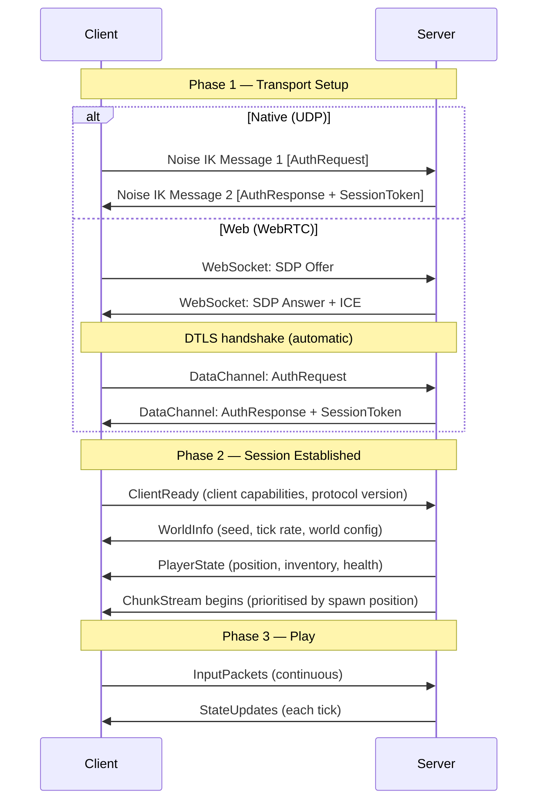
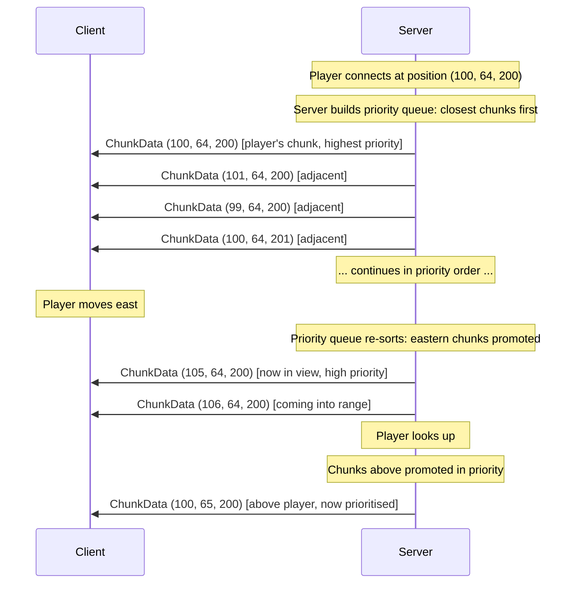
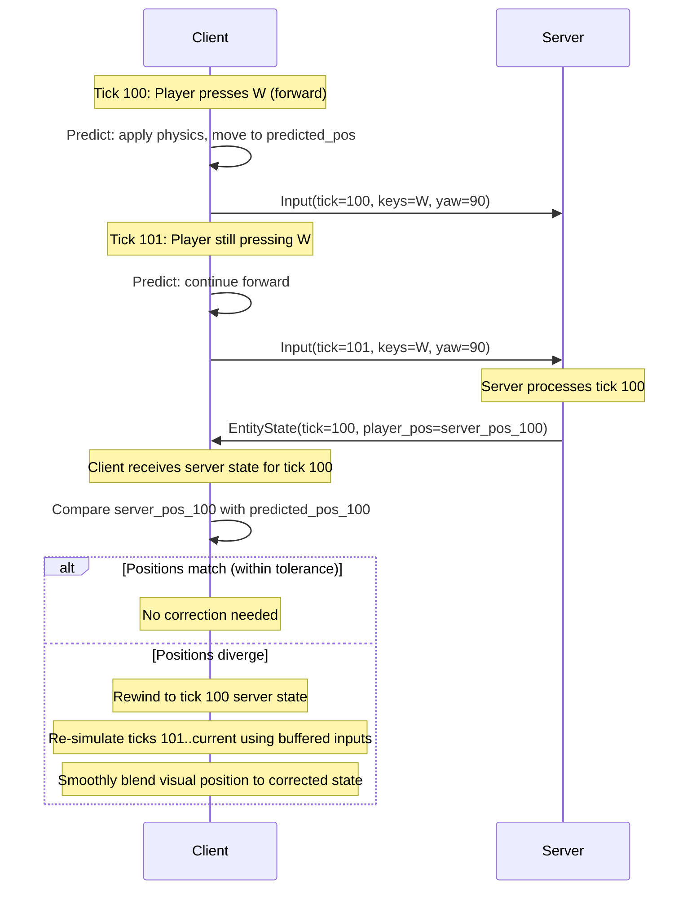
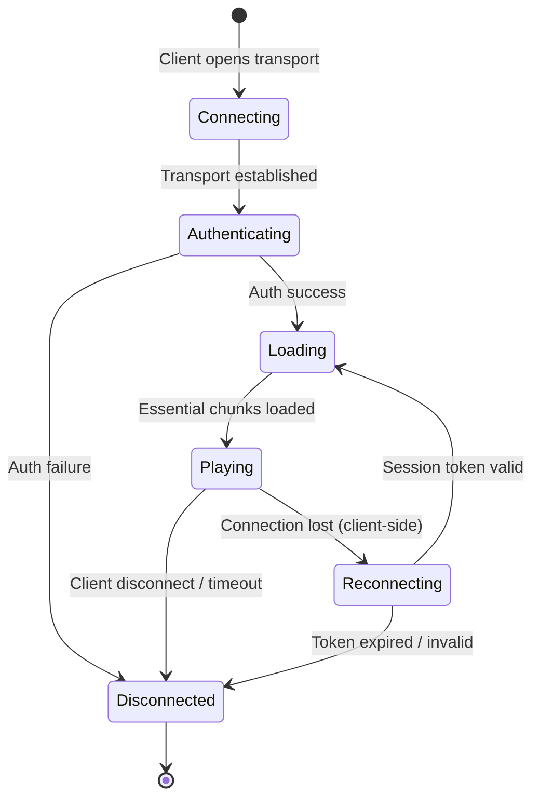

# Spec 04 — Networking Protocol

**Status**: Draft
**Date**: 2026-03-03
**Addendum**: `_audit-2026-04-18.md` first established that `PROTOCOL_VERSION` had drifted ahead of this spec. **The current wire version is `75`** (C3a-2a) (see the authoritative version-history comment in `game/engine/src/protocol.rs` for the per-version detail; this addendum logs the milestones, not every bump). The version bumps since v1:

- **v2** (2026-04-18): `StateUpdatePacket` gains `last_acked_input` for input-prediction reconciliation, plus `entity_spawns` / `entity_updates` / `entity_despawns` for server-authoritative entity sync. New structs `EntitySpawn`, `EntityUpdate`, `EntityKind`. `InputPacket` gains analog movement + discrete action flags. (Spec body below still describes v1 packet shapes — that's pending a fuller rewrite.)
- **v3** (2026-05-03): `JoinRequestPacket` gains `auth_event: Option<SignetAuthEventWire>` + `handle_credential: Option<SignetCredentialWire>`; new `ChallengePacket` (packet tag 50) lands on connect. Bincode is positional, so even `Option`-only adds force a version bump. Phase 3 of the engine-Signet-auth foundation. The verify path is gated behind `signet::USE_SIGNET_AUTH` (currently `false`), so the new fields ride alongside the old `player_name` BRIDGE — see §1.8.4. *(Superseded: `USE_SIGNET_AUTH` was retired at v49 on 2026-06-16; identity is policy-driven via `hosted_server::resolve_join_identity`. See §1.8.4 and Spec 08 §9.0.1.)*
- **v8** (2026-05-13): Wave 25 adds new `BlockId`s (`PURE_DEEPSLATE` + 3 deepslate ore variants + `SATORI_BLOCK` = ids 25..=29). Older clients without these registered would render unknown ids as `AIR` (registry fallback), producing voids in deepslate-bearing chunks; the bump forces clean rejection of stale clients. (The 3→8 jump is intentional — bumping past 4..7 was used as a "this is a content-bearing world-format change, not just protocol shape" signal.)
- **v9–v37** (2026-05-13…2026-05-23): a run of content/feature appends (block-registry waves, market hubs, auctions, server bazaar). All positional bincode appends. The authoritative per-version log is the `PROTOCOL_VERSION` history comment in `game/engine/src/protocol.rs`.
- **v38** (2026-05-24): Player avatars + first-person viewmodel. `PlayerState`'s block-only `held_item: u16` is replaced by a tool-capable `held_kind: u8` + `held_id: u16` pair (an `ItemRef` via `item_kind::{EMPTY,BLOCK,TOOL,MATERIAL}`), and gains `anim_state: u8` (locomotion: 0 idle / 1 walk / 2 jump) + `flags: u8` (`player_flags`: SWINGING=1, CROUCHING=2, ON_GROUND=4) so remote players render as animated humanoid avatars. `InputPacket` also gains `held_kind`/`held_id` so the client reports its own (client-authoritative) held item. See §4.2a.
- **v39** (2026-05-24): **Fantasy roster excised — breaking, pre-launch.** The hostile fantasy mob roster was removed from the engine entirely for open-source IP cleanliness. **7 `EntityKind` variants removed** (`Zombie`, `Skeleton`, `Spider`, `Creeper`, `Slime`, `WitherSkeleton`, `IronGolem`) — these are on the wire in `StateUpdatePacket.entity_spawns`, so dropping them shifts the serde/bincode ordinals of every later `EntityKind` variant → a breaking wire change, not an append. **5 `MaterialId` drop variants removed** (`RottenFlesh`, `SpiderEye`, `Slimeball`, `WitherSkull`, `Gunpowder`) — `MaterialId` is on the wire (and persisted in inventories), so this is also breaking and invalidates any old alpha save carrying those items. Kept on the roster: `Villager`, `Knight` (sole village defender), the `Brigand`/`Marauder`/`Berserker` bandit family, all animals, and `Arrow`/`Bone`/`Bonemeal`. Bones are re-sourced from livestock (Cow/Sheep/Pig). Entities are not persisted (alpha mob state is per-session), so the `EntityKind` removal causes no save loss. Accepted pre-launch (`project_alpha_launch_posture`). This **reverses** the HP-6 "keep retired variants forever for wire stability" decision (`docs/foundations/2026-05-23-historical-pivot-migration-cutover.md`). Design: `docs/foundations/2026-05-24-fantasy-roster-excision.md`.
- **v40–v51** (2026-05-24…2026-06-17): a further run of content/feature appends + the dedicated-server identity work — the authoritative per-version log is the `PROTOCOL_VERSION` history comment in `game/engine/src/protocol.rs`. Notable: **v51** (2026-06-17, Spec 48 Electricity) adds **`BlockChange.meta: u8`** — the per-block meta byte (facing / lit-state / powered-rail bit) now rides alongside `new_block` on the existing `StateUpdatePacket.block_changes` visual path, so power-state flips (lamp lit, cable energised, rail powered) reuse that channel. The `WorldSave` `block_meta`/`power_devices` shape change rides the same bump (Rail precedent). Design: `docs/foundations/2026-06-17-electricity-power-logic.md`.
- **Entity-sync semantics note (2026-07-12, NO wire change — still v58).** Two delivery guarantees were added on top of the v2 entity-sync channel. (1) **Late-joiner backfill**: `EntitySpawn` broadcasts once per entity (the server diff set is global), so at join-accept the server snapshots every already-broadcast entity (mobs, carts, items with stack payload) and prepends those spawns to *that client's* next `StateUpdatePacket` — merged, never a separate packet, preserving one-StateUpdate-per-tick-per-client. *(Superseded 2026-10-06, bounded StateUpdates below: the backfill now goes into that client's outbox ahead of the tick's diff, and a tick may span several StateUpdates — safe because of guarantee (2).)* (2) **Client-side delta accumulation**: `RemoteClient` accumulates `entity_spawns`/`entity_updates`/`entity_despawns` and `block_changes` across StateUpdates between frames instead of keeping only the newest packet — deltas are never last-write-wins (snapshot fields — player states, `world_time`, reserve — still are). Spec 05 §9.5 has the implementation note.
- **v59** (2026-09-03): **Weather sync (P9).** `StateUpdatePacket` gains a trailing `rain_ticks_left: u32` + `storm_ticks_left: u32` (the spec body below still describes pre-v2 packet shapes, per the note on v2 above — the authoritative field list is `StateUpdatePacket` in `game/engine/src/protocol.rs`). Fixes the pre-existing bug where a hosted/dedicated server rolled its own private weather formula (`weather::server_raining`, now deleted) that never matched what any client showed, and nothing about weather crossed the wire at all. `GameServer` now owns a `weather: Weather` field, advanced once per tick with the SAME `weather::advance` formula the client uses; the two new fields are `Weather::ticks_left(tick_counter)` — a *duration*, not the server's absolute `rain_until`/`storm_until`, so the sync is correct regardless of any tick-counter offset between server and client. Append-only, `#[serde(default)]`. **Wire-compat caveat (found while implementing this bump, applies retroactively to every prior append-only field in this file):** `#[serde(default)]` is well-known to work for a self-describing format (JSON — a missing key is just absent) but is **inert** against bincode 1's positional decode of a genuinely shorter stream: the derived `Deserialize`'s `SeqAccess` always attempts to read every field the CURRENT struct declares and propagates the inner decode's EOF the moment bytes run out, rather than reporting "no more elements" so the default can kick in (`game/engine/src/save.rs`'s `read_tail`/`deserialize_world_save_tolerant` documents and works around the identical gotcha for `WorldSave`). In practice this has never mattered for `StateUpdatePacket` (or any prior append) because `hosted_server.rs`'s `protocol_version` check rejects a version-mismatched `JoinRequest` before any `StateUpdatePacket` is ever exchanged — so a v58-shaped packet reaching a v59 decoder is unreachable in production. `#[serde(default)]` is kept for documentation/consistency and as a ready foundation for a real `read_tail`-style tolerant decode, should the version gate ever be relaxed to allow forward/backward-compatible peers.
- **v60** (2026-09-05): **World chat.** Two new `PacketType` variants, appended (never renumbered — discriminants are a wire-stable promise): `ChatSay = 54` (C→S, `{ text: String }`) and `ChatDeliver = 55` (S→C, `{ from_pubkey: Option<[u8; 32]>, from_name: String, text: String, kind: ChatWireKind }`, `ChatWireKind = Player | Room | System`). Two asymmetric packets rather than one symmetric one: `ChatSay` carries only what the client is entitled to assert — the text it typed — never who it is speaking as. `ChatDeliver` carries what the server has decided: attribution (`from_pubkey`/`from_name`, server-chosen, never client-asserted) and the line's kind. A single symmetric packet would invite a client to assert its own `from` field, which is exactly the hole this design closes. `ChatDeliver` is also never broadcast: the tier/level permission rule (`docs/foundations/2026-09-05-world-chat.md` §2.3) is evaluated **per recipient**, because the permission decision itself is per-recipient — a stranger and a kin standing next to each other can receive different deliveries of the same spoken line, or none. This is why chat does not join the existing "same bytes to everyone" broadcast queue (§4.2, `hosted_server.rs`'s `broadcasts` queue) — it is a loop over connected slots evaluating the rule and calling `send_to_client` only where it passes. Native only; `check.sh`'s forbidden-symbol gate fails the build if either symbol reaches the WASM bundle. Design: `docs/foundations/2026-09-05-world-chat.md`.
- **v61** (2026-09-06): **Full-fidelity item wire (death-drops phase 3, solo-queue wave).** A new `WireItem` enum rides as a trailing `full_item` field on `EntitySpawn` and on `InventoryGrantPacket`, carrying a tool's type/material/durability and an armour piece's slot/material/durability alongside the existing block/material id. Both packet shapes CHANGED (two structs widened), hence the bump rather than a pure append. Before it, a server-simulated player's tool and armour drops could not be described on the wire and sat on the floor until lifetime expiry; they are now granted to — and rendered for — that player like any other drop. Plans stay floor-bound by design. See `docs/foundations/2026-07-12-full-fidelity-item-wire.md`.
- **v62** (2026-09-07): **Device interactions on the wire (Wind/Copper/Electricity wave).** One new `PacketType` variant, appended: `DeviceInteract = 56` (C→S, `{ pos: (i32, i32, i32) }`). Until now nothing on the wire carried a *device interaction* at all: block placements and breaks travelled as `BlockChange`, and autonomous power sources (Windmill, Water Wheel, pressure plates, sensors, a generator burning fuel) reached the host through the server's own sim — but a **switch** had no carrier, so a joiner's lever/button/crank/mirror flipped only their own copy of the world while the host, which owns the authoritative power sim, never heard about it. See §2.3 for the packet row and the authority model. Append-only; no existing packet shape changed.
- **v63** (2026-09-27): **Join channel binding (audit fix B).** `ChallengePacket` **loses** its `origin` field (packet shape CHANGED, v48 had added it). The joiner signs an origin it builds from its OWN transport (`signet::join_origin`: `axenstax-join:tls-exporter:<hex>` over the QUIC TLS exporter, or `axenstax-join:unbound`), and the host recomputes it from its own transport and requires an exact match. Closes the join-relay and web-login-oracle attacks. See §1.8.1 and Spec 08 §9.0.1.
- **v64** (2026-09-28): **QUIC game-packet framing (audit wave 1).** Every game packet, both ways, now rides ONE reliable, ordered QUIC bidirectional stream per connection, framed as `u32 LE length + payload` (max 16 MiB — lowered to `MAX_WIRE_PACKET_LEN` on 2026-10-06, see the next entry); the client opens it with a zero-length hello frame and the server accepts it within 10 s. QUIC datagrams are no longer used (they were MTU-capped and never retransmitted, so busy `StateUpdate`s and large `JoinAccept`s were silently lost). The server closes a QUIC client with more than `MAX_OUTBOUND_QUEUE_BYTES = 8 MiB` queued ("connection too slow"). No packet shape changed; the framing did, so v63 and v64 peers are incompatible. See "Game-packet framing" in the Phase 1 implementation notes.
- **Bounded StateUpdates (2026-10-06, gap-audit T1-5 + T2-12, NO wire change — still v64).** A tick's block changes and entity events no longer have to fit in one `StateUpdatePacket`: each joined client has an outbox (`state_outbox.rs`) that splits them across as many StateUpdates as needed, each at most `STATE_UPDATE_MAX_BYTES = 56 KiB` (measured, 8 KiB under the decode cap), and holds a remote client to `CLIENT_TICK_BUDGET_BYTES = 48 KiB` a tick (~1 MB/s), the rest following on later ticks in order. Every StateUpdate repeats the tick's snapshot fields. A backlog coalesces repeated edits to one cell (latest wins; never across a block that carries a block entity or other apply side effect); past `CLIENT_QUEUE_MAX_BYTES = 2 MiB` the queued block changes are dropped and their chunks recorded for resync (`HostedServer::take_chunk_resync_requests`, the Phase B seam). The transport frame cap drops from 16 MiB to `protocol::MAX_WIRE_PACKET_LEN` (1-byte tag + `MAX_PACKET_SIZE` 64 KiB) on QUIC and on the WebSocket accept side. Why no bump: no packet shape changed; a v64 client already accumulates deltas across StateUpdates (2026-07-12 note above), so several per tick decode and apply correctly; and a frame between the two caps could never pass `safe_deserialize`, so refusing it at the header only changes *when* it fails. See "Bounded StateUpdates" in the Phase 1 implementation notes.
- **v65** (2026-10-06): **Join world flags + worldgen version (gap-audit T2-9).** `JoinAcceptPacket` gains trailing `world_rules: WorldRules` (`world_type`, `ground`, `water_depth`, `is_workshop`, `time_lock`, `mobs_enabled`, `explosives_enabled`, `fire_spread_enabled`, `keep_inventory` — exactly the `WorldMeta` fields that change terrain output or gameplay rules; `commands_enabled` is deliberately not carried, it would also gate a joiner's chat key) + `worldgen_version: u32` (the host's `world::worldgen_fingerprint()`: since Phase B0 `WORLDGEN_VERSION` folded with the bundled plan registry's content hash, Spec 02 §5.2). `JoinRequestPacket` gains trailing `worldgen_version: u32` (the joiner's), stored on `ServerPlayer.client_worldgen_version` and read through `ServerPlayer::worldgen_mismatch()` (Phase B will push real chunks to such a client). **Joiner behaviour fixed with it:** before v65 the joiner never applied the `JoinAccept` seed or spawn — it entered `GameMode::Loading` at once and generated from a blank `WorldMeta::new` with a *random* seed (`RemoteClient::poll` only ran in Playing). Now the loading screen polls the client and does not run `begin_load` until `JoinAccept` arrives (`remote_client::join_gate`; refusal / lost link → lobby with the reason; no answer within `JOIN_ACCEPT_TIMEOUT_SECS = 90` → "The host didn't let us in. Try joining again."). It then builds the joined world's meta from the accept (`JoinedWorld::to_meta`: seed + rules, never saved), applies it (`apply_world_seed` + `World::apply_meta_rules` + the explosives / fire caches) and places player 0 at the accept's spawn (non-finite spawns are dropped; a finite spawn outside ±30,000,000 blocks horizontally or outside Y −64 … 160 is **refused** — `remote_client::join_spawn_refusal`, "The host sent a starting position outside the world…" — because chunk coordinates derived from it would overflow) before any column is generated. A different `worldgen_version` shows the toast "This world was made with a different version of the game. Some terrain may look different until you update." and logs a warning. A server that cannot decode a JoinRequest now reads its leading `protocol_version` (`protocol::peek_protocol_version`) and refuses it with the mismatch reason, so an older client no longer waits in silence.
- **v66** (2026-10-06): **WebSocket join origin (T-JOIN-RELAY WebSocket residual).** `JoinRequestPacket` gains a trailing `ws_host: String`: the normalised `host[:port]` a WebSocket joiner actually dialled (`signet::ws_host::ws_url_host`; empty on QUIC and in-process joins). A WS join now signs `axenstax-join:ws-host:<ws_host>` instead of `axenstax-join:unbound`. The server re-normalises the declared host, refuses it unless it is one of its public hosts (`--public-host`, `AXENSTAX_PUBLIC_HOST`, `AXENSTAX_DOMAIN`; an unconfigured server accepts any host), requires the auth event's origin to match exactly, and signs its `JoinAccept` identity proof over the same origin. Bumped because a v65 WS client signs `unbound`, which a v66 server refuses; the version reason is clearer. See §1.8.1 and Spec 08 §9.0.1.
- **v67** (2026-10-06, MP-A3): **Server projectiles + server-held death.** Three appends, no existing shape changed: `EntityKind::Projectile = 39` (a projectile in flight rides the ordinary entity spawn/update/despawn diff; `yaw` = flight heading, `EntityUpdate.state` 0 arrow / 1 blunt), `PacketType::Respawn = 57` (C→S, empty payload) and two `PlayerEventType` variants, `Died` and `Respawned { x, y, z }` (S→C). Before it a dedicated server's dispenser arrow was consumed, never flew, never hit and was never seen, and a joiner's server copy revived itself 40 ticks after death (the BRIDGE) and vacuumed up its own death drops while the joiner was still on the death screen. Bumped because a v66 peer can't decode the new variants. See §4.2b.
- **Joiner position truth (2026-10-06, MP step 1, NO wire change — still v67).** `StateUpdatePacket.last_acked_input` now carries the real sequence number of the last input the server applied for that client (was always `0`); each queued joiner input is simulated with its own look; the joiner predicts its own body and reconciles against the server's (snap beyond 1 block, camera glide below); a dedicated server spawns joiners on the surface instead of at `(0.5, 80, 0.5)`. Review fixes the same day: the prediction records under the sequence number the connection stamped on the wire (`RemoteClient::send_input` returns it; it counts from 1 per connection), a frame hitch catches up instead of losing steps, a LAN / online host generates terrain ahead of its joiners, a ride sends no movement, and a joiner cannot teleport itself. See §5.3.1.
- **Hosted mode: the host lends its world (2026-10-06, D1, NO wire change — still v67).** A LAN / online host's embedded server no longer keeps a second copy of the world: the host client lends it its `World` + ECS + fluid/fire/leaf systems for each tick (`sim_lend::LentSim`), so every joiner's `StateUpdate` is diffed from the host's real world and entities, and each shared sim system runs once (an ownership table + a per-world tally tripwire). The host's own edits are broadcast without the joiner budget/validation; `mirror_host_world_state` survives only on the `--no-lend` path. Review fixes the same day: the host client's streamer keeps every joiner's columns loaded (they anchor it at the server's sim distance), split-screen seats get server slots, and one owner per system per mode is pinned by a GPU-free table test. Why no bump: no packet shape changed, and a joiner cannot tell a lending host from an owning one except that what it is sent now matches what the host sees. `--no-lend` keeps the old owning server for one release. See "Hosted mode — the host lends its world" in the Phase 1 implementation notes.
- **v68** (2026-10-07, MP-D2a): **Joiners see the server's mobs and are hurt by them.** `EntityUpdate` gains trailing `vx`/`vy`/`vz` (blocks/tick) and `flags` (`protocol::entity_flags`: hurt flash, baby, tamed, Satoshi) and is now sent **changed-only**; every entity event is filtered **per client** by an interest radius round a joiner's body (`entity_broadcast`), which also replaces the late-joiner backfill. `InputPacket` gains trailing `armour_points: u8` and `health_delta: f32`: the server lands hostile melee and lava/fire contact on a joiner's body, and a joiner's health is the server's (its client reports only the changes it still owns). A joiner runs no mobs of its own and draws the server's from a render-only mirror (`remote_mobs`). Packet shapes changed, hence the bump. See §4.2c and §5.3.2.
- **v69** (2026-10-07, Phase B2a): **Chunk push.** The server sends joiners the world itself: `ChunkDataPacket` (tag 3 — decoded by clients since the first wire, never sent until now) gains its side data (`meta: Vec<(u16, u8)>`, render-visible `entities: Vec<PushedBlockEntity>`, face `attachments: Vec<PushedFaceAttachment>`) and continuation packets (empty `compressed_blocks`); `JoinRequestPacket` gains trailing `render_distance: u8`; `InputPacket` gains trailing `chunk_ack: u32` (cumulative chunk packets taken in — the push's credit window), `chunk_drops: Vec<ChunkDrop { cx, cz, as_of }>` (columns the client let go of) and `render_distance: u8` (its current render distance; `0` = unchanged). Server block changes now reach a joiner only for chunks it has been sent (its sent-set). Bumped because three packet shapes changed. See §4.1 "As built".
- **v70** (2026-10-07, MP-D2b): **Joiners act on the server's mobs.** Appended, no existing shape changed: `PacketType::EntityAttack = 58` and `EntityInteract = 59` (C→S: a swing, or a one-shot right-click — `InteractKind` feed, tame, shear, milk, Lead on, Lead off, sit toggle — on the entity named by its `ProtocolId`, or `LeadToPost { post }`, a Lead on a fence post; the held item is the client's word), `InteractOutcome = 60` (S→C, to the asker: accepted, items to take from the hand, a note code — 17 `NotOnThisServer` where the server doesn't simulate breeding, Leads or pets) and `KillEvent = 61` (S→C, to the killer alone: species, why it was credited — `kill_reason::LAST_HIT` / `NEAREST` — position, flags); `PlayerEventType::DiedOf { cause: WireDamageCause }` (sent instead of `Died`: the death screen's real cause), `ArmourWorn { hits }` (server-landed hits, keg blasts included, wear the joiner's armour) and `Bred { offspring }` (a baby born to an animal this joiner fed); `entity_flags::TETHERED = 16`. A joiner's kill or breed credits that joiner and never a host's player, nor a later joiner given its slot. Bumped because a v69 peer can't decode the new variants. See §4.2d.
- **v71** (2026-10-07, Phase B2b): **Touched columns.** A joiner whose terrain generator matches the host's is pushed only the columns that differ from generation; for every other column within its push radius the server sends `PacketType::ColumnLocal = 4` (`ColumnLocalPacket { cx, cz, hash }`, 13 bytes; `hash` = `chunk_verdict::column_hash` of the column as generation makes it, cached with its `Untouched` verdict, so also the server's live column) in the same ordered, numbered chunk stream (it counts towards `chunk_ack`), and the joiner generates that column itself and checks the hash. `JoinAcceptPacket` gains trailing `chunk_note_radius: u8`: the server's push limit when it sends notes, `0` when it pushes everything (`--chunk-sync all`, another generator, an owning `--no-lend` host). `InputPacket` gains trailing `column_mismatch: Option<ColumnMismatch { cx, cz, server_hash, client_hash }>`, a sticky "push me everything" switch (ignored from a joiner the server never sent a note). `--chunk-sync touched` is now the default. Bumped because packet shapes and a packet type were added. See §4.1 "Touched columns".
- **v72** (2026-10-07, C1): **The server yields a joiner's breaks.** `InputPacket` gains trailing `mined: Vec<MinedBlock>` (`MinedBlock { x, y, z: i32, tool: WireItem }`, at most `MAX_MINED_PER_INPUT = 16` read; appended after B2b's `column_mismatch`): the cells the client's survival break arm mined since its previous input, each with the tool it mined with. The server computes the drop by the client's own rules (`break_drops`: crop harvest, tool-tier mine drop + bonus, Satori on the world's Proof-of-Play secret) and grants it by `InventoryGrant`; a joined client no longer grants itself break drops. The server also keeps a shadow of each joiner's inventory with a log-only possession check on placements. Packet shape CHANGED, hence the bump. See §4.2e.
- **A client's packets past the per-tick budget wait; they are never dropped (2026-10-07, FU1, NO wire change — still v72).** The server used to read 10 of a client's packets a tick and discard the rest, so the swing or right-click a client made while catching up after a frame hitch (ten inputs a frame, then the action) was lost unanswered. Packets past the budget now wait in a per-client inbound queue for the next tick, in arrival order; only a client past the queue's hard bound (1024 packets or 8 MiB) is disconnected, with a reason. See §11.2a.
- **v73** (2026-10-07, C2a): **A joiner's hunger, eating and sleep are the server's.** Appended: `PacketType::ItemAction = 62` (C→S, `ItemActionPacket { seq, action: ItemAction }`, `ItemAction` = `Eat { hotbar_slot, held_kind, held_id, held_full }` | `Sleep { bed: [i32; 3] }`, append only — C2b adds `Craft` and `Drop`) and `ItemActionOutcome = 63` (S→C, to the asker: `{ seq, accepted, consume_held, note }`); `StateUpdatePacket` gains trailing `own_hunger: u8` (per client, like `last_acked_input`: the addressed joiner's hunger as the server holds it). The server runs every joiner's metabolism (the client's `PlayerCombat::tick_metabolism`, starvation floor from its own difficulty; Hard starvation is a server death, `DiedOf { Starvation }`); a joined client runs none of its own and eats and sleeps by request; `InputPacket.health_delta` counts **losses only** (a reported heal is zero; `MAX_REPORTED_HEAL_PER_INPUT` is gone). A joiner's sleep sets its server spawn point and heals it but never skips the night. Also (no wire change): a request's item claim ends when the server acknowledges the input sent after it, not after FU1's 10 s (FU verify N4). See §4.2f, §5.3.2.
- **The FU1 verify fixes (2026-10-07, FU3, NO wire change — still v73).** The inbound queue's hard bound is bytes only (8 MiB, each packet charged 64 bytes more): FU1's 1,024-packet bound disconnected every joiner after an honest host stall of about 51 s, because each joiner's bridge thread keeps queueing while the host's game thread is stopped. A client with more than 40 packets waiting is read 64 a tick (catch-up); entity requests and device interactions past their per-kind budgets wait instead of being skipped. Block edits past the 4-a-tick budget wait in a per-client edit queue (with their input's tags and hand) instead of being refused, up to a hard cap of 16,384. The server derives a joiner's campfire smoke itself (`campfire::on_block_edit`), so a campfire action is one edit, and a joiner runs no campfire sweep. A closed connection's slot is freed only after a fill that began after the close. A refused milk or shear skips every later mob arm of that click (it untied a leashed cow), and `entity_flags::PRODUCT_NOT_READY` (bit 32; 0 = ready or unknown, so no bump) lets a joiner's bucket or shears click on an animal that isn't ready go to the block. See §11.2a, §4.1, §4.2d.
- **v74** (2026-10-07, C2b): **A joiner's crafting and Q-drops are mirrored on the server.** `ItemAction` appends `Craft { grid: [(u8, u16); 9], table: Option<[i32; 3]> }` (= 2: the grid as it stood before the craft, row-major `item_to_ref` pairs; the crafting table the 3×3 grid was opened from) and `Drop { hotbar_slot, held_kind, held_id, held_full }` (= 3, `Eat`'s held claim). Both are fire-and-forget: `ItemActionPacket.seq` still moves on, no outcome is sent, no new `PacketType`. The server mirrors a craft on its shadow of the joiner's inventory (`item_actions::judge_craft`: a known recipe from blocks and materials, a recipe bigger than 2×2 only at a crafting table in block reach; one of each input taken, owed; the output added) and spawns a Q-drop as a real ground item thrown from the joiner's server body (full fidelity from `held_full`), paced by a per-joiner token bucket (2, refilled one per `DROP_INTERVAL_TICKS` = 4; a drop it can't pay for waits in the inbound queue). (C2b first spilled a grant that didn't fit the shadow; the C2b-fix reversed it: the `InventoryGrant` carries the whole stack and the overflow is tallied, §4.2e.) On the client, a Q-drop or a craft click that would spend an item a request in flight claims does nothing, and an owed outcome is paid from the 36 slots, then the crafting grid, then the cursor. `ServerPlayer.crafting_ui` (a dead BRIDGE) is gone. See §4.2f, §4.2e, §4.2d.
- **v75** (2026-10-08, C3a-2a): **The server mirrors a joiner's inventory window, click for click.** Appended: `PacketType::WindowOp = 64` (C→S, `WindowOpPacket { op_seq: u32, op: WireWindowOp, digest: u32 }`; `WireWindowOp` = `Click(window::WindowClick)` | `OpenPlayer` | `OpenTable { cell: [i32; 3] }` | `SetAutoRefill { on: bool }`, append only), never answered. `window::WindowClick` (Slot = 0 … Close = 10), `window::WindowSlot` and `crafting::CraftSlot` become wire data, append only; a drag's slot list over 45 doesn't decode. The client sends one op for every window transition it applies, with its window digest after it; the server applies the same `window::apply` to its copy of the joiner's window (36 slots, armour, cursor, craft grid, station) behind the client's edits, at most `MAX_WINDOW_OPS_PER_TICK` = 8 a tick (the rest wait), and tallies digest mismatches (log-only). `ItemAction::Craft` (= 2) is unused — the craft is the result click — and a v75 server ignores and tallies it. The server's owed payment searches its 36 slots, then its grid, then its cursor (the client's search); a server-landed hit wears its copy of the armour; an accepted swing wears the weapon where it now is (`joiner_actions::where_now`, shared). See §4.2g.

**Depends on**: ADR-001 (Full Custom Engine), ADR-002 (Tech Stack)

> **AS-BUILT (audit 2026-10-04).** Sections 0-3, 4.1 and 10 below are the original design and read as if built; they are not. As shipped: the native transport is **QUIC (quinn)**, plus a **WebSocket** transport for the dedicated server; there is **no raw-UDP / Noise IK transport and no WebRTC** (the web build is an offline taster with no multiplayer). The wire version is a **`u32`** (`PROTOCOL_VERSION`, currently 74), not a `u16`. **The §4.1 chunk push is built (v69, Phase B2a; touched columns v71, Phase B2b) but not as designed below** — see §4.1 "As built": a joiner receives the world **seed, rule flags and spawn** in `JoinAccept` (v65) and builds its world from them; round its server body the server either pushes a column (`ChunkData`, when it differs from generation — or always, under `--chunk-sync all` or for a joiner with another generator), which replaces anything the joiner holds there, or tells it the column is local (`ColumnLocal`), and the joiner generates it itself; block deltas then arrive in `StateUpdate` for the chunks it has been sent or told are local. **NAT traversal (§1.7) is built** for online play by contact (`nat/`, `rendezvous/`, §1.9), but as player-run hole-punching over player-chosen Nostr relays, not the platform STUN/TURN relay described in §1.7. The matchmaker / platform-JWT auth path is retired (§9.2).

> **Server-side column streaming is built (Phase B1, 2026-10-06); the chunk push is built too (Phase B2a, 2026-10-07; only touched columns since Phase B2b, §4.1 "As built").** A dedicated server loads and unloads world columns around every connected player itself, within `--sim-distance` (default 8) — its own *simulation region*, so a server-simulated joiner stands on server terrain and edits are accepted anywhere a player goes (Spec 01 §4.1.2). The chunk push sends joiners what that region holds (§4.1 "As built"). LAN / online hosts do not stream server-side; their server keeps the `initial_load` region and generates the 3×3 round each joiner as it moves (§5.3.1) — never both in one mode.
>
> **Block deltas for columns a client does not hold (2026-10-06; filtered since B2a, 2026-10-07).** The server sends a joiner a block change only for a chunk in its sent-set (§4.1 "As built"); a change to a chunk not yet sent is dropped for that joiner, and the push delivers the chunk whole, with the change in it. A pushed column counts as loaded on the joiner. As a second line, a joiner still applies a change only to a column it holds, loaded or evicted (`chunk_stream::remote_change_is_loaded`), and drops the rest: applying one used to create a stray chunk that the joiner's own generation then skipped, leaving a 16³ hole. The LAN host's loopback (`--no-lend`) keeps these changes instead, because its world is the save of record: it generates the column, applies the change and evicts it (Spec 02 §7.5.1).

---

## 0. Design Principles

1. **Server-authoritative**: The server is the single source of truth for all game state. Clients predict locally for responsiveness but always yield to the server's canonical state.
2. **UDP-first**: All game-critical traffic uses unreliable datagrams as the base transport. Reliability is layered selectively where needed.
3. **Bandwidth-frugal**: The protocol is designed around egress cost being the dominant operational expense. Every byte must justify its existence.
4. **Transport-agnostic internals**: The server sees a unified `Transport` trait. Whether the underlying bytes arrive via raw UDP or WebRTC DataChannel is invisible to all game logic above the transport layer.
5. **Shard-scoped**: Each world instance is a standalone server process. There is no cross-shard game protocol — only platform-level coordination (matchmaking, identity) happens outside the shard.

---

## 1. Transport Layer

### 1.1 Dual Transport Architecture

Native clients communicate over raw UDP sockets. Web clients (WASM) cannot open raw UDP sockets, so they use WebRTC DataChannels configured for unordered, unreliable delivery — the closest browser-available primitive to raw UDP.

The server runs both listeners simultaneously:

```
                  +-----------------+
                  |   Game Server   |
                  |                 |
                  |  +-----------+  |
                  |  | Transport |  |
                  |  |   Trait   |  |
                  |  +-----+-----+  |
                  |        |        |
                  |  +-----+-----+  |
                  |  |           |   |
                  | UDP    WebRTC   |
                  | :7700  :7701   |
                  +-----------------+
```

#### Transport Trait (Rust)

```rust
/// A peer-agnostic transport handle. All game code operates on this.
pub trait Transport: Send + Sync {
    /// Send a packet to a connected peer.
    fn send(&self, peer: PeerId, data: &[u8]) -> Result<(), TransportError>;

    /// Receive the next inbound packet (non-blocking).
    fn recv(&self) -> Option<(PeerId, Vec<u8>)>;

    /// Disconnect a peer, sending a best-effort close notification.
    fn disconnect(&self, peer: PeerId, reason: DisconnectReason);

    /// Round-trip time estimate for a peer, in milliseconds.
    fn rtt_ms(&self, peer: PeerId) -> Option<u32>;

    /// Maximum payload size for a single packet to this peer.
    fn mtu(&self, peer: PeerId) -> u16;
}
```

`PeerId` is a server-local `u64` handle assigned on connection. It is not stable across reconnects.

### 1.2 UDP Transport (Native Clients)

- Server binds a single UDP socket on port `7700` (configurable).
- Clients send from an ephemeral port.
- The server maintains a `HashMap<SocketAddr, PeerId>` for demuxing inbound datagrams.
- MTU discovery uses PMTUD (Path MTU Discovery) with DF bit set. Fallback safe MTU: **1200 bytes** payload (fits in a 1280-byte IPv6 minimum MTU packet after headers).

### 1.3 WebRTC Transport (Web Clients)

- The server runs a lightweight WebRTC endpoint on port `7701` (configurable).
- Signalling uses a WebSocket on port `7702` (or shared with the game's HTTP health/info endpoint) to exchange SDP offers/answers and ICE candidates.
- A single DataChannel per connection is created with `ordered: false, maxRetransmits: 0` — this gives UDP-like semantics.
- SCTP-level reliability is disabled; the Axe'n'Stax reliability layer (Section 3) operates above this.
- DTLS encryption is mandatory and handled by the WebRTC stack.
- MTU for WebRTC DataChannels: **1200 bytes** payload (conservative; SCTP fragmentation exists but we avoid it to keep latency predictable).

#### Why not WebTransport?

WebTransport (HTTP/3 + QUIC datagrams) is an emerging alternative. The architecture supports adding a `WebTransportBackend` behind the `Transport` trait in the future. WebRTC is the implementation target because it has broad browser support today and provides the unordered/unreliable semantics we need.

### 1.3a WebSocket Transport (Alpha Dedicated Server)

The UDP + WebRTC design above is the destination. The **alpha self-hostable dedicated server** (`axenstax-engine --server`, shipped as a Docker image — see `tools/dedicated-server/`) uses a simpler **WebSocket** transport behind the same `Transport` trait, because one origin can serve *both* the browser PWA and the native client over TCP/WS with zero NAT/STUN/signalling machinery — which is what a person self-hosting on a home box or NAS actually wants. It coexists with (does not replace) the UDP/WebRTC path.

- **Native clients** connect directly to a plain WebSocket: **`ws://host:6767`**.
- **Browser clients** connect over a single HTTPS origin that Caddy fronts, which reverse-proxies `/ws` to the engine: **`wss://host:8443/ws`** on a no-domain/LAN box (self-signed cert), or **`wss://host/ws`** on 443 when a real domain is configured (`AXENSTAX_DOMAIN` → ACME). WebGPU *requires* a secure context off-localhost, so the web path is always TLS.
- The game socket port is **configurable** via `--port` / `AXENSTAX_WS_PORT`; the default lives in `ws_transport::DEFAULT_WS_PORT`.
- **Sign-in is required by default** (2026-10-06, owner decision O-7 #3; see Spec 08 §9.0.1). `server_main::load_access_policy`: the `<identity-dir>/require_signin` file wins (`true` = required, anything else = guests admitted); else `require_signin = !allow_guests` (`--allow-guests` bare or `--allow-guests 1`, or `AXENSTAX_ALLOW_GUESTS=1`; `--allow-guests 0` / `=false` keeps sign-in required, and a non-boolean value refuses to boot). A server set up with the old Operator Console wizard (default "Anyone") already has a `require_signin` file reading `false` and so stays guest-open until the operator changes it — see Spec 08 §9.0.1 for how to check and switch. `--require-signin` / `AXENSTAX_REQUIRE_SIGNIN` are accepted, logged and ignored. A signed-in **native** client joins `ws://` / `axenstax://` **authenticated** (`game_loop::connect_websocket_native` → `RemoteClient::connect_websocket_authed`, signed by the restored bunker over the `axenstax-join:ws-host:<dialled host>` origin (v66) — WS has no channel binding, so relay protection depends on the server knowing its public address, §1.8.1); a signed-out one joins as a guest and is refused unless the server admits guests. Browser clients have no signer, so they need a guest-open server.

#### Why port 6767

`6767` is in the IANA **registered/user range** (1024–49151), so it's unprivileged (no root to bind) and clear of the ephemeral range the OS hands to outbound sockets. It's clash-free with common services (it is deliberately **not** near Minecraft's `25565`), and it's memorable: on a phone keypad it loosely reads **STAX**, and `67`/`6-7` is a recognisable meme number — a small bit of identity, like Minecraft's 25565 became. The web origin stays on the conventional **8443** (self-signed LAN) / **443** (domain), because there a *unique* port is a liability — browsers, proxies, and firewalls expect standard HTTPS. The choice is intentionally low-stakes and may change; it is a default, not a protocol constant.

### 1.4 Encryption

| Transport | Encryption | Key Exchange |
|-----------|-----------|--------------|
| WebRTC DataChannel | DTLS 1.2+ (mandatory per WebRTC spec) | Built into WebRTC handshake |
| Raw UDP (Native) | Noise Protocol Framework (IK pattern) | Server static key published in server info; client ephemeral key per session |

#### Noise IK Handshake (Native UDP)

The Noise IK pattern allows the client to encrypt the first payload message (which contains the auth token), because the client already knows the server's static public key (obtained from the session directory or server info endpoint).

```
Client                              Server
  |                                    |
  |  -> e, es, s, ss [AuthRequest]     |   Noise IK message 1
  |                                    |
  |  <- e, ee, se [AuthResponse]       |   Noise IK message 2
  |                                    |
  |  [Noise transport phase begins]    |
  |  All subsequent packets encrypted  |
```

- Curve: `Curve25519`
- Cipher: `ChaChaPoly`
- Hash: `BLAKE2s`

The handshake completes in **1 RTT**. After the handshake, all packets are encrypted and authenticated with a 16-byte AEAD tag. The per-packet overhead is:

```
Noise transport message overhead:
  Nonce (implicit from counter): 0 bytes (counter-based)
  AEAD tag:                     16 bytes
  Total overhead per packet:    16 bytes
```

### 1.5 Connection Handshake



### 1.6 Session Tokens

Upon successful authentication, the server issues a **session token**: a 32-byte random value. The client includes this token in reconnection attempts (Section 9.3). Tokens expire after **5 minutes** of disconnection.

Session tokens are never sent in plaintext — they are always inside the encrypted transport.

### 1.7 NAT Traversal (Personal-Tier Servers)

Personal-tier servers run on home networks behind NAT. Two strategies, tried in order:

1. **UPnP / NAT-PMP / PCP**: The server binary attempts automatic port mapping on startup. This works on most consumer routers.
2. **STUN + Relay Fallback**: If direct mapping fails, the server registers with a platform-operated STUN server to discover its public address. If the NAT is symmetric (no stable mapping), traffic routes through a lightweight TURN-like relay operated by the platform. The relay is bandwidth-capped per free-tier policy.

For web clients connecting to personal-tier servers, the WebRTC ICE negotiation handles NAT traversal natively using the same STUN/TURN infrastructure.

### 1.8 Player Identity (Signet Persona)

A player's network identity is **two cryptographic artefacts** — both signed by the same key, both carried in the join handshake:

| Artefact | Source | Purpose |
|---|---|---|
| **Persona pubkey** (`32-byte x-only`) | From the Signet persona keypair (`nsec-tree` derivation) on the player's Signet-app install | Stable identity. Ban key. Never changes. |
| **Handle credential** (`kind 31000` Nostr event) | Published by Signet-app when the user sets/edits their persona display name | Source-of-truth for the player's in-game handle. Can be superseded. |

The handle is **never client-asserted**. The server extracts it from the `display-name` tag of the signed kind-31000 credential and uses that value — whatever the client might say elsewhere is ignored.

#### 1.8.1 Join Handshake with Identity

The existing `JoinRequestPacket` (see §2.3) grows two additional fields alongside the current `protocol_version` + `player_name`:

```rust
pub struct JoinRequestPacket {
    pub protocol_version: u32,
    pub player_name: String,           // BRIDGE — see §1.8.4
    pub auth_event: SignetAuthEvent,   // signed kind-21236, challenge = server nonce
    pub handle_credential: Option<SignetCredential>,  // signed kind-31000
}
```

Server verification on receipt:

1. **Auth-event check**: verify the kind-21236 Schnorr signature against `auth_event.pubkey`. Check `challenge` matches the server's most recent per-client nonce (replay defence). Check `origin` equals `signet::join_origin(<this connection's channel binding>)`, which the server computes from its OWN transport. Reject on any failure.
   - **Join origin (protocol v63, audit fix B).** The origin is never sent by the server: `ChallengePacket` carries only `nonce_hex`. Client and server each build it from their own transport: `axenstax-join:tls-exporter:<64 lowercase hex>` where the hex is 32 bytes of the QUIC connection's TLS keying-material exporter (`quinn::Connection::export_keying_material`, label `EXPORTER-axenstax-join-v1`, empty context, computed once after the handshake: `network::channel_binding_of`), `axenstax-join:ws-host:<host[:port]>` over WebSocket (v66, next bullet), or `axenstax-join:unbound` on an in-process channel (`signet::client_join_origin` on the joiner). Both ends of one QUIC connection derive the same exporter even though certificate verification is skipped; a relaying host holds two TLS sessions with different exporters, so a signature it relays fails this check. The `axenstax-join:` scheme can never equal an `https://` web origin, so a join signature can never be replayed as a website login. An exporter failure yields `unbound` on that side, which then mismatches and fails closed. Before v63 the server supplied `https://localhost:<port>` and the client signed whatever it received; that was a signing oracle (see Spec 08 §9.0.1).
   - **WebSocket join origin (v66).** WS TLS terminates at the reverse proxy (Caddy), so there is no end-to-end binding on that transport. Instead a WS joiner binds its signature to the address it actually dialled: `axenstax-join:ws-host:<host[:port]>`, from the URL connected after any `axenstax://` or relay resolution (`ws_transport::connect_ws` / `ws_transport_web::connect_ws` read it; the browser reads `WebSocket.url`). It declares the same host in `JoinRequestPacket.ws_host`. **Normalisation** (`signet::ws_host`, one function both ends run): ASCII lowercase; internationalised names to punycode (native, via the `idna` crate already in the tree; the browser has already punycoded `WebSocket.url`, and a non-ASCII host there is refused with a clear error); one trailing dot stripped; the scheme's default port dropped (80 for `ws`, 443 for `wss`; the other scheme's default is kept); IPv6 in brackets in canonical form; `user@`, a path in the host, or a port outside 1–65535 refused. **Server check** (`hosted_server`, before identity resolution, for every WS join — guests included, because the identity proof is signed over it): re-normalise the declared host (never trust the client to have done it); if the server has public hosts configured and the host is not one of them, refuse with the generic `auth event origin mismatch: this server expects to be reached at its public address. Reconnect using the address its operator gave you.` (the refusal goes to an unauthenticated peer, so it never names a configured host; the joiner's dialled host and the configured list go to the server's own log, `ws_host::WsJoinRefusal`); otherwise the expected origin is `axenstax-join:ws-host:<host>` and the auth event's origin must equal it exactly (the existing strict check). An empty declared host is refused ("didn't say which address it connected to"). **Public hosts** (`server_main`): every `--public-host <name[:port]>` (repeatable; each may be a comma list), else `AXENSTAX_PUBLIC_HOST` (comma list), plus `AXENSTAX_DOMAIN` when set. An entry without a port admits only the default ports (80/443, which the origin omits), the server's own `ws_port` and 8443 (the Caddy front), so one domain is reached as `wss://d/ws`, `wss://d:8443/ws` and `ws://d:6767` but not on any other port; an entry with a port admits only that port, and `:80`/`:443` also admit a join that dialled the default port. **The scheme is not part of the origin**, so a `:443` (or port-less) entry also admits a plaintext `ws://d` join on port 80 and a `:80` entry also admits `wss://d`. **Non-unique entries** (RFC 1918, 100.64/10 CGNAT, loopback, link-local, IPv6 ULA, `.local`/`.lan`/`.home.arpa`/`.localhost`/`.internal`/`.home`/`.corp`/`.intranet` names, single-label names; `ws_host::is_globally_unique`) are accepted, because the dedicated server is WS-only and LAN joins must work, but a relay on the joiner's own network can hold the same address, so they are not relay-protected: the boot log warns `not relay-protected: <entry> is not unique to this server` for each (`ws_host::boot_messages`). A bad entry refuses to boot. The first `--public-host` / `AXENSTAX_PUBLIC_HOST` entry stays the advertised one (connect-string, Server Card). **Residual:** a server with no public host accepts any `ws-host` origin, so a relay can still replay there; it logs once at boot `WebSocket joins are not relay-protected: set --public-host (or AXENSTAX_PUBLIC_HOST) to the address players use to reach this server`. A relay on the same host name as the server is caught only when it uses a port the entry does not admit (a port-less entry admits 80/443/`ws_port`/8443), and a relay holding a non-unique entry's address on the victim's own network is not caught at all. In-process channel transports stay `unbound`. The web-login oracle is closed on every transport. Owner decision and threat row: Spec 08 §9.0.1 (T-JOIN-RELAY).
   - **Challenge shape.** The client only signs a `nonce_hex` of exactly 64 lowercase hex characters; anything else fails the join before the bunker is asked (defence in depth: the oracle is narrowed to the one shape a real host sends).
   - **Server-identity proof is channel-bound too (v63).** The `JoinAcceptPacket.server_identity` proof (Track 3, the pinned-operator `#op=` check) is the runtime key's signature over `challenge_msg(client_nonce, origin)` with `origin = "axenstax:server-identity:v1|" + join_origin(<own transport's binding>)` (`server_identity::proof::server_identity_origin`). The host builds it from its transport, the client verifies it over its own. Before v63 the origin was the bare constant, so a relaying host could forward a pinned client's nonce to the real host and hand the real proof back: the client showed "verified operator" while talking to the relay. Now the forwarded proof carries the other leg's exporter and fails (`BadChallengeSig`). **WebSocket (v66):** the proof is signed over `"axenstax:server-identity:v1|axenstax-join:ws-host:<host>"`, with the host the server accepted (the checked, re-normalised declared host) and the client's own dialled host. A server with public hosts only signs for its own address, so a relay M that forwards a pinned client's nonce gets a proof for H's address, which the client (who dialled M) refuses — this is why the public-host check applies to guest joins too. On a server with no public host, a relay that declares its own address still obtains a proof that verifies (the residual).
2. **Handle-credential check** (when present): verify the kind-31000 Schnorr signature against `handle_credential.pubkey`. **Must equal `auth_event.pubkey`** — this binds the handle to the identity that just authenticated. Extract the `display-name` tag value → that's the handle.
3. **Naming ladder (gap-audit T2-8, 2026-10-06; supersedes the old `"Player <short_pubkey>"` fallback — no hex is ever shown).** `hosted_server::verified_display_label` picks the label a host sees for a *verified* joiner, first usable wins: (a) the **host's own contacts book** (`contacts::load_local_book`, read per verified join and only after verification and the access policy have passed; Signet contacts sync / Kenspeckle / mirror; the host's own name for that npub); (b) the `display-name` of the joiner's signed kind-31000 credential (§1.8.1 step 2, already parsed — not re-parsed); (c) the typed `JoinRequest.player_name`, a **display fallback only, never trusted** — the generic `Player` the native client sends by default counts as "no name"; (d) a short npub, `npub1abcd…wxyz` (first and last four bech32 characters; it is the identity itself, so untagged). **Anti-impersonation rule: only a contacts-book name (a) renders bare. Every self-asserted name — (b) or (c) — ALWAYS carries the short npub tag `-<npub suffix>` (4 bech32 characters), whether or not it collides with anyone, and every guest (no `auth_event`) ALWAYS carries ` (guest)`.** A claimed name can therefore never render identically to a contact's name — case, zero-width and lookalike tricks included — without any confusables table. The tag is a readable label, not a security boundary (four characters are grindable); the full npub is in the inspect view. Every candidate is sanitised (`sanitise_handle`: control, bidi and zero-width characters stripped, 32-character cap) *before* any comparison, and a name is refused (treated as absent) if it is empty, contains a run of 16+ hex digits, or starts like an npub (`npub1…`) — for guests too (a guest with such a name is plain `Player (guest)`). The only remaining comparison is for contact names (a): one equal, case-insensitively, to a present player's handle also gets the `-<npub suffix>`, and two guests with the same name are numbered (`Sam (guest)`, `Sam (guest) 2`). The inspect view still shows the full copyable npub. Clients can attach a credential on a subsequent packet if the user sets a name post-join.

#### 1.8.2 Handle Staleness and Supersession

Kind-31000 credentials carry an `expires` tag (Signet-app sets a one-year default) and may be superseded by a newer credential signed by the same persona (`supersedes` tag points at the old credential's event ID). The server:

- Accepts a credential whose `expires_ts > now`.
- Rejects one that has expired — treat the player as "unnamed" or prompt a re-fetch.
- Does NOT walk the supersession chain on join — it trusts the client to send the newest credential they hold.
- (Post-alpha) May periodically re-query `wss://relay.trotters.cc` to pick up supersessions a client hasn't sent, invalidating cached handles if the credential was revoked.

#### 1.8.3 Ban Enforcement

Bans are keyed on **persona pubkey**, never on handle. A misbehaving player who renames themselves is still banned; a legitimate player who happens to pick a taken handle is not. The `ServerPlayer` record stores `pubkey` as primary key; `handle` is a presentational field derived from the current credential.

#### 1.8.4 Current State — BRIDGE (Phase 4 to remove)

> **SUPERSEDED (audit 2026-10-04).** Everything in this subsection describes the Phase 3 state. Phase 4 landed at protocol v49 (2026-06-16): `USE_SIGNET_AUTH` is retired, `player_name` is a display fallback only, and the verify path is policy-driven (`hosted_server::resolve_join_identity`). Kept for history; Spec 08 §9.0.1 is current.

`JoinRequestPacket.player_name: String` is still **client-asserted** on the wire. Phase 3 of `docs/foundations/2026-04-20-engine-signet-auth.md` (delivered 2026-05-03) added the new fields *alongside* `player_name` and bumped `PROTOCOL_VERSION` 2 → 3, but the verify path is gated on a compile-time `signet::USE_SIGNET_AUTH` const that ships at `false`. Today the server still uses `player_name` (bounded 32 bytes and control-char-stripped per the Batch A protocol hardening); the new fields arrive as `None` from every existing client and are ignored.

Current shape (Phase 3 — what's on `main`):

```rust
pub struct JoinRequestPacket {
    pub protocol_version: u32,
    pub player_name: String,                                    // BRIDGE — Phase 4 removes
    pub auth_event: Option<crate::signet::SignetAuthEventWire>, // None today
    pub handle_credential: Option<crate::signet::SignetCredentialWire>, // None today
}
```

Plus a new `ChallengePacket { nonce_hex: String }` (packet tag 50) — emitted server-side on every remote-connection accept so the client has a nonce to sign once the flag flips. The server-side `ChallengeTable` (30 s TTL, cap 128, single-use consume) and `verify_join_signet_auth` helper exist on `main` and are unit-tested; they're just unreachable.

Phase 4 (the BRIDGE removal) is:

```rust
// Phase 4 — flip USE_SIGNET_AUTH=true, then:
// - delete `player_name: String` field.
// - delete the 32-byte/control-char checks (now unreachable: §1.8.1 owns naming).
// - server derives `ServerPlayer.name` from the verified handle_credential.
// - PROTOCOL_VERSION 3 → 4 (real on-wire change, second bump in this rollout).
// Trigger: remote players go through Signet auth on connect, not just at
// website login. See docs/spec/08-security-anti-cheat.md §9.0.1.
//
// Held back for Axolittle multi-client playtest before flipping the flag.
```

#### 1.8.5 Open Questions

- **Server-fetched vs client-submitted credential**: `JoinRequest` above has the client attach the credential (fast, no server relay dep). Alternative: client sends only the pubkey and the server fetches kind-31000 from `wss://relay.trotters.cc` (single source of truth, handles revocation naturally). Hybrid (client sends, server async-revalidates) is a third option. Decision when multiplayer auth lands.
- ~~**Per-server challenge nonce lifetime**~~ — **resolved 2026-05-03**: 30 s TTL + cap-128 single-use table (`signet::ChallengeTable`). Re-issue for an existing connection key is permitted (covers reconnect inside the TTL window); new keys above cap are refused with a 429-equivalent log line.

#### 1.8.6 NP-fallback policy

Players whose auth event arrived via Signet's NP-fallback (signalled by `fromNP=true` on the redirect-back from `mysignet.app`) are signing with their real-name key rather than a persona. The server's `JoinRequest` handling must reject these auth events with a friendly error:

> "This server uses persona identities for player privacy. Open Signet, switch to a persona, and rejoin."

Rationale: persona-as-identity is a privacy invariant across the AxeNStax stack (see `docs/spec/08-security-anti-cheat.md §9.0.1`). Accepting NP auth events would leak real-name keys into chat, leaderboards, and cross-server activity. The rejection is advisory on the alpha request-access page (admins can still approve NP signups if they understand the tradeoff); it is hard-enforced at `JoinRequest` time.

Today this signal is only carried on the website's `/auth/callback` redirect (not in the `signet-verify` relay response). Once multiplayer auth routes through Signet on join, the corresponding `SignetAuthEvent` must gain a `fromNP` flag, and §1.8.1 verification must reject events with that flag set.

### 1.9 Online Play by Contact (peer-to-peer NAT traversal)

**Implemented 2026-09-06.** Design:
`docs/superpowers/specs/2026-09-06-online-play-by-contact-design.md`. This
supersedes §1.7's "platform-operated STUN server" and "TURN-like relay operated
by the platform" for personal-tier hosts: **AxeNStax operates neither.** STUN is
two public servers; there is no forwarder in this version, and when one exists it
is operator-run software, never ours (CLAUDE.md red line 2).

**Identity.** A player's address is their Signet persona npub. Signalling is
signed by a per-install **runtime key** the persona attests once — a kind-30420
event (`server_identity::attestation`) carrying the tag `role=player`; `role`
absent still means a server delegation. The attestation travels inside the
encrypted payload and is never published, so a relay cannot correlate a runtime
key to a person.

**Signalling.** Two ephemeral kinds, both NIP-44 sealed runtime-key to
runtime-key and `p`-tagged to the recipient:

| Kind | Name | Direction | Content |
|---|---|---|---|
| 20900 | `join-offer` | joiner → host | `Offer { v, session, persona, attestation, bearer?, protocol, candidates, sent_at }` |
| 20901 | `join-answer` | host → joiner | `Answer { v, session, persona, attestation, accepted, reason?, protocol, candidates, world_name, sent_at }` |

Verification, in order: outer signature; kind + decrypt + parse + `v == 1`;
attestation valid, `role=player`, and naming **the outer signer**; the payload's
`persona` equal to the attestation's signer; `sent_at` within ±120 s; `session`
unseen. Any failure is a silent drop.

**Admission.** Contacts at Kin or Kith are admitted; a live 16-byte invite bearer
admits once and makes the caller a Kith contact. **Ken does not admit** — it is
hear-only in `comms.rs` and is not a key to the house. Only `ProtocolMismatch`
and `Full` are ever answered; every other refusal is silence. The runtime
attestation is minted by the act of pressing **Host online** (one bunker tap);
an unattested-but-signed-in player can still press it, and only a signed-out
player sees it greyed out. The host's allowlist is **the host's own persona**
union contacts at Kin/Kith union the personas this session has admitted by
bearer. The host's own persona is seeded in deliberately and is load-bearing:
`access_policy::decide_access` reads an *empty* whitelist as "this server runs
no allowlist", so a first-ever online host — no contacts, nobody admitted yet —
would otherwise hand `HostedServer` an empty list and admit any signed-in
stranger who found the port. Pressing **Host online** on a world already hosted
online does not restart anything: it mints a fresh invite (retiring the previous
bearer) and copies the new link.

**Reachability.** Candidates in priority order — `lan`, `v6`, `upnp`
(igd-next, 7200 s lease renewed hourly, released on stop), `stun` (RFC 5389
Binding Request; codec pinned to the RFC 5769 vectors) — all gathered on **one
already-bound UDP socket**, which is then handed to quinn
(`Endpoint::new(config, server_config, socket, runtime)`). Bind, UPnP mapping,
and STUN all run on a worker thread, never the frame thread; UPnP renewal and
removal likewise run off-thread against a pure schedule (retry 300 s, renew
3600 s, lease 7200 s). Both sides send 3 `AXNS-PUNCH` datagrams per candidate
100 ms apart, then the joiner races QUIC connects across all candidates
staggered 150 ms, first ALPN completion wins, 8 s deadline. **At most 8 of a
peer's candidate addresses are ever acted on** (`nat::candidates::parse_addrs`)
on both sides: the list arrives inside somebody else's ciphertext and both sides
send packets to every address in it, so an uncapped list would make either
machine a packet reflector. The STUN read loop carries an overall 1500 ms
deadline as well as a per-read timeout, so a continuous flood of junk cannot
stall preparation. A host runs at most 4 punch workers at once; an offer that
arrives while all four are busy stays queued for the next poll.

**LAN discovery is unaffected.** Hosting online does not switch the LAN
broadcaster off — a world hosted online is still announced on the local network,
so somebody in the same house joins it exactly as before, without an invite.
That announcement is LAN-local only, self-published, and reaches no directory
anybody operates, which is what keeps it inside CLAUDE.md red line 1.

**The QUIC join is unchanged.** `ChallengePacket` → `JoinRequest` carrying the
persona-signed kind-21236 `auth_event` → `access_policy`. `PROTOCOL_VERSION` is
untouched; the `protocol` field in the offer exists only so a mismatch is
explained before a connect is attempted. `HostedServer.require_signin` stays
`true`, and the online host's allowlist is the host's own persona plus contacts
at Kin/Kith plus this session's bearer admissions.

**Relays — one list, the player's (2026-10-02).** The native app keeps a single
relay list, "Your relays" (`GraphicsSettings.online_relays`). Default:
`server_resolve::PUBLIC_DEFAULT_RELAYS` (`wss://relay.damus.io`, `wss://nos.lol`,
`wss://relay.primal.net`). **No AxeNStax-operated relay is a default anywhere**;
`relay.trotters.cc` is ours, and a player may add it, but the build never ships
it. The list is sanitised (wss-only, de-duplicated, at most 8, never empty), and
an untouched pre-launch list (trotters first) migrates to the public default on
load. Everything the app connects to on the player's behalf reads this list,
threaded in from settings rather than re-read in workers:

| Use | Relays |
|---|---|
| Rendezvous (kinds 20900/20901) | the whole list |
| Server Card / `axenstax://<npub>` resolution | the whole list |
| QR sign-in (`nostrconnect://`) | the first **3**, as repeated `relay=` params (keeps the QR scannable). mySignet reads every `relay=` in order and answers on the first it can reach, so the desktop listens on all three. |
| Signet contacts pairing (v2) | the **first** relay. The pairing URI carries exactly one `relay=`; Signet publishes its ack there. Later fetches use the relay the ack names. |
| Signed release feed (kind 30063) | the whole list. `tools/release/` publishes to the public defaults (plus trotters as an extra target). A player with no public relay left still gets the HTTPS update check; there is no hidden fallback relay. |

**Feedback is the exception, by design:** it is the project's inbox, not a
player preference, so a player with custom relays still reaches the project.
`/bug` and `/idea` publish to, and the status board is read from, the fixed
`native_mailbox::FEEDBACK_INBOX_RELAYS` (`wss://nos.lol`,
`wss://relay.primal.net`, `wss://offchain.pub`) — public relays that served kind
1059 without NIP-42 auth in a read-only probe (2026-10-02); `relay.damus.io`
answered that probe with `auth-required`, so it is not an inbox relay.

The operator's NIP-46 pairing relay (`server_identity::DEFAULT_PAIR_RELAY`, also
the default admin-command relay) is the first public default, overridable with
`--pair-relay` / `AXENSTAX_PAIR_RELAY`.

The list is edited in `relays_ui` (native only): one row per relay with a remove
button (disabled on the last relay), an add field validated inline (wss://, no
duplicate, max 8), "Reset to defaults", and "Check" (a websocket connect per
relay, off the main thread, ~5 s timeout, ✓/✗ per row). It sits in its own
"Relays" section of the settings panel (opened from the pause menu, or from the
**Settings** button in the lobby header) and behind a "Relays" button on the
sign-in dialog, so relays can be chosen before signing in.
Changing the list while a sign-in QR is shown rebuilds the QR. The permanent
`test_integration::relay_defaults_lint` fails if any default or const relay list
names trotters; `world_room::FORBIDDEN_RELAY_HOST` (a prohibition) is the only
allow-listed entry.

**Not built here (deliberate):** relay/forwarder fallback, presence, web, voice,
NAT-PMP, Signet contacts import (waits upstream), multiple simultaneous hosted
worlds.

---

## 2. Packet Format

### 2.1 Packet Header

Every Axe'n'Stax packet (after transport-layer decryption) begins with a fixed 8-byte header:

```
 0                   1                   2                   3
 0 1 2 3 4 5 6 7 8 9 0 1 2 3 4 5 6 7 8 9 0 1 2 3 4 5 6 7 8 9 0 1
+-+-+-+-+-+-+-+-+-+-+-+-+-+-+-+-+-+-+-+-+-+-+-+-+-+-+-+-+-+-+-+-+
|         Sequence Number (16)          |    Ack Number (16)    |
+-+-+-+-+-+-+-+-+-+-+-+-+-+-+-+-+-+-+-+-+-+-+-+-+-+-+-+-+-+-+-+-+
|           Ack Bitfield (16)           | PktType(6) | Flags(2) |
+-+-+-+-+-+-+-+-+-+-+-+-+-+-+-+-+-+-+-+-+-+-+-+-+-+-+-+-+-+-+-+-+
```

**Total header: 8 bytes.**

| Field | Bits | Description |
|-------|------|-------------|
| `sequence` | 16 | Sender's packet sequence number. Wraps at 65535. |
| `ack` | 16 | Most recent sequence number received from the remote peer. |
| `ack_bitfield` | 16 | Bitmask of the 16 packets preceding `ack`. Bit 0 = `ack - 1`, bit 15 = `ack - 16`. A set bit means that packet was received. |
| `pkt_type` | 6 | Packet type (up to 64 types). See Section 2.3. |
| `flags` | 2 | `0b01` = compressed payload, `0b10` = fragmented packet. |

Sequence number wrapping is handled with standard half-space comparison: `a > b` iff `(a - b) as i16 > 0` (treating the subtraction as signed 16-bit).

### 2.2 Payload Serialization

Payloads use **bitpacking** for frequently sent, latency-critical packets (entity state, input) and **bincode** for less frequent, structure-heavy packets (chunk data, inventory, chat).

| Packet Category | Serialization | Rationale |
|----------------|---------------|-----------|
| Entity state updates | Custom bitpacking | Minimum byte count per entity. Delta-encoded fields use variable-width integers. |
| Player input | Custom bitpacking | Fixed-size, sent every tick. 12 bytes typical. |
| Chunk data | bincode + LZ4 compression | Large payloads where compression ratio matters more than encode speed. |
| Chat, inventory, commands | bincode | Irregular, human-speed frequency. Simplicity over byte savings. |
| Protocol control (acks, keepalive) | Header-only | No payload needed. |

#### Bitpacked Entity State Example

A single entity position + rotation update, delta-encoded:

```
Bit layout (worst case 12 bytes, typical 4-8 bytes):
  [2]  presence_flags: which fields changed (pos_x, pos_y, pos_z, yaw, pitch, flags)
       0b00 = no change (skip), 0b01 = small delta, 0b10 = medium delta, 0b11 = full value
  Per changed field:
    Small delta:   [8]  signed 8-bit delta (1/256 block units = ~0.004 blocks)
    Medium delta: [16]  signed 16-bit delta (1/256 block units = ~256 blocks range)
    Full value:   [32]  absolute 32-bit fixed-point (enough for +-8 million blocks)
  [8]  yaw   (0-255 maps to 0-360 degrees, ~1.4 degree resolution)
  [8]  pitch (0-255 maps to -90 to +90 degrees)
```

### 2.3 Packet Types

| Value | Name | Direction | Reliability | Description |
|-------|------|-----------|-------------|-------------|
| 0x00 | `Keepalive` | Both | Unreliable | Empty payload. Keeps NAT mapping alive. Sent every 1s if no other traffic. |
| 0x01 | `AuthRequest` | C->S | Reliable | Authentication token + client info. |
| 0x02 | `AuthResponse` | S->C | Reliable | Session token + server info. |
| 0x03 | `ClientReady` | C->S | Reliable | Client capabilities, protocol version. |
| 0x04 | `WorldInfo` | S->C | Reliable | World configuration, seed, tick rate. |
| 0x05 | `Disconnect` | Both | Best-effort | Reason code. |
| 0x10 | `Input` | C->S | Unreliable | Player input for a single tick. |
| 0x11 | `InputAck` | S->C | Unreliable | Server confirms processing of input up to sequence N. |
| 0x12 | `EntityState` | S->C | Unreliable | Batch of entity state updates. |
| 0x13 | `PlayerState` | S->C | Reliable | Full authoritative state for the player (position, health, inventory snapshot). |
| 0x14 | `BlockChange` | S->C | Reliable | Confirmed block mutations in the world. |
| 0x15 | `BlockAction` | C->S | Reliable | Client requests a block placement/break. |
| 0x16 | `ChunkData` | S->C | Reliable | Compressed chunk payload. |
| 0x17 | `ChunkRequest` | C->S | Reliable | Client requests specific chunks (rare; server mostly pushes proactively). |
| 0x18 | `Chat` | Both | Reliable | Chat message. |
| 0x19 | `Inventory` | S->C | Reliable | Inventory delta or full sync. |
| 0x1A | `EntitySpawn` | S->C | Reliable | New entity enters client's interest area. |
| 0x1B | `EntityDespawn` | S->C | Reliable | Entity leaves client's interest area. |
| 0x1C | `SpectatorSnapshot` | S->C | Unreliable | Compressed snapshot for spectators (Section 8). |
| 0x20 | `Fragment` | Both | Varies | Fragment of a larger logical packet. |
| 0x30 | `ProtocolControl` | Both | Reliable | Version negotiation, capability exchange. |
| 0x31 | `Ping` | Both | Unreliable | RTT measurement (timestamp echo). |
| 0x32 | `TimeSync` | S->C | Unreliable | Server tick number + timestamp for clock synchronisation. |
| 0x38 | `DeviceInteract` | C->S | Reliable | Client asks the server to apply one right-click to the power device in a named cell: `{ pos: (i32, i32, i32) }`, 12 bytes. **Implemented tag** (`PacketType::DeviceInteract = 56`, protocol v62). |
| 0x39 | `Respawn` | C->S | Reliable | The joiner chose Respawn on its death screen. Empty payload — it asserts the wish only; the server respawns the player only if it holds them dead, at the spawn point it holds, and answers `PlayerEvent { Respawned { x, y, z } }`. **Implemented tag** (`PacketType::Respawn = 57`, protocol v67). See §4.2b. |
| 0x3A | `EntityAttack` | C->S | Reliable | A joiner swings at a server entity: `{ seq: u32, entity: u32, held_kind: u8, held_id: u16, held_full: WireItem, sprint, sneak }`. **Implemented tag** (`PacketType::EntityAttack = 58`, protocol v70). See §4.2d. |
| 0x3B | `EntityInteract` | C->S | Reliable | A joiner's one-shot right-click on a server mob — or, `InteractKind::LeadToPost { post: [i32; 3] }`, on a fence post (`entity` ignored): `{ seq, entity, kind: InteractKind, held_kind, held_id, held_full, hotbar_slot: u8, sneak }`. **Implemented tag** (`PacketType::EntityInteract = 59`, protocol v70). See §4.2d. |
| 0x3C | `InteractOutcome` | S->C | Reliable | The server's decision on one attack or interaction, to the asker alone: `{ seq, entity, kind: Option<InteractKind>, accepted, consume_held: u8, note: u8 }`. **Implemented tag** (`PacketType::InteractOutcome = 60`, protocol v70). |
| 0x3D | `KillEvent` | S->C | Reliable | A kill credited to this player, to the killer alone: `{ victim: EntityKind, reason: u8, x, y, z, victim_flags: u8 }`; `reason` is a `kill_reason` code, `LAST_HIT` (0) or `NEAREST` (1). **Implemented tag** (`PacketType::KillEvent = 61`, protocol v70). |
| 0x3E | `ItemAction` | C->S | Reliable | A joiner's item action: `{ seq: u32, action: ItemAction }`, `ItemAction::Eat { hotbar_slot: u8, held_kind: u8, held_id: u16, held_full: WireItem }`, `ItemAction::Sleep { bed: [i32; 3] }`, `ItemAction::Craft { grid: [(u8, u16); 9], table: Option<[i32; 3]> }` (unused since v75: ignored and tallied) or `ItemAction::Drop { hotbar_slot, held_kind, held_id, held_full }` (append only: Eat=0, Sleep=1, Craft=2, Drop=3). Shares its `seq` with `EntityAttack`/`EntityInteract`. Craft and Drop are fire-and-forget (no outcome). **Implemented tag** (`PacketType::ItemAction = 62`, protocol v74; Eat and Sleep from v73, Craft and Drop from v74). See §4.2f. |
| 0x40 | `WindowOp` | C->S | Reliable | One inventory-window op a joiner's client applied: `{ op_seq: u32, op: WireWindowOp, digest: u32 }`, `WireWindowOp::Click(WindowClick)`, `OpenPlayer`, `OpenTable { cell: [i32; 3] }` or `SetAutoRefill { on: bool }` (append only: Click=0, OpenPlayer=1, OpenTable=2, SetAutoRefill=3). Never answered. **Implemented tag** (`PacketType::WindowOp = 64`, protocol v75). See §4.2g. |
| 0x3F | `ItemActionOutcome` | S->C | Reliable | The server's decision on one item action, to the asker alone: `{ seq, accepted, consume_held: u8, note: u8 }` (`item_actions::ItemNote`). **Implemented tag** (`PacketType::ItemActionOutcome = 63`, protocol v73). |

> The tags above are the v1 design numbering; the implemented `PacketType`
> discriminants live in `game/engine/src/protocol.rs` and are the wire-stable
> ones. `DeviceInteract`, `Respawn`, the four MP-D2b packets
> (`EntityAttack` … `KillEvent`) and C2a's two (`ItemAction`,
> `ItemActionOutcome`) are listed at their **implemented** values because
> they were added after the engine existed.

**Authority model for `DeviceInteract`.** The packet asserts a cell and nothing
else. The host looks up the `PowerDevice` standing there, decides what a
right-click means for that kind (`power::interact_device` — the same function
the single-player client calls, so the two cannot drift), and the resulting
flips ride the ordinary `StateUpdatePacket.block_changes` broadcast back to
every client including the one that asked. Three gates, each dropping silently
as a block change does: the sender is a joined player; `pos` is inside the same
reach envelope block changes use (`hosted_server::block_change_within_reach`,
measured from the position the *server* holds for a server-simulated joiner);
and a **toggle-class** device is actually there (`power::is_toggle_class` —
Lever, Button, Plunger Detonator, Hand Crank, Mirror). A joined client applies
nothing locally, so the interaction is never double-applied; the host and
single-player take the local branch and never send the packet to themselves.
Fuelling a Steam Generator is deliberately **not** on this packet: taking the
unit would have to come out of the server's copy of that player's inventory,
and remote inventories are still client-authoritative — the server's copy is
a log-only shadow (§4.2e; CLAUDE.md known debt).

**What the broadcast does carry.** `World::apply_remote_block_change` is the one
place a client applies a broadcast block change — the joiner's loop and the
host's own consumption of its server's loopback both come through it — and it
does two things beyond writing the block id and its metadata byte. It folds a
Lever's latch bit out of the metadata and back into the `PowerDevice` standing
there (`power::sync_device_from_meta`; `hosted_server.rs` does the same for a
lever flip arriving as a same-kind meta-only change). And, keyed on the device
**kind** changing, it rebuilds the block-entity behind the cell: a broadcast that
replaces a power block with a non-power one drops the orphaned `PowerDevice`, and
one that puts a power block where this client had none registers it with the
facing off the metadata byte. That mirrors `hosted_server.rs`'s joiner-placement
arm exactly, including the key — a lit/unlit twin swap (generator, lamp, wheel,
mill) is the same kind, so the device's fuel and charge survive it. Without the
removal a client kept a ghost source after the host broke a Lever, Windmill or
Battery: its own sim held the run lit off a switch nobody could see and pushed
`CABLE_LIT` back up to the host.

**What is still NOT closed.** Every machine that has a copy of the world also
runs its own power sim (the dual-sim on CLAUDE.md's known-debt list), so the
broadcast has to be enough to re-derive device state locally — and for the
*device's own state* it only is for the Lever. A Button's momentary pulse, a Hand
Crank's `charge` and a Mirror's retroreflect-versus-turn distinction are **not**
in the metadata byte, so a joined client's own sim can still disagree about those
until something re-lights the region from the host. Two smaller residues sit
alongside: the kind-keyed rebuild above fires only when the block id actually
changes, so a broadcast that deletes a **Cable** (no block-entity, and therefore
no kind change) wakes nothing on the client — neighbouring lit cable stays lit
locally until the host's own follow-up `CABLE_LIT → CABLE` broadcasts arrive,
which they do, one per cell. And a broadcast that replaces a *non-power*
block-entity (a furnace, a chest) with plain air leaves that block-entity behind
on the client, exactly as it does on the server; nothing reads it, but nothing
collects it either. The authority model above is complete for *who decides*; it
is not yet complete for *who simulates*. The real fix is the one already
scheduled — stop running a second sim on the client.

### 2.4 Maximum Packet Size

- **Target MTU payload**: 1200 bytes (after transport headers, after encryption overhead).
- After Axe'n'Stax header (8 bytes), usable payload: **1192 bytes**.
- Packets that exceed 1192 bytes (primarily `ChunkData`) are **fragmented** at the application layer using the `Fragment` packet type (see Section 2.5).
- The server never sends IP-layer-fragmented packets. All fragmentation is application-managed.

### 2.5 Application-Layer Fragmentation

Large payloads (chunk data, full inventory sync) are split into fragments:

```
Fragment header (4 bytes, follows the standard 8-byte packet header):
 0                   1                   2                   3
 0 1 2 3 4 5 6 7 8 9 0 1 2 3 4 5 6 7 8 9 0 1 2 3 4 5 6 7 8 9 0 1
+-+-+-+-+-+-+-+-+-+-+-+-+-+-+-+-+-+-+-+-+-+-+-+-+-+-+-+-+-+-+-+-+
|     Fragment Group ID (16)    | Fragment Idx(6)| Total Frags(6)|
|                               |                | OrigType(4)   |
+-+-+-+-+-+-+-+-+-+-+-+-+-+-+-+-+-+-+-+-+-+-+-+-+-+-+-+-+-+-+-+-+
```

| Field | Bits | Description |
|-------|------|-------------|
| `group_id` | 16 | Identifies which logical message these fragments belong to. |
| `fragment_idx` | 6 | This fragment's index (0-based). Max 63 fragments. |
| `total_fragments` | 6 | Total number of fragments in this group. |
| `original_type` | 4 | The packet type of the reassembled payload (allows dispatch before full reassembly is not attempted; reassembly completes first). |

Maximum reassembled payload: 63 fragments x 1180 bytes = **~72 KB**. This is sufficient for the largest chunk payloads.

Fragments of reliable messages inherit the reliability of the original packet type — each fragment is individually acked and retransmitted if lost.

### 2.6 Packet Compression

Payloads flagged with `compressed = 0b01` are compressed with **LZ4 (block mode)** before encryption.

Compression is applied selectively:

| Packet Type | Compressed | Rationale |
|-------------|-----------|-----------|
| `ChunkData` | Always | High compression ratio on voxel data (typical 4:1 to 10:1). |
| `EntityState` | Never | Already bitpacked to near-entropy. Compression overhead not justified for small packets. |
| `SpectatorSnapshot` | Always | Large aggregate payloads benefit. |
| `Inventory` | If > 64 bytes | Small deltas not worth the overhead. |
| Others | Never | Too small or too latency-sensitive. |

---

## 3. Reliability Layer

### 3.1 Reliability Classification

The protocol does **not** use TCP. Instead, it implements selective reliability on top of UDP/WebRTC unreliable datagrams using three delivery modes:

| Mode | Ordering | Retransmission | Use Cases |
|------|----------|----------------|-----------|
| **Unreliable** | None | None | Entity state, player input, keepalive, spectator snapshots |
| **Reliable Unordered** | None | Yes | Block changes, inventory updates, entity spawn/despawn, chat |
| **Reliable Ordered** | Per-channel | Yes | Authentication sequence, protocol control, chunk data stream |

### 3.2 Ack Mechanism

Every outbound packet includes the header fields `ack` and `ack_bitfield` (Section 2.1). These piggyback on all traffic — no dedicated ack packets are needed under normal conditions.

The ack bitfield covers 16 packets before `ack`. Combined with the `ack` field itself, each outbound packet acknowledges up to **17 recent packets** from the remote peer.

If no game data needs to be sent for more than **100ms**, a `Keepalive` packet is sent purely to carry ack information.

### 3.3 Retransmission

For reliable packets, the sender maintains an unacked buffer:

```rust
struct ReliableBuffer {
    /// Unacked packets, keyed by sequence number.
    pending: HashMap<u16, PendingPacket>,
}

struct PendingPacket {
    data: Vec<u8>,
    first_sent: Instant,
    last_sent: Instant,
    send_count: u8,
    channel: Option<u8>,  // For ordered channels
}
```

**Retransmission rules:**

1. A packet is considered lost if it has not been acked within `1.5 * SRTT` (smoothed round-trip time), **and** at least 3 subsequent packets to the same peer have been acked (fast retransmit).
2. If neither condition is met, retransmit after `2 * SRTT` (timeout retransmit).
3. Maximum retransmission attempts: **10**. After 10 failures, the connection is considered dead.
4. Retransmitted packets get a **new sequence number** (they are re-sent as new packets with the same payload). The old sequence entry is removed from the pending buffer.
5. SRTT is computed using Jacobson's algorithm: `SRTT = (1 - alpha) * SRTT + alpha * RTT_sample` with `alpha = 0.125`, `beta = 0.25` for RTT variance.

### 3.4 Ordered Channels

Reliable ordered delivery uses **logical channels** (0-255). Each channel maintains an independent sequence counter. Packets within a channel are delivered to the game logic in order; packets from different channels have no ordering relationship.

Predefined channels:

| Channel | Purpose |
|---------|---------|
| 0 | Connection lifecycle (auth, disconnect, protocol control) |
| 1 | Chunk data streaming |
| 2 | Block mutations |
| 3 | Inventory and player state |

The receiver buffers out-of-order packets per channel and delivers them once the gap is filled:

```rust
struct OrderedChannel {
    next_expected: u16,
    buffer: BTreeMap<u16, Vec<u8>>,  // Buffered future packets
}

impl OrderedChannel {
    fn receive(&mut self, seq: u16, data: Vec<u8>) -> Vec<Vec<u8>> {
        self.buffer.insert(seq, data);
        let mut delivered = Vec::new();
        while let Some(pkt) = self.buffer.remove(&self.next_expected) {
            delivered.push(pkt);
            self.next_expected = self.next_expected.wrapping_add(1);
        }
        delivered
    }
}
```

### 3.5 Flow Control

The sender limits in-flight reliable packets to a **congestion window** (`cwnd`):

- Initial `cwnd`: 32 packets.
- On successful ack: `cwnd += 1` (additive increase).
- On packet loss detection: `cwnd = cwnd / 2` (multiplicative decrease), minimum 4.
- This is a simplified AIMD scheme. It prevents the sender from overwhelming a slow or congested link.

---

## 4. State Synchronisation

### 4.1 Chunk Data Streaming

#### As built (v69, Phase B2a; v71, Phase B2b — 2026-10-07)

The design below (palette + RLE, view-direction priority, `ChunkRequest`) is **not** what shipped. What shipped: `chunk_push.rs` (server), `chunk_intake.rs` (joiner), `state_outbox.rs` (the shared queue). Chunks travel directly host → joiner on the game connection; nothing relays them (red line 2).

- **What a joiner is pushed.** Every chunk of every column within `R = min(render distance, server limit)` (Chebyshev, in columns) of the joiner's **server** body (§5.3: the authoritative position), all six `cy` of a column, nearest column first; the 3×3 round the body first of all — a column there that the server has not loaded holds back everything farther. The render distance is the joiner's **current** one: `JoinRequest.render_distance` gives the first, every `InputPacket.render_distance` the latest (`0` = unchanged; clamped to `RENDER_DISTANCE_MAX`, 16), and `R` follows it from the next tick. A column is planned **whole**: all its unsent chunks are queued together (the window and the tick's room are checked between columns, so the last column may pass them), so a joiner is never left holding half a column at the frontier. The server limit is how far it keeps columns loaded round a joiner: the dedicated server's `--sim-distance` (default 8), a host's joiner anchor `LENT_JOINER_SIM_DISTANCE` (8). Only loaded columns are pushed; an absent chunk in one goes as an explicit all-air chunk (about 50 bytes) — that is how a dug-out chunk reaches the joiner. `render_distance = 0` (not said) means the server limit. A join at the default is `17² × 6 = 1,734` chunks (rd 10 capped to 8); uncapped, rd 10 would be `21² × 6 = 2,646`.
- **Mode** (`--chunk-sync`, `AXENSTAX_CHUNK_SYNC`; `chunk_push::ChunkSync`), on the dedicated server and on a host (`--chunk-sync` on the game's command line): **`touched`** (the default since Phase B2b) pushes a column only when it differs from generation and sends a "local" note for the rest (see "Touched columns" below); `all` pushes every chunk in range (B2a). An unknown value is logged and the default kept. A joiner whose terrain generator differs from the host's (`ServerPlayer::worldgen_mismatch`) always gets everything, whatever the mode. So does every joiner of an **owning** (`--no-lend`) host: its server loads only round where hosting began and each joiner's 3×3 (§5.3.1), so a column in range might never be decided, and a joiner waiting for its verdict would show a hole there (`HostedServer::sends_notes`: notes need the dedicated server's streamer or a lending host's joiner anchors).
- **Touched columns** (Phase B2b; `chunk_verdict.rs`, server; `chunk_intake.rs`, joiner). **The verdict is per column** (`chunk_verdict::decide_column`): `Touched` if any chunk of the column differs from a scratch regeneration of that one column — blocks, the player-placed bits, and on the block cells `block_meta`, block entities (type, position and contents, compared as their serialized bytes: a looted worldgen chest is touched) and face attachments; light is excluded; an absent chunk equals an all-air one with no placed bit. The scratch is a fresh `World` with the server world's generation inputs (`World::generation_twin`: Workshop void, world type, flat floor, water depth) generating just that column with the server's own `BiomeGenerator`. Generation is order-independent and column-clipped (Phase B0, Spec 02 §5.2), so a fresh column matches; a feature that spilled across columns would read as a false `Touched` (safe: bandwidth only). **Measured 2026-10-07:** 0 of 405 columns false-touched on fresh worlds (5 seeds, the inner 9×9 of an 11×11 area generated nearest first, `chunk_verdict::tests::measure_verdicts`), and 0 of 169 columns round a joiner touched by a dedicated server's own simulation over 400 ticks (3 seeds; `test_integration::touched_columns::measure_touched_after_play`). A lending host's client-only systems (crops, campfires, hives, machines) were not measured: each column they write reads touched. **The cache is shared and monotonic** (`chunk_verdict::Verdicts` on `HostedServer`, one for every joiner, never persisted): a column with no verdict is compared once; any non-worldgen write marks it `Touched` for good. The `World` records the columns its setters edit (`World::track_edited_columns`, runtime-only, on for the world a hosted server pushes from and drained into the cache every tick): `set_block` and `set_placed` where they mark `persist`, `set_meta` on a change, every block-entity insert and removal, every `*_at_mut` block-entity accessor (a `&mut` handed out counts — conservative), and face-attachment set and removal; never `generate_column` (`worldgen_depth`), `insert_chunk` / `Chunk::from_bytes`, or a save restore (`save::apply_world_save_state` runs under `World::without_edit_tracking`, so a column loaded from a save starts with no verdict and is compared once). The tick's broadcast block changes mark their columns too. A verdict survives the column's unload (its saved content cannot change while unloaded; a write-through to an evicted column still marks it). Raw writes to the side tables outside `World` (`block_entities.remove` beside a `set_block`, the `--no-lend` mirror) rely on the block change next to them. **Budget** (`chunk_verdict::VerdictBudget::for_server`): verdicts are computed lazily in `broadcast_state`, nearest first round each noted joiner's server body across all of them (ties rotate between joiners), only for loaded columns inside the push radius not yet sent whole — and, while a joiner's credit window is shut, only in its spawn ring. No new one starts once the budget's time has gone, and one always runs, so nothing starves. A **lending host** (its server tick runs in the host's own frame) allows 3 ms and at most 4 a tick (`LENDING_VERDICT_BUDGET`); a server that **does not lend** — the dedicated server, and a `--no-lend` host, which sends no notes anyway — has no frame to protect and allows 12 ms of its 50 ms tick and at most 16 (`OWNING_VERDICT_BUDGET`; B2b fix D2, after review MEDIUM-2; the count caps set from the release measurement below, B2b fix-2 N3). Time governs in both: each cap is what its time allows on a machine twice as fast. **Measured 2026-10-07 in a release build** (i5-1235U, 405 columns on 5 seeds, `chunk_verdict::tests::measure_check_costs`): **1.53 ms per verdict** on a fresh column (p95 1.75, max 1.82), and **1.94 ms** (p95 2.17, max 2.53) beside three side tables of 20,000 entries each, where `column_matches` probes every block cell of every chunk. A release build is no faster than the test profile's earlier 1.65 ms, because generation dominates. So a lending host's frame runs about 2 verdicts a tick (worst tick 3 ms plus one verdict, about 5.5 ms) and a dedicated server 7 to 8 (6 on a mature world; worst tick 12 ms plus one, 14.5 ms). The budget only paces how fast touched columns appear: the joiner shows its own generation meanwhile. A column with no verdict yet is neither pushed nor declared local; in the spawn ring it holds back everything farther, like an unloaded one. **Notes:** for each column within `R` the server sends either the column (pushed whole, as above) or a `ColumnLocal { cx, cz, hash }` note in the same ordered stream — the client's `interleave` orders it between the block changes around it — numbered and acknowledged like a push (it takes one credit-window slot). A note puts all six chunks of its column in the sent-set, so later changes to it reach the joiner, a drop report takes it out, and an overflow resync pushes the chunk. A column that becomes `Touched` while already local for a joiner is never pushed again for it: the change is sent as normal and lands on the joiner's own, identical, generation. **Fresh world, R = 5 (121 columns):** 121 notes, 1,089 bytes, against 1,539,170 bytes for `all` on the same world (`touched_columns::a_touched_mode_join_on_a_fresh_world_gets_notes_not_pushes`). **The joiner** learns the radius from `JoinAccept.chunk_note_radius` and centres it on its body as the server last reported it (the `JoinAccept` spawn until the first `StateUpdate`). **It generates its own terrain everywhere a single-player client would** — the streamer, the loading queue (`step_load`), the spawn-area pregeneration, the post-load void repair and the void heal — inside `R` too, before any verdict (B2b fix D1, 2026-10-07: the first build generated inside `R` only on a note, which left a void moat, rings 2..R, for 3.5-14 s on every join, teleport and first visit; review MEDIUM-2). **A note confirms a column:** one the joiner already generated is just marked local (it then counts among the columns it reports on letting go); one not generated yet is generated as usual. **A push replaces a column whole** (below), so a touched column can briefly show unedited terrain until its push lands — B2a's accepted behaviour. **A column generated before any verdict** (neither noted nor pushed) is not in the server's sent-set: on unload it is evicted or dropped like a single-player column and never reported; only noted or pushed columns are. Its loading screen still waits for the spawn 3×3 to be pushed whole or noted local (`ChunkIntake::decided`) — that is where a pristine flash would be at the player's feet — and generates a noted ring column on the spot. A block change for a column noted local that it has not generated yet generates the column first, through the full load path (`GameState::load_one_column`: restore-else-generate, light, water/lava/fire registration, wildlife, meshes), then applies — never a stray chunk (`ChunkIntake::generate_before`); so does a pushed chunk for such a column (B2b fix D3, review MEDIUM-1: an overflow resync pushes one chunk of a noted column with no change before it, and applied alone it left the column part-pushed and never generated, a 16×16 shaft of void with every later change to its other chunks conjuring a stray chunk; `ChunkIntake::generate_before_chunk`). A pushed column replaces whatever the joiner held there, its own generation included, every cy: the push carries all six chunks, an absent one as explicit air, so a local tree chunk above an area the server cleared is gone. **The column check** (B2b fix D4, review LOW-3; reworked by the B2b fix-review round, HIGH-1 and LOW-1..4). The fingerprint is static (`WORLDGEN_VERSION` + the bundled plan hash), so a generation that differs anyway would otherwise diverge silently, since a note is never overwritten by a push. **What the check catches:** a generation that differs from the server's for the same column inputs, run in isolation on both sides (a platform floating-point difference, e.g. an aarch64 Android joiner on an x86 host). **What it cannot catch:** a neighbour-order dependence, i.e. a column that generates differently with its neighbours present than alone. Both hashes it compares at the end are isolated generations (the server's scratch, the joiner's scratch confirmation), so such a column reads on the joiner as its own drift (held differs, scratch equals the note) and is kept without a word, and on the server it reads `Touched` and is never noted. Generation is order-independent and column-clipped by design (Spec 02 §5.2) and the verdict measurement found no case; the check is not a second guard for it. So each note carries `chunk_verdict::column_hash` of the column: SHA-256 over the six chunks' block arrays and player-placed masks (the `Chunk::as_bytes` byte stream — each `u16` block, then each `u64` placed word, explicit little-endian — fed straight to the hasher by `Chunk::feed_bytes`, no allocation), each after a presence byte, an absent chunk hashed as a bare one; light and side data are not in it; the first four bytes as a little-endian `u32`; pinned by `chunk_verdict::tests` (the allocation-free feed left the byte stream, and so every hash, unchanged). **The server hashes once a verdict, never a note:** `decide_column` hashes the scratch it already built and caches the hash with `Untouched` (`Verdicts::note_hash`). That is exact by construction — `Untouched` means live == scratch, and any edit since flips the verdict to `Touched` before a plan reads it — and it keeps a plan of up to 64 notes out of the lending host's frame. **The joiner's check is pending from the note.** It is queued once the joiner holds the column (`ChunkIntake::column_held`): at the note for a column already held, else on whichever path makes the column present — the streamer's stream-in (a restore from the evicted store included), the loading queue (`load_one_column`), both spawn-area pregenerations, the post-load void repair, and a column generated for a change or a pushed chunk. Queued checks run a few a frame (`ChunkIntake::run_checks` at the end of `apply_world_deltas`: `COLUMN_CHECKS_PER_FRAME = 16` column hashes in play, `LOADING_COLUMN_CHECKS_PER_FRAME = 128` on the loading screen, a scratch generation costing `SCRATCH_CHECK_COST = 63` more — **measured 2026-10-07 in a release build** (i5-1235U with SHA extensions, `chunk_verdict::tests::measure_check_costs`): one column hash **0.024 ms** (p95 0.029), one scratch generation and hash **1.52 ms** (p95 1.74), so a scratch is 63 hashes, and a CPU without SHA extensions hashes about ten times slower, where 63 over-charges, the safe side; so a frame in play does at most 15 hashes and one scratch, about 2 ms, and an R 8 area of 289 columns is checked in 18 frames, 0.3 s), except that a server block change for a column whose check is pending checks it first, synchronously, and so does a pushed chunk (an overflow resync) for one — **at most `FORCED_CHECKS_PER_FRAME = 8` distinct columns a frame in play, `LOADING_FORCED_CHECKS_PER_FRAME = 64` on the loading screen** (B2b fix-2 N3: before it the count was unbounded, and a lending host's snowfall pass in the second after a join, with up to about 289 checks pending, was one long frame). `ChunkIntake::plan_deltas` lays the frame's stream out in order and lets through the steps up to the cap; the step that would force the next column's check, and every step after it, is carried to the next frame, in order (nothing overtakes a held step, so the stream's order is kept), and the first forced check of a frame always runs, so a held burst drains 8 a frame (289 columns in 36 frames, 0.6 s). Eight forced checks cost 0.2 ms typically and, only if every one found drift, about 12 ms; what they cost comes off the frame's queue budget. The count is conservative (a note earlier in the frame counts as pending), so a frame can hold a step it need not. A pushed chunk is checked before its packet counts (`ChunkIntake::check_before_chunk`, which brings an evicted copy back to check it): the push replaces what the column is checked by, and its pending entry is cleared only after that. So every noted column the joiner holds is checked before a server change or a push lands on it — except a copy sitting in the evicted store (an undecided speculative column the joiner edited, unloaded, then had noted), which a server change writes through to and which is checked when it comes back; the scratch confirmation below makes that order harmless, since a mismatch is judged on generation, not on the held copy. What lands after a check never re-runs it. **The check confirms a mismatch on a scratch generation** (`ChunkIntake::verify_local`): it hashes the column as held; on a match, done. On a difference it generates the column in scratch (`chunk_verdict::generated_column_hash`: `World::generation_twin` + `generate_column`, no world writes, no light, no registration) and hashes that, because the joiner may have written to its own copy since generating it — a joiner runs its own snowfall, fluids, fire, falling blocks and leaf decay (the dual-sim debt), its player's edits land on its world before they are sent, and a drifted copy survives an unload in the evicted store. **Scratch = note:** generation agrees and the difference is the joiner's own writes; the column is checked and kept as it stands (logged at debug; no switch, no warning, no report; `touched_columns::a_column_the_joiner_wrote_to_before_its_note_came_is_kept_without_a_switch`). **Scratch ≠ note:** a real generation difference. The joiner lets the column go (discarded and reported) and sets a sticky switch, `InputPacket.column_mismatch` (with the scratch generation's hash as `client_hash`), sent in every input for the rest of the session; from then on no column is checked — every pending check is cleared and the check is a no-op (B2b fix LOW-1), since the server pushes every noted column again. The server, on the first report from a joiner it has sent a note this session (`ClientChunkPush::noted_ever`; a report from one never noted — `all` mode, a push-only joiner — is ignored silently, B2b fix LOW-4: an honest client sets it only from a note; `touched_columns::a_mismatch_report_from_a_joiner_never_noted_changes_nothing`), logs the joiner, the column and both hashes with the shared fingerprint at warn (a determinism bug to report), puts that joiner in push-everything mode for the rest of its session (`ClientChunkPush::push_everything_from_now`; `HostedServer::sends_notes` is then false), and takes every column it has noted to that joiner out of the sent-set — all of them are suspect, not just the one — so the next plans push them whole, those inside `R` nearest first and the rest when back in range, and never held off. The switch is read before the input's drop reports, so the column the joiner let go of in the same input is pushed again at once. **A kept drifted column stays different from the server's** while the joiner holds it: its own writes stay on its copy (as they always did in a joined session's dual sim) and server changes keep landing on it. A local column is discarded when let go of, never kept evicted, so on return it is generated clean (or pushed, if touched meanwhile). A note for a column the joiner holds pushed chunks of is ignored (counted, not applied). A column noted local is let go of like a pushed one — on unload, and also when it was never generated before the joiner moved out of range (`ChunkIntake::local_not_loaded`), or it would stay "local" on the joiner while the server forgot it, and be generated on return before the server had decided it again. Pinned on a lending host too (`touched_columns::a_lending_host_notes_untouched_columns_and_its_own_edits_touch_them`): the host's own edit between two lend windows is tracked on its lent world and touches the column; a joiner that already holds it gets the change, a later joiner the push.
- **Payload** (`chunk_push::build_chunk_packets`). `compressed_blocks` = LZ4 (`compress_chunk`, `lz4_flex` size-prepended) of `Chunk::as_bytes()` (u16 ids + the 512-byte player-placed mask, 8,704 bytes raw). Measured 2026-10-07: fresh terrain (4 seeds × 9×9 columns × 6) median about 2.3 KB, p95 about 4.0 KB, max about 4.4 KB per chunk; saved worlds (2,216 / 762 / 18 chunks) median 2.5 KB / 61 B / 61 B, max 4.3 KB / 3.2 KB / 507 B. Side data: the chunk's `block_meta` entries (`(cell, meta)`, `cell = x + z*16 + y*256` chunk-local), its render-visible block entities (sign text; item-frame item as the held-item `(kind, id)` pair + `WireItem`, rotation; campfire fuel / smoke / smoulder ticks and raid-warning tint), and its face attachments as render stubs (wallpaper block, blank blueprint, blueprint with its develop state only). **Never** a container's contents, an escrow, a vendor's stock, a grave or a plan. Not carried: drying racks, plots, rigs, waypoints and other world-level tables (exhibits ride `JoinAccept`). Side data belongs to a block, so only entries on a chunk's non-air cells are sent, and an all-air or absent chunk carries none (and costs no side-table lookup; the scans walk a table when it is smaller than the chunk's block count, else probe only the block cells — no per-chunk index, which the tables' many direct writers would let go stale). A chunk whose side data does not fit one packet (≤ `CHUNK_PACKET_MAX_BYTES`, 32 KiB — well under a tick's 48 KiB budget, so a chunk packet always fits after the tick's first packet) goes as several: the first carries the blocks, each continuation (empty `compressed_blocks`) more side data.
- **The sent-set and the filter.** A chunk is *sent* from the moment its push is queued. `broadcast_state` passes a joiner only block changes for chunks in its sent-set; a change to an unsent chunk is dropped for that joiner (the push carries it). Each tick a client's deltas are queued first and its new pushes after, from the world those deltas are already in: a change this tick to a chunk first pushed this tick is filtered and is in the snapshot; one to a chunk sent earlier rides after that chunk's snapshot. The host's own loopback slots are never filtered or pushed.
- **Pacing.** Pushes ride the client's outbox FIFO (§ "Bounded StateUpdates") as whole `ChunkData` packets in line with its deltas, inside its 48 KiB-a-tick budget, never first in a tick (the first packet carries the player positions); at most about one tick's budget is queued ahead (`QUEUE_AHEAD_BYTES`) plus the rest of the column that passed it (columns go whole), so the next tick's deltas wait behind at most that — a few ticks for a column heavy with side data, never a pile of chunks. **Nothing at the head of the queue can wedge it** (B2a review HIGH-1, 2026-10-07: a 45-56 KiB packet of a sign- or wallpaper-heavy chunk used to wait for room that never came, stalling every later delta and push for the session): when a chunk is next in line, the tick's first packet leaves it room — entity updates beyond the 8 KiB reserve take only what the chunk leaves — and a chunk that is at the head of the queue when the tick's drain starts always goes, even past the budget. So a tick sends at most the budget, or its first packet plus one chunk packet. A **credit window** bounds what is in flight: at most `CHUNK_WINDOW_PACKETS = 64` packets and `CHUNK_WINDOW_BYTES = 512 KiB` not yet acknowledged (checked between columns, so up to one column more); the client acknowledges cumulatively in every `InputPacket` (`chunk_ack`). The **spawn ring is pushed whatever the window** (review LOW-4): a loading joiner sends no input, so no acknowledgement, and a ring needing more than 64 packets (heavy side data) would otherwise have waited out the 30 s loading limit. The ring is 9 columns and moves only with the body, so this cannot flood a link; the transport's 8 MiB queue cap is the backstop. The server reads `chunk_ack`, `chunk_drops` and `render_distance` from every `InputPacket` it processes, before its finiteness and freshness checks. An input waiting past the read budget (10 packets a tick, or 64 while the client catches up; deferred, never discarded: §11.2a, FU1, FU3) has its `chunk_ack` and `chunk_drops` taken in the tick it arrives (review HIGH-2). The exception is an input carrying a column-mismatch switch the server has not acted on: it, and every input after it, waits its turn. Its `render_distance` is read when its turn comes. (FU1 verify N7, accepted: an early-taken drop can run ahead of an older waiting input's render-distance rise, which clears the hold-off, and cost one extra column push.) At about 2.3 KB a chunk a default join is about 4 MB and takes about 4 s at the budget.
- **Coalescing rule (the "Phase B rule").** A queued push is a snapshot at its place in line: no later change may be folded into a change queued before it. `ClientOutbox::push_chunk` removes the chunk's cells from the coalescing index, and entering backlog mode treats a queued push as a barrier for its cells. An overflow (past 2 MiB of block changes) drops the queued changes but keeps queued pushes (their bytes are not counted against the bound); the dropped changes' chunks are pushed again whole, before any new chunk (`take_chunk_resync_requests` → `ClientChunkPush::request_resync`) — those still inside `R`; one outside it leaves the sent-set and is pushed again with its column once that is back in range. A drop report cancels any pending resync of its column (review LOW-2: the client holds nothing newer to bring up to date).
- **Letting go.** When a joiner unloads a pushed column — or, since B2b, a column it was told is local — (beyond its render distance + 2) it discards it — chunks and side data, never into its evicted store — and reports it (`chunk_drops`, with its `chunk_ack` count then, so a drop older than a re-push cannot undo it). The report rides **every** input until the server has applied one that carried it — the joiner retires it once `StateUpdate.last_acked_input` reaches the first input that carried it (the stream is ordered and the server reads every input's reports, so by then it has read this one); `as_of` makes each repeat a no-op (review HIGH-2: a one-shot report lost to the packet budget left the server sending changes into a column the joiner had discarded, and never pushing it again). The server takes the column out of the sent-set: its changes stop, and it is pushed afresh when back in range. A column let go of while still inside `R` is **held off**: not pushed again until it has been outside `R` and come back (review MEDIUM-1), for at most `HELD_OFF_PLANS = 100` ticks (5 s), and never past a rise in the client's render distance (which clears every hold). **An honest joiner can drop inside `R`** (B2a verify NEW-1, 2026-10-07; the B2a premise that it never does was wrong): a ride sends inputs with no movement (the ride BRIDGE), so the server body — and the push radius round it — stays where the ride began while the client body, and the client's unload radius, move away. Two fixes: the joiner never unloads a pushed or local column within `render distance + 2` of its **server** body's column (`ChunkIntake::keeps_near_server_body`, centred on the body the last `StateUpdate` reported — the same position `OwnPrediction` reconciles against; unloading only, nothing is loaded or generated round it), so getting off finds them there; and the hold-off ends on its own, so a client that did let go (an older one, a render distance dropped and raised inside one server tick) gets them back within 5 s instead of holding a stale or void patch for good. The hold-off stays as defence in depth against a push → unload → drop → push churn (a stale render distance, a body that drifted from the server's, a hostile client) — bounded now, not stopped. Backstop: the server forgets chunks more than `max(R, render distance) + 2 + FORGET_SLACK (4)` columns from the body without a report (a client that holds one then has a stale copy until it comes back in range).
- **The sent-set dies with the connection**: it is reset whenever a slot is attached, joined or released.
- **Joiner intake** (`chunk_intake`, cross-platform). `RemoteClient` queues every `ChunkData` packet with the number of block changes that arrived before it — never trimmed (the old 256-packet cap dropped the rest silently); a server past `MAX_QUEUED_CHUNK_PACKETS = 4096` undrained packets ends the session with a reason. Each frame the packets are applied **in arrival order** between the block changes around them (`interleave`): the pushed chunk REPLACES whatever the joiner held (its own generation included; an evicted copy of the column is restored first so no write lands in the store), its side data replaces the chunk's side data, and its power blocks get their device entities (from block id + meta, as `apply_remote_block_change` does — read from the chunk's own cells, no world lookups). A column the joiner did not already hold is marked loaded only **once all six chunks are in** (review LOW-2/3: one pushed chunk used to mark a whole column loaded, and a column the push then never finished stayed a hole, exempt from the void heal); a server change to a pushed chunk of a part-pushed column still applies (`ChunkIntake::holds_chunk` — the server sends changes only for pushed chunks). A part-pushed column is never generated over by the streamer or `step_load` (the rest is on the way) and, if it leaves every streaming anchor's range before it completes, is let go like a loaded one. Every `ChunkData` packet received counts towards `chunk_ack` and `as_of`, one that does not decode included (`RemoteClient::undecodable_chunks`; review LOW-1 — the server numbered it). A chunk packet that arrives whole but whose blocks do not decode makes the joiner give up its **whole column** — discard it, drop its meshes and report it (B2a verify NEW-2): the server holds that chunk as sent, so ignoring it left the column part-pushed, never generated and never complete, for as long as the joiner stayed near it; reported, it is pushed again once the hold-off ends. A packet too damaged to say which chunk it is (a bincode failure) can only be counted. A `ColumnLocal` note that does not decode ends the session with a reason (`remote_client::HOST_BAD_WORLD_DATA`; B2b review LOW-1: its column is unknown, so it could be neither taken in nor let go of, and the server, holding the column as sent, would send nothing more for it; an honest server of the same version never sends one). A note in a session that expects none (`chunk_note_radius` 0: `all`, a push-only joiner) is counted and ignored, so a push-only joiner never generates a column on one (B2b review LOW-2). `clear_side_data` (a push replacing a chunk's side data) walks each table when it is smaller than a chunk, else probes the chunk's 4,096 cells: measured 0.15 ms a chunk with all three tables past 4,096 entries (test profile; `chunk_intake::tests::measure_clear_side_data`), so at most about 3 ms a tick at the push's pace, and only while a joiner streams in a heavily built area — left as is (B2a review LOW-6). Insertion is cheap and unbudgeted; the light pass, fluid/fire rescan and meshing of pushed columns run `PUSH_RELIGHT_PER_FRAME = 2` columns a frame (more on the loading screen). A pushed column is never void-healed, never regenerated by the streamer or the post-load repair, and never evicted. Physics stands on a pushed chunk from the moment it is applied; until its column is lit and meshed the previous mesh shows.
- **A joiner with another terrain generator generates nothing** (`GameState::joined_push_only`, set from `JoinAccept.worldgen_version`): no spawn-area pregeneration, no load queue, no streaming generation, no post-load repair. It shows only what the server pushes — every column within `R` — never its own wrong terrain.
- **Loading.** A joined session's loading screen waits until the server has pushed all six chunks of the 3×3 columns round the `JoinAccept` spawn (`GameState::join_ring_pending`, polling and applying pushes while it waits), or 30 s (`JOIN_RING_WAIT_LIMIT`, logged — the joiner then lands on its own generation, a push-only joiner on whatever has arrived, a touched-mode joiner on its own generation like any other, the notes and pushes catching up in play). In touched mode a ring column may be pushed whole or noted local (`ChunkIntake::decided`); the joiner already generated the ring itself (the spawn-area pregeneration), so a ring note queues the check of a column it holds against the note's hash (run within the loading screen's larger budget, `LOADING_COLUMN_CHECKS_PER_FRAME`), and one not yet held is generated on the spot. The ring goes outside the credit window, so it arrives with no acknowledgement however heavy it is.
- **Where the server reads the world.** Only inside `HostedServer::tick` (`broadcast_state`); on a lending host that is inside the lend window (`sim_lend::LentSim`), so the world pushed is the host client's own (pinned by `test_integration::chunk_push`).
- **Anti-X-ray is not applied.** `anti_xray.rs` stays unwired; its seam is `build_chunk_packets` (obfuscate buried ore in the bytes before `as_bytes`). It only hides anything once the seed stops shipping to joiners — they regenerate natural ore from it (Spec 06 §2.2c) — which is an owner decision. Since B2b most columns never pass that seam at all: an untouched column comes from the joiner's own generation, from the seed, so obfuscation at the push could only ever reach touched columns.
- **Known limits.** The push radius is capped by the server limit (its sim distance round a joiner), not by the joiner's render distance. In the band between them, `(R, rd]`, a joiner sees its own generation, and **live edits there do not arrive** until the column is inside `R`: changes reach a joiner only for chunks it has been pushed or told are local (review LOW-5), so a host building 9-10 columns from a default joiner (rd 10, `R` 8) is invisible to it until it comes within 8, and then pops in. Phase B2b keeps `R = min(client render distance, server sim distance)`; the band closes only when view-distance-only column loading on the server lands (**B3**: the server loading columns for view only, beyond its sim distance, so it can decide and push them). In touched mode the band is the joiner's own generation, which is right for an untouched column and pristine for a touched one until it comes within `R`. A joiner whose generator differs from the host's (push-only) sees nothing at all beyond `R`, and its own prediction into a column not pushed yet meets void until the server corrects it. **Its ride runs out of world at `R` from where the ride began** (B2a verify NEW-3): the push follows the server body, which a ride leaves at the start (the ride BRIDGE — rides are server-side work, D2c), and a push-only joiner generates nothing, so a cart parks at the edge of the pushed area in empty sky (the void rescue catches a fall). A joiner with a matching generator rides on, over its own generation, beyond the note radius. A joiner's client-side gains from breaking a pushed blueprint stub (an empty plan) are the existing dual-inventory debt. A block change (or a lone pushed chunk) for a column noted local but not generated yet generates it synchronously, with no budget (`load_one_column`: generation, light, registration, meshing and the seams of four neighbours), so a large host edit right after a join could generate several columns in one frame and hitch; accepted (B2b review LOW-4), and rare now that the streamer generates such columns before their notes arrive. On a `--no-lend` host the push reads the server's own copy of the world, which lacks host edits made where that copy had no column loaded (the `--no-lend` BRIDGE): its joiners see the copy, not the host's world. Pushes and gameplay packets share one ordered stream: on a slow link the window (≤ 64 chunk packets) is the head-of-line delay gameplay packets can wait behind; a second stream for bulk data is the escape hatch if that bites.

#### As designed

The server proactively streams chunk data to clients based on proximity and view direction. Clients do not need to request chunks explicitly (though `ChunkRequest` exists as a fallback).

#### Priority Queue

The server maintains a per-player chunk send queue, prioritised by:

```
priority(chunk) = distance_score * 0.6
               + direction_score * 0.3
               + staleness_score * 0.1

distance_score:  1.0 / (1.0 + manhattan_distance_in_chunks)
direction_score: dot(normalize(chunk_center - player_pos), player_look_dir).max(0.0)
staleness_score: 1.0 if the chunk has never been sent; 0.0 otherwise
```

Chunks within a 2-chunk radius of the player have `priority = MAX` (always sent first).

#### Chunk Data Format

```
ChunkData payload:
  [32] chunk_x (i32)
  [32] chunk_y (i32)
  [32] chunk_z (i32)
  [16] data_length (u16, after compression)
  [8]  encoding (0 = raw, 1 = palette + RLE, 2 = palette + RLE + LZ4)
  [var] data (encoding-dependent)
```

**Encoding 2 (palette + RLE + LZ4)** is the default and most common:

1. Build a local palette of block IDs present in the chunk (typically 5-30 unique types).
2. Palette entries are encoded as `[16] global_block_id` values, preceded by `[8] palette_size`.
3. Block data is run-length encoded using palette indices (index width = `ceil(log2(palette_size))` bits).
4. The RLE stream is compressed with LZ4.

A typical 32x32x32 chunk (32,768 blocks) compresses to **200-800 bytes** for natural terrain, **50-150 bytes** for empty/uniform chunks.



#### Streaming Throttle

Chunk streaming is rate-limited per player to stay within the bandwidth budget (Section 6):

- **Maximum chunk send rate**: 20 chunks/sec per player during initial load, 10 chunks/sec steady state.
- **Maximum chunk bandwidth**: 40 KB/s per player (out of the total ~80 KB/s downstream budget).
- When the chunk queue is empty (player is stationary with all visible chunks loaded), the bandwidth is available for entity updates.

### 4.2 Entity State Replication

The server replicates entity state (positions, rotations, animations, health, etc.) to clients each server tick.

#### Interest Management

A client only receives updates for entities within its **interest area**:

```
Interest area:
  - All entities within view_distance chunks (configurable, default 8 chunks = 256 blocks)
  - Priority tiers within the interest area:
      Tier 1 (every tick):   entities within 32 blocks
      Tier 2 (every 2 ticks): entities within 64 blocks
      Tier 3 (every 4 ticks): entities within 128 blocks
      Tier 4 (every 8 ticks): entities beyond 128 blocks
```

This reduces per-tick entity bandwidth roughly by half compared to updating everything every tick, while keeping nearby interactions responsive.

#### Entity State Packet

An `EntityState` packet contains a batch of entity updates:

```
EntityState payload:
  [16] server_tick (u16, wrapping)
  [8]  entity_count (u8, max 255 entities per packet)
  Per entity:
    [16] entity_id
    [var] bitpacked delta state (see Section 2.2)
```

#### Delta Compression

The server tracks, per client, the last acknowledged state for each entity (the **baseline**). Updates encode only the fields that changed since the baseline.

```rust
struct EntityBaseline {
    position: Vec3<i32>,  // Fixed-point, 1/256 block units
    yaw: u8,
    pitch: u8,
    animation: u8,
    health: u16,
    last_ack_tick: u16,
}
```

When the client acks a tick (via the normal ack mechanism on `EntityState` sequence numbers), the server advances that entity's baseline. If a client falls behind (fails to ack for > 1 second), the server sends a full-state resync for that entity.

### 4.2a Player State (Avatars + Held Item) — v38

Remote players are replicated via `PlayerState` (server→client, tag `0x13`),
which carries everything the receiving client needs to draw an **animated
humanoid avatar** (Spec 03 §7.4a) rather than a position-only box:

```rust
// player_flags: wire-stable bit positions, append only.
//   SWINGING = 1, CROUCHING = 2, ON_GROUND = 4

struct PlayerState {
    player_index: u32,
    x: f32, y: f32, z: f32,
    yaw: f32, pitch: f32,        // pitch drives avatar head tracking
    health: f32,
    held_kind: u8,               // item_kind::{EMPTY,BLOCK,TOOL,MATERIAL}
    held_id:   u16,              // id within that kind (an ItemRef on the wire)
    anim_state: u8,              // locomotion: 0 idle, 1 walk, 2 jump
    flags: u8,                   // player_flags bits (SWINGING/CROUCHING/ON_GROUND)
}
```

- **`held_kind`/`held_id`** encode an `ItemRef` (tool-capable: blocks, tools,
  and materials, not just block ids). This replaced the old block-only
  `held_item: u16`. The client maps the pair back to a mesh via
  `held_item_model::held_item_mesh` for the avatar's hand.
- **`anim_state`** is locomotion only: `0` idle, `1` walk, `2` jump. **Crouch is
  a flag, not a state** (`player_flags::CROUCHING`), so it can combine with any
  locomotion state.
- **`flags`** carry transient avatar state: `SWINGING` (mine/place arm swing),
  `CROUCHING` (crouch dip), `ON_GROUND`.

**Client→server (`InputPacket`)** also carries `held_kind`/`held_id`: the client
is authoritative over its own held item (it owns its inventory), so it reports
the live `ItemRef`. For **server-simulated (remote) players** the server relays
that ref straight onto the per-player `PlayerState` broadcast; for
**host-local players** the server reads from local inventory. (A legacy
block-only `held_item: u16` field is retained alongside for back-compat.)

**Known gaps:**
- **Host-local jump pose** — `InputPacket` has no `on_ground` signal, so a
  host-local player's own avatar (as seen by others) can't report jump and
  won't show the jump pose. Remote (server-simulated) players are fully
  correct. This is tied to the existing "single-player bypasses GameServer"
  technical debt.
- **No name-tag roster on the wire** — `PlayerState` carries only
  `player_index`; the handle/npub lives on `JoinRequestPacket` (§1.8) and is
  never echoed in the state stream. Rendering name tags (Spec 03 §7.4a, also
  needed by the spectator system) requires a new wire addition — an
  index→handle field (or a small roster packet). When added it MUST carry the
  handle/npub, never hex.

### 4.2b Server projectiles and server-held death (as built, protocol v67, MP-A3)

**Projectiles.** A dedicated server (`GameServer::simulates_block_machines`, set
when no host client exists) runs `entity::tick_projectiles` every tick — the
same pure function the client runs, in the same place (after entity physics,
before item lifetimes). Its dispensers' arrows therefore fly, take gravity,
stop at the first solid block, and hit the first mob whose hitbox they enter,
through `combat::Health` and the server's ordinary `despawn_dead` →
`death_drops` path. Projectiles hit **mobs only**, on both sides; nothing
fired damages a player. A LAN host's server does NOT run the tick: its
projectiles live in its host client's sim, and a second tick would be a
second sim. On a lending host (D1, "Hosted mode — the host lends its world"
below) that sim's ECS is the one the server diffs, so joiners see the host's
own arrows in flight through this same `EntityKind::Projectile` channel.

The entity diff (`entity_broadcast::EntityBroadcast::diff`, §4.2c) gives each `ProjectileEntity` a `ProtocolId` on first sight
and broadcasts it as `EntityKind::Projectile = 39`: one `EntitySpawn`
(position; `yaw` = `(-vx).atan2(-vz)`, the heading the arrow renderer uses;
health and item fields zero), an `EntityUpdate` every tick of the flight
(`state` 0 arrow, 1 blunt slingshot ball), and — when a hit or the 100-tick
`Lifetime` removes it — exactly one despawn through the alive-set diff.
A joiner gets an in-flight projectile when it enters its interest radius (§4.2c), late joiners included. All of it rides the
per-client outbox (`state_outbox.rs`) like every other entity event. A joiner
holds them in `remote_entities::RemoteProjectiles` (render-only, never in its
ECS), points each one along its spawn yaw until the first update and then along
the motion between updates (which carries the gravity arc), and draws it with
the very arrow cuboid a local arrow uses (`entity_model::push_arrow`).

*Not closed:* a joiner's client still runs its own dispenser tick (dual-sim
debt). Chunks carry no block entities, so a server world's dispensers are inert
on the joiner and never double-fire — but a dispenser the joiner placed and
filled in its own copy would fire in both sims.

**Server-held death.** Death of a joined (server-simulated) player is a state
the server holds, entered two ways: its copy of the player dies (fall or
drowning in `tick_player_survival`; since v68 also mob melee and lava/fire
contact, §4.2c; since C2a starvation on Hard, §5.3.2), or the joiner's
`InputPacket.health` is `<= 0` (a death its own client caused — since C2a no
source in normal play: the last of them, starvation, is the server's). The
health report is
believed **only downward** (`GameServer::report_player_death`): a report of
health coming back never revives anyone. It is taken at the end of the packet
that carries it, so the edits riding in that packet — made while the player was
still alive — are applied first. When the server's OWN sim kills the body it
sends `PlayerEvent { player_index, Died }` to **that player alone** (never
broadcast) — that is how a joiner whose server copy died unseen reaches its
death screen (`OwnLifeEvent::Died` → `PlayerCombat::die`). Since v70 it sends
`DiedOf { cause }` instead, naming the body's recorded cause for the death
screen (§4.2c), and a client drops either while its own `Respawn` is
unanswered (§5.3.2, review D2a-verify N1). A client whose own sim reached the
death screen first (health 0 from the server's numbers, a moment before the
event) names no cause then; the `DiedOf` arriving after replaces that generic
line (`PlayerCombat::died_of`, review D2b LOW-7) — a cause already named
stays. A reported death is not
echoed: the reporting client already knows, and an echo landing after a quick
Respawn click (the pointer is freed on the button) would kill it a second time
while the server held it alive. While dead the body runs
no physics, keeps no queued moves, picks nothing up (its death drops stay on
the ground for others), is excluded from mob targeting and from pressure-plate
positions, and its moves, look, block edits and `DeviceInteract`s are ignored —
each refused edit is sent back so the joiner's ghost block un-places.
Nothing revives it on a timer: the 40-tick BRIDGE (`respawn_timer`) is
removed. The death screen's Respawn button respawns the joiner locally and
sends `PacketType::Respawn`; the server, if it holds them dead, respawns the
body (`GameServer::respawn_player`: full health, hunger and breath; in the
column of `ServerPlayer.spawn_pos` — the join spawn `JoinAccept` named — standing
on its first non-air block (`standing_spot`, the `initial_load` placement rule,
so a respawn never starts with a fall); at rest, fall reset, intents cleared)
and sends `PlayerEvent { Respawned { x, y, z } }` to **that player alone**, which
the joiner snaps to (refusing a position outside the join-spawn range, as it
does a `JoinAccept` spawn). A `Respawn` from a living player is ignored —
otherwise it would be a free teleport home — and so is one from a body dead for
fewer than `MIN_DEAD_TICKS_BEFORE_RESPAWN` (20) ticks (`ServerPlayer.dead_ticks`),
or a client could report health 0 and ask at once for a teleport home at full
health. A joiner who disconnects while dead is dropped as usual (slot freed, body
never revived). Not reconciliation: outside these two events the joiner still
owns its own position (S1, next).

**The Respawn request is reliable at the application layer.** Past a client's
10th packet in a tick the rest wait for the next tick (§11.2a, FU1); `Respawn`
and `Disconnect` are control packets and cost no budget, but they are read in
arrival order, never ahead of what the client sent before them (a Respawn read
ahead of the zero-health inputs queued before it would be undone by them). So a
flood can neither strand a joiner dead nor hold a leaver's seat for longer than
its queue takes to drain. A client whose `Respawn` has gone unanswered re-sends it every
`RESPAWN_RESEND_TICKS` (20 = the dead-time minimum, so an honest click inside the
first second lands on the resend), from `RemoteClient::send_input`, until its own
`Respawned` arrives; the resend stops on disconnect, when the client is dropped
on leaving the world, and when the player dies again (`cancel_respawn_resend`).

**A slot is not in the world until its join completes.** A remote slot exists
from the moment its transport attaches, but until the handshake finishes
(`ServerPlayer.awaiting_join`) its body takes no survival damage (drowning could
otherwise kill it inside the 600-tick pre-auth window), picks nothing up (the
grant would be dropped) and is no mob's target. When the handshake completes
`ServerPlayer::enter_world` resets its combat state — health, hunger, breath —
to full, so a slow join never arrives hurt or dead.

**The join spawn.** `HostedServer::join_spawn` is the single place a joiner's
spawn and respawn point is decided, and `JoinAccept` names `ServerPlayer.spawn_pos`
so the two cannot differ. On a server with a host client (LAN / online host) it
is beside the host's body, as ever; on a dedicated server it is
`GameServer::world_spawn()` — never another joiner's position (slot 0 there is a
stranger, and a respawn point taken from wherever they stood would be everyone's).
`world_spawn()` is the **computed surface spawn** (§5.3.1): the 3x3 columns round
the origin are generated first if not loaded, then the rule a fresh single-player
world places its player by (`chunk_stream::world_spawn_point`). It replaced the
fixed point in the air above the origin (`(0.5, 80, 0.5)`); `initial_load` keeps
that point only as the centre it starts loading from when there is no player.

### 4.2c Entity mirror and joiner damage (as built, protocol v68, MP-D2a)

A joiner sees the server's mobs and carts, and the server's mobs (and its lava
and fire) hurt the joiner's body. Before v68 a joiner rendered only dropped
items and projectiles, ran its **own** private mob world (spawning, AI, species
AI) and took hostile damage from those private mobs client-side; the server's
mobs chased joiners but never damaged anyone.

**Server feed (`entity_broadcast.rs`, `HostedServer::broadcast_state`).**
- `EntityBroadcast::diff` gives every mob, cart, dropped item and projectile a
  `ProtocolId` on first sight (stable for its life; on a lending host it lives
  on the host's ECS) and builds each one's current update. The `EntitySpawn`
  is built only for an entity entering some client's interest
  (`LiveEntity::spawn`, from the ECS the tick was diffed from), so a tick
  costs one update per entity plus one spawn per entrant — not a spawn (and,
  for a dropped item, a stack encode) per entity per tick.
- **Changed-only.** An `EntityUpdate` is sent only when it differs from the
  last update broadcast for that entity: position or velocity by more than
  `1e-3` (blocks, blocks/tick) on any axis, yaw by more than `1e-3` rad, or a
  new `state`/`flags`. The comparison is against the last update **sent**, so
  slow drift still crosses the epsilon. An idle herd costs nothing; a client
  keeps the last update it got. A budget-held update is never lost: the
  outbox keeps the newest unsent update per id (Bounded StateUpdates).
- **Interest (per client, `ClientInterest`).** A joiner (a server-simulated
  slot) hears about an entity once it is within **80 blocks** horizontally of
  its server-held body (`INTEREST_ENTER_RADIUS`) and is told it is gone past
  **96** (`INTEREST_LEAVE_RADIUS`; the gap stops a mob on the boundary
  flapping). Entering sends an `EntitySpawn` built from the entity's state
  **now** plus its current update; leaving sends a despawn. The host's own
  loopback slot (and any local slot) hears about everything. The set resets
  with the slot. **No backfill:** a late joiner's set starts empty, so every
  entity in range enters on its first broadcast, with its full payload (item
  stack, tool durability).
- **Re-entry under a backlog (`state_outbox`).** An id can now be spawned
  again (withdrawn past 96, back inside 80) while its withdrawal still waits
  in the client's outbox behind a block backlog. A re-entry spawn **cancels**
  that queued despawn (the client's spawn replaces any copy it holds), the
  outbox counts queued spawns per id, and an update is kept only for an id
  the client will hold once the queue drains (no despawn queued) and is sent
  only once no spawn for it is still queued — so it lands on the newest copy,
  never on the one a spawn then replaces (which would leave the new copy with
  no velocity or flags). On the client, `RemoteClient` keeps each
  `StateUpdate`'s entity deltas together (`remote_entities::EntityDeltas`) and
  `apply_entity_batches` applies them packet by packet, in arrival order: a
  despawn in one packet and the re-entry spawn in the next must not be folded
  into one list and applied spawn-first, despawn-last (the mob would vanish
  while the server counted it shown).
- **Wire (v68, appended):** `EntityUpdate.vx/vy/vz` and `flags`
  (`entity_flags`: `HURT = 1` — `Health::is_flashing`; `BABY = 2` —
  `breeding::Baby`; `TAMED = 4` — `tameable::pet_owner_of`, which a joiner
  reads to offer the sit / follow command (§4.2d); `SATOSHI = 8` —
  `SatoshiMarker`; since v70 `TETHERED = 16` — on a Lead, so a joiner's
  right-click takes it off, as in single-player; since FU3 (no bump)
  `PRODUCT_NOT_READY = 32` — a cow not ready to milk or a shorn sheep, §4.2d). These are what the entity
  renderer reads (position, velocity for the walk cycle, facing, hurt flash,
  baby scale, Satoshi's model); per-species tints are static per kind, so no
  genetics are sent. An update is now 34 bytes (was 21).

**Joiner mirror (`remote_mobs.rs`, `network_receive`).** Mob and cart spawns
go into `RemoteMobs`, a **separate render-only `hecs::World`** — never the
client's sim ECS — holding only what the renderer reads (`Position`,
`Velocity`, `MobKind`, `Hitbox`, `MobAi.facing`, `Health` flash, `Baby`,
`SatoshiMarker`; a cart is a parked `CartData` with the wire facing). The
shared `build_entity_model_vertices` / `build_cart_vertices` draw it. Every
client system that simulates, damages, tames, breeds, rides, trades with or
attributes kills of mobs queries the sim ECS, so none of them can reach a
mirrored mob or trip over its missing components. Motion: each update starts a
one-tick glide from where the mob is drawn to the server's position, then
extrapolates along the wire velocity for at most 2 ticks. Items and
projectiles stay in `remote_entities` (unchanged).

**No private mob world.** While `remote_client.is_some()` (`GameState::joined`)
the client's spawn cycle, village / Satoshi / Knight / wanderer / hideout
spawners and raids do not run, and `remote_mobs::purge_private_mobs` removes
any mob that reaches the sim ECS anyway (the column scatter, a spawn egg, a
command) every frame and tick. With no mobs, the client's mob AI, species AI,
breeding, kill attribution and hostile damage have nothing to act on; the
hostile-melee pass is also gated off. The joiner's own drops, carts and
projectiles stay in its ECS.

**Interactions (MP-D2b, v70).** A joiner's swing and its one-shot
right-clicks on a mirrored mob go to the server, which decides them (§4.2d).
Riding a steed (and fitting its pack) and talking to a villager stay refused
with "Riding and trading aren't available in someone else's world yet."
(D2c). The target is the mob under the **crosshair** (`RemoteMobs::ray_target`,
the ray from the eye within melee reach, clamped to the first solid block — a
block in front of the mob wins), never the melee swing's wide 60° cone, which
would catch a chicken at the player's feet or a cow beside the wall being
mined. A swing is sent only when it could land (off the client's attack
cooldown): that tick is a swing, not a break; between swings the held break
goes on, as single-player mining beside a mob does. A right-click is sent only
when what is in hand would do something to that mob in single-player
(`MirrorTarget::right_click_action`); anything else goes ahead with the item's
own use: eating (a server request since C2a, §4.2f), a bow, a bucket at
water, a block placed beside a cow.

**Server-side damage on joiners (`GameServer::tick_player_hazards`).** After
the per-player combat timers, for every server-simulated body that is present,
alive and not in a flying mode:
- **Hostile melee** — `combat::hostile_melee_tick`, the rule the client runs on
  its local players through `tick_mob_attacks` (every `Hostile` mob within 1.5
  blocks horizontally and vertically overlapping hits for 3 × the difficulty
  scale, knockback away), skipped when the difficulty table says hostiles do
  not attack (Peaceful).
- **Lava / fire contact** — `survival::contact_hazard`, the client's rule
  (lava at the feet or head 2 HP, else fire 1 HP, every 10 ticks).
- **Keg blasts** — `explosion::apply_joiner_blast_damage`, the client's
  blast rule (distance falloff from `BLAST_RADIUS`, line-of-sight reduction),
  run wherever a keg goes off: a dedicated server's block machines, or a host
  client's keg sweep (`GameState::detonate_keg`, on its server's joiners,
  against the host's world). A joined client lands no blast on itself
  (`apply_blast_damage` returns early while joined), so a keg its own power
  sim also detonates is not counted twice.
- All three are reduced by `ServerPlayer.armour_points`, taken from the joiner's
  latest `InputPacket.armour_points` (client-asserted, like `held_kind`;
  armour lives in the client-held inventory). Since v70 every hit that lands
  (melee, contact, a species attack) counts in `ServerPlayer.armour_wear_hits`,
  and `HostedServer` sends `PlayerEvent::ArmourWorn { hits }` to that joiner
  the same tick; its client runs `PlayerSlot::wear_armour` once per hit — the
  single-player rule (one durability per worn piece per landed hit). A keg
  blast that lands wears it too (review D2b LOW-4), as a blast on a local
  player does (`PlayerSlot::take_damage_with_armour_from`).
- A lethal hit leaves `just_died`, which `HostedServer` turns into
  `PlayerEvent::DiedOf { cause }` (§4.2b; v70 — the `Died` it replaces carried
  no cause), naming the body's recorded `DamageCause` (the mob's species, lava,
  fire, a fall …): the joiner's death screen reads "Killed by a Brigand".
- On a lending host the mobs are the host's own (its client still runs their
  AI); this pass is where they bite joiners. Since v70 the host client's
  species AI sees every joiner too (`GameState::species_bodies`: its own
  players at their slots, each joiner at its server slot, an absent or dead
  joiner's slot at `species_ai::ABSENT_PLAYER`, far outside the world): a bee
  sting, goat charge or shark bite aimed at a joiner lands on its server body
  through `GameServer::land_hit_on_joiner` (armour-soaked, worn, a lethal one
  sends `DiedOf`), a Bear or Hyena a joiner provoked charges that joiner (and
  calms down when it leaves, §4.2d), a joiner's pet follows it and a Lead it
  fastened pulls toward it. A dedicated server runs no species AI at all
  (CLAUDE.md known debt, D4), so it refuses the interactions that need it
  (§4.2d).

### 4.2d Joiners act on the server's mobs (as built, protocol v70, MP-D2b)

A joiner fights the server's mobs and does the one-shot animal interactions on
them; the server decides every outcome, by the same code single-player runs,
and a kill credits the joiner who made it. Riding and villager trading are D2c.

**The swing (`EntityAttack` → `HostedServer::handle_entity_attack`).** Read in
`process_inbound_packets`, before the tick (on a lending host the ECS is
already the host's). Refused — `InteractOutcome { accepted: false }`, nothing
changes — unless:
- the sender is a present, living joiner and the entity (looked up by
  `ProtocolId` now: it may have died since the client saw it) is a living
  mob whose centre is within `combat::ATTACK_REACH` (3) +
  `hosted_server::ATTACK_REACH_TOLERANCE` (1.5) blocks of the eye of the body
  the **server** holds (the round trip between where the client drew the mob
  and where the server has it, plus the body's own prediction error);
- the target is **ahead** of that body: `dot(look, to-target) >=
  JOINER_MIN_FACING_DOT` (0), the look being the server's copy of the
  joiner's camera (`camera::forward_from(yaw, pitch)`, from its latest
  input). Deliberately lenient — single-player's pick wants 60° (dot 0.5) —
  because the server's look can lag a quick turn by a round trip (review D2b
  LOW-2);
- it is not a parrot perched on someone's shoulder
  (`CompanionState::Perch`), which single-player's pick skips for every
  gesture (review D2b LOW-3);
- the swing is due on the server's schedule (`ServerPlayer::next_swing_tick`,
  review D2b LOW-2): a swing is taken up to `ATTACK_COOLDOWN_JITTER_TICKS` (3)
  early, and each accepted swing moves the schedule to
  `max(schedule, now) + ATTACK_COOLDOWN` (10). Swings the client spaced a full
  cooldown apart are never refused for arriving bunched, a second swing in one
  tick always is, and the long-run rate can't beat the client's (a fixed
  7-tick cooldown, before, let a modified client swing 43% faster); an idle
  client banks nothing;
- it isn't the joiner's own pet hit without sneaking (single-player's
  no-friendly-fire target pick).

An accepted swing lands through `combat::strike` — the melee rule
single-player's `player_attack` runs: damage from the claimed held item
(`Item::attack_damage`), ×1.5 if the **server's** body is airborne (the packet
carries no crit claim), knockback (plus sprint), the #23 sweep (sparing the
joiner's own pets unless sneaking), prey bolt, a Bear or Hyena provoked, and
`LastAttacker(Attacker::Remote { slot, generation })` (the slot and the
connection's generation, see "Kill attribution"). Then `combat::after_swing`,
the rest of single-player's melee arm: the joiner's own wolves rally onto the
target (never against its own pet), a deliberate sneak-hit on its own pet is
marked so the Pet Bed lets it stick, and a Nostrich kicks back at the joiner's
server body. The look direction for the sweep is the server's copy of the
joiner's camera. **Tool wear:** the outcome's `accepted` is the hit confirm —
the swing was valid and spent, which is when single-player wears the weapon
(any swing that found a target, invulnerability frames or not); the joiner
wears it then (`joiner_actions::apply_outcome`), never on a refused swing.

**One-shot interactions (`EntityInteract` → `handle_entity_interact`).** The
same target validation (reach, facing, no perched parrot), plus the server's
interaction cooldown (`INTERACT_COOLDOWN_TICKS` = 6: the client's 8-tick
right-click cooldown less jitter). Then `mob_interact::run` — the functions
single-player's right-click branches call — as the joiner
(`mob_interact::Actor`: its pet-owner key is its verified npub; a Lead it
fastens anchors to `TetherTarget::Player(slot)`; `who` is its
`Attacker::Remote { slot, generation }`):

| `InteractKind` | Rule (`mob_interact`) | Outcome |
|---|---|---|
| `Feed` | breeding food on an adult not a baby, not on cooldown, not in love (horse family only sneaking) → `InLove { fed_by: who }` | consume 1 |
| `Tame` | Bone on a wolf, Mixed Berries on a Nostrich, companion food / a Cat Treat on a companion — the species' tame roll; success leashes a wolf or Nostrich to its owner and drops `Scattered` | consume 1 (an already-tamed mob takes nothing) |
| `Shear` | shears on a sheep: 1–3 wool (+0–3 for a high-yield sheep) drop at the sheep as a world item | consume 0; the wool reaches the joiner by its pickup (`InventoryGrant`) |
| `Milk` | a bucket on a cow | consume 1 + an `InventoryGrant` of one milk bucket |
| `LeadAttach` | a Lead on a passive mob → `Tethered` to the joiner | consume 1 |
| `LeadDetach` | anything but a Lead on a tethered mob (anyone's) | consume 0 + an `InventoryGrant` of the Lead |
| `SitToggle` | empty hand on the joiner's **own** pet: wolf / Nostrich sit ↔ follow, a companion's command cycle | consume 0; someone else's pet: refused, "That's not your pet." |
| `LeadToPost { post }` (review D2b B3) | a Lead on the fence post at `post` (`mob_interact::lead_to_post`, single-player's Path B): the joiner's own leashed mob (`Tethered { Player(slot) }`) nearest the post, within `POST_TRANSFER_RADIUS` (4) blocks horizontally, is tied to the post. Names no entity (`entity` is ignored): validated as a block — the post within the block-edit reach of the server body's eye (`block_change_within_reach`, no item bonus), and a fence post in the server's world | consume 1 (as single-player); no mob of the joiner's near the post: refused, nothing taken |

**What the server doesn't simulate is refused (review D2b MEDIUM-2).**
Breeding (`breeding::tick_breeding`), Leads (`tether::tick_tethers`) and pets
following, sitting and perching (the species dispatch) run only in a host
client's sim — on a lending host, the one world it lends. `GameServer::tick`
runs none of them yet (D4). So `GameServer::animal_life_simulated` is set only
on a lending host (`HostedServer::start_inner`: `host_world == Lent`), and
where it is clear — a dedicated server, a `--no-lend` host — `Feed`, `Tame`,
`LeadAttach`, `SitToggle` and `LeadToPost` (`mob_interact::needs_animal_life`)
are refused with `InteractNote::NotOnThisServer` ("This server doesn't support
that yet."): nothing is used and nothing changes. Before, they were accepted
and charged — the wheat taken, the Lead taken, a tame landed — and nothing
ever came of it (no baby, a Lead that never pulled, a pet that never
followed). `Shear`, `Milk` and `LeadDetach` need nothing that runs over time
and work everywhere.

**An animal that isn't ready (FU3, FU1 verify N8 — NO version bump).** The
mirror carries `entity_flags::PRODUCT_NOT_READY = 32` on a cow that can't be
milked yet or a sheep whose wool is growing back, set by the rule `Milk` and
`Shear` refuse by (`mob_interact::product_ready`, on the server's clock) and
cleared, in a changed-only update, when the product is back. A joiner's
`MirrorTarget::right_click_action` with a bucket on such a cow, or shears on
such a sheep, returns no mob action at all: no `EntityInteract` is sent and
no later mob arm runs (a tethered one is not untied), so the click goes on to
the block, as in single-player (where a refused milk or shear skips every
later mob arm of that click, FU3 N2, and the click reaches the block arms).
The bit's polarity (0 = ready or unknown) means an older server, which never
sets it, and an older joiner, which ignores it, both behave as before; within
a round trip of a milking the joiner may still ask and be refused. Tests:
`entity_broadcast::product_not_ready_marks_a_milked_cow_and_a_shorn_sheep`,
`remote_mobs::a_bucket_or_shears_on_an_animal_that_isnt_ready_goes_to_the_block`;
single-player:
`game_harness_a_refused_milk_leaves_a_tethered_cow_tied_and_reaches_the_block`.

**Pets.** A tame sets the pet's owner (`OwnershipData.owner_pubkey`) to the
joiner's verified npub (bech32, `ServerPlayer::pet_owner_key`); local seats
keep `"local-player-{slot}"`. The string field already held either shape, so
no owner enum changed (the economy owners' `LocalPlayer(pidx)` → `Npub`
convergence is separate debt). A **guest** (no verified npub) cannot tame:
refused with "Sign in to tame animals in someone else's world.", nothing
taken. Pet follow (`tick_wolf_companions`, `dispatch_companions`,
`dispatch_nostriches`) resolves an owner key through `tameable::OwnerBodies`:
a local key by its slot number, a joiner's npub through the lending host's
npub → server-slot table, to that joiner's server body.

**The held item is the client's word** (`// BRIDGE: possession check`, beside
the block-placement one): the server's copy of a joiner's inventory is only a
log-only shadow (§4.2e, C1), so a modified client can claim a sword or a bone
it doesn't hold. Everything
else — the target, its liveness, reach, facing, cooldowns, the outcome — is
the server's. The client owns its inventory too (`joiner_actions`; requests
are kept by `seq`, at most 64 outstanding):
- it takes `consume_held` ONLY on an accepted outcome, and the outcome is
  **owed** (review D2b LOW-1): taken from the hotbar slot the request was made
  from if that slot still holds the item, otherwise from wherever the item now
  is (all 36 slots; a weapon's wear likewise, `Inventory::use_tool_at`). Only
  an item no longer in the inventory at all goes unpaid. Before, a stack
  dragged to another slot while the request was in flight was never charged,
  so a bucket could be kept AND earn its milk;
- an item can't be spent twice: a request that would use one
  (`joiner_actions::uses` — Feed, Tame, Milk, LeadAttach, LeadToPost) is sent
  only while the inventory holds more of it than the requests in flight
  already claim (`JoinerActions::can_afford`). One bucket can't milk two cows
  on a link slower than the 8-tick right-click cooldown. A request the server
  never answers stops claiming once a later one is answered: the server reads
  requests in the order sent and answers each at once on the same ordered
  stream, so it never will be (`JoinerActions::take` forgets every earlier
  entry still waiting). **A claim ends on the server's liveness, never on a
  clock (FU verify N4, C2a; supersedes FU1's 10 s `CLAIM_TIMEOUT`):** each
  request remembers the sequence number of the input sent after it
  (`RemoteClient::next_input_seq`), and its claim ends once a `StateUpdate`'s
  `last_acked_input` reaches that number (`JoinerActions::acknowledged`). The
  server reads a client's packets in order and answers a request the moment it
  reads it, before that tick's broadcast, so by then the answer has arrived or
  never will (one skipped over the entity-request budget) — the request no
  longer holds its item until some later request is answered (FU1, D2b verify
  N2). While the server is silent (a stalled host) the claim holds, however
  long: FU1's wall-clock expiry let one bucket milk cow A, the host stall past
  ten seconds, and the same bucket milk cow B, both then accepted — two milk
  buckets from one (N4; Feed, Tame and Lead alike). The entry stays, so an
  answer is still applied. Leaving the world forgets every claim
  (`JoinerActions::clear`, `world_exit`); every reconnect is a leave and a new
  join. Eating (§4.2f) claims its food the same way. **The ordering this
  relies on (C2a verify L4):** every server-to-client packet shares ONE
  ordered stream (QUIC's single bi stream, a WebSocket, the channel
  transport), and the server sends an outcome inline while it reads the
  request, before the `StateUpdate` that acknowledges the input after it, so
  the outcome always arrives first. A move of `StateUpdate` onto an unreliable
  or separate channel would break it: the ack could overtake the outcome, the
  claim would end early, and a second request could spend the same item.
  Pinned by `joiner_hunger::an_outcome_arrives_before_the_state_update_…`.
- **What the client holds (C2b).** For both rules, the client's holdings are
  its 36 slots, then the crafting grid, then the cursor (the crafting UI holds
  items outside the 36 slots while it is open). An owed outcome is paid from
  the first of them that has the item, in that order
  (`joiner_actions::take_owed_held`; the request's slot first among the 36,
  then any slot, then the grid row-major, then the cursor; the grid's result
  is recomputed). Before C2b it searched the 36 slots only, so food or a
  bucket carried on the cursor (or laid in the grid) when its outcome landed
  went unpaid (D2b LOW-1 residual, C2a verify L6). `can_afford` counts the
  same holdings. Since C3a-2a the server holds the same window (§4.2g) and
  pays an accepted outcome from its copy by the same search
  (`joiner_actions::take_owed_window`: 36 slots, grid, cursor); the client's
  `take_owed_held` is that function plus a refresh of the result shown.
- **The claims gate (C2b).** A joined client's own uses respect the claims:
  a Q-drop, and a click on the crafting result, must not spend an item a
  request in flight needs. `JoinerActions::can_spend(item, n)`: after
  spending `n`, do the holdings still cover every pending claim on that
  item? The Q-drop is gated on the held unit; the result click on each
  ingredient it consumes (`may_craft`: one per non-empty cell, so two cells of
  wheat spend two). A gated action does nothing (no toast). Other local uses
  (a bucket filled at a source, seeds, bone meal…) are not gated yet.
Products ride `InventoryGrant`; a bucket → milk swap is "consume 1 + grant 1".
Since C1 the server's shadow of the joiner's inventory follows the same
accepted outcome: `consume_held` taken by the client's own owed rule
(`joiner_actions::take_owed`), then the products (§4.2e).
The note code (`mob_interact::InteractNote`, 17 = `NotOnThisServer` since the
review fixes) is shown with single-player's wording; the client fires the
challenge event single-player fires for the same interaction (`ShearOrMilk`,
`TameMob` — not for a Nostrich, as in single-player).

**Per-tick budget.** `EntityAttack` + `EntityInteract` share
`MAX_ENTITY_REQUESTS_PER_TICK` = 4 per client per tick (inside the general
10-packet budget, §11.2a); the rest are dropped unanswered. No honest client
reaches it (FU1): the ten packets read a tick span at most eleven of its ticks
(one input a tick, the actions between), where the 10-tick swing cooldown and
the 8-tick right-click cooldown allow two of each. A request past the general
budget is not dropped: it waits for the next tick.

**Kill attribution — one rule (`combat::attribute_kill`).** `LastAttacker`
names one of:
- `Attacker::Local(slot)` — a player of the client sim that owns the ECS;
- `Attacker::Remote { slot, generation }` — a joiner: its server slot and the
  generation of the connection holding it (`ServerPlayer::attach_gen`, a fresh
  number from `GameServer::next_attach_gen` on every remote attach; 0 for a
  local slot);
- `Attacker::Departed` — a joiner who has since left (below).

The slot is also the index the species AI's player list uses (a Bear's revenge
target, a bee's attacker), because a lending host's local slot `i` IS server
player `i`. `attribute_kill(attacker, pos, locals, joiners)` returns
`KillCredit::Local(i) | Remote { slot, generation, nearest } | Nobody`:
- a joiner's hit credits that joiner, always (never the nearest player, even
  if the joiner has died since);
- a departed joiner's hit credits **nobody** — its hit was still the last a
  player landed, so the death is not handed to whoever stands nearest;
- a local hit credits that player if alive;
- otherwise (no player's hit — lava, a fall, another mob, a pet wolf — or the
  hitter is dead) the nearest living player, as single-player always has: a
  local one or, since review D2b LOW-5, a joiner (`GameServer::joiner_bodies`:
  present, living joiners' server bodies), whichever stands nearer (a tie goes
  to the local player). Before, only local players were candidates, so a
  lending host's own player — at any distance — took the kill counter,
  `KillMob` and (for a wild Nostrich) the Vow for a death beside a joiner; a
  dedicated server credited nobody. This inherits single-player's unbounded
  "nearest living player" rule, Vow included.

**A slot's next occupant inherits nothing (review D2b MEDIUM-1).** Slots are
reused (the lowest freed remote slot), so a stamp naming only the slot would
credit whoever holds it later: a cow joiner A hit, dying after A left and B
was given A's slot, used to send B the kill — and for a wild Nostrich, the
Vow. Two guards:
- **Forget on release.** `release_slot` queues `(slot, generation)` on
  `GameServer::released_joiners`; the next `GameServer::tick` starts with
  `forget_released_joiners` (on a lending host that is inside the lend window,
  on the host's real ECS — a release can happen outside it, an operator kick):
  every `LastAttacker` and `InLove::fed_by` naming that connection becomes
  `Attacker::Departed` (no slot: it credits nobody, and a bee chases nobody),
  and a Bear or Hyena in `Aggro` against the slot, or a bee in `Sting`
  against it, calms down (`Wander` / `Lazy` / `Idle`; they store the slot
  itself, and a bee's sting lands on whoever holds the slot when its window
  closes, at any distance). A goat's charge needs no reset: it lands only on
  a body still within reach of the goat. The stamp is replaced, not removed:
  removed, the death would fall to the nearest-player fallback — on a lending
  host, the host's own player.
- **Generation check.** `GameServer::queue_kill_event` and `queue_bred_event`
  take the stamp's generation and drop it unless the slot is still held by
  that connection (`is_joiner_of_gen`) — covering the window between a release
  and the next tick, and any stamp the forget pass never saw.
A raider killed by a departed joiner counts the raid down and credits no
defender, like any joiner's kill (`Attacker::is_joiner`).

Where the sweep runs:
- **Lending host:** the death sweep is still the host client's (D1 deviation,
  until D4). Its `Remote` branch (`server::route_client_kill`) queues the kill
  on the host's server and credits no host player; a raider a joiner killed
  counts the raid down but credits no defender. The loot drops as world items,
  which the joiner's server pickup grants.
- **Dedicated server / `--no-lend`:** the server's own sweep
  (`despawn_dead_with_drops`) runs the same rule with no local players: a
  joiner's kill is queued, and so is a death no player's hit caused, to the
  nearest living joiner (the server keeps no kill counters).
- `HostedServer` sends each queued kill as `KillEvent` to the killer alone,
  after the tick. `KillEvent.reason` (review D2b LOW-6; it was `cause`, always
  `MELEE`, though a mob keeps no record of its killing blow) says why the kill
  was credited: `kill_reason::LAST_HIT` (0, this player's hit was the last a
  player landed) or `NEAREST` (1, the nearest-player fallback). The joiner's
  client runs `GameState::credit_kill` — the single attribution site's effects,
  extracted: the kill counter (bounties), the `KillMob` challenge, the smoke
  puff, the Nostrich's Vow (not for a `TAMED` victim) and the villager-kill
  reputation penalty.

**Breeding credit (review D2b B2).** A fed animal records its feeder
(`breeding::InLove::fed_by`, the `mob_interact::Actor::who` of the feed), and
`breeding::NewBaby` carries both parents' feeders. The lending host's client
breeding step (`breeding::client_step`, called from `GameState::tick`: pair,
credit, spawn) routes each baby through `server::route_client_breed`: every
joiner who fed a parent gets one `PlayerEvent::Bred { offspring }` (v70,
appended; queued with the same generation check as a kill), on which its
client fires `BreedAnimals { offspring }`; the host client fires its own
`BreedAnimals` only when one of its players fed a parent (or a feeder is
unknown). A breed only joiners fed never completes the host's trial step.

Not closed (open): a joiner's bow or slingshot shot still flies only in its
own world and hits nothing of the server's; a dedicated server runs no species
AI, breeding or Leads, so feeding, taming, Leads and pet commands are refused
there (above) until D4 moves those systems into `GameServer::tick`.


### 4.2e A joiner's inventory: what the server computes (as built, protocol v72, C1; v74, C2b)

Inventory authority, merge 1 of 3 (owner O-7 #2: per-npub persistence saves
the SERVER's copy of a joiner's inventory, never a client-asserted snapshot,
so the server learns every gain and consume, smallest first). Applies to every
server-simulated player (joiners and guests); a host's own local slots are
unchanged (their client decides, as in single-player).

**Only a native joiner's edits reach the server.** What follows assumes the
joiner's client sends its edits and their `mined` tags, and only the native
client does (L-web-edit): `game_loop`'s break arm queues them
(`pending_block_changes`, `pending_mined`) on native only. One web join path
is still in code: the dedicated server's Docker guest-boot page
(`index.dedicated.html` sets `window.AXENSTAX_DEDICATED_WS`, the wasm menu
auto-joins it; `tools/dedicated-server/README.md`). A browser joined that way
sends no edits and no tags, so the server yields it nothing; its edits stay in
its own copy of the world, and it keeps its client-side break drops exactly as
before C1 (`GameState::edits_reach_server()` is false there, so the break arm
still runs `take_yield` and the exposure clock for it). Survival mining on the
browser-join path therefore works, but only against the browser's own copy of
the world. (Review C1 MEDIUM-2.) Whether to keep that auto-join is an owner
call.

**Break drops are the server's.** A joined client's survival break arm still
breaks the block in its own world and sends the `BlockChange`, and now tags
the cell in `InputPacket.mined` with the tool it mined with (`WireItem`,
sampled before the strike wore it — the strike that breaks a pickaxe still
yields). It takes nothing itself (`break_drops::take_yield`). When the server
accepts that edit it yields the break with the same functions the
single-player break arm runs (`break_drops::break_yield`), on its own world
as it stood before the edit:

- a harvested crop (`growth::crop_break`): its drops, the cell left as its
  replacement (tilled soil, a papyrus root);
- otherwise, when the tool's tier allows (`crafting::can_harvest`), the mine
  drop (`BlockRegistry::mine_drop_with_seed`) plus any bonus stack;
- a Satori (Spec 06 §2.2c), rolled on the WORLD's Proof-of-Play secret
  (`GameServer::pop_secret`: a dedicated server's from the world meta; a
  host's handed in from its client every tick) and the world's exposure map
  (`World::pop_exposure`, which travels with a host's lend); never from a
  player-placed block.

Seeded by the server's tick and the cell (`break_drops::drop_seed`). The
stacks go into the server's shadow of the joiner's inventory and to the
joiner by `InventoryGrant`, per connection, at once (not via
`pending_item_grants`, which `GameServer::tick` clears). The cell is then
natural again and its pure-deepslate neighbours start their exposure clock,
as after a client's own break.

Only a tagged cell is yielded: an edit that empties a cell untagged — a
bucket scoop, an Eraser on blueprint paper, a lifted Latent Print, a cell the
joiner's own pistons or kegs cleared — yields nothing (that is why the tag is
on the wire: the server can't tell them apart from a mined block, and the
`held_kind`/`held_id` pair carries no tool type). Only a cell whose break
yields anything is yielded: a tag on a water, lava, fire, smoke or empty cell yields
nothing (the shared break rules' `break_drops::yields_drops`, which
`joiner_inventory::minable` reads; FU2 — a survival break can dig up lava and
fire, but they are no items, for a joiner as in single-player). **A tag is its own
edit's, and yields once (FU1, C1 verify N4).** The client pairs each tag with
the edit its break made, at the source (`remote_client::pair_tags_with_edits`:
the last edit of its cell that tick that emptied it, else the last of its cell
— a harvest), carries the pair together (`input_carry_over`) and sends a tag
only in the packet carrying its edit — one tag per mined edit, no per-cell
merging. The server pairs each tag with its own edit as the input is read
(FU4a, FU3 verify L2: `edit_queue::EditGroup::new`): walking the edits in
order, an edit of a cell with a tag still unpaired takes that cell's next tag
if it empties the cell or harvests a crop there (judged from what the cell
holds by then: the input's own earlier edits of it, else the world). From then
on the tag goes where its edit goes — classified with it
(`HostedServer::classify_joiner_edit`: a `Break` yields; dug lava or fire
yields nothing), refused with it, dropped with it at the edit queue's cap — and
is never "the cell's oldest unused tag" at processing time (FU1-FU3: a refused
crop harvest left its tag for a later edit of its cell, which then yielded the
crop). A later emptying edit of the same cell — an Eraser, a bucket, the
client's own piston, in that input or the next — never takes it, and a fill
never takes one, so a place-then-break (or break-then-place) of one cell in one
input consumes the placement and yields the break (FU1 item 3; a tagged fill
used to be unchecked). Until FU1 tags paired with edits by cell,
and a carried tag rode again beside any later edit of its cell. The client
holds back (to the next packet, in order) a tagged edit behind an untagged
edit of its own cell in the same packet, so an untagged emptying edit can
never take its tag. Tags live for one input on the server: a refused edit's
tag yields nothing and goes with the input. The server reads at most
`MAX_MINED_PER_INPUT` (16) tags from one input — its DoS guard. The client
never sends more: from the 17th tagged edit its edits wait for the next input,
tags and all, and an edit trimmed at the packet's byte cap takes its tag along
(`RemoteClient::send_input`, oldest first). The carry-over is lossless and
bounded by the edits' own cap (`INPUT_CARRY_OVER_MAX_CHANGES`: a tag is
dropped only with its edit), so only a modified client's extra tags are ever
ignored (review C1 LOW-3: 16 carried-over tags used to go out ahead of a new
one, which the server never read). An edit past the server's
4-per-tick edit budget waits for the next tick with its tag (FU3, §11.2a). A
refused edit (reach, plot, a dead joiner's) is sent back, tagged or not: the
block reappears on the client, nothing is yielded and no drop is lost (the
strike's tool wear, client-side, stays spent). A tagged edit that doesn't leave what the
server's yield would (the joiner's copy of the cell disagreed) yields nothing
and is counted unchecked. Creative yields nothing. Tool durability stays the
client's. Inventory full: the client is granted the whole yield whatever the SHADOW
holds, and what the shadow can't hold is tallied (C2b-fix, "Grant overflow"
below); what doesn't fit the CLIENT's inventory it spills at its feet, as for
every grant.

**Every block a joiner puts into a cell is player-placed**, whatever the
edit was classified as below — a plain placement, a fill with a tool claimed
in hand, anything in creative — as the client's own placements always are (review C1 MEDIUM-1: only a plain
placement used to be flagged, so a modified client could refill a cell that
had just yielded a Satori by another accepted path and mine it again — the
roll is deterministic per cell and the cell's exposure entry stands — for a
Satori every two edits). The flag is set at the one point every accepted
joiner write goes through (`HostedServer`'s apply loop, right after
`set_block`), and only when the block changes (FU1, C1 verify N1: an accepted
edit that leaves the block as it was — a meta-only toggle of a generated
door, or a modified client "replacing" natural deepslate with itself — puts
nothing into the cell, and used to flag natural cells, killing their Satori
for everyone): a non-air block is player-placed; a break the server yielded
leaves the cell natural again (AIR, or a harvested crop's tilled soil), as
single-player's break arm does; any other emptying edit leaves it natural.
So a Satori, like any seed- or exposure-driven drop, rolls only on a natural
cell, on the server as in single-player (`break_drops::break_yield` gates on
`World::is_placed`; Spec 06 §2.2).

**The shadow** (`ServerPlayer.inventory`, `joiner_inventory`). Empty at attach
(the inventory the joiner arrived with is not on the wire), then fed:

| Change | Source | Shadow |
|---|---|---|
| Server-side pickup (mob loot, spilled containers, dispenser drops, a joiner's Q-drop) | `entity::tick_item_pickups_with` | gains; the client gets the whole stack even if the shadow is full (overflow tallied) |
| A break the joiner mined | `break_drops`, above | gains the yield |
| An accepted interaction's products (wool, a milk bucket, a Lead back) | D2b, §4.2d | gains |
| An accepted interaction's `consume_held` | D2b | takes, owed from wherever the item is (`joiner_actions::take_owed`, the client's own rule) |
| A plain block placement | the edit, classified below | takes one from the held hotbar slot on a match |
| An accepted `Eat` (C2a) | §4.2f | takes the food, owed |
| A window op (C3a-2a, `WindowOp`): a slot move, drag, sort, lock, trash, armour equip, the craft result click, a close returning the grid | §4.2g | the same `window::apply` the client ran, on the server's copy of the window (36 slots, armour, cursor, grid) |
| A server-landed hit (C3a-2a) | §4.2g | wears the server's copy of the armour (`window::wear_armour`) |
| A Q-drop (C2b, `ItemAction::Drop`) | §4.2f | takes the item, owed; the item becomes a real ground item |

**Grant overflow (C2b, reversed by the C2b-fix, 2026-10-07; no wire change).**
`HostedServer::grant_to_joiner` (a break's yield, an interaction's products)
adds each stack to the shadow and sends the client the WHOLE stack by
`InventoryGrant`. What the shadow has no room for is tallied as
`PossessionTally::grant_overflow` and never spilled: the client holds it. C2b
first spilled the overflow at the server body's feet and granted only what
landed, on the premise that the shadow frees room; the C2b verify (M1) showed
it doesn't in ordinary play. The shadow holds MORE than the client after
container deposits, a worn-out tool (it vanishes on the client but keeps its
slot in the shadow), armour put on, bucket, seed and hoe consumes and a death
without retrieval, so it fills by drift, and a spill the joiner's body could
never pick up was a lost item. A joiner's **server pickups** follow the same
rule (`entity::tick_item_pickups_with`, `grant_unfit`): a ground item the
joiner stands on is granted whole and removed, what fits the shadow is added
and the rest tallied, so a drifted-full shadow never leaves items on the
floor. The client's own spill when ITS inventory is full
(`remote_entities::apply_inventory_grant`, a ground item only it sees) is the
client's own business, not a duplicate.
BRIDGE: spill the shadow's overflow as a real item once C3d makes the server
inventory the truth.

**On a `--no-lend` host the host can't see or pick up a joiner's server drop**
(a Q-drop, C2b): the owning server's ECS is separate from the host client's,
and a local slot picks up only in its client sim. Not a regression: before
C2b the drop was joiner-local. (A lending host shares one ECS, so it sees and
picks up the drop; a dedicated server has no host.)

Everything else is still the client's alone, so the shadow drifts from the
client's inventory.

**Known shadow gaps — must close before C3 turns the check into
enforcement.** Every source where the shadow holds LESS than the client
(each would make an enforcing check refuse a legitimate placement or
interaction; several give placeable blocks — logs, wallpaper, item frames,
bought blocks):

- the inventory the joiner arrived with (not on the wire);
- what it takes from chests, furnaces and other containers; client-side
  pickups of what its own client spilled (a bucket's or a purchase's
  overflow, a death scatter); a grant's overflow (above: the client holds
  what the shadow had no room for, so the shadow holds less);
- fishing; a beehive's honey (bottle or bucket); keg / aged output; an item
  frame's take and refund; a campfire's cooked pickup; a drying rack's
  withdraw; a wallpaper peel; vendor, auction and market purchases; raid
  rewards; a pack unequip; armour taken off;
- face-attachment recovery on a break (wallpaper, blueprint paper and Plans
  go straight into the breaker's inventory; the server spills no
  attachments, so nothing is granted twice);
- drying-rack recovery on a break (its logs; likewise no double grant);
- slot layout: moving stacks between slots, the client's `auto_refill`
  setting and locked slots (the shadow always auto-refills and locks
  nothing). The check keys on the held slot, so layout drift alone
  mismatches. (A scroll after a placement no longer charges the wrong slot:
  since C3a-2b each edit group carries the hotbar slot of the input that made
  it, `EditGroup::hotbar_slot`, and a placement is charged to that slot even
  if it waits in the edit queue while a later input scrolls on; an input that
  names no slot falls back to the latest one);
- a bucket filled at a source (C1 verify N3): the client swaps a Bucket for a
  Water or Lava Bucket, and the scoop edit is untagged, so it is unchecked —
  the shadow never sees the filled bucket.

**Tool wear (C3a-2b, log-only).** A joiner's accepted `Break` whose `mined`
tag names a tool wears that tool in the shadow, at the edit group's hotbar
slot, by the client's own rule (`Inventory::use_tool_at`,
`joiner_inventory::wear_tool`); a tool that wears out leaves the shadow, as on
the client, and the break still yields. A slot that doesn't hold a tool of the
same type and material wears nothing and counts a
`PossessionTally.wear_mismatch`. An accepted `EntityAttack` wears the held
weapon the same way at the latest input's slot (it carries no slot of its
own). The claimed tool still sets the drop tier and the damage; enforcement is
C3d.

**Tool wear the server never settles (C3a verify C-L1; known gaps).** The
client wears its tool at the break, but four paths reach no
`settle_joiner_edit`, so the server's copy of that tool ends up MORE durable
than the client's (log-only; the same direction as the gaps below):

- a refused edit (`validate_block_edit`: reach, plot or mode) returns before
  it settles;
- a group from an earlier life is sent back unsettled (the sent-back path can
  resync at C3d);
- queue truncation: an edit past the queue's bound is dropped;
- an unpaired `mined` tag: it becomes `Unchecked` and wears nothing.

The other direction — the shadow holds MORE: container
deposits and the
bucket / seed / hoe / flint / bone-meal consumes and fills into replaceable
cells; and **death** (C1 verify N3): off a keep-inventory world the client
empties all 36 slots into a grave or a scatter, client-side, while the shadow
keeps everything — once the per-npub sidecar step persists the shadow, a
death and a grave retrieval would duplicate the whole inventory. No refusal
comes of those, but once the per-npub sidecar step persists the shadow they
would be duplication. (Eating left this list in C2a: an accepted `Eat` takes
its food from the shadow by the owed rule, §4.2f. Crafting outputs and
inputs, Q-drops and grant overflow left the lists in C2b: a craft and a drop
are mirrored, §4.2f, and a grant's overflow is tallied and the client holds it, above.
Slot moves, armour put on and taken off, armour wear, sort, trash and the
craft left them in C3a-2a: every window op is mirrored, §4.2g.) (A fill carrying a `mined`
tag, C1's MEDIUM-1 residual, is no longer one: since FU1 it is classified
like any fill and a plain placement consumes.)

**Possession check — LOG-ONLY for one release.** An accepted edit that fills
an empty (or water) cell is a *plain placement* when the hand (the input's
`held_kind`/`held_id`) holds a block-item, or nothing (the last of a stack);
a block no item places (fluids, fire, smoke, crops, a piston arm) needs the
hand to hold exactly it. The server checks the shadow's held slot
(`hotbar_placeable_id`) places that block: a match consumes one
(`take_placeable_from_hotbar`, auto-refill included); a mismatch is counted
and logged (name, placed block, slot, what the shadow holds there) and
**never refused or corrected** — the shadow takes nothing. Each mismatch is a
`debug` line; at most one a minute per player is a `warn`, carrying the count
held back since (`MISMATCH_LOG_INTERVAL_TICKS`; review C1 LOW-6: the shadow
starts empty, so a building joiner mismatches on almost every placement this
release, and 20 builders made about four warnings a second). A non-block placement (bucket, seeds, flint, bone meal,
a hoe's tilling, a tool in hand), a meta-only toggle and anything in creative
is counted unchecked. An interaction outcome (or, C2a, an accepted eat) the
shadow can't pay is also a counted, logged mismatch. Counters per connection
(`ServerPlayer.possession`: breaks, matched, mismatched, unchecked); one
summary line (`info`) in the server log when the player leaves.

Why log-only: until crafting, containers and the arrival inventory reach the
server (C2/C3), refusing would refuse legitimate placements. The
`// BRIDGE: possession check` markers (block placement in
`validate_block_edit`, the mined tool and the hand in
`classify_joiner_edit`, `EntityAttack`, `EntityInteract`, `LeadToPost`, and
C2b's Q-drop in `spawn_joiner_drop`) stay until enforcement.

**Known limits (C1).**

- *The tool a break claims is the client's word* (`MinedBlock.tool`, under
  the possession BRIDGE): a modified client can claim a diamond pickaxe it
  doesn't hold, which unlocks every tier and the Satori roll. C3's planned
  enforcement covers placements only; the claimed tool needs its own check
  against the shadow.
- *No break-time check yet*: a tagged edit yields at the full edit budget
  (4 a tick), whatever `break_time_ticks(block, tool)` says. Both this and
  the tool claim go to C3 / anti-cheat.
- A tag on a fluid, fire, smoke or empty cell yields nothing (above).
- *Joiner shadows are written into a dedicated server's `world.dat`*:
  `GameServer::try_save` serialises every slot's inventory into
  `WorldSave.players` (phase-c-map decision (h)), and since C1 a shadow holds
  every break drop and interaction product. A client that opens the world on
  its own restores the first joiner's shadow as its player 0, and a world
  export carries other people's inventories. Left until the per-npub sidecar
  step replaces them.

### 4.2f Item actions (as built, protocol v73, C2a; v74, C2b)

A joiner's eating and sleeping are requests the server decides, because the
server runs the joiner's hunger and owns its health (§5.3.2). C2b adds
`Craft` and `Drop`, which the server mirrors and never answers: the client's
craft stands, and its Q-drop becomes a real server item. **C3a-2a (v75)
retires `Craft`**: the craft is the window's result click, a `WindowOp`
(§4.2g); a v75 server ignores an `ItemAction::Craft` and tallies it
(`PossessionTally::crafts_ignored`), still counted against the item-action
budget.

**Wire.** `PacketType::ItemAction = 62` (C→S): `ItemActionPacket { seq: u32,
action: ItemAction }`, with `ItemAction::Eat { hotbar_slot: u8, held_kind: u8,
held_id: u16, held_full: WireItem }` (the held-food claim, mirroring
`EntityInteractPacket`'s) or `ItemAction::Sleep { bed: [i32; 3] }`; C2b
appends `ItemAction::Craft { grid: [(u8, u16); 9], table: Option<[i32; 3]> }`
and `ItemAction::Drop { hotbar_slot: u8, held_kind: u8, held_id: u16,
held_full: WireItem }`. The enum is append only: Eat = 0, Sleep = 1, Craft =
2, Drop = 3 (`protocol::item_action_variant`, pinned on the wire bytes). `ItemActionOutcome = 63` (S→C, to the asker alone):
`{ seq, accepted, consume_held: u8, note: u8 }`. The `seq` is shared with
`EntityAttack` / `EntityInteract` (one `JoinerActions` sequence), and the
client queues both kinds of outcome in one list in arrival order
(`remote_client::RequestOutcome`): answering a later request first would
forget an earlier one still waiting. Web joiners send both requests too.

**Budget.** Item actions have their own per-tick, per-client budget,
`MAX_ITEM_ACTIONS_PER_TICK = 4` (not `MAX_ENTITY_REQUESTS_PER_TICK`, whose
excess is dropped): one past it waits in the client's inbound queue for the
next tick, with everything sent after it (§11.2a) — never dropped, never
refused for budget. Every `Eat` and `Sleep` read is answered; a `Craft` or
`Drop` is never answered (its `seq` still moves the shared sequence on,
`JoinerActions::unanswered`, and claims nothing). Crafts and drops count
against `MAX_ITEM_ACTIONS_PER_TICK` like any item action. A `Drop` is also
paced (below).

**Eat.** The client (its right-click with food in a hotbar slot) checks what
single-player checks — food in hand, hunger below max or health below max,
read from the server's copy (`own_hunger`, `health_sync`) — then claims the
food through `JoinerActions` (`Asked::Eat` uses one; `can_afford`; the claim
ends on the server's acknowledgement, §4.2d) and sends `Eat`. It eats, feeds
and heals nothing itself. **Eating is paced in ticks, one request at a time
(C2a verify M1):** it needs `PlayerSlot.eat_cooldown` (fixed ticks, counted
down in the fixed-tick `tick()`, never per frame) at zero, arms it to
`item_actions::EAT_COOLDOWN_TICKS` (16, 0.8 s) when it asks (and keeps
setting `place_cooldown` for the bite's length), and sends no new `Eat` while
an earlier one is still in flight (`JoinerActions::eat_in_flight`: its entry
still claims, so a request the server passed by does not block eating for
good). The server (`item_actions::serve_eat`)
refuses unless the body is a joiner's, in the world and alive (`NotNow`), its
eating cooldown is spent bar the jitter slack (`TooSoon`;
`ServerPlayer.eat_cooldown`, counted down each server tick; it accepts once
the cooldown is at most `EAT_JITTER_SLACK_TICKS` = 4, so two accepted eats
are at least 12 ticks apart), the claim is food (`Item::food_value`,
`NotFood`) and hunger or health is below max (`NotHungry`). Accepted: the
food is taken from the shadow inventory by the owed rule
(`joiner_actions::take_owed`; a shortfall is a counted, log-only possession
mismatch), and `item_actions::eat` — the function single-player's right-click
runs — heals and feeds the body by the food value and applies
`eat_poison_ticks` (0 today); the outcome says `consume_held = 1`. The client
then takes the food it claimed (owed, `joiner_actions::apply_item_outcome`)
and fires `ChallengeEvent::EatFood`; the new hunger and health arrive with
the next `StateUpdate`. Refused: nothing is taken, and the note's toast is
shown ("You're not hungry."), except `TooSoon`, which is silent (the client
paces itself, so it only follows arrival skew).

**Sleep.** The client sends `Sleep { bed }` for a right-clicked bed (the old
`world_exit::sleep_allowed` refusal is gone). The server
(`item_actions::serve_sleep`) refuses unless the body is a joiner's, in the
world and alive (`NotNow`), the cell holds a `BED` in the server's world
(`NotABed`), within the block reach of the server body's eye
(`hosted_server::block_change_within_reach`, no held-item bonus;
`BedTooFar`), it is night by the server's clock (`NotNight`) and the joiner
has not slept this night (`SleptTonight`). Night is ONE rule both sides call,
`item_actions::is_night`: sky brightness below 0.3 from
`camera::compute_sun(world.effective_world_time(world_time))` (day-locked
worlds never sleep, night-locked always may). Once a night: the server counts
nights at each dusk of its raw clock (`item_actions::NightCalendar`, observed
every tick after the clock advances, and again by the `Sleep` arm just before
it reads `tonight()` — idempotent for the same reading — because a lending
host sets the clock before inbound processing and a `/time` jump lands there
too, so the calendar can be one tick behind the clock (C2a verify L1); a host's sleep jumping the clock to
morning, or `/time`, just starts the next night at the next dusk; a
night-locked world counts its raw cycles) and marks the night on the player
(`ServerPlayer.slept_night`). Neither is saved: a restart starts at night 0,
and the marks are per connection. Accepted: the server sets
`ServerPlayer.spawn_pos` to the bed (`item_actions::bed_spawn`, on top of the
bed, centred), so a later `Respawn` stands the body there (`standing_spot`),
and heals the body to full, leaving hunger alone (as single-player does).
The client sets its own spawn point to the same spot and toasts "You feel
rested. Spawn point set."; a refusal toasts the note ("You can only sleep at
night.", "You've already slept tonight.", "That bed is too far away.").
**A joiner's sleep never skips the night**: the clock is the host client's
until D4 (`SimSystem::Clock`); a host's own sleep is unchanged and skips it
for everyone. The far-respawn column wait still holds: on a lent world the
host's streamer anchors a dead joiner's spawn column
(`lent_respawn_columns`); a server that owns its world loads that column
itself once the respawn is due (`handle_respawn`), since a bed can be far
from the join spawn's 3x3 and the dedicated streamer's anchors. The bed spawn
is not persisted (the per-npub sidecar step): the bed spawn, health, hunger
and the slept-tonight mark all reset when the joiner reconnects or the server
restarts, until that step (C2a verify L2).

**Known limits.** The server's eating cooldown is the client's 16 ticks less
a 4-tick jitter slack (arrival skew between two requests sent 16 ticks
apart can bring them 13 apart); a client that paces itself in ticks and keeps
one request in flight is never refused. A refusal that does happen is silent,
and the cooldown is a rate limit only: the food comes off the shadow
either way. The food an `Eat` claims is the client's word until the shadow is
enforced (C3).

**Craft (C2b; retired in v75 by C3a-2a, §4.2g — kept as the record of what
the window op replaced).** The 2×2 player grid and a crafting table's 3×3 grid both
craft at one site, the click on the result (`ClickTarget::ResultSlot`, the
window rule `WindowClick::Result` in `window::apply`, C3a-1; the recipe book
only fills the grid). On a joined client, before the click, the claims gate
(§4.2d, `may_craft`) may stop it; when the click actually crafted
(`ClickResult::Crafted`), the client sends `Craft` with the grid
as it was BEFORE the craft consumed it (`item_actions::craft_grid_wire`:
row-major `inventory::item_to_ref` pairs — ingredients are always blocks or
materials, so the pair is lossless) and `table`, the crafting table's cell
`open_table_crafting` recorded (`CraftingUi.table`; `None` for the 2×2
grid). Its own craft stands; nothing is undone. Single-player and a host's
seats are unchanged. The server (`item_actions::judge_craft`, then
`apply_craft` on the shadow, via `serve_craft`; `hosted_server` is glue) in
order: refuses unless the body is a joiner's, in the world and alive
(`NotNow`); decodes each cell (`item_from_ref`; anything but empty, a known
block or a material is `BadIngredient`); runs `crafting::match_recipe` — the
client's own matcher — (`NoRecipe`); and, when the recipe's trimmed bounding
box (`crafting::grid_bounds`) is bigger than 2×2, needs `table` to name a cell
holding `CRAFTING_TABLE` (`NeedsTable`, `NotATable`) within the server body's
block reach (`item_actions::cell_in_reach`, the rule a bed's sleep uses;
`TableTooFar`). Accepted: one of each non-empty cell's item is taken from the
shadow by the owed rule (`joiner_actions::take_owed`; a shortfall is a
counted, log-only possession mismatch), then the output is added (a tool at
full durability, `Tool::new`); an output that doesn't fit is counted, not
spilled, since the client already holds it. A refusal leaves the shadow
unchanged. `PossessionTally` counts crafts mirrored, refused per reason and
outputs that didn't fit, in the summary line logged when the player leaves.
*BRIDGE: `ItemAction::Craft` and its client send site are replaced when C3a
mirrors the craft grid as window state (the result click becomes a window
op); `judge_craft`'s rule (recipe, 2×2 vs table, table reach) carries over as
a standalone pure function.* Since C3a-1 (2026-10-07) the client's window
rules agree with it (Spec 05 §3.6): the player's 2×2 never crafts a recipe
bigger than 2×2 and "Fill from bag" refuses one there; a grid holding a tool,
armour piece or Plan crafts nothing; the result click re-matches the grid
rather than a cached result; and a table's screen closes once its cell is no
longer a crafting table or leaves `cell_in_reach` of the body. So an honest
joiner no longer meets `NeedsTable`, `BadIngredient`, a stale-result
`NoRecipe`, or a screen-left-open `NotATable`/`TableTooFar` (a Reach Claw
holder's screen closes at the server's reach, which has no Claw bonus).

**Drop (C2b).** Q (or D-pad down) drops one of the held hotbar item. It is
edge-triggered — one drop per press, winit key repeats ignored — so before
C2b a client had no drop interval at all. A joined client: not inside
`item_actions::DROP_INTERVAL_TICKS` (4) of its last drop
(`PlayerSlot.drop_ready_tick`), and not when the claims gate (§4.2d,
`can_spend(held, 1)`) says the unit is spoken for — either does nothing;
otherwise it removes the one item exactly as single-player does
(`take_one_from_hotbar`), spawns NOTHING itself, and sends `Drop` with the
claimed item at full fidelity. It sees the server's item as its ghost
(`remote_entities::RemoteItems`). A Plan has no wire form and keeps the
local drop. Single-player and a host's seats are unchanged (a host already
drops into the shared, lent world). The server (`item_actions::serve_drop`,
glue `HostedServer::spawn_joiner_drop`) spawns the CLAIMED item, decoded from
`held_full` (the client's wear is nearer the truth than the shadow's), with
the client's own throw (`entity::q_drop_launch` + `spawn_thrown_item`) from
the server body's eye and look, `dropper` = the joiner's server slot (it
waits out `ITEM_DROP_PICKUP_DELAY_TICKS`, anyone else may take it at once).
It takes the item from the shadow by the owed rule; a shortfall is counted
and logged, and the item still spawns — the log-only rule of placements
until C3. Nothing spawns for a body not in the world or an empty claim; a
dead body's drop still spawns (the client took the item from its hand
before it heard of the death, so refusing would lose it). On a lent world
the item lands in the host's own ECS.

**Drop pacing.** Each joiner has a token bucket (`item_actions::DropBucket`,
on `ServerPlayer`): capacity 2, refilled one per `DROP_INTERVAL_TICKS`,
lazily from the server's tick. A `Drop` at the front of the client's inbound
queue that the bucket can't pay for waits there, with everything sent after
it — the same wait condition as an entity request past its budget
(`waits_for_kind_budget`, §11.2a) — and is never refused or dropped. An
honest client, spacing its drops by the same interval, waits only if more
than two arrive bunched.

**The client-time credit is honest (C3a-fix-2, D-M1).** While a client's
backlog is being replayed (more than ten packets waiting when the read
starts), each new `ClientInput` read credits the bucket a quarter token, so a
catch-up after a stall isn't slowed to real time. An input earns it only when
its tick advances past the last one credited (a replayed or stale input
earns nothing), and the total is capped at the server ticks the client was
silent: `DropBucket::note_inbound` counts, once a tick, that the client has
packets waiting, and the ticks between such ticks are the allowance each
credit spends. A tick on which the client's own Drop holds the head of its
queue still counts as waiting, not as silence. So a client that never goes
silent earns nothing, a standing backlog earns nothing, and a stall earns at
most the honest rate (one quarter token per silent tick). Before, a backlog of
cheap or replayed inputs earned up to 16 times the honest rate, and the
bucket was all that capped the fabricated Drop (the known C3 debt).

**Known limits (C2b).** A modified client can drop an item it doesn't hold,
and that item is then real for everyone (`// BRIDGE: possession check`);
likewise it could report a craft it never made, and the shadow mirrored it
(until C3a-2a: the result click now runs on the server's own grid, so a
craft the server's window can't make is refused there, tallied, and makes
nothing on the server). Both close with enforcement (C3). Crafting is not enforced: a refused craft is
only counted, and the client keeps what it made.

### 4.2g Window ops (as built, protocol v75, C3a-2a)

The server holds each joiner's inventory window slot for slot and the client
predicts it with the same rules, the way Minecraft's window clicks work
(`docs/foundations/2026-10-07-c3-server-owned-inventory.md` §2). This phase
**mirrors** only: nothing is refused, no sync is sent, mismatches are tallied.

**The window.** On the client: the 36 slots (`PlayerSlot.inventory`, with its
locks and `auto_refill`), the four armour slots (`armour_slots`), and the
crafting screen's cursor, grid and station (`CraftingUi`). On the server, per
joiner (`ServerPlayer`): the shadow `inventory` is the 36 slots, plus `armour:
[Option<ArmourItem>; 4]`, `cursor`, `craft_grid` and `station:
window::Station` (`Player`, or `Table { cell }`). Both sides build a
`window::WindowMut` over them and call `window::apply` — one function — with a
`ClickCtx` built from their own body's eye and their own world's block at the
station's table cell (Spec 05 §3.6).

**Wire.** `PacketType::WindowOp = 64` (C→S): `WindowOpPacket { op_seq: u32,
op: WireWindowOp, digest: u32 }`. `WireWindowOp` (append only): `Click
(window::WindowClick)` = 0, `OpenPlayer` = 1, `OpenTable { cell: [i32; 3] }` =
2, `SetAutoRefill { on: bool }` = 3. `WindowClick` (append only, pinned by
`protocol::tests::window_op_packets_round_trip`): `Slot { slot, right }` = 0,
`Grid { row, col, right }` = 1, `Armour { slot }` = 2, `Result` = 3, `Trash` =
4, `DragDistribute { slots }` = 5, `DragGather { slots }` = 6, `Sort` = 7,
`ToggleLock { slot }` = 8, `Autofill { example: [[CraftSlot; 3]; 3] }` = 9,
`Close` = 10; indices are `usize` (bincode `u64`); `WindowSlot` = `Inv(usize)`
| `Grid(usize, usize)`; `CraftSlot` = `Empty` | `Block(u16)` |
`Material(MaterialId)` (serde index, append-only for saves already). A drag's
slot list over `window::MAX_DRAG_SLOTS` = 45 doesn't decode (and the rule
refuses one). `op_seq` counts 1, 2, 3… per connection
(`RemoteClient::send_window_op`). `digest` is the client's
`window::digest` AFTER applying the op: FNV-1a 32 over explicit
little-endian bytes — per slot a presence byte, then kind (Block 1, Tool 2,
Material 3, Armour 4, Plan 5), id (`u16`: block id; tool type << 8 | tier;
material id; armour slot << 8 | tier; 0 for a Plan), count and durability
(`u16`) — over the 36 slots, the four armour slots, the cursor and the nine
grid cells, then `auto_refill`. Locks are not in it.

**Client.** Every window transition `CraftingUi` applies is logged
(`window_ops::OpLog`) with the digest after it: each `apply_click` (slot,
grid, armour, result, trash, drag, sort, lock, autofill), each `close` (a
refused one too — the rule ran), `open_player_crafting` (`OpenPlayer`, E) and
`open_table_crafting` (`OpenTable`; a table opens only while
`window::table_in_reach` holds, the rule its screen closes by). The
auto-refill setting is logged as `SetAutoRefill` the first time an op is
logged in a session and whenever it differs from the last one logged —
ahead of the op it first applies to, with the digest before that op; a
change with no op after it goes at the end of the log. `GameState::
flush_window_ops` runs at the start of every tick's `network_send_input`,
before that tick's input is built: when joined and connected it sends player
0's log in order; otherwise it drops every log and forgets the setting (so a
join always starts by sending it). Single-player, a host's own slots and a
split-screen seat send nothing. A rule refusal is still sent: the server runs
the same rule to the same refusal. The craft result click is gated by the
claims (`may_craft`, §4.2d) before it is applied; a gated click applies
nothing and sends nothing.

**Server.** `HostedServer::handle_window_op` → `window_ops::serve_op`: for a
joiner's body in the world, dead or alive (`item_actions::can_mirror` — the
client acted before it heard of its death; a local slot, a seat still joining
or one that left gets nothing applied), a `Click` is `window::apply` at the
server's station, from the server body's eye, reading the server's world (on
a lending host the lent, host's world); a `Close` that returned everything
resets the station to the player's grid (the client clears its screen's
table on the same close); `OpenPlayer` / `OpenTable` set the station;
`SetAutoRefill` sets the shadow's `auto_refill`. Then
`window_ops::note_served` compares digests: `PossessionTally.window_ops`
counts every op; unless the world is creative, a rule refusal (`Refused`,
`NeedsTable` — the window stays as the rule leaves it, as on the client) is
counted as `window_noop` when the client's digest equals the server's after
it (the client's rule refused too: a Trash with an empty cursor, a paint over
a slot that won't take it, a Result with no recipe — benign) and as
`window_refused` when it doesn't (the server refused and the client did not:
a table the client still sees, or a click a modified client invented;
C3a-fix-2, B-L4). `window_mismatch` counts digest mismatches, keeping the
first one's kind (`first_window_mismatch`, `window_ops::OpKind`; the first is
logged at info, the rest at debug; the leave summary prints them). A creative
joiner is mirrored but not tallied: its item browser's gives stay local until
C3c. Nothing is refused, corrected or answered.

**The table verdict and drags (C3a-fix-2).** The server's table check is
kinder than the client's, so its verdict is a superset of an honest client's
(B-L2): the client keeps the exact rule (`window::table_in_reach`), but the
server's `ClickCtx` (`with_server_slack`) allows `SERVER_TABLE_REACH_SLACK` =
0.5 block more reach and, for `SERVER_TABLE_GRACE_TICKS` = 10 ticks after the
table's cell stops being a crafting table, a table that is gone. The server
counts that grace once a tick (`window_ops::watch_table`,
`ServerPlayer::table_gone_ticks`): the client acts on a world a few ticks
behind the server's, and a body is a little further from the table than the
client's eye after knockback. The grace never extends reach. A drag is bounded
by the station's grid exactly as a click is (B-L3): at the player's 2×2 the
hidden row and column take nothing and give nothing
(`window::distribute_one`, `gather`).

**A forced close is paced (C3a-fix-2, B-M1).** The client closes a table's
screen when the table is gone or out of reach (`CraftingUi::force_close`).
The first attempt always goes, logged and sent as a `Close` op (a refused
close still moves what fits). A close that can't return everything is retried
at most once per tick, and only when the window's digest has changed since the
refusal; otherwise it would log a `Close` per frame (about 12 a tick at 240
fps, against the server's budget of 8) and hold the joiner's own inputs
behind them.

**Ordering and budget.** A `WindowOp` is a request (`is_request`): it waits
behind the same client's edits still waiting past the edit budget (FU4a,
`waits_for_kind_budget`), in arrival order, so a placement (and its
auto-refill) the client made before the op is applied first. At most
`MAX_WINDOW_OPS_PER_TICK` = 8 are read per client per tick; one past it waits
in the inbound queue with everything behind it (never dropped). A burst of 20
applies over three ticks (`test_integration::window_ops`). A closed
connection gets none of its queued requests answered (C3a-fix-2, B-L5): every
request kind — window ops, item actions, entity requests, device interactions
— is discarded at no read budget, so a leaver's backlog (a thousand window
ops is 125 ticks at 8 a tick) can't hold its slot; `reap_slots` frees it
within a few ticks.

**Shared rules beside the click.** The owed payment of an accepted
interaction or eat is `joiner_actions::take_owed_window` on both sides (36
slots — the request's slot first —, then the grid row-major, then the
cursor). A server-landed hit wears the server's copy of the armour by
`window::wear_armour` when it drains `armour_wear_hits` into `ArmourWorn`; the
client wears its own with the same function on receipt; a piece that breaks
unequips on both. `InputPacket.armour_points` still sets the damage (C3d
flips it). An accepted swing wears the weapon where it now is on both sides:
the slot it was swung from (the server: the latest input's hotbar slot) if
it still holds it, else the first of the 36 that does
(`joiner_actions::where_now`), so a weapon moved by a window op while the
swing flew wears the same piece.

**Known divergences (all tallied, none refused).** The client's local uses
(bucket, seeds, bone meal… C3c), chests and other containers (C3b), its
death (the death phase), the inventory it joined with (the sidecar), and
creative gives are not mirrored, so the next op after one mismatches. A
client-held Plan is a slot the server sees as empty (Plans have no wire form
until C3c); ops that move it are layout no-ops on the server, and the digest
counts that. Races: a grant, an owed payment or an `ArmourWorn` lands on the
server at a different point among the ops than on the client, which can show
as one mismatch. An `ItemAction` sent mid-frame can overtake a window op the
same frame logged (ops go out at the next tick's start). No sync exists yet:
`InventorySync` lands with the death phase; mismatch-driven resync with
replay with C3d.

### 4.3 Block Mutations

When a block changes in the world (player action, game mechanic, explosion), the server sends a `BlockChange` packet:

```
BlockChange payload:
  [16] server_tick
  [8]  change_count
  Per change:
    [32] x (i32)
    [32] y (i32)
    [32] z (i32)
    [16] new_block_id
    [8]  flags (0x01 = client-predicted, i.e., this confirms a prediction)
```

Block changes are **reliable** — they must not be lost, as the client's chunk cache depends on applying them.

---

## 5. Client-Side Prediction

### 5.1 Overview

The client predicts the outcome of its own actions locally for immediate responsiveness, then reconciles with the server's authoritative result.

Two systems are predicted:

1. **Movement**: The client applies the same physics simulation as the server to its own input, showing the predicted position immediately.
2. **Block placement/breaking**: The client speculatively adds/removes blocks in its local chunk cache.

### 5.2 Movement Prediction



#### Input Buffer

The client maintains a ring buffer of its recent inputs:

```rust
struct InputBuffer {
    inputs: VecDeque<TimestampedInput>,
    capacity: usize,  // 128 ticks = ~6.4 seconds at 20 ticks/sec
}

struct TimestampedInput {
    tick: u16,
    keys: u16,       // Bitfield of pressed keys
    yaw: u16,        // Fixed-point angle, 0-65535 -> 0-360 degrees
    pitch: i16,      // Fixed-point angle
    actions: u8,     // Primary/secondary action flags
}
```

Serialised `Input` packet payload: **12 bytes**.

The client sends its input packet every tick (50ms at 20 ticks/sec). Each input packet also includes the last 2 tick inputs as redundancy so the server can recover from a single dropped packet without waiting for retransmission:

```
Input payload:
  [16] current_tick
  [12 bytes] input for current_tick
  [12 bytes] input for current_tick - 1  (redundant)
  [12 bytes] input for current_tick - 2  (redundant)
Total: 38 bytes + 8 byte header = 46 bytes per input packet
```

### 5.3 Server Reconciliation

When the client receives an authoritative state update tagged with tick `T`:

1. Look up the predicted state for tick `T` in the local prediction history.
2. Compute the error: `error = server_state_T - predicted_state_T`.
3. If `|error| < threshold` (0.01 blocks for position): discard, prediction was correct.
4. If `|error| >= threshold`:
   a. Set the authoritative state at tick `T` as the new base.
   b. Re-simulate from tick `T+1` to the current client tick using the buffered inputs.
   c. The visual position is smoothly interpolated toward the corrected position over 100ms to avoid visual snapping.

#### 5.3.1 As built: joiner position truth (MP step 1, 2026-10-06 — NO wire change, still v67)

A joiner has **one** position: the one the server simulates from its inputs. Its client predicts the same and reconciles; nothing on the wire changed (`InputPacket.tick` and `StateUpdatePacket.last_acked_input` already existed — the ack was hard-coded `0` until now).

**Server** (`server.rs`, `hosted_server.rs`):

- Each joiner input is queued as a `QueuedInput { seq, yaw, pitch, intent }` — `seq` is `InputPacket.tick`, `intent` is `PlayerIntent::from_input_packet`, and the look is the one the client predicted that input with. `tick_player_physics` steps queued inputs with `Player::tick`, building its throwaway camera from the **input's own** yaw/pitch (until now it used the newest packet's, so two inputs bunched into one tick both moved along the later heading). `ServerPlayer.yaw/pitch` stay the newest, for the avatar broadcast.
- `ServerPlayer.last_applied_input` = the `seq` of the last input whose effect is in the server's state: set when physics consumes an input, and when a position-trusted local slot's input is applied. `broadcast_state` writes it per client into `last_acked_input`. It is not `last_input_tick` (highest *received*), which runs ahead while inputs wait in the queue. A dead joiner's ignored inputs are not acknowledged (the client's history is bounded; acks resume after Respawn).
- **Steps per tick — step credit.** `ServerPlayer.step_credit` gains one each server tick (capped at `MAX_STEP_CREDIT = 12`) and each input simulated spends one; a tick steps at most `MAX_INTENTS_PER_TICK = 4` inputs. A tick with nothing queued (the client's frame hitched, or the network bunched its packets) therefore banks its step, and when the late inputs arrive together they catch up at up to four a tick instead of standing in the queue as latency or overflowing it. Over any `n` ticks a body takes at most `n + 12` steps, each still held to the per-step speed cap (`MAX_HORIZONTAL_PER_TICK`, about 1.63 blocks): a client flooding inputs still moves one step a tick, and withholding inputs to bank steps buys a burst no longer than the time it stood still.
- The queue is bounded (one pending + `MAX_QUEUED_INTENTS = 12`, room for one client frame's catch-up — `game_loop` runs at most 10 ticks a frame — with spare; overflow drops the oldest). A dropped input's `toggle_flight` is carried (XOR) into the next queued one: flight state is not on the wire, so the client could never learn back a toggle the server lost. Inputs past the server's 10-packets-a-tick read budget are not lost (FU1, §11.2a): they wait for the next tick, in order, so a burst of more than ten (a network stall, two catch-up frames landing together) is still simulated input by input on the steps the stall banked, and the acknowledgement reaches the newest (tested: twelve at once, no correction). Remaining loss, by design: a body still takes at most `n + 12` steps in `n` ticks, so after a hitch longer than the 12 banked steps the queue overflows (oldest dropped) and the joiner is corrected (snap) once — movement only; the edits, health changes and chunk reports those inputs carry are all read, and so is every action packet.
- **Terrain ahead of a joiner (owning `--no-lend` LAN / online host; a lending host's client streamer anchors on its joiners instead — "Hosted mode — the host lends its world").** An owning host's `loaded_columns` is the area round where hosting began plus the 3×3 at each joiner's spawn, so its joiners used to meet an invisible wall at that area's edge. Before the bodies step each tick, `GameServer::refill_columns_round_simulated_players` generates (via `ensure_column_loaded`, the join-spawn path) the unloaded columns of the 3×3 round every server-simulated body in the world, nearest first across all bodies, at most `column_refill_per_tick` a tick in all — `HOST_COLUMN_REFILL_PER_TICK = 2` on an owning server with local players, `0` (off) on a lending host and on a dedicated server, which streams round every player instead (Phase B1, Spec 01 §4.1.2). A column is loaded through the streamers' shared terrain step (`ColumnSims::load_terrain`: restore-else-generate, light, fluid/fire; no wildlife on a host's server). The 3×3 keeps at least a column's width (16 blocks; 14+ ticks at fly-sprint) of lead, enough at two columns a tick. A column generated here is generated from the seed: edits the host made while the server had that column unloaded are not in it (they were refused as `Unloaded`).
- **Edge of the server's terrain (a backstop: a host refills and the dedicated server streams ahead of every body, so it is reached only when a body outruns them):** a step that would still end in a column outside `GameServer.loaded_columns` (the set edit validation already uses — a dedicated server's edge, or a host's refill budget spent) is refused **sideways only**: x/z position and x/z velocity revert, height and vertical speed stand, so the body stops at the edge like a wall but a jump or fall against it carries on (reverting y too left a joiner hanging in mid-air for as long as it pushed). Not "has a chunk": generating a column writes sparse chunks into its neighbours.

**Client** (`prediction.rs`, `OwnPrediction`; glue in `game_loop.rs` `network_send_input` / `network_receive`):

1. Every input sent is recorded (bounded, 128) as exactly what the server will simulate (`from_input_packet`, yaw, pitch) plus the body state after this client's step (position, velocity, `on_ground`, `flying`, `in_water`). **One counter:** the record's sequence number is the one `RemoteClient::send_input` stamped on the wire and returns (`OwnPrediction::send`); the connection counts from **1** (0 is the server's "nothing received" sentinel, `input_tick_is_fresh`) and restarts with each connection. `GameState.net_send_seq` (process-wide, never reset, also counting while hosting) only numbers the host's own loopback input — recording under it put every ack one off in a fresh process and matched none after an earlier host or join in the same process, so reconcile skipped for good. A sequence number not after the newest held one starts a new history (a new connection).
2. On each `StateUpdate` the client takes its **own** `PlayerState` — its position here (its health since v68: §5.3.2) — and `last_acked_input`. Older records are dropped. If `|server − recorded(ack)| ≤ 0.001` block the two agree and nothing changes.
3. Otherwise it rebases: position = the server's, the rest from its own record of that step (the server sends position only), then replays every unacknowledged input through `Player::tick` on its own world, rewriting the records as it goes (so the same update again agrees). If the replayed position is more than **1 block** from the predicted one it **snaps**; otherwise the body takes the corrected state at once and the difference becomes a camera-only offset that decays ×0.6 per tick (`slot.camera.position = eye_pos() + offset`). The physics body never holds a position part-way between two states, so a correction cannot embed it in a wall. Fall bookkeeping (`fall_distance`, `pending_landing`) is left alone so a replayed landing never hurts twice.
4. Measured in `test_integration/position_truth.rs` (real `HostedServer`, channel transport, arena built identically in both worlds): over walking, sprinting, jumping, walking into a wall, crouching along it, walking off a 5-block ledge and swimming, with zero and with three ticks of delivery latency, and with inputs bunched two per tick, the server and the prediction agree to **< 1e-4 block at every acknowledged input** and reconciliation corrects nothing. The same holds through a real `RemoteClient` (its own wire numbering, junk in the caller's `tick`) across two joins in one process — with the acks confirming records, not merely skipped — and through a client frame hitch that sends ten inputs at once. A server teleport of 5 blocks snaps; a 0.3-block nudge glides and settles.
5. **Riding** (BRIDGE: a cart or mount is this client's own sim until the server simulates rides). While mounted, the input goes out with no movement (`prediction::hold_still`: no forward/strafe, sprint, sneak, jump or flight toggle; look, hand and edits kept), so the steering keys no longer walk the server's body off — or into a pit — under a rider who isn't there; nothing is recorded, and `network_receive` only notes the server's position. On the first input after getting off (also sent still) the client puts its body on the server's at once — the last position the server sent, velocity zero, settled with one still `Player::tick` — and records from there, so getting off is one clean jump back to where the ride began, after which prediction and server agree again (tested: a 40-tick ride steering with every key leaves the server body unmoved, and walking on after it corrects nothing). Consequence until rides are server-side: a joiner's ride ends where it started.

Not reconciled / known divergence (each shows as a correction, which is the honest outcome):

- **Rubber Boots**: the server keeps no armour for a joiner (Phase C), so a joined client predicts with `sprint_boots_mult = 1.0` (BRIDGE in `game_loop.rs` `tick`) — joiners get no boots bonus until armour is server-side.
- Terrain the joiner's own world has and the server's lacks (or the reverse) until B2's chunk push.
- **Mob push-out and knockback** come from the server's mobs, on the server's body (`push_player_from_entities` and `hostile_melee_tick` in `GameServer::tick`); since D2a (v68) the joiner has no mobs of its own and does not predict either, so a shove or a hit's knockback shows as a correction.
- **Self-teleports are refused for a joiner.** A waypoint jump (map screen, creative) shows the toast "Teleporting isn't available when you've joined someone else's world yet." and `/waypoint tp` returns the same error (a joiner's commands run below op, `world_exit::local_command_op_level`; `/tp` is op-only already). A client-only jump would only be put back by the server; the server takes no teleport from a client yet.
- Velocity and flight are not on the wire. Open question: add an own-body block (velocity, flags) to the per-client `StateUpdate` if live two-machine tests show replay drift.

**Spawn**: one function, `HostedServer::join_spawn`, decides where a joiner starts (§4.2b) — beside the host's slot 0 (+3 on x) when the host has a local player — with the 3×3 columns round it generated if not loaded, since a host that walked far from where hosting began is outside the server's loaded area and a body cannot step there — otherwise (a dedicated server) the world's spawn point `GameServer::world_spawn`: the 3×3 columns round the origin are generated first if not loaded, then the same rule a fresh single-player world places its player by (`chunk_stream::world_spawn_point`: the fixed floor on flat/Workshop worlds, else `find_surface_spawn` round the origin). Replaces the fixed `(0.5, 80, 0.5)` sky spawn (the former `world_spawn()` BRIDGE), and every joiner on a dedicated server now starts there (not beside the first joiner). The server body and its `spawn_pos` start at that value, `JoinAccept` sends it, and the joiner places itself exactly there (any local spawn preference is cleared for a joined session).

**The host's own local slots are position-trusted by design, not debt**: a local slot is a player at the host's own machine, and the host *is* the authority's machine — simulating its input there buys no authority. Their `InputPacket.x/y/z` is applied as sent, and the host client never applies its own `PlayerState`.

**Loading screen**: while a signed join waits for the player's signer (a phone approving), the Loading screen shows "Waiting for your signer to approve…" under the bar (A2's join timeout is unchanged).

#### 5.3.2 As built: a joiner's own health and hunger (MP-D2a, protocol v68; C2a, v73)

A joiner's health is the server's, and every source that can change it is
either landed on the server-held body or reported by the client — never both.
Since C2a its hunger is the server's too, and every heal:

| Source | Who applies it to a joiner |
|---|---|
| Fall, drowning | Server (`tick_player_survival`, as before) |
| Hostile melee (`Hostile` contact), lava / fire contact | Server (`tick_player_hazards`, §4.2c) |
| Keg blast | Server (`explosion::apply_joiner_blast_damage`, §4.2c) |
| Hunger drain, natural regen, starvation, poison | Server (C2a): the joiner's metabolism, `PlayerCombat::tick_metabolism` in `GameServer::tick`; its hunger reaches it as `StateUpdatePacket.own_hunger` |
| Eating | Server (C2a): an `ItemAction::Eat` request, fed and healed on the server body (§4.2f) |
| Bee sting, goat charge, shark bite (species AI) | Server body, through `GameServer::land_hit_on_joiner`, from a lending host's client species AI (§4.2c, v70); a dedicated server runs no species AI (D4) |
| Nostrich kick-back | Server (`HostedServer::land_joiner_swing`, answering the joiner's own swing, §4.2d) |
| Sleeping | Server (C2a): an `ItemAction::Sleep` request — the server spawn point and a full heal, once a night; the night is not skipped (§4.2f) |
| Respawn | Server (`respawn_player`, full health and hunger, MP-A3); the client's own respawn reset is overwritten by it |
| `/kill`, `/heal` | Nobody: op-only, and a joiner is never op in someone else's world (`local_command_op_level`). Were one to run (command sync is not built), `/heal` heals only the joiner's own view: a reported heal counts as nothing (C2a), so it lasts until the input carrying it is acknowledged |

The server sends the result in the joiner's own `PlayerState.health`. The
joiner's client no longer applies the server's hits: it still runs
`survival::survival_hits` on its predicted body (breath, for the bubbles) but
drops the hits, and skips its own lava/fire, hostile and blast passes.

Whatever the joiner's client still changes on its own health rides
`InputPacket.health_delta` (its net change since the previous input); the
server adds it to its copy (clamped to max health; a loss takes no i-frames
and records no cause) when it **simulates** that input
(`tick_player_physics`), so the `StateUpdate` acknowledging the input
(`last_acked_input`) already contains it. **Since C2a the server takes a loss
only** (`server::sanitise_reported_health_change`): a reported heal, or a
non-finite value, counts as zero. Before C2a the client owned natural regen,
starvation, poison and eating and a heal was capped per input at
`MAX_REPORTED_HEAL_PER_INPUT` (the best food plus a regen pulse, 15 HP) —
deleted with C2a: every heal a joiner can make is now the server's (table
above), so none is believed. A loss is never capped. A dropped input's delta
is carried into the next queued one (like its flight toggle).

**Every client-side heal on a joined client, and where it lives now (C2a):**
regen and poison (`tick_metabolism`) and starvation run on the server (the
joined client runs only `tick_timers`); eating and the bed heal are requests
(§4.2f); the creative reset is `PlayerCombat::keep_creative_whole`, which the
server applies to a creative joiner's body too; the client's respawn reset is
the server's `Respawned` (and is never reported: a death resets the
bookkeeping); an op's `/heal` must not stick, and doesn't (above); a save's
health restored at load is set before the first send, so it is never reported
either.

**A reconnect resets all of it (C2a verify L2).** A joiner's health, hunger,
bed spawn and slept-tonight mark live on its connection's `ServerPlayer`
(`enter_world` respawns the body: full health and hunger), so reconnecting or
a server restart is a full heal, a full meal, a fresh night and a lost bed
spawn, until the per-npub sidecar persists them.

**A reported loss that kills sends `Died`.** A client that computes its own
death reports it as `InputPacket.health <= 0` (below), never as a delta: its
pending change is zero while dead. So a delta only kills a body the server
holds **lower than its client knew** — a hit the server landed is still on its
way to the client (a zombie bite, then the client's own poison tick before
the bite's `StateUpdate` arrives). That death keeps its `just_died` one-shot
and `HostedServer` sends `Died` (`DiedOf` since v70, §4.2b); swallowing it left the joiner alive
on its own screen with every input dropped (review D2a HIGH-1). The same
race can make a non-lethal source (Normal's starvation, poison) the last
straw after a server hit — the death is the hit's and the report's together.

**The server runs every joiner's metabolism (C2a).** `GameServer::tick` runs
`PlayerCombat::tick_metabolism` — the pure method the client runs — for every
server-simulated body that is in the world and alive, with the starvation
floor from the server's own difficulty (`Difficulty::rules`, the client's
table: Easy 10 HP, Normal 1, Hard 0, Peaceful ½). Starvation on Hard kills the
body; that death is the server's and goes out as `DiedOf { Starvation }`, like
its other hazard deaths. In a creative world the body is kept whole every tick
(`PlayerCombat::keep_creative_whole`, the client's own creative rule, shared).
The joined client runs only `tick_timers` and writes `own_hunger` into its
slot on every `StateUpdate`. A **host's local slot** still runs `tick_timers`
only: it is health-trusted — its client runs its metabolism and writes the
health with every input, and its hunger is never sent, so a server-side drain
would starve the copy within minutes and, on Hard, kill it for good, after
which mob spawning and plate power stop seeing that player (review D2a
MEDIUM-1). Hunger is saved as before (`try_save` writes `combat.hunger`).

**Client bookkeeping (`health_sync::OwnHealth`, `network_send_input` /
`network_receive`):** each reported change is kept under the sequence number
its input went out with until acknowledged; the bar shows the server's value
plus the unacknowledged changes, plus anything changed since the last send
(a change made in frame-time input handling lands between a tick's send and
the next frame's apply). A server value below what the client showed flashes the
hurt vignette. A server value of **zero is never applied** and nothing changes
while the client is dead: the server's own deaths and revivals arrive as
`Died` / `Respawned` (§4.2b) — after a local Respawn the server still reports
the dead body's zero for a round trip, and taking it would make the next input
report a death and kill the respawned body. `Respawned` and a death reset the
bookkeeping, so a respawn's jump to full health is never reported as a heal.

**Zero is dead (review D2a HIGH-2).** A positive server value plus the
client's own unapplied losses can sum to zero (the race above, seen from the
client). `apply_server` then reports `died`, and the client enters its death
screen (`PlayerCombat::die`) rather than standing at 0 HP alive — a living
client never holds zero health, so the zero its next input reports is always
a death it knows. The server's copy dies too, consistent with the MP-A3 flow
(dead on the server until `PacketType::Respawn`): either from the in-flight
loss (with a `Died`) or from that zero-health report. That `Died` reaches a
client that already took the death. **A `Died` arriving while the client's own
`Respawn` is unanswered is dropped** (`RemoteClient::poll`, review D2a-verify
N1): the stream is ordered, and the server answers `Respawned` before it can
kill the new body, so any death before that answer is the previous life's —
taken, it would kill the quickly-respawned client a second time. A death after
`Respawned` is a new one and is taken. A client that missed the death (still
alive, no Respawn sent) takes it as before. **Server-side guard:** `report_player_death` runs when the packet is
received, ahead of the inputs still queued; when the health changes queued
behind it would themselves take the body to zero, the death is theirs — a
body reported at zero by `health_delta` — and it keeps `just_died`, so it goes
through the one death path that sends `Died`. Only a death the client's own
sim computed is taken silently (before C2a, Hard starvation from a body the
server held above zero; since C2a starvation is the server's).

Closed in v70 (MP-D2b): a server-side death names its cause (`DiedOf`), and
server-landed hits wear the joiner's armour (`ArmourWorn`, §4.2c). A death the
server records from a reported change (`health_delta`) names the last hit the
body took.

Closed in C2a (v73): a reported heal is no longer believed, and hunger is
server-side. Not closed: a modified client can still report armour it doesn't
wear (armour reduction is capped at 80%, `armour::damage_after_armour`), and
the food an `Eat` claims is its word until the shadow inventory is enforced
(C3; a shortfall is log-only) — closing those needs a server-side inventory.

### 5.4 Block Prediction

When the client sends a `BlockAction` (place or break):

1. The client immediately applies the change to its local chunk cache and renders it.
2. The client tags this prediction with the tick number.
3. When the server responds with a `BlockChange` that includes `flags = 0x01` (client-predicted), the client confirms its prediction.
4. If the server never confirms within 1 second, or sends a different block state for that position, the client **reverts** the prediction and applies the server's authoritative state.
5. If the server rejects the action (e.g., anti-cheat, out of range), it sends a `BlockChange` with the original block at that position, causing the client to revert.

### 5.5 High-Latency Handling

For players with RTT > 200ms:

- The input redundancy window is expanded to 4 ticks (from 2).
- The server applies input up to 200ms in the past without rejection (lag compensation window).
- The client increases its prediction buffer depth.
- Block placement uses **optimistic locking**: the client shows the placement immediately but renders a subtle visual indicator (e.g., slight transparency) until server confirmation.

---

## 6. Bandwidth Budget

### 6.1 Targets

| Direction | Target | Hard Limit |
|-----------|--------|------------|
| Server -> Client (downstream) | 50-80 KB/s steady state | 120 KB/s burst (initial chunk load) |
| Client -> Server (upstream) | 3-5 KB/s steady state | 10 KB/s burst |
| Server -> Spectator (downstream) | 5-15 KB/s steady state | 30 KB/s burst |

### 6.2 Downstream Budget Breakdown (per interactive player)

| Category | Budget | Packet Rate | Typical Size |
|----------|--------|-------------|--------------|
| Entity state updates | 15-25 KB/s | 20/sec (every tick) | 750-1250 bytes/tick |
| Chunk streaming | 20-40 KB/s | 10-20 chunks/sec | 200-800 bytes/chunk |
| Block changes | 1-5 KB/s | Bursty | 20 bytes/change |
| Player state | 0.5 KB/s | 2/sec | 250 bytes |
| Chat and UI | 0.5 KB/s | Sporadic | Variable |
| Protocol overhead | 2-5 KB/s | All packets | 8 bytes header + 16 bytes AEAD |
| **Total** | **~50-80 KB/s** | | |

### 6.3 Upstream Budget Breakdown (per interactive player)

| Category | Budget | Packet Rate | Typical Size |
|----------|--------|-------------|--------------|
| Input packets | 0.9 KB/s | 20/sec | 46 bytes |
| Block actions | 0.1-0.5 KB/s | Sporadic | 25 bytes |
| Chat | 0.1 KB/s | Sporadic | Variable |
| Chunk requests | Rare | Rare | 16 bytes |
| Protocol overhead | 1-2 KB/s | All packets | 8 bytes header + 16 bytes AEAD |
| **Total** | **~3-5 KB/s** | | |

### 6.4 Prioritisation

When the downstream budget is constrained (congestion, slow link), the server applies strict priority ordering:

```
Priority 1 (never dropped):  Player's own state corrections, block confirmations
Priority 2 (reduced rate):   Nearby entity updates (Tier 1-2)
Priority 3 (throttled):      Distant entity updates (Tier 3-4)
Priority 4 (deferred):       Chunk streaming (slowed, not dropped)
Priority 5 (dropped first):  Cosmetic updates (particle effects, ambient sounds)
```

### 6.5 Bandwidth Adaptation

The server monitors per-client packet loss and RTT to estimate link quality:

```rust
enum LinkQuality {
    Excellent,  // <2% loss, <50ms RTT  -> full bandwidth
    Good,       // <5% loss, <100ms RTT -> 90% bandwidth
    Fair,       // <10% loss, <200ms RTT -> 70% bandwidth
    Poor,       // <20% loss, <400ms RTT -> 50% bandwidth, reduce view distance
    Critical,   // >20% loss or >400ms RTT -> minimum viable (own state only)
}
```

When link quality degrades:

- Entity update frequency is reduced (skip Tier 3-4 updates).
- Chunk streaming rate is halved.
- View distance is reduced server-side (fewer entities in interest area).
- The client is notified of the reduced view distance so it can adjust rendering.

---

## 7. Tick Synchronisation

### 7.1 Server Tick Rate

- **Default tick rate**: 20 ticks per second (50ms per tick).
- This matches Minecraft's proven tick rate and provides a good balance between responsiveness and server cost.
- The tick rate is announced to clients in the `WorldInfo` packet and is fixed for the lifetime of a world instance.
- Future: support 30 ticks/sec for combat-focused servers (configurable per world).

### 7.2 Tick Numbering

- Server ticks are numbered with a wrapping `u16` counter (0-65535).
- At 20 ticks/sec, this wraps every ~54 minutes. Wrapping is handled identically to sequence number wrapping (signed half-space comparison).
- Every `EntityState` and `BlockChange` packet includes the server tick number, allowing clients to place updates in the correct temporal context.

### 7.3 Clock Synchronisation

The client needs to know the current server tick to correctly timestamp its input and perform prediction. Exact wall-clock sync is not required — only tick-level alignment.

#### TimeSync Protocol

```
TimeSync payload (Server -> Client):
  [16] server_tick (u16)
  [32] server_timestamp_ms (u32, milliseconds since server start, wrapping)
  [16] client_ping_seq (u16, echo of client's last Ping sequence number)
  [32] client_ping_timestamp_ms (u32, echo of client's timestamp from Ping)
```

Procedure:

1. The client sends a `Ping` packet containing its local timestamp every **500ms**.
2. The server responds with `TimeSync` echoing the client's timestamp and including the current server tick.
3. The client computes: `RTT = local_now - echoed_timestamp`. `one_way_delay = RTT / 2` (assumption: symmetric).
4. The client computes: `server_tick_now = echoed_server_tick + (one_way_delay / tick_duration)`.
5. The client maintains a smoothed `tick_offset` (difference between its local tick counter and the server's) using an exponential moving average over the last 8 samples.

This gives the client tick-level accuracy (+-1 tick) within a few seconds of connecting, which is sufficient for prediction and interpolation.

### 7.4 Client Interpolation

Clients render entities at a position **interpolated between the two most recent server states**, with a deliberate **interpolation delay** of 2-3 ticks (100-150ms at 20 ticks/sec):

```
Render time = current_server_tick - interpolation_buffer

For each entity:
  state_a = last state with tick <= render_time
  state_b = first state with tick > render_time
  t = (render_time - state_a.tick) / (state_b.tick - state_a.tick)
  rendered_position = lerp(state_a.position, state_b.position, t)
  rendered_rotation = slerp(state_a.rotation, state_b.rotation, t)
```

The interpolation buffer absorbs jitter. If a state update is missed (packet loss), the client **extrapolates** the last known velocity for up to 200ms before freezing the entity in place.

The player's own entity is **never interpolated** — it uses the predicted position from Section 5 for zero-latency responsiveness.

---

## 8. Spectator Protocol

### 8.1 Design Goals

Spectators are non-interactive observers. They must be dramatically cheaper than interactive players to support event scenarios with 500-10,000+ spectators. Target: **10x-20x more spectators per server than interactive players** at equal bandwidth cost.

### 8.2 Spectator Tiers

| Tier | Max Spectators | Update Rate | Data Fidelity | Bandwidth |
|------|---------------|-------------|---------------|-----------|
| **Close Spectator** | 50 | 10/sec | Full entity state, partial chunks | ~20 KB/s |
| **Standard Spectator** | 500 | 4/sec | Aggregated entity state, no chunks | ~8 KB/s |
| **Mass Spectator** | 10,000+ | 1/sec | Snapshot-only (keyframes) | ~3 KB/s |

The server assigns spectators to tiers based on total spectator count and server capacity.

### 8.3 Spectator Snapshot Format

Instead of per-entity delta updates, spectators receive **snapshots** — a compressed keyframe of visible state:

```
SpectatorSnapshot payload:
  [16] server_tick
  [8]  snapshot_type (0 = full, 1 = delta from previous snapshot)
  [16] region_x, region_z (which area of the world this covers)
  [8]  entity_count
  Per entity (simplified):
    [16] entity_id
    [32] x (absolute, fixed-point, reduced precision: 1/16 block)
    [32] z (absolute, fixed-point, reduced precision: 1/16 block)
    [16] y (absolute, reduced precision: 1/4 block)
    [8]  yaw (coarse: 16 directions)
    [8]  entity_type
    [8]  action_state (idle, walking, mining, etc.)
  [var] notable_events (block explosions, chat highlights, etc.)
```

Compared to interactive entity updates:
- Position precision reduced from 1/256 block to 1/16 block (saves ~40% per entity).
- No pitch, no animation blending, no per-tick deltas.
- Entities outside a defined "camera region" are culled entirely.

### 8.4 Spectator-Specific Optimisations

1. **No chunk streaming**: Spectators do not receive raw chunk data. The client renders a pre-baked low-LOD mesh or uses a cached world snapshot from the CDN.
2. **No input processing**: Server never reads input from spectators (saves per-tick CPU).
3. **Batched multicast**: For Standard and Mass tiers, the server computes **one** snapshot per tier per tick and sends the identical bytes to all spectators in that tier. This makes the per-spectator marginal CPU cost near zero — only the network send syscall scales.
4. **Spectator gateway**: For 1,000+ spectators, a dedicated **spectator relay** process sits between the game server and spectators. The game server sends one snapshot stream to the relay; the relay fans it out. This keeps the game server's network I/O bounded regardless of spectator count.

```
Game Server  --[1 stream]-->  Spectator Relay  --[N streams]--> Spectators
                               (separate process/container)
```

### 8.5 Spectator Bandwidth Model

For a 10,000-spectator event:

```
Game server egress to relay:     ~10 KB/s (single snapshot stream)
Relay egress (mass tier):        10,000 * 3 KB/s = ~30 MB/s
Relay egress (standard tier):      500 * 8 KB/s = ~4 MB/s

Total relay egress:              ~34 MB/s
Cost at $0.09/GB:               ~$0.003/sec = ~$10.80/hour
```

Compare to 10,000 interactive players at 80 KB/s each: 800 MB/s = ~$260/hour. The spectator model is **~24x cheaper**.

---

## 9. Connection Lifecycle

### 9.1 Full Lifecycle



### 9.2 State Details

**Connecting** (0-2 seconds):
- Transport layer handshake (Noise IK for UDP, WebRTC signalling + DTLS for web).
- If handshake does not complete within 5 seconds, abort.

**Authenticating** (0-1 second):
- Client sends `AuthRequest` containing a server-local password for personal-tier. *(A platform-issued JWT from a session directory/matchmaker was in the original design and is retired; see below.)*
- **RETIRED (do not build):** the platform JWT / session-directory / matchmaker path is retired — AxeNStax operates no matchmaker, session directory or platform auth service (that would make it the operator of a regulated service). Worlds are self-hosted; discovery is LAN, opt-in self-published Nostr announce, or direct address; identity is a Signet-signed auth event verified by the host (see §1.8 / §1.9 and `docs/foundations/2026-04-20-engine-signet-auth.md`). Only the server-local-password case above is current design.
- Server validates the token, checks ban lists, checks capacity.
- Server responds with `AuthResponse` containing the session token and server configuration.
- If the server is full, the response includes a `ServerFull` reason code.

**Loading** (1-10 seconds):
- Client sends `ClientReady` (protocol version, render distance, capabilities).
- Server sends `WorldInfo`, `PlayerState`, and begins `ChunkData` streaming.
- The client signals readiness when it has loaded a minimum set of chunks (the 3x3x3 chunks surrounding the player, 27 chunks). The server tracks this implicitly by counting sent chunks.
- During Loading, the player's entity is not visible to other players.

**Playing**:
- Full bidirectional game traffic.
- The server sends `EntityState` every tick, `ChunkData` as needed, `BlockChange` on mutations.
- The client sends `Input` every tick, `BlockAction` on player actions, `Chat` on messages.

**Disconnected**:
- On graceful disconnect: client sends `Disconnect` packet, server removes player entity, persists state.
- On timeout: server detects no packets received for **10 seconds** (200 missed ticks). Server persists state and removes the player entity.
- Mid-action handling: if the player was in the middle of breaking a block, the action is cancelled. If an inventory transaction was in progress, it is rolled back. The server never commits a partial action.

### 9.3 Reconnection

If a client disconnects and reconnects within the session token's 5-minute validity window:

1. Client opens a new transport connection.
2. Client sends `AuthRequest` with the previous session token (instead of a platform JWT).
3. Server recognises the session token, restores the player to their last persisted state.
4. Server skips the full `WorldInfo` exchange and sends only a `PlayerState` resync.
5. Chunk streaming resumes — chunks the client already had are not re-sent (the server tracks the client's chunk cache state, and on reconnect it conservatively re-sends the immediate vicinity only).

If the session token has expired, the client must re-authenticate with a fresh platform JWT.

### 9.4 Graceful Shutdown

When the server is shutting down (maintenance, scaling down):

1. Server sends a `Disconnect` with reason `ServerShutdown` to all clients, including a redirect URL/address if the world is being migrated.
2. Server waits up to **5 seconds** for clients to acknowledge.
3. Server persists all world state.
4. Server closes all transport listeners.
5. Clients receiving `ServerShutdown` with a redirect attempt automatic reconnection to the new address.

### 9.5 Client Session Lifecycle (as built, 2026-09-28 — no wire change; review-W3 fixes same day)

The engine client leaves a world through exactly one function, `GameState::leave_world(SaveChoice, ExitTo)` (`game/engine/src/world_exit.rs`). Save & Quit, Quit without saving, the Trial Leave button, both end cards, the skin-paint hop to the Workshop, an in-world arena launch, the window-close button and a failed/closed joined connection all call it. It (1) saves only when the choice is Save and the live world is the player's own (`Local`) or an arena, never a joined one; (2) flushes the global wardrobe; (3) sends `Disconnect` and drops the `RemoteClient`, drops the `HostedServer`, and stops online hosting (rendezvous, UPnP lease, bearer) — on both targets, since a browser joiner also holds a `RemoteClient`; (4) clears the session overlays (scenario, Trial, remote players/items) and cancels anything queued to fire in the lobby (a queued arena launch, the skin-paint hop, the `/we` broadcast queue); (5) goes to `ExitTo::Lobby` or `ExitTo::Quit`. Only a Quit (pause-menu quit buttons, window close) dead-ends a showcase kiosk on its exit screen; the J-board arena hop, Leave Trial and the end cards return to the kiosk's lobby.

- **Save choices and the crash copy.** `Save` writes the world; `Discard` is the player's explicit "Quit without saving" and also drops the crash-recovery autosave; `Abandon` writes nothing and touches nothing. The autosave is cleared only once a save's `world.dat` has committed (Spec 02 §8.4: dropped at the commit point, and the client opens an autosave first only when it is newer than `world.dat`, so a stale one can't roll the fresh save back) or on `Discard` when nothing makes it precious (`world_exit::SessionSaves`) — never by a window close that saved nothing, a save that failed before its commit, or a dropped connection. Before this, the Trial and skin-paint exits left the hosted server and the joined client running into the next world, whose edits then crossed between the two.

- **Live world.** `GameState.live_world` is set at the Loading→Playing hand-off (`Local` / `Arena` / `Joined`) and cleared by every exit and by `reset_for_world_change`. The close button saves when it is `Local` or `Arena` and the mode is Playing/Paused (Satori Rush is a resumable arena; closing it used to throw the run away and delete its crash copy) — never from the lobby, mid-load, after a discard, or joined; otherwise it `Abandon`s.
- **A joined session is never persisted locally.** No autosave, no close-save, no Save, no ledger/genesis/difficulty meta writes, no replay snapshot; `begin_load` never reads a local save for it and the lobby's load block uses a blank `WorldMeta`, so an old `worlds/remote_game/` folder (written by earlier builds; left on disk) can never seed a join.
- **Joiner privilege.** Commands typed on a joined client dispatch at `OpLevel::None` (`/help` and other non-op commands work; `/give`, `/gamemode`, `/scenario`, `/trial` … are refused — `/trial` is op-only because a Race teleports and places beacons locally and a Challenge can grant a kit). The pause menu's Switch to Creative is hidden and refused in a joined world, and never writes a `remote_game` meta.
- **Session end.** `ClientTransport::is_closed` reports a link gone for good (QUIC/native WS: the bridge thread has returned; browser WS: `onclose`). `RemoteClient::poll` reads it before draining, so a host's last packet (a kick's `JoinReject` reason) wins; otherwise the session fails as "Disconnected from host" (or "Couldn't reach the host" before the join completed). The game loop then runs `leave_world(Discard, Lobby)` and shows the reason as a lobby banner (`MenuState.notice`). Server-side validation of joiner edits is separate.
- **Clock.** The host pushes its clock into its hosted server every tick (`hs.server.world_time = self.world_time`, like weather), so `/time`, `/time speed` and sleeping reach the server's mob spawning; joiners adopt `StateUpdate.world_time` every update, giving one shared day/night cycle.
- **Host-side region edits.** `/we` returns every changed cell; the host applies them to `hs.server.world` via `apply_remote_block_change` and queues the cells on `GameState.region_broadcast_queue` (not on `pending_block_changes`, whose per-tick budget of 4 and reach gate would drop a region). Each host tick drains at most `worldedit::REGION_BROADCAST_BATCH` (1024) of them, in order, into the server's broadcast list, valued from the server's world at send time — a single StateUpdate over `MAX_PACKET_SIZE` (64 KiB, ~4,300 cells) was silently dropped whole by every joiner, and reading the current value means a later edit to a queued cell is never undone. (Since 2026-10-06 every client's outbox splits and paces StateUpdates itself — "Bounded StateUpdates" below — so the batch is pacing, no longer the only protection.) `/killall` also clears the server's mob sim.
- **Split-screen.** A second local seat is refused while hosting or joined (only slot 0 sends input). A split-screen save loaded for hosting keeps its seats: the host's server grows a position-synced local slot for each on the first hosted tick (`HostedServer::sync_local_slots`; no input, no sign-in or chat of their own).
- **Skin-paint hop.** The hop to the Workshop now does a full `save_world` (it was `autosave_world`), so after it "Quit without saving" can no longer revert changes made before the hop.
- **JoinAccept clock.** A joiner adopts `JoinAccept.world_time` at once, so the sky doesn't jump on the first StateUpdate.
- **JoinAccept world (v65, T2-9).** The joiner's loading screen waits for `JoinAccept` (`GameState::await_joined_world` → `remote_client::join_gate`) and builds the joined world from it before `begin_load` generates a single column: seed → `biome_gen`, `world_rules` → `World::apply_meta_rules` + the explosives / fire-spread caches, spawn → player 0 (`GameState.pending_join_spawn`, consumed by `begin_load`, which pre-generates 5×5 columns around it and builds the load queue there). Play mode and difficulty still apply on the first Playing frame (`network_receive`). A `worldgen_version` other than ours toasts and logs (see the v65 entry).

---

## 10. Protocol Versioning

### 10.1 Version Number

The protocol version is a single integer (as built a `u32`, `PROTOCOL_VERSION`; originally specified as `u16`), starting at `1`. It is incremented whenever a breaking change is made to packet formats, header structure, or semantics.

### 10.2 Version Negotiation

Version negotiation occurs during the `ClientReady` / `WorldInfo` exchange:

```
ClientReady includes:
  [16] protocol_version_min (oldest version the client supports)
  [16] protocol_version_max (newest version the client supports)

WorldInfo includes:
  [16] protocol_version (the version selected by the server)
```

The server selects the highest version that both sides support. If there is no overlap, the server responds with `Disconnect` reason `IncompatibleProtocol`.

### 10.3 Backwards Compatibility Policy

- **Patch versions** (e.g., adding a new optional field to an existing packet that old clients can ignore): do not increment the protocol version. Use feature flags in `ClientReady` capabilities instead.
- **Minor breaking changes** (e.g., new required packet type): increment the protocol version. Servers should support the current and previous protocol version simultaneously for a transition period of at least **30 days**.
- **Major breaking changes** (e.g., header restructure): increment the protocol version. No backwards compatibility is guaranteed. Clients must update.

### 10.4 Feature Flags

The `ClientReady` packet includes a 64-bit feature flags bitfield:

```
Bit 0:  supports_spectator_mode
Bit 1:  supports_voice_proximity (future)
Bit 2:  supports_extended_block_ids (>65535 block types)
Bit 3:  supports_entity_animation_v2
Bits 4-63: reserved
```

The server uses these flags to conditionally enable features without requiring a protocol version bump.

---

## 11. Anti-DDoS and Security

### 11.1 Connection Cookies (Stateless Challenge-Response)

To prevent the server from allocating state for spoofed source addresses, the first packet exchange uses a stateless cookie:

```
Client -> Server:  ConnectionRequest (no state allocated on server)
Server -> Client:  ConnectionChallenge { cookie: HMAC(server_secret, client_addr, timestamp) }
Client -> Server:  ConnectionResponse { cookie, [begin Noise handshake] }
```

The server only allocates connection state after receiving a valid cookie, proving the client can receive packets at its claimed address. The cookie is valid for **10 seconds**.

The HMAC key rotates every 60 seconds (the server accepts cookies signed with the current or previous key).

### 11.2 Rate Limiting

| Layer | Limit | Action |
|-------|-------|--------|
| Per-IP packet rate | 100 packets/sec | Drop excess, no response |
| Per-IP new connection rate | 3 connections/sec | Drop excess, no response |
| Per-IP bandwidth | 50 KB/s inbound | Drop excess, no response |
| Per-connection packet rate | 40 packets/sec (clients should send ~20-25) | Warn, then disconnect |
| Per-connection reliable flood | 200 unacked reliable packets | Disconnect |
| Global new connection rate | 50 connections/sec (configurable) | Queue excess, respond with `ServerBusy` |

Rate limiting is applied **before** any decryption or packet parsing to minimise CPU cost of attack traffic.

### 11.2a As built: the per-client inbound budget (FU1 + FU3 + FU4a, 2026-10-07 — NO wire change)

The table above is the design. What the server actually bounds, per client per
tick (`HostedServer::process_inbound_packets`, `transport::InboundQueue`,
`edit_queue::EditQueue`):

- **Read budget: `MAX_PACKETS_PER_TICK` = 10 packets.** Every tick the server
  moves everything a client's transport has received to the back of that
  client's **inbound queue**, then processes at most ten from the front.
  **Packets past the budget are not dropped: they wait for the next tick, in
  arrival order.** Ten covers one frame of an honest client's catch-up after a
  frame hitch (`game_loop` runs at most 10 ticks a frame and banks the rest,
  sending one input per tick) — the case that used to lose the swing or
  right-click made during it, the 12th or 13th packet of the tick, dropped
  unanswered.
- **Catch-up (FU3, FU1 verify N1).** A client with more than
  `CATCH_UP_QUEUE_LEN` = 40 packets waiting after the fill (about two seconds
  of an honest client's traffic) is read `CATCH_UP_PACKETS_PER_TICK` = 64 that
  tick, chosen once per tick. A 55-second host stall (about 1,100 inputs)
  drains in under a second instead of about 6 s at ten a tick (FU4a: FU3
  said "two minutes"). Its stale movement is not simulated in bulk: S1 keeps
  the newest `MAX_QUEUED_INTENTS` inputs (the dropped ones' flight toggle and
  health change carried forward) and steps at most `MAX_INTENTS_PER_TICK` a
  tick on banked credit. The inputs it drops are acknowledged long after the
  client sent them, past its 128-input prediction history, so they reconcile
  as skipped: the joiner is corrected on the last tick or two of the
  catch-up, not input by input. The acknowledgement stays monotonic and never
  runs ahead of what arrived, and it catches up with the newest input once the
  server has ticks to spare — a lending host replays its missed ticks (its
  accumulator runs up to ten a frame) and banks the credit. (A server that
  did not replay them would keep up to `MAX_QUEUED_INTENTS` of a joiner's
  inputs waiting until a tick with nothing queued — S1's step cap, unchanged
  by the catch-up.) Test:
  `joiners_act::a_55_second_host_stall_keeps_the_joiner_and_answers_its_swing_once`.
  **Not at the edit cap (FU4a, FU3 verify M2):** a client whose edit queue is
  full (below) is read ten a tick however much waits — no honest client is
  there, and the catch-up multiplied what its flood cost the host.
- **Control packets** (`Respawn`, `Disconnect`) cost nothing against the
  budget, up to `FREE_CONTROL_PACKETS_PER_TICK` = 8 a tick (FU4a, FU3 verify
  L6; past it each costs one like any packet, so a burst of tiny control
  packets in one fill, about 129,000 of which fit the byte bound, is read
  over many ticks instead of one). So one at the front of the queue is read
  even when the budget is spent — but nothing is ever read out of order: a
  Respawn read ahead of the zero-health inputs queued before it would be
  undone by them (§4.2b). An honest client sends one `Respawn` every ~20
  ticks while dead. Test:
  `joiner_death::a_burst_of_respawns_takes_several_ticks_and_what_follows_it_is_read_in_order`.
- **Hard bound: `MAX_INBOUND_BYTES` = 8 MiB waiting** (the outbound queue's
  8 MiB, "Game-packet framing on QUIC"), each packet charged its length plus
  `INBOUND_ENTRY_OVERHEAD` = 64 bytes, so a flood of tiny packets reaches it
  too (about 120,000 empty ones). **Bytes only (FU3):** FU1's second bound,
  1,024 packets, disconnected every joiner after an honest host stall of
  about 51 s. The backlog is not only the client's doing: a lending host's
  server ticks inside the host's frame, while each joiner's QUIC bridge thread
  (`network::bridge_loop`) keeps reading — and ACKing, so the connection never
  idles and quinn's idle timeout never ends it — and pushes every frame into
  an unbounded channel. A host whose game thread stops (a long save, a loading
  screen, a debugger, possibly a minimised window) finds each joiner's whole
  stall there on the first tick after, and the fill takes it at once. A bare
  honest input is charged about 150 bytes (90 on the wire; pinned by the stall
  test), more with acknowledgements, drops and edits, so 8 MiB is a stall (or
  a joiner's own replayed freeze) of half an hour or more. The queue is filled
  packet by packet and stops reading the moment the bound is crossed; that
  client is disconnected (`release_slot` with `INBOUND_OVERFLOW_REASON`, shown
  to the player: "Disconnected: your game sent more than the server could keep
  up with.") and a warning is logged with the counts. Nothing else a client
  sends ends its connection.
- **Bounded work, bounded memory.** A tick processes at most ten packets per
  client (64 catching up) plus eight control packets; filling the queue costs
  at most the bound's worth of reads. The per-type budgets apply inside that and
  do not grow with the catch-up; **what is past one waits, with everything
  sent after it** (arrival order is kept):
  - **block edits: `MAX_BLOCK_CHANGES_PER_TICK` = 4, deferred (FU3, N3).**
    Edits past it wait in the client's edit queue (`edit_queue::EditQueue`),
    each kept with the rest of its input's edits, the hand its input reported
    and the life it was made in, and go first next tick, in arrival order;
    nothing is sent back for the budget. A placement is classified by the hand
    it was made with. Reach and plot rules are checked when the edit is
    processed (the body the server holds then).
    **Each edit owns its tag (FU4a, FU3 verify L2).** The input's `mined` tags
    are paired with their edits as the input is read (§4.2e,
    `edit_queue::EditGroup::new`), and a tag goes where its edit goes:
    processed, refused or dropped with it. A refused crop harvest takes its
    tag with it (FU3 spent a refused edit's tag only when it emptied the cell,
    and at the cap spent the cell's oldest tag, not the refused edit's own).
    **Dead, or an earlier life (FU4a, FU3 verify L1).** A joiner the server
    holds dead edits nothing: its waiting edits are sent back. Each waiting
    group is stamped with the joiner's life (`ServerPlayer::respawns`, bumped
    when a `Respawn` is answered), and a group from an earlier life is sent
    back, not applied. (Today the dead path already catches every such group,
    on the first tick the joiner is dead, twenty ticks before a Respawn can be
    answered; the stamp makes it hold whatever that timing becomes.)
    **The hard cap, `MAX_DEFERRED_EDITS` = 16,384 edits,** is one no honest
    client reaches: per client tick an honest player makes at most one break
    (survival's floor is one tick, `crafting::break_time_ticks`; creative's
    cooldown five) and one placement (held repeat every 10 ticks, a fresh
    click at once), each at most two cells (a door, a bed) — four edits a
    tick, 80 a second at the absolute ceiling, so the cap is a 3½-minute stall
    at that ceiling and hours of real building; the largest single action, a
    keg blast, is about 260 cells. **Past the cap an edit is dropped and
    nothing is sent back** (FU4a, FU3 verify M2: a volume refusal is no
    honest edit to undo, and FU3's send-back cost the host a world lookup and
    a broadcast per edit, 64 inputs a tick while catching up), with one
    warning until the queue next empties. It is dropped as the input is read,
    before its tag is paired. **Memory (FU4a, FU3 verify M1):** a capped
    input keeps only the edits that fit, in a buffer shrunk to them (FU3 kept
    each capped input's whole deserialized buffer, about 69 KB, for the four
    edits that fitted, so one modified joiner sending a full input a tick at
    the cap pinned about 280 MB). The worst case is the cap's edits (16 B
    each), as many group headers (72 B), a tag per edit at most (24 B) and
    the front group's processed slack (one input, about 4,370 edits): under
    2 MB of capacity per client (about 1.9 MB), plus the allocator's
    per-allocation overhead. FU3's "about 256 KiB" counted the edits alone.
    Tests:
    `joiner_inventory::edits_past_the_budget_wait_and_each_tag_yields_once`,
    `…::an_edit_past_the_edit_queues_cap_is_dropped_and_nothing_is_sent_back`,
    `…::a_refused_harvests_tag_goes_with_it_and_a_later_edit_of_its_cell_yields_nothing`,
    `joiner_authority::over_budget_edits_wait_and_apply_on_the_next_tick`,
    `joiner_death::edits_waiting_when_a_joiner_dies_never_land_even_after_it_respawns`,
    `…::a_waiting_edit_from_an_earlier_life_is_sent_back_not_applied`,
    `edit_queue::tests::the_queue_at_the_cap_stays_within_its_memory_bound`.
  - **Refused edits sent back: at most
    `MAX_SEND_BACKS_PER_CLIENT_PER_TICK` = 64 a tick (FU4a, FU3 verify M2),**
    on every path that sends one back: reach, plot, a dead joiner's arriving
    or waiting edits, an earlier life's. Each costs a world lookup and a
    broadcast to every joiner; past the cap the refused edit is dropped
    silently. An honest client has at most the four edits processed a tick
    refused, plus those of the input it sent as it died; only a joiner that
    dies with more than 64 edits waiting passes it, and those edits stay on
    its screen until their cells next change. Test:
    `joiner_inventory::a_dead_joiners_waiting_edits_send_back_at_most_64_in_a_tick`.
  - **Requests wait behind their own client's waiting edits (FU4a, FU3
    verify L1).** While a client has edits waiting, an `EntityAttack`,
    `EntityInteract`, `DeviceInteract` or `ItemAction` at the front of its
    queue waits too (the same wait as the per-kind budgets below): it was
    sent after those edits, so it must find them made — a lever placed then
    flipped, a fence post placed then a Lead tied to it, a bed placed then
    slept in. (FU3 read it at once, ahead of them: the flip found no lever.)
    `Respawn` and `Disconnect` don't wait. Test:
    `joiner_authority::a_flip_sent_after_a_lever_waiting_past_the_edit_budget_finds_the_lever`.
  - `DeviceInteract`: 2 a tick, deferred (FU3; FU1 skipped the excess).
  - `EntityAttack` + `EntityInteract`: 4 a tick (§4.2d), deferred (FU3; FU1
    skipped the excess, safe only at ten packets a tick — a catch-up's 64
    packets span about six swings and eight right-clicks).
  - `ItemAction` (eat, sleep — §4.2f, C2a): 4 a tick, deferred.
- **What waiting costs.** A deferred packet is read late, never lost: a
  joiner's position is acknowledged later (`last_acked_input`, §5.3.1 — the
  prediction holds up to 128 inputs and reconciles when the acknowledgement
  catches up), and a request is answered later; the client's claim on a
  request's item lasts until the server acknowledges the input sent after it,
  however late (§4.2d, N4).
  An input that waits still has its chunk acknowledgement and drop reports
  taken in the tick it arrives (B2a review HIGH-2: a backlog must not hold the
  push's window shut just after a hitch, when the joiner needs chunks most);
  both are cumulative and `as_of`-stamped, so taking them again in order when
  the input is processed changes nothing. Its render distance waits for its
  turn (a newer one read early would be undone by older inputs still queued),
  and so does all of an input carrying a column-mismatch switch the server has
  not acted on yet, and every input after it: in order the switch is read
  before the drops, so the column the joiner let go of is pushed again at once
  rather than held off (§4.1 "The column check").
- **A closed connection (FU3, N6).** A slot is freed only when its transport
  was already closed before that tick's fill and its queue is empty after it
  (`reap_slots`): a bridge hands over every frame before it marks the
  connection closed, so that fill took everything the client sent. A frame
  landing between a fill and the close is read the next tick
  (`joiner_death::a_frame_that_lands_after_the_fill_is_read_before_its_closed_slot_is_freed`);
  a dropped connection's slot is freed a tick later than before. The queues
  are emptied when the slot is released or reused; edits still waiting go
  with them, as on a `Disconnect`.
- **Open:** server-side action cooldowns (`next_swing_tick`,
  `INTERACT_COOLDOWN_TICKS`) count server ticks, so a catch-up that reads two
  of a client's actions a server tick apart can refuse the second (answered);
  a 64-packet catch-up reads more of them per tick than the 10-packet budget
  did. (The edit-budget "Open" bullet FU1 left is closed: FU3 defers edits.)

### 11.3 Amplification Prevention

The server must never send more data in response to an unauthenticated packet than was received. Specifically:

- `ConnectionChallenge` response (the only reply to an unauthenticated packet) is **64 bytes**, which is smaller than the minimum `ConnectionRequest` size of **68 bytes** (after padding).
- After authentication, amplification is bounded by the congestion window and flow control.

### 11.4 Packet Validation

All parsed packets undergo strict validation before processing:

```rust
fn validate_packet(header: &PacketHeader, payload: &[u8]) -> Result<(), PacketError> {
    // 1. Packet type must be in valid range
    if header.pkt_type > MAX_PACKET_TYPE { return Err(PacketError::InvalidType); }

    // 2. Payload size must be within bounds for this packet type
    let (min, max) = payload_size_bounds(header.pkt_type);
    if payload.len() < min || payload.len() > max { return Err(PacketError::InvalidSize); }

    // 3. Sequence number must be within reasonable window of last received
    //    (reject ancient or far-future sequence numbers)
    if !in_sequence_window(header.sequence, last_received_seq) {
        return Err(PacketError::OutOfWindow);
    }

    // 4. Fragment sanity: fragment_idx < total_fragments, total_fragments > 0
    if header.flags & FLAG_FRAGMENTED != 0 {
        // validate fragment header
    }

    Ok(())
}
```

### 11.5 Encryption as DDoS Mitigation

After the Noise/DTLS handshake, all packets are encrypted and authenticated with AEAD. Any packet that fails AEAD verification is silently dropped with zero processing. This means:

- Attackers cannot inject game commands without knowing the session keys.
- Reflected/amplified traffic from other services will fail AEAD checks instantly.
- The per-packet cost of rejecting garbage traffic is a single AEAD verify (~200ns on modern CPUs).

### 11.6 Shard-Level Isolation

Each world shard is a separate server process with its own socket. A DDoS targeting one world does not affect other worlds. The orchestration layer (Agones + platform) can:

- Detect shards under attack (anomalous inbound packet rate).
- Migrate the world to a new IP address.
- Place the shard behind a UDP proxy/scrubber.
- For personal-tier servers behind the relay, the relay absorbs attacks without exposing the home IP.

---

## Implementation Notes (Phase 1α PWA Alpha)

### WASM Alpha Auth (JS-owned)

**Status**: Active for Phase 1α. Supersedes the backend-polling design described in earlier drafts.

For the PWA alpha (Chromium-only, single-player, Signet login), the auth state machine runs in **JavaScript** — not in the WASM engine. The WASM module receives an already-validated pubkey via a `wasm-bindgen` setter (`set_pubkey(hex)`) called from JS before `run()` executes. `wasm_auth.rs` is a thin ~40-line shim that writes to `save::WASM_PUBKEY` (a `thread_local<RefCell<Option<String>>>`); it holds no state machine, no HTTP client, no QR texture code.

The JS side (`tools/website/static/auth.js`) handles:

- Cached pubkey read from `localStorage['axenstax_pubkey']` before any WASM fetch — a cached tester never sees the auth UI paint.
- Relay-mode auth via `signet-verify.waitForAuthResponse` (SDK from `forgesworn/signet-verify`, vendored as an IIFE at `tools/website/static/signet-verify.js`). Subscribes to `wss://relay.trotters.cc`, unwraps the NIP-17 gift-wrap, verifies the seal signature + rumor binding + origin tag + challenge.
- Same-device redirect mode: POST `/auth/challenge` for a server-stored challenge, redirect to `mysignet.app`, return via `/auth/callback` which mints an HMAC-signed fragment token. `auth.js` verifies the fragment with `/auth/verify-fragment` before caching.
- DOM-rendered QR via the `qrcode-generator` IIFE; no egui QR texture.

**What this means for the Section-1/2/3 transport layer**: the alpha is single-player. The QUIC / packet / reliability / prediction machinery is not on the critical path for alpha. WASM build must not regress any of it, but no change to transport design is implied here. Post-alpha multiplayer-over-web (WebRTC) is tracked separately.

**Build spec of record**: `docs/superpowers/specs/2026-04-18-pwa-alpha-phase-2.md`.

---

## Implementation Notes (Phase 1 LAN)

### Transport Choice: QUIC (quinn)

For Phase 1 LAN co-op, we chose QUIC (via the `quinn` crate, v0.11) over raw UDP + a hand-rolled reliability layer. The spec above describes the target architecture correctly — the design principles, Transport trait, packet types, state sync, and prediction all stand as written. QUIC is the Phase 1 *implementation* of the transport layer, not a change to the protocol design.

**Why QUIC over raw UDP for Phase 1 LAN:**

- **Multiplexed streams** — chunk data, chat, and inventory each get their own QUIC stream. No head-of-line blocking between independent data categories (chunk streaming does not stall behind a large inventory sync).
- **Unreliable datagrams (RFC 9221)** — QUIC datagrams provide the same semantics as raw UDP for entity state and player input, but within QUIC's encrypted, connection-oriented context. No custom reliability code needed for the unreliable path.
- **Mandatory TLS 1.3 encryption** — the Noise IK handshake specified in Section 1.4 is not needed on LAN. QUIC's built-in TLS 1.3 provides equivalent (stronger) security with zero implementation cost.
- **Built-in congestion control** — QUIC implements Cubic/BBR congestion control. The AIMD scheme specified in Section 3.5 is superseded on LAN and deferred to Phase 2+ if needed for WAN.
- **Production-grade crate** — `quinn` 0.11 is used in production by Cloudflare, Fastly, and others. No custom reliability bugs to chase down during early development.

See `docs/research/2026-04-01-lan-co-op-research.md` for the full transport comparison.

### Spec vs Implementation Mapping

| Spec 04 Feature | Phase 1 Implementation |
|---|---|
| Raw UDP transport (Section 1.1) | ONE reliable, ordered QUIC bidirectional stream per connection carrying every game packet (see "Game-packet framing" below). No datagrams. |
| Custom reliability layer (Section 3) | QUIC streams (reliable, ordered, built-in) |
| Noise IK encryption (Section 1.4) | QUIC/TLS 1.3 (equivalent security, zero implementation cost) |
| Ordered channels (Section 3.4) | QUIC stream multiplexing (each logical channel = one QUIC stream) |
| Custom packet header / Section 2.1 (8 bytes) | Simplified: 1-byte packet type tag + bincode payload |
| Bandwidth adaptation / AIMD (Section 3.5) | QUIC congestion control (Cubic/BBR) — not implemented at application layer |

### Module Layout

| Module | Responsibility |
|---|---|
| `transport.rs` | `ServerTransport` and `ClientTransport` traits; `ChannelTransport` for in-process testing |
| `network.rs` | `QuicServerTransport`, `QuicClientTransport`, self-signed certificate generation, QUIC endpoint setup |
| `protocol.rs` | Packet type enum, serialization (bincode), LZ4 compression |
| `discovery.rs` | UDP broadcast LAN server discovery on port 7705: `ServerBroadcaster` (host) and `ServerListener` (joiner; feeds the Join dialog's "Games on this network" list) |
| `lan_host.rs` | LAN-host helpers (native): the address a joiner types, the synchronous port bind, human wording for bind/join failures (T2-10) |
| `lan_ui.rs` | LAN-play egui: the "Games on this network" list and the pause-menu hosting panel (T2-10) |
| `hosted_server.rs` | Server thread combining `GameServer` + QUIC accept loop + LAN broadcast |

### LAN hosting and discovery UX (as built 2026-10-06, gap-audit T2-10; native only)

- **Bind first, fail loudly.** `HostedServer::start` on the QUIC LAN path now binds the UDP game port (`protocol::SERVER_PORT`, 7700) **synchronously** (`lan_host::bind_lan_socket`) and hands the socket to the accept thread (the same `prebound` path online play uses). Before this the bind happened inside the accept thread and a taken port was only a log line while the caller carried on as if hosting had worked. `start` now returns `Err` with a plain-English reason (port in use, permission denied, no network); the world card's **Host** button handler shows it as a toast and opens the world for solo play. That toast (and the "Hosting on your network…" one) is queued in `GameState::entry_toast` (`lan_host::EntryToast`) and delivered on the Loading → Playing transition, because the world reset clears `GameState::toast` and toasts only draw while Playing — a toast set at click time was never seen. The shared toast widget now wraps long messages. Error mapping: `lan_host::describe_bind_error`.
- **Where friends connect.** On a successful LAN host the toast names `ip:port` and the pause menu shows a **Hosting on your network** panel (`lan_ui::draw_host_panel`: address, Copy button, players present of capacity). The address comes from the kernel's routing table (`nat::candidates::local_outbound_v4`, a UDP `connect` that sends nothing), filtered and ordered private-first by `lan_host::lan_addresses_from`; **no external lookup**. Limit: that trick yields the one interface the OS would route LAN traffic from, so a multi-homed host shows one address; listing every interface needs an interface-enumeration dependency, not added. With no usable address the panel and toast say there is no network connection.
- **Games on this network.** The Join Game dialog opens a `ServerListener` (UDP 7705) while it is showing and drops it on close. Each announcement is parsed by the pure `discovery::parse_announcement`: the host comes from the UDP source address, the port from the packet (so an announcement cannot point a joiner at a third machine), the name is stripped of control, bidi and zero-width characters and capped at 64 characters, port 0 is refused, and the list is capped at 100 entries and expires after 5 s of silence. Rows show world, players-of-capacity and mode; a game that is **full** or built on a **different `PROTOCOL_VERSION`** is shown but disabled with the reason. Clicking a row joins that address through the normal `MenuAction::JoinGame` path (unchanged handshake, sign-in rules and `#op=` handling). If the discovery port is already bound by another copy of the game on the machine the dialog says so instead of showing a blank list.
- **Red line 1.** This is LAN broadcast only. There is no directory, relay, or internet discovery in this path and none may be added: a central browsable list of player-run games would make AxeNStax the platform. Anyone on the LAN can broadcast, so every announcement is untrusted text.
- **Join failures** (bad address, refused, timed out) now surface as a lobby notice instead of a log line.
- **Not covered:** the announced name is the world's folder name; the dedicated WebSocket server is reached by URL and is not announced; discovery uses broadcast (255.255.255.255) so a network that blocks it falls back to typing the address.

### Game-packet framing on QUIC (2026-09-28, audit fix, protocol v64)

**Bug:** every game packet, both ways, rode one QUIC *datagram* (`send_datagram`/`read_datagram`).
Datagrams are capped near the path MTU (~1200 bytes), never retransmitted, and `send_datagram`
fails with `TooLarge` on anything bigger — so a night-time `StateUpdate` (80 hostile mobs × ~21-byte
updates), the late-joiner backfill, and a `JoinAccept` carrying exhibits were dropped every time,
and small reliable packets (`Challenge`, `InventoryGrant`, `Disconnect`, `ChatDeliver`) could be lost
silently. The WebSocket dedicated server was unaffected, which is why live tests passed.

**Correct approach (`network.rs`):**
- All game packets ride **one reliable, ordered, bidirectional QUIC stream per connection**.
  Head-of-line blocking is accepted at co-op scale. The datagram path is gone.
- **Framing:** `u32` little-endian payload length, then the payload (the usual 1-byte type tag +
  bincode). Maximum frame `MAX_FRAME_LEN` — 16 MiB as shipped in v64, **since 2026-10-06
  `protocol::MAX_WIRE_PACKET_LEN` = 1 + 65,536 bytes** (see "Bounded StateUpdates"); a sender
  refuses anything bigger and closes, a receiver closes the connection on a bigger length prefix.
- **The client opens the stream** (`open_bi`) and immediately writes a **zero-length hello frame**
  (a QUIC stream is invisible to the peer until something is written). Both sides skip empty
  frames. The server `accept_bi`s with a 10 s budget; packets it queues before that (the join
  `Challenge`) wait in the channel.
- **Close:** when the game side drops its transport (slot freed), the bridge `finish()`es the stream,
  waits (≤ 2 s) for the peer to acknowledge — so a final `JoinReject` is delivered — then closes
  the connection. When the peer goes away, the server transport reports `is_closed()` and
  injects a synthetic `Disconnect`, mirroring the WebSocket bridge.

This is a wire-framing change — old and new builds cannot talk (protocol version bump at
integration).

### Slot lifecycle (2026-09-28, audit fix)

**Bugs:** the QUIC bridge never noticed a dropped connection; a rejected or never-authenticated
connection kept its `ServerPlayer` and its seat in `current_remote`; a kick only set a flag; every
connection ever made appended a permanent `ServerPlayer` + transport. A server filled up with ghosts
(broadcast as avatars, targeted by mobs, hoovering drops) until restart.

**Correct approach (`hosted_server.rs`):**
- `ServerTransport::is_closed()` — QUIC, WebSocket and the in-process channel all report a dead
  connection; `HostedServer::reap_slots` checks every tick after reading inbound packets.
- **One teardown**, `release_slot`, shared by a client `Disconnect`, a dead connection, a rejected
  join, the pre-auth timeout, a kick and a same-npub replacement: optional `JoinReject` with the
  reason, seat returned (`admission::release_seat`, saturating), challenge dropped, real transport
  replaced by `ClosedTransport` (dropping it closes the socket), `ServerPlayer.connected = false`,
  `Left` broadcast if the slot had joined. Idempotent.
- **Pre-auth timeout:** a slot that hasn't completed its join within `PRE_AUTH_TIMEOUT_TICKS`
  (30 s — the join challenge's TTL, not shorter, because a Signet join waits on a human approving
  on their phone) is freed with "Join timed out".
- **Slot reuse:** `attach_remote_transport` takes the lowest freed remote slot before growing the
  vectors, so they are bounded by peak concurrency. Slot index = wire `player_index` while live.
- **One seat per verified npub:** on a channel-bound transport (QUIC) a verified join frees any
  other live slot holding the same npub (the old connection is told "joined again from another
  connection"). On an UNBOUND transport (WebSocket) a relayed signature can't be told from a real
  reconnect, so the newcomer is refused while the old slot is live instead of evicting it.
- **Outbound bound:** at most `MAX_OUTBOUND_QUEUE_BYTES = 8 MiB` queued per QUIC client. A joiner
  that stops reading its stream still ACKs, so it is never idle-closed; past the bound the server
  closes it ("connection too slow") and the reaper frees the slot. Frame bodies are read in chunks
  (no up-front whole-frame allocation off a bare header); a packet over the frame cap closes the
  connection rather than vanishing.
- **Kick** resolves the npub to every LIVE remote slot at the moment it lands
  (`kick::live_slots_for_pubkey`) and releases each through `release_slot`.
- **Accept loops never block on one peer:** the QUIC accept loop and the WebSocket accept loop both
  reserve the seat, then run each handshake / WebSocket upgrade in its own task with a 10 s
  timeout, handing the seat back on failure.

### Bounded StateUpdates (2026-10-06, gap-audit T1-5 + T2-12, no wire change)

**Bug:** `HostedServer::broadcast_state` put every block change and entity event of a tick into
ONE `StateUpdatePacket`. A `BlockChange` is 15 bytes, so anything over ~4,300 changes in a tick —
a crop field, a piston array, a `/we` edit, the server re-sending refused edits, a late-join
backfill on a busy world — made a packet over `MAX_PACKET_SIZE` (64 KiB), and every client's
`safe_deserialize` dropped it whole: the blocks, the spawns and despawns (permanently invisible or
ghost entities), and the player positions. Separately (T2-12) the transport accepted frames up to
16 MiB although nothing over 64 KiB + 1 could ever decode.

**Correct approach (`state_outbox.rs`, `hosted_server.rs`):**
- **One outbox per slot** (`HostedServer.outboxes`, parallel to `transports`; replaced on attach and
  on release, so nothing queued for one connection reaches the next). `broadcast_state` builds the
  tick's snapshot fields once (tick, players, world time, reserve, weather) and, per joined client,
  pushes its share of the tick's entity events (since v68 per-client: interest-filtered and
  changed-only, §4.2c — a late joiner's first share carries every entity in range, replacing the
  old backfill) and the tick's block changes into its outbox and sends whatever
  `drain_packets` returns.
- **Reliable deltas** — block changes, entity spawns, entity despawns — sit in one FIFO in server
  order, each with its exact bincode size. Within a tick, spawns go in before despawns, block
  changes after.
- **Entity updates are not queued.** They fold into a latest-per-id map (every tick overwrites), and
  an update is only sent for an entity whose spawn this client has already been sent (or is sent
  earlier in the same packet — the client applies spawns → updates → despawns): the client ignores
  updates for ids it doesn't know, so an update overtaking a queued spawn would be lost. The
  pending update is dropped when the despawn goes out. When updates alone exceed the budget, ids
  take turns (a rotating cursor), so every entity moves within a few ticks.
- **Measured, not estimated.** A packet's size is the measured size of the snapshot template plus
  each item's `bincode::serialized_size` (exact: bincode 1's fixed-int encoding is positional);
  debug builds assert it equals the serialized length. No StateUpdate exceeds
  `STATE_UPDATE_MAX_BYTES = 56 KiB` — 8 KiB under `MAX_WIRE_PACKET_LEN`.
- **Per-client budget.** A remote client is sent at most `CLIENT_TICK_BUDGET_BYTES = 48 KiB` a tick
  (whole packets, snapshot included — about 1 MB/s at 20 TPS, a burst ceiling well above §6.1's
  steady-state target), so normally ONE StateUpdate a tick; the excess waits. The first packet of
  a tick always goes (it carries player positions). `ENTITY_UPDATE_RESERVE_BYTES = 8 KiB` of the
  budget is offered to entity updates *before* the queue, so mobs keep moving on the joiner's
  screen while a block backlog drains.
- **Coalescing only under backlog.** Once a remote client's queued block changes exceed
  `COALESCE_BACKLOG_BYTES` (one tick's budget), a further change to a cell that already has a
  queued change overwrites it in place: latest value wins, the cell keeps its place in line, so a
  flickering cell can't starve behind the backlog. Entering backlog mode folds already-queued
  repeats the same way. Below the threshold the produced sequence is delivered exactly — the
  client's apply depends on the block it replaces (`World::apply_remote_block_change` re-registers
  a power device when the kind changes, resetting its state), so a same-cell sequence is not always
  equivalent to its last value. **Block-entity carve-out (2026-10-06 review):** the apply runs its
  side effects (power-device register/drop, container/economy entity drop, plot-marker release)
  only when it sees the block change, so `chest → air → chest` folded to `chest` would leave a
  joiner with the stale chest. A change is therefore never coalesced when either the queued change
  or the new one has `world::block_has_remote_apply_effects` set (composed from the apply's own
  predicates — `device_kind_for_block`, `mirrored_family`, `PLOT_MARKER`; extend it with any new
  side-effect branch in the apply). Such a change is appended as its own entry and the cell's
  coalescing index is repointed at it; plain blocks (stone, dirt, crops, water …) still fold, in
  `enter_coalesce_mode` as well as on push. **Phase B rule:** a chunk push is a snapshot at its
  place in the queue, so when one is queued that chunk's cells must be removed from the coalescing
  index — a newer change to one of them then appends after the snapshot rather than being folded
  ahead of it.
- **Overflow → resync.** Past `CLIENT_QUEUE_MAX_BYTES = 2 MiB` (~140,000 changes, ~43 ticks of
  budget) the queued block changes are dropped and their chunks (`(cx, cy, cz)`, `ChunkDataPacket`
  addressing) recorded in the client's resync set. Spawns and despawns are kept (bounded by the
  entity population, and the client needs them in order). **Phase B seam:**
  `HostedServer::take_chunk_resync_requests(slot)` returns and clears that set; the late-joiner
  chunk push should send each listed chunk whole, queued on the same outbox so changes queued after
  the overflow still apply on top of it. Until then the overflow is only logged (at most once per
  client per 5 s).
- **Local slots are unbudgeted.** The host's own loopback is an in-process channel — no wire to
  protect — so its outbox drains in full every tick (split under the cap; the host client decodes
  with `safe_deserialize` too), never coalesces and never overflows, and never produces resync
  requests nobody would serve.
- **Two queue bounds, two layers.** The outbox's 2 MiB bound is game-level: unsent *deltas*, which
  can be coalesced or turned into a chunk resync. `network::MAX_OUTBOUND_QUEUE_BYTES = 8 MiB` is
  transport-level: *serialized frames* the QUIC writer hasn't taken. With the budget the transport
  queue only grows when a client stops reading, and then it disconnects the client ("connection too
  slow") — still right, because a client that has stopped reading can't be helped by a resync.

**Frame cap (T2-12):** `protocol::MAX_WIRE_PACKET_LEN = 1 + MAX_PACKET_SIZE` is the one number:
`network::MAX_FRAME_LEN` on both QUIC ends, and the WebSocket server's `max_message_size` /
`max_frame_size` (tungstenite defaults were 64 MiB / 16 MiB). A receiver rejects an oversized
length prefix on the header (`network::frame_len`), before reading or buffering any body; the
connection closes. Because an over-cap packet now closes the connection instead of being sent and
silently undecodable, `RemoteClient::send_input` trims an input packet's block changes (oldest kept)
to fit — before this the host dropped the whole oversized input, position included. **The trimmed
tail is carried over (2026-10-06 review):** it used to be discarded, so the host never saw those
edits and could never refuse and un-ghost them on the sender (it sends back the real block for
every edit past `MAX_BLOCK_CHANGES_PER_TICK`, but only for one it has received). `send_input` now
keeps the trimmed remainder in a carry-over queue and puts it ahead of the next packet's own edits,
so a burst spreads over several packets in the order it was made. The queue is bounded at
`INPUT_CARRY_OVER_MAX_CHANGES = 16,384` (~240 KB); past that the oldest are dropped and logged.

**Tests:** `state_outbox` unit tests (budget, order, coalescing, update gating and fairness,
overflow) and `test_integration/state_budget.rs`, which drives a real join through
`HostedServer::tick`: a 10,000-change tick reaches a joiner whole over several ticks with every
packet under the cap and every tick under the budget; the host loopback gets it in one tick in
several capped packets; repeated edits to one cell arrive exactly when nothing is backlogged and
coalesce (latest wins) when it is (state_outbox unit tests also pin the block-entity carve-out end to end through `apply_remote_block_change`, and `remote_client` tests the input carry-over and its bound); 2,000 drops behind a block backlog arrive spawn-before-update-
before-despawn; an overflow empties the queue and every undelivered change's chunk is in the resync
set. `network` tests cover the forged-header rejection over real quinn.

**Still open:** `JoinAccept` is not bounded — a world whose exhibits serialize past 64 KiB now
closes the joiner's connection (before: a hang on an undecodable packet). The LAN host's own
client-side sim output (crops, pistons) reaches the server through the host's `InputPacket`, which
passes the same `MAX_BLOCK_CHANGES_PER_TICK` gate as a joiner's on an owning server (on a lent one it
is only broadcast); since FU3 a burst past it waits and applies over the next ticks (§11.2a).

### Host authority over joiner block edits (2026-09-28, audit fix)

**Bug:** the host applied a joiner's `BlockChange` after checking only registry id, bedrock, reach,
loaded column and height — no play mode, ownership or plot check — and the 4-edit budget reset
per packet (10 packets × 4 = 40 edits a tick). A joiner could edit an Adventure world, break the
host's vendor / tip jar / auction / plot marker, and build inside the host's plot.

**Correct approach:** every edit goes through `HostedServer::validate_block_edit` — well-formed,
in the world, loaded, not bedrock, in reach of the SERVER-held EYE position (feet + 1.62; margin
sqrt(3)/2 for centre-vs-face plus 0.5 lag slack, since the client ray-casts eye → face); and for a remote
(server-simulated) player also: the world's play mode can edit (not Adventure/Spectator); an
economy block (vendor, tip jar, auction, plot marker, market bell) only for the npub that owns it
(a `LocalPlayer(_)` owner is a seat on the host machine, never a joiner); not inside a plot the
joiner doesn't own (Spec 36 rule, creative bypasses; a joiner owns a plot only via
`PlotOwner::Npub`). A refused edit re-sends the authoritative block on the next `StateUpdate` so
the sender's local ghost is undone. The budget (`MAX_BLOCK_CHANGES_PER_TICK = 4`) is per client
per tick across all packets, refused edits included; edits over the budget used to be sent back like
any other refusal, and since FU3 (2026-10-07) they wait in the client's edit queue and go first next
tick, in order (§11.2a). `DeviceInteract` passes the same play-mode and plot gates as a block edit. Movement intents are queued (bounded to 3
behind the pending one, one simulated per tick), not overwritten, so jitter-bunched inputs don't
drop a step. A plot marker's owner breaking it releases the plot.

**Container and economy state is LIVE on the server (review 2026-09-28; mechanism replaced by D1,
2026-10-06).** The host's client world is where chests are filled, vendors stocked and plots
claimed; the server's copy used to be frozen at world load, so a joiner's break spilled stale
contents (and the host's break spilled twice) and the plot/economy gates missed anything placed or
claimed since. The 2026-09-28 fix mirrored those block-entities, plots and market hubs into the
server world every tick (`HostedServer::mirror_host_world_state`, a BRIDGE). **Superseded:** a
host now LENDS the server its one world (below), so the gates read and the spill empties the
host's own live entities — there is nothing to mirror. The mirror survives only on a `--no-lend`
host, called each tick on that path alone (D1 review fix 2: deleting it there brought back stale
spills — duplication — and the host dropping its live chest unspilled — loss); it goes with that
flag. **Exactly one
spill per container break:** a validated REMOTE break spills the live container into the host's
own ECS and drops any orphaned economy entity (`World::drop_orphaned_family_entity`); the host's
own break (pickaxe or keg blast) already spilled on its client and is only broadcast by a lending
server (an owning `--no-lend` server discards its copy). **Remaining gap (BRIDGE):** a place of an item the joiner doesn't hold is not
refused — since C1 the server checks it against its shadow of the joiner's
inventory, but log-only (§4.2e).

### Hosted mode — the host lends its world (D1, as built 2026-10-06; no wire change, v67)

**Bug class closed:** a LAN / online host ran two simulations of one world — its client's (what
the host sees) and its embedded `GameServer`'s (what joiners were sent), each with its own mobs,
fluids, fire, power and carts. They drifted from the first tick: joiners saw mobs the host never
had, power ping-ponged lit/unlit between the two, the host's own power changes were broadcast
twice, and every client-made state (chest contents, plots, vendors) needed a mirror.

**Correct approach:** one world, one simulation. `HostedServer::start_host` / `start_online` take
a `HostWorld`: `Lent` (default for a host client) or `Owned` (the dedicated server, and a host
started with `--no-lend`). A lending server loads only the meta rules and saved players
(`GameServer::initial_load_lent`); the host client's own load is the only world load, and it
refuses a damaged `world.dat` itself (leaving the world drops the server). Each tick:

1. the host client ticks (`GameState::tick`) and sends its input on the local channel;
2. `GameState::tick_hosted_server` opens the lend window —
   `LentSim::lend(hs, SimParts{world, ecs, water, lava, fire, leaf_decay, loaded_columns},
   HostClock{world_time, tick_counter, weather}).tick()` — an RAII guard that swaps the seven
   fields into `hs.server` and back on drop (panic-safe);
3. inside the window `HostedServer::tick` runs unchanged: accept, inbound packets (joiner edits
   validated against, and applied to, the host's world), `GameServer::tick`, the entity diff
   and `broadcast_state` — all on the host's world and ECS;
4. after it, the host remeshes what the server changed (`take_lent_changes`), replays the server's
   power events, and re-pins cart riders.

**Who runs what** is one table (`sim_lend::SimSystem::lent_owner`, Spec 01 §4.1.3): the server
runs the block/entity housekeeping (fluids, fire, leaf decay, falling blocks, spawning, power,
carts, item lifetimes, entity health timers, snowfall, rubber, salt lick, bounties, hideouts,
the active-tick total `ActiveTicks`); the host client keeps its clock and weather (it owns `/time` and sleeping — the
server reads `HostClock` and never advances it), the mob-locomotion block (species AI overrides
sit between `mob_ai` and entity physics) with the joiners as extra targets, and the death sweep
(single kill-attribution site). A per-world tally (`World::sim_tally`) checked after every lent
tick (`SimTally::one_tick_faults`) catches a system that ran twice or not at all, and a
GPU-free predicate-table test pins one owner per world in every mode (lent host, owning host,
dedicated, single-player).

**Columns round joiners (review fix 1).** The lent world is the only one the server simulates a
joiner on, so the host client's streamer anchors on every connected joiner's server body too
(`HostedServer::lent_joiner_columns` → `chunk_stream::client_stream_anchors`), at
`LENT_JOINER_SIM_DISTANCE` (the dedicated default, 8 columns) beside its own players at the render
distance; a column unloads only beyond every anchor's own radius + hysteresis. Before, a host who
walked more than rd + 2 columns from a joiner unloaded the joiner's ground: the body fell through
server air and the joiner's edits there were refused `Unloaded`. A lending server neither streams
nor refills (one column-loading story per mode, `hosted_server::assign_column_loading`), and
`join_spawn` generates nothing on it.

**Split-screen seats (review fix 3).** Hosting starts with one local slot and only seat 0 sends
input. `tick_hosted_server` hands every seat to `HostedServer::sync_local_slots`, which grows a
position-trusted local slot per extra seat on the first hosted tick (before any joiner is seated,
so `player_index` never shifts; a `NullServerTransport` stands behind it), follows them every
tick and takes a departed seat's slot out of the world — so plates, falling blocks and spawn
anchors on the lent world see every local player, and joiners see them.

**Local-slot edits** (the host's own, on the local channel) are already in the world and meshed:
a lending server broadcasts them and does nothing else — no `MAX_BLOCK_CHANGES_PER_TICK` budget,
reach, Unloaded gate or validation, and never a send-back. (Before, a host machine burst of more
than four changes a tick — pistons, a dispenser, a keg — had the excess sent back to the host,
reverting it through the loopback.) **Joiner edits** keep every gate in "Host authority over
joiner block edits" above.

**The host's loopback** `StateUpdate` no longer re-applies `block_changes` on a lending host: the
server made them in this very world, so `apply_remote_block_change` would find nothing to change
(and nothing would remesh), and re-applying could race a same-frame host edit. The cells come back
through `HostedServer::take_lent_changes` instead.

**Entities.** Joiners are diffed from the host's real ECS, so they see its villagers, fish, items
and projectiles — the population the host sees. `ProtocolId`s land on host entities (no save query
reads them); the first lend strips any an earlier server left (ids are per `HostedServer`).
**Load note:** the diffed population is the host's whole render distance, not the old server's
initial square; the per-client outbox (T1-5) bounds it, unmeasured under a full radius.

**By design, not debt:** the host's local slots stay position- and health-trusted (the host's
player on the host's machine); a joiner's edit is not relit on the host (it never was). Since
D2a (v68) the host's mobs bite joiners through the lent server's `tick_player_hazards` (§4.2c),
and a joiner hears only about the host's entities near it.

**`--no-lend`** (one release): the host's server owns a copy as before D1, fed the host's clock
and weather and kept live by `mirror_host_world_state` (a BRIDGE that goes with the flag); it
generates the 3×3 round each joiner (`column_refill_per_tick`) and its host loopback keeps the
generate-apply-evict path for a server change in a column the host client has not loaded.

### What Is Deferred to Phase 2+

The following items from the main spec are explicitly out of scope for Phase 1 LAN and will be addressed when the target scenario demands them:

- **WebRTC transport** — required for browser/WASM multiplayer clients. Phase 1α PWA alpha is single-player only (see ADR-003), so WebRTC is deferred until browser multiplayer lands post-alpha.
- ~~**NAT traversal** — STUN, hole punching, and relay fallback (Section 1.7)~~ — **BUILT as online play by contact (§1.9; `nat/`, `rendezvous/`), without a platform relay.** LAN play does not need it.
- **Spectator protocol** — the full three-tier spectator system (Section 8); not required for two-player LAN co-op.
- **Anti-DDoS / connection cookies** — stateless challenge-response (Section 11.1); unnecessary on trusted LAN.
- **Application-layer bandwidth adaptation** — the `LinkQuality` enum and per-client throttling (Section 6.5); QUIC congestion control handles this at the transport layer on LAN.

### Implementation Pitfalls (Discovered During Development)

These bugs were found and fixed during Phase 1 implementation. They are documented here to prevent recurrence on any engine rebuild.

**1. Quinn endpoints MUST be created inside a tokio runtime.**

Quinn/QUIC internally uses tokio for I/O. Creating a `quinn::Endpoint` on the main/winit thread (which has no tokio runtime) causes a panic: "there is no reactor running, must be called from the context of a Tokio runtime." Both the server endpoint (`hosted_server.rs`) and the client endpoint (`network.rs`) must create their QUIC endpoints inside the spawned thread's tokio runtime (`#[tokio::main]` or `Runtime::new()`), not on the calling thread.

**2. QUIC runs over UDP — host firewall must allow port 7700/udp.**

QUIC is a UDP-based protocol. Firewalls that allow TCP by default (e.g., `ufw` on Ubuntu/Mint) will block QUIC. The host machine must explicitly open UDP port 7700: `sudo ufw allow 7700/udp`. This is a setup requirement for LAN hosting and must be documented in user-facing instructions.

**3. QUIC connections without data flow time out after ~30 seconds.**

Quinn's default idle timeout is ~30 seconds. If neither side sends data after the TLS handshake (e.g., during development before game data sync is implemented), the connection silently times out. Solutions: (a) send application-layer keepalive packets, (b) configure `idle_timeout` in `quinn::TransportConfig` to a longer value, or (c) ensure game data (chunk sync, player state) flows continuously once the connection is established.

**4. Network connection handles must be stored in long-lived state.**

The `RemoteClient` struct (holding the QUIC connection) was initially created as a local variable inside the Join menu handler's `match` arm. When the match arm ended, the variable was dropped, and QUIC's Drop impl closed the connection instantly. Connection handles must be stored in `GameState` (e.g., `remote_client: Option<RemoteClient>`) so they live as long as the game session.

---

## Appendix A: Packet Header Quick Reference

```
Byte 0-1:  Sequence Number    (u16, big-endian)
Byte 2-3:  Ack Number         (u16, big-endian)
Byte 4-5:  Ack Bitfield       (u16, big-endian)
Byte 6:    Packet Type        (upper 6 bits)
           Flags              (lower 2 bits: bit 0 = compressed, bit 1 = fragmented)
Byte 7:    Channel ID         (u8, 0 for unreliable/unordered; 1-255 for ordered channels)
```

Total: **8 bytes**. All multi-byte fields are big-endian (network byte order).

## Appendix B: Constants

| Constant | Value | Notes |
|----------|-------|-------|
| `DEFAULT_PORT_UDP` | 7700 | Native client game traffic |
| `DEFAULT_PORT_WEBRTC` | 7701 | WebRTC DTLS endpoint |
| `DEFAULT_PORT_SIGNALLING` | 7702 | WebSocket signalling for WebRTC |
| `TICK_RATE` | 20 Hz | 50ms per tick |
| `MAX_PAYLOAD_SIZE` | 1200 bytes | After transport headers |
| `HEADER_SIZE` | 8 bytes | Axe'n'Stax packet header |
| `MAX_USABLE_PAYLOAD` | 1192 bytes | `MAX_PAYLOAD_SIZE - HEADER_SIZE` |
| `MAX_FRAGMENTS` | 63 | Per fragment group |
| `MAX_REASSEMBLED_SIZE` | 74,340 bytes | `63 * 1180` |
| `SESSION_TOKEN_SIZE` | 32 bytes | Cryptographic random |
| `SESSION_TOKEN_EXPIRY` | 300 seconds | 5 minutes |
| `KEEPALIVE_INTERVAL` | 1000 ms | Sent if no other traffic |
| `TIMEOUT_DISCONNECT` | 10,000 ms | No packets received |
| `INTERPOLATION_BUFFER` | 2-3 ticks | 100-150ms at 20 Hz |
| `INPUT_REDUNDANCY` | 2 ticks | Duplicate past inputs in each packet |
| `COOKIE_HMAC_VALIDITY` | 10 seconds | Connection cookie lifetime |
| `COOKIE_KEY_ROTATION` | 60 seconds | HMAC key rotation interval |
| `MAX_RETRANSMISSIONS` | 10 | Before connection is declared dead |
| `INITIAL_CWND` | 32 packets | Congestion window starting size |
| `MIN_CWND` | 4 packets | Congestion window floor |
| `CHUNK_SIZE` | 32x32x32 | Blocks per chunk |
| `DEFAULT_VIEW_DISTANCE` | 8 chunks | 256 blocks |
| `PING_INTERVAL` | 500 ms | Clock sync ping frequency |

## Appendix C: Bandwidth Cost Model

For capacity planning, the per-player bandwidth cost at steady state:

```
Interactive player (downstream):
  Entity updates:  20 KB/s (average)
  Chunk streaming: 30 KB/s (moving player, lower when stationary)
  Block changes:    2 KB/s (active world)
  Overhead:         3 KB/s (headers, AEAD tags, keepalives)
  Total:          ~55 KB/s average, ~80 KB/s peak

Interactive player (upstream):
  Input:           0.9 KB/s
  Actions:         0.3 KB/s
  Overhead:        1.5 KB/s
  Total:          ~3 KB/s average, ~5 KB/s peak

Spectator (downstream, mass tier):
  Snapshots:       2 KB/s
  Events:          0.5 KB/s
  Overhead:        0.5 KB/s
  Total:          ~3 KB/s

Monthly cost per player-hour (at $0.09/GB egress):
  Interactive: 80 KB/s * 3600s = 288 MB/hour = ~$0.026/hour
  Spectator:    3 KB/s * 3600s = 10.8 MB/hour = ~$0.001/hour
```

---

*This specification will be implemented in phases. Phase 1 covers Sections 1-3 (transport, packets, reliability) and Section 9 (connection lifecycle). Phase 2 adds Sections 4-5 (state sync, prediction). Phase 3 adds Sections 7-8 (tick sync, spectator protocol). Security hardening (Section 11) is continuous from Phase 1 onward.*
