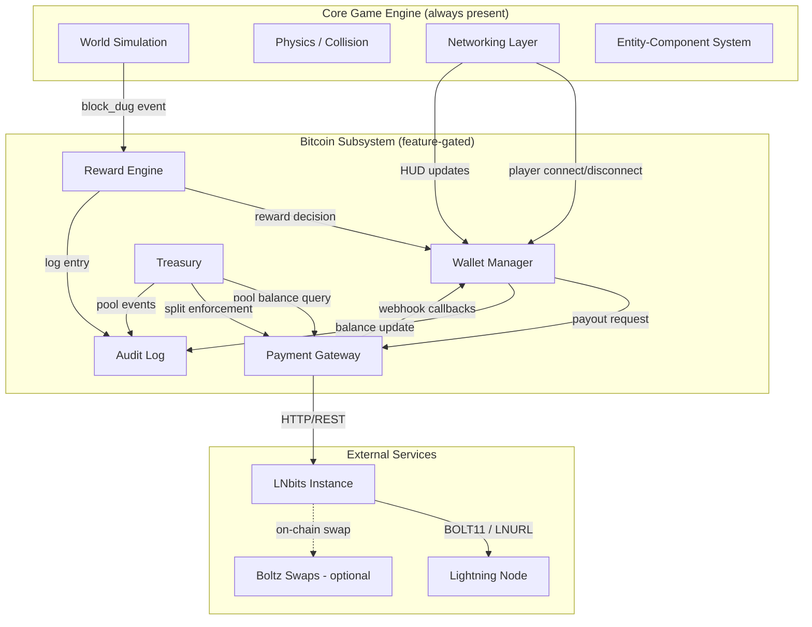
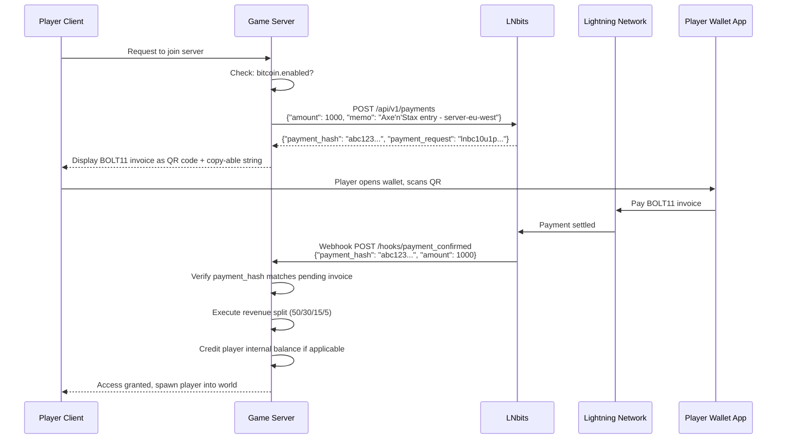
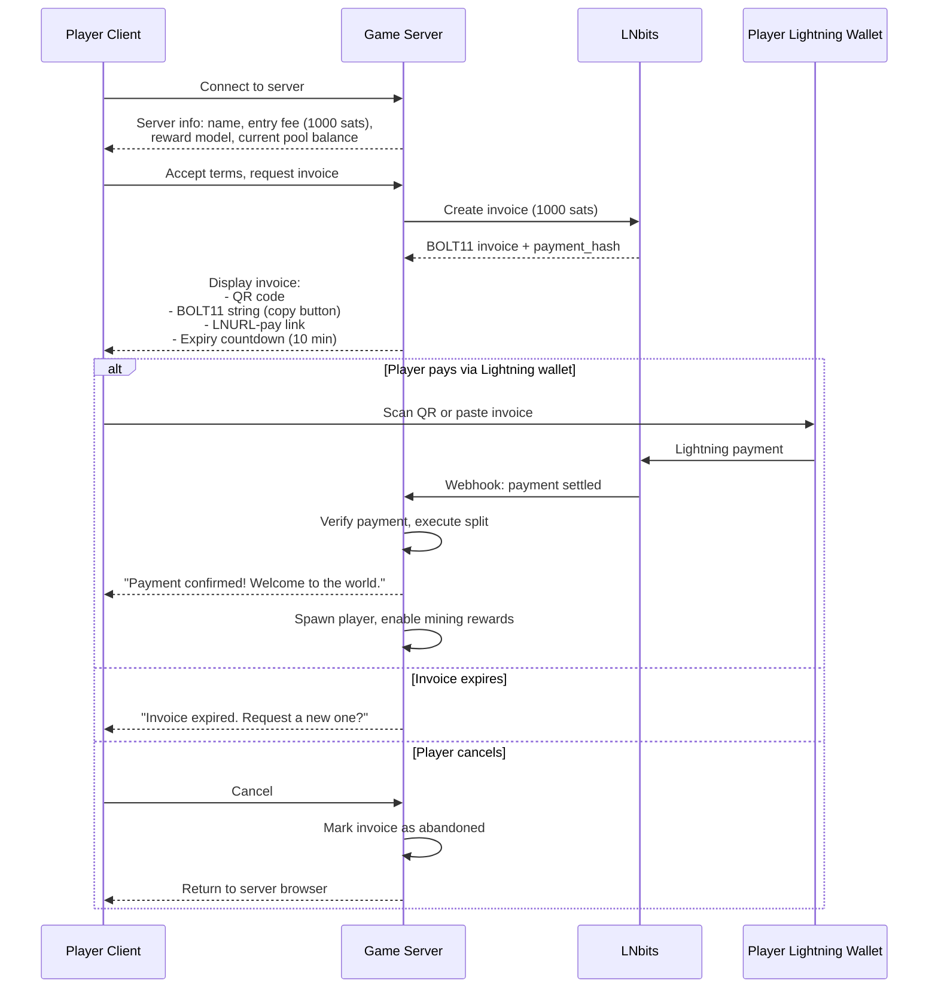
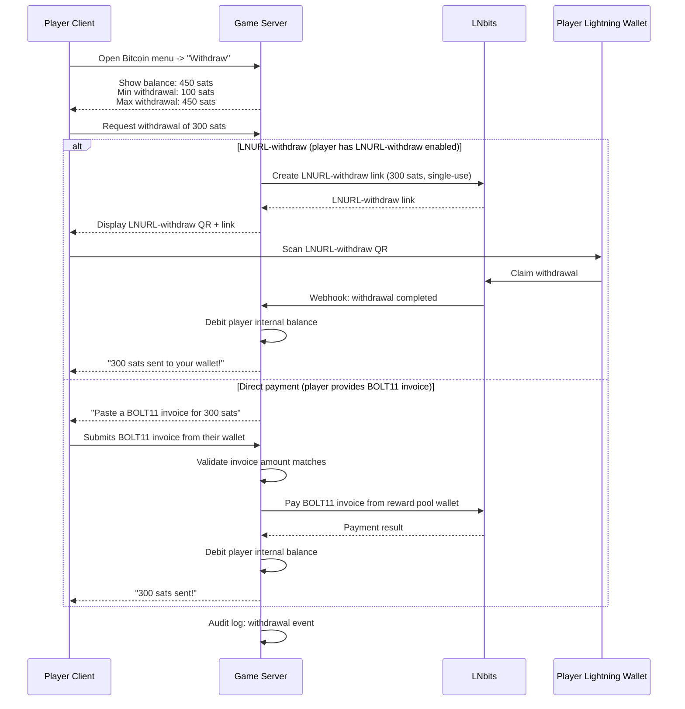
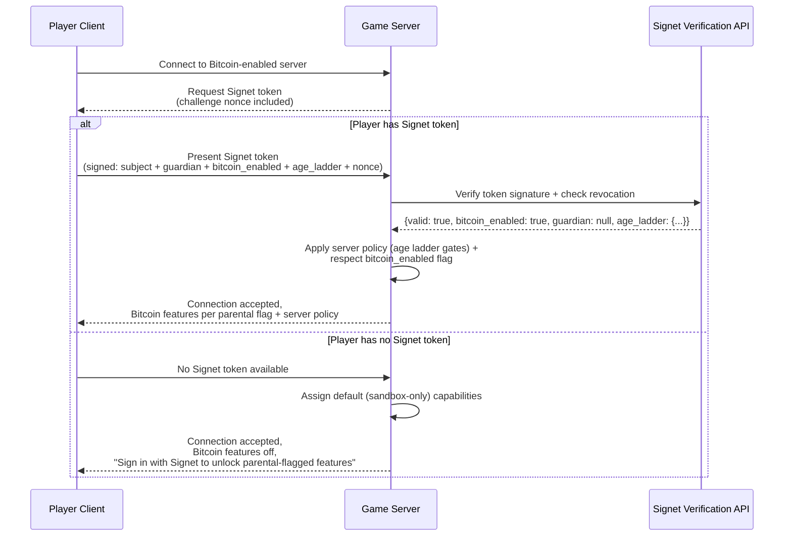

# 06 -- Bitcoin Integration

> **This is a design spec, not a description of live behaviour.** Nothing in
> this document is switched on in any shipped build today — no real sats
> move, no wallet exists yet, and no guardian withdrawal flow exists.
> Bitcoin-enabled servers are a future, opt-in capability layer, off by
> default; see `docs/learn-journey/the-hash-and-your-first-sats.md` and the
> CLAUDE.md "Reward Mechanic" section for what's actually built vs. planned.

**Status**: Draft (custody/settlement model decided 2026-06-10 — see §1.5 + ADR-004)
**Date**: 2026-03-03
**Depends on**: ADR-001 (Full Custom Engine), ADR-002 (Tech Stack), ADR-004 (Lightning Settlement Backend)

---

## 1. Architecture Overview

Bitcoin functionality is an optional capability layer that sits above the core game engine. The engine compiles and runs identically whether Bitcoin features are active or not. A single compile-time feature flag (`bitcoin`) gates inclusion of the Bitcoin subsystem crate; at runtime, a server configuration key (`bitcoin.enabled = true`) activates it. Servers that omit this key (or set it to `false`) operate as pure sandbox instances with zero payment code executing.

### 1.1 Component Map

The Bitcoin subsystem comprises five components, each a distinct Rust module within the server binary:

| Component | Responsibility |
|---|---|
| **Reward Engine** | Proof-of-Play hash calculation (§2), work-meter accumulation, Bitcoin-layer threshold checks, epoch management |
| **Payment Gateway** | LNbits HTTP client, invoice creation, payment verification, webhook receiver |
| **Wallet Manager** | Per-player in-world **score** tracking (not custody); entry-payment intake + exit-payout orchestration (§1.5) |
| **Treasury** | Reward pool accounting, split enforcement, pool sustainability logic |
| **Audit Log** | Append-only ledger of every financial event, commitment hashes, tamper detection |

### 1.2 Architecture Diagram



### 1.3 Feature Gating

**Defaults as built (2026-09-27 audit fix).** Sats are off unless someone opts in. `ServerSatsPolicy::default()` has `bitcoin_enabled = false` (an operator turns it on explicitly via `ServerSatsPolicy::bitcoin_enabled_policy()`; nothing loads it from config yet), and every `PlayerSlot` — new player, guest, split-screen, web — starts with `charter_allows_sats = false`: a missing guardian record is not consent (§10.3). The tip jar never shows a fabricated balance: with no real wallet the balance is unknown and the line is hidden. The web taster (wasm32) renders nothing sats-related at all (`economy::SATS_UI_AVAILABLE = false` there): the tip-jar, auction, bounty-board, market-hub, bazaar and commission dialogs never open, vendors show Barter only, and the Reserve gauge's "sats / 1000 digs" line is shown only on a Bitcoin-enabled native server.

```rust
// Cargo.toml
[features]
default = []
bitcoin = ["dep:reqwest", "dep:serde_json", "dep:sha2", "dep:hmac"]

// In server main loop
#[cfg(feature = "bitcoin")]
mod bitcoin_subsystem;

// At runtime, even with the feature compiled in:
if config.bitcoin.enabled {
    bitcoin_subsystem::init(&config.bitcoin)?;
}
```

The server configuration uses TOML:

```toml
[bitcoin]
enabled = true
lnbits_url = "https://lnbits.example.com"
lnbits_api_key = "env:LNBITS_API_KEY"    # resolved from environment variable
reward_model = "work_meter"                # work_meter only for real sats; "probabilistic" RETIRED (gambling) — see §2.3
epoch_duration_hours = 168                 # 1 week
server_secret = "env:GENESIS_SERVER_SECRET"
```

Secrets are never stored in config files directly. The `env:` prefix signals the server to read from an environment variable at startup.

### 1.4 Closed-World Economy Principle

The single most important architectural rule of the Bitcoin layer:

> **Sats are restricted to a single world during gameplay.** Money entering a world must pass through the split (§5) — there is no path for external sats to land directly in a player's spendable in-world balance. Money leaves the world only at session/world exit, settling to the player's noncustodial external wallet via §6.3 withdrawal. **Cross-world movement is the player's own withdraw-and-redeposit via Lightning** — the platform never moves funds between worlds.

This is the structural backbone of three guarantees:

1. **The platform is not a money transmitter.** Funds are always either (a) in the player's noncustodial external wallet, (b) in the server-operator's LNbits pool (which the platform never touches), or (c) in flight via Lightning HTLCs. The platform provides game logic and infrastructure; it never holds or moves player funds. Server operators run their own LNbits in their own jurisdiction with their own compliance posture — the platform's posture is non-handling.
2. **No pay-to-win.** External sats cannot bypass the pool gate. A player with £1,000 in their external wallet cannot dump it into the in-world economy without first contributing to the shared pool — at which point everyone benefits, not just them. Wealth in AxeNStax is always the product of time × work, never of capital injection. This is what §10.5 #7 ("paying more entry fees does not give mining advantages") means *operationally*.
3. **Auditable inflow.** Every sat that enters player wallets came from mining (§2) or from another player's wallet (which itself traces back to mining). The provenance chain is unbroken. Every sat in the in-world economy has been earned through Proof-of-Play work somewhere upstream.

**The four canonical sat flows in a world:**

| Flow | Direction | Mechanism | Custody |
|------|-----------|-----------|---------|
| **Entry / Fund the Reserve** | External wallet → server pool (via split, §5) | BOLT11 invoice paid from player wallet | Server-operator LNbits holds the pool |
| **Mining payout** | Server pool → player's in-world balance | Work-meter accumulation (§2.4) | Server-operator LNbits (per-player ledger entry) |
| **In-world trade** | Player A's in-world balance → Player B's in-world balance | Internal LNbits transfer | Server-operator LNbits (re-attributes ledger entry) |
| **Withdrawal at exit** | Player's in-world balance → external wallet | LNURL-withdraw or BOLT11 payout (§6.3) | Sats leave the server pool to the player's wallet |

Nothing else writes to a player's in-world balance. There is no direct top-up from external to in-world (any attempt routes through the split — see §6.2). There is no inter-world transfer (each world's pool is sealed; cross-world is via §6.3 withdraw + §6.2 re-fund in the new world).

**Why this needs to live in §1, not buried elsewhere:** every section that follows assumes this rule. The split (§5), the payment flows (§6), the treasury (§7), the security model (§8), and the regulatory posture (§10) all hold together because the closed-world principle holds. Without it, §6.2 leaks external sats into in-world balances and the whole pay-to-win-proof property collapses.

The principle was implicit in the original March 2025 brainstorm ("payments batch at session end; sats stay in pool during gameplay; route out on exit") and is now stated explicitly as a top-level architectural constraint.

### 1.5 Custody & Settlement Posture (Decided 2026-06-10) [LEGAL REVIEW]

> **This is the authoritative custody model.** Where §5 (splits), §7 (treasury / auto-sweep) or earlier drafts describe an operator-held **pool that is redistributed to players**, read them as subordinate to this section: the default is **operator-funded payouts, not pooled redistribution.** See ADR-004 §"✓ Resolution (2026-06-10)" for the full decision and rationale. A mechanical rewrite of §5/§6/§7 to match is a tracked follow-up.

**Non-custody is a hard requirement.** Neither the platform nor the server-operator may hold funds that legally belong to a player pending transmission to anyone else. The constraint is honoured by *being non-custodial*, not by a clever pooling topology.

**Players hold their own external wallets.** There are no app-controlled, per-player custodial sub-wallets. The engine tracks an in-world **score** (sats earned through Proof-of-Play, §2) — a claim, not a stored balance of the player's money. Between worlds, a player's sats live only in their own wallet; the platform persists nothing withdrawable.

**Two independent one-way payments — never a held balance:**

| Payment | Direction | Character | Custody |
|---|---|---|---|
| **Entry** | Player's wallet → operator | **Nonrefundable purchase** of entry/access. The instant it's paid it is the operator's revenue. | None held — it is not a deposit |
| **Payout** | Operator → player's wallet | A **payment for work** (Proof-of-Play), **triggered by exit**. The in-world score crystallises into a real Lightning payment only on exit. | None held — operator pays from its own funds |

**The custody hinge is refundability.** A *refundable* entry, or a *withdraw-on-demand balance that spans sessions*, would make the operator a custodian/transmitter. Both are **red lines**. Nonrefundable entry + payout-only-on-exit + no persistent balance keeps the operator out of custody: it is paying for work, not banking deposits.

**Two reward-funding models:**

- **Operator-funded (Option B) — default, most defensible.** Entry covers access/costs; rewards are the operator **paying for Proof-of-Play work out of its own funds**. No pot of player money is redistributed, so there is nothing to transmit. This is the canonical spine for all but small peer tournaments.
- **Staked prize pot (Option A) — capped, non-custodial only.** Entry stakes form the prize pot, distributed by skill. Permitted **only** as a genuine **DLC peer tournament** — funds locked in a player-co-controlled multisig, with the game server acting as the **oracle** that attests the result (a signed Nostr/Signet event) and **never holding the funds** — *never* as server-held escrow (escrow = custody). Caps set by payout structure: **≤ 4 players** for continuous "keep what you mined" payouts; **≤ 8** for winner-take-all / bracket in one contract (brackets of 2-party matches scale beyond). Above the cap, decompose to per-player-vs-house 2-party contracts — which is Option B. Option A leans hardest on the §10 skill-not-gambling argument (substance over form), so it is the higher-risk variant.

**Fees touch only the two doors.** Everything in-world is fee-free game state (1-sat granularity is fine — it is score, not payments). Real Bitcoin moves only at entry and exit (~0.4% per door on Phoenix/phoenixd, plus occasional receiving-side channel cost). A **minimum payout threshold** is forced by the receiving-side dust/liquidity floor (a few hundred sats for an existing wallet; higher, or operator-subsidised, for a first-ever receive). All fees are disclosed up front; rake destinations are network (Phoenix/ACINQ), server costs, promoter/creator and optional platform. This is also why the model avoids the "Wallet-of-Satoshi dust" antipattern — one meaningful payout per visit, never per-action dustings.

**Posture is defence-in-depth:** nonrefundable + non-custodial + one-world-contained (§1.4) + low amounts + disclosed + skill-not-gambling (§10). Counsel must bless the final structure before stakes grow.

---

## 2. Proof of Play (Hash Per Strike)

> **Naming note.** Earlier drafts called this the "Hash-on-Mine Mechanic." That framing leaked into marketing as "the player is a Bitcoin miner," which misrepresents the design. Renamed to **Proof of Play** — see [`docs/foundations/2026-05-12-proof-of-play-clarification.md`](../foundations/2026-05-12-proof-of-play-clarification.md) for the full rationale. The hash computation itself is unchanged; the change is conceptual layering and naming.

### 2.1 Core Principle

Every pickaxe strike — on any block, including grass and dirt — runs an HMAC-SHA-256 over the block coordinates and server-held secrets. **One hash, three layers stacked on it:**

1. **Proof of Play (always-on, educational).** The hash is surfaced to the player (truncated in the HUD, counted per session, used to trigger a "Genesis Block" celebration when it falls below a difficulty target). The player *sees* proof-of-work as a concept while playing. This layer runs whether Bitcoin is enabled or not.
2. **Material-drop layer (deterministic, hash-reusing).** The same hash bytes drive probabilistic rare drops on plain stone (e.g., a "lucky strike" yields a diamond fragment). Visible ore blocks (coal, iron, diamond) are **guaranteed drops with the correct tool — Minecraft-style** and bypass the hash check; the visible block *is* the contract.
3. **Bitcoin layer (optional, server-operator concern).** A Bitcoin-enabled server may translate proof-of-play effort into sats payouts via the **deterministic work-meter** (§3.1). *(The per-strike "probabilistic" payout model is **retired for real sats** — see §2.3.)* **The player is not a Bitcoin miner.** They're playing on a server whose operator has chosen to pool effort and pay sats. Default posture: Bitcoin layer off.

**Anti-X-ray** is achieved in two complementary ways, expanded in Spec 8 §5:

- For the **Bitcoin reward** and the **plain-stone rare-drop** decisions, the hash is computed from a `server_secret` the client never sees — there is nothing visible in the world data that distinguishes a "valuable" stone block from an ordinary one. Architectural-by-construction.
- For the **visible ore blocks** (Wave 13 coal/iron/diamond), the chunk-stream layer replaces *buried* ore (no air-facing face) with plain stone in the data sent to the client; *exposed* ore (visible in cave walls / ravines / cliffs) is sent as-is. The X-ray cheat can't render what it didn't receive, and what it does receive is already visible to a player walking the cave. See Spec 8 §5.2.2.

**Anti-farming (player-placed blocks earn no reward).** Anti-X-ray stops a player *reading* hidden value; a separate hole let them *manufacture* work — chop a block, restand/replace it, re-break it ("rehash your own work"). On a Bitcoin server that same place→break loop would mint payouts for free. **Invariant, every world:** a block a *player* placed earns no proof-of-play hash/work and no hash-driven drop (material or Bitcoin) when broken. Breaking and item recovery are unchanged — only the reward credit is withheld. "Anything you place" counts (a stone, a workbench, a sown crop — the crop's produce still drops, the work does not). Implemented as a per-voxel "placed" bit persisted with the chunk (Spec 2 §4.3), gating `crafting::block_work` via the shared `break_work(block, harvestable, was_player_placed)` decision; the bit travels with falling blocks so a dropped placed block can't be laundered natural. Full design + build notes: `docs/foundations/2026-06-03-work-based-hashing.md` ("Anti-farming"). BUILT 2026-06-08.

### 2.2 Hash Computation

When a player digs a block at position `(x, y, z)`:

```
input = CONCAT(
    server_secret,          // 32 bytes, never sent to clients
    world_seed,             // 8 bytes, set at world creation
    epoch_id,               // 4 bytes, increments each epoch
    block_x,                // 4 bytes, signed i32 little-endian
    block_y,                // 4 bytes, signed i32 little-endian
    block_z                 // 4 bytes, signed i32 little-endian
)

hash = SHA-256(input)       // 32 bytes output

reward_value = u64_from_be(hash[0..8])   // first 8 bytes as u64
```

The use of SHA-256 ensures uniform distribution across the output space. HMAC-SHA256 is used in practice (with `server_secret` as the key and the remaining fields as the message) to prevent length-extension attacks:

```
hash = HMAC-SHA256(
    key     = server_secret,
    message = CONCAT(world_seed, epoch_id, block_x, block_y, block_z)
)
```

**Where `server_secret` comes from (as built, 2026-09-27).** 32 random bytes from the OS RNG (`proof_of_play::gen_world_secret`), generated once per world when the world is created and stored in the host's `WorldMeta.pop_secret` (`world_meta.json`). It is **never derived from the world seed** and **never serialised to a client**: the seed is public (every joiner receives it in `JoinAccept`), so the earlier alpha stub — `HMAC(fixed public key, seed)` — let any joiner or save-holder rebuild the secret offline and map every Satori vein (a complete x-ray for the top-tier gem; audit 2026-09-27). A world saved before `pop_secret` existed gets a fresh random secret on its first load, saved back at once (`proof_of_play::ensure_world_secret`). That moves the old world's *future* rare-drop and vein placement — accepted: blocks already mined are unaffected, and nothing pays sats. A fork starts without a secret and gets its own. The tip-jar and bounty audit hashes use the same per-world secret. The production `env:GENESIS_SERVER_SECRET` below remains the operator override for dedicated servers (not yet wired: a dedicated server reads the world's own `pop_secret` from its meta, see the next paragraph). **Exports never carry it; imports never keep it (2026-09-28).** Every share path strips `pop_secret`: the native `.axeworld` export (Save-As dialog + world-transfer folder, `world_archive::pack_world_for_export`), `.axereplay` initial snapshots, the web Backup download and web `.axeprofile` export (`strip_secret_from_archive` re-packs the IndexedDB blob), and the operator console's `/api/world/<id>/export`. Only owner persistence keeps it: the native `world_meta.json`, the web IndexedDB blob and the NIP-44-encrypted Stash blob. Every import (native `.axeworld`, `.axeprofile` world, web file import, console publish/install) discards any incoming secret and generates a fresh one (`world_archive::unpack_world_for_import`; console `worlds._meta_with_fresh_secret`), so a world file never hands its host's secret to its recipients.

**Who rolls a strike (as built, C1 2026-10-07).** Whoever holds the world: the single-player client, and a host for its own players, roll in the client's break arm; **a joiner's break is rolled by the server** (`break_drops::break_yield`, run when it accepts the joiner's break — Spec 04 §4.2e) with the world's secret (`GameServer::pop_secret`) and the world's exposure map (`World::pop_exposure`, which travels with a host's lend, so a host's mining and its joiners' share one exposure clock). A dedicated server reads the secret from the world meta and, once the world has opened and before its first tick, settles it against the disk (`server_main::settle_pop_secret`): it adopts the meta's — including one the open's torn-meta repair had to generate, which the earlier read-only peek could not see (C1 review LOW-2) — or, for a world saved without one, writes back the one it generated; a host's server is handed its host client's every tick (`GameState::tick_hosted_server`). As in single-player, the roll needs a natural cell: every block a joiner puts into a cell is flagged player-placed, whatever the edit (Spec 04 §4.2e). A native joiner never rolls: it holds no secret of the world it joined, takes nothing from its own break, and gets a Satori only as the server's `InventoryGrant` (with the routine "+1 Satori" celebration; the Genesis Block is not claimed for a joiner's find yet). A web joiner's edits never reach the server (`break_drops::edits_reach_server`, since e9a49e9c), so it rolls into its own copy of the world, on its own client's random secret (`GameState::pop_server_secret`), and keeps its own drops. Nothing it finds reaches the server's world. The joiner's client keeps no strike-hash readout (none exists in the client). Unchanged by C1: the work-meter. `crafting::break_work` / `World::add_work` still accrue only in the breaker's own client, so a joiner's breaks tally into its local copy of the world, not the host's — open question for when a joiner's work matters (Bitcoin-enabled servers).

### 2.2a Hash byte budget (per-layer usage)

The 32 bytes of `proof_hash` are sliced by layer so each decision uses different bytes — one HMAC, several outcomes:

```
proof_hash = 32 bytes
  bytes [0..8]  → reward_value u64
                  - Drives the Bitcoin-layer Genesis-Block threshold (§2.3).
                  - Drives the Proof-of-Play celebration animation regardless
                    of Bitcoin enablement (same threshold, no payout).
  byte  [8]     → reward tier (dust/nugget/chunk/vein) — Bitcoin layer only.
  byte  [9]     → exact reward magnitude within tier — Bitcoin layer only.
  byte  [10]    → rare-drop probability check on plain stone (material layer).
  byte  [11]    → rare-drop material selector (coal/iron/diamond/...).
  byte  [12]    → exposure-decay roll for Satori vein drops (§2.2c.3).
  bytes [13..]  → reserved for future layers.
```

Cost: one HMAC-SHA-256 per strike (already paid for the Bitcoin layer in the original design). Determinism: same coordinate + same secrets + same epoch ⇒ same hash ⇒ same outcomes. A verifier can replay the hash against the published season secret (§2.7) to audit any single decision.

### 2.2b Material drop layer (hash reuse)

The drop resolved by a pickaxe strike depends on the block type:

| Block type | Drop rule | Hash usage |
|---|---|---|
| **Visible ore block** (`COAL_ORE`, `IRON_ORE`, `DIAMOND_ORE`, future ores) | Guaranteed drop of the ore's material when mined with the correct tool. Wrong tool → block breaks, drops nothing. Minecraft-style. | Bypasses the hash check — the visible block *is* the contract. Proof-of-play hash still runs (Layer 1). |
| **Plain stone / deepslate** | Probabilistic rare drop. `proof_hash[10]` against a configurable rare-drop threshold → "lucky strike"; `proof_hash[11]` selects the material from a configured table (e.g. 70 % coal / 25 % iron / 5 % diamond). | Hash drives the decision. X-ray-proof: nothing visible distinguishes a lucky stone block from a normal one. |
| **Other blocks** (grass, dirt, leaves, wood, sand, …) | Block-type-specific drops per existing engine logic. | Proof-of-play hash still runs; doesn't drive drops here. |

The rare-drop layer is **off by default** for plain stone in alpha (Wave 13 visible ore blocks cover the gameplay loop). It is the natural extension when proof-of-play visualisation lands and we want a "lucky strike" tier that rewards persistence in caves without visible ore.

See [`docs/foundations/2026-05-12-proof-of-play-clarification.md`](../foundations/2026-05-12-proof-of-play-clarification.md) for design context.

### 2.2c Satori vein generation

**Satori** (Spec 5 §3.8) is the in-world physical manifestation of Bitcoin — the orange gem that drops from pure deepslate. Satori drops via a **deterministic vein algorithm** that produces spatially-coherent ore-like deposits in pure deepslate at depth, with exposure-decay to discourage opportunistic cave-walking. The algorithm reuses the Proof-of-Play hash; no new cryptography needed.

#### 2.2c.1 Conditions checked at strike time

A pickaxe strike on block `(x, y, z)` is a candidate gem drop iff **all** of:

1. **Block type is pure deepslate.** `block_id == DEEPSLATE` (not `DEEPSLATE_COAL_ORE`, `DEEPSLATE_IRON_ORE`, `DEEPSLATE_DIAMOND_ORE`, `POLISHED_DEEPSLATE`, etc.).
2. **Depth gate satisfied.** `y <= Y_dp - 21`, where `Y_dp` is the Y level at which pure deepslate begins in world generation (see Spec 2 §5.3.1a). `Y_dp` is server-configurable. Defaults:
   - **Canonical-spec world** (Y=-64..383, per Spec 2 §3.1): `Y_dp = 0` → default gate `y <= -21`.
   - **Alpha-engine world** (Y=0..96, currently shipped): `Y_dp = 30` → default gate `y <= 9`. The world is only 96 blocks tall in alpha, so the canonical defaults don't fit; the alpha values give roughly the same player effort ("commit 21 blocks of mining into deepslate before veins become possible") in a smaller world.

   Either way, the "21 blocks deep into the deepslate layer" framing scales with whatever `Y_dp` the operator configures.
3. **Player's pickaxe tier ≥ Diamond.** Under-tier pickaxes still break the deepslate (block mines normally per §5.1) but no gem drops.
4. **Vein membership.** The dual-hash algorithm in §2.2c.2 below returns "this block is part of a vein."
5. **Exposure-decay check passes.** Per §2.2c.3.

If all five pass, one Satori is added to the player's inventory. **Satori carries no sats value** (changed 2026-09-27; the earlier "1 Satori ≡ 1 sat at drop time" equivalence is retired). The exposure check is a per-strike hash lottery, so a Satori is a *chance drop*, and a chance-based real-sats payout sits inside the UK Gambling Act s.6 perimeter (§2.3). Sats flow only through the deterministic work-meter. The code enforces this at every sats path via `economy::is_chance_drop`, which covers Satori **and every item derived from it**: `economy::CHANCE_DERIVED_KEYS` is a fixpoint over the real recipe registry (`crafting_catalogue::all_cards`, pinned to `match_recipe`) — any recipe that consumes Satori or a Satori-derived item makes its output Satori-derived (the Satori block, Satori tools and armour, the Satori Chest, and any future recipe). The Bazaar never quotes one, an operator price table can't price one, a vendor refuses to list or sell one in any sats mode (Barter still works), and an auction refuses sats bids on one. The lint `economy::no_satori_derived_item_ever_feeds_a_sats_payout` walks the recipe graph independently (feeding each card's grid to `match_recipe`) and asserts every sats entry point refuses every item it finds (2026-09-28).

#### 2.2c.2 The vein algorithm — dual-hash origin + propagation

For a struck block at `(x, y, z)`:

```
function is_vein_member(x, y, z) -> bool:
    # Sweep candidate vein origins within propagation radius
    R = VEIN_MAX_RADIUS  # default 8 blocks

    for each (ox, oy, oz) within R of (x, y, z), oy <= Y_dp - 21:
        # Stage 1 — is this position a vein origin?
        origin_hash = HMAC-SHA256(
            key     = server_secret,
            message = "vein_origin" || world_seed || epoch_id || ox || oy || oz
        )
        origin_threshold = ORIGIN_BASE_THRESHOLD * depth_scalar(oy)
        if u32_from_be(origin_hash[0..4]) >= origin_threshold:
            continue  # not an origin, skip

        # Stage 2 — does the vein propagate from origin to (x, y, z)?
        if propagation_reaches(ox, oy, oz, x, y, z):
            return true

    return false
```

**Vein origin** is determined by a **per-position rarity check** keyed on `server_secret`:

- `ORIGIN_BASE_THRESHOLD` ≈ `1 / 100,000` of `u32_MAX` (default; server-configurable). Per-block per-epoch probability of being an origin at depth `Y_dp - 21`.
- `depth_scalar(y)` = `1.0 + 3.0 * normalized_depth(y)` — origins are **4× more common at bedrock** than at the depth gate. Encourages digging deeper.

**Propagation** is a deterministic walk from origin toward the struck block, with a per-step hash check:

```
function propagation_reaches(ox, oy, oz, tx, ty, tz) -> bool:
    pos = (ox, oy, oz)
    step = 0
    while pos != (tx, ty, tz):
        step_target = next_lattice_step_toward(pos, (tx, ty, tz))
        prop_hash = HMAC-SHA256(
            key     = server_secret,
            message = "vein_step" || world_seed || epoch_id
                   || ox || oy || oz   # origin (vein identity)
                   || step              # step number along the path
                   || step_target       # candidate position
        )
        prop_threshold = PROPAGATION_BASE * (PROPAGATION_DECAY ^ step)
        if u32_from_be(prop_hash[0..4]) >= prop_threshold:
            return false  # vein stops at this step
        pos = step_target
        step += 1
    return true
```

- `PROPAGATION_BASE` = 0.85 (default; high chance to continue near the origin).
- `PROPAGATION_DECAY` = 0.85 (default; each step the threshold drops by 15%). At step 8, propagation threshold is `0.85^9 ≈ 0.232`, naturally bounding vein extent.

**Properties this produces:**

- **Deterministic** — same coordinate + same secrets + same epoch ⇒ same vein presence/absence. Auditable via the commitment-reveal scheme (§2.7).
- **Spatially coherent** — adjacent blocks reached by the same origin both yield gems. "Find one, dig around" works.
- **Bounded extent** — propagation decay caps vein size; no runaway veins.
- **Find-one-find-more is natural** — when you hit a gem you've hit one block in a vein; the other vein-member blocks are within `VEIN_MAX_RADIUS` and connected by the propagation walk. Digging adjacent deepslate uncovers them.
- **Deeper-means-richer** — `depth_scalar(y)` makes origins more common at depth.
- **X-ray-proof by construction** — the player has no way to compute `server_secret`-keyed hashes; the only way to find a vein is to dig and strike.

#### 2.2c.3 Exposure decay (oxidisation)

A pure-deepslate block becomes "exposed" the moment at least one of its 6 face-neighbours becomes a non-solid block. This happens when the player mines an adjacent block, or when a natural cave/ravine intersects the position (caves are pre-generated and exposure is set at chunk-load time).

The server tracks exposure age per exposed pure-deepslate block:

```
exposed_at: HashMap<BlockPos, Tick>
```

Sparse — only stores entries for currently-exposed pure-deepslate at depth. Entries created when a block first gains an air-facing neighbour; cleared when the block itself is broken or all neighbours become solid again.

At strike time, compute decay multiplier:

```
function decay_multiplier(pos) -> f32:
    if pos not in exposed_at:
        return 1.0   # never exposed — full gem chance
    age_ticks = current_tick - exposed_at[pos]
    if age_ticks >= DECAY_DURATION:
        return 0.0   # fully decayed — no gem possible
    return 1.0 - (age_ticks / DECAY_DURATION)   # linear decay
```

The vein-membership check is gated on the decay multiplier: even a true vein-member block returns "no gem" if the decay multiplier rolls below a strike-time random check (which itself is derived from the Proof-of-Play hash — `hash[12]` against `decay_multiplier * 256`).

**Default decay parameters:**

| Parameter | Default | Notes |
|---|---|---|
| `DECAY_DURATION` | 20,000 ticks | 1 in-game day at 1× world-time speed; ~5 real minutes at current alpha 4× pace; ~20 real minutes at post-alpha 1× default |
| `DECAY_CURVE` | Linear | 0% decay at exposure, 100% at full duration. Server can override (exponential, step, etc.) |
| Server-config override | Yes — both duration and curve | Via the bitcoin-economy config; see Spec 6 §13 (Server Economy Config) |

Practical effect: mine into deepslate quickly to keep the gem; cave-spelunk past gems and the value oxidises away. Encourages real mining commitment over opportunistic cave-walking, per the gameplay-design intent.

#### 2.2c.4 Performance + storage notes

**Strike-time cost:**

- Worst-case origin sweep: ~17 × 17 × 17 ≈ 5000 candidate positions. At ~1 µs per HMAC-SHA-256 call, ~5 ms per strike. Borderline.
- **Optimisation — chunk-load-time pre-compute**: at the moment a chunk is loaded server-side, compute the vein-membership bitmask for all pure-deepslate blocks in the chunk at depth. Store as a sparse server-side structure (`HashMap<BlockPos, ()>` or chunk-aligned bitmask). Strike-time check becomes O(1) bitmask lookup. Bitmask never crosses the network — X-ray defence preserved.
- Memory: at the default `ORIGIN_BASE_THRESHOLD ≈ 1 / 100,000`, about 1 in 100k pure-deepslate blocks at depth is a gem block (origins) plus vein-extent neighbours. For a heavily-explored chunk, a few hundred gem blocks at most. Trivial.

**Exposed-blocks storage:** sparse `HashMap<BlockPos, Tick>`. Only currently-exposed pure-deepslate blocks at depth. Bounded by how much deepslate the player has actually mined into; not the size of the world.

#### 2.2c.5 Server-config knobs (summary)

Operators can override (defaults in parens):

```toml
[bitcoin.gem_veins]
y_dp = 0                              # Y at which pure deepslate begins
depth_gate_offset = -21               # gate is y <= y_dp + depth_gate_offset
vein_max_radius = 8                   # blocks
origin_base_threshold = 0.00001       # 1 in 100,000 per block
origin_depth_scalar_max = 4.0         # 4× at bedrock vs at gate
propagation_base = 0.85
propagation_decay = 0.85

[bitcoin.gem_decay]
decay_duration_ticks = 20000          # 1 in-game day at 1× speed
decay_curve = "linear"                # "linear" | "exponential" | "step"

[bitcoin.gem_drops]
pickaxe_tier_required = "diamond"     # minimum tool tier; "diamond" or "satori"
```

Default values are tuned for the alpha-launch single-server case. Per-server tuning is a creator concern; the values above are recommendations, not enforced minima.

#### 2.2c.5a Player-facing celebrations — Genesis Block + routine pickup

Two distinct celebration tiers fire when a gem drops, keyed on whether this is the **world's** first gem ever (the Genesis Block) or any subsequent gem:

| Celebration | Trigger | What the player sees + hears |
|---|---|---|
| **Genesis Block** | The **first** Satori ever found in this world, by **any** player. One-shot per world (not per player). Flag stored on `WorldMeta.genesis_block_found` and persisted in the world's meta file. | Dramatic fanfare audio (ascending major-triad arpeggio: C5→E5→G5→C6 over ~0.5s, procedurally synthesised). Long-duration HUD toast — "**Genesis Block! The first Satori of this world!**" — held ~8 seconds. Particle burst at the break point (deferred to a polish wave). |
| **Routine pickup** | Every subsequent Satori drop after the Genesis Block has been claimed. | Bright single-note chime (~880 Hz / A5, ~0.12s). Short HUD toast — "**+1 Satori**" — held ~3 seconds. |

**Why two tiers + singular Genesis Block per world:**

- **Genesis Block = singular, per world, ever.** Borrowed from Bitcoin's genesis block (block 0 of the chain, mined once by Satoshi in 2009). There is only one Genesis Block per Bitcoin chain; there is only one Genesis Block per AxeNStax world. The term preserves its weight. In single-player worlds: the player who finds the first gem gets the fanfare. In multiplayer (when it lands): the *first* player ever to find a gem in that world wins the milestone; subsequent players who join later never see it for that world — they'd need their own world to have a chance at one.
- **Routine pickup.** Every subsequent gem still deserves feedback — players need confirmation that the mining loop is rewarding them — but the celebration is intentionally smaller so it doesn't become noise during sustained mining sessions. Different audio + shorter toast keeps the moment-to-moment feel snappy.
- **Per-world, not per-player.** The flag lives on `WorldMeta`, not on `PlayerSlot`. Once a world has had its Genesis Block claimed, no player in that world can ever trigger the fanfare again. A player who creates a new world gets a fresh Genesis Block opportunity. A player who joins an existing world late doesn't.
- **Marketing + leaderboard hook.** "Be the first to mine the Genesis Block in [WorldName]!" is a marketable framing that aligns with `docs/vision/marketing-and-branding.md` §"Genesis Events" — seasonal events tied to reward epochs where new world cycles create new Genesis Blocks to find.
- **Legacy save migration.** Worlds saved before Wave 25 don't carry the flag. The serde `default = false` means existing worlds get one Genesis Block celebration on whoever happens to mine the next gem in them. A clean one-shot cosmetic migration; no functional issue.

**Persistence + race protection:**

- The flag lives on `WorldMeta`, persisted via `save_world_meta` whenever a Genesis Block is claimed. Subsequent gem strikes see the persisted flag via `load_world_meta`, so saves and restarts honour the claim.
- The `maybe_claim_genesis_block` helper on `GameState` does a read-test-write: re-reads `WorldMeta` after the initial check to defensively close any same-tick race on multi-player paths. On the rare case of write failure (disk full / IO error), the celebration fires once anyway — denying a player their milestone moment due to a logged save error is worse than re-firing on the next session.

**Why this isn't tied to the proof-of-work hash-below-threshold check.** Earlier draft sketched a separate "Genesis Block celebration when `reward_value < threshold`" trigger that fired across *every* block type. That conflated two signals — the proof-of-play educational layer (Layer 1, hash visualisation on every strike) with the material-reward layer (Layer 2, gem drops). Cleaner: keep them separate. The hash visualisation HUD (deferred) is the Layer 1 educational surface; the gem-drop celebrations are the Layer 2 reward surface. Both layers run; both have player-facing artefacts; they don't share the celebration trigger.

**Implementation status (Wave 25d, 2026-05-13):**

- `WorldMeta.genesis_block_found: bool` field added (defaults false; persists in `world_meta.json` with `#[serde(default)]`).
- World forking (`save::fork_world`) starts the fork with `genesis_block_found: false` — the fork is a new world, the source's claim doesn't transfer.
- `audio.rs` ships `play_gem_pickup()` (routine chime) + `play_genesis_block()` (fanfare arpeggio). Procedural synthesis matches the rest of the audio engine.
- `game_loop.rs` strike-time wiring uses `GameState::maybe_claim_genesis_block` to atomically claim the world's Genesis Block; the helper returns true exactly once per world. On claim, the flag is written through to `WorldMeta`.
- HUD toasts use the existing `self.toast` slot; particle effects deferred to a polish wave with Axolittle's UX input.

#### 2.2c.6 Legal posture — proof-of-work, not probabilistic gambling

> **`[LEGAL REVIEW]`** This subsection captures the spec's *internal* characterisation of the mechanism, which an actual lawyer needs to sign off per jurisdiction before any Bitcoin-enabled server goes live in any market. The proof-of-work framing is structurally accurate and gives the strongest cross-jurisdiction posture; the strength of the argument depends on local case law.

The gem-vein mechanic *feels* probabilistic to the player (they can't predict whether a given block contains a gem until they strike it), but **mechanically it is deterministic proof-of-work, not gambling**. The distinction is load-bearing for regulatory classification.

**The four properties that put this on the proof-of-work side of the line:**

1. **Determinism at world-gen, not at play.** Every block's gem-or-not status is fixed by `HMAC(server_secret, world_seed || epoch_id || x || y || z)` *before the player ever strikes it*. The answer was decided when the world was created (or the season started); the player discovers it through effort, doesn't generate it through play. A gambling RNG, by contrast, produces a fresh random outcome *at the moment of the play* — that's the structural difference.
2. **Publicly verifiable post-season.** The commitment-reveal scheme (§2.7) lets anyone confirm that a given coord was-or-wasn't a gem block after `season_secret` is revealed. A gambling RNG can never be verified this way — auditability is precisely what gambling regulators *can't* compel from a slot machine's randomness source. The fact that AxeNStax can offer this audit trail is itself evidence of the proof-of-work nature of the mechanic.
3. **Real work required per discovery.** Tool durability is consumed, real-world time is spent, vertical mining to depth is required, and the player travels through the world to reach pure-deepslate at `y <= Y_dp - 21`. Every potential gem costs measurable effort. There is no "place bet → spin → win" flow; there is only "do work → discover predetermined outcome."
4. **No fresh draw per play.** Striking the same coord twice (impossible in practice, but observable via the spec) would produce the same hash. The outcome was set at world-gen and is invariant across attempts. Slot machines, lotteries, and roulette all produce new random outcomes each play; our mechanic does not.

**The legal parallels this matches:**

- **Bitcoin mining itself.** Each hash attempt is a deterministic function of (header, nonce); miners iterate nonces hoping to find one below the network's difficulty target. Each attempt is "work." Bitcoin mining is legal in most jurisdictions as proof-of-work, *despite* the property that an individual miner "might or might not" find a block per unit of work. The structural parallel to our mechanic is exact.
- **Treasure hunting.** A treasure hunter expends effort searching coordinates, with no advance knowledge of where treasure is buried but with deterministic placement of the treasure itself. Treasure-hunting laws don't classify this as gambling — they classify it as a search activity.
- **Minecraft / voxel-game ore prospecting.** Diamond ore placement in any voxel game is deterministic per world seed. Players can't predict per-strike outcomes, but the outcomes are predetermined and fixed. No regulator has ever classified ore prospecting in voxel games as gambling — the discoverable-but-deterministic-outcome property is the reason.
- **Geocaching.** Cache locations are predetermined and registered; geocachers expend effort to find them. Not gambling, even though success per attempt is uncertain in the moment.

**The contrast cases — what the mechanic is structurally NOT:**

- **Slot machines** — random number generated at the moment of the pull, no post-hoc verification possible.
- **Lottery** — random draw at the announced moment, prizes randomly assigned.
- **Roulette** — physical randomness at each spin, no determinism over time.
- **Loot boxes** — random roll per box-open, fresh draw each time. (Note: this is a key contrast because superficially loot boxes also "feel like ore prospecting," but the mechanism is fresh-draw-per-event, not predetermined-outcome-discovered.)

**Practical implications for server-operator policy and §10:**

- **Pay-to-play servers** running gem-vein drops do not, on this framing, satisfy the "chance" element of the UK Gambling Act 2005 three-element test (or its equivalents in EU, US-state, and AU/NZ gambling laws). The mechanism is proof-of-work-shaped.
- **Adult-only restrictions still recommended where local case law is ambiguous** (notably Belgium / Netherlands, which apply broader "tradeable in-game value" tests that may catch the gem-as-Bitcoin equivalence regardless of the proof-of-work mechanic).
- **For minors, the gate remains parent-controlled** per §10.3 / §11.4 — not because the mechanic is gambling but because parents reasonably want to decide whether their child earns real money for game effort.
- **The work-meter model (§2.4 / §3.1)** is the cleanest case (zero per-strike unpredictability from the player's POV) but is *not categorically different* from the gem-vein mechanic at the legal level — both share the determinism + verifiability + work-required properties. Defence-in-depth argument: even if a court rejects the proof-of-work framing for gem-veins, the work-meter remains a defensible fallback shape.

This subsection's framing **strengthens the regulatory posture across every jurisdiction** by establishing that the mechanic is structurally proof-of-work, not gambling. The mitigations in §10 (parent-controlled, server-policy gates, jurisdiction overrides) remain in place as belt-and-braces, but the starting position changes from "this is probabilistic-payout gambling-adjacent" to "this is deterministic proof-of-work."

---

### 2.3 Threshold Check (Probabilistic Model) — ⚠️ RETIRED FOR REAL-SATS PAYOUTS (2026-06-22)

> **SUPERSEDED for real-Bitcoin payouts.** Per the 2026-06-21 compliance research (`docs/research/2026-06-21-uk-online-safety-gambling-crypto-landscape.md` §4 + the US/EU companion), a **probabilistic real-money reward is inside the UK Gambling Act "gaming" perimeter** — s.6 catches a game of chance *or one presented as chance* for a money's-worth prize, and **s.6(4) needs no stake, so "free-to-play" is NOT a defence** — and it is **likely an offence with under-18 users**. The hash being deterministic-under-the-hood does **not** cure this: a per-strike "did I win sats?" threshold is *presented as chance* (s.6(2)(c)). **The only sanctioned real-sats payout is the deterministic work-meter (§3.1)** — zero per-strike unpredictability. The threshold/celebration computation below may still drive the **educational, no-sats** Genesis-Block moment and **in-game (non-cashable) item** loot; it must **not** gate a real-Bitcoin payout for under-18 / UK / US / EU users. Retained below for the historical design + the determinism/verifiability argument (which still governs the work-meter and the spatially-deterministic gem-vein, §2.2c.6).

> **Bitcoin layer only.** This section describes the optional Bitcoin reward layer. Servers running pure Proof of Play (Bitcoin disabled) compute the same hash and trigger the same celebration animation when `reward_value < threshold`, but no sats are involved.

For the probabilistic reward model, the hash output is compared against a configurable difficulty threshold:

```
reward_value = u64_from_be(hash[0..8])
max_value    = u64::MAX                      // 18,446,744,073,709,551,615

// Threshold expressed as a probability
// e.g., 1 in 500 blocks yields a reward
probability  = 1.0 / 500.0
threshold    = (probability * max_value as f64) as u64

if reward_value < threshold {
    // Block is a "Genesis Block" — the server pays out from the reward pool
    reward_sats = calculate_reward_tier(hash)
}
```

**Reward tier mapping** (using subsequent hash bytes):

```
tier_value = hash[8] as u8     // byte index 8, range 0..255

Tier distribution (configurable):
  0..204   (80%)  -> "dust"    :   1-10 sats
  204..242 (15%)  -> "nugget"  :  10-50 sats
  242..253  (4%)  -> "chunk"   :  50-200 sats
  253..255  (1%)  -> "vein"    : 200-1000 sats

Exact sats within tier:
  sats = tier_min + (hash[9] as u64 * (tier_max - tier_min)) / 255
```

### 2.4 Threshold Check (Work-Meter Model)

> **Bitcoin layer only.** This section, like §2.3, describes the optional Bitcoin reward layer. The Proof-of-Play celebration animation runs on the same hash threshold regardless of whether the Bitcoin layer is enabled.

For the work-meter model (primary, recommended), the hash is used only for the "Genesis Block found" celebration animation. Every eligible dig accumulates work credits regardless of hash value:

```
work_credits_per_dig = 1      // configurable per block type
player.work_credits += work_credits_per_dig

if player.work_credits >= payout_threshold {
    player.work_credits -= payout_threshold
    payout_sats = configured_payout_amount    // e.g., 10 sats
    trigger_payout(player, payout_sats)
}
```

The hash still determines the "Genesis Block" visual celebration (threshold check as above), but the actual payout is decoupled from the hash -- it is purely a function of cumulative work.

### 2.5 Expected Rewards Per Hour

Assumptions for calculation:

| Parameter | Value | Notes |
|---|---|---|
| Digs per minute (active player) | 15 | Reasonable for stone mining with iron+ tools |
| Digs per hour | 900 | |
| Payout threshold (work-meter) | 100 digs | Configurable |
| Payout amount | 10 sats | Configurable |
| **Expected sats/hour (work-meter)** | **90 sats** | 900 / 100 * 10 |

For the probabilistic model:

| Parameter | Value |
|---|---|
| P(reward per dig) | 1/500 |
| Expected reward digs/hour | 900 / 500 = 1.8 |
| Average reward per hit | ~25 sats (weighted average of tiers) |
| **Expected sats/hour (probabilistic)** | **~45 sats** |

These rates are configurable per server. The platform provides recommended ranges:

```toml
[bitcoin.rewards]
# Work-meter model
work_credits_per_dig = 1
payout_threshold = 100
payout_amount_sats = 10

# Probabilistic model (if enabled)
probability = 0.002              # 1 in 500
tier_dust_range = [1, 10]
tier_nugget_range = [10, 50]
tier_chunk_range = [50, 200]
tier_vein_range = [200, 1000]
```

### 2.6 Epochs and Seasons

Time is divided into **epochs** (default: 1 week). Each epoch has:

- A unique `epoch_id` (monotonically increasing u32)
- A `server_secret` that may rotate per epoch (optional; default is to keep the same secret across epochs within a season)

**Seasons** are collections of epochs (default: 13 epochs = 1 quarter). A season boundary triggers:

1. Secret rotation (new `server_secret` generated)
2. Reward rate review (can be adjusted between seasons)
3. Audit report publication

### 2.7 Commitment Scheme for Fairness

Before each season begins, the server publishes a **commitment hash**:

```
commitment = SHA-256(season_secret || season_id || "axenstax-commitment")
```

This commitment is:
- Published in the Treasury Transparency Panel (in-game UI)
- Written to the audit log with a timestamp
- Optionally published to a public URL or social media

After the season ends, the server reveals `season_secret`. Anyone can then:

1. Recompute `commitment` and verify it matches the published value
2. For any block position `(x, y, z)` dug during that season, recompute the hash and verify the reward decision was correct
3. Verify that the threshold/difficulty was applied consistently

```
// Verification pseudocode (can be run by any third party)
fn verify_reward(season_secret: &[u8], world_seed: u64, epoch_id: u32,
                 pos: (i32, i32, i32), claimed_reward: bool) -> bool {
    let hash = hmac_sha256(
        season_secret,
        &concat(world_seed, epoch_id, pos.0, pos.1, pos.2)
    );
    let reward_value = u64_from_be(&hash[0..8]);
    let threshold = (probability * u64::MAX as f64) as u64;
    let should_reward = reward_value < threshold;
    should_reward == claimed_reward
}
```

---

## 3. Reward Economics

> **Frame.** Reward economics in this section describe how a **Bitcoin-enabled server** (operator opt-in) translates Proof-of-Play effort into sats payouts. The player is not a commercial miner — the server operator is the agent making the "pay sats for proof-of-play effort" decision and bearing the pool-sustainability obligations described below. Servers running pure Proof of Play (Bitcoin disabled, default) skip this section entirely; effort still produces the visible hash + celebration, no sats involved.

### 3.1 Work-Meter Model (Primary)

The work-meter is the recommended and default payout model. It is deterministic and does not depend on luck.

**Flow:**

```
Player digs block
    -> Server validates dig (anti-cheat checks pass)
    -> work_credits += credits_for_block_type
    -> if work_credits >= threshold:
           work_credits -= threshold
           queue payout of N sats from reward pool
           play "Genesis Block" celebration animation
```

**Why this is primary:**
- Deterministic: players know exactly how much work yields a payout
- Reduces gambling perception: effort in, sats out, no luck
- Simpler to explain, market, and defend to regulators
- Aligns with the Proof-of-Play framing — effort is observable, hashes are surfaced, the payout (when present) is a server-operator response to that effort rather than a player-as-miner outcome

### 3.2 Probabilistic Model (Secondary, Optional) — ⚠️ RETIRED FOR REAL-SATS (2026-06-22)

> **Do not use for real-Bitcoin payouts.** A per-dig independent chance of winning sats is a chance-based real-money reward → inside the UK Gambling Act gaming perimeter (s.6; free-to-play is not a defence), and likely an offence with under-18 users. Use the deterministic **work-meter (§3.1)** only. See §2.3 and the 2026-06-21 compliance research. Retained below for historical context.

Server operators can opt into the probabilistic model where each dig has an independent chance of yielding a reward. This is pool-backed: payouts come from the reward pool, not created from nothing.

**Constraints on the probabilistic model:**
- Must be explicitly opted into by the server operator
- Expected payout rate must be configured to be sustainable against pool balance
- Cannot be used on servers listed in the "official discovery" directory unless the operator acknowledges additional terms
- Must display probability and expected value prominently in the Treasury Transparency Panel

### 3.3 Pool Sustainability Math

The reward pool must never go into debt. The system enforces:

```
pool_balance >= 0   (invariant, always)
```

**Inflow:**
- Player entry fees (reward_pool_split % of each payment)
- Top-up payments
- Operator voluntary deposits

**Outflow:**
- Player reward payouts
- LNbits transaction fees (negligible on Lightning, but tracked)

**Sustainability formula:**

```
Let:
  P   = number of active players
  R   = expected sats/hour per player (from reward config)
  H   = average play hours per session
  F   = entry fee per player (sats)
  s_r = reward pool split percentage (e.g., 0.50)

Hourly outflow = P * R
Inflow per player join = F * s_r

Break-even play time per player:
  T_break = (F * s_r) / R

Example:
  F = 1000 sats, s_r = 0.50, R = 90 sats/hour
  T_break = 500 / 90 = 5.6 hours

  A player who pays 1000 sats entry can mine for ~5.6 hours
  before exhausting "their share" of the reward pool.
```

**Dynamic rate adjustment:**

When the pool balance drops below a low-water mark, the server automatically adjusts:

```
pool_ratio = pool_balance / pool_target_balance

if pool_ratio < 0.25 {
    // Critical: pause rewards entirely
    reward_multiplier = 0.0
    notify_players("Reward pool depleted -- rewards paused")
} else if pool_ratio < 0.50 {
    // Low: reduce reward rate
    reward_multiplier = pool_ratio * 2.0  // linear scale from 0 at 25% to 1.0 at 50%
    notify_players("Reward rate reduced -- pool replenishing")
} else {
    reward_multiplier = 1.0
}

effective_payout = base_payout * reward_multiplier
```

The pool never goes into debt. If it cannot pay, it pauses. This is a fundamental invariant.

### 3.4 Anti-Bot Rate Limiting

Reward eligibility is rate-limited per player to prevent automation:

| Limit | Default | Configurable |
|---|---|---|
| Max eligible digs per minute | 20 | Yes |
| Max eligible digs per hour | 1000 | Yes |
| Max payouts per hour | 10 | Yes |
| Max sats per hour per player | 150 | Yes |
| Cooldown after payout | 5 seconds | Yes |
| Minimum session age before rewards | 60 seconds | Yes |

Digs that exceed rate limits still function as normal gameplay (the block breaks, the player gets the item), but they do not accumulate work credits or trigger reward hash checks. The player is not explicitly told which specific digs were ineligible to prevent reverse-engineering the exact limits.

**Pattern detection (server-side):**

```rust
struct MiningPattern {
    dig_timestamps: VecDeque<Instant>,  // rolling window
    position_history: VecDeque<BlockPos>,

    // Suspicion signals
    perfect_timing_score: f32,    // variance of inter-dig intervals
    linear_path_score: f32,       // R-squared of position regression
    session_duration: Duration,
}

impl MiningPattern {
    fn suspicion_level(&self) -> f32 {
        // Bots tend to have:
        // - Very consistent dig intervals (low variance)
        // - Linear or grid-pattern mining paths
        // - No pauses, no inventory management, no chat

        let timing_suspicion = 1.0 - self.perfect_timing_score.min(1.0);
        let path_suspicion = self.linear_path_score;

        (timing_suspicion * 0.4 + path_suspicion * 0.6).clamp(0.0, 1.0)
    }
}
```

Players with `suspicion_level > 0.8` for sustained periods have their reward eligibility silently revoked. A human moderator is alerted for review.

---

## 4. LNbits Integration

### 4.1 API Integration Pattern

The Axe'n'Stax server communicates with LNbits via its REST API over HTTPS. The integration uses an async HTTP client (`reqwest` with `tokio` runtime).

```rust
pub struct LnbitsClient {
    http: reqwest::Client,
    base_url: Url,
    admin_key: String,          // for write operations (create invoices, pay)
    invoice_key: String,        // for read operations (check payment status)
    retry_policy: RetryPolicy,
    circuit_breaker: CircuitBreaker,
}
```

### 4.2 Per-Server Wallets

Each Axe'n'Stax server instance is associated with a dedicated LNbits wallet. The wallet hierarchy:

```
LNbits Instance
  |
  +-- Platform Master Wallet (platform operator)
  |
  +-- Server: "Official EU-West"
  |     +-- Reward Pool Wallet
  |     +-- Creator Wallet
  |     +-- Platform Fee Wallet
  |     +-- Reserve Wallet
  |
  +-- Server: "CreatorX's Server"
  |     +-- Reward Pool Wallet
  |     +-- Creator Wallet (CreatorX's Lightning Address)
  |     +-- Platform Fee Wallet
  |     +-- Reserve Wallet
  ...
```

Wallet creation is automated during server provisioning:

```rust
async fn provision_server_wallets(
    lnbits: &LnbitsClient,
    server_id: &str,
) -> Result<ServerWallets> {
    let reward_pool = lnbits.create_wallet(
        &format!("{server_id}-reward-pool")
    ).await?;
    let creator = lnbits.create_wallet(
        &format!("{server_id}-creator")
    ).await?;
    let platform = lnbits.create_wallet(
        &format!("{server_id}-platform")
    ).await?;
    let reserve = lnbits.create_wallet(
        &format!("{server_id}-reserve")
    ).await?;

    Ok(ServerWallets { reward_pool, creator, platform, reserve })
}
```

### 4.3 Invoice Creation Flow

When a player needs to pay (entry fee or top-up):



### 4.4 LNbits API Calls

**Create invoice (receive payment):**

```rust
async fn create_invoice(&self, amount_sats: u64, memo: &str) -> Result<Invoice> {
    let resp = self.http.post(format!("{}/api/v1/payments", self.base_url))
        .header("X-Api-Key", &self.invoice_key)
        .json(&json!({
            "out": false,
            "amount": amount_sats,
            "memo": memo,
            "expiry": 600,   // 10 minute expiry
            "webhook": format!("{}/hooks/payment_confirmed", self.callback_url),
        }))
        .send()
        .await?;

    let body: LnbitsInvoiceResponse = resp.json().await?;
    Ok(Invoice {
        payment_hash: body.payment_hash,
        payment_request: body.payment_request,
        amount_sats,
        created_at: Utc::now(),
        expires_at: Utc::now() + Duration::seconds(600),
    })
}
```

**Pay invoice (send payment / withdrawal):**

```rust
async fn pay_invoice(&self, bolt11: &str) -> Result<PaymentResult> {
    let resp = self.http.post(format!("{}/api/v1/payments", self.base_url))
        .header("X-Api-Key", &self.admin_key)
        .json(&json!({
            "out": true,
            "bolt11": bolt11,
        }))
        .send()
        .await?;

    let body: LnbitsPaymentResponse = resp.json().await?;
    Ok(PaymentResult {
        payment_hash: body.payment_hash,
        status: PaymentStatus::Pending,
    })
}
```

**Check payment status:**

```rust
async fn check_payment(&self, payment_hash: &str) -> Result<PaymentStatus> {
    let resp = self.http.get(
        format!("{}/api/v1/payments/{}", self.base_url, payment_hash)
    )
        .header("X-Api-Key", &self.invoice_key)
        .send()
        .await?;

    let body: LnbitsPaymentDetail = resp.json().await?;
    if body.paid {
        Ok(PaymentStatus::Settled)
    } else {
        Ok(PaymentStatus::Pending)
    }
}
```

### 4.5 Webhook Handling

The game server runs a lightweight HTTP server (separate from the game protocol) to receive LNbits webhooks:

```rust
async fn handle_payment_webhook(
    req: PaymentWebhook,
    state: &ServerState,
) -> Result<HttpResponse> {
    // 1. Verify the payment hash exists in our pending invoices
    let pending = state.pending_invoices.get(&req.payment_hash)
        .ok_or(Error::UnknownPaymentHash)?;

    // 2. Double-check with LNbits (don't trust webhook alone)
    let status = state.lnbits.check_payment(&req.payment_hash).await?;
    if status != PaymentStatus::Settled {
        return Ok(HttpResponse::Ok()); // not yet settled, ignore
    }

    // 3. Process the payment
    state.treasury.process_incoming_payment(pending).await?;
    state.pending_invoices.remove(&req.payment_hash);

    // 4. Audit log
    state.audit.log(AuditEvent::PaymentReceived {
        payment_hash: req.payment_hash.clone(),
        amount_sats: pending.amount_sats,
        player_id: pending.player_id,
        timestamp: Utc::now(),
    }).await?;

    Ok(HttpResponse::Ok())
}
```

### 4.6 Error Handling and Retry Logic

```rust
pub struct RetryPolicy {
    max_retries: u32,           // default: 3
    initial_backoff_ms: u64,    // default: 500
    max_backoff_ms: u64,        // default: 30_000
    backoff_multiplier: f64,    // default: 2.0
}

pub struct CircuitBreaker {
    failure_threshold: u32,     // default: 5 consecutive failures
    recovery_timeout: Duration, // default: 60 seconds
    state: CircuitState,        // Closed | Open | HalfOpen
}
```

**When LNbits is unreachable:**

1. **Invoice creation fails**: Player is shown "Payment service temporarily unavailable -- please try again in a few minutes." The player can still join non-Bitcoin servers.
2. **Webhook missed**: The server polls pending invoices every 30 seconds as a fallback. If a payment is detected via polling, it is processed normally.
3. **Payout fails**: The payout is queued in persistent storage. A background task retries queued payouts every 60 seconds. Players are shown "Payout queued -- will be sent when payment service recovers."
4. **Extended outage (>5 minutes)**: The server transitions to "rewards paused" mode. Mining continues as normal gameplay but no new rewards accumulate. Players are notified via HUD message.

```rust
enum LnbitsHealthState {
    Healthy,
    Degraded { since: Instant, queued_payouts: u32 },
    Unavailable { since: Instant },
}

impl LnbitsHealthState {
    fn should_pause_rewards(&self) -> bool {
        matches!(self, Self::Unavailable { since }
            if since.elapsed() > Duration::from_secs(300))
    }
}
```

---

## 5. Revenue Split System

> **Subordinate to §1.5 (Custody & Settlement Posture, 2026-06-10).** The "reward pool" below is, by default, the **operator's own funds it pays out for work** — not a custodial pot of player stakes redistributed back to players. The split percentages still describe where entry revenue and the disclosed rake go (reward funding / creator / platform / reserve). Pool-and-redistribute *as a literal flow of pooled player money* survives only inside capped, non-custodial DLC tournaments (§1.5, Option A). A mechanical rewrite of this section to match §1.5 is a tracked follow-up (ADR-004).
>
> **The "Platform" row below is a design percentage of an operator's own revenue, not AxeNStax custodying player funds** — "platform never touches funds" (CLAUDE.md) still holds: AxeNStax's software never sits in the payment path between a player and their sats. Read this table as "what a self-hosted server operator's config could route to a platform-development fee if one is ever offered," not as a live billing arrangement — none is running today.

### 5.1 Split Configuration

Every incoming payment is divided according to configurable percentages. Splits are enforced server-side and logged in the audit trail.

```toml
[bitcoin.splits]
# Percentages must sum to 100
reward_pool = 50
creator = 30
platform = 15
reserve = 5
```

### 5.2 Default Templates

**Standard (official servers):**

| Destination | Percentage | Purpose |
|---|---|---|
| Reward Pool | 50% | Funds player mining rewards |
| Creator | 30% | Server operator revenue |
| Platform | 15% | Axe'n'Stax platform development and operations |
| Reserve | 5% | Abuse response, refunds, operational buffer |

**Creator Enterprise (incentivises large creators):**

| Destination | Percentage | Purpose |
|---|---|---|
| Reward Pool | 40% | Slightly lower pool funding |
| Creator | 45% | Higher creator revenue share |
| Platform | 10% | Reduced platform fee |
| Reserve | 5% | Same operational buffer |

**Community (low-fee, high-reward):**

| Destination | Percentage | Purpose |
|---|---|---|
| Reward Pool | 65% | Maximum rewards for players |
| Creator | 15% | Minimal operator fee |
| Platform | 15% | Standard platform fee |
| Reserve | 5% | Same operational buffer |

### 5.3 Split Enforcement

Splits are executed atomically when a payment is confirmed:

```rust
async fn execute_split(
    &self,
    payment: &ConfirmedPayment,
    config: &SplitConfig,
) -> Result<SplitResult> {
    let total = payment.amount_sats;

    // Calculate each share (integer math, remainder goes to reserve)
    let reward_pool_sats = (total * config.reward_pool_pct) / 100;
    let creator_sats = (total * config.creator_pct) / 100;
    let platform_sats = (total * config.platform_pct) / 100;
    let reserve_sats = total - reward_pool_sats - creator_sats - platform_sats;

    // Transfer to each wallet via LNbits internal transfers
    // These are internal ledger operations, not Lightning payments
    let results = tokio::try_join!(
        self.lnbits.internal_transfer(&self.wallets.reward_pool, reward_pool_sats),
        self.lnbits.internal_transfer(&self.wallets.creator, creator_sats),
        self.lnbits.internal_transfer(&self.wallets.platform, platform_sats),
        self.lnbits.internal_transfer(&self.wallets.reserve, reserve_sats),
    )?;

    let split_result = SplitResult {
        payment_hash: payment.payment_hash.clone(),
        total_sats: total,
        reward_pool_sats,
        creator_sats,
        platform_sats,
        reserve_sats,
        timestamp: Utc::now(),
    };

    // Audit log
    self.audit.log(AuditEvent::SplitExecuted(split_result.clone())).await?;

    Ok(split_result)
}
```

### 5.4 Split Validation Rules

- Percentages must sum to exactly 100
- `reward_pool` must be >= 20% (platform minimum to protect players)
- `platform` must be >= 5% (non-negotiable platform fee)
- `reserve` must be >= 2%
- `creator` has no minimum (can be 0% for community-run servers)
- Changes to split configuration require server restart (not hot-reloadable, to prevent mid-session manipulation)
- **Every recipient Lightning wallet must be identity-tied.** Each non-pool recipient (creator, platform, reserve) declares a Lightning Address (LN URL) bound to a Nostr pubkey via a `kind 11888` "split-recipient" event signed by that pubkey. The pubkey-to-address binding must be verifiable before the split executes. Anonymous / unidentified split recipients are rejected at config-load time. Lifted from the March 2025 design brainstorm anti-scam requirement — every advertised "30% to creator" must trace to a verifiable identity so players can see who actually receives the money. The pool wallet itself doesn't need this binding (it's the server's own wallet, not a third-party recipient).

### 5.5 Auditability

Every split execution is recorded in the audit log with:
- The originating `payment_hash`
- Exact sat amounts to each destination
- Timestamp
- The split configuration that was active

The Treasury Transparency Panel (section 7) displays cumulative split totals, allowing any player to verify that the advertised splits match reality.

---

## 6. Player Payment Flows

### 6.1 Pay-to-Join



### 6.2 In-World Funding ("Fund the Reserve")

> **Reframe (2026-05-17).** Earlier draft of this section was titled "In-Game Top-Ups" and allowed players to add sats directly to their internal balance without going through the §5 split. That deviated from the §1.4 closed-world principle: it gave a player with a deep wallet a path to dump external sats into the in-world economy and dominate the markets, while contributing nothing to the shared pool. Hardening this restores the original brainstorm intent — *all sat inflow is socialised through the pool; the player earns their share via mining like everyone else*.

Players who are already in-game can add more sats to the **server's pool**. The UX flow:

1. Player opens the Bitcoin menu (keybind: `B` by default).
2. Selects "Fund the Reserve" (formerly "Add Funds").
3. Enters amount or selects a preset (100, 500, 1000, 5000 sats).
4. Server displays the split breakdown — *"50% to the mining pool (everyone benefits), 30% to the server operator, 15% to the platform, 5% to reserve"* — and the message: *"You're sponsoring this world. Your contribution tops up the shared pool for every player. It is a gift to the world and is never returned to you."* (Revised 2026-10-06: the original wording — "you earn yours by mining, the same as everyone else" — framed play as earning; `copy_lint` now bans that on every in-game surface.)
5. Player confirms and pays the generated BOLT11 invoice from their Lightning wallet.
6. On confirmation, the payment is split per §5. The pool share lifts the per-strike mining payout rate for all players. The player receives no direct in-world balance credit.

**Why this is the right design:**

- **Pay-to-win-proof.** A rich player's £100 raises the *server-wide* mining rate. Their kid mines at the same rate as every other kid. The £100 is socialised perfectly.
- **Patronage-friendly.** Parents understand "sponsoring the league" — same model as a youth football club. They're contributing to a community resource, not buying their kid an advantage.
- **Visible value.** Funders accumulate a "Sponsor of [Server Name]" Nostr-signed credential. Big sponsors can be named on monuments, leaderboards, server splash screens. The reward is reputational, not financial.
- **Auditable.** Every funding event flows through the standard §5 split machinery and is logged in §8.6 audit trail. No hidden inflow paths.

**Server-operator policy hooks** (per §9.3 creator config):

- **Disable Fund the Reserve entirely.** Some servers may want pool funding only from entry fees, not mid-session top-ups. Config flag `fund_reserve_enabled = false`.
- **Minimum / maximum funding amount per transaction.** Defaults: 100 sats min (per §1.4 minimum-entry rule), 100,000 sats max (anti-money-laundering posture per §10.6 jurisdiction overrides).
- **Per-player funding caps.** Limit how much one player can fund per epoch (anti-Sybil mitigation for sat-laundering attacks where one wallet routes through many in-world balances).
- **Required confirmation dialog text.** Operator can replace the default "you don't get this back" message with localised / age-appropriate wording.

**Note on "I want to give my child some sats" parent intent.** A parent who wants their child to *receive* sats — not contribute to the pool — should send Lightning directly wallet-to-wallet (external Lightning, off-platform). The child's external Lightning wallet receives the sats. From there, the child can either hold them externally or Fund the Reserve to lift the world's mining rate. There is no platform-mediated path for a parent to credit a child's *in-world* balance — this is intentional. Wallet-to-wallet Lightning is the right tool for direct gifts; the in-world economy is the wrong place to inject capital.

### 6.3 Withdrawal Flow



### 6.4 Internal Balance Management

Each player has an internal balance tracked server-side:

```rust
pub struct PlayerBalance {
    player_id: PlayerId,
    balance_sats: u64,               // current spendable balance
    total_earned_sats: u64,          // lifetime earnings from mining
    total_deposited_sats: u64,       // lifetime deposits (entry + top-ups)
    total_withdrawn_sats: u64,       // lifetime withdrawals
    pending_withdrawal_sats: u64,    // in-flight withdrawal amount
    last_payout_at: Option<DateTime<Utc>>,
    last_withdrawal_at: Option<DateTime<Utc>>,
}
```

**Invariants:**
- `balance_sats >= 0` (always)
- `balance_sats = total_earned_sats + total_deposited_sats - total_withdrawn_sats - pending_withdrawal_sats` (ignoring entry fee splits)
- Withdrawals are deducted from `balance_sats` immediately (moved to `pending_withdrawal_sats`). If the Lightning payment fails, the amount is returned to `balance_sats`.

### 6.5 HUD Display

The player's HUD shows a Bitcoin balance element:

```
+---------------------------+
|  [lightning bolt icon]    |
|  Balance: 1,234 sats      |
|  Work: 67/100 [=====>   ] |
+---------------------------+
```

- **Balance**: current internal balance in sats
- **Work meter**: progress toward next payout (work-meter model only)
- The element is positioned in the top-right corner by default, repositionable in settings
- Clicking/tapping the element opens the Bitcoin menu
- The element is only visible on Bitcoin-enabled servers

---

## 7. Treasury and Pool Management

### 7.1 Reward Pool Wallet

The reward pool is a dedicated LNbits wallet. Its balance represents the total sats available for player mining rewards.

```rust
pub struct RewardPool {
    wallet_id: String,
    balance_sats: u64,                   // mirrors LNbits wallet balance
    target_balance_sats: u64,            // configurable target
    low_water_mark_pct: f32,             // default: 0.25
    warning_water_mark_pct: f32,         // default: 0.50
    total_paid_out_sats: u64,            // lifetime payouts
    total_received_sats: u64,            // lifetime inflows
    reward_multiplier: f32,              // 0.0 to 1.0, dynamic
    last_balance_sync: DateTime<Utc>,
}
```

### 7.2 Pool Balance Tracking

The server syncs the pool balance with LNbits every 30 seconds:

```rust
async fn sync_pool_balance(&mut self) -> Result<()> {
    let lnbits_balance = self.lnbits
        .get_wallet_balance(&self.reward_pool.wallet_id)
        .await?;

    self.reward_pool.balance_sats = lnbits_balance;
    self.reward_pool.last_balance_sync = Utc::now();
    self.reward_pool.reward_multiplier = self.calculate_reward_multiplier();

    Ok(())
}

fn calculate_reward_multiplier(&self) -> f32 {
    let ratio = self.reward_pool.balance_sats as f32
        / self.reward_pool.target_balance_sats as f32;

    if ratio < self.reward_pool.low_water_mark_pct {
        0.0    // pool critically low, pause rewards
    } else if ratio < self.reward_pool.warning_water_mark_pct {
        // linear interpolation from 0 to 1
        (ratio - self.reward_pool.low_water_mark_pct)
            / (self.reward_pool.warning_water_mark_pct - self.reward_pool.low_water_mark_pct)
    } else {
        1.0    // full reward rate
    }
}
```

### 7.3 Pool Depletion Behaviour

When the pool is empty or critically low:

1. **Rewards pause** -- mining continues as gameplay but no sats are earned
2. Players are notified: "Mining rewards are currently paused while the reward pool replenishes."
3. The work meter freezes (work-meter model) or the probability drops to zero (probabilistic model)
4. New player entry fees still flow in, gradually replenishing the pool
5. When the pool rises above the low-water mark, rewards automatically resume
6. **No debt is ever created** -- the system never promises sats it cannot pay

### 7.4 Pool Replenishment

The pool is replenished from:
- The `reward_pool` percentage of every new player entry fee
- The `reward_pool` percentage of every in-game purchase (if applicable)
- Voluntary operator deposits
- The reserve wallet (operator can manually transfer from reserve to pool)

### 7.5 Treasury Transparency Panel

An in-game UI panel accessible from the Bitcoin menu:

```
+============================================+
|         TREASURY TRANSPARENCY              |
+============================================+
|                                            |
|  Reward Pool Balance:  45,230 sats         |
|  Pool Status:          [ACTIVE - FULL]     |
|  Reward Multiplier:    1.0x                |
|                                            |
|  --- This Session ---                      |
|  Players Online:       23                  |
|  Rewards Paid Out:     3,120 sats          |
|  Payments Received:    5,000 sats          |
|                                            |
|  --- This Season (Epoch 4/13) ---          |
|  Total Rewards Paid:   89,340 sats         |
|  Total Payments In:    142,500 sats        |
|                                            |
|  --- Fairness ---                          |
|  Season Commitment:    a3f8c2...e91b       |
|  Reward Model:         Work Meter          |
|  Payout Rate:          10 sats / 100 digs  |
|  Split:  Pool 50% | Creator 30%           |
|          Platform 15% | Reserve 5%         |
|                                            |
|  [View Full Audit Log]                     |
|  [Verify Previous Season]                  |
+============================================+
```

This panel is read-only and always reflects real data from the audit log. The server cannot misrepresent these values because the audit log is append-only and commitment hashes are published before seasons begin.

### 7.6 Charity Beneficiary on Server Closure

> Lifted from the March 2025 design brainstorm (`docs/research/2026-03-05-payment-architecture-chat.md` lines 41–43). Cleanly solves the "what happens to the orphan balance" question without putting the platform in a custody position.

When a server closes — whether the operator shuts it down, the world is retired, or all players abandon it for a configurable grace period — the remaining sats in the reward pool and in any player balances belonging to permanently-departed players must go somewhere. The closed-world principle (§1.4) forbids cross-server transfer; the platform cannot custody the leftover funds. The standard answer:

**Every Bitcoin-enabled server declares a mandatory charity beneficiary at config time.** The beneficiary is identified by a publicly-verifiable Lightning Address tied to a Nostr pubkey (same identity-tied-wallet rule as §5.4). On server closure or grace-period-abandonment of an in-world balance, residual sats route to the charity via Lightning. The charity address is shown in the server-info screen alongside the splits, so prospective players see who eventually receives orphan funds.

```toml
[bitcoin.closure]
charity_lightning_address = "donations@registered-charity.org.uk"
charity_pubkey = "npub1..."                              # Nostr identity of the charity
charity_name = "[Registered name from public charity register]"
abandonment_grace_days = 30                              # in-world balance routes to charity after N days of player not connecting
```

**What this does and doesn't do:**

- **Does** eliminate the "where do leftover sats go" custody problem. The platform never receives them; they go directly from pool wallet to charity wallet via Lightning.
- **Does** discourage gaming the system by accumulating "ghost balances" — they go to charity after the grace period, not to the operator or platform.
- **Does** create a positive externality (Bitcoin donations to registered charities) from the natural attrition of any voxel-game economy.
- **Does not** apply to players who explicitly withdraw before leaving. Their balance settles to their own wallet (§6.3) as normal.
- **Does not** cover server-operator misconduct (operator drains pool before closure). That's a §8 security / audit-log issue, not a closure-mechanics issue.

**Operator can change the charity** by editing config + server restart. The audit log records every charity change so players can verify. Servers that change the charity frequently (suspicious pattern) get flagged in the rep marketplace (§9.5 fairness reports).

**Platform-level recommended charity list** maintained at `axenstax.com/charities` — a curated list of verified Lightning-enabled charities operators may pick from. Operators may also use their own verified charity Lightning Address; the only platform requirement is identity-attestation per §5.4.

### 7.7 Auto-Sweep Thresholds

> Lifted from the March 2025 design brainstorm (`docs/research/2026-03-05-payment-architecture-chat.md` line 26). Limits per-wallet exposure during play and reduces channel-liquidity pressure on the server-operator's LNbits.
>
> **Reconciled with §1.5 (2026-06-10):** auto-sweep is a *protective periodic payout of already-earned sats* to the player's own wallet — it pushes earnings *out*, it does **not** make the in-world score a withdraw-on-demand deposit. It therefore stays the right side of the custody line (paying for work, not banking a balance). Treat the "in-world balance" here as the earned **score** of §1.5, settled in more than one payout when a prolific player crosses the threshold mid-session.

A player's in-world balance can grow indefinitely if they mine prolifically without exiting. Two problems:

1. **Channel liquidity pressure.** Large per-player balances consume the server-operator's LNbits channel liquidity. If many players accumulate at once, the operator runs out of inbound capacity to pay them out.
2. **Per-wallet exposure / risk.** A player with 50,000 unwithdrawn sats has 50× the exposure to a server-operator failure (LNbits crash, channel force-close cost, etc.) compared to a player with 1,000.

The fix: **auto-sweep** balance to the player's external wallet when it exceeds a threshold.

```toml
[bitcoin.player_wallet]
auto_sweep_threshold_sats = 10000        # at 10K sats, sweep to external wallet
auto_sweep_keep_floor_sats = 1000        # leave this much in-world for spending
auto_sweep_min_external_balance = 0      # gate: skip sweep if player has no external wallet capacity declared
```

**Behaviour:**

1. After every payout (mining, trade, etc.), check player's in-world balance against the threshold.
2. If `balance > auto_sweep_threshold_sats`:
   - Compute sweep amount: `balance - auto_sweep_keep_floor_sats`.
   - Generate an LNURL-withdraw link bound to the player's previously-registered external Lightning Address (set up at first session, persisted on the player's Signet identity).
   - Server pays the sweep amount; player's external wallet receives.
   - In-world balance reduces to `auto_sweep_keep_floor_sats`.
3. If the player has no registered external wallet, sweep is skipped and a notification fires ("You've earned more than your sweep threshold; register a Lightning Address to enable auto-sweep").
4. Sweep events are audit-logged (§8.6).

**Server-operator policy:**

- Operators set the threshold and floor.
- Defaults of 10K threshold / 1K floor work for most play patterns: a typical session ends well under 10K, so most players never trigger auto-sweep; high-volume miners get periodic withdrawals.
- For Bitcoin-disabled servers (no sats payouts), this section doesn't apply.

**Why this lives at the protocol level and not at the wallet level:** auto-sweep needs the server's authoritative balance to be the source of truth. Putting it on the player's external wallet would require the wallet to know about the in-world balance, which violates the closed-world principle (§1.4). The server initiates the sweep based on its in-world ledger; the player's external wallet just receives the LNURL-withdraw payment like any other.

---

## 8. Security Model

### 8.1 Server Secret Protection

The `server_secret` (used in hash-on-mine) is the most sensitive value in the system. If leaked, players could pre-compute which block positions yield rewards.

**Protection measures:**
- Stored only in environment variables, never in config files or source control
- Loaded into memory at server startup, never written to disk
- Not accessible via any API endpoint
- Not logged, not included in crash dumps
- Rotated every season (with commitment scheme bridging the rotation)
- In Kubernetes: stored as a Kubernetes Secret, mounted as an env var

```rust
// The secret is loaded once and lives in a non-cloneable wrapper
pub struct ServerSecret {
    inner: Box<[u8; 32]>,  // heap-allocated, not in stack traces
}

impl Drop for ServerSecret {
    fn drop(&mut self) {
        // Zeroize memory on drop
        self.inner.iter_mut().for_each(|b| *b = 0);
    }
}

impl std::fmt::Debug for ServerSecret {
    fn fmt(&self, f: &mut std::fmt::Formatter) -> std::fmt::Result {
        write!(f, "ServerSecret(***)")
    }
}
```

### 8.2 Payout Caps

Hard limits prevent runaway payouts regardless of software bugs or exploits:

| Cap | Default | Scope |
|---|---|---|
| Per-player per-hour sats | 150 | Individual protection |
| Per-player per-day sats | 1,000 | Individual protection |
| Per-server per-hour total payouts | 10,000 | Server protection |
| Per-server per-day total payouts | 50,000 | Server protection |
| Single payout maximum | 1,000 | Per-transaction protection |
| Max withdrawal per player per day | 5,000 | Withdrawal protection |

These caps are enforced at the Reward Engine level (before LNbits is contacted) and are logged when triggered:

```rust
fn check_payout_caps(
    player: &PlayerBalance,
    server: &ServerStats,
    payout_sats: u64,
) -> Result<(), PayoutCapError> {
    if player.sats_earned_this_hour + payout_sats > caps.player_per_hour {
        return Err(PayoutCapError::PlayerHourlyExceeded);
    }
    if player.sats_earned_today + payout_sats > caps.player_per_day {
        return Err(PayoutCapError::PlayerDailyExceeded);
    }
    if server.sats_paid_this_hour + payout_sats > caps.server_per_hour {
        return Err(PayoutCapError::ServerHourlyExceeded);
    }
    if server.sats_paid_today + payout_sats > caps.server_per_day {
        return Err(PayoutCapError::ServerDailyExceeded);
    }
    if payout_sats > caps.single_payout_max {
        return Err(PayoutCapError::SinglePayoutExceeded);
    }
    Ok(())
}
```

### 8.3 Fraud Detection

Beyond rate limiting, the system monitors for anomalous patterns:

**Anomaly signals:**
- Player earning significantly above the expected sats/hour for sustained periods
- Multiple accounts mining from the same IP address
- Mining activity during off-hours with zero chat or social interaction
- Impossibly fast travel between mining locations
- Dig patterns that follow exact grid or spiral paths (bot signatures)
- Players who never open inventory, craft, or perform any non-mining action

**Response escalation:**
1. **Level 1 -- Suspicious**: Silently reduce reward eligibility by 50%. Log for review.
2. **Level 2 -- Likely bot**: Silently reduce reward eligibility to 0%. Alert moderator.
3. **Level 3 -- Confirmed abuse**: Freeze internal balance, require manual review before any withdrawals.

### 8.4 Double-Spend Prevention

- Internal balances are tracked server-side with optimistic locking
- Withdrawal requests acquire an exclusive lock on the player balance
- The balance is debited before the Lightning payment is initiated (pessimistic debit)
- If the Lightning payment fails, the balance is credited back
- Only one withdrawal can be in-flight per player at a time
- The `pending_withdrawal_sats` field tracks in-flight amounts

```rust
async fn process_withdrawal(
    &self,
    player_id: PlayerId,
    amount_sats: u64,
) -> Result<WithdrawalResult> {
    // Acquire exclusive lock on player balance
    let mut balance = self.balances.lock_player(player_id).await?;

    // Check sufficient funds (excluding pending withdrawals)
    let available = balance.balance_sats - balance.pending_withdrawal_sats;
    if amount_sats > available {
        return Err(Error::InsufficientFunds);
    }

    // Pessimistic debit
    balance.pending_withdrawal_sats += amount_sats;
    balance.save().await?;

    // Attempt Lightning payment
    match self.lnbits.pay_invoice(bolt11).await {
        Ok(result) if result.status == PaymentStatus::Settled => {
            balance.balance_sats -= amount_sats;
            balance.pending_withdrawal_sats -= amount_sats;
            balance.total_withdrawn_sats += amount_sats;
            balance.save().await?;

            self.audit.log(AuditEvent::WithdrawalCompleted { ... }).await?;
            Ok(WithdrawalResult::Success)
        }
        Ok(_) | Err(_) => {
            // Payment failed or is stuck -- reverse the hold
            balance.pending_withdrawal_sats -= amount_sats;
            balance.save().await?;

            self.audit.log(AuditEvent::WithdrawalFailed { ... }).await?;
            Ok(WithdrawalResult::Failed)
        }
    }
}
```

### 8.5 Server Crash Recovery

If the server crashes mid-payout:

1. On restart, the server scans for players with `pending_withdrawal_sats > 0`
2. For each, it queries LNbits for the payment status
3. If the payment was settled: finalize the debit
4. If the payment was not settled: reverse the hold
5. All recovery actions are logged to the audit trail

```rust
async fn recover_pending_withdrawals(&self) -> Result<()> {
    let pending = self.balances.find_with_pending_withdrawals().await?;

    for mut balance in pending {
        let payment_hash = self.audit
            .find_pending_withdrawal(balance.player_id)
            .await?;

        match self.lnbits.check_payment(&payment_hash).await {
            Ok(PaymentStatus::Settled) => {
                balance.balance_sats -= balance.pending_withdrawal_sats;
                balance.total_withdrawn_sats += balance.pending_withdrawal_sats;
                balance.pending_withdrawal_sats = 0;
                self.audit.log(AuditEvent::CrashRecoverySettled { ... }).await?;
            }
            _ => {
                balance.pending_withdrawal_sats = 0;
                self.audit.log(AuditEvent::CrashRecoveryReversed { ... }).await?;
            }
        }
        balance.save().await?;
    }
    Ok(())
}
```

### 8.6 Audit Trail

Every financial event is recorded in an append-only audit log:

```rust
pub enum AuditEvent {
    PaymentReceived {
        payment_hash: String,
        amount_sats: u64,
        player_id: PlayerId,
        timestamp: DateTime<Utc>,
    },
    SplitExecuted(SplitResult),
    RewardEarned {
        player_id: PlayerId,
        amount_sats: u64,
        block_pos: BlockPos,
        epoch_id: u32,
        reward_model: RewardModel,
        timestamp: DateTime<Utc>,
    },
    WithdrawalRequested {
        player_id: PlayerId,
        amount_sats: u64,
        method: WithdrawalMethod,  // LnurlWithdraw | Bolt11
        timestamp: DateTime<Utc>,
    },
    WithdrawalCompleted { ... },
    WithdrawalFailed { ... },
    PoolBalanceSync {
        balance_sats: u64,
        reward_multiplier: f32,
        timestamp: DateTime<Utc>,
    },
    SeasonCommitmentPublished {
        season_id: u32,
        commitment_hash: String,
        timestamp: DateTime<Utc>,
    },
    SeasonSecretRevealed {
        season_id: u32,
        secret: String,      // revealed after season ends
        timestamp: DateTime<Utc>,
    },
    PayoutCapTriggered {
        player_id: PlayerId,
        cap_type: PayoutCapType,
        attempted_sats: u64,
        timestamp: DateTime<Utc>,
    },
    FraudAlert {
        player_id: PlayerId,
        level: FraudLevel,
        signals: Vec<String>,
        timestamp: DateTime<Utc>,
    },
    CrashRecoverySettled { ... },
    CrashRecoveryReversed { ... },
}
```

The audit log is stored in a local append-only file (SQLite WAL mode database) and optionally replicated to an external logging service. Each entry includes a running SHA-256 chain hash of all previous entries (similar to a blockchain) to detect tampering:

```rust
pub struct AuditEntry {
    sequence: u64,
    event: AuditEvent,
    prev_hash: [u8; 32],     // SHA-256 of previous entry
    entry_hash: [u8; 32],    // SHA-256(sequence || event || prev_hash)
}
```

---

## 9. Creator Server Kit

### 9.1 What a Creator Gets

Creators who want to run their own Axe'n'Stax server with Bitcoin integration receive:

1. **Docker image**: Pre-built image containing the Axe'n'Stax server binary with the `bitcoin` feature enabled
2. **Configuration template**: TOML files with documented options and sensible defaults
3. **Web admin panel**: Browser-based dashboard for monitoring and configuration
4. **Documentation**: Setup guide, economic tuning guide, and compliance checklist

### 9.2 Docker Deployment

```yaml
# docker-compose.yml (Creator Server Kit)
version: "3.8"

services:
  genesis-server:
    image: axenstax/server:latest
    ports:
      - "30000:30000/udp"    # game protocol
      - "8080:8080"          # admin panel + webhook receiver
    environment:
      - GENESIS_SERVER_SECRET=${GENESIS_SERVER_SECRET}
      - LNBITS_API_KEY=${LNBITS_API_KEY}
      - LNBITS_URL=http://lnbits:5000
    volumes:
      - ./config:/etc/axenstax
      - ./worlds:/var/lib/axenstax/worlds
      - ./audit:/var/lib/axenstax/audit
    depends_on:
      - lnbits

  lnbits:
    image: lnbits/lnbits:latest
    ports:
      - "5000:5000"
    environment:
      - LNBITS_BACKEND_WALLET_CLASS=LndRestWallet
      - LND_REST_ENDPOINT=${LND_REST_ENDPOINT}
      - LND_REST_MACAROON=${LND_REST_MACAROON}
    volumes:
      - ./lnbits-data:/app/data
```

### 9.3 Creator Configuration

```toml
# /etc/axenstax/server.toml

[server]
name = "CreatorX's Genesis World"
max_players = 50
motd = "Mine blocks. Learn Bitcoin. Have fun."

[bitcoin]
enabled = true
lnbits_url = "http://lnbits:5000"
lnbits_api_key = "env:LNBITS_API_KEY"
reward_model = "work_meter"
server_secret = "env:GENESIS_SERVER_SECRET"
entry_fee_sats = 500
min_withdrawal_sats = 100

[bitcoin.splits]
reward_pool = 50
creator = 30
platform = 15
reserve = 5

[bitcoin.rewards]
work_credits_per_dig = 1
payout_threshold = 100
payout_amount_sats = 10

[bitcoin.anti_bot]
max_eligible_digs_per_minute = 20
max_eligible_digs_per_hour = 1000
max_payouts_per_hour = 10
max_sats_per_hour_per_player = 150
cooldown_after_payout_seconds = 5
min_session_age_seconds = 60

[bitcoin.caps]
player_per_hour_sats = 150
player_per_day_sats = 1000
server_per_hour_sats = 10000
server_per_day_sats = 50000
single_payout_max_sats = 1000
max_withdrawal_per_day_sats = 5000
```

### 9.4 Web Admin Panel

The admin panel runs on port 8080 (configurable) and provides:

**Dashboard:**
- Real-time player count
- Pool balance and status (with historical chart)
- Reward multiplier
- Sats paid out today / this week / this season
- Revenue received today / this week / this season
- Creator earnings summary

**Player Management:**
- List of connected players with balance and mining stats
- Manual fraud review queue
- Balance adjustment tools (with audit trail)
- Ban/kick with reason logging

**Configuration:**
- View current split configuration (read-only during runtime)
- View reward settings
- View anti-bot settings and thresholds

**Audit:**
- Searchable audit log viewer
- Export audit log as CSV or JSON
- Season commitment hash history
- Transparency report generator

**Revenue:**
- Creator wallet balance
- Withdrawal to external wallet
- Revenue projections based on current player activity

### 9.5 Fairness Transparency Reports

Creators can generate transparency reports for their community:

```json
{
  "server_name": "CreatorX's Genesis World",
  "season": 3,
  "epoch_range": [27, 39],
  "period": "2026-07-01 to 2026-09-30",
  "commitment_hash": "a3f8c2...e91b",
  "revealed_secret": "7b2d4f...c308",
  "statistics": {
    "total_players": 1247,
    "total_digs": 4892310,
    "total_rewards_paid_sats": 489231,
    "total_entry_fees_received_sats": 623500,
    "average_sats_per_player_hour": 87,
    "pool_balance_start_sats": 31200,
    "pool_balance_end_sats": 45670
  },
  "split_breakdown": {
    "reward_pool_received_sats": 311750,
    "creator_received_sats": 187050,
    "platform_received_sats": 93525,
    "reserve_received_sats": 31175
  },
  "verification_instructions": "Download the verification tool and run: genesis-verify --secret 7b2d4f...c308 --season 3 --audit-log audit-season-3.jsonl"
}
```

A standalone verification tool (CLI binary) allows anyone to:
1. Verify the commitment hash matches the revealed secret
2. Replay every reward decision in the audit log and confirm correctness
3. Verify split amounts against payment receipts

---

## 10. Regulatory Considerations

> **Disclaimer**: This section identifies regulatory risk areas and design mitigations. It is not legal advice. All items marked with [LEGAL REVIEW] require review by qualified legal counsel before launch.

### 10.1 Why Proof-of-Play Mechanics Reduce Gambling Risk

> **Reframe (2026-05-13).** Earlier draft framed this as "Why the Work-Meter Model Reduces Gambling Risk," implying only the work-meter cleared the gambling test and other Proof-of-Play mechanics (gem-vein drops, probabilistic threshold) were gambling-adjacent. That framing was too narrow. **All Proof-of-Play mechanics share the same underlying not-gambling structure** because they all rely on the *deterministic hash function over public + secret inputs*, not on a random number generated at the moment of play. See Spec 6 §2.2c.6 for the full proof-of-work argument as it applies to gem-vein drops; the same logic applies to the work-meter and the spatially-deterministic gem-vein.
>
> **Correction (2026-06-22) — the probabilistic-threshold model is NOT cleared for real sats.** The 2026-06-21 UK gambling deep-research pass (`docs/research/2026-06-21-uk-online-safety-gambling-crypto-landscape.md` §4) refuted extending this argument to a **per-strike probabilistic real-sats payout**: Gambling Act **s.6(2)(c)** catches a game *presented as* involving chance, so a per-strike "did I win sats?" threshold is inside the gaming perimeter **even though the hash is deterministic**, and **s.6(4) means free-to-play is not a defence**. The determinism/verifiability argument below holds for the **work-meter** (no per-strike unpredictability) and the **gem-vein** (spatially predetermined — the work is *finding* it), but **not** for the probabilistic-threshold real-sats model, which is **retired** (§2.3, §3.2). Read the table below as applying to the work-meter + gem-vein only.

**The gambling test against the Proof-of-Play family:**

| Gambling element | Proof-of-Play mechanics (work-meter, probabilistic threshold, gem-vein) | Assessment |
|---|---|---|
| **Consideration** (paying to play) | Yes on pay-to-play servers (entry fee); No on free-faucet servers | Conditional |
| **Chance** (outcome determined randomly at the moment of the play) | **No** — outcomes are *predetermined* by `HMAC(server_secret, world_seed ‖ epoch_id ‖ position)` at world-gen / season start, *not generated at the moment of play*. The player discovers the predetermined outcome through effort. Publicly verifiable post-season via the commitment-reveal scheme (§2.7). | **Not present** |
| **Prize** (something of value) | Yes — Bitcoin (sats) on Bitcoin-enabled servers | Present |

Most gambling definitions require all three elements to be present. The "chance" element is absent across **all** Proof-of-Play mechanics because the hash is deterministic and verifiable — the structural distinction is the same one that makes Bitcoin mining itself not-gambling in jurisdictions where it's legal as proof-of-work activity.

The work-meter is the *cleanest* case (zero per-strike unpredictability from the player's POV — they know exactly how many digs yield a payout) and the gem-vein shares the underlying determinism + verifiability properties that defeat the "chance" element (the work is *finding* a spatially-predetermined vein, like mining ore). **The probabilistic-threshold *real-sats* payout does NOT share this clearance** — see the 2026-06-22 correction above (s.6(2)(c) "presented as chance"); it is **retired for real sats**. [LEGAL REVIEW]

**Defence-in-depth:** even if a specific jurisdiction's court rejects the proof-of-work framing for hash-driven mechanisms with player-perceived randomness, the work-meter remains a defensible fallback shape with no per-strike unpredictability at all. Servers in those jurisdictions can operate the work-meter exclusively while keeping gem-vein drops as game-only (no sat tie) cosmetic loot. [LEGAL REVIEW]

### 10.2 Specific Mitigations

- **No "jackpot" framing**: Rewards are framed as "earnings" and "work rewards," not "winnings" or "prizes"
- **Transparent rates**: Expected earnings per hour are displayed before the player pays
- **No variable stakes**: The entry fee is fixed; players cannot "bet more" for "higher odds"
- **Work-proportional**: Payouts scale linearly with blocks mined, not with luck
- **Published economics**: All rates, splits, and pool balances are visible in-game
- **No secondary market**: The platform does not operate an exchange or marketplace for in-game items

### 10.3 Bitcoin is Parent-Controlled, Not Age-Gated [LEGAL REVIEW]

> **Reframe (2026-05-12).** Earlier drafts gated *all* Bitcoin features behind 18+, then a transitional draft added a per-feature-shape age table. Both were the wrong shape. **The platform doesn't gate Bitcoin by age at all.** The decision about whether a child should have Bitcoin features is the parent's, not the platform's. This aligns with the canonical CLAUDE.md identity model ("parent accounts control nested child accounts") and respects real-world reality (children handle real money under parental supervision routinely — chore allowances, Roblox earnings, YouTube family-channel payouts, savings accounts).

**The platform imposes no age requirement on Bitcoin features.** Three things govern access:

1. **For dependants — the guardian's parental flag.** A guardian sets `bitcoin_enabled` (per §11.3) on their dependant's Signet identity. On = the child has full Bitcoin features for their age cohort, subject to (2) and (3) below. Off = the child plays the game with Proof-of-Play visualisation but no sats. The guardian — not the platform — knows what's right for their child.
2. **For adults — full access by default.** No guardian to ask. Adults are their own decision maker.
3. **Jurisdiction-specific rules** apply where they exist (some jurisdictions have hard crypto or gambling rules around specific feature shapes — e.g., probabilistic-payout features classified as gambling). Those are *external rules the platform respects*, not platform-internal age policies. Configured per region. [LEGAL REVIEW]

**That's the entire model.** No age bands. No platform-side "under 13", "13–15", "16–17" tiers controlling Bitcoin. The parent decides; the platform respects that decision.

**Distinctions worth preserving (server-operator and jurisdiction concerns — separate from the platform's age-gating posture):**

| Concern | Where it lives | Notes |
|---|---|---|
| **Per-server age requirements** (operator's call) | Server operator config, using the Signet age ladder | A creator can run a kid-only server (`accept_age_max=12`) or an adults-only tournament (`accept_age=18`). This is operator policy on top of the platform's parent-controls; orthogonal to whether Bitcoin is enabled. |
| **Gambling-classification jurisdictions** | Per-region overrides | The Proof-of-Play family of mechanics (work-meter, probabilistic threshold, gem-vein) are structurally **proof-of-work, not gambling** — see §2.2c.6 and §10.1 for the determinism + verifiability argument. Some jurisdictions may nonetheless apply broader local tests (e.g., Belgium / Netherlands "tradeable in-game value" rules) that catch the gem-as-Bitcoin equivalence regardless of the underlying mechanism. Where that happens, the platform respects the local rule; it's an external constraint, not internal policy. [LEGAL REVIEW] |
| **Competition / esports prize-pool rules** | Per-region overrides | Some jurisdictions have specific rules on competitions with monetary prizes (esports leagues etc.). Tournament servers comply with the jurisdiction. [LEGAL REVIEW] |
| **Lightning withdrawal for dependants** | Guardian-approval flow | The off-ramp from in-game gems to the open Lightning network. Guardian sets an auto-approval limit (default 0 = approve each); see §11.5. This is a *guardian-control mechanism*, not an age mechanism. |

**Reference points** (how the wider ecosystem handles "real money + children"):

- **Roblox** creator monetisation: 13+ with linked parent account. Earnings primitive itself isn't age-gated; the parent-link is.
- **YouTube Partner Program**: 13+ with parental linkage; monetisation legal at any age via family channel.
- **Minecraft Marketplace**: creators 18+; players any age can hold + spend coins.
- **UK / EU savings accounts**: children may hold value at any age; the wallet is opened *by* the parent who decides.
- Bitcoin self-custody under guardian supervision is structurally simpler than all of these — Lightning is peer-to-peer, AxeNStax never custodies, the wallet is on the family's device. The decision surface is the *guardian*, not the law.

**Why "parent-controlled, not age-gated" is the right line:**

- **Respects parental authority.** The platform has no business deciding what a parent's 9-year-old can hold; the parent does.
- **Removes arbitrary cliffs.** An "18+ for Bitcoin" cliff doesn't reflect reality. A parent who's been comfortable with their 14-year-old earning pocket money for years isn't suddenly going to need a platform-imposed age cap.
- **Aligns with the existing identity architecture.** Signet already has the dependant-identity model + guardian sign chain. The Bitcoin parental flag is just one more guardian-controlled property on that surface.
- **Survives regulatory scrutiny better, not worse.** "We respect each jurisdiction's rules and put the parent in charge" is a stronger posture than "we age-gate by our guess at what's legal everywhere."

### 10.4 Terms of Service Requirements [LEGAL REVIEW]

Players must accept terms of service before accessing Bitcoin features. The ToS must include:
- Clear description of the reward model and expected earnings
- Statement of how rewards are funded — operator-funded payouts for the default model (§1.5, Option B), or a staked prize pot for capped DLC tournaments (§1.5, Option A) — and that rewards are not created from nothing
- Acknowledgement that rewards may be reduced or paused if the pool is depleted
- No guarantee of profit
- Withdrawal terms and limits
- Data processing and privacy notice
- Dispute resolution process

### 10.5 How the Platform Avoids Gambling Classification

The platform's position rests on these structural choices:

1. **All hash-driven mechanics are proof-of-work, not chance.** Outcomes are predetermined by `HMAC(server_secret, world_seed ‖ epoch ‖ position)` at world-gen / season start and publicly verifiable post-season-reveal (§2.7). No fresh random number is generated at the moment of play. See §2.2c.6 for the full proof-of-work argument and §10.1 for the gambling-element test against the Proof-of-Play family.
2. **Work-meter is the cleanest case.** Zero per-strike unpredictability from the player's POV — they know exactly how many digs yield a payout. Defensible fallback shape in jurisdictions where local case law might reject the broader proof-of-work framing for hash-driven mechanisms with player-perceived randomness.
3. **No house edge on the work-meter model**: 100% of the reward pool is distributed to players (less transaction costs).
4. **Transparent pool**: Players can see exactly how much is available and how much they have earned.
5. **Effort-based framing**: "Proof of Play" — the player observes proof-of-work as a game concept; on Bitcoin-enabled servers, the operator (not the player) translates that observable effort into sats payouts. The player is not described or marketed as a Bitcoin miner. The mechanism is structurally identical to other legal proof-of-work activities (Bitcoin mining, treasure hunting, voxel-game ore prospecting, geocaching) — see §2.2c.6 for the parallel-cases analysis.
6. **Optional Bitcoin**: The game stands alone without Bitcoin; it is an enhancement, not the core product.
7. **No real-money-to-game-advantage conversion**: Paying more entry fees does not give mining advantages.

### 10.5a Money-Transmitter Posture — Non-Custodial [LEGAL REVIEW]

The platform's money-transmitter / e-money defence is **non-custody itself** (not a pooling-topology trick) — see §1.5 for the authoritative model. The load-bearing structural facts:

1. **The operator never holds funds belonging to a player pending transfer to a third party.** Entry is a **nonrefundable purchase** (operator revenue at the door, not a deposit); the payout is a **separate payment for work**, triggered by exit, from the operator's own funds. Refundable entry and any withdraw-on-demand cross-session balance are **red lines** that would create custody.
2. **Players hold their own external wallets;** the engine stores a score, not a custodial balance.
3. **The default reward model is operator-funded (Option B).** A pot of player stakes redistributed to players (Option A) is permitted only as a **non-custodial DLC peer tournament** — funds in a player-co-controlled multisig, the server acting as **oracle, never custodian** — and capped small (§1.5).
4. **Amounts stay low, everything is disclosed, and sats are contained to one world (§1.4).** These stack with non-custody as defence-in-depth.

The point at which custody appears is precise — refundability, or a persistent withdrawable balance — so it is designed out rather than argued away. Confirm with counsel per jurisdiction before stakes grow (§10.6).

### 10.6 Jurisdiction-Specific Flags [LEGAL REVIEW]

| Jurisdiction | Key concern | Recommended action |
|---|---|---|
| United States | State-by-state gambling laws, money transmission | State-specific legal review; may need money transmitter licences in some states |
| European Union | MiCA regulation, consumer protection | Review MiCA applicability; ensure ToS meets EU consumer protection standards |
| United Kingdom | UK Gambling Commission, FCA crypto rules | Legal review for both gambling and financial services classification |
| Japan | Strict gambling laws | Likely requires significant model adaptation or exclusion |
| Australia | Interactive gambling act | Legal review; may need to restrict probabilistic model |

---

## 11. Signet Identity Verification

> **Renamed (2026-05-12).** This section was previously titled "Signet Age Verification." Per §10.3, age is not the platform's gate — the guardian's parental flag is. Signet still verifies identity claims (subject + guardian + parental flag + age ladder), but "Age Verification" mis-named the section as if age were the controlling input. Renamed to "Signet Identity Verification" to reflect what's actually being verified.

> **NOT BUILT (audit 2026-10-04).** The Signet token / claims path in §11.1-§11.5 (a server requesting a Signet token with guardian, parental-flag and age-ladder claims, and applying them to Bitcoin features) is a design only. The engine as built verifies a kind-21236 auth event and an optional kind-31000 `display-name` handle credential (`signet::verify_auth_event`, `signet::verify_credential`; Spec 04 §1.8), and admits online players by Signet **contacts** tier (Spec 04 §1.9). No token with guardian / parental-flag / age claims is requested, verified or consumed anywhere in `game/engine/src`.

### 11.1 Signet Token Verification on Connect

When a player connects to a Bitcoin-enabled server, the server requests the player's Signet token to read identity claims — guardian relationship, parental flag, age ladder (used for server-policy gates), and revocation status:



### 11.2 Identity Type and Feature Gating

> **Reframe (2026-05-12).** Previous draft used age bands to control Bitcoin features. Per §10.3 the platform doesn't age-gate Bitcoin at all — it's parent-controlled. The table below now distinguishes **identity type** (dependant vs adult vs unverified), not age band, and the Bitcoin column has a single control: the guardian's parental flag.

| Identity Type | Sandbox Features | Bitcoin Features | Social Features |
|---|---|---|---|
| **Unverified** (no Signet sign-in) | Full (build, mine, explore) | Off (no identity to attach a wallet to; no parental flag set) | Server-dependent |
| **Dependant** (child identity, has a guardian) | Full | **Whatever the guardian's `bitcoin_enabled` flag says.** On → full access subject to server policy + jurisdiction. Off → Proof-of-Play hash + visuals only, no sats. | Per the guardian's other dependant-controls (chat scope, approved-server list, etc.) |
| **Adult** (own identity, no guardian) | Full | Full access by default, subject to per-server policy and per-jurisdiction overrides | Full |

**That's the table.** Bitcoin presence/absence is determined by `bitcoin_enabled`, not by an age band. The platform doesn't compute "what an 11-year-old should be allowed to earn" — the parent does that for their child, in Signet.

**Age information still flows from Signet** (the boolean age ladder from the 2026-05-11 wire) — but it's used for *server-operator* policy (per-server age gates, e.g., "this server is for ages 11–14") and for *jurisdiction-specific* rules (e.g., gambling-classification age caps in certain regions). It is **not** used by the platform to gate Bitcoin features universally.

### 11.3 Token Structure (Design-Level)

```rust
pub struct SignetToken {
    // Core claims
    pub subject_id: String,          // opaque identifier (not real name)
    pub age_band: AgeBand,           // Coarse band — superseded by age_ladder when present
    pub age_ladder: Option<AgeLadder>,  // Boolean ladder per 2026-05-11 age-attestation wire
    pub issued_at: DateTime<Utc>,
    pub expires_at: DateTime<Utc>,

    // Parental controls (set by guardian for dependant identities)
    pub bitcoin_enabled: Option<bool>,           // §10.3 / §11.4 — parental flag for the Bitcoin feature layer
    pub withdrawal_auto_approve_sats: Option<u64>,  // §11.5 item 5 — auto-approve withdrawals up to this; 0 = approve each
    pub guardian_id: Option<String>,
    pub guardian_approved_servers: Option<Vec<String>>,  // server IDs

    // Verification
    pub issuer: String,              // Signet provider ID
    pub signature: Vec<u8>,          // Ed25519 signature over claims
    pub nonce: [u8; 32],             // challenge-response binding
}

pub enum AgeBand {
    Under13,
    Teen13to15,
    Teen16to17,
    Adult18Plus,
}

/// Boolean ladder per the 2026-05-11 age-attestation wire signed off
/// upstream. Cached client-side from sign-in for the session TTL (30 d
/// default). Server checks against its own min/max gates using
/// `gate_pass(ladder, server_min, server_max)`. Replaces the coarse
/// `AgeBand` for any consumer that requested the ladder.
pub struct AgeLadder {
    pub over: HashSet<u8>,   // e.g. {5, 8, 11, 13, 18}
    pub under: HashSet<u8>,  // e.g. {13, 18}
    // exact: Option<u8>     // only present if consumer set accept_age_exact=true
}
```

The `bitcoin_enabled` field is the **primary parental-control surface** from §10.3 layer 1. Default `None` is treated by the platform as "not opted in" → Bitcoin features off for the dependant. Adults' tokens may omit the field entirely (or set it to `Some(true)` for clarity); the platform treats absence + adult age as "on by default" because there's no guardian.

### 11.4 Bitcoin Feature Behaviour by Parental Flag

> **Reframe (2026-05-12).** Per §10.3, the platform does not age-gate Bitcoin features. For dependants, the **guardian's parental flag** (`bitcoin_enabled` on the Signet identity) is the entire control. This section describes what the client + server do for each flag state.

**When the dependant's `bitcoin_enabled` flag is OFF** (default for newly-created dependant identities — guardian must explicitly opt in):

- Pay-to-join invoices are not generated for this dependant (servers that require an entry fee will offer the sandbox-tier join path if their policy allows it; otherwise the join fails politely).
- The Bitcoin HUD element is hidden.
- The work meter is hidden.
- Bitcoin payouts are not calculated (the Bitcoin layer of §2 is bypassed). **The Proof-of-Play hash itself still runs** — the educational + visual + Genesis-Block-celebration layer is unaffected.
- No internal balance is created for this dependant.
- The Bitcoin menu keybind is unbound.
- Satori does not drop from hash-yielded strikes (the in-game Satori trade-and-craft economy is paused for this dependant; Satori they already hold from prior sessions remain in inventory but cannot be added to).

**When the flag is ON:**

- Earning, gem possession, in-game trading, in-game spending all enabled — subject to the server's policy.
- **Lightning withdrawal to an external wallet** runs through the guardian-approval flow (§11.5). Auto-approves up to `withdrawal_auto_approve_sats`; over that, the guardian receives a notification and approves (or rejects) the specific withdrawal. Earning itself is not approval-gated; only the off-ramp is.
- Operator-configured server gates still apply — if a server requires `accept_age=18` and the dependant doesn't meet it, the join fails at the server boundary, regardless of the parental flag. Server policy is independent of the parental flag.
- Jurisdiction-specific overrides still apply where they exist (e.g., a jurisdiction that classifies probabilistic-payout features as gambling and caps the age). The platform respects external law.

**Adult identities (no guardian)** have full access by default, subject to per-server policy and per-jurisdiction overrides. [LEGAL REVIEW for specific jurisdiction caps on probabilistic / tournament features]

**Unverified players** (no Signet sign-in) operate per server policy. A server that allows Bitcoin features for unverified users carries its own legal risk; recommended default is to require Signet sign-in before enabling Bitcoin features. [LEGAL REVIEW]

The UI in all cases makes the **current state visible** — the player (or guardian sitting next to a young player) can tell at a glance whether Bitcoin is on or off for this session, and which lever (parental flag / server policy / jurisdiction) controls it. No silent failures.

### 11.5 Guardian Approval Flows (Design-Level)

For any dependant identity (Signet model — see `docs/integrations/signet/2026-05-11-age-attestation-upstream.md`), a guardian can:

1. **Enable / disable Bitcoin features for the dependant.** The primary control surface from §10.3 layer 1. Toggle in the guardian's Signet Settings, propagated to dependant's AuthResponse as a parental-control flag the server respects. Off by default for new dependants.
2. **Approve specific servers.** The guardian's Signet account includes a list of approved server IDs. The dependant can only join those servers (in any mode — Bitcoin or sandbox).
3. **Set play-time limits.** Maximum session duration per day (enforced client-side with server-side backup).
4. **Review activity.** Periodic summaries of the dependant's play activity (servers joined, time played, sats earned, gems held).
5. **Pre-authorise Lightning withdrawals up to a limit.** Each withdrawal under the limit auto-approves; over the limit triggers a per-withdrawal guardian-approval flow. Default limit configurable; conservative starting point is `0` (every withdrawal needs explicit approval) until the guardian sets otherwise.
6. **Revoke access.** Guardians can revoke the dependant's Bitcoin flag or the entire Signet token. Bitcoin-flag revocation takes effect immediately at next server re-check; full token revocation runs within the token's TTL (default 24 hours) or immediately if the server polls revocation in real-time.

The withdrawal-approval flow (item 5) is the **off-ramp control surface** that replaces the old blanket "no withdrawals under 18" rule. A guardian who trusts their 14-year-old with their pocket-money sats can set a £10/month limit and let routine withdrawals through; a guardian who wants tight control sets the limit to zero and approves each one. Same flow primitive, infinitely tunable. [LEGAL REVIEW for jurisdiction-specific guardian-consent requirements]

**Open items for Signet integration:**
- Exact Signet API specification (endpoints, authentication)
- Token refresh and revocation protocol
- Offline verification (can tokens be verified without calling the Signet API?)
- GDPR/COPPA compliance for storing Signet claims
- Guardian notification channel (email, push, in-app)

---

## 12. Offline / Non-Bitcoin Mode

### 12.1 How the Game Works Without Bitcoin

When `bitcoin.enabled = false` (or the `bitcoin` feature is not compiled in), the game is a pure voxel sandbox:

- All block types exist and function normally
- Mining, crafting, building, exploration, survival mechanics all work
- Multiplayer works (connect, play with friends, chat)
- No entry fee is required
- No Lightning invoices are generated
- No reward calculations occur
- No internal balances exist
- No audit log is created (for financial events; general game logs still apply)

The game is fully playable and fun without Bitcoin. This is a core design principle from ADR-002: "De-risks the project: great game even without Bitcoin."

### 12.2 Hidden UI Elements

When Bitcoin is disabled, the following UI elements are not rendered:

| Element | Bitcoin Mode | Non-Bitcoin Mode |
|---|---|---|
| Balance display (HUD) | Visible | Hidden |
| Work meter (HUD) | Visible | Hidden |
| Bitcoin menu (keybind `B`) | Active | Unbound |
| Pay-to-join screen | Shown on connect | Skipped |
| "Genesis Block found" animation | Plays on reward | Never triggers |
| Treasury Transparency Panel | Accessible | Not in menu |
| Withdrawal option | In Bitcoin menu | Does not exist |
| Admin panel (revenue tab) | Visible | Hidden |

The client does not display any Bitcoin-related UI on non-Bitcoin servers. There is no "upgrade to Bitcoin" prompt or advertising within the game on non-Bitcoin servers. Discoverability of Bitcoin features comes from the server browser, not from in-game prompts.

### 12.3 Server Mode Transitions

A server can transition between modes, but only when empty:

```
Non-Bitcoin -> Bitcoin:
  1. Server must be empty (0 players)
  2. Operator updates config: bitcoin.enabled = true
  3. Operator provides LNbits credentials and server secret
  4. Server restarts
  5. Server now requires entry fee and enables rewards

Bitcoin -> Non-Bitcoin:
  1. Server must be empty (0 players)
  2. All pending withdrawals must be settled or reversed
  3. Operator updates config: bitcoin.enabled = false
  4. Server restarts
  5. Server is now free-to-join, no rewards
  6. Player balances are frozen (stored in audit log for record)
  7. Players can still withdraw frozen balances via a separate
     recovery tool (CLI or web interface)
```

**A server cannot switch modes while players are connected.** This prevents scenarios where players pay to join a Bitcoin server and it switches to non-Bitcoin mid-session.

### 12.4 World Compatibility

The world data format is identical regardless of Bitcoin mode:

- Block types are the same (stone is stone, deepslate is deepslate)
- No "reward ore" blocks exist in the world data
- Chunk format has no Bitcoin-related fields
- A world created on a non-Bitcoin server can be loaded on a Bitcoin server (and vice versa) with zero migration

The only data that differs is server-side metadata:
- Player balance database (only exists on Bitcoin servers)
- Audit log (only exists on Bitcoin servers)
- Epoch/season tracking (only exists on Bitcoin servers)

These are stored in separate files/databases alongside the world data, not embedded in it. Moving a world between servers means copying only the world data; the Bitcoin metadata stays with the server.

```
world/
  chunks/           # world data -- portable across modes
  entities/         # entity data -- portable across modes
  config.toml       # world config -- portable across modes

bitcoin/            # only exists on Bitcoin servers
  balances.db       # player balance database
  audit.db          # append-only audit log
  epochs.toml       # epoch/season tracking
  commitments.json  # published commitment hashes
```

---

## 13. Server Economy Config

> **Status (2026-05-21).** Code DELIVERED on main as `game/engine/src/server_economy.rs` (commit `7b4e2dc`, PR #45). Pure data; no engine state. The Vendor Block pricing path reads this; the rest of the Bitcoin layer consumes it on opt-in.

`ServerEconomyConfig` is the server operator's per-item economy knob. It sits between `Item::trade_value()` (the spec-default value ladder defined in farming Tier 1.5, foundation `2026-05-14-farming-tier-1.5-processed-economy.md` §6) and the Bitcoin payment layer.

### 13.1 Defaults

A fresh `ServerEconomyConfig` means "use the spec defaults everywhere". Operators opt in by:

1. Populating `material_overrides` / `block_overrides` for items they want to re-tag, or
2. Setting `sats_per_unit > 0` to switch the server from internal-score-only to Bitcoin-priced.

```rust
pub struct ServerEconomyConfig {
    pub material_overrides: HashMap<MaterialId, Option<u64>>,
    pub block_overrides:    HashMap<BlockId, Option<u64>>,
    pub sats_per_unit:      u64,
}
```

`material_overrides.get(id)` semantics:

| Value | Effect |
|---|---|
| `Some(Some(v))` | Override the default trade-value to `v`. |
| `Some(None)` | Item is **non-tradeable on this server** (operator has explicitly removed it from the economy). |
| Not present | Fall back to `Item::trade_value()` (the spec default). |

Same shape for `block_overrides`. Tools, Plans, and Armour are not on the override map (per-instance items with their own ladders) — they always read the `Item::trade_value()` default.

### 13.2 Pricing API

```rust
impl ServerEconomyConfig {
    pub fn new() -> Self;                                       // empty, sats off
    pub fn override_material(&mut self, id: MaterialId, value: Option<u64>);
    pub fn override_block(&mut self, id: BlockId, value: Option<u64>);

    /// Spec-default trade-value with overrides applied. `None` = untradeable.
    pub fn trade_value(&self, item: &Item) -> Option<u64>;

    /// Sats price = trade_value × sats_per_unit (saturating). `None` = untradeable.
    /// `Some(0)` = tradeable but internal-score-only (sats off).
    pub fn sats_for(&self, item: &Item) -> Option<u64>;
}
```

`sats_for` uses `saturating_mul` so a wildly large `sats_per_unit` clamps at `u64::MAX` instead of overflowing.

### 13.3 Server / per-player gating

`ServerEconomyConfig` is the **server-wide** knob. The per-player Bitcoin gate (parent-control flag + Charter clause + jurisdiction overrides — see §10.3 and §11) is downstream of this. The flow on a Bitcoin server:

1. Vendor Block UI computes `sats_for(item)` to display the listing price.
2. On purchase, the per-player `charter_allows_sats` flag is checked before any LNbits call. If the flag is off, the trade falls back to internal trade-value only (no sats transfer).
3. Server operators who want a "no Bitcoin at all" server keep `sats_per_unit = 0`. Everything stays as score.

### 13.4 Where this gets read

| Caller | Spec section | Notes |
|---|---|---|
| Vendor Block sell-mode pricing | Spec 5 §3.13 (BRIDGE), foundation `2026-05-18-vendor-block.md` | Reads `sats_for` when the operator has opted in; otherwise reads `trade_value` for internal-score pricing. |
| Pay-to-join entry fee | §6.1 | Server config defines the entry fee directly today; future versions may anchor it to a `trade_value` multiplier. |
| Withdrawal floor | §6.3 | Independent — withdrawal floor is sats-denominated regardless of `sats_per_unit`. |
| Satori decay parameters | §2.2c.3 | `DECAY_DURATION` and `DECAY_CURVE` live in the bitcoin-economy section of the same config; not on this struct yet. Future consolidation. |

### 13.5 Why this is its own section

Originally referenced as "Spec 6 §6 (server economy modes, TBD)" in §2.2c.3 — that placeholder is now resolved by this section. Farming Tier 1.5 made `trade_value` real (every food item carries one); this section makes the **server-side override surface** real.

---

## Appendix A: API Reference Summary

### LNbits Endpoints Used

| Operation | Method | Endpoint | Auth Key |
|---|---|---|---|
| Create invoice | POST | `/api/v1/payments` | Invoice key |
| Pay invoice | POST | `/api/v1/payments` | Admin key |
| Check payment | GET | `/api/v1/payments/{payment_hash}` | Invoice key |
| Get wallet balance | GET | `/api/v1/wallet` | Invoice key |
| Create wallet | POST | `/api/v1/wallets` | Admin key |
| Internal transfer | POST | `/api/v1/payments` (internal) | Admin key |
| Create LNURL-withdraw | POST | `/lnurlw/api/v1/links` | Admin key |

### Webhook Payload Format

```json
{
  "payment_hash": "abc123...",
  "amount": 1000,
  "memo": "Axe'n'Stax entry - server-eu-west",
  "time": 1709424000,
  "pending": false,
  "webhook_url": "https://server.example.com/hooks/payment_confirmed"
}
```

## Appendix B: Configuration Reference

Complete annotated configuration for Bitcoin features:

```toml
[bitcoin]
# Master switch -- set to false to disable all Bitcoin features
enabled = true

# LNbits connection
lnbits_url = "https://lnbits.example.com"
lnbits_api_key = "env:LNBITS_API_KEY"
lnbits_invoice_key = "env:LNBITS_INVOICE_KEY"
callback_url = "https://server.example.com"     # for webhooks

# Reward model for real sats: "work_meter" ONLY (deterministic). "probabilistic" is RETIRED (gambling perimeter — see §2.3).
reward_model = "work_meter"

# Server secret for hash-on-mine (MUST be from environment variable)
server_secret = "env:GENESIS_SERVER_SECRET"

# Epoch and season
epoch_duration_hours = 168        # 1 week
epochs_per_season = 13            # 1 quarter

# Entry fee
entry_fee_sats = 1000
entry_fee_memo = "Axe'n'Stax entry"

# Withdrawal
min_withdrawal_sats = 100
max_withdrawal_per_day_sats = 5000
withdrawal_methods = ["lnurl_withdraw", "bolt11"]  # which methods to offer

# On-chain support (via Boltz swaps)
boltz_enabled = false
boltz_api_url = "https://api.boltz.exchange"

[bitcoin.splits]
reward_pool = 50
creator = 30
platform = 15
reserve = 5

[bitcoin.rewards]
# Work-meter model settings
work_credits_per_dig = 1
payout_threshold = 100
payout_amount_sats = 10

# Probabilistic model settings — RETIRED for real sats (see §2.3); kept for reference / no-sats item-loot tuning only
probability = 0.002
tier_dust_range = [1, 10]
tier_nugget_range = [10, 50]
tier_chunk_range = [50, 200]
tier_vein_range = [200, 1000]

[bitcoin.anti_bot]
max_eligible_digs_per_minute = 20
max_eligible_digs_per_hour = 1000
max_payouts_per_hour = 10
max_sats_per_hour_per_player = 150
cooldown_after_payout_seconds = 5
min_session_age_seconds = 60
suspicion_threshold = 0.8

[bitcoin.caps]
player_per_hour_sats = 150
player_per_day_sats = 1000
server_per_hour_sats = 10000
server_per_day_sats = 50000
single_payout_max_sats = 1000

[bitcoin.pool]
target_balance_sats = 100000
low_water_mark_pct = 0.25
warning_water_mark_pct = 0.50
balance_sync_interval_seconds = 30

[bitcoin.admin]
panel_enabled = true
panel_port = 8080
panel_bind = "0.0.0.0"
panel_auth_token = "env:ADMIN_PANEL_TOKEN"
```

## Appendix C: Economic Modelling Worked Example

**Scenario**: A creator runs a server with 30 average concurrent players, entry fee of 1000 sats, standard splits, work-meter model with default settings.

**Assumptions:**
- Average session length: 2 hours
- Player churn: 15 new players per hour (each paying 1000 sats entry)
- Mining rate: 900 eligible digs per hour per player
- Payout: 10 sats per 100 digs = 90 sats/hour/player

**Hourly economics:**

```
Revenue in:
  15 players * 1000 sats = 15,000 sats/hour

Split:
  Reward pool:  15,000 * 0.50 =  7,500 sats
  Creator:      15,000 * 0.30 =  4,500 sats
  Platform:     15,000 * 0.15 =  2,250 sats
  Reserve:      15,000 * 0.05 =    750 sats

Rewards out:
  30 players * 90 sats/hour = 2,700 sats/hour

Pool net flow:
  +7,500 (in) - 2,700 (out) = +4,800 sats/hour (pool grows)

Creator daily revenue:
  4,500 * 24 = 108,000 sats/day (~$108 at 100k sats/$1)
```

The pool is healthy: inflow exceeds outflow by a factor of 2.8x. This surplus builds a buffer for periods of lower player entry.

**Break-even analysis (when does the pool deplete?):**

If new player entries drop to zero but 30 players continue mining:
```
Pool drain rate: 2,700 sats/hour
Time to drain 100,000 sats pool: ~37 hours
```

The pool provides approximately 37 hours of buffer even with zero new revenue. The dynamic reward multiplier (section 7.2) would reduce payouts as the pool drops, extending this significantly.
