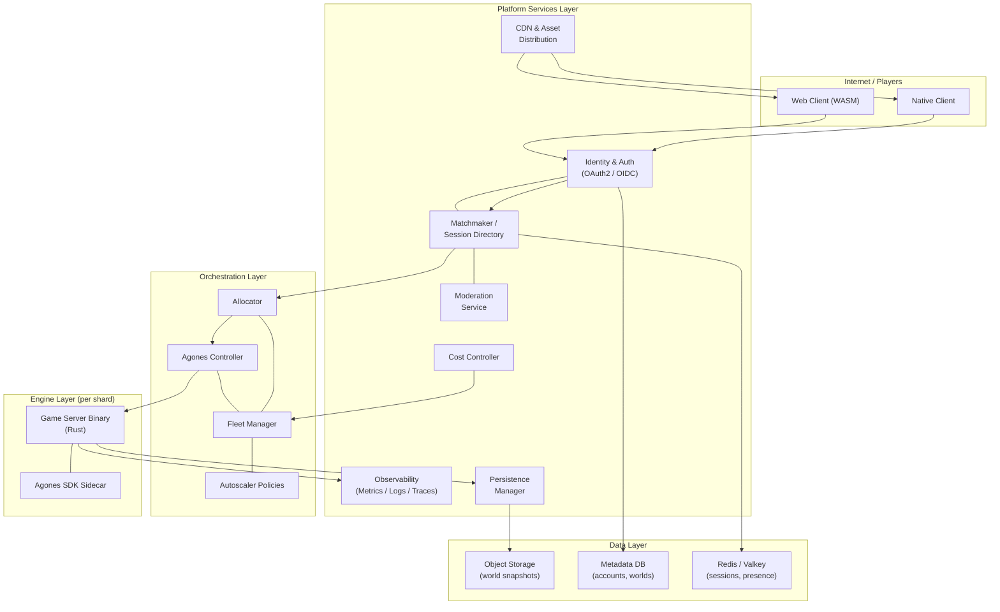
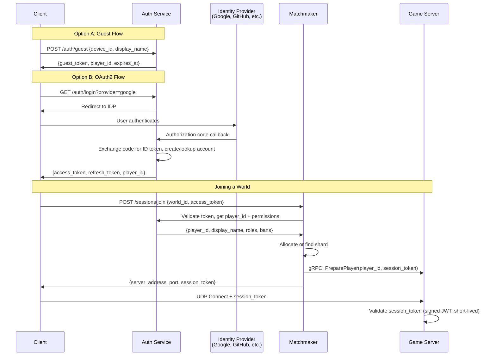
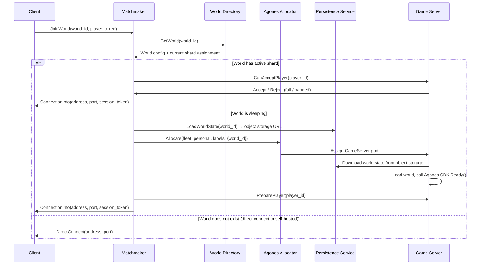
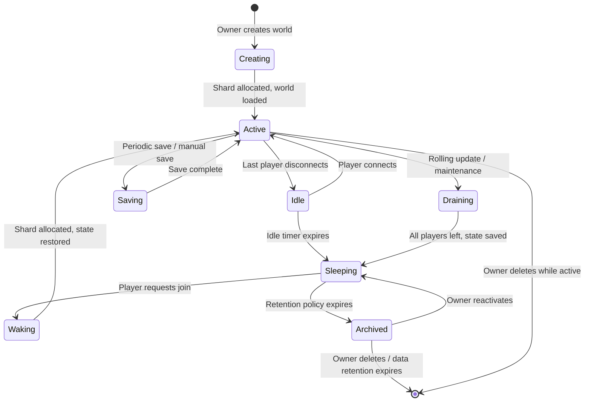
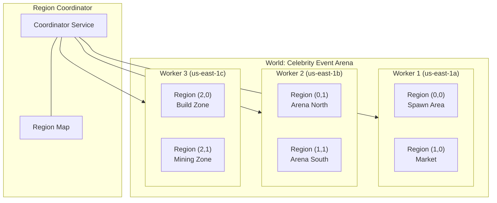
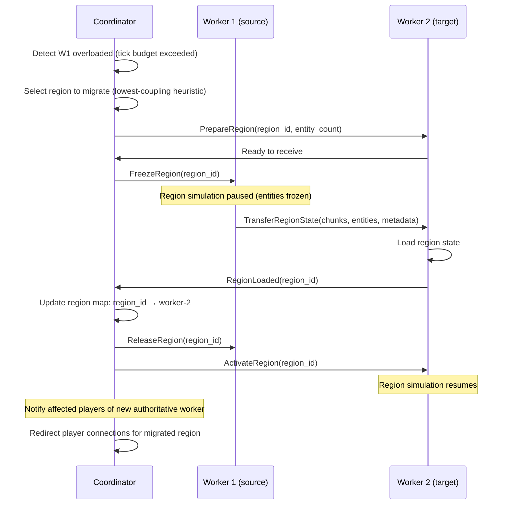
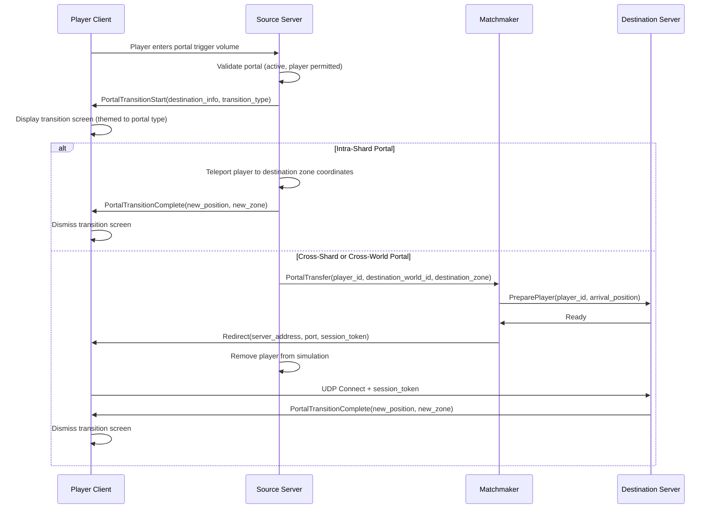
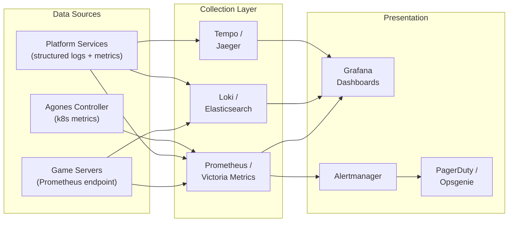
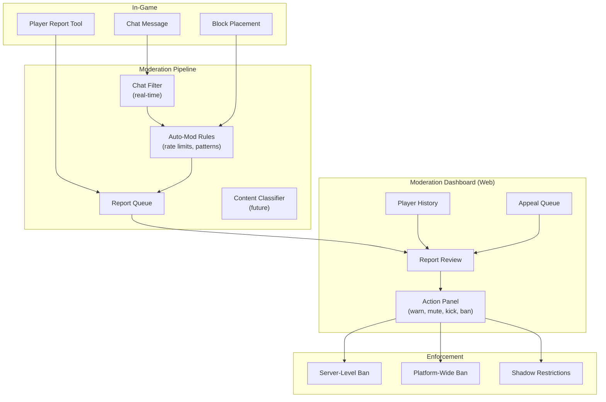
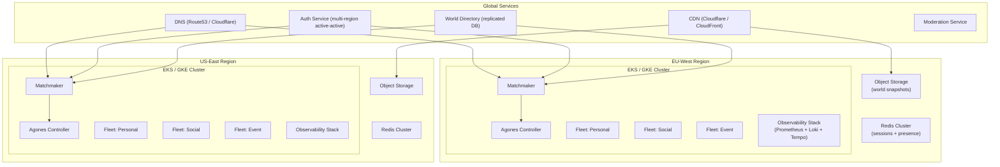

# 07 — Platform Services and Infrastructure

**Status**: Draft
**Last Updated**: 2026-03-03

---

## 1. Platform Architecture Overview

The Axe'n'Stax system is divided into two distinct layers: the **engine** and the **platform**. Understanding the boundary between them is fundamental to every decision in this document.

**Engine** — The game runtime. A Rust binary that simulates a voxel world: tick loop, physics, block placement, entity management, chunk streaming, networking protocol, rendering (client side). The engine runs identically whether deployed on a laptop, in a Docker container, or as a Kubernetes pod managed by Agones. It knows nothing about fleet orchestration, matchmaking, or identity providers. It exposes a small control surface (gRPC sidecar or stdin/stdout commands) that the platform uses to manage it.

**Platform** — The cloud services layer that surrounds the engine. Identity, authentication, matchmaking, session allocation, fleet orchestration, persistence management, observability, moderation, asset distribution, and cost controls. The platform treats the engine as a black box that accepts a world configuration, runs a simulation, and reports health. The platform is optional: a self-hosted single binary runs without it.



### Separation Principle

The engine binary never imports platform libraries. Communication between the engine and the platform uses exactly three interfaces:

1. **Agones SDK** — The engine calls `Ready()`, `Health()`, `Shutdown()`, `Allocate()`, and sets/gets annotations and labels. This is how the engine reports its lifecycle state.
2. **gRPC Control Port** — A lightweight sidecar (or built-in listener) that accepts commands from the platform: load world, save world, kick player, get player list, get metrics snapshot. This is how the platform controls the engine.
3. **Structured Logging / Metrics Export** — The engine emits structured logs to stdout and exposes a Prometheus metrics endpoint. This is how the platform observes the engine.

Self-hosted single-binary mode simply omits the Agones SDK and gRPC sidecar. The engine runs standalone, reads config from a local file, and persists to the local filesystem.

---

## 2. Identity & Authentication

### 2.1 Account Types

| Account Type | How Created | Capabilities | Persistence |
|---|---|---|---|
| **Guest** | Automatic on first launch | Play on public worlds, limited chat, no world ownership | Ephemeral (device-bound token, 30-day expiry) |
| **Registered** | Email or OAuth2 provider | Full access, world ownership, friend lists, moderation history | Permanent |
| **Linked** | Guest upgraded to registered | Retains guest history, gains full capabilities | Permanent |

Guest accounts are critical for frictionless first play. A player should be able to launch the client (web or native), pick a name, and be in a world within 60 seconds. No email, no password, no OAuth redirect. The guest token is stored locally and can be upgraded to a full account later without losing progress.

### 2.2 Authentication Flow



### 2.3 Token Architecture

- **Access Token**: JWT, signed by the auth service, 15-minute expiry. Contains `player_id`, `display_name`, `roles`, `account_type`. Used for platform API calls.
- **Refresh Token**: Opaque, stored server-side, 30-day expiry. Used to obtain new access tokens without re-authentication.
- **Session Token**: JWT, signed by the matchmaker, 5-minute expiry. Contains `player_id`, `world_id`, `shard_id`, `server_address`. Passed to the game server during UDP connect. The game server validates the signature without calling back to the auth service (public key is distributed via config).
- **Guest Token**: JWT, signed by the auth service, 30-day expiry. Contains a device-derived `guest_id`. Can be exchanged for a full account via the linking flow.

### 2.4 Auth Service API

```
POST   /auth/guest                  # Create guest account
POST   /auth/login                  # Initiate OAuth2 flow
POST   /auth/token/refresh          # Refresh access token
POST   /auth/link                   # Link guest to registered account
GET    /auth/profile                # Get current player profile
PUT    /auth/profile                # Update display name, avatar
DELETE /auth/account                # Request account deletion (GDPR)
GET    /auth/.well-known/jwks.json  # Public keys for token verification
```

### 2.5 Self-Hosted Auth

Self-hosted servers operate in one of two modes:

**Platform-Connected Mode** — The self-hosted server is registered with the Axe'n'Stax platform. Players authenticate via the platform auth service. The server receives session tokens signed by the platform. This enables cross-server identity, friend lists, and platform-wide bans.

**Standalone Mode** — The server runs its own local auth. Players create accounts directly on the server (username/password or invite code). No external dependencies. The single-binary personal tier defaults to this mode. The server generates its own JWT signing keys on first boot.

```yaml
# Server config: auth section
auth:
  mode: standalone           # standalone | platform
  # Standalone mode settings
  standalone:
    allow_registration: true
    require_invite_code: false
    max_accounts: 100
  # Platform mode settings
  platform:
    auth_url: "https://auth.axenstax.io"
    server_id: "srv_abc123"
    server_secret: "${GB_SERVER_SECRET}"
```

---

## 3. Session Management & Matchmaking

### 3.1 World Directory

The world directory is the central registry of all worlds available on the platform. It supports discovery, search, and direct connect.

```
GET  /worlds                          # List public worlds (paginated, filterable)
GET  /worlds/{world_id}               # Get world details
POST /worlds                          # Create a new world
PUT  /worlds/{world_id}               # Update world settings
GET  /worlds/{world_id}/status        # Get live status (player count, online/sleeping)
POST /worlds/{world_id}/invite        # Generate invite link
```

**Directory Entry Schema**:

```json
{
  "world_id": "wld_7f3a9b2c",
  "name": "Blocks's Survival World",
  "description": "Vanilla survival, no griefing",
  "owner_id": "plr_abc123",
  "type": "personal",
  "visibility": "public",
  "max_players": 10,
  "current_players": 3,
  "status": "active",
  "region": "eu-west-1",
  "tags": ["survival", "vanilla", "friendly"],
  "created_at": "2026-03-01T12:00:00Z",
  "last_active_at": "2026-03-03T14:30:00Z",
  "version": "0.1.0",
  "thumbnail_url": "https://cdn.axenstax.io/thumbs/wld_7f3a9b2c.webp"
}
```

### 3.2 Session Allocation Flow



### 3.3 Join Mechanisms

| Mechanism | How It Works |
|---|---|
| **World Browser** | Client queries `/worlds` with filters (type, tags, region, player count). Results sorted by relevance/popularity. Player clicks to join. |
| **Friend Join** | Client queries `/friends/{friend_id}/location`. If friend is in a world, returns world_id. Player clicks "Join Friend". Subject to world's access policy. |
| **Invite Link** | Owner generates a signed invite URL: `https://play.axenstax.io/join/wld_7f3a9b2c?invite=inv_xyz`. Link contains world_id and invite token. Works for private worlds. |
| **Direct Connect** | Player enters `server:port` manually. Client connects directly, bypassing the matchmaker. Used for self-hosted servers not registered with the platform. |
| **Password** | World requires a password. Matchmaker prompts client for password before allocating. Password is verified server-side (bcrypt hash stored in world config). |

### 3.4 Friend System

Friends are stored in the platform's metadata database. The friend system supports:

- **Friend Requests**: `POST /friends/request {target_player_id}`
- **Accept/Decline**: `PUT /friends/request/{request_id} {action: accept|decline}`
- **Friend List**: `GET /friends` returns friends with online status and current world (if public)
- **Presence**: When a player connects to a game server, the server publishes presence to Redis/Valkey. The matchmaker subscribes to presence updates for the player's friends.

```
# Redis presence key structure
presence:{player_id} → {world_id, shard_id, connected_at, status}
TTL: 120 seconds (refreshed by game server every 60 seconds)
```

### 3.5 Matchmaker Implementation

The matchmaker is a stateless service (multiple replicas behind a load balancer). It does not hold session state itself; all state is in Redis (presence, shard assignments) and the world directory database.

For the initial implementation, a custom matchmaker is preferred over Open Match. Open Match is designed for competitive matchmaking (skill-based, latency-based team formation), which is overengineered for a sandbox world-join flow. The Axe'n'Stax matchmaker is closer to a "session directory" pattern:

1. Look up the world.
2. If a shard exists and has capacity, return its address.
3. If no shard exists, allocate one and return the address.
4. If the world is sleeping, wake it first.

Open Match can be adopted later if competitive game modes (PvP arenas, tournaments) are added.

---

## 4. Agones Fleet Management

### 4.1 Fleet Architecture

Agones manages the lifecycle of game server pods on Kubernetes. Each game server pod runs one engine instance (one shard, one world). Agones provides:

- **Fleets**: A set of warm, ready-to-allocate game server pods.
- **Allocation**: The matchmaker requests a server from the fleet; Agones assigns one and marks it as "Allocated".
- **Health Checking**: Agones monitors game server health via the SDK sidecar.
- **Lifecycle**: Game servers transition through states: `Creating` -> `Ready` -> `Allocated` -> `Shutdown`.

### 4.2 Fleet Definitions

Three fleets, one per world type, each with different sizing and policies:

```yaml
# Fleet: Personal Worlds (scale-to-zero capable)
apiVersion: "agones.dev/v1"
kind: Fleet
metadata:
  name: fleet-personal
  namespace: axenstax
  labels:
    genesis.world-type: personal
spec:
  replicas: 5  # warm buffer — overridden by autoscaler
  scheduling: Packed  # bin-pack onto fewer nodes for cost efficiency
  strategy:
    type: RollingUpdate
    rollingUpdate:
      maxSurge: "25%"
      maxUnavailable: 0  # never kill allocated servers during rollout
  template:
    metadata:
      labels:
        genesis.world-type: personal
    spec:
      ports:
        - name: game
          portPolicy: Dynamic
          containerPort: 7777
          protocol: UDP
        - name: control
          portPolicy: Dynamic
          containerPort: 7778
          protocol: TCP
      health:
        disabled: false
        initialDelaySeconds: 15
        periodSeconds: 10
        failureThreshold: 3
      sdkServer:
        logLevel: Info
        grpcPort: 9357
        httpPort: 9358
      template:
        spec:
          containers:
            - name: game-server
              image: ghcr.io/axenstax/server:0.1.0
              resources:
                requests:
                  cpu: "500m"
                  memory: "512Mi"
                limits:
                  cpu: "1000m"
                  memory: "1Gi"
              env:
                - name: GB_WORLD_TYPE
                  value: "personal"
                - name: GB_MAX_PLAYERS
                  value: "10"
                - name: GB_TICK_RATE
                  value: "20"
              volumeMounts:
                - name: world-data
                  mountPath: /data/world
          volumes:
            - name: world-data
              emptyDir:
                sizeLimit: 2Gi
          tolerations:
            - key: "agones.dev/agones-system"
              operator: "Equal"
              value: "true"
              effect: "NoSchedule"
```

```yaml
# Fleet: Social Worlds (always-warm, moderate resources)
apiVersion: "agones.dev/v1"
kind: Fleet
metadata:
  name: fleet-social
  namespace: axenstax
  labels:
    genesis.world-type: social
spec:
  replicas: 10
  scheduling: Packed
  strategy:
    type: RollingUpdate
    rollingUpdate:
      maxSurge: "25%"
      maxUnavailable: 0
  template:
    metadata:
      labels:
        genesis.world-type: social
    spec:
      ports:
        - name: game
          portPolicy: Dynamic
          containerPort: 7777
          protocol: UDP
        - name: control
          portPolicy: Dynamic
          containerPort: 7778
          protocol: TCP
      health:
        disabled: false
        initialDelaySeconds: 30
        periodSeconds: 15
        failureThreshold: 3
      template:
        spec:
          containers:
            - name: game-server
              image: ghcr.io/axenstax/server:0.1.0
              resources:
                requests:
                  cpu: "2000m"
                  memory: "4Gi"
                limits:
                  cpu: "4000m"
                  memory: "8Gi"
              env:
                - name: GB_WORLD_TYPE
                  value: "social"
                - name: GB_MAX_PLAYERS
                  value: "200"
                - name: GB_TICK_RATE
                  value: "20"
              volumeMounts:
                - name: world-data
                  mountPath: /data/world
          volumes:
            - name: world-data
              emptyDir:
                sizeLimit: 10Gi
```

```yaml
# Fleet: Event Worlds (pre-warmed, high resources)
apiVersion: "agones.dev/v1"
kind: Fleet
metadata:
  name: fleet-event
  namespace: axenstax
  labels:
    genesis.world-type: event
spec:
  replicas: 3  # pre-warmed event capacity
  scheduling: Distributed  # spread across nodes for resilience
  strategy:
    type: RollingUpdate
    rollingUpdate:
      maxSurge: "50%"
      maxUnavailable: 0
  template:
    metadata:
      labels:
        genesis.world-type: event
    spec:
      ports:
        - name: game
          portPolicy: Dynamic
          containerPort: 7777
          protocol: UDP
        - name: control
          portPolicy: Dynamic
          containerPort: 7778
          protocol: TCP
      health:
        disabled: false
        initialDelaySeconds: 60
        periodSeconds: 15
        failureThreshold: 5
      template:
        spec:
          containers:
            - name: game-server
              image: ghcr.io/axenstax/server:0.1.0
              resources:
                requests:
                  cpu: "4000m"
                  memory: "8Gi"
                limits:
                  cpu: "8000m"
                  memory: "16Gi"
              env:
                - name: GB_WORLD_TYPE
                  value: "event"
                - name: GB_MAX_PLAYERS
                  value: "2000"
                - name: GB_TICK_RATE
                  value: "20"
                - name: GB_REGION_MODE
                  value: "multi"
              volumeMounts:
                - name: world-data
                  mountPath: /data/world
          volumes:
            - name: world-data
              emptyDir:
                sizeLimit: 50Gi
          nodeSelector:
            genesis.io/node-tier: "event"
```

### 4.3 Fleet Autoscaler

```yaml
# Autoscaler: Personal Fleet
apiVersion: "autoscaling.agones.dev/v1"
kind: FleetAutoscaler
metadata:
  name: autoscaler-personal
  namespace: axenstax
spec:
  fleetName: fleet-personal
  policy:
    type: Buffer
    buffer:
      bufferSize: 3       # keep 3 Ready servers in the warm pool
      minReplicas: 0       # can scale to zero when no worlds are active
      maxReplicas: 1000    # hard cap
```

```yaml
# Autoscaler: Social Fleet
apiVersion: "autoscaling.agones.dev/v1"
kind: FleetAutoscaler
metadata:
  name: autoscaler-social
  namespace: axenstax
spec:
  fleetName: fleet-social
  policy:
    type: Buffer
    buffer:
      bufferSize: 5
      minReplicas: 2       # always keep some warm
      maxReplicas: 500
```

```yaml
# Autoscaler: Event Fleet — no autoscaler by default.
# Event capacity is provisioned manually (or via scheduled scaling)
# before known events. This prevents runaway cost from unexpected allocation.
```

### 4.4 Allocation Workflow

The matchmaker allocates servers via the Agones Allocation API:

```yaml
# Allocation request for a personal world
apiVersion: "allocation.agones.dev/v1"
kind: GameServerAllocation
metadata:
  namespace: axenstax
spec:
  required:
    matchLabels:
      genesis.world-type: personal
  scheduling: Packed
  metadata:
    labels:
      genesis.world-id: "wld_7f3a9b2c"
    annotations:
      genesis.owner-id: "plr_abc123"
      genesis.world-name: "My Survival World"
```

The matchmaker calls `POST /gameserverallocation` on the Agones allocator service. Agones selects a `Ready` GameServer from the matching fleet, marks it `Allocated`, and returns the connection details (address + port). The matchmaker then instructs the allocated server to load the specific world via the gRPC control port.

### 4.5 Rolling Updates Without Disconnecting Players

Agones rolling updates respect the `Allocated` state. When a fleet's image or config is updated:

1. Agones creates new `Ready` pods with the updated spec (up to `maxSurge`).
2. Old `Ready` (unallocated) pods are terminated and replaced.
3. Old `Allocated` pods are **never terminated**. They continue running until the world shuts down naturally (all players leave, sleep timer expires).
4. When an allocated server eventually shuts down, the pod is terminated. The next allocation draws from the new pool.

This means a rolling update can take hours or days to fully complete, depending on how long worlds stay active. This is acceptable and expected.

For critical security patches that require immediate restart, the platform can instruct allocated servers to enter "drain mode" via the gRPC control port: the server sends a message to all players ("Server restarting in 5 minutes for a critical update"), saves the world, and calls `Shutdown()`. The world will be automatically re-allocated on a new pod when a player reconnects.

### 4.6 Multi-Cluster / Multi-Region

For global coverage with acceptable latency, Agones is deployed in multiple Kubernetes clusters across regions:

```
Regions:
  eu-west    → GKE/EKS cluster with Agones + all three fleets
  us-east    → GKE/EKS cluster with Agones + all three fleets
  us-west    → GKE/EKS cluster with Agones + all three fleets
  ap-south   → GKE/EKS cluster with Agones + personal + social fleets
```

The matchmaker is region-aware. When allocating a shard:

1. If the world has a preferred region (set by owner), allocate in that region.
2. If no preference, allocate in the region closest to the requesting player.
3. If the preferred region's fleet is full, fall back to the next closest region with capacity.

Agones Multi-Cluster Allocation enables the matchmaker to allocate across clusters from a single API call, using allocation policies with priority ordering and regional weights.

```yaml
# Multi-cluster allocation policy
apiVersion: "multicluster.agones.dev/v1"
kind: GameServerAllocationPolicy
metadata:
  name: personal-global
  namespace: axenstax
spec:
  priority: 100
  weight: 100
  connectionInfo:
    clusterName: "eu-west-cluster"
    allocationEndpoints:
      - "agones-allocator.eu-west.axenstax.io"
    serverCa: <base64-encoded-ca-cert>
---
apiVersion: "multicluster.agones.dev/v1"
kind: GameServerAllocationPolicy
metadata:
  name: personal-global
  namespace: axenstax
spec:
  priority: 100
  weight: 100
  connectionInfo:
    clusterName: "us-east-cluster"
    allocationEndpoints:
      - "agones-allocator.us-east.axenstax.io"
    serverCa: <base64-encoded-ca-cert>
```

---

## 5. World Lifecycle

### 5.1 State Machine



### 5.2 State Definitions

| State | Description | Resources Consumed |
|---|---|---|
| **Creating** | World config is written to the directory. No shard allocated yet. | Database row only |
| **Active** | A shard is running, players can connect. Tick loop is executing. | Full compute (CPU + RAM + network) |
| **Idle** | Shard is running but no players are connected. Idle timer counting down. | Compute (reduced — engine can lower tick rate to 1 TPS when idle) |
| **Sleeping** | No shard allocated. World state is persisted to object storage. | Storage only (~$0.023/GB/month on S3) |
| **Waking** | A shard is being allocated and world state is being restored from object storage. | Compute + bandwidth (download from object storage) |
| **Saving** | A periodic or manual save is in progress. Shard continues running. | Compute + bandwidth (upload to object storage) |
| **Draining** | Shard is shutting down gracefully. No new players accepted. | Compute (declining) |
| **Archived** | World has been sleeping longer than the retention window. Moved to cold storage (S3 Glacier / equivalent). | Cold storage only (~$0.004/GB/month) |

### 5.3 Sleep Mechanics

When a personal world's idle timer expires (default: 10 minutes, configurable per tier):

1. The engine saves a full world snapshot (chunk data, entity state, player inventories, world metadata).
2. The snapshot is uploaded to object storage as a compressed archive (zstd compression).
3. The engine calls `Shutdown()` via the Agones SDK.
4. Agones terminates the pod and returns it to the fleet (or scales down if the pool is full).
5. The world directory entry is updated: `status: sleeping`, `snapshot_url: s3://...`.

**Snapshot format**:

```
world-snapshot-{world_id}-{timestamp}.tar.zst
  ├── world.meta.json        # World metadata (seed, settings, version)
  ├── chunks/                 # Chunk data (binary format, indexed by region)
  │   ├── r.0.0.chunks
  │   ├── r.0.1.chunks
  │   └── ...
  ├── entities.bin            # All entity state
  ├── players/                # Per-player data (inventory, position, health)
  │   ├── plr_abc123.dat
  │   └── ...
  └── regions.meta.json       # Region assignment map (for multi-region worlds)
```

### 5.4 Wake-on-Connect

When a player requests to join a sleeping world:

1. Matchmaker checks world status: `sleeping`.
2. Matchmaker calls Agones to allocate a shard from the appropriate fleet.
3. Matchmaker instructs the new shard (via gRPC) to download and load the snapshot from object storage.
4. Shard downloads snapshot, decompresses, loads world state into memory.
5. Shard calls `Ready()` via the Agones SDK.
6. Matchmaker returns connection info to the client.
7. Client connects.

**Latency targets for wake-on-connect**:

| Step | Target | Notes |
|---|---|---|
| Agones allocation | <2s | Depends on warm buffer size |
| Snapshot download (S3) | <3s | Typical personal world: 50-200MB compressed |
| World load into memory | <3s | Depends on world size and chunk count |
| **Total cold start** | **<8s** | Acceptable for personal worlds |
| **Total with warm buffer** | **<5s** | Buffer has pods already running |

The client displays a loading screen during wake ("Waking up your world...") with a progress indicator. This is an explicit, honest transition — not a hidden delay.

### 5.5 Backup Strategy

| Event | Action | Retention |
|---|---|---|
| Periodic auto-save | Full snapshot to object storage | Every 15 minutes while active. Last 4 snapshots retained (1 hour of rollback). |
| Sleep save | Full snapshot to object storage | Retained until next wake + successful save. |
| Daily backup | Copy latest snapshot to separate bucket/prefix | 30 days of daily backups. |
| Weekly backup | Copy to cold storage | 90 days. |
| Manual backup | Player-triggered snapshot | 5 manual backups retained per world. |

### 5.6 World Deletion and Data Retention

When an owner deletes a world:

1. World directory entry marked as `deleted`.
2. Active shard (if any) drains and shuts down.
3. Snapshots moved to a "pending deletion" prefix.
4. After 30 days, all data is permanently deleted.
5. Owner can cancel deletion within the 30-day window.

GDPR account deletion triggers deletion of all worlds owned by the account, plus removal of the player's data from all world snapshots (player files, chat logs, inventory data).

### 5.7 World Transfer

World ownership can be transferred to another registered account:

```
POST /worlds/{world_id}/transfer
{
  "new_owner_id": "plr_def456",
  "require_acceptance": true
}
```

The new owner must accept the transfer. Both parties receive confirmation. The world retains all data; only the `owner_id` field changes.

---

## 6. Scaling Policies by World Type

### 6.1 Policy Comparison

| Attribute | Personal (0-10) | Social (20-200) | Event (500-10k+) |
|---|---|---|---|
| **Workers** | 1 | 1 | Multiple (region-based) |
| **Sleep when empty** | Yes (10 min idle) | No (always warm) | No (pre-warmed) |
| **Cold start OK** | Yes (<8s) | No | No |
| **Tick rate** | 20 TPS | 20 TPS | 20 TPS (simulation), 5 TPS (spectator zones) |
| **CPU request** | 500m | 2000m | 4000m per worker |
| **Memory request** | 512Mi | 4Gi | 8Gi per worker |
| **Autoscaling** | Scale to zero | Vertical (adjust limits) | Horizontal (add workers) |
| **Warm buffer** | 3 spare pods | 5 spare pods | Manual pre-provision |
| **Spot/preemptible** | Yes (with checkpoint) | No | No |
| **Region simulation** | Single region | Single region | Multi-region distributed |
| **Spectator tier** | N/A | N/A | Yes (low-bandwidth view) |
| **Provisioning** | Automatic | Automatic | Manual / scheduled |

### 6.2 Personal World Configuration

```yaml
# World config for personal type
world:
  type: personal
  max_players: 10
  idle_timeout_seconds: 600    # 10 minutes
  save_interval_seconds: 900   # 15 minutes
  max_world_size_mb: 2048      # 2 GB limit

scaling:
  sleep_when_empty: true
  cold_start_allowed: true
  spot_instance_eligible: true
  checkpoint_on_preemption: true  # save before spot eviction

resources:
  cpu_request: "500m"
  cpu_limit: "1000m"
  memory_request: "512Mi"
  memory_limit: "1Gi"
  storage_limit: "2Gi"

quotas:
  max_entities: 5000
  max_loaded_chunks: 2500
  max_bandwidth_mbps: 10
```

### 6.3 Social World Configuration

```yaml
world:
  type: social
  max_players: 200
  idle_timeout_seconds: 0      # never sleep
  save_interval_seconds: 300   # 5 minutes
  max_world_size_mb: 10240     # 10 GB limit

scaling:
  sleep_when_empty: false
  cold_start_allowed: false
  spot_instance_eligible: false

resources:
  cpu_request: "2000m"
  cpu_limit: "4000m"
  memory_request: "4Gi"
  memory_limit: "8Gi"
  storage_limit: "10Gi"

quotas:
  max_entities: 50000
  max_loaded_chunks: 25000
  max_bandwidth_mbps: 100
```

### 6.4 Event World Configuration

```yaml
world:
  type: event
  max_players: 10000
  idle_timeout_seconds: 0
  save_interval_seconds: 60    # every minute during events
  max_world_size_mb: 51200     # 50 GB limit

scaling:
  sleep_when_empty: false
  cold_start_allowed: false
  spot_instance_eligible: false
  multi_region: true
  pre_warm_workers: 4          # spin up 4 workers before event
  spectator_tier: true         # enable low-bandwidth spectator mode

resources:
  per_worker:
    cpu_request: "4000m"
    cpu_limit: "8000m"
    memory_request: "8Gi"
    memory_limit: "16Gi"
    storage_limit: "50Gi"

quotas:
  max_entities: 500000
  max_loaded_chunks: 250000
  max_bandwidth_mbps: 1000     # aggregate across all workers

spectator:
  max_spectators: 50000
  update_rate_hz: 5            # spectators receive 5 updates/sec (vs 20 for players)
  view_distance_chunks: 8      # reduced view distance for spectators
```

### 6.5 Resource Quotas per Account Tier

| Account Tier | Personal Worlds | Social Worlds | Event Worlds | Total Storage |
|---|---|---|---|---|
| **Free** | 1 world (2 GB) | 0 | 0 | 2 GB |
| **Creator** | 3 worlds (2 GB each) | 1 world (10 GB) | 0 | 16 GB |
| **Pro** | 10 worlds (5 GB each) | 3 worlds (20 GB each) | 0 | 110 GB |
| **Enterprise** | Unlimited | Unlimited | Event access | Custom |

---

## 7. Region-Based Simulation

### 7.1 Concept

A "region" is a spatial subdivision of a world that acts as the unit of simulation. Each region is a contiguous volume of chunks (e.g., 16x16x16 chunks = 256x256x256 blocks). A single worker thread or process is authoritative for all simulation within its assigned regions.

For personal and social worlds, all regions run within a single worker process. For event worlds, regions are distributed across multiple worker processes, potentially on different machines.



### 7.2 Region Assignment

The **Region Coordinator** is a per-world service that manages region-to-worker assignments. For single-worker worlds, it runs in-process as a trivial "all regions to self" mapping. For multi-worker worlds, it runs as a separate process.

The region map is a simple data structure:

```json
{
  "world_id": "wld_event_123",
  "regions": {
    "(0,0)": {"worker_id": "worker-1", "load": 0.45, "entities": 1200, "players": 35},
    "(1,0)": {"worker_id": "worker-1", "load": 0.30, "entities": 800, "players": 20},
    "(0,1)": {"worker_id": "worker-2", "load": 0.80, "entities": 3000, "players": 150},
    "(1,1)": {"worker_id": "worker-2", "load": 0.65, "entities": 2500, "players": 120},
    "(2,0)": {"worker_id": "worker-3", "load": 0.20, "entities": 500, "players": 10},
    "(2,1)": {"worker_id": "worker-3", "load": 0.15, "entities": 400, "players": 8}
  }
}
```

### 7.3 Region Migration

When a worker is overloaded (tick time exceeding budget, entity count too high), the coordinator can migrate a region to a different worker:



**Migration latency target**: <500ms total freeze time. During the freeze, entities in the migrating region are stationary. Players in that region experience a brief "lag spike" but are not disconnected. Players in other regions are unaffected.

**Migration heuristics** — The coordinator selects the region to migrate based on:

1. **Load contribution**: Migrate the region that contributes most to the overload.
2. **Coupling**: Prefer regions with fewer cross-boundary interactions (fewer entities near the boundary).
3. **Player count**: Avoid migrating regions with the most players (disruptive).
4. **Target headroom**: Only migrate to workers with sufficient spare capacity.

### 7.4 Cross-Region Entity Handoff

When a player (or any entity) crosses from one region to another, ownership transfers from the source worker to the destination worker:

1. **Approach detection**: When an entity is within 16 blocks of a region boundary, the source worker notifies the destination worker and begins sharing entity state updates (dual-authority window).
2. **Boundary crossing**: When the entity crosses the boundary, the source worker sends a `TransferEntity` message to the destination worker with the full entity state.
3. **Authority switch**: The destination worker assumes authority. The source worker removes the entity from its simulation.
4. **Client redirect**: If the entity is a player, the client is notified of the new authoritative worker. For same-process regions, this is invisible. For cross-process regions, the client may need to establish a new UDP connection to the destination worker (handled transparently by the client's networking layer).

**The stitching problem**: Entities near region boundaries must be visible to players on both sides. Each worker maintains a "ghost zone" — a read-only copy of entities in adjacent regions within a configurable distance (default: 32 blocks). Workers exchange ghost zone updates at a reduced frequency (10 Hz instead of 20 Hz). Ghost entities are rendered by the client but cannot be interacted with until the player enters the region.

### 7.5 Region Sizing Guidelines

| World Type | Region Size (chunks) | Typical Region Count | Workers |
|---|---|---|---|
| Personal | 32x32 (512x512 blocks) | 1-4 | 1 |
| Social | 16x16 (256x256 blocks) | 4-16 | 1 |
| Event | 8x8 (128x128 blocks) | 16-256 | 4-32 |

Smaller regions allow finer-grained load balancing but increase cross-region handoff frequency and ghost zone overhead. Event worlds use smaller regions because load distribution matters more at scale.

---

## 8. Portal/Zone System

### 8.1 Concept

Portals connect distinct zones within a world or across worlds. A zone is a self-contained simulation space (a dimension, a dungeon, a separate island). Unlike region boundaries (which are invisible to players), portal transitions are **explicit**: the player steps into a portal, sees a transition, and arrives in the destination zone.

This is the primary mechanism for scaling beyond what a single shard can simulate. Instead of making one world infinitely large, connect multiple zones via portals.

### 8.2 Portal Types

| Portal Type | Source → Destination | Server Transition | Use Case |
|---|---|---|---|
| **Intra-Shard** | Zone A → Zone B (same server) | No | Nether/End style dimensions |
| **Cross-Shard** | Zone A (server 1) → Zone B (server 2) | Yes | Overflow zones, event arenas |
| **Cross-World** | World A → World B | Yes | Hub worlds, linked creator worlds |

### 8.3 Portal Transition Flow



### 8.4 Player Experience During Transition

The transition is **not** seamless (no deceptive cloning, no invisible handoff). The player sees an explicit transition, designed to feel intentional and thematic:

- **Short transitions** (intra-shard): 0.5-1 second fade or particle effect. Similar to Minecraft's Nether portal animation.
- **Cross-shard transitions**: 1-3 second loading screen themed to the portal type (swirling vortex, teleportation beam, door opening). This covers the time for matchmaker routing and UDP reconnection.
- **Cross-world transitions**: 2-5 second loading screen. World name and description displayed. This covers shard allocation if the destination world is sleeping.

The key principle: the transition is **honest**. Players know they are moving between zones. There is no pretense of a seamless infinite world.

### 8.5 Portal Definition

Portals are defined in world configuration and can be placed by world owners:

```json
{
  "portal_id": "portal_nether_01",
  "source": {
    "world_id": "wld_7f3a9b2c",
    "zone": "overworld",
    "position": [100, 64, 200],
    "size": [4, 5, 1]
  },
  "destination": {
    "world_id": "wld_7f3a9b2c",
    "zone": "nether",
    "position": [12, 64, 25],
    "size": [4, 5, 1]
  },
  "type": "intra-shard",
  "bidirectional": true,
  "transition": {
    "style": "nether_swirl",
    "duration_ms": 800
  },
  "permissions": {
    "require_item": null,
    "min_level": null,
    "whitelist": null
  }
}
```

### 8.6 Zone Discovery

Worlds can advertise their portal connections so players can discover linked worlds:

```
GET /worlds/{world_id}/portals        # List all portals in a world
GET /worlds/{world_id}/connections    # List all worlds connected via portals
```

This enables "world networks" — clusters of creator worlds linked by portals, forming a shared universe without requiring a single mega-server.

---

## 9. Observability

### 9.1 Three Pillars

The observability stack follows the three-pillar model: metrics, logs, and traces.



### 9.2 Metrics

The game server exposes a Prometheus endpoint on a configurable port (default: 9090). Metrics are scraped by Prometheus (or Victoria Metrics for production scale).

**Game Server Metrics**:

| Metric | Type | Description |
|---|---|---|
| `gb_tick_duration_seconds` | Histogram | Time to complete one simulation tick. Buckets: 10ms, 20ms, 30ms, 40ms, 50ms, 100ms. |
| `gb_tick_rate_hz` | Gauge | Actual tick rate (should be 20). |
| `gb_players_connected` | Gauge | Current connected player count. |
| `gb_players_active` | Gauge | Players who sent input in the last 30 seconds. |
| `gb_entities_total` | Gauge | Total entity count. |
| `gb_chunks_loaded` | Gauge | Number of chunks currently in memory. |
| `gb_network_bytes_sent_total` | Counter | Total bytes sent to clients (per second via rate). |
| `gb_network_bytes_received_total` | Counter | Total bytes received from clients. |
| `gb_network_packets_sent_total` | Counter | Total packets sent. |
| `gb_network_packets_dropped_total` | Counter | Packets dropped (send buffer full). |
| `gb_world_save_duration_seconds` | Histogram | Time to complete a world save. |
| `gb_world_size_bytes` | Gauge | Current world data size on disk. |
| `gb_region_count` | Gauge | Number of active regions. |
| `gb_region_migration_total` | Counter | Number of region migrations performed. |
| `gb_memory_usage_bytes` | Gauge | Process memory usage. |

**Platform Metrics**:

| Metric | Type | Description |
|---|---|---|
| `gb_allocation_duration_seconds` | Histogram | Time from allocation request to server ready. |
| `gb_allocation_failures_total` | Counter | Failed allocation attempts (no capacity). |
| `gb_wake_duration_seconds` | Histogram | Time from wake request to world ready. |
| `gb_worlds_active` | Gauge | Worlds currently running. |
| `gb_worlds_sleeping` | Gauge | Worlds currently sleeping. |
| `gb_ccu_total` | Gauge | Total concurrent users across all shards. |
| `gb_auth_requests_total` | Counter | Authentication requests (by type: guest, oauth, refresh). |
| `gb_matchmaker_requests_total` | Counter | Matchmaker join requests (by result: success, full, error). |

### 9.3 Logging

All components emit structured JSON logs to stdout. A log aggregation agent (Promtail, Fluentd, or Vector) ships logs to a central store (Loki or Elasticsearch).

**Log format**:

```json
{
  "timestamp": "2026-03-03T14:30:00.123Z",
  "level": "info",
  "component": "game-server",
  "shard_id": "gs-personal-abc123",
  "world_id": "wld_7f3a9b2c",
  "message": "Player connected",
  "player_id": "plr_abc123",
  "player_name": "Blocks",
  "remote_addr": "203.0.113.42:54321",
  "trace_id": "4bf92f3577b34da6a3ce929d0e0e4736"
}
```

**Log levels**:

- `error`: Something broke. Requires investigation. Crash, corruption, unrecoverable state.
- `warn`: Something unexpected but handled. Packet validation failure, rate limit hit, authentication rejection.
- `info`: Normal operations worth recording. Player connect/disconnect, world save, allocation, shutdown.
- `debug`: Detailed operational data. Tick timing, chunk load/unload, entity spawn. Disabled in production by default.

### 9.4 Distributed Tracing

Platform services propagate trace context (W3C Trace Context format) across HTTP and gRPC calls. Traces are collected by Tempo or Jaeger.

A typical traced flow: "Player joins a sleeping world" spans:

```
Trace: player-join-sleeping-world
├── matchmaker.JoinWorld                    (200ms total)
│   ├── auth.ValidateToken                  (5ms)
│   ├── directory.GetWorld                  (10ms)
│   ├── persistence.GetSnapshotURL          (15ms)
│   ├── agones.Allocate                     (1800ms)
│   │   └── k8s.CreatePod                   (1500ms)
│   ├── game-server.LoadWorld               (2500ms)
│   │   ├── storage.DownloadSnapshot        (1200ms)
│   │   ├── engine.DecompressWorld          (500ms)
│   │   └── engine.InitializeSimulation     (800ms)
│   └── game-server.PreparePlayer           (50ms)
└── total: ~4.6s
```

### 9.5 Dashboards

**Operational Dashboard** (primary on-call view):

- Total CCU (global, per-region)
- Allocation success rate (last 5 minutes)
- Average tick time per fleet (p50, p95, p99)
- Fleet capacity (Ready vs Allocated vs total)
- Wake latency (p50, p95)
- Error rate (5xx responses from platform services)

**Per-World Dashboard** (for world owners and support):

- Player count over time
- Tick time over time
- Entity count
- Bandwidth usage
- Save history and duration
- Player join/leave events

**Cost Dashboard** (for platform operators):

- Compute hours by fleet type
- Storage usage by world type
- Bandwidth by region
- Estimated cost per world (top 20 most expensive)
- Spot instance savings

### 9.6 Alerting

| Alert | Condition | Severity | Action |
|---|---|---|---|
| `TickBudgetExceeded` | `gb_tick_duration_seconds` p99 > 50ms for 5 min | Warning | Investigate world load. Consider region migration or player cap. |
| `TickCritical` | `gb_tick_duration_seconds` p99 > 100ms for 2 min | Critical | Auto-reduce entity limits. Page on-call. |
| `AllocationFailure` | `gb_allocation_failures_total` rate > 0 for 5 min | Critical | Fleet at capacity. Scale up nodes. |
| `CrashLoop` | Game server pod restart count > 3 in 10 min | Critical | Likely engine bug. Pull world from allocation pool. Capture core dump. |
| `WakeLatencyHigh` | `gb_wake_duration_seconds` p95 > 15s for 10 min | Warning | Snapshot download slow or fleet exhausted. |
| `EgressAnomaly` | `gb_network_bytes_sent_total` rate > 2x baseline for 15 min | Warning | Possible DDoS reflection or misbehaving client. Investigate. |
| `StorageNearQuota` | `gb_world_size_bytes` > 90% of quota | Warning | Notify world owner. |

---

## 10. Moderation System

### 10.1 Architecture



### 10.2 In-Game Reporting

Players can report others via an in-game command or UI button:

```
/report <player_name> <reason>
```

Report categories:
- **Harassment**: Bullying, hate speech, threats.
- **Cheating**: Speed hacks, fly hacks, X-ray, bot farms.
- **Griefing**: Intentional destruction of others' builds (in protected areas).
- **Spam**: Chat spam, command spam.
- **Inappropriate Content**: Builds depicting inappropriate content.
- **Other**: Free-text description.

Reports are queued with context: reporter ID, reported player ID, category, free-text, timestamp, world ID, chat log excerpt (last 50 messages), and a screenshot of the reported player's position (captured server-side as a chunk snapshot).

### 10.3 Chat Filtering

Real-time chat filtering runs on the game server (no round-trip to external services):

1. **Blocklist Filter**: A list of blocked words/phrases (regex patterns). Loaded from a platform-distributed filter file. Matches are replaced with asterisks. Updated via platform push (no server restart required).
2. **Rate Limiting**: Maximum 3 messages per 5 seconds per player. Excess messages are silently dropped with a client-side notice.
3. **Repeat Detection**: Identical messages within 30 seconds are blocked.
4. **Link Filter**: URLs are blocked by default in public chat. Allowed in private messages and for privileged players.

For platform-hosted servers, the filter list is centrally managed and distributed. Self-hosted servers can use the platform filter list or define their own.

### 10.4 Ban System

**Scope Levels**:

| Scope | Applied By | Effect | Duration Options |
|---|---|---|---|
| **World Ban** | World owner or moderator | Cannot join that specific world | Temporary (1h, 24h, 7d, 30d) or permanent |
| **Server Ban** | Server operator | Cannot join any world on that server | Temporary or permanent |
| **Platform Ban** | Platform moderators | Cannot join any platform-hosted server | Temporary or permanent |
| **Shadow Restriction** | Platform moderators | Reduced capabilities (no chat, no build in public areas) without explicit notification | Temporary |

**Ban Record**:

```json
{
  "ban_id": "ban_xyz789",
  "player_id": "plr_offender",
  "scope": "platform",
  "reason": "Repeated harassment after warnings",
  "evidence": ["report_001", "report_002", "chat_log_excerpt"],
  "issued_by": "mod_admin01",
  "issued_at": "2026-03-03T14:00:00Z",
  "expires_at": null,
  "appealed": false,
  "appeal_status": null
}
```

**Ban Checking Flow**: When a player joins a world, the game server checks bans in order: world ban list (local) -> server ban list (local) -> platform ban list (API call to moderation service, cached for 5 minutes). If any ban is active, the connection is rejected with a reason message.

### 10.5 Content Moderation for User-Built Worlds

User-built worlds listed in the public directory are subject to content guidelines. Enforcement mechanisms:

1. **Report-Based**: Players report worlds with policy-violating content. Reports are reviewed by moderators.
2. **Automated Scanning** (future): Periodic screenshots of public worlds are taken from random positions and run through a content classifier. Worlds flagged for review are hidden from the directory pending moderator decision.
3. **Delisting**: Worlds that violate content policies are removed from the public directory. They can still be accessed via direct connect (unless the violation warrants a full takedown).
4. **Takedown**: For severe violations (illegal content), the world is shut down and the owner's account is suspended pending investigation.

### 10.6 Moderation for Self-Hosted Servers

Self-hosted servers in **standalone mode** manage their own moderation entirely. The platform has no visibility or control.

Self-hosted servers in **platform-connected mode** can optionally:
- Use the platform's chat filter list.
- Submit reports to the platform's moderation queue (for cross-server ban requests).
- Enforce platform-wide bans (API call during player join).

The platform cannot force moderation actions on self-hosted servers. Platform-connected mode is voluntary. If a self-hosted server consistently hosts policy-violating content and is reported, it can be delisted from the world directory and its platform connection revoked.

### 10.7 Escalation Workflow

```
Player Report
  → Auto-mod check (is it obviously spam/duplicate?)
    → If auto-actionable: apply action (mute, rate limit)
    → If not: queue for human review
      → Tier 1 Moderator: review report + context
        → Can warn, mute (24h), kick
        → If severe: escalate to Tier 2
      → Tier 2 Moderator: review escalated reports
        → Can ban (temporary), delist world
        → If very severe: escalate to Admin
      → Admin: review critical escalations
        → Can permanent ban, takedown world, suspend account
        → Can override any lower-tier decision
```

---

## 11. CDN & Asset Distribution

### 11.1 Asset Types

| Asset Type | Size Range | Update Frequency | Distribution |
|---|---|---|---|
| **Base Game Assets** | 50-200 MB | Per release | CDN (client download at install/update) |
| **Server Resource Packs** | 1-50 MB | Per server config change | CDN or server-direct |
| **User Textures/Skins** | 10-500 KB | Per player change | CDN with content-addressed storage |
| **World Thumbnails** | 10-100 KB | On save | CDN |
| **Audio/Music** | 1-20 MB per track | Per release or resource pack | CDN |

### 11.2 Content-Addressed Storage

All assets are stored using content-addressed naming: the file name is the SHA-256 hash of the file contents. This provides:

- **Deduplication**: Identical assets (same texture in multiple resource packs) are stored once.
- **Cache Integrity**: Clients can verify downloaded assets match the expected hash.
- **Immutable URLs**: `https://cdn.axenstax.io/assets/sha256/<hash>` never changes content.
- **Cache-Friendly**: CDN and browser caches can set infinite `Cache-Control: max-age` headers because the URL uniquely identifies the content.

```
# Asset manifest (distributed with client updates or server join)
{
  "pack_id": "default-16x16",
  "version": "0.1.0",
  "assets": {
    "textures/block/stone.png":      "sha256:a1b2c3d4...",
    "textures/block/dirt.png":       "sha256:e5f6g7h8...",
    "textures/block/grass_top.png":  "sha256:i9j0k1l2...",
    "sounds/block/break_stone.ogg":  "sha256:m3n4o5p6...",
    ...
  },
  "total_size_bytes": 52428800,
  "cdn_base_url": "https://cdn.axenstax.io/assets/sha256/"
}
```

### 11.3 Server-Suggested Resource Packs

When a player connects to a server, the server can suggest (or require) a resource pack:

1. Server sends `ResourcePackOffer(pack_id, manifest_url, required)` during the connection handshake.
2. Client downloads the manifest, computes which assets it already has cached locally (by hash), and downloads only the missing assets from the CDN.
3. If the pack is required and the player declines, the connection is rejected.
4. The client applies the resource pack, overriding default textures/sounds for the session.

This is similar to Minecraft's server resource pack mechanism but uses content-addressed storage for efficient delta downloads.

### 11.4 CDN Architecture

```
Origin: S3 bucket (or compatible object storage)
  └── CDN: CloudFront / Cloudflare / Bunny CDN
       ├── Edge POP: eu-west
       ├── Edge POP: us-east
       ├── Edge POP: us-west
       └── Edge POP: ap-south
```

**CDN Configuration**:
- `Cache-Control: public, max-age=31536000, immutable` for content-addressed assets.
- `Cache-Control: public, max-age=300` for asset manifests (5-minute cache, allows quick updates).
- Compression: Brotli for text manifests, none for pre-compressed assets (PNG, OGG, zstd archives).
- CORS: Allow `*.axenstax.io` and `localhost` (for development).

### 11.5 Self-Hosted Asset Distribution

Self-hosted servers distribute assets in one of three ways:

1. **CDN Proxy** (default for platform-connected servers): Server uploads custom assets to the platform CDN. Clients download from the CDN. This is the fastest option for players but requires platform connectivity.
2. **Server-Direct** (default for standalone servers): The game server serves assets directly over HTTP on a secondary port. Suitable for small servers with few players. Bandwidth-limited.
3. **External HTTP** (advanced): Server operator hosts assets on their own HTTP server or CDN. Server config points to the external URL. Maximum control, maximum effort.

```yaml
# Server config: assets section
assets:
  distribution_mode: server_direct  # cdn_proxy | server_direct | external
  # server_direct settings
  server_direct:
    http_port: 7780
    max_concurrent_downloads: 10
    bandwidth_limit_mbps: 50
  # external settings
  external:
    base_url: "https://my-cdn.example.com/genesis-assets/"
```

---

## 12. Deployment Architecture

### 12.1 Reference Production Deployment



**Key decisions**:

- **Agones is deployed per region**. Each region has its own Agones controller and fleets. This avoids cross-region pod scheduling.
- **Matchmaker is deployed per region** (but is stateless and talks to the global world directory). Geographic DNS routing sends players to the nearest matchmaker.
- **Auth service is global** (active-active, replicated across regions). Auth tokens are self-contained JWTs — once issued, they can be verified locally by any service.
- **World directory is global** with read replicas per region. Writes go to the primary (single-leader replication). Acceptable because world creation/update is low-frequency.
- **Object storage is per-region**. World snapshots are stored in the region where the world runs. Cross-region replication is enabled for disaster recovery.
- **Observability is per-region** with a global aggregation view (Grafana Cloud or a central Grafana with multi-datasource queries).

### 12.2 Single-Binary Personal Tier

The single binary (`axenstax-server`) embeds everything needed to run a personal server with zero external dependencies:

```
axenstax-server
  ├── Engine (voxel simulation, networking)
  ├── Embedded HTTP server (asset serving, basic web admin)
  ├── SQLite (world storage, local accounts)
  ├── File-based persistence (world data on local disk)
  └── Config file (server.toml)
```

**What is NOT included**: Agones SDK (no Kubernetes), matchmaker (direct connect only), platform auth (local accounts only), CDN (assets served directly), moderation service (server admin manages via CLI/web admin).

**How to run**:

```bash
# Download and run
curl -L https://releases.axenstax.io/latest/linux-amd64 -o axenstax-server
chmod +x axenstax-server
./axenstax-server --world-name "My World" --port 7777

# Or with a config file
./axenstax-server --config server.toml
```

**Minimal `server.toml`**:

```toml
[server]
name = "My Survival World"
port = 7777
max_players = 10
motd = "Welcome to my world!"

[world]
seed = 12345
generator = "default"
save_path = "./worlds/my-world"

[auth]
mode = "standalone"
allow_registration = true
```

A 12-year-old should be able to download this binary and have a server running for friends in under 2 minutes.

### 12.3 Docker Compose for Small Creator Servers

For creators who want persistence, monitoring, and easier management without full Kubernetes:

```yaml
# docker-compose.yml
version: "3.8"

services:
  game-server:
    image: ghcr.io/axenstax/server:0.1.0
    ports:
      - "7777:7777/udp"
      - "7778:7778/tcp"   # control port
      - "7780:7780/tcp"   # asset HTTP
    volumes:
      - world-data:/data/world
      - ./server.toml:/etc/axenstax/server.toml:ro
    environment:
      - GB_WORLD_TYPE=social
      - GB_MAX_PLAYERS=50
      - GB_AUTH_MODE=platform
      - GB_PLATFORM_AUTH_URL=https://auth.axenstax.io
    restart: unless-stopped
    deploy:
      resources:
        limits:
          cpus: "2.0"
          memory: 4G

  # Optional: monitoring
  prometheus:
    image: prom/prometheus:v2.50.0
    ports:
      - "9090:9090"
    volumes:
      - ./prometheus.yml:/etc/prometheus/prometheus.yml:ro
      - prometheus-data:/prometheus
    restart: unless-stopped

  grafana:
    image: grafana/grafana:10.3.0
    ports:
      - "3000:3000"
    volumes:
      - grafana-data:/var/lib/grafana
      - ./grafana/dashboards:/etc/grafana/provisioning/dashboards:ro
    environment:
      - GF_SECURITY_ADMIN_PASSWORD=${GRAFANA_PASSWORD:-admin}
    restart: unless-stopped

  # Optional: backup to S3-compatible storage
  backup:
    image: ghcr.io/axenstax/backup-agent:0.1.0
    volumes:
      - world-data:/data/world:ro
    environment:
      - BACKUP_SCHEDULE=0 */6 * * *    # every 6 hours
      - S3_ENDPOINT=https://s3.example.com
      - S3_BUCKET=my-world-backups
      - S3_ACCESS_KEY=${S3_ACCESS_KEY}
      - S3_SECRET_KEY=${S3_SECRET_KEY}
    restart: unless-stopped

volumes:
  world-data:
  prometheus-data:
  grafana-data:
```

### 12.4 Full Kubernetes for Platform Scale

The full platform deployment consists of multiple Helm charts:

```
infra/k8s/
  ├── charts/
  │   ├── genesis-platform/          # Auth, matchmaker, directory, moderation
  │   │   ├── Chart.yaml
  │   │   ├── values.yaml
  │   │   └── templates/
  │   │       ├── auth-deployment.yaml
  │   │       ├── matchmaker-deployment.yaml
  │   │       ├── directory-deployment.yaml
  │   │       ├── moderation-deployment.yaml
  │   │       └── ...
  │   ├── genesis-agones/            # Fleet definitions, autoscalers
  │   │   ├── Chart.yaml
  │   │   ├── values.yaml
  │   │   └── templates/
  │   │       ├── fleet-personal.yaml
  │   │       ├── fleet-social.yaml
  │   │       ├── fleet-event.yaml
  │   │       ├── autoscaler-personal.yaml
  │   │       ├── autoscaler-social.yaml
  │   │       └── ...
  │   ├── genesis-observability/     # Prometheus, Loki, Tempo, Grafana, Alertmanager
  │   └── genesis-data/             # PostgreSQL, Redis, S3 bucket policies
  └── environments/
      ├── staging/
      │   └── values.yaml
      └── production/
          ├── eu-west/
          │   └── values.yaml
          ├── us-east/
          │   └── values.yaml
          └── us-west/
              └── values.yaml
```

**Node Pool Configuration** (GKE example):

```yaml
# Node pool for personal world shards (cost-optimized)
node_pool:
  name: "personal-pool"
  machine_type: "e2-standard-2"     # 2 vCPU, 8 GB RAM
  spot: true                         # spot instances for cost savings
  min_count: 0
  max_count: 200
  autoscaling: true
  taints:
    - key: "genesis.io/world-type"
      value: "personal"
      effect: "NoSchedule"
  labels:
    genesis.io/node-tier: "personal"

# Node pool for social world shards
node_pool:
  name: "social-pool"
  machine_type: "c2-standard-8"     # 8 vCPU, 32 GB RAM
  spot: false                        # on-demand for stability
  min_count: 2
  max_count: 50
  autoscaling: true
  labels:
    genesis.io/node-tier: "social"

# Node pool for event world shards (high-performance)
node_pool:
  name: "event-pool"
  machine_type: "c2-standard-16"    # 16 vCPU, 64 GB RAM
  spot: false
  min_count: 0
  max_count: 20
  autoscaling: true
  labels:
    genesis.io/node-tier: "event"
```

---

## 13. Cost Controls

### 13.1 Cost Drivers

In order of impact at scale:

1. **Compute** — vCPU and memory hours for game server pods. Dominant cost.
2. **Bandwidth** — Egress to players. Can rival compute at high CCU. UDP game traffic + asset downloads.
3. **Storage** — Object storage for world snapshots. Cheap per-GB but adds up with many worlds.
4. **Control plane** — Kubernetes cluster fees, load balancers, DNS queries. Fixed overhead.
5. **Observability** — Metrics storage, log ingestion, trace storage. Scales with fleet size.

### 13.2 Cost Control Mechanisms

#### Spot Instances for Personal Worlds

Personal worlds run on spot/preemptible instances to reduce compute cost by 60-90%. The trade-off is possible preemption, mitigated by:

1. **Checkpoint-on-preemption**: When a spot instance receives a termination notice (typically 30-120 seconds warning), the engine immediately saves the world state and uploads to object storage.
2. **Automatic re-allocation**: The matchmaker detects the shard is gone and, if players are connected, allocates a new shard from the fleet. Players experience a brief disconnection (5-10 seconds) and reconnect to the restored world.
3. **Acceptable for the tier**: Personal worlds (0-10 players, casual use) can tolerate occasional 10-second interruptions. Social and event worlds never run on spot.

```yaml
# Spot instance node pool configuration
node_pool:
  name: "personal-spot"
  spot: true
  spot_max_price: "0.05"  # max bid per vCPU-hour
  labels:
    genesis.io/spot: "true"
    genesis.io/node-tier: "personal"
```

#### Aggressive Sleep Policies

The single most effective cost control. A sleeping world consumes only storage (~$0.023/GB/month on S3 Standard). A running personal world consumes ~$30-60/month in compute.

| Policy | Setting | Impact |
|---|---|---|
| Personal idle timeout | 10 minutes | Worlds sleep quickly after last player leaves |
| Personal idle tick rate | 1 TPS when idle | Reduces CPU usage by 95% during the idle countdown |
| Free-tier world limit | 1 world | Limits total sleeping storage per free user |
| Auto-archive | 90 days sleeping | Move to cold storage (Glacier), reduce storage cost by 80% |

#### Bandwidth Monitoring and Caps

Bandwidth is measured per shard and per world. Anomalies trigger alerts and automatic throttling.

```yaml
# Bandwidth policy
bandwidth:
  # Per-player limits
  player:
    max_send_kbps: 256      # max server-to-client per player
    max_receive_kbps: 64    # max client-to-server per player
    burst_allowance: 2x     # allow 2x for 5 seconds (chunk loading burst)

  # Per-shard limits
  shard:
    max_total_mbps: 100     # total egress cap for the shard
    alert_threshold_mbps: 80

  # Per-world monthly cap (platform-hosted)
  world:
    free_tier_gb: 50        # 50 GB/month included
    creator_tier_gb: 500
    pro_tier_gb: 5000
    overage_action: "throttle"  # throttle | warn | disable
```

#### Per-World Resource Quotas

Every world has hard resource limits enforced by the engine:

```yaml
quotas:
  personal:
    max_entities: 5000
    max_loaded_chunks: 2500
    max_players: 10
    max_world_size_gb: 2
    max_bandwidth_mbps: 10
  social:
    max_entities: 50000
    max_loaded_chunks: 25000
    max_players: 200
    max_world_size_gb: 10
    max_bandwidth_mbps: 100
  event:
    max_entities: 500000
    max_loaded_chunks: 250000
    max_players: 10000
    max_world_size_gb: 50
    max_bandwidth_mbps: 1000
```

When a quota is approached (90%), the engine logs a warning and the world owner is notified. When a quota is hit, the engine enforces the limit (e.g., stops spawning entities, stops generating new chunks, rejects new player connections).

#### Cost Attribution

Every shard reports its resource consumption tagged with `world_id` and `owner_id`. This enables per-world and per-owner cost calculation.

```
# Prometheus metric with attribution labels
gb_compute_seconds_total{
  world_id="wld_7f3a9b2c",
  owner_id="plr_abc123",
  world_type="personal",
  region="eu-west",
  instance_type="e2-standard-2",
  spot="true"
} 86400
```

A nightly cost attribution job:

1. Queries Prometheus for compute-seconds per world.
2. Multiplies by the effective instance cost rate (spot vs on-demand, instance type).
3. Adds storage cost (object storage bytes per world).
4. Adds bandwidth cost (egress bytes per world, at the region's egress rate).
5. Writes per-world cost records to the billing database.
6. Generates the "top 20 most expensive worlds" report for the cost dashboard.

### 13.3 Cost Model Summary

| Component | Cost Driver | Approximate Rate | Control Lever |
|---|---|---|---|
| Personal shard (active) | Compute | ~$0.03/hr (spot e2-standard-2) | Sleep aggressively |
| Personal shard (sleeping) | Storage | ~$0.001/day (50MB snapshot) | Auto-archive after 90 days |
| Social shard (active) | Compute | ~$0.25/hr (c2-standard-8) | Stable; no sleep |
| Event worker (active) | Compute | ~$0.50/hr (c2-standard-16) | Pre-provision only for scheduled events |
| Bandwidth per player | Egress | ~$0.01-0.03/hr per player | Protocol efficiency, view distance limits |
| Object storage | Storage | ~$0.023/GB/month (S3 Standard) | Compression, dedup, archival |
| CDN | Bandwidth | ~$0.01-0.05/GB | Content-addressed caching, long TTLs |
| Kubernetes control plane | Fixed | ~$75/month per cluster (EKS) | Minimize cluster count |

### 13.4 Cost Projection Example

**Scenario**: 10,000 CCU across the platform.

Assumptions:
- 80% personal worlds (avg 3 players each, spot instances)
- 15% social worlds (avg 50 players each)
- 5% event worlds (avg 500 players each)

| Category | Units | Rate | Monthly Cost |
|---|---|---|---|
| Personal shards (active) | ~2,667 shards | $0.03/hr * 730hr * 0.3 duty-cycle | ~$17,500 |
| Social shards (active) | ~30 shards | $0.25/hr * 730hr | ~$5,500 |
| Event workers (active) | ~10 workers | $0.50/hr * 730hr * 0.1 duty-cycle | ~$365 |
| Sleeping worlds | ~50,000 worlds * 100MB avg | $0.023/GB/month | ~$115 |
| Bandwidth (10k CCU) | ~500 TB/month | $0.05/GB blended | ~$25,000 |
| Object storage (snapshots) | ~10 TB | $0.023/GB/month | ~$230 |
| K8s control planes | 4 clusters | $75/month each | ~$300 |
| **Total** | | | **~$49,000/month** |
| **Per CCU** | | | **~$4.90/CCU/month** |

The dominant costs are compute (personal shards) and bandwidth. The primary levers are:
1. Sleep personal worlds faster (reduce duty cycle).
2. Optimize protocol bandwidth (reduce per-player egress).
3. Use spot instances more aggressively.
4. Negotiate committed-use discounts with cloud providers.

---

## Cross-References

- **Engine Architecture**: See `docs/spec/` (engine spec documents) for simulation tick loop, chunk format, networking protocol.
- **Payment Integration**: See `docs/research/luanti-bitcoin-integration.md` for LNbits integration patterns.
- **ADR-001**: `docs/architecture/ADR-001-full-custom-engine.md` — Why full custom build.
- **ADR-002**: `docs/architecture/ADR-002-tech-stack.md` — Rust, wgpu, self-hosting tiers.
- **Platform Overview**: `docs/vision/platform-overview.md` — World types, cost model, design philosophy.
- **Research**: `docs/research/voxel-platform-selection.md` — Scaling models, Agones patterns, cost projections.
