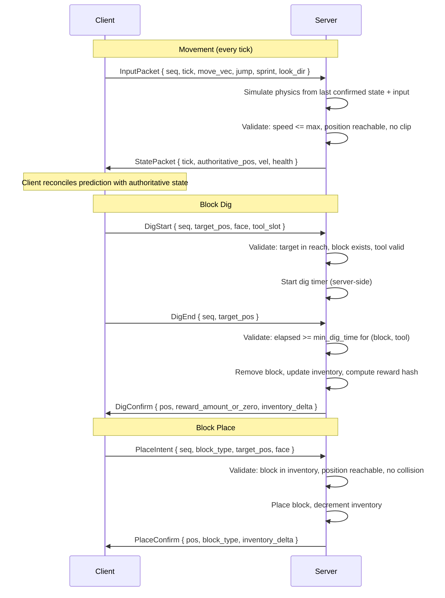
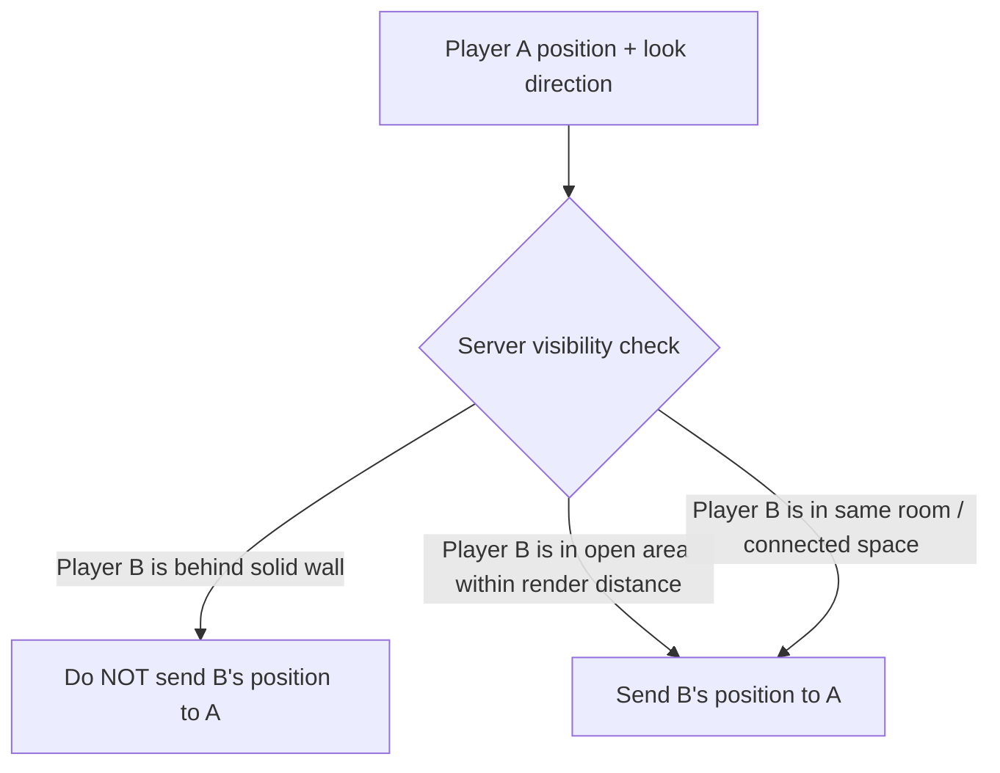
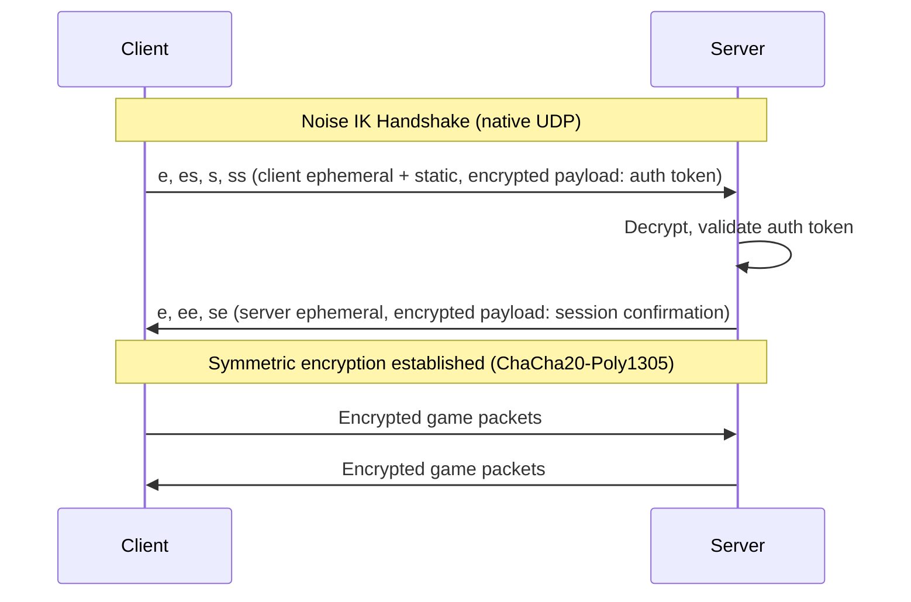
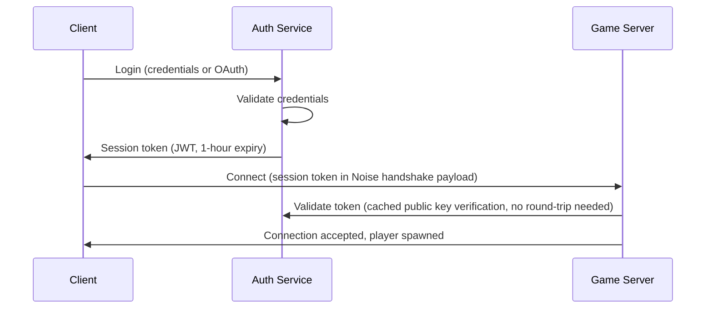
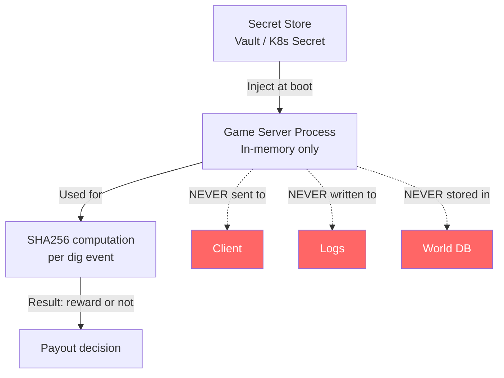
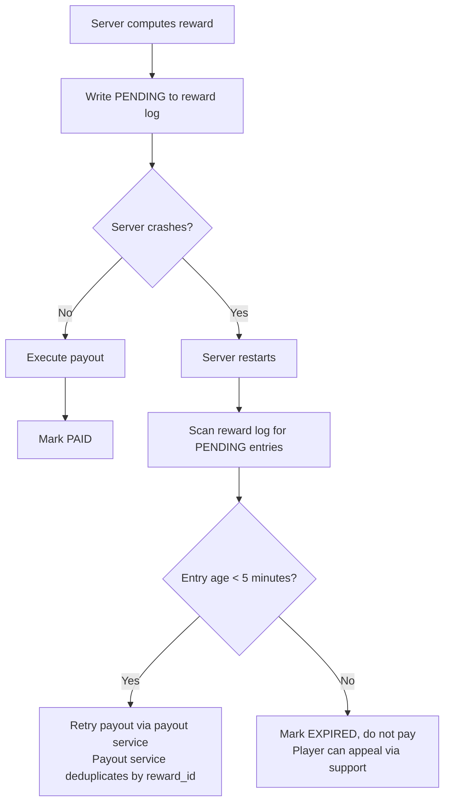
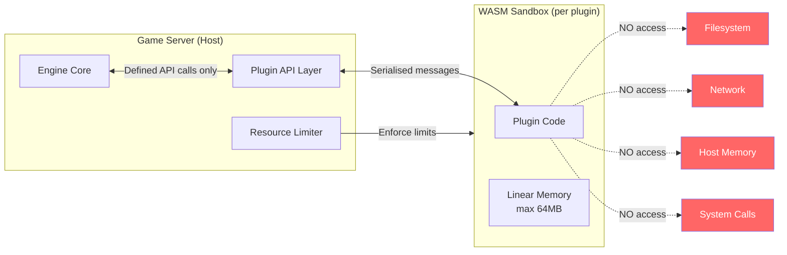
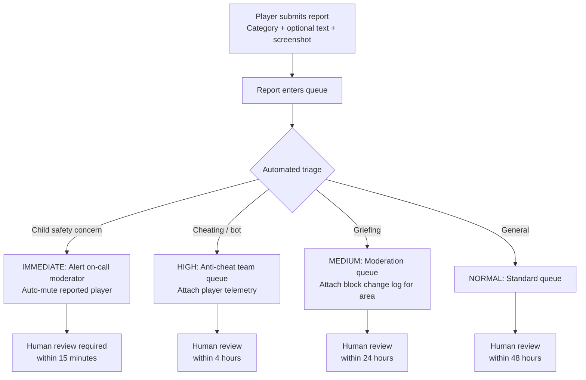

# 08 -- Security and Anti-Cheat

**Status**: Draft
**Last updated**: 2026-03-03
**Depends on**: ADR-001 (Full Custom Engine), ADR-002 (Tech Stack), platform-overview, luanti-bitcoin-integration (reward mechanic heritage)

---

## 0. Preamble -- Why This Spec Exists

Axe'n'Stax is an open-source, server-authoritative voxel sandbox built around Proof of Play — an educational proof-of-work primitive (Spec 06 §2.2c.6) that, on servers whose operator has enabled the optional Bitcoin capability layer (Spec 06 §1), converts mining effort into real Bitcoin payouts the operator sends. That combination defines the threat landscape:

- **Open source** means every attacker can read every line of server and client code.
- **Operator-enabled Bitcoin payouts** mean the incentive to cheat is not cosmetic on a server that has turned them on -- it is financial theft, from the operator who funds the payouts.
- **Server-authoritative** is the primary defence, but it must be implemented without gaps.
- **Two deployment tiers** (personal single-binary and production K8s) mean the security model must degrade gracefully, not catastrophically, on less hardened infrastructure.

This spec assumes a sophisticated, financially motivated adversary with full source access, the ability to build modified clients, and the willingness to operate bot farms. Every defence described here must hold under those assumptions.

---

## 1. Threat Model

### 1.1 Adversary Classes

| Class | Capability | Motivation | Risk |
|---|---|---|---|
| **Script kiddie** | Runs pre-built cheat tools, modified client binaries | Griefing, free Bitcoin, bragging rights | Medium volume, low sophistication |
| **Bot operator** | Operates headless client farms, custom automation | Bitcoin farming at scale | High -- direct financial drain on reward pool |
| **Modified client user** | Builds or downloads custom client with altered physics, rendering, or protocol handling | Speed hacks, fly hacks, X-ray, reach exploits | High -- bypasses all client-side assumptions |
| **Network attacker** | Packet injection, replay, man-in-the-middle, DDoS | Service disruption, session hijacking, reward theft | High -- affects all connected players |
| **Malicious server operator** | Runs a self-hosted server with modified server code | Fake reward claims against the platform payout system, data harvesting from connecting players | Critical for platform-connected servers |
| **Malicious plugin author** | Publishes a WASM plugin that attempts sandbox escape or data exfiltration | Steal server secrets, crash server, exfiltrate player data | Medium -- contained by WASM sandbox |
| **Insider threat** | Developer or operator with access to production secrets | Steal reward pool funds, plant backdoors, leak server secrets | Critical -- mitigated by process, not just code |
| **Colluding players** | Groups coordinating to maximise reward extraction | Reward farming, territory control for bot operations | High -- hard to distinguish from legitimate play |

**A note on the download/update surface itself** (distinct from the "Modified
client user" row above, which is about a player *choosing* to run an altered
build): the native Linux AppImage's in-place updater
(`game/engine/src/self_update.rs`, 2026-09-03) installs ONLY what the
**signed kind-30063 release event** names (`nostr_release.rs`, author pinned to
`RELEASE_PUBKEY_HEX`, signature verified): that event is the sole authority for
the version, the download URL and the sha256 (audit 2026-09-27,
`update_check::decide`). The unsigned `docs.axenstax.org/download/latest.json`
manifest is only a hint: its URL may be tried as a mirror, but its bytes must hash
to the SIGNED sha256; with no signed event it can at most show a notify-only
"update available" (no install button). The sha256 is checked before the swap,
and the AppImage filename must be a bare `[A-Za-z0-9._-]+\.AppImage` basename so
the `.part` file can only land next to the target. A compromise of the docs host
can therefore no longer choose the installed bytes; the remaining trust root is
the release-signing key. See `docs/superpowers/specs/2026-07-29-native-version-update-indicator-design.md`
§ "In-place update" for the full flow.

### 1.2 Attack Targets

| Target | Impact if Compromised |
|---|---|
| **Reward pool** | Direct financial loss -- sats drained by illegitimate claims |
| **Server secret** (Proof-of-Play salt) | Attacker can pre-compute which positions yield Bitcoin rewards or rare-drop lucky strikes; bot to those positions only |
| **Player accounts** | Stolen Bitcoin balances, identity theft, impersonation |
| **World state** | Duplication exploits, grief damage, economic disruption |
| **Platform availability** | DDoS takes servers offline, disrupts payouts, erodes trust |
| **Player privacy** | PII exposure, especially dangerous for minor players |
| **Payout system** | Double payouts, phantom payouts, redirect to attacker wallets |

### 1.3 Risk Matrix

```
              LOW IMPACT    MEDIUM IMPACT    HIGH IMPACT    CRITICAL IMPACT
           +-------------+----------------+--------------+----------------+
  LIKELY   | Chat spam    | Speed hacks    | Bot farms    | Reward pool    |
           |              | Fly hacks      | Mining bots  | drain          |
           +-------------+----------------+--------------+----------------+
  POSSIBLE | Minor grief  | X-ray (PvP)    | Account      | Server secret  |
           |              | Reach exploits | takeover     | compromise     |
           +-------------+----------------+--------------+----------------+
  UNLIKELY | Texture      | Plugin escape  | Network MitM | Insider theft  |
           | glitches     |                | on prod      |                |
           +-------------+----------------+--------------+----------------+
```

### 1.4 Foundational Security Principles

1. **Never trust the client.** The client is a suggestive input device. The server simulates and confirms everything.
2. **Defence in depth.** No single mechanism is the complete answer. Layer server authority, statistical detection, rate limiting, and economic disincentives.
3. **Assume source is read.** Security-through-obscurity is not a factor. Every algorithm described here is public. Security rests on server secrets, cryptographic primitives, and server-side validation.
4. **Fail closed.** When validation is ambiguous, deny the action and log the event. Do not grant rewards on uncertain inputs.
5. **Minimal privilege.** Clients receive only the data they need. Plugins receive only the APIs they request. Operators receive only the secrets their role requires.

---

## 2. Server Authority Model

### 2.1 Core Principle

The server is the single source of truth for all game state. The client is a rendering and input-capture layer. This is not optional -- it is the foundational security boundary.

### 2.2 Authority Boundary

| Domain | Client Responsibility | Server Responsibility |
|---|---|---|
| **Movement** | Sends movement intent (input vector, jump, sprint) | Simulates physics, validates resulting position, sends authoritative position back |
| **Block digging** | Sends dig-start and dig-end intents at a target position | Validates reach, tool type, dig duration, block type, then removes block and computes reward |
| **Block placement** | Sends place intent with block type and target position | Validates inventory, reach, collision, placement rules, then places block |
| **Inventory** | Displays server-provided inventory state | Owns all inventory state; client never modifies inventory |
| **Health/damage** | Displays server-provided health; plays damage effects | Computes all damage, healing, death, respawn |
| **Rewards** | Displays reward notification | Computes hash-on-mine, validates eligibility, triggers payout |
| **Chat** | Sends text input | Filters, rate-limits, delivers |
| **Chunk data** | Requests chunks near player position | Decides which chunks to send, what data to include |

### 2.3 Client-Server Protocol Flow



### 2.4 Client-Side Prediction and Reconciliation

The client runs a local physics simulation for responsiveness (movement prediction). When the server's authoritative state diverges from the client's prediction:

1. Client receives authoritative state for tick `T`.
2. Client discards predicted states up to `T`.
3. Client replays buffered inputs from `T+1` to current tick against the authoritative state.
4. If the corrected position differs from the displayed position by more than a visual threshold (0.1 blocks), the client smoothly interpolates over 100ms rather than snapping.

This means the client "feels" responsive but cannot move anywhere the server does not allow.

### 2.5 What the Client Never Determines

The following are **exclusively server-computed** and never accepted from client packets:

- Inventory contents or changes
- Health, hunger, status effects
- Reward outcomes (hash-on-mine results)
- Block dig completion (server tracks its own timer)
- Other players' positions or states
- World generation results
- Damage dealt or received
- Time of day, weather, or world events

---

## 3. Anti-Cheat Systems

### 3.1 Movement Validation

#### 3.1.1 Speed Check

The server maintains each player's authoritative position and velocity. Every tick:

```
max_speed = base_walk_speed
if sprinting: max_speed *= sprint_multiplier    # e.g., 1.3
if sneaking:  max_speed *= sneak_multiplier     # e.g., 0.3
if in_water:  max_speed *= water_multiplier     # e.g., 0.6
if status_effects: apply modifiers

distance = |new_position - last_confirmed_position|
elapsed  = current_tick - last_confirmed_tick
max_distance = max_speed * elapsed * tick_duration * tolerance_factor

# tolerance_factor accounts for network jitter: 1.15 (15% grace)
if distance > max_distance:
    reject movement, revert to last confirmed position
    record_violation(player, "speed", severity=distance/max_distance)
```

#### 3.1.2 Fly Detection

```
if player.position.y > ground_level + max_jump_height:
    if not player.has_flight_permission:
        if airborne_ticks > max_airborne_grace:  # e.g., 40 ticks (2 sec at 20 TPS)
            record_violation(player, "fly", severity=airborne_ticks)
            revert to last valid ground position
```

The server tracks `airborne_ticks` -- consecutive ticks where the player is not on a solid surface and not falling at expected gravity rate.

#### 3.1.3 Teleport Detection

```
if distance_this_tick > max_teleport_threshold:  # e.g., 10 blocks in one tick
    if not server_initiated_teleport:
        reject movement entirely
        record_violation(player, "teleport", severity=CRITICAL)
        revert to last confirmed position
```

#### 3.1.4 No-Clip Detection

After computing the new position, the server performs a swept-volume collision check:

```
ray = Ray(last_confirmed_pos, new_pos)
if world.ray_intersects_solid(ray, player_hitbox):
    reject movement
    record_violation(player, "noclip", severity=HIGH)
```

#### 3.1.5 Position Reconciliation

Every 500ms (10 ticks at 20 TPS), the server sends an authoritative position snapshot. If the client's displayed position has drifted more than `max_drift` (2.0 blocks) from the authoritative position, the client must hard-correct. This prevents slow accumulation of small exploits.

### 3.2 Mining Validation

#### 3.2.1 Dig Speed Check

The server maintains the canonical dig-time table:

```
min_dig_time(block_type, tool_type, tool_tier) -> Duration

# Example values:
# Stone + wooden_pickaxe = 1.15s
# Stone + diamond_pickaxe = 0.30s
# Stone + bare_hand = 7.50s
```

When `DigEnd` is received:

```
elapsed = now - dig_start_time  # server-tracked, not client-reported
expected = min_dig_time(block, tool, tier)
tolerance = 0.85  # allow 15% faster for latency compensation

if elapsed < expected * tolerance:
    reject dig
    record_violation(player, "fast_dig", severity=(expected - elapsed) / expected)
```

#### 3.2.2 Reach Check

```
distance = |player.eye_position - target_block_center|
max_reach = 4.5  # blocks (configurable per server)

if distance > max_reach + 0.5:  # 0.5 block grace for latency
    reject dig/place
    record_violation(player, "reach", severity=distance - max_reach)
```

#### 3.2.3 Tool Validation

```
equipped_tool = server_inventory[player.active_slot]
if dig_request.tool_slot != player.active_slot:
    reject (client claims different slot than server tracks)
if equipped_tool.type not in valid_tools_for(target_block):
    reject (wrong tool for block type)
```

#### 3.2.4 Line-of-Sight Check for Digs

The server raycasts from the player's eye position to the target block face:

```
hit = world.raycast(player.eye_pos, target_pos, max_reach)
if hit.block_pos != dig_request.target_pos:
    reject dig (player cannot see or reach the target block)
    record_violation(player, "hidden_dig", severity=HIGH)
```

### 3.3 Placement Validation

- **Inventory check**: Server confirms the player has the block type in inventory before placing.
- **Reach check**: Same as dig reach (4.5 blocks + 0.5 grace).
- **Collision check**: New block must not overlap with any entity hitbox (players, mobs).
- **Adjacency check**: New block must be placed against an existing block face (no floating placements unless the server's game rules allow it).
- **Rate limit**: Maximum placements per second (configurable, default 6/sec) to prevent placement-spam exploits.

### 3.4 Violation Scoring

The anti-cheat system uses a weighted violation score rather than simple strike counts. This provides nuance -- a single borderline speed violation is treated differently from a clear teleport hack.

```
violation_score: f32  # per player, decays over time

# Violation weights (configurable per server):
SPEED_MINOR    = 1.0    # slightly over speed limit
SPEED_MAJOR    = 5.0    # significantly over
FLY            = 8.0    # confirmed flight without permission
TELEPORT       = 15.0   # instant position change
NOCLIP         = 15.0   # movement through solid blocks
FAST_DIG       = 3.0    # digging faster than possible
REACH          = 4.0    # acting beyond reach distance
HIDDEN_DIG     = 10.0   # digging blocks not in line of sight

# Score decay: -1.0 per minute of clean play
# Thresholds:
WARN_THRESHOLD      = 10.0   # log warning, notify moderators
KICK_THRESHOLD      = 25.0   # disconnect with message
TEMP_BAN_THRESHOLD  = 50.0   # 1-hour temporary ban
PERM_BAN_THRESHOLD  = 100.0  # permanent ban (requires manual review on appeal)
```

#### 3.4.1 Configurable Sensitivity

Server operators can adjust violation weights and thresholds via server configuration. Production (Bitcoin-enabled) servers enforce platform minimums:

```toml
[anti_cheat]
# Operators can increase strictness but not decrease below platform minimums
min_speed_tolerance = 1.10        # cannot set below 1.10 (10% grace)
max_speed_tolerance = 1.50        # cannot set above 1.50
min_kick_threshold = 15.0         # cannot make it harder to kick cheaters
reward_eligible = true            # if true, platform minimums enforced
```

Personal-tier servers (LAN, no Bitcoin) can disable anti-cheat entirely.

---

## 4. Anti-Bot Measures

### 4.1 The Bot Threat

Bot operators are the highest-priority threat. A bot farm that can mine blocks 24/7 drains the reward pool and undermines the economy. Bots do not need modified clients -- they can operate within legal movement and dig speeds while still extracting rewards at inhuman efficiency.

### 4.2 Statistical Pattern Analysis

The server continuously analyses each player's mining behaviour using sliding windows.

#### 4.2.1 Timing Variance Analysis

Human players exhibit natural variance in dig timing. Bots tend toward mechanical regularity.

```
# Collect last N dig intervals (time between consecutive digs)
intervals: Vec<Duration>  # rolling window of last 100 digs

mean = intervals.mean()
std_dev = intervals.std_deviation()
coefficient_of_variation = std_dev / mean

# Human players typically: CV > 0.15
# Bot-like behaviour:      CV < 0.08

if coefficient_of_variation < BOT_CV_THRESHOLD:  # 0.08
    flag_for_review(player, "low_timing_variance", cv=coefficient_of_variation)
```

#### 4.2.2 Spatial Pattern Analysis

Human mining patterns are irregular -- players look around, change direction, mine opportunistically. Bots follow optimal paths.

```
# Track last N dig positions
positions: Vec<BlockPos>  # rolling window of last 200 digs

# Compute directional entropy
directions: Vec<Vec3> = consecutive_direction_vectors(positions)
direction_entropy = shannon_entropy(quantize_directions(directions, 26))
# 26 = number of discrete 3D directions on a cube grid

# Human players typically: entropy > 2.5 (out of max ~4.7)
# Bot-like strip mining:  entropy < 1.5

if direction_entropy < BOT_SPATIAL_THRESHOLD:  # 1.5
    flag_for_review(player, "low_spatial_entropy", entropy=direction_entropy)
```

#### 4.2.3 Session Duration Analysis

```
# Track continuous play session length
if session_duration > MAX_CONTINUOUS_PLAY:  # e.g., 8 hours
    if no_significant_pause_detected:       # no pause > 2 minutes in 8 hours
        flag_for_review(player, "inhuman_session", duration=session_duration)
        reduce_reward_eligibility(player, factor=0.5)
```

#### 4.2.4 Dig Efficiency Tracking

```
# Track ratio of reward-eligible digs to total digs
# and compare to expected statistical distribution

actual_reward_rate = rewards_received / total_digs
expected_reward_rate = current_difficulty_threshold  # from hash-on-mine config

# If a player consistently hits rewards at a rate significantly
# above expected, they may have compromised the server secret
if actual_reward_rate > expected_reward_rate * 3.0 over 1000+ digs:
    ALERT: possible server secret compromise
    flag_for_investigation(player, "anomalous_reward_rate")
```

### 4.3 In-Game Behavioural Challenges

Rather than intrusive CAPTCHAs, the server injects subtle behavioural tests:

#### 4.3.1 Reactive Event Challenges

The server periodically generates events that require human-like reaction:

- **Block shift**: A block near the player's mining area changes type mid-dig (server-side). A human notices and adjusts; a simple bot continues the same dig pattern.
- **Environmental event**: A mob spawns nearby or a block falls. The server tracks whether the player's movement/look direction reacts within a human-plausible window (200ms--2000ms).
- **Path obstruction**: The server places a temporary obstacle in the player's apparent mining path. A bot walks into it; a human routes around.

These challenges are **infrequent** (once per 10--30 minutes of continuous mining) and **invisible to legitimate players** (they just look like normal game events).

```
challenge_result = await observe_player_reaction(
    player, challenge_type, timeout=5.0s
)

if challenge_result == NO_REACTION:
    bot_suspicion_score += 5.0
if challenge_result == INHUMAN_REACTION:  # < 50ms
    bot_suspicion_score += 3.0
if challenge_result == HUMAN_REACTION:    # 200ms - 2000ms
    bot_suspicion_score -= 1.0            # reward natural behaviour
```

#### 4.3.2 Escalating Challenges

If a player accumulates bot suspicion, challenges become more frequent and more obvious:

1. **Tier 1** (low suspicion): Subtle environmental events, once per 30 minutes.
2. **Tier 2** (medium suspicion): Direct interaction required -- e.g., a dialog NPC appears and the player must click a non-trivial response.
3. **Tier 3** (high suspicion): Player is moved to a "validation zone" where they must complete a short, human-verifiable task before returning to mining.

### 4.4 Rate Limiting on Reward-Eligible Digs

Even if a bot evades detection, economic rate limits cap the damage:

```
# Per-player rate limits (configurable, these are platform defaults):
max_reward_eligible_digs_per_minute = 30
max_reward_eligible_digs_per_hour   = 1200
max_rewards_per_hour                = configurable  # based on difficulty
max_payout_sats_per_hour            = 1000          # hard cap per player

# Digs beyond the rate limit still break blocks (gameplay works)
# but are NOT eligible for reward computation
if player.reward_digs_this_minute >= max_reward_eligible_digs_per_minute:
    dig proceeds normally but skip_reward_computation = true
```

### 4.5 Input Fingerprinting

The client sends raw input data that carries a behavioural signature:

#### 4.5.1 Mouse/Look Movement Patterns

```
# Server tracks look-direction changes over time
look_deltas: Vec<(f32, f32)>  # (yaw_delta, pitch_delta) per tick

# Human characteristics:
# - Gaussian-like distribution of small movements with occasional large saccades
# - Non-zero micro-movements even when "still" (hand tremor)
# - Smooth acceleration/deceleration curves

# Bot characteristics:
# - Perfectly snapping to target directions (zero intermediate frames)
# - No micro-movements during pauses
# - Uniform angular velocity

tremor_score = compute_micro_movement_presence(look_deltas)
snap_score = compute_snap_frequency(look_deltas)

if tremor_score < HUMAN_TREMOR_MIN and snap_score > SNAP_THRESHOLD:
    flag_for_review(player, "robotic_look_pattern")
```

#### 4.5.2 Input Timing Fingerprint

```
# Humans cannot press keys with sub-millisecond precision
# Track intervals between input state changes

input_intervals = collect_input_change_intervals(player, window=60s)

# Check for clock-aligned inputs (bots often tick on exact intervals)
modular_distribution = input_intervals.map(|i| i % 50ms)  # 50ms = common bot tick
if modular_distribution.is_suspiciously_uniform():  # chi-squared test
    flag_for_review(player, "clock_aligned_inputs")
```

### 4.6 Hardware and Browser Fingerprinting

**Privacy constraint**: Axe'n'Stax collects the minimum fingerprint needed for bot detection and does not use it for tracking or advertising.

For the **web client** (WASM/WebRTC):
- WebGL renderer string (already exposed by browser)
- Canvas fingerprint (optional, with disclosure)
- Screen resolution and refresh rate
- Timezone offset

For the **native client**:
- GPU vendor/model (from wgpu adapter info)
- OS type and version
- Display configuration

**Usage rules**:
- Fingerprints are hashed (SHA-256) before storage -- the raw values are not retained.
- Fingerprints are used **only** for detecting multiple accounts from the same device (bot farm detection).
- Players are informed of fingerprint collection in the privacy policy.
- Fingerprint data is deleted when the account is deleted.

```
fingerprint_hash = SHA256(
    gpu_renderer + screen_res + timezone + os_version
)

# If more than N accounts (e.g., 3) share the same fingerprint_hash
# and all are actively mining on reward-enabled servers:
if accounts_per_fingerprint > MAX_ACCOUNTS_PER_DEVICE:
    flag_all_accounts(fingerprint_hash, "multi_account_same_device")
    reduce_reward_eligibility(flagged_accounts, factor=0.25)
```

---

## 5. Anti-X-Ray

> **Frame.** Anti-X-ray has two distinct concerns in Axe'n'Stax, and they are defended differently:
>
> - **Bitcoin-reward / rare-stone-drop X-ray** (which stone blocks will pay out?). Defended **architecturally** by Proof of Play (§5.1) — the hash that decides this is keyed on `server_secret`, which the client never receives.
> - **Visible-ore X-ray** (which buried diamond/iron/coal ore can I tunnel to?). Defended by **chunk-stream obfuscation** (§5.2.2) — the server omits buried ore from the chunk data it sends; the cheat can't render what it didn't receive.
>
> See [`docs/foundations/2026-05-12-proof-of-play-clarification.md`](../foundations/2026-05-12-proof-of-play-clarification.md) for the design rationale and how the two defences combine.
>
> **Implementation status (2026-09-28):** the reward-layer defence (§5.1) is live —
> `server_secret` genuinely never leaves the server today. **The chunk-stream
> obfuscation defence (§5.2.2) is built and unit-tested but not yet wired into
> the live chunk-stream send path** (`game/engine/src/anti_xray.rs` is
> `#![allow(dead_code)]`, called from nowhere else) — it lands with real
> remote-multiplayer chunk streaming. Until then, buried ore is **not**
> actually hidden from a modified client; don't describe it as active
> protection.

> **Scope note (audit 2026-10-04).** The visible-ore half of this frame does not apply to the built multiplayer: a joiner is sent the world **seed** in `JoinAccept` (`protocol.rs`, `JoinAcceptPacket.seed`) and regenerates terrain locally, so it holds the whole natural world, buried ore included, and there is no server-to-client chunk stream to obfuscate (the server never sends `ChunkData`). Chunk-stream anti-X-ray therefore protects nothing until real chunk streaming exists. The reward-layer defence (§5.1) is unaffected: it is keyed on `server_secret`, not the seed.

### 5.1 Why Proof of Play Defeats Reward-Layer X-Ray

The Proof-of-Play hash that drives Bitcoin payouts (Spec 6 §2.3, §2.4) and the hash-driven rare-drop tier on plain stone (Spec 6 §2.2b) are both computed at dig-time using:

```
reward_hash = HMAC-SHA256(server_secret, world_seed || epoch_id || block_position)
reward      = reward_hash < difficulty_threshold
```

Since `server_secret` is never sent to the client, and block positions are public knowledge, the client **cannot determine which plain stone blocks will yield a reward or a lucky-strike drop**. An X-ray client that highlights "valuable" stone blocks has nothing to highlight — every stone block is equally (un)valuable from the client's perspective. This is a fundamental architectural advantage for the *reward* and *rare-drop* layers — not a bolt-on.

**Visible ore blocks (coal, iron, diamond) are a separate concern.** They exist as distinct block types in the world data (Spec 6 §2.2b — gameplay progression, Minecraft-style guaranteed drops). The defence for them is chunk-stream obfuscation (§5.2.2), not the reward hash.

**Satori veins** (Spec 5 §3.8, Spec 6 §2.2c) are **architectural-by-construction** again, like the reward layer in this section. There is no "Satori block" type in the world data — pure deepslate is pure deepslate. Vein membership is determined by a dual-hash function over `server_secret` evaluated server-side at chunk-load time, stored in a sparse server-only bitmask. **The bitmask never crosses the wire to clients.** An X-ray client examining chunk data sees only pure deepslate; vein origins and propagation paths are computationally inaccessible without `server_secret`. Combined with the §5.2.2 chunk-stream obfuscation for buried deepslate (so X-ray can't even see the candidate blocks without exposing them), Satori veins inherit the strongest possible anti-X-ray defence available to AxeNStax's threat model.

### 5.2 PvP X-Ray (Seeing Through Walls)

If PvP is enabled, a modified client could still benefit from seeing through walls to spot other players. Two mitigation strategies apply:

#### 5.2.1 Strategy: Occlusion Culling on the Server

The server only sends entity position data for entities that are within the player's potential line of sight:



**Algorithm**:

```
for each other_player in nearby_players:
    if not server_has_line_of_sight(player.pos, other_player.pos):
        # Do not include in entity update packet
        skip
    else:
        include in entity update packet
```

The line-of-sight check uses a fast voxel traversal (Bresenham-style ray through the chunk data). This is computed server-side and is authoritative.

**Cost**: This requires a raycast per (player, other_player) pair per update tick. For `N` players in proximity, this is `O(N^2)` raycasts per tick within a region. Acceptable for small-to-medium servers (up to ~200 players). For larger servers, spatial partitioning (octree or grid) reduces the candidate set.

#### 5.2.2 Strategy: Chunk-stream block obfuscation (core anti-X-ray, design target — NOT yet wired, see status note above)

The same code path that hides PvP routes also hides **buried ore blocks** and any other gameplay block that the player has no current line-of-sight to. This is the primary defence against visible-ore X-ray.

```
for each block in chunk_section:
    if block.is_buried(world):
        // No air-facing neighbour reachable from any surface — replace
        // with plain stone in the chunk data sent to the client.
        send as STONE to client
    else:
        // Exposed (visible in a cave wall / ravine / cliff face / surface)
        // — send the real block type. The X-ray cheat reveals nothing new
        // because the player could already see it.
        send actual block type
```

A block is "buried" if **none** of its 6 face-neighbours is a non-solid block that is itself visible. This is computed once at chunk-send time and cached until the chunk is modified. When the player breaks adjacent stone and a previously-buried ore becomes exposed, the server sends a chunk update revealing the real block.

**Design intent: ON for any server that ships visible ore block types** (which is all of them, given Wave 13 coal/iron/diamond ore) — once wired. The earlier "disabled by default" framing applied to a narrower PvP-only cave-route use case; once the engine has visible ores carrying gameplay value, the obfuscation is no longer meant to be optional. As of 2026-09-28 this is not wired at all (see the status note at the top of §5), so today it is neither on nor off — it doesn't run.

**Cost**: one pass per chunk at chunk-send time, cached until the chunk mutates. Re-meshing on cave breakthrough is a single chunk update — Minecraft does this every day. Acceptable on all server profiles.

**Why this matches Minecraft's caving loop.** Exposed ore in a cave wall is visible to anyone walking the cave; finding it that way is the canonical Minecraft loop. Buried ore that's invisible without X-ray is *also* invisible to the X-ray cheat once the chunk stream filters it out. Strip-miners can still tunnel and luck into ore as they expose new stone; cheat users gain no advantage.

### 5.3 What Cannot Be Hidden

Block types for gameplay-relevant blocks that are **exposed** (water, lava, crafting stations, chests, exposed ore blocks in cave walls) must be sent accurately to the client for rendering. This is acceptable because:

- The only secret worth protecting at the *reward* layer (which stone blocks pay out, which stone blocks roll a lucky-strike rare drop) is computed server-side from a `server_secret` the client never has.
- Exposed ore blocks are visible during normal play anyway — the X-ray cheat reveals nothing new about them.
- Buried ore blocks are hidden by §5.2.2 chunk obfuscation, so X-ray of unexposed ore yields nothing.

The combination — architectural defence for the reward layer (§5.1) and chunk-stream obfuscation for the visible-ore layer (§5.2.2) — covers every X-ray vector relevant to AxeNStax's gameplay + reward model.

---

## 6. Network Security

### 6.1 Encryption

All client-server communication is encrypted in transit:

| Transport | Encryption | Key Exchange |
|---|---|---|
| **UDP (native client)** | Noise Protocol Framework (IK pattern) | Server has a static public key; client authenticates server and establishes symmetric session keys during handshake |
| **WebRTC (web client)** | DTLS 1.3 (mandatory per WebRTC spec) | Standard WebRTC DTLS handshake; server identity verified via signalling server |

**Noise IK pattern** was chosen for the native client because:
- It provides server authentication in 1 round trip (important for game latency).
- It is simpler than TLS for UDP datagrams.
- It provides forward secrecy via ephemeral keys.
- It is well-audited and widely implemented in Rust (`snow` crate).



### 6.2 Authentication

#### 6.2.1 Session Token Flow



Session tokens are JWTs signed by the auth service's private key. Game servers validate tokens using the auth service's public key (distributed via configuration, not fetched per-request).

**Token contents**:
```json
{
  "sub": "player_uuid",
  "iat": 1709500000,
  "exp": 1709503600,
  "age_band": "16+",
  "ip_hash": "sha256(client_ip)[0:8]",
  "device_fp": "sha256(device_fingerprint)[0:8]",
  "permissions": ["play", "chat", "mine_rewards"]
}
```

#### 6.2.2 Token Binding

To mitigate stolen tokens:
- `ip_hash` is checked against the connecting client's IP. A mismatch does not immediately reject (VPNs, mobile networks) but increases scrutiny and is logged.
- `device_fp` is checked against the client's reported fingerprint. Mismatch triggers re-authentication.
- Short expiry (1 hour) limits the window of token theft exploitation.
- Token refresh requires the original auth credentials (cannot refresh with just the token).

### 6.3 Replay Protection

Every packet includes:
- **Sequence number**: monotonically increasing `u64`, per session.
- **Nonce**: derived from sequence number (used as AEAD nonce).

```
# Server maintains a sliding window of received sequence numbers
window_size = 1024  # accept packets within last 1024 sequence numbers

if packet.seq <= last_confirmed_seq - window_size:
    drop (too old)
if packet.seq in received_bitmap:
    drop (replay detected, log event)
else:
    mark packet.seq in received_bitmap
    process packet
```

### 6.4 Packet Integrity

All packets use **AEAD (Authenticated Encryption with Associated Data)**:
- **Algorithm**: ChaCha20-Poly1305 (from Noise handshake session keys).
- **Associated data**: packet header (sequence number, packet type) is authenticated but not encrypted, allowing routers to operate on headers without decryption.
- Any packet that fails authentication is silently dropped and logged.

### 6.5 DDoS Resistance

#### 6.5.1 Connection Cookies

Before allocating any server state for a new connection, the server requires a handshake cookie:

```
# Client sends: ConnectRequest { client_random }
# Server responds (stateless): ConnectChallenge { cookie }
#   where cookie = HMAC-SHA256(server_cookie_key, client_ip || client_random || timestamp)
# Client sends: ConnectResponse { cookie, client_random, ... }
# Server validates cookie (no state was allocated until this point)
```

This prevents SYN-flood-style attacks where an attacker sends thousands of connection requests from spoofed IPs.

#### 6.5.2 Rate Limiting

```toml
[rate_limits]
# Per IP address:
max_connections_per_ip = 5           # simultaneous connections
max_connect_attempts_per_minute = 10 # new connection attempts
max_packets_per_second_per_ip = 200  # total packet rate

# Per authenticated account:
max_sessions_per_account = 2         # simultaneous sessions (allow reconnect overlap)
max_actions_per_second = 30          # game actions (dig, place, interact)
max_chat_messages_per_minute = 20    # chat rate limit
```

#### 6.5.3 Infrastructure-Level DDoS

Application-level mitigations are necessary but not sufficient. Production deployments must also use:
- **Cloud DDoS protection** (e.g., AWS Shield, Cloudflare Spectrum for UDP).
- **Anycast routing** for UDP traffic across multiple edge locations.
- **Traffic scrubbing** before packets reach game servers.

These are deployment concerns documented in the infrastructure spec, not application-level code.

---

## 7. Payment Security

### 7.1 Server Secret Protection

The hash-on-mine server secret is the most sensitive value in the system. If compromised, an attacker can pre-compute which block positions yield rewards.

**Protection requirements**:

| Requirement | Implementation |
|---|---|
| Never in client memory | Secret exists only in server process memory; never included in any client-bound packet |
| Never in logs | Log system strips any field named `*secret*`, `*salt*`, `*key*` before writing |
| Never in environment variables (production) | Loaded from secret store (HashiCorp Vault, K8s Secrets with encryption at rest, or platform secret service) |
| Rotated regularly | New secret per "epoch" (configurable, default 24 hours); old secret remains valid for a grace period to handle in-flight digs |
| Split knowledge | No single person knows the production secret; it is generated and injected by automated tooling |



#### 7.1.1 Secret Rotation

```
epoch_id = floor(current_time / epoch_duration)
current_secret = derive_key(master_secret, epoch_id)
previous_secret = derive_key(master_secret, epoch_id - 1)

# For dig events:
reward_hash = SHA256(current_secret || block_position || epoch_id)

# Grace period: digs started in the previous epoch but completed
# in the current epoch use the previous_secret
if dig_started_in_previous_epoch:
    reward_hash = SHA256(previous_secret || block_position || epoch_id - 1)
```

### 7.2 Payout Validation and Caps

Multiple layers of caps prevent runaway payouts even if detection systems are bypassed:

```
# Per-player caps:
max_sats_per_player_per_hour = 1000
max_sats_per_player_per_day  = 10000
max_rewards_per_player_per_hour = 50

# Per-server caps:
max_sats_per_server_per_hour = 50000
max_sats_per_server_per_day  = 500000

# Platform-wide caps:
max_total_payouts_per_hour = 5000000  # monitored, triggers alert at 80%

# Pool balance check:
if reward_pool_balance < pending_payout_amount:
    deny payout
    log("PAYOUT_DENIED: insufficient pool balance", server, player, amount)
```

### 7.3 Double-Payout Prevention

Every reward event is assigned a unique `reward_id` before payout:

```
reward_id = UUID_v7()  # time-ordered for efficient indexing

# Payout flow:
1. Compute reward_hash -> eligible
2. Generate reward_id
3. INSERT INTO reward_log (reward_id, player, server, pos, amount, status='PENDING')
   -- UNIQUE constraint on (server_id, block_pos, epoch_id)
4. Call payout service with reward_id
5. Payout service checks: is reward_id already PAID or IN_PROGRESS?
   - If yes: reject (double-payout attempt)
   - If no: mark IN_PROGRESS, execute LN payment
6. On LN payment success: mark PAID
7. On LN payment failure: mark FAILED, retry with backoff (max 3 retries)
```

The `UNIQUE constraint on (server_id, block_pos, epoch_id)` ensures a given block position can only yield one reward per epoch, even if the server processes the dig event twice (crash recovery, network retry).

### 7.4 Crash Recovery



**Critical invariant**: The reward log write (step 2) happens **before** the payout attempt (step 4). If the server crashes between reward computation and log write, no payout occurs and no record exists -- the player loses that one reward but no money is lost.

### 7.5 Audit Trail

Every reward event is logged with full context for forensic analysis:

```rust
struct RewardLogEntry {
    reward_id:    Uuid,
    timestamp:    DateTime<Utc>,
    server_id:    ServerId,
    player_id:    PlayerId,
    block_pos:    BlockPos,
    epoch_id:     u64,
    tool_type:    ToolType,
    tool_tier:    u8,
    dig_duration: Duration,       // actual server-measured dig time
    reward_hash:  [u8; 32],       // the computed hash (secret is NOT logged)
    threshold:    [u8; 32],       // the difficulty threshold at time of dig
    result:       RewardResult,   // Eligible(amount) | NotEligible | Denied(reason)
    payout_status: PayoutStatus,  // Pending | InProgress | Paid | Failed | Expired
    session_id:   SessionId,      // links to player's current session
}
```

Audit logs are:
- **Append-only** (no updates or deletes in the log store).
- **Signed** with a per-server log-signing key (detect tampering by malicious operators).
- **Replicated** to the platform's central audit service within 60 seconds.
- **Retained** for a minimum of 2 years.

### 7.6 Reward Farming Collusion Detection

Colluding players or server operators may attempt to maximise reward extraction:

**Detection signals**:

```
# Signal 1: Server with abnormally high reward rate
if server.rewards_per_hour > platform_median * 3.0:
    flag_server("high_reward_rate")

# Signal 2: Players who only play on one server and have high reward rates
if player.servers_played == 1 AND player.reward_rate > expected * 2.0:
    flag_player("single_server_high_reward")

# Signal 3: Player-server affinity clustering
# If a group of players always play together on the same server
# and collectively extract rewards at unusual rates:
cluster = detect_player_clusters(by=server_affinity_and_timing)
for group in cluster:
    if group.collective_reward_rate > expected * 1.5:
        flag_group("possible_collusion", players=group.members)

# Signal 4: Self-hosted server with modified difficulty
# Platform-connected servers must use platform-provided difficulty thresholds
# Server reports its difficulty; platform verifies via audit log sampling
if server.reported_difficulty != platform_assigned_difficulty:
    ALERT: server tampering
    freeze_server_payouts(server)
```

### 7.7 Malicious Server Operator Mitigation

For self-hosted servers that connect to the platform payout system:

1. **Server attestation**: The game server binary includes a build hash. On connecting to the platform payout service, the server must prove it is running an unmodified binary (via remote attestation or signed binary verification).
2. **Difficulty assignment**: The platform assigns the difficulty threshold, not the server operator. The server receives the threshold as a signed value from the platform.
3. **Audit log verification**: The platform randomly samples reward log entries from connected servers and verifies internal consistency (dig times, positions, timing patterns).
4. **Payout escrow**: New servers have payouts held in escrow for 72 hours before release. Established servers with clean audit histories receive payouts after 1 hour.
5. **Reputation system**: Servers build trust over time. Trust score affects payout escrow duration, rate limits, and visibility in server discovery.

---

## 8. Plugin Sandboxing (WASM)

### 8.1 Sandbox Architecture

Plugins are compiled to WASM and run inside the `wasmtime` runtime with strict capability restrictions.



### 8.2 Capability Restrictions

| Capability | Allowed? | Notes |
|---|---|---|
| Filesystem read/write | No | Plugins use key-value store API provided by host |
| Network access | No | Plugins cannot make HTTP calls, open sockets, or resolve DNS |
| Raw memory access outside WASM linear memory | No | Enforced by WASM runtime |
| System calls | No | No WASI capabilities granted except `clock_time_get` |
| Spawn threads | No | Single-threaded execution per plugin instance |
| Access other plugins' memory | No | Each plugin has its own WASM instance |

### 8.3 Plugin API Surface

Plugins interact with the game exclusively through a defined API (exported host functions):

```rust
// World interaction (read-only by default, write with permission)
fn get_block(pos: BlockPos) -> BlockType;
fn set_block(pos: BlockPos, block: BlockType) -> Result<(), PluginError>;  // requires "world_write" capability
fn get_entities_in_radius(pos: Vec3, radius: f32) -> Vec<EntityInfo>;

// Player interaction
fn send_message(player: PlayerId, message: &str) -> Result<(), PluginError>;
fn get_player_position(player: PlayerId) -> Option<Vec3>;

// Event registration
fn on_block_dig(callback: fn(player: PlayerId, pos: BlockPos, block: BlockType));
fn on_player_join(callback: fn(player: PlayerId));
fn on_player_leave(callback: fn(player: PlayerId));
fn on_tick(callback: fn(tick: u64));

// Key-value storage (scoped to plugin, size-limited)
fn kv_get(key: &str) -> Option<Vec<u8>>;       // max key: 256 bytes, max value: 64KB
fn kv_set(key: &str, value: &[u8]) -> Result<(), PluginError>;
fn kv_delete(key: &str) -> Result<(), PluginError>;
// Total KV storage per plugin: 16MB default, configurable

// NOT EXPOSED: reward computation, server secret, raw network,
//              inventory modification, health modification, auth tokens
```

### 8.4 Resource Limits

```toml
[plugin.resource_limits]
# Per plugin, per tick:
max_cpu_instructions_per_tick = 10_000_000   # ~5ms at typical WASM speed
max_memory_bytes = 67_108_864                # 64 MB
max_kv_storage_bytes = 16_777_216            # 16 MB
max_api_calls_per_tick = 1000                # prevent API spam

# Per tick, across all plugins:
max_total_plugin_time_per_tick = 20_000_000  # 10ms at 20 TPS = 20% of tick budget

# Violation handling:
on_cpu_exceeded = "terminate_tick"   # kill this tick's execution, log warning
on_memory_exceeded = "terminate_plugin"  # OOM = plugin is killed
on_repeated_cpu_violations = "disable_plugin"  # 10 violations in 60 seconds
```

### 8.5 Malicious Plugin Detection and Termination

```
# Fuel-based execution metering (wasmtime fuel)
plugin_instance.set_fuel(max_cpu_instructions_per_tick)

# If fuel runs out mid-execution:
match plugin_instance.call(entry_point) {
    Err(Trap::OutOfFuel) => {
        plugin.cpu_violation_count += 1
        log_warning("Plugin {} exceeded CPU limit", plugin.name)
        if plugin.cpu_violation_count > 10 in last 60s:
            disable_plugin(plugin)
            notify_server_operator("Plugin {} disabled: repeated CPU violations")
    }
    Err(Trap::MemoryOutOfBounds) => {
        disable_plugin(plugin)
        notify_server_operator("Plugin {} disabled: memory violation")
    }
    Ok(_) => { /* normal completion */ }
}
```

### 8.6 Plugin Trust Tiers

| Tier | Source | Capabilities | Review |
|---|---|---|---|
| **Core** | Shipped with engine | Full API access | Developed and audited by core team |
| **Verified** | Published in official plugin registry | Standard API (no `world_write` by default) | Automated analysis + manual review |
| **Community** | Self-hosted, user-installed | Restricted API, lower resource limits | Server operator's responsibility |
| **Untrusted** | Unknown source | Minimal API, strict limits | Not allowed on platform-connected servers |

---

## 9. Account Security

### 9.0 Alpha Auth Threat Model (Phase 1α PWA)

**Status**: Active for Phase 1α. The broader Account Security model in §9.1+ describes post-alpha account methods; §9.0 describes what the PWA alpha actually ships.

Alpha auth is **Signet-only** (Sign-in with Signet via `mysignet.app`). Phone-resident Nostr keys sign a challenge; the WASM client never holds a private key. Identity threat model:

| Threat | Mitigation |
|---|---|
| Deep-link pubkey spoofing (`https://axenstax.com/play/#pubkey=<attacker>`) | HMAC-signed fragment: the callback mints `token = base64url(HMAC_SHA256(secret, "pubkey\|expires_ts"))` (60-s window) and `auth.js` POSTs to `/auth/verify-fragment` which constant-time-verifies. A bare fragment is rejected. |
| Fragment token replay | Single-use nonce table at `/auth/verify-fragment`; already-consumed tokens return 401. |
| CSRF against `/auth/verify-fragment` / `/admin/reload-whitelist` | `X-Requested-With: fetch` header + `SameSite=Strict` session cookie. |
| Schnorr lib missing at startup → format-only fallback auth bypass | `HAS_SCHNORR=False` hard-fails startup. No silent fallback. |
| Third-party DoS of a real user's `/auth/callback` session | Session locks permanently after 3 failed signature verifies. |
| Whitelist bypass via direct `/play/` load | `/play/` is a FastAPI route (not a static mount). Reads `axenstax_session` cookie, constant-time-verifies HMAC, checks pubkey against `data/whitelist.txt`. Failures get the waitlist page. |
| `/admin/reload-whitelist` abuse | `X-Admin-Token` header + `hmac.compare_digest` + env var ≥ 32 chars + 1/sec rate limit. 503 if token unset/short. |
| XSS writing attacker pubkey to `localStorage` | Strict CSP on `/play/`: `default-src 'self'; script-src 'self'; connect-src 'self' wss://relay.trotters.cc https://mysignet.app; object-src 'none'; base-uri 'self'; frame-ancestors 'none'`. Plus `X-Frame-Options: DENY`, `Referrer-Policy: no-referrer`. `localStorage` never trusted server-side — session cookie is the only identity anchor. |
| Referrer leakage of `signature=`/`token=` | `auth_success.html` carries `<meta name="referrer" content="no-referrer">` plus global header. |
| Rogue NIP-17 publisher to the auth relay | `signet-verify.waitForAuthResponse` filters subscribe by `#p: [sessionPubkey]` (ephemeral, unguessable); verifies seal signature, rumor/seal pubkey binding, origin tag, challenge match. |

**Secret storage** (`tools/website/data/fragment_hmac.key`): 32 random bytes, mode 0600, created once on first startup (read-or-create pattern — never regenerated on subsequent boots; if the file is corrupt, server refuses to start rather than silently mint a new key).

**Cookie**: `axenstax_session = base64url(HMAC_SHA256(secret, "pubkey|expires_ts")) + "|" + pubkey + "|" + expires_ts`. `HttpOnly; Secure; SameSite=Strict; Path=/`, 4-hour expiry.

**Out of scope for alpha**: credentials (age, jurisdiction), NIP-46 remote signing, account recovery, multi-device session linking.

**Build spec of record**: `docs/superpowers/specs/2026-04-18-pwa-alpha-phase-2.md` §Tasks 2, 3, 5.

---

### 9.0.1 Persona Handle Impersonation (Multiplayer Threat)

**Status (2026-06-16 — Phase 4 SHIPPED, protocol v49)**: the mitigation is **LIVE in code**. Engine-side verification (`signet::verify_auth_event`, `signet::verify_credential`, `ChallengeTable`, the `JoinRequestPacket.{auth_event, handle_credential}` wire shape) landed in Phases 1–3; the **Phase 4 cutover landed 2026-06-16**: the handshake reorders (authed client waits for `ChallengePacket` → signs `{nonce, origin}` off the main loop → sends `JoinRequest` with the signed `auth_event`); the server verifies any present auth_event (tamper/invalid → reject) and rejects an *absent* one on a sign-in-required host (`HostedServer.require_signin`). **Sign-in is the default on every host type** (2026-10-06, owner decision O-7 #3): the QUIC LAN host and the online host always required it; the dedicated server now does too (`server_main::load_access_policy` → `true` unless `--allow-guests` / `AXENSTAX_ALLOW_GUESTS=1` (bare, or with a boolean value — `--allow-guests 0` / `=false` does **not** open the server, and a value that is not a boolean word refuses to boot), or the operator's `<identity-dir>/require_signin` file is present and says anything other than `true`; the old `--require-signin` / `AXENSTAX_REQUIRE_SIGNIN` are accepted no-ops). The `require_signin` file, when present, wins over the flag and env var both ways. **Guest-open is an explicit operator act on a fresh install, but not necessarily on an upgraded one:** a server set up with the *old* Operator Console wizard (before 2026-10-06, whose access step defaulted to "Anyone") already carries a `<identity-dir>/require_signin` file reading `false`, so it keeps admitting guests after the engine upgrade until the operator changes it. The identity directory is `<worlds>/.identity` (`AXENSTAX_IDENTITY_DIR` overrides it; `/worlds/.identity` in the Docker image). To check: the boot log's `access :` line says whether guests are admitted, the Operator Console's *Require sign-in* toggle (Access panel) shows the file's state, or read the file. To switch: tick that toggle (or re-run the setup wizard and pick *Signed-in players*), or write `true` into the file, or delete it (then the default applies: sign-in required, unless the server is started with `--allow-guests` / `AXENSTAX_ALLOW_GUESTS=1`); the running server picks the change up within ~5 s. Native `ws://` joins sign in when a signer is restored (the same unbound-origin signature as the web path — the WS relay residual in Spec 04 §1.8.1 applies); the web build has no signer, so browser players and the showcase kiosk need a guest-open server. **`USE_SIGNET_AUTH` is RETIRED** — identity is policy-driven (`hosted_server::resolve_join_identity`), not flag-gated. `player_name` is now a **display fallback only**, never trusted; the verified npub is stored on `ServerPlayer.verified_pubkey`. Remaining = **owner 2-machine LAN + real-bunker live test only** (not solo-verifiable). The threats below are now mitigated as described.

The gaming identity pattern — persona pubkey + kind-31000 display-name credential — is the foundation of multiplayer identity. `JoinRequestPacket.player_name: String` was the **client-asserted** BRIDGE; as of the Phase 4 cutover (2026-06-16) it is a **display fallback only** — never trusted for identity, which now derives from the verified `auth_event` pubkey. Threat model (all mitigations now live in code):

| Threat | Mitigation |
|---|---|
| Client picks any display name (including another player's handle) | Server reads handle from the signed kind-31000 `display-name` tag only. The `player_name: String` field is deprecated as BRIDGE. |
| Attacker forges a kind-31000 with someone else's display name, signed by their own key | Credential pubkey MUST equal auth-event pubkey — signature check binds handle to authenticated identity. A forged credential has the wrong signer. |
| Attacker replays a kind-31000 they intercepted from another user | Kind-31000 signature is bound to its signer. The attacker's auth event is signed by their own key; the mismatch between auth-event pubkey and the replayed credential's pubkey is rejected in verification step (2) of §1.8.1. |
| Superseded / revoked credential still accepted | Server checks `expires_ts > now` on the credential. Post-alpha: periodic relay re-fetch picks up supersessions between sessions. |
| Banned user renames themselves in Signet-app to escape ban | Bans keyed on **persona pubkey** (stable, never changes). Handle is presentational; ban doesn't depend on it. |
| Player deliberately uses natural-person identity for gaming (leaks real name) | Mitigated at the Signet-app layer: `accept=persona` URL hint from the gaming consumer filters the approval-screen picker to persona options only. Natural-person never appears as a signing choice for gaming origins. (This is a Signet-app feature, not protocol.) |
| Persona-for-gaming convention not enforceable if a consumer forgets `accept=persona` | Signet-app global default "prefer persona for sign-ins" + soft-block warning on natural-person selection provides belt-and-braces — even unconfigured consumers nudge toward personas. |
| **T-JOIN-RELAY** — a malicious host M dials a real host H, forwards H's challenge to victim V, gets V's signature, and joins H as V (past H's allowlist; if V is H's operator, M receives the OperatorSnapshot). Possible until v63 because the client signed the server-supplied origin verbatim and every host's origin was `https://localhost:<port>`. | **Protocol v63**: the signed origin is channel-bound. Client and server each compute `axenstax-join:tls-exporter:<hex>` from their OWN QUIC connection's TLS keying-material exporter (`signet::join_origin`, `network::channel_binding_of`); `ChallengePacket` no longer carries an origin. V's signature carries the V↔M exporter, H computes the H↔M one, and the join is rejected ("auth event origin mismatch"). Works although TLS certificate verification is skipped: the two sessions still have different keys. **The reverse direction is covered too:** the server-identity proof in `JoinAccept` (pinned `#op=` operator) is signed over `"axenstax:server-identity:v1|" + join_origin(binding)`, so M can no longer forward a pinned client V's nonce to H and pass H's proof back as its own (`server_identity::proof::server_identity_origin`, Spec 04 §1.8.1). **WebSocket residual — mitigated (owner decision 2026-09-28, protocol unchanged at v64):** WS TLS ends at Caddy, so WS joins have no end-to-end binding; both legs sign/verify `axenstax-join:unbound` and neither the join signature nor the identity proof is relay-protected there. A relaying WS server M can therefore still replay a victim V's signature to a WS server H and be admitted **as V** (past the allowlist) for ordinary play. What it can no longer get: **operator privileges require a channel-bound join.** A join whose transport reports `channel_binding() == None` never receives the `OperatorSnapshot` and never gains operator status from its join identity, even when its verified npub is the operator's (`HostedServer::has_operator_privileges`); the operator is sent the system line "Operator tools need a direct connection." and otherwise plays normally. QUIC joins are unchanged. A `ws://…#op=` pin can still be satisfied by a relay. **Admin commands (kind 27422) are audience-bound and replay-deduped:** each signed command must carry `["server", <server runtime npub>]` (added by `--admin-sign` from the identity dir; `server_identity::admin::sign_admin_command`), and the server rejects a missing or foreign tag (`AdminError::WrongServer`), so a command for one of an operator's servers can't be replayed to another within the 300 s skew window; accepted event ids are remembered for that window in `admin-seen.json` (`AdminReplayGuard`, shared by `--admin` and the relay listener) and a repeat is rejected (`AdminError::Replayed`). Remaining option, not implemented: an end-to-end WS binding. Certificate verification and server-identity pinning of the TLS layer remain out of scope. |
| **T-JOIN-ORACLE** — a malicious host sends `origin = "https://play.axenstax.com"` plus a CSRF challenge taken from that site, and the victim's bunker signs a valid website login for the attacker. | **Protocol v63**: the client never signs a server-supplied origin. A join origin always begins `axenstax-join:`, which can never equal an `https://` web origin, so a join signature is useless as a web login on every transport. |
| **T-NP-LEAK** — player signs `JoinRequest` with their natural-person key (either by falling back on Signet's approval screen despite `accept=persona`, or via a hostile consumer asking for NP). Impact: real name leaks to chat, leaderboards, and any other player on the server. | Server rejects any auth event flagged `fromNP=true` (see `docs/spec/04-networking.md §1.8.6`). Signet's NP-ceiling default-on (`signet-app` 99f7b57) prevents accidental NP selection; the `accept=persona` hint prevents the approval screen from offering NP as a one-tap option. Both are defences-in-depth; server-side reject is the authority. |

**Status**: the multiplayer authenticated handshake is **implemented** (Phase 4, 2026-06-16, protocol v49). Phase 1α gameplay remains single-player per ADR-003, but the engine path is live for the LAN/dedicated multiplayer that rides on it; the `JoinRequestPacket` identity BRIDGE is removed (`player_name` is display-only). Only the owner's 2-machine live verification remains.

**Reference**: `docs/spec/04-networking.md §1.8` for protocol shape; `docs/foundations/2026-04-20-engine-signet-auth.md` for the four-phase implementation rollout.

---

### 9.1 Authentication Methods

| Method | Availability | Notes |
|---|---|---|
| **Email + password** | All accounts | Argon2id hashing, minimum 12-character password |
| **OAuth 2.0** (Google, Apple, GitHub) | All accounts | Preferred for reduced password fatigue |
| **Lightning auth** (LNURL-auth) | Opt-in | Passwordless authentication using LN wallet signature |
| **Passkeys / WebAuthn** | Opt-in | Hardware-backed authentication, strongest option |

### 9.2 Password Security

```
# Hashing: Argon2id with recommended parameters
argon2id(
    password,
    salt = random_bytes(16),
    time_cost = 3,          # iterations
    memory_cost = 65536,    # 64 MB
    parallelism = 4,
    output_length = 32
)

# Password requirements:
min_length = 12
max_length = 128
# No character-class requirements (length > complexity per NIST 800-63B)
# Checked against breach database (HaveIBeenPwned k-anonymity API)
```

### 9.3 Session Token Lifecycle

```
Token creation:  On successful authentication
Token format:    JWT (RS256, signed by auth service private key)
Token expiry:    1 hour (access token)
Refresh token:   7 days (stored securely, httpOnly cookie for web)
Token refresh:   Requires valid refresh token; issues new access + refresh pair
Token revocation: On logout, password change, or security event
                  Revocation list checked by game servers (distributed via pub/sub)
```

### 9.4 Stolen Token Mitigation

| Mitigation | Mechanism |
|---|---|
| **Short expiry** | 1-hour access tokens limit exploitation window |
| **IP affinity** | Token includes `ip_hash`; significant IP change triggers re-auth prompt (not hard block, to support mobile networks) |
| **Device binding** | Token includes `device_fp`; device mismatch requires re-auth |
| **Concurrent session limit** | Max 2 active sessions per account; new session beyond limit revokes oldest |
| **Anomaly detection** | Login from new country/device triggers email notification + optional 2FA challenge |

### 9.5 Two-Factor Authentication

**Mandatory** for accounts with:
- Bitcoin balance above a configurable threshold (default: 10,000 sats)
- Payout withdrawal requests
- Server operator accounts (platform-connected)

**Supported methods**:
- TOTP (RFC 6238) via authenticator apps
- WebAuthn / passkeys (preferred)
- Recovery codes (10 single-use codes, generated at 2FA setup)

**NOT supported**: SMS-based 2FA (SIM swap vulnerability).

### 9.6 Account Recovery

```mermaid
flowchart TD
    A[User requests recovery] --> B{Recovery method?}
    B -->|Email| C[Send recovery link<br>Single-use, 15-min expiry]
    B -->|Recovery codes| D[Accept valid recovery code<br>Invalidate used code]
    B -->|OAuth provider| E[Re-authenticate via OAuth]

    C --> F[User sets new password]
    D --> F
    E --> F

    F --> G[Invalidate all existing sessions]
    G --> H[Require 2FA re-enrollment<br>if previously enabled]
    H --> I[Send notification to all<br>registered email addresses]

    Note over F,I: If account has Bitcoin balance > threshold,<br>impose 48-hour withdrawal hold after recovery
```

---

## 10. Moderation and Abuse

### 10.1 Automated Chat Filtering

#### 10.1.1 Multi-Layer Filter Pipeline

```
Input text
  |
  v
[Layer 1: Regex blocklist]      -- Known slurs, explicit terms
  |                                Fast, catches obvious violations
  v
[Layer 2: Unicode normalisation] -- Detect evasion via homoglyphs,
  |                                 zalgo text, invisible characters
  v
[Layer 3: PII detection]        -- Regex + heuristics for phone numbers,
  |                                emails, addresses, SSNs
  |                                CRITICAL for child safety
  v
[Layer 4: Context classifier]   -- ML model (run server-side) for:
  |                                - Grooming pattern detection
  |                                - Hate speech
  |                                - Bullying / harassment
  |                                - Scam / phishing attempts
  v
[Layer 5: Age-band rules]       -- Stricter filtering for U13 and 13-15
  |                                age bands (from Signet verification)
  v
Output: ALLOW / FILTER / BLOCK / ESCALATE
```

#### 10.1.2 Age-Band Chat Rules

| Age Band | Chat Mode | PII Detection | Grooming Detection | Report Priority |
|---|---|---|---|---|
| **U13** | Pre-canned phrases only (no free text) | Block and alert | Maximum sensitivity | Immediate review |
| **13--15** | Free text, aggressive filtering | Block and warn | High sensitivity | Priority review |
| **16+** | Free text, standard filtering | Warn only | Standard sensitivity | Normal queue |
| **Unverified** | Treated as U13 on child-safe servers | Block and alert | Maximum sensitivity | Immediate review |

### 10.1b World Chat — Permission and Trust Model (native only)

**Status: SPEC**, `docs/foundations/2026-09-05-world-chat.md`. This is a genuinely different threat model from §10.1 above, not an extension of it. §10.1 assumes a centralised classifier service inspecting free text; world chat assumes no such service exists at all (red line 3 — no central collection of kids' data) and instead pushes the safety property into cryptographic identity plus a pure permission function evaluated by the server the player is already trusting. Native builds only; the web build has no chat surface to threat-model.

**(a) Server-side, per-recipient evaluation — never client-side filtering.** A line from speaker S reaches listener L only if `speak_ok(S) AND hear_ok(L)` (foundations doc §2.3) passes, evaluated once per connected recipient by the hosting server. The server never broadcasts a chat line and lets clients decide whether to show it. A client that filters incoming chat is a client that can be rebuilt without the filter — the permission boundary has to live in the one component an attacker cannot silently re-source at runtime, which is the running server process, not a binary a player has downloaded.

**(b) No chat without a verified pubkey.** A player with no verified pubkey (`ServerPlayer.verified_pubkey == None`) gets no chat: the UI is hidden, and any line arriving from them is dropped, not merely delivered unattributed. This is deliberate, not a convenience default. An anonymous chat path would hand a child a working bypass of their own guardian's ceiling — simply don't sign in, and the tier/Charter system governing a signed-in persona never engages. That is exactly the Grokster line the project holds (CLAUDE.md, "facilitate, never induce"): a capability boundary that is trivially optional in this one spot is indistinguishable from a "turn off safety" switch. The boundary is the key, not a checkbox, and there is no config file that lifts it.

**(c) Guardian copy — trust model.** When Charter says a child's chat is copied to their guardian, the copy is sent by the **child's own client**, from the child's **device key** (`native_mailbox`'s `mailbox_key.json`) — never the persona secret, which never lives on the machine to begin with, so there is nothing to leak here. It travels as a NIP-17 gift-wrapped rumour to the guardian's key, over the **family's own relays**, reusing the mailbox module's existing wrap/publish primitive. AxeNStax operates none of the relays this travels over and sees none of the plaintext. The child's HUD carries a **persistent, non-dismissable indicator** for as long as copying is active — a copy the child doesn't know about is surveillance; a copy they can see is parenting, and the indicator is what keeps those two distinguishable. This is a design requirement, not a nicety.

**(d) The room boundary.** The room (KithMoot) is a member of the world's conversation, not a side channel around it: a line is mirrored to the room only if the room's membership would pass the same tier rule, and a line from the room is delivered into the world under the same rule, attributed to whichever room member sent it. Two further constraints close off the obvious ways this boundary could leak:
- **Agents must be owned by a member** (`RoomPolicy.agents == "owned-by-members"`), enforced by the engine refusing to attach to a room whose link doesn't carry that policy — never a warning, a refusal. An unowned agent in a room with a child is an anonymous stranger with a language model attached, which is exactly what the tier system exists to prevent.
- **Relays are operator-supplied, never AxeNStax's own.** The code refuses an empty relay list rather than silently defaulting, and lints `relay.trotters.cc` out of any list it is given. This is not theoretical: KithMoot's own default relay list puts `relay.trotters.cc` first, so an engine that forgot to pass an explicit list would silently route a family's conversation through AxeNStax's discovery/sign-in/feedback infrastructure — red line 2 crossed by omission, not by design. The lint exists so that omission is caught, not shipped.

**(e) Rate limiting and sanitisation as DoS/injection surface.** Two structural checks sit in front of the permission rule, cheaper than it and applied first: a 256-byte length cap (rejected, not truncated, with a `System` line back to the sender naming the broken rule) and a 30-lines-per-minute-per-player token bucket, checked before any tier evaluation so an over-rate line costs no permission work. Both close off the same class of attack — a compromised or hostile client trying to burn server CPU or relay bandwidth by flooding lines — without needing content inspection. Rejection is always visible to the sender, never a silent drop; a chat that silently eats messages is a chat nobody trusts, and a silent drop is also indistinguishable from a bug, which is its own review cost.

**Reference**: `docs/foundations/2026-09-05-world-chat.md` §§1-4; wire shape in `docs/spec/04-networking.md` §2.3 (v60 addendum); UX in `docs/spec/05-gameplay-systems.md` §4.6.

### 10.2 Grief Prevention

#### 10.2.1 Build Protection Zones

```
# Protection types:
SPAWN_PROTECTION:    radius around spawn point, no modification except by operators
PLAYER_CLAIM:        claimed area (e.g., 32x32 chunks), only owner + permitted players can modify
SERVER_PROTECTED:    operator-designated areas (builds, arenas, infrastructure)

# Enforcement:
on_place_or_dig(player, pos):
    zone = get_protection_zone(pos)
    if zone is not None:
        if not zone.permits(player, action):
            deny action
            send_message(player, "This area is protected")
            return DENIED
```

#### 10.2.2 Rollback Tools

The server maintains a block-change log (append-only):

```rust
struct BlockChange {
    timestamp: DateTime<Utc>,
    player_id: PlayerId,
    position:  BlockPos,
    old_block: BlockType,
    new_block: BlockType,  // Air for digs
    action:    DigOrPlace,
}
```

Moderators can:
- **Rollback by player**: Undo all changes by a specific player within a time range.
- **Rollback by area**: Undo all changes within a region within a time range.
- **Preview rollback**: Show a diff before applying.

Block change logs are retained for a configurable period (default: 30 days). Older entries are archived to cold storage.

### 10.3 Report System



**Report categories**: Cheating, Botting, Griefing, Harassment, Inappropriate Chat, Child Safety Concern, Exploiting, Other.

**Reporter feedback**: Reporters receive a notification when their report is resolved (action taken / no action / insufficient evidence). This closes the feedback loop and encourages future reporting.

### 10.4 Platform-Wide Ban Propagation

```
# Ban types:
LOCAL_BAN:     applies to one server only (server operator decision)
PLATFORM_BAN:  applies to all platform-connected servers (platform moderation team)
SHADOW_BAN:    player can connect but is invisible to others, rewards disabled
                (used for investigation without alerting the target)

# Ban propagation for platform bans:
on_platform_ban(player_id, reason, duration):
    publish_to(ban_topic, BanEvent { player_id, reason, duration, timestamp })
    # All connected game servers subscribe to ban_topic
    # and disconnect the player within 30 seconds

# Ban storage:
# Centralised ban database, replicated to all regions
# Game servers cache ban list locally, refreshed every 60 seconds
# On connect, game server checks local ban cache (fast path)
# and validates against central DB (async, within 5 seconds)
```

### 10.5 Self-Hosted Server Moderation Opt-In

Self-hosted servers can opt into platform moderation at three levels:

| Level | What Server Receives | What Server Sends | Requirements |
|---|---|---|---|
| **Disconnected** | Nothing | Nothing | No platform features, no Bitcoin rewards |
| **Ban list only** | Platform ban list | Nothing | Must enforce platform bans to remain listed in server discovery |
| **Full platform** | Ban list + chat filters + report routing | Player reports, chat samples for filter training, telemetry | Required for Bitcoin reward eligibility |

---

## 11. Incident Response

### 11.1 Severity Classification

| Severity | Description | Example | Response Time |
|---|---|---|---|
| **SEV-1** | Active financial loss or child safety breach | Reward pool being drained by exploit; grooming detected | Immediate (15 minutes to acknowledge) |
| **SEV-2** | Confirmed exploit with potential for financial loss | Movement cheat bypassing all validation; payout double-spend found | 1 hour |
| **SEV-3** | Confirmed cheat/abuse with limited impact | Individual bot account; localised griefing | 4 hours |
| **SEV-4** | Suspected issue under investigation | Anomalous patterns in audit logs; unusual reward rates | 24 hours |

### 11.2 Response Procedures

#### 11.2.1 Server-Side Hotfix (No Client Update Needed)

Because the server is authoritative, most exploits can be fixed server-side without requiring a client update:

```mermaid
flowchart TD
    A[Exploit detected] --> B{Severity?}
    B -->|SEV-1| C[Freeze payouts immediately<br>via platform kill switch]
    C --> D[Identify exploit vector]
    B -->|SEV-2/3| D
    D --> E[Develop server-side fix]
    E --> F[Test on staging environment]
    F --> G[Rolling deploy to production<br>via Agones Fleet update]
    G --> H[Verify fix via audit logs]
    H --> I[Unfreeze payouts if frozen]
    I --> J[Post-incident review]

    Note over C: Payout freeze is a single<br>API call to the payout service.<br>No server restart needed.
```

#### 11.2.2 Payout Freeze Protocol

The platform payout service supports an emergency freeze:

```
POST /api/v1/payouts/freeze
Authorization: Bearer <incident-response-token>
{
    "scope": "platform" | "server:<server_id>" | "player:<player_id>",
    "reason": "string",
    "initiated_by": "operator_id",
    "duration_minutes": 60  // auto-unfreeze after this, or extend manually
}

# Effects:
# - All payout requests matching scope return 503 (Temporarily Unavailable)
# - Reward computation continues (audit trail preserved)
# - Players see "Payouts temporarily paused" message
# - Freeze event logged to incident log with full context
```

### 11.3 Post-Incident Forensics

The audit log system (Section 7.5) provides the foundation for forensic analysis:

```
# Forensic queries enabled by audit logs:
1. "Show all rewards claimed by player X in the last 24 hours"
2. "Show all rewards from server Y where dig_duration < expected_minimum"
3. "Show all players whose reward rate exceeded 3x expected in any 1-hour window"
4. "Show the exact sequence of events leading to a double-payout"
5. "Reconstruct the block-change history of a 100x100 area around position P"
6. "Show all sessions from IP address Z across all servers"
```

Audit logs are stored in an append-only, tamper-evident log store. Each entry is chained:

```
entry.hash = SHA256(entry.data || previous_entry.hash)
```

This makes post-hoc modification of logs detectable.

### 11.4 Responsible Disclosure Program

Axe'n'Stax operates a public responsible disclosure program:

- **Scope**: All client code, server code, protocol, payment flows, and plugin system.
- **Reporting channel**: security@axenstax.gg (GPG key published on website).
- **Response commitment**: Acknowledge within 48 hours, triage within 7 days.
- **Reward**: Bug bounty paid in Bitcoin via Lightning. Severity-based:
  - Critical (reward pool drain, RCE): 500,000--5,000,000 sats
  - High (account takeover, payout manipulation): 100,000--500,000 sats
  - Medium (information disclosure, privilege escalation): 10,000--100,000 sats
  - Low (minor information leak, DoS vector): 1,000--10,000 sats
- **Safe harbour**: Researchers acting in good faith will not face legal action.
- **Disclosure timeline**: 90 days from report to public disclosure, with extensions for complex fixes.

---

## 12. Privacy

### 12.1 Data Collection Inventory

| Data Category | What Is Collected | Retention | Legal Basis (GDPR) |
|---|---|---|---|
| **Account data** | Email, hashed password, display name, age band | Until account deletion + 30 days | Contract performance |
| **Session data** | IP address, session start/end, server connected to | 90 days | Legitimate interest (security) |
| **Game telemetry** | Player positions (sampled), dig/place events, chat messages | 30 days (raw), 1 year (aggregated) | Legitimate interest (anti-cheat) |
| **Payment data** | Lightning payment hashes, payout amounts, wallet identifiers | 2 years (legal/tax requirement) | Legal obligation |
| **Device fingerprint** | SHA-256 hash of device attributes (not raw attributes) | Until account deletion | Legitimate interest (anti-bot) |
| **Moderation data** | Reports, bans, chat filter triggers | 2 years | Legitimate interest (safety) |
| **Audit logs** | Reward events with full context | 2 years | Legitimate interest (fraud prevention) |

### 12.2 Data Minimisation

#### 12.2.1 Minors (Enhanced Protections)

For players in the U13 and 13--15 age bands:

- **No device fingerprinting** beyond what is needed for session security.
- **No behavioural analytics** beyond anti-cheat (no engagement metrics, no play-pattern profiling).
- **Chat messages deleted within 7 days** (unless involved in a moderation case).
- **Position telemetry retained for 7 days only** (vs 30 for adults).
- **No third-party analytics services** receive minor player data.
- **Parental/guardian access** to view what data is held (via Signet guardian link).

#### 12.2.2 Aggregation Over Raw Data

Where possible, analytics use aggregated data rather than individual records:

```
# Instead of storing: "Player X mined 347 blocks at positions [...]"
# Store: "Server Y had 15,000 blocks mined by 43 players between 14:00-15:00"

# Individual data is retained only for:
# - Active anti-cheat investigations
# - Reward audit trail (required for financial integrity)
# - Active moderation cases
```

### 12.3 Data Retention Policy

```
On account deletion request:
  1. Immediately: Remove from active player database
  2. Within 24 hours: Delete or anonymise all game telemetry
  3. Within 24 hours: Delete device fingerprint hashes
  4. Within 24 hours: Delete chat message history
  5. Within 30 days: Delete account record
  6. RETAINED (anonymised): Payment records (legal requirement, 2 years)
  7. RETAINED (anonymised): Audit log entries (replace player_id with "DELETED_USER")
  8. RETAINED: Active ban records (prevent re-registration to evade bans)
     - Ban records contain only: hashed identifiers, ban reason, expiry
     - No gameplay data, no chat history, no telemetry
```

### 12.4 Right to Deletion (GDPR Article 17)

Players can request account deletion through:
- In-game settings menu
- Web dashboard
- Email to privacy@axenstax.gg

**Processing**:
- Request acknowledged within 48 hours.
- Deletion completed within 30 days.
- Player is informed of what is retained and why (legal obligations).
- If the account has a Bitcoin balance, the player must withdraw before deletion (or the balance is forfeited after 90 days of account deletion request).

### 12.5 Analytics Without Compromising Privacy

```mermaid
flowchart TD
    A[Raw game events] --> B[On-server aggregation<br>within the game server process]
    B --> C[Aggregated metrics only<br>leave the server]
    C --> D[Platform analytics service]

    A -.->|Raw events NEVER leave<br>the game server except for:| E[Anti-cheat pipeline<br>security justified]
    A -.->|Raw events NEVER leave<br>the game server except for:| F[Reward audit trail<br>legally justified]

    D --> G[Dashboards:<br>- DAU/MAU counts<br>- Blocks mined per hour (server-level)<br>- Reward pool health<br>- Server performance metrics]

    Note over G: No individual player<br>identifiers in dashboards
```

**Specific analytics practices**:
- **No third-party tracking pixels or SDKs** in the client.
- **No advertising identifiers**.
- **Server-side aggregation**: The game server computes aggregates locally and sends only summary metrics to the analytics service.
- **Differential privacy**: When reporting statistics on small populations (e.g., a server with < 20 players), noise is added to prevent individual identification.
- **Player opt-out**: Players can opt out of non-essential analytics. Essential analytics (anti-cheat, payment integrity) cannot be opted out of but are disclosed in the privacy policy.

### 12.6 Cross-Border Data

- **Primary data storage**: EU (to benefit from GDPR as baseline).
- **Game servers in other regions**: Process data locally; telemetry and audit logs are replicated to EU storage within 60 seconds.
- **No data transfers to jurisdictions without adequate protections** unless covered by Standard Contractual Clauses.
- **Player data region preference**: Players can request their account data be stored in a specific region (EU, US, APAC) via account settings.

---

## Appendix A: Security Configuration Reference

```toml
# =============================================================================
# Axe'n'Stax -- Security Configuration
# =============================================================================
# This file documents all security-related server configuration options.
# Values shown are platform defaults for Bitcoin-enabled servers.
# Personal-tier servers may override with fewer restrictions.

[server.tier]
# "personal" = LAN/trusted, relaxed security
# "production" = internet-facing, platform-connected
tier = "production"

[anti_cheat.movement]
speed_tolerance_factor = 1.15       # 15% grace above max speed
max_airborne_ticks = 40             # 2 seconds at 20 TPS
teleport_threshold_blocks = 10.0    # instant move > this = violation
max_position_drift = 2.0            # blocks before hard correction
reconciliation_interval_ticks = 10  # authoritative position every 500ms

[anti_cheat.mining]
dig_speed_tolerance = 0.85          # allow 15% faster than table
max_reach_blocks = 4.5
reach_grace_blocks = 0.5
require_line_of_sight = true

[anti_cheat.placement]
max_reach_blocks = 4.5
max_placements_per_second = 6
require_adjacency = true
collision_check = true

[anti_cheat.scoring]
decay_per_minute = 1.0
warn_threshold = 10.0
kick_threshold = 25.0
temp_ban_threshold = 50.0
perm_ban_threshold = 100.0
temp_ban_duration_minutes = 60

[anti_bot]
timing_variance_threshold = 0.08    # coefficient of variation
spatial_entropy_threshold = 1.5     # Shannon entropy of dig directions
max_continuous_session_hours = 8
reward_digs_per_minute = 30
reward_digs_per_hour = 1200
max_payout_sats_per_hour = 1000
max_accounts_per_device = 3
challenge_interval_minutes = 30     # time between behavioural challenges
challenge_escalation_threshold = 10.0

[network]
encryption = "noise_ik"             # "noise_ik" (native) or "dtls" (webrtc)
replay_window_size = 1024
max_connections_per_ip = 5
max_connect_attempts_per_minute = 10
max_packets_per_second_per_ip = 200
connection_cookie_timeout_seconds = 10

[payments]
max_sats_per_player_per_hour = 1000
max_sats_per_player_per_day = 10000
max_sats_per_server_per_hour = 50000
max_sats_per_server_per_day = 500000
secret_rotation_hours = 24
secret_grace_period_minutes = 5
new_server_escrow_hours = 72
established_server_escrow_hours = 1
payout_retry_max = 3

[plugins]
max_memory_bytes = 67108864         # 64 MB
max_cpu_instructions_per_tick = 10000000
max_api_calls_per_tick = 1000
max_kv_storage_bytes = 16777216     # 16 MB
max_total_plugin_time_per_tick = 20000000

[sessions]
access_token_expiry_minutes = 60
refresh_token_expiry_days = 7
max_concurrent_sessions = 2
require_2fa_above_sats = 10000

[moderation]
chat_filter_enabled = true
pii_detection_enabled = true
grooming_detection_enabled = true
block_change_log_retention_days = 30
report_escalation_child_safety_minutes = 15

[privacy]
telemetry_retention_days = 30
telemetry_retention_days_minors = 7
chat_retention_days_minors = 7
session_retention_days = 90
audit_log_retention_years = 2
payment_retention_years = 2
deletion_completion_days = 30
analytics_differential_privacy = true
```

---

## Appendix B: Threat-to-Mitigation Traceability Matrix

| Threat | Primary Mitigation | Secondary Mitigation | Detection | Section |
|---|---|---|---|---|
| Speed hack | Server physics simulation | Violation scoring + auto-kick | Speed check every tick | 3.1.1 |
| Fly hack | Airborne tick tracking | Position reconciliation | Fly detection algorithm | 3.1.2 |
| Teleport hack | Distance-per-tick check | Immediate rejection | Teleport detection | 3.1.3 |
| No-clip | Swept-volume collision | Position reconciliation | Collision raycast | 3.1.4 |
| Fast mining | Server-side dig timer | Tool validation | Dig speed check | 3.2.1 |
| Reach exploit | Distance check per action | Line-of-sight raycast | Reach validation | 3.2.2 |
| X-ray (Bitcoin reward / rare-drop) | Proof-of-Play hash keyed on server_secret | N/A (architectural) | N/A (not possible) | 5.1 |
| X-ray (gem veins in deepslate) | Vein-membership bitmask server-side only; vein-origin + propagation hashes keyed on server_secret | Chunk-stream obfuscation for buried deepslate | N/A (data not sent) | 5.1 / 5.2.2 / Spec 6 §2.2c |
| X-ray (buried ore blocks) | Chunk-stream obfuscation (buried ore → stone) | Exposed-ore visibility (Minecraft loop) | N/A (data not sent) | 5.2.2 |
| X-ray (PvP, seeing players) | Server-side entity occlusion | Chunk-stream obfuscation (cave routes) | N/A (data not sent) | 5.2 |
| Mining bots | Behavioural analysis | Rate limits on rewards | Timing/spatial entropy | 4.2 |
| Bot farms | Device fingerprinting | Account-per-device limits | Multi-account detection | 4.6 |
| Packet replay | Sequence numbers + nonces | AEAD authentication | Duplicate detection | 6.3 |
| Packet tampering | ChaCha20-Poly1305 AEAD | Session key rotation | Auth failure = drop | 6.4 |
| DDoS | Connection cookies | Rate limiting per IP | Traffic anomaly detection | 6.5 |
| Server secret theft | Secret store + rotation | Split knowledge | Anomalous reward rates | 7.1 |
| Double payout | Unique reward_id + DB constraint | Payout service dedup | Audit log reconciliation | 7.3 |
| Reward farming collusion | Cluster analysis | Per-player/server caps | Reward rate monitoring | 7.6 |
| Malicious server operator | Server attestation | Difficulty assigned by platform | Audit log verification | 7.7 |
| Plugin escape | WASM sandbox (wasmtime) | Capability restrictions | Fuel metering + OOM | 8.1 |
| Account takeover | 2FA for high-value accounts | Short token expiry | Anomaly detection | 9.4 |
| Grooming | ML chat classifier | Age-band restrictions | Escalated moderation | 10.1 |
| Griefing | Build protection zones | Rollback tools | Player reports | 10.2 |
| Exploit in the wild | Server-side hotfix | Payout freeze | Audit log anomalies | 11.2 |
| Privacy violation | Data minimisation | Aggregation over raw data | Automated data audits | 12.2 |

---

## Appendix C: Open Items and Future Work

| Item | Priority | Notes |
|---|---|---|
| ML model selection for chat classification (grooming, hate speech) | High | Evaluate on-server inference vs API-based; must be low-latency |
| Remote attestation mechanism for self-hosted servers | High | Platform must verify unmodified server binary; TEE-based or reproducible builds |
| Formal verification of reward computation path | Medium | Prove no path from client input to reward outcome without server secret |
| Anti-cheat false positive rate benchmarking | High | Must be < 0.1% for kick-level violations in playtesting |
| Privacy impact assessment (DPIA) for minor players | Critical | Required before launch under GDPR Article 35 |
| Bug bounty program infrastructure and funding | High | Needs dedicated Bitcoin allocation before public launch |
| Rate limit tuning based on gameplay testing | High | All thresholds in this spec are initial estimates; must be validated with real play data |
| WebRTC-specific security audit | Medium | DTLS implementation, signalling server security, TURN server abuse |
| Incident response team on-call rotation | High | Operational concern; must be staffed before Bitcoin rewards go live |
